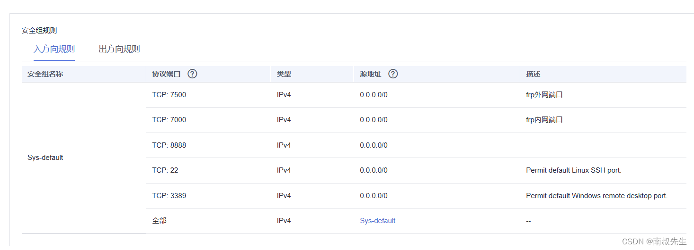
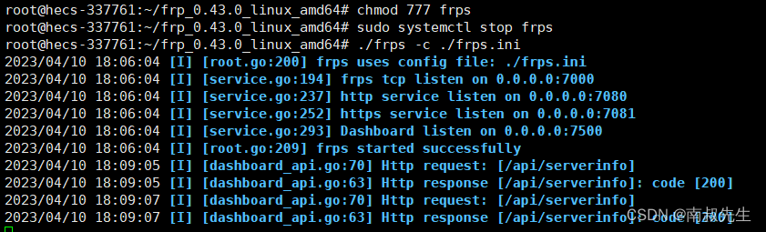
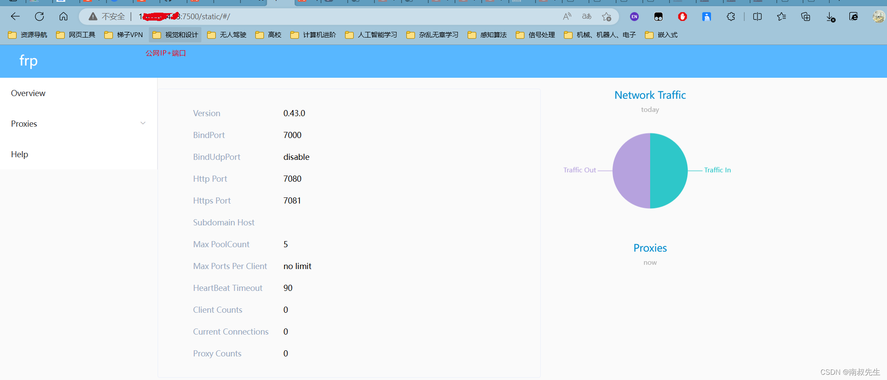
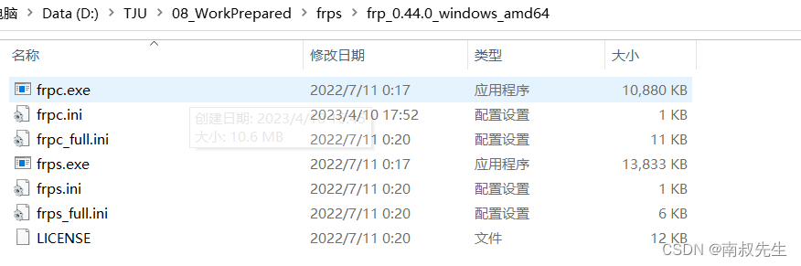
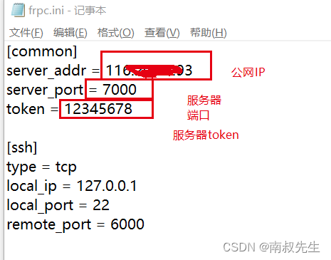
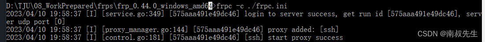

​
# 每日一问—04如何利用华为云和Frp进行内网穿透

##  1、部署华为云安全组



##  2、登陆服务器，部署服务器端

(1)frp开源地址：[Releases · fatedier/frp (github.com)](https://github.com/fatedier/frp/releases "Releases · fatedier/frp (github.com)")

(2)下载解压 

```cpp
wget https://github.com/fatedier/frp/releases/download/v0.43.0/frp_0.43.0_linux_amd64.tar.gz

tar -zxvf frp_0.43.0_linux_amd64.tar.gz

cd frp_0.43.0_linux_amd64/
```


(3)修改配置文件:

> vi frps.ini

```cpp
# frps.ini----------------------------------
[common]
# 监听端口
bind_port = 7000
# 面板端口
dashboard_port = 7500
# 登录面板账号设置
dashboard_user = root  
dashboard_pwd = 1234
# 身份验证，可以自己设置，建议设置复杂点。
token = 12345678
```


 (4)查看一下端口使用情况：

>  netstat -tanlp

（5）关于frp的一些命令
   
> systemctl start frps  #启动frp
> systemctl stop frps  # 停止frp  
> systemctl restart frps # 重启frp 
> systemctl status frps  # 查看frp状态
> systemctl enable frps # 配置 frps 开机自启

（6）开启frp

>  ./frps -c ./frps.ini

​

 （7）试一下是否可以打开服务器端口

​

## 3、配置本地客服端

（1）下载

​

（2）配置 frpc.ini

​

(3)开启frps 



  

​