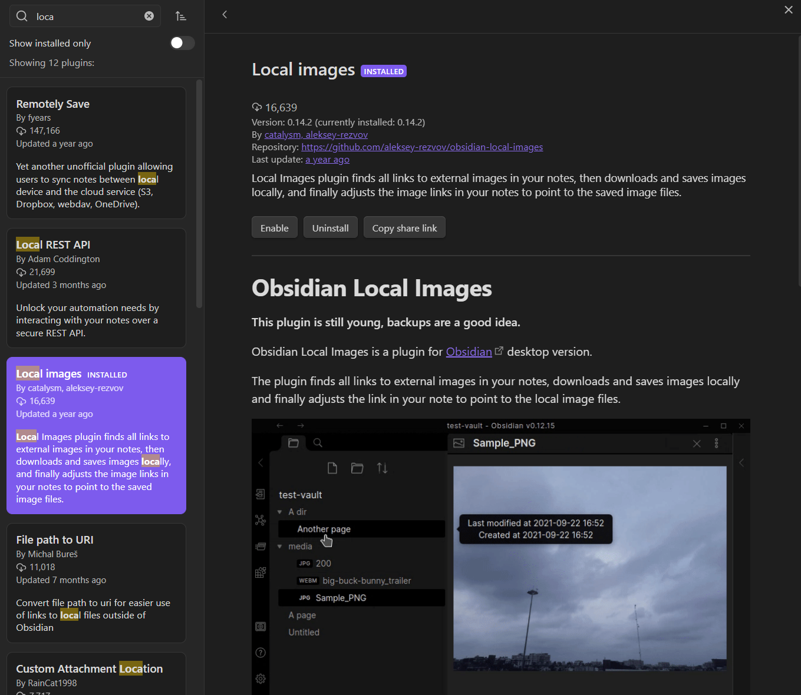

# 每日一问—05将网络图的链接保存为本地链接


::: tip
按shift+ctrl+p，输入local images，选择Download images locally，即可将网络图片保存到本地。然后将图片复制到当前文件的photo文件夹下，再将图片的链接替换为本地链接即可。
:::


# Obsidian Local Images
**This plugin is still young, backups are a good idea.**

Obsidian Local Images is a plugin for [Obsidian](https://obsidian.md/) desktop version.

The plugin finds all links to external images in your notes, downloads and saves images locally and finally adjusts the link in your note to point to the local image files.


For example, we initially have a markup in the note like this:

```

```

Local Images plugin will download image 300.jpg, save in **media** subdirectory of the vault, than change the markup so it refer to locally stored image:

```

```

It is useful when you copy paste parts from web-pages, and want to keep images in your vault. Because external links can be moved or expired in future.


Use it with commands:

**Download images locally** -- your active page will be processed.

or

**Download images locally for all your notes** -- will be processed all the pages in your vault, that corresponds to **Include** parameter in the plugin's settings.

Also you can turn on in plugin's settings processing the active page when external links pasted into the page.

The plugin was not tested with mobile version, probably it can work with it too.

## Credit

This plugin was developed from [niekcandaele's](https://github.com/niekcandaele/obsidian-local-images) code base. Key principles for downloading, saving were given there, and some texts too. Even the plugin's name is original.

## Development

```
# Start the bundler in watch mode
npm run dev

# It's useful to set a symlink so you don't have to copy files over constantly
ln -s /home/user/code/obsidian-local-images /home/user/notes/dev/.obsidian/plugins/local-images
```