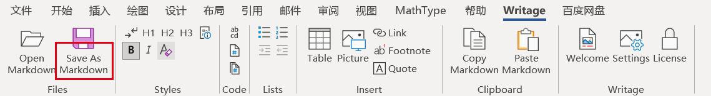

# 每日一问—06如何将docx转化为markdown

## 一、安装Writage
下载并安装 Writage，下载地址：http://www.writage.com/
安装完成后，检查是否安装成功
会在word标题栏看到其标签
随便打开一个文件，点另存为，在文件类型中能找到.md格式

## 二、安装panddoc
下载并安装 pandoc，下载地址：https://github.com/jgm/pandoc/releases/tag/3.1.2

## 三、打开docx文件，进行转化

## 四、移动到自己的数据管理文件夹