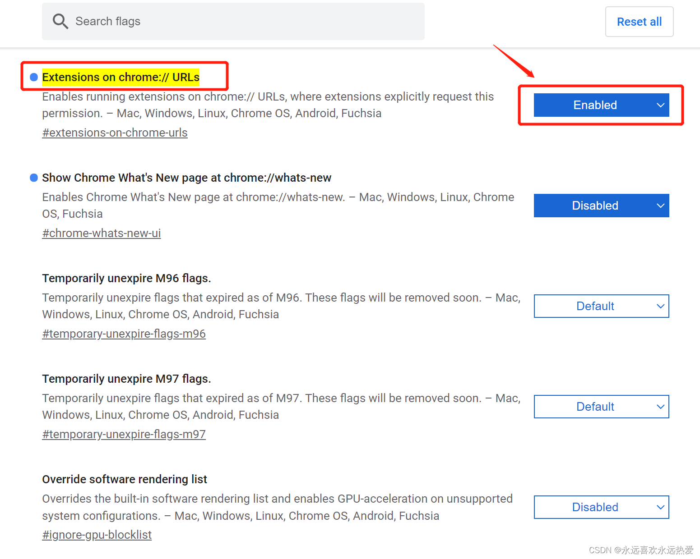

# 问题： 
为chrome添加infinity插件时提示无法从该网站添加应用、扩展程序和用户脚本 
# 解决方法： 
1、在地址栏输入：chrome://flags/#extensions-on-chrome-urls并按回车键 2、在Extensions on chrome:// URLs选项选择Enabled

3、在弹出框选择relaunch重启即可

4、点击更多程序—扩展程序，开启开发者模块！！！

5、将下载的插件.crx文件拖至该页面，点击添加扩展程序即可