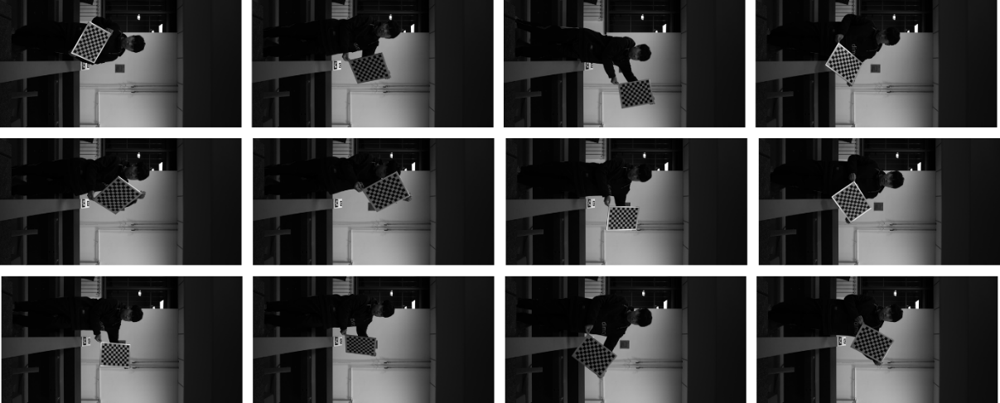
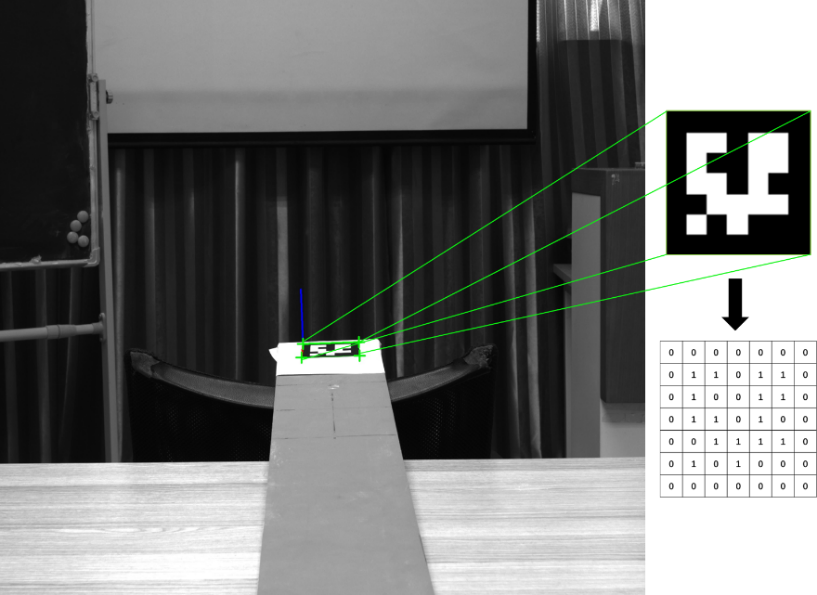
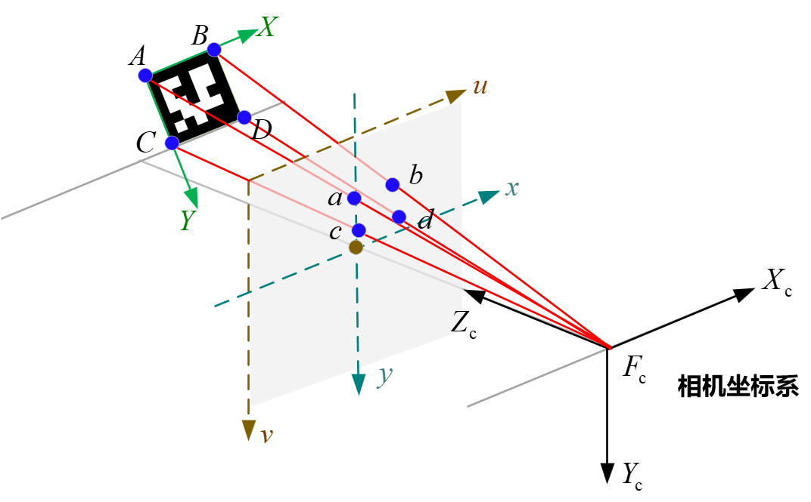

::: tip
传感器是机器人和无人车中最重要的感知不部件，这篇文章讲解相机。
:::

# 摄像机

### 硬件知识

**1、相机主要参数：**

分辨率、像素尺寸、帧率、像素深度、数字接口

**2、相机种类：**

（1）面阵相机和线阵相机

（2）CMOS和CCD

（3）黑白和彩色相机

**3、面阵相机的选型**

帧率、分辨率、接口、靶面尺寸、黑白/彩色、感光类型、像元尺寸

**4、线阵相机的选型**

幅宽、精度要求、运动速度

行频、分辨率、像素尺寸、数据接口、黑白/彩色、感光类型、镜头接口

**5、镜头选型**

接口、最靶面尺寸、物距焦距、、光圈、分辨率和成像质量、镜头倍率和视场范围

-   **选型步骤**

（1）确定相机连接的镜头接口类型，如C口或者F口，这个接口决定了镜头的接口。

（2）确定镜头的最大靶面尺寸和相机匹配。

（3）确定焦距。首先测量工作距离和目标物体大小，得到图像的宽或者高度；然后确定相机的安装位置，从相机的拍摄角度推测视角，最后根据几何关系计算相机焦距。

（4）根据现场拍摄要求，考虑光圈、价格等其它因素。

**6、光源选择**

**类型：** LED光源、红外光源、激光光源、卤素灯

环形光源、背光源、电光源

突出物体结构特性，可以使用正面或者侧面光源

突出物体轮廓，使用背面光源

### 单目视觉空间定位原理

三维空间测量和定位可以采用单目和双目视觉，与单目视觉相比，双目视觉的定位精度更高，但是定位算法更加复杂，同时也会带来更大的尺寸和重量，不仅会导致测量速度更慢，也不符合直升机上对测量装置小尺寸、轻质量的基本要求。单目视觉可以基于单帧图像对特征点进行空间定位，这种方式需要与标志物配合使用，采用PnP方法建立相机的像素坐标系与标志物的世界坐标系之间的位置关系。特别地，为了保证弱光环境下还能够拍摄清楚，可以通过补光灯或者设计荧光标记增大标记与环境的对比度。

图11是世界坐标系中一点的成像过程，依次经历相机坐标系、图像坐标系，最终形成像素坐标系下的点。

图11 相机成像过程

世界坐标系的一点投射到像素坐标系的投影变换可以概括为以下表达式：

(11)

其中和表示单个像素的尺寸大小，表示图像坐标系在像素坐标系下的中心坐标，表示相机的焦距，表示成像点相对于相机原点在光轴方向的距离，和表示世界坐标系与相机坐标系之间的位置关系。令，表示内参矩阵。令，表示外参矩阵。实际上，由透镜形状的非理想会导致成像发生径向畸变，由机械安装的非理想会导致成像产生切向畸变。那么图像坐标系坐标的理想点与实际的畸变点存在如下关系：

(12)

其中，径向畸变主要由参数，切向畸变主要由参数，参数满足。

由畸变后的点通过内参矩阵可得到像素平面上的实际坐标：

(13)

采用张正友标定法可以实现内参和畸变系数的标定，使用相机拍摄10\~20张不同姿态的清晰的标定图像。实验中，采用格数，边长为30 mm的高精度标定板，完成标定，图12是相机标定时标定板呈现不同姿态的情况。

图12 相机标定实验

将采集好的图像，通过OpenCV工具识别角点，计算坐标变换关系，获得相机的畸变参数和内参系数。采用张正友法标定的基本流程如图13。

图13 张正友相机标定基本流程

### 基于ArUco标记视觉定位原理

ArUco标记是一种特殊的编码，每个标记都有一个用于自身检测的黑色方形边框，通过明显的边框角点和内部的二进制编码，边框角点可以用来检测二维平面和三维世界之间的射影关系，从而实现空间点的定位。内部编码用于需要多个标记的场合，可以快速高效判断整副图像中各标记所属的ID，即准确、快速地找到标记点所在位置。ArUco标记采用二值图像编码信息，其中黑色格子用0表示，白色格子用1表示，如图14所示。

 

图14 ArUco标记视图和编码

ArUco标记的检测和识别与棋盘格相机标定是类似的，但ArUco标记包含更加丰富的信息，可以实现更高从检测精度，并且被部分遮挡也可以完成定位。ArUco标记的检测和识别是一个图像处理过程。

主要分为以下几个步骤完成：

（1）阈值处理。实际采集的图像一般为灰度图，采用局部自适应阈值处理，对不同光照条件都有很好的鲁棒性。

（2）轮廓提取和过滤。使用Suzuki和Abe算法完成轮廓提取，再通过Douglas-Peucker算法进行多边形近似，由于标记肯定是在矩形框内，所以需要丢弃非四边形轮廓。最后，保留最外轮廓。

（3）标记提取。计算单应性矩阵，将图像中标记转变成正视图。再使用OTSU算法进行阈值处理，利用二值化将图像划分成规则网格，网格中黑色像素为0，白色像素为1，如图15所示。

（4）标记识别。除去外边框像素，将像素值从原点按行编码，图示二进制编码为110111001111010011110100，将其与ArUco字典进行对比和编码纠错，获得标记编号。

图15ArUco标记的检测和识别

经过以上步骤可以获得标记的四个角点像素坐标以及标记的编号。采用PnP算法可以求解，ArUco标记成像示意图如图16所示。

图16 PnP算法求解示意图

假设ArUco的边长为，以点作为原点，建立世界坐标系，那么各点坐标分别为。经过前面的标记识别和检测可以获得四个角点的像素坐标，假设，以B点为例，根据成像公式(14)可得点坐标：

(14)

令，其中外参矩阵也被称为齐次变换矩阵，那么式(14)可以改写成：

(15)

消除，可以得到两个等式：

(16)

由于旋转矩阵是一个单位的正交矩阵，其本身具有六个约束关系：

(17)

因此，只要能够获取三个角点就能够求解出具有十二个未知变量的外参。本文采用的ArUco标记，能够提供四个精确角点，通过最小二乘求解具有12变量的14个方程的超定方程问题，即可求出外参数，即计算相机外参矩阵便可获取标记空间位置。那么，世界坐标系的原点点在相机坐标系下的坐标为：

(18)

# 激光雷达

# 毫米波雷达

# 超声波雷达

# 编码器

# IMU/陀螺仪

# GPS/RTK

# 传感器融合算法

传感器融合是一种多传感器数据处理技术，它结合来自多个传感器的信息，以提供更准确、可靠和稳定的数据。传感器融合算法可以用于各种应用，如自动驾驶、机器人、物联网设备等。

常见的传感器融合技术包括以下几类：

**1. 数据融合：**基于统计理论和信号处理方法，用于处理多个传感器的噪声和不确定性，从而提高数据精度。通过对同类传感器数据进行加权平均、中值滤波等处理，利用卡尔曼滤波和粒子滤波等算法，将不同传感器的数据融合以增强精度和可靠性。应用场景包括无人驾驶定位和机器人导航。

**2. 特征融合：**其原理是通过特征变换和降维，提取出更具代表性的特征，有利于模型训练和分类性能的提高。对传感器数据提取特征后进行融合。可应用于不同类型的传感器，如摄像头、激光雷达等。特征融合可以提高数据处理速度和准确性。在特征层对来自不同传感器的特征进行融合，以提高特征的表达能力。常用的方法有主成分分析（PCA）、线性判别分析（LDA）等。应用场景包括目标识别、行为分析等。

**3. 决策融合：**其原理是通过整合多个传感器的决策结果，提高系统的鲁棒性和可靠性，从而提高系统的决策性能。常用的方法有投票法（Voting）、贝叶斯融合（Bayesian Fusion）等。应用场景包括多传感器目标跟踪、异常检测等。

**4. 深度融合：**其原理是利用深度学习方法自动学习数据的表征，能处理高维、非线性、多模态数据，具有较强的泛化能力。利用深度学习方法（如卷积神经网络，CNN）对多模态数据进行端到端的融合，提高系统性能。应用场景包括图像识别、语音识别等。

以下是一些常用的传感器融合算法：

**（1）加权平均法（Weighted Average）**

加权平均法是一种简单的传感器融合方法，它根据每个传感器的可靠性为其分配权重。融合后的数据是每个传感器数据乘以相应权重之和。这种方法适用于传感器输出具有相似性质的场景，如温度、湿度等。

**（2）卡尔曼滤波器（Kalman Filter）**

卡尔曼滤波器是一种线性最优滤波器，用于估计动态系统的状态变量。它通过线性系统动态模型和观测模型，结合系统噪声和观测噪声，来融合多个传感器的数据。卡尔曼滤波器广泛应用于导航、定位和追踪等领域。

**（3）扩展卡尔曼滤波器（Extended Kalman Filter, EKF）**

当系统模型和观测模型非线性时，可以使用扩展卡尔曼滤波器。EKF通过将非线性模型在当前状态附近进行线性化，然后使用卡尔曼滤波器的方法进行融合。EKF适用于具有非线性特征的系统，例如机器人定位、姿态估计等。

**（4）无迹卡尔曼滤波器（Unscented Kalman Filter, UKF）**

无迹卡尔曼滤波器是另一种处理非线性系统的方法。与EKF通过线性化近似不同，UKF通过选择一组代表性样本（称为Sigma点）来近似非线性函数的均值和协方差。UKF通常比EKF更精确，但计算复杂度较高。

**（5）粒子滤波器（Particle Filter）**

粒子滤波器是一种基于蒙特卡洛方法的非线性、非高斯滤波器。它使用一组随机抽样的粒子来表示系统状态的概率分布。粒子滤波器可以处理具有复杂非线性和非高斯特征的系统，但计算成本较高。

**（6）多传感器信息融合**

当涉及到多个传感器类型时，可以使用多层次的传感器融合架构。常见的方法包括：**中央融合（Centralized Fusion）**、**分布式融合（Distributed Fusion）**和**协同融合（Cooperative Fusion）**。这些方法可以根据传感器的特性、通信限制和计算资源来选择合适的融合策略。

多传感器信息融合是指利用来自不同来源的传感器数据以提高目标跟踪等任务性能的技术。通常，在将不同源头信息汇聚到一起时，需要考虑到诸如时间戳、噪声估计、坐标系转换和协方差矩阵等问题。在执行多传感器信息融合时，可以参考以下步骤：

1\. 执行数据校准和缩放操作。

2\. 定义参数化模型以捕捉观察误差及其相关统计特征。

3\. 建立多变量联合概率密度函数表示两个观察量之间的关系。

4\. 将带有相应权重因素加权后建立混合密度函数

5,使用贝叶斯框架更新当前时刻系统状态的估计。

这些传感器融合算法的选择取决于应用场景、传感器类型和数据特性。通常，线性系统可以使用卡尔曼滤波器，而非线性系统可以选择EKF、UKF或粒子滤波器。多传感器信息融合方法可以根据系统需求灵活选择。

第二种分类方法：

**1. 基于卡尔曼滤波的传感器融合：**卡尔曼滤波是一种递归的最优线性估计算法，用于整合不同传感器的数据。特点是计算简单、实时性好，但对系统模型和噪声假设有较高要求。

2\. **基于粒子滤波的传感器融合：**粒子滤波是一种蒙特卡洛方法，通过采样和重要性重采样来估计系统状态。特点是适用于非线性、非高斯系统，但计算复杂度较高。

3\. **基于卷积神经网络（CNN）的传感器融合：**CNN是一种深度学习方法，可以自动学习特征并整合多模态数据。特点是能处理复杂场景，但需要大量数据和计算资源。

4\. **基于多传感器数据融合的定位与地图构建：**如SLAM（同时定位与地图构建）技术，通过整合激光雷达、视觉、惯性测量单元（IMU）等多种传感器数据，实现自动驾驶和机器人的定位与地图构建。特点是实时性好、精度高，但受环境变化影响较大。

5\. **基于DSM（证据理论）的传感器融合：**DSM是一种处理不确定性信息的方法，通过计算不同传感器数据的置信度，实现数据融合。特点是适用于不确定性较高的场景，但计算复杂度较高。