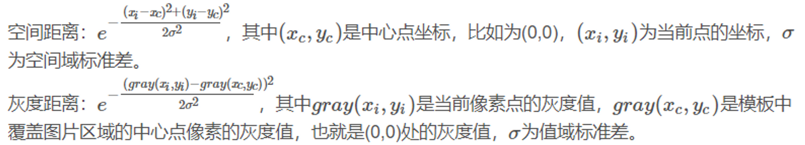
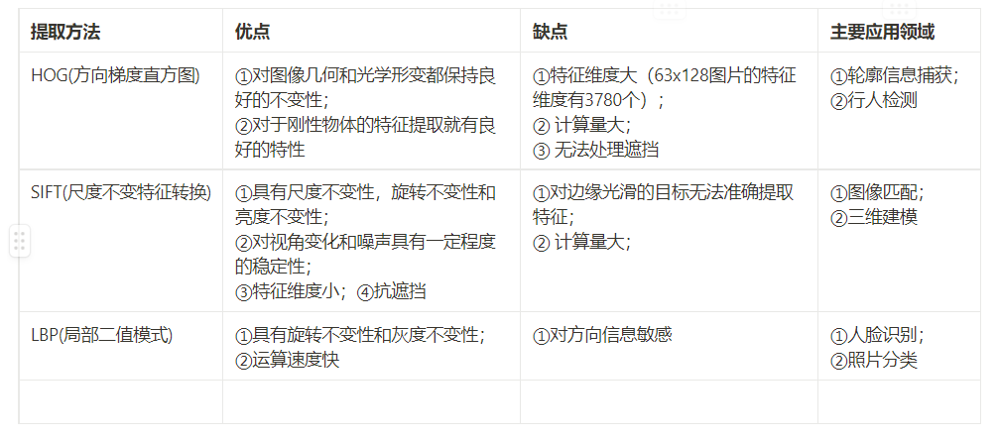
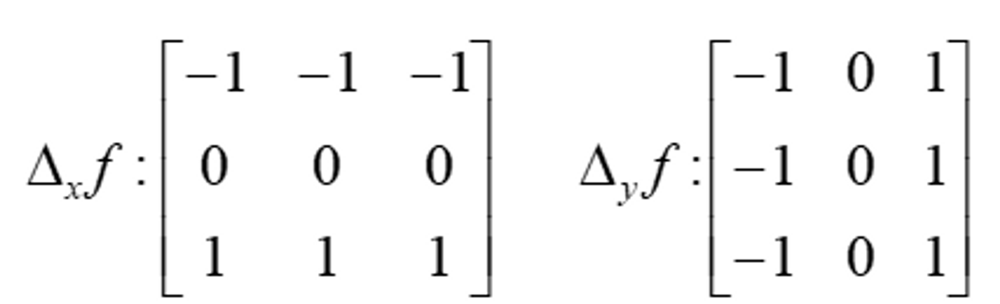
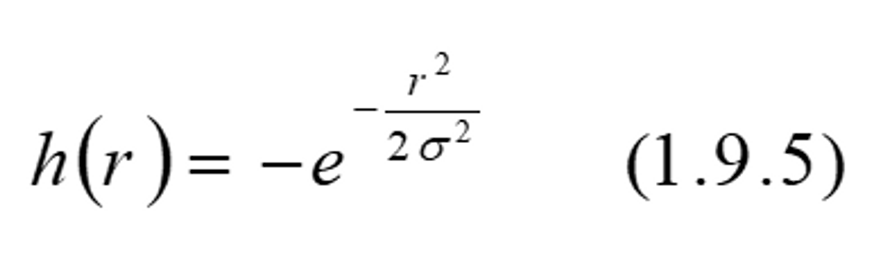
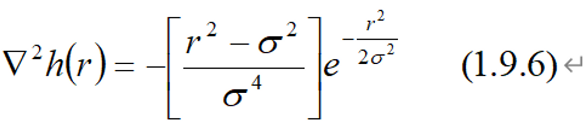
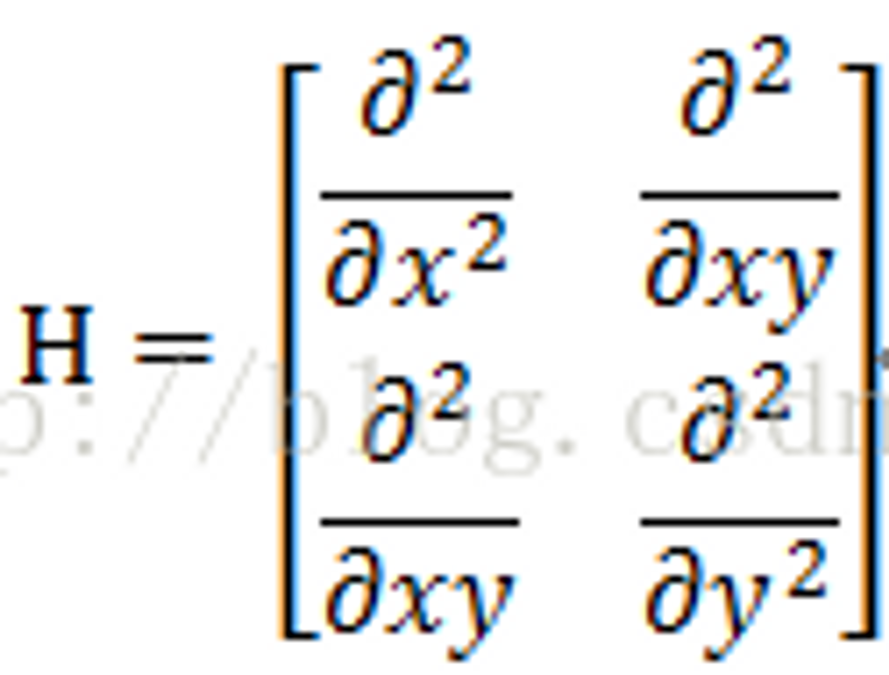
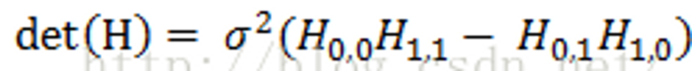
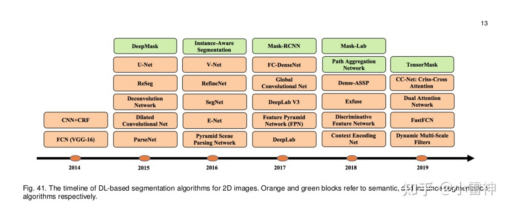
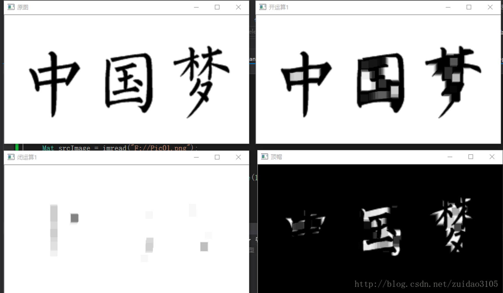
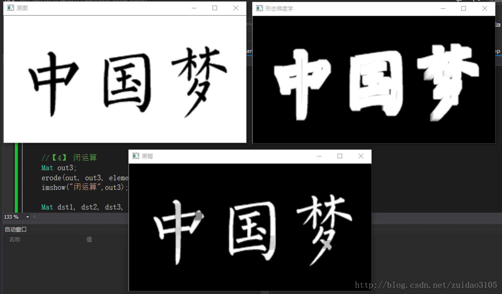

::: warning
图像处理的一般步骤：提取原始图像→灰度处理→滤波→边缘检测→图像分割→特征提取。
:::

## 一、图像滤波
1、平均滤波 
2、中值滤波：对于消除椒盐噪声很有效
3、高斯滤波 
4、BM3D滤波
5、双边滤波
### 基本原理
1、**中值滤波——非线性滤波**
    
用像素点领域灰度值的中值来代替该像素点的灰度值，**该方法在去除脉冲噪声，椒盐噪声的同时又能保留图像的边缘细节**，**中值滤波去除椒盐噪声和斑块噪声时，效果非常明显。**
    
选用一个模板nxn，每次在图像中取出模板大小的矩阵，将所有元素进行排序，取中值代替原像素，而未被赋值的元素取原值。中值滤波通常采用一个含奇数个点的滑动窗口，用窗口的中的灰度值的中值来代替中心点的灰度值，其实就是对这个窗口中的灰度值进行排序，然后将其中值赋值给中心点即可。常用的中值滤波窗口形状有线状、方形、圆形以及十字形等
    
**算法描述：**
    
[1] 获得源图像的**首地址**及图像的**宽和高** [2] 开辟一块内存缓冲区，用以暂存结果图像，并初始化为0 [3] **逐个扫描图像中的像素点**，将其邻域各元素的像素值**从小到大进行排序**，将求得到的**中间值**赋值给目标图像中与当前点对应的像素点 [4] 循环步骤[3]，直到处理完源图像的全部像素点 [5] 将结果从内存缓冲区复制到源图像的数据区
I=medfilt2(I0,[n,n]);%matlab中自带的中值滤波函数。
    
2、**均值滤波**
    
与中值滤波类似，用其像素点周围像素的平均值代替元像素值，在滤除噪声的同时也会滤掉图像的边缘信息。
    
3、**高斯模糊（高斯滤波）**
    
所谓”模糊”，可以理解成每一个像素都取周边像素的平均值。“中间点”取”周围点”的平均值，在数值上，这是一种”平滑化”。在图形上，就相当于产生”模糊”效果，”中间点”失去细节。计算平均值时，取值范围越大，”模糊效果”越强烈。 与均值滤波不同的是，不是简单平均，而是依据距离来加权平均，距离越近的点权重越大，距离越远的点权重越小。采用二维的正态分布（高斯函数）的权重分配模式
    
4、**双边滤波——非线性滤波**
    
双边滤波与高斯滤波器相比，对于**图像的边缘信息能过更好**的保存。其原理为一个与空间距离相关的高斯函数与一个灰度距离相关的高斯函数相乘。
    
对于高斯滤波，仅用空间距离的权值系数核与图像卷积后确定中心点的灰度值。即认为离中心点越近，其权值系数越大。

    
双边滤波中加入了对**灰度信息的权重**，即在领域内，灰度值越接近**中心点灰度值的点的权值更大**，灰度值相差大的点权重越小。**其权重大小则由值域高斯函数确定**。 两者权重系数相乘，得到最终的卷积模板，由于双边滤波需要每个中心点领域的灰度信息来确定其系数，所以速度比一般的滤波慢得多，而且计算量增长速度为核的大小的平方。 σ越大，边缘越模糊；σ越小，边缘越清晰。

    
## 二、二值化

二值化的算法分为**固定阈值**和**自适应阈值,**比较常用的二值化方法则有：**双峰法**、**P参数法**、**迭代法**和**OTSU法**等。

## 三、特征提取
### 1、特征提取概述
图像特征主要有图像的颜色特征、纹理特征、形状特征和空间关系特征。

颜色直方图特征匹配方法：直方图相交法、距离法、中心距法、参考颜色表法、累加颜色直方图法。

纹理特征的提取与匹配主要有：灰度共生矩阵、Tamura 纹理特征、自回归纹理模型、小波变换等。灰度共生矩阵特征提取与匹配主要依赖于能量、惯量、熵和相关性四个参数。Tamura 纹理特征基于人类对纹理的视觉感知心理学研究，提出6种属性，即：粗糙度、对比度、方向度、线像度、规整度和粗略度。自回归纹理模型（ SAR）是马尔可夫随机场（MRF）模型的一种应用实例。

形状特征有两类表示方法，一类是轮廓特征，另一类是区域特征。图像的轮廓特征主要针对物体的外边界，而图像的区域特征则关系到整个形状区域。

目前常用的图像检测和识别的图像特征有：Hu不变矩、Haar特征算子、Surf特征，他们都具有平移旋转缩放不变形，具有很好的鲁棒性。

### 2、边缘检测

图像[边缘检测](https://so.csdn.net/so/search?q=%E8%BE%B9%E7%BC%98%E6%A3%80%E6%B5%8B&spm=1001.2101.3001.7020)主要用于增强图像中的**轮廓边缘、细节以及灰度跳变部分**，形成完整的物体边界，达到将物体从图像中分离出来或将表示同一物体表面的区域检测出来的目的。目前为止最通用的方法是检测亮度值的不连续性，用一阶和二阶导数检测的。

-   1、****微分法****
    利用微分运算求信号的变化率，加强高频分量的作用，从而使轮廓清晰。 遵循如下两个基本准则之一： 找到亮度的一阶导数在幅度上比指定的阈值大的地方； 找到亮度的二阶导数有零交叉的地方。
    
-   2、****差分边缘检测方法**** 
    利用像素灰度的**一阶导数算子**在**灰度迅速变化处**得到**高值**来进行奇异点的检测。**它在某一点的值就代表该点的边缘强度**，通过对这些值设置阈值来进一步得到边缘图像。差分边缘检测方法是最原始、最基本的方法。但要求差分方向与边缘方向垂直，这就需要对图像的不同方向（一般为垂直方向、水平方向和对角线方向）都进行差分运算，增加了实际运算的繁琐性，目前很少采用。
    
-   3、****Roberts 边缘检测算子****   
    Roberts边缘检测算子**根据任意一对互相垂直方向上的差分**可用来计算梯度的原理，采用**对角线方向相邻两像素之差**。 Roberts检测器较为简单，但具有一些功能上的限制，例如，它是非对称的，而且不能检测诸如45°倍数的边缘。然而，它还是经常用于硬件实现中，因为它既简单又快速。
    
-   4、****Sobel 边缘检测算子****  
    对数字图像的每个像素，考察它上下左右邻点灰度的加权差，与之接近的邻点的权大。 Sobel算子很容易在空间上实现，**边缘检测效果较好，且受噪声的影响也较小**。邻域增大抗噪性会更好，但计算量也会增大，得出的边缘也会相应变粗。 Sobel算子会检测出许多伪边缘，**边缘定位精度不够高**，在精度要求不高时是一种较常用的边缘检测方法。
    
-   5、****Prewitt 边缘检测算子****
    

    
    图像中的每个像素都用这两个核作卷积，一个**核对垂直边缘影响最大**，另一个核**对水平边缘影响最大**。两个卷积的**绝对值的最大值**作为该点的输出值。不能简单的将小于0的值处理为0，这样会丢失信息。它比Sobel检测器在计算上要简单一些，**但比较容易产生一些噪声**。
    
-   6、****拉普拉斯边缘检测算子****
    
    拉普拉斯边缘检测算子是**一种二阶微分算子**，与其它边缘检测方法的不同之处在于，该方法是一种**各向同性**的检测方法，即其边缘的增强程度与边缘的方向无关，从而可以满足不同走向的边缘锐化的要求。 拉普拉斯算子自身**很少被直接用作边缘检测**，因为二阶导数对噪声具有**无法接受的敏感性**，它的幅度会产生**双边缘**，而且**它不能检测边缘的方向**。然而，当与其它边缘检测技术组合使用时，拉普拉斯算子是一种有效的补充方法。例如，虽然它的双边缘使得**它不适合直接用于边缘检测**，但该性质可用于边缘定位。
    
-   7、****Laplacian of a Gaussian(LoG)检测器****
    
    高斯函数
    

    
    其中，$r^2=x^2+y^2$，σ是标准偏差。这是一个平滑函数，若和一幅图像卷积，则会使图像变模糊。模糊程度由σ的值决定。该函数的拉普拉斯算子为:
    

    
    求二阶导数是线性运算，所以用 对图像进行卷积与先用平滑函数对图像卷积再计算结果的拉普拉斯算子是一样的。这是LoG检测器最关键的概念，对图像卷积会产生两个效果：是图像变平滑（从而减少噪声）；计算拉普拉斯算子，以便产生双边缘图像。然后，定位边缘就是找到两个边缘之间的零交叉。
    
    8、****Canny边缘检测器****
    
    Canny检测器的效果较好，**更适合用于检测真正的弱边缘**。Canny算子给出了一个好的边缘检测算子的3个指标：**低失误率**，即真正的边缘点尽可能提取，非边缘点尽可能不提取；**高位置精度**，检测的边缘应尽可能接近真实边缘；**对每一个边缘点有唯一的响应**，即得到单像素宽度的边缘。
    
    9、****基于小波的图像边缘检测****
    
    小波变换的优点是在时域和频域都有良好的局部特性,这一点可以用来进行图像的边缘检测。由于小波变换对奇异特性尤为敏感,使得它更适合检测图像的边缘和细节,对某一类小波,图像边缘对应于小波变换的局部模极大值，基于小波变换的模极大值边缘检测算法是较为典型的一类算法。
    
-   8、****Canny算子****
    
    Canny算子是一个综合了滤波，增强，检测等多阶段的边缘检测算子, 其目标是找到一个最优的边缘轮廓。该算法对最优的边缘的定义是：
    
    1.  好的检测——算法能够尽可能多地标示出图像中的实际边缘
    2.  好的定位——算法标示出的边缘要与实际的边缘尽可能地相同
    3.  最小响应——图像中的边缘只能被标示一次，并且可能存在的图像噪声点不应该被标示为边缘点
    
    步骤：高斯(Gaussian)滤波→计算梯度图像和角度图像→梯度图像的非极大值抑制处理→双阈值算法检测并连接图像边缘

大致可分为两类：基于搜索和基于零交叉。基于搜索的边缘检测方法首先计算边缘强度， 通常用一阶导数表示， 例如[梯度](https://baike.baidu.com/item/%E6%A2%AF%E5%BA%A6?fromModule=lemma_inlink) 模，然后，用计算估计边缘的局部方向， 通常采用梯度的方向，并利用此方向找到局部梯度模的最大值。基于零交叉的方法找到由图像得到的[二阶导数](https://baike.baidu.com/item/%E4%BA%8C%E9%98%B6%E5%AF%BC%E6%95%B0?fromModule=lemma_inlink)的零交叉点来定位边缘。 通常用[拉普拉斯算子](https://baike.baidu.com/item/%E6%8B%89%E6%99%AE%E6%8B%89%E6%96%AF%E7%AE%97%E5%AD%90?fromModule=lemma_inlink)或非线性微分方程的零交叉点。

一阶:：**Roberts** 算子，**Prewitt算子**，**Sobel算子**， Kirsch算子； 二阶： 在梯度方向的二阶导数过零点，**Canny算子**，**Laplacian算子**。

**Marr-Hildreth边缘检测器（LoG滤波器）算法步骤：** 1.使用高斯滤波器平滑图像，并计算其拉普拉斯算子 2.寻找步骤2所得图像的零交叉

**坎尼边缘检测器（Canny）算法步骤：**

1.  用一个高斯滤波器平滑输入图像
2.  计算梯度幅值图像和角度图像
3.  对梯度幅值图像应用非最大限制

  **边缘检测流程**

①滤波：边缘检测[算法](https://baike.baidu.com/item/%E7%AE%97%E6%B3%95?fromModule=lemma_inlink)主要是基于图像强度的一阶和二阶导数，但导数的计算对噪声很敏感，因此必须使用滤波器来改善与噪声有关的边缘检测器的性能。需要指出，大多数滤波器在降低噪声的同时也导致了边缘强度的损失，因此，增强边缘和降低噪声之间需要折中。

②增强:增强边缘的基础是确定图像各点邻域强度的变化值。增强算法可以将[邻域](https://baike.baidu.com/item/%E9%82%BB%E5%9F%9F?fromModule=lemma_inlink)(或局部)强度值有显著变化的点突显出来。[边缘增强](https://baike.baidu.com/item/%E8%BE%B9%E7%BC%98%E5%A2%9E%E5%BC%BA?fromModule=lemma_inlink)一般是通过计算梯度[幅值](https://baike.baidu.com/item/%E5%B9%85%E5%80%BC?fromModule=lemma_inlink)来完成的。

③检测：在图像中有许多点的梯度[幅值](https://baike.baidu.com/item/%E5%B9%85%E5%80%BC?fromModule=lemma_inlink)比较大，而这些点在特定的应用领域中并不都是边缘，所以应该用某种方法来确定哪些点是边缘点。最简单的边缘检测判据是梯度[幅值](https://baike.baidu.com/item/%E5%B9%85%E5%80%BC?fromModule=lemma_inlink)阈值判据。

④定位：如果某一应用场合要求确定边缘位置，则边缘的位置可在子像素分辨率上来估计，边缘的方位也可以被估计出来。在边缘检测算法中，前三个步骤用得十分普遍。这是因为大多数场合下，仅仅需要边缘检测器指出边缘出现在图像某一像素点的附近，而没有必要指出边缘的精确位置或方向。

边缘检测的实质是采用某种[算法](https://baike.baidu.com/item/%E7%AE%97%E6%B3%95?fromModule=lemma_inlink)来提取出图像中对象与背景间的交界线。我们将边缘定义为图像中[灰度](https://baike.baidu.com/item/%E7%81%B0%E5%BA%A6?fromModule=lemma_inlink)发生急剧变化的区域边界。图像灰度的变化情况可以用图像灰度分布的梯度来反映，因此我们可以用局部图像[微分](https://baike.baidu.com/item/%E5%BE%AE%E5%88%86?fromModule=lemma_inlink)技术来获得边缘检测[算子](https://baike.baidu.com/item/%E7%AE%97%E5%AD%90?fromModule=lemma_inlink)。经典的边缘检测方法，是通过对原始图像中像素的某小[邻域](https://baike.baidu.com/item/%E9%82%BB%E5%9F%9F?fromModule=lemma_inlink)构造边缘检测[算子](https://baike.baidu.com/item/%E7%AE%97%E5%AD%90?fromModule=lemma_inlink)来达到检测边缘这一目的的。

与Sobel、Prewitt等算子相比，Canny算法更为优异。Sobel、Prewitt等算子有如下缺点：
- [ ] 1、没有充分利用边缘的梯度方向。 
- [ ] 2、最后得到的二值图，只是简单地利用单阈值进行处理。

而Canny算法基于这两点做了改进，提出了：

- [ ] 1、基于边缘梯度方向的非极大值抑制。 
- [ ] 2、双阈值的滞后阈值处理

Robert算子定位比较精确，但由于不包括平滑，所以对于噪声比较敏感。Prewitt算子和Sobel算子都是一阶的微分算子，而前者是平均滤波，后者是加权平均滤波且检测的图像边缘可能大于2个像素。这两者对灰度渐变低噪声的图像有较好的检测效果，但是对于混合多复杂噪声的图像，处理效果就不理想了。LOG滤波器方法通过检测二阶导数过零点来判断边缘点。LOG滤波器中的a正比于低通滤波器的宽度，a越大，平滑作用越显著，去除噪声越好，但图像的细节也损失越大，边缘精度也就越低。所以在边缘定位精度和消除噪声级间存在着矛盾，应该根据具体问题对噪声水平和边缘点定位精度要求适当选取。

讨论和比较了几种常用的边缘检测算子。梯度算子计算简单,但精度不高,只能检测出图像大致的轮廓,而对于比较细的边缘可能会忽略。Prewitt 和Sobel 算子比Roberts 效果要好一些。LOG 滤波器和Canny 算子的检测效果优于梯度算子,能够检测出图像较细的边缘部分。不同的系统,针对不同的环境条件和要求,选择合适的算子来对图像进行边缘检测。

**点、线、边缘检测**

点：可以用二阶导为基础检测孤立点，在普拉斯算子的模板响应添加一个阈值T，就可以轻易的检测出孤立点

线：采用拉普拉斯模板，由于拉普拉斯是各向同性的（其响应与方向无关），则我们可以通过对模板做出调整来检测特定方向的线。

### 3、特征描述子
-   **1.SIFT**
    
    **特点**图像的局部特征，对旋转、尺度缩放、亮度变化保持不变，对视角变化、仿射变换、噪声也保持一定程度的稳定性。
    
    **可以解决的问题**目标的自身状态、场景所处的环境和成像器材的成像特性等因素影响图像配准/目标识别跟踪的性能，SIFT算法在一定程度上可以解决：
    -   目标的旋转、缩放、平移
    -   图像仿射/投影变换
    -   光照影响
    -   目标遮挡
    -   杂物场景
    -   噪声
-   2.**SURF**
    
    在积分图像上使用了高斯[滤波器](https://so.csdn.net/so/search?q=%E6%BB%A4%E6%B3%A2%E5%99%A8&spm=1001.2101.3001.7020)对二阶微分模板进行了简化，从而构建了Hessian矩阵元素值，进而缩短了特征提取的时间，提高了效率。
    
    主要特点是快速性，同时也具有尺度不变的特性，对光照变化和仿射、透视变化也具有较强的鲁棒性（系统在其特性或参数发生摄动时仍可使品质指标保持不变的性能）
    
-   3.**ORB**
    
    使用FAST进行特征点检测，然后用BREIF进行特征点的特征描述，但是BRIEF并没有特征点方向的概念，所以ORB在BRIEF基础上引入了方向的计算方法，并在点对的挑选上使用贪婪搜索算法，挑出了一些区分性强的点对用来描述二进制串。
    
-   4.对于SIFT SURF ORB
    
    三种方法在对特征点的描述的细致程度上 SIFT高于SURF 、SURF高于ORB。但是从运行的速度快慢来看，整个顺序恰好相反。 在选择特征提取方法的时候要根据实际应用情况来选择，如进行离线的图像的拼接，3D建模等对时间要求不是很严格应用，可以选择SIFT。但是当应用场合是在线的实时检测，就要选择比较快速的 SURF或ORB
    
-   5.**LoG**
    
    因为拉普拉斯算子对噪声很敏感，所以首先利用高斯对图像进行降噪处理，再采用拉普拉斯算子进行边缘检测，就可以提高对噪声和离散点的鲁棒性
    
    即利用二阶高斯导数（也叫拉普拉斯变换）与原始信号（图像）卷积，通过检测局部极值获得角点。
    
    **特别适用于以突出图像中的孤立点、孤立线或线端点为目的的场合**
    
    LoG的斑点检测（类似SIFT）：
    
    1.预定义一组方差值（因为不知道待检信号的尺度），对每个方差生成一个二阶高斯模板
    
    2.对每个方差，将对应的高斯模板与原始信号做卷积（DOH需要将三个模板分别与原始图做卷积，然后计算其加权行列式），得到一组不同尺度的图像集
    
    3.对每个空间位置，比较其在图像集里26（3_3_3-1）个位置（图1-4）的值，如果为极值，则认为在该点有一个斑点（高斯金字塔极值检测）
    
-   6.**DoH (**Determinant of Hessian)
    
    基本思路和LoG差不多，只不过使用了Hessian矩阵

    
    一张图计算xx，yy，xy三个方向的卷积，然后计算其加权行列式：
    
    理论上，与LOG相比，DOH对细长结构的斑点有较好的抑制作用。
    
    利用像素点Hessian矩阵（二阶微分）及其行列式值

    
    无论是LoG还是DoH，它们对图像中的斑点进行检测，其步骤都可以分为以下两步：
    
    1）使用不同的σ生成(∂2g∂x2+∂2g∂y2)(∂2g∂x2+∂2g∂y2)或∂2g∂x2,∂2g∂y2,∂2g∂x∂y∂2g∂x2,∂2g∂y2,∂2g∂x∂y模板，并对图像进行卷积运算；
    
    2）在图像的位置空间与尺度空间中搜索LoG与DoH响应的峰值。
    
-   7.**DoG**
    
    高斯差分法，SIFT的第一步。通过将目标图像与高斯函数进行卷积运算得到一幅目标图像的低通滤波结果
    
    LoG比DoG明显需要更多的加法运算和乘法运算。虽然DoG需要在每层金字塔多做一次高斯操作，但通过减法取代LoG核的计算过程，显著减少了运算次数，大大节省了运算时间。
    
    通过数学公式可以发现：可以用DoG 算子来近似 LoG算子
    
-   8.**Harris**
    
    基于图像灰度的一阶导数矩阵检测方法。检测器的主要思想是局部自相似性/自相关性，即在某个局部窗口内图像块与在各个方向微小移动后的窗口内图像块的相似性。
    
    Harris 算子的优越性有：
    
    计算简单:Harris 算子中只用到灰度的一阶差分以及滤波,操作简单。 提取的点特征均匀而且合理:Harris 算子对图像中的每个点都计算其兴趣值,然后在邻域中选择最优点。实验表明,在纹理信息丰富的区域,Harris 算子可以提取出大量有用的特征点,而在纹理信息少的区域,提取的特征点则较少。 稳定:Harris算子的计算公式中只涉及到一阶导数，因此对图像旋转、灰度变化、噪声影响和视点变换不敏感,它也是比较稳定的一种点特征提取算子。 Harris 算子的局限性有：
    
    1.它对尺度很敏感，不具有尺度不变性。（不管原图尺度是多少，在包含了所有尺度的尺度空间下都能找到那些稳定的极值点，这样就做到了尺度不变） 2.提取的角点是像素级的。
    
-   9.**FAST**
    
    基于加速分割测试的FAST算法可以快速地提取出角点特征。
    
    在图像中选取一个像素点，来判断它是否为关键点。表示像素点的灰度值。 选择适当的阈值。 在像素点的周围选择16个像素点进行测试。 如果在这16个像素点中存在个连续像素点的灰度值都高于，或者低于，那么像素点被认为是一个角点。 一种更加快的改进是首先检测像素点周围的四个点（1，5，9，12）中是否有三个点满足阈值要求。如果不满足，则直接跳过，如果满足，则继续使用前面的算法，全部判断16个点中是否有12个满足条件。 上述算法效率很高，但是缺点如下所示：
    
    1、获得的候选点比较多。 2、检测出来的角点不是最优的，因为它的效果取决于要解决的问题和角点的分布情况。 3、对于角点分析的结果被丢弃了。 4、检测到的很多角点都是连在一起的。
    
    前3个问题可以通过机器学习的方法解决（待完善），最后一个问题可以使用非最大值抑制的方法解决。
    
    非极大值抑制，如下所示：
    
    对所有检测到的角点构建一个打分函数。就是像素点与周围16个像素点差值的绝对值之和。 考虑两个相邻的角点，并比较它们的值。 值较低的角点将会被删除
    
    总体来说，FAST算子比其它角点检测算法都快，但是当图像中的噪点较多时，它的健壮性并不好，而且算法的效果还依赖于阈值。并且FAST算子不产生多尺度特征而且FAST角点没有方向信息，这样就会失去旋转不变性。
    
-   10、**BRIEF**
    
    BRIEF是对已检测到的特征点进行描述，它是一种二进制编码的描述子，摈弃了利用区域灰度直方图描述特征点的传统方法，大大的加快了特征描述符建立的速度，同时也极大的降低了特征匹配的时间，是一种非常快速，很有潜力的算法。
    
    BRIEF仅仅是特征描述子，所以事先要得到特征点的位置，可以利用FAST特征点检测算法或Harris角点检测算法或SIFT、SURF等算法检测特征点的位置。接下来在特征点邻域利用BRIEF算法建立特征描述符。
    
    特征点周围邻域内选取若干个像素点对，通过对这些点对的灰度值比较，将比较的结果组合成一个二进制串字符串用来描述特征点。最后，使用汉明距离来计算在特征描述子是否匹配。
    
-   11、**BRISK**
    
    具有较好的旋转不变性、尺度不变性，较好的鲁棒性等。在图像配准应用中，速度比较：SIFT < SURF < BRISK < FREAK < ORB，在对有较大模糊的图像配准时，BRISK算法在其中表现最为出色。
    
    BRISK算法主要利用FAST9-16进行特征点检测（为什么是主要？因为用到一次FAST5-8）。要解决尺度不变性，就必须在尺度空间进行特征点检测，于是BRISK算法中构造了图像金字塔进行多尺度表达。
    
    **步骤：**
    
    特征点检测:
    
    建立尺度空间→特征点检测→非极大值抑制→亚像素插值 特征点描述:
    
    高斯滤波→局部梯度计算→特征描述符
    
-   12、**FREAK  （Fast Retina Keypoint）**
    
    可以看出来该算法的一个特点是快速，另外一个特点就是该算法是被人眼识别物体的原理上得到启发提出的。
    
    BRIEF、ORB和BRISK都是特征点周围的邻域像素点对之间的比较形成的二进制串作为特征点的描述符，这种做法有着快速和占用内存低的优点，在如今的移动计算中有很大的优势，但是也遗留了一些问题。比如，如何确定特征点邻域中哪些像素点对进行比较，如何匹配它们呢？
    
    特征点检测方法与BRISK中特征点检测方法相同

## 三、图像分割

-   **基于阈值分割**

通过设定不同的特征阈值，把像素点分为具有不同灰度等级的目标区域和背景区域。

-   **关键在于确定阈值**

利用灰度直方图的峰谷法、最小误差法、基于过渡区法、利用像素点空间位置信息的变化阈值法、结合连通信息的阈值法、最大相关性原则和最大熵原则的自动阈值法。

-   **基于区域分割**

1、基于区域生长，从单个像素出发，逐步合并所需要的分割区域

2、区域分裂合并，从全局出发，逐步分割所需要分割的区域

-   **基于边缘检测**

通过检测包含不同区域的边缘来解决分割方法，是最常用的方法，通常来说，不同区域之间的边缘像素灰度的变化比较剧烈。 
**基本方法**：**图像一阶导数极大值，二阶导数过零点信息作为基本判据。**

一阶算子：**Robert算子**，Prewitt算子，**Sobel算子** 二阶算子：**拉普拉斯算子** 优点:边缘定位准确、速度快 难点：单纯的边缘检测无法保证边缘的连续性和封闭性，二是边缘检测在高细节区存在大量的碎片边缘。

-   **基于深度模型**

## 四、形态学运算

-   开运算:先腐蚀后膨胀：dilate(erode(src,element))
-   闭运算：先膨胀后腐蚀：erode(dilate(src,element))
-   形态梯度：膨胀图与腐蚀图之差：dilate(src,element)-erode(src,element)
-   顶帽：原图与开运算之差：src-open(src,element)
-   黑帽：闭运算与原图之差：close(src,element)-src

## 五、姿态估计

-   aruco标记检测
    
    ArUco 标记是由宽黑色边框和确定其标识符（id）的内部二进制矩阵组成的正方形标记。
    
    黑色边框有助于其在图像中的快速检测，内部二进制编码用于识别标记和提供错误检测和纠 正。
    
    对 ArUco 标记进行检测时，需要返回检测结果的一系列信息，包括：  图像中四个角的位置（按原始顺序）。  标记的 ID。
    
    在 aruco 模块中，detectMarkers()函数实现标志的检测。
    
    标记检测过程的第一步是对输入图像进行自适应阈值化。
    
    在候选标志检测完成后需要对每个候选标志进行数位分析，以确定它们是否是 ArUco 标记。
     
    提取标记中二进制信息后，接下来检查提取的二进制代码是否属于标记字典。
     
    检测并识别标记后，最后一步是对角点位置执行亚像素细化。这一步是可选的，只有在 标记角点位置必须为精确值的情况下才有意义，例如姿态估计、运动测量等问题中。角点位置细化通常是一个耗时的步骤，默认情况下是不使用的。
    
    检测到标记后，我们需要从标记中获取相机姿态。要执行相机姿态估计，我们需要了解 相机的标定参数。这是相机内参矩阵和畸变系数。使用 OpenCV 基础库中标定函数。
    
    相机相对于标记的姿态是从标记坐标系到相机坐标系的 3d 转换。它由旋转量和平移矢 量确定。aruco 模块提供了 cv::aruco::estimatePoseSingleMarkers()函数用于估计所有检测到的标记的姿态。
    

