## 目标
将不同图像划分到预定义好的几个类别之一
## 难点
- 类内差异
- 北京干扰
- 相互遮挡
- 样本不均匀
## 常用数据集
- MNIST
- CIFAR-10
- CIFAR-100
- ImageNet-1000
## 评估准则
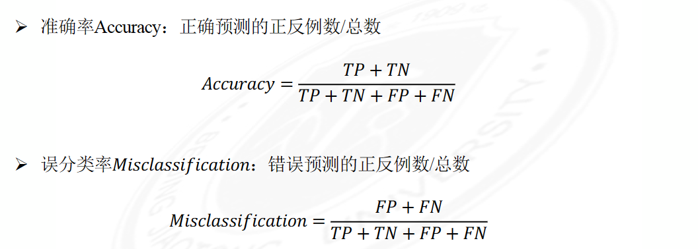
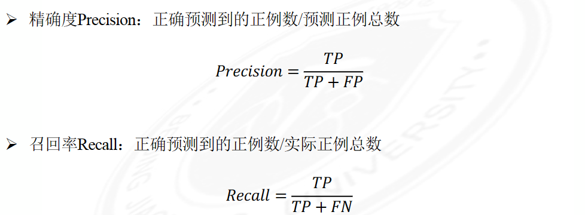
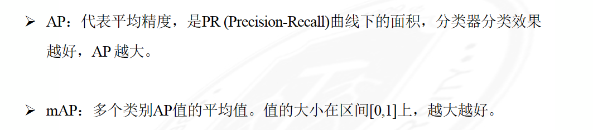
## 常用分类网络
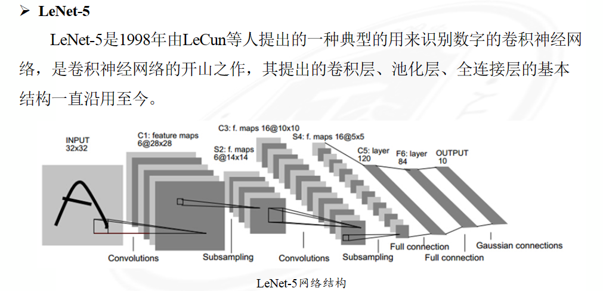
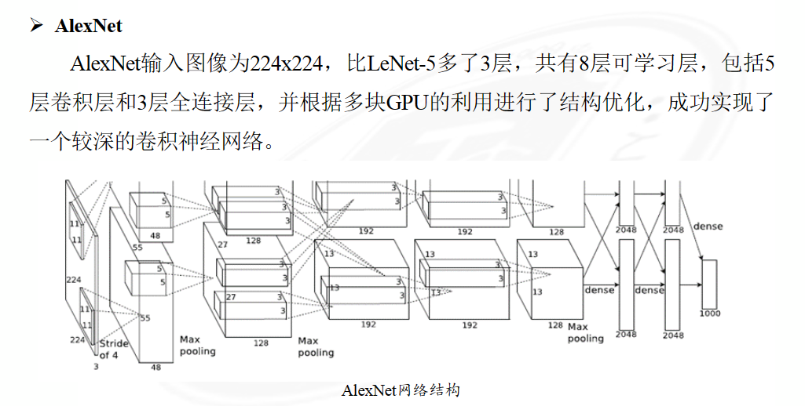
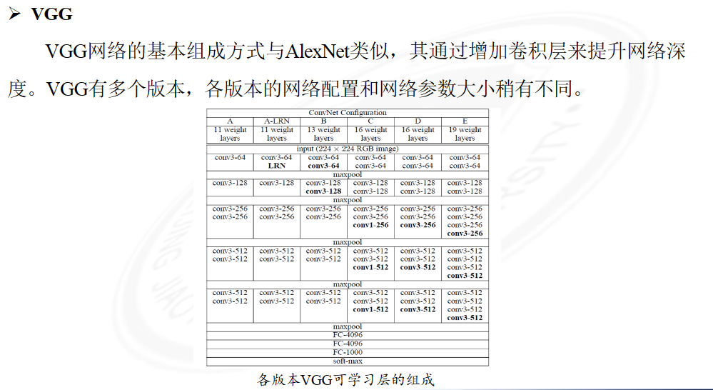

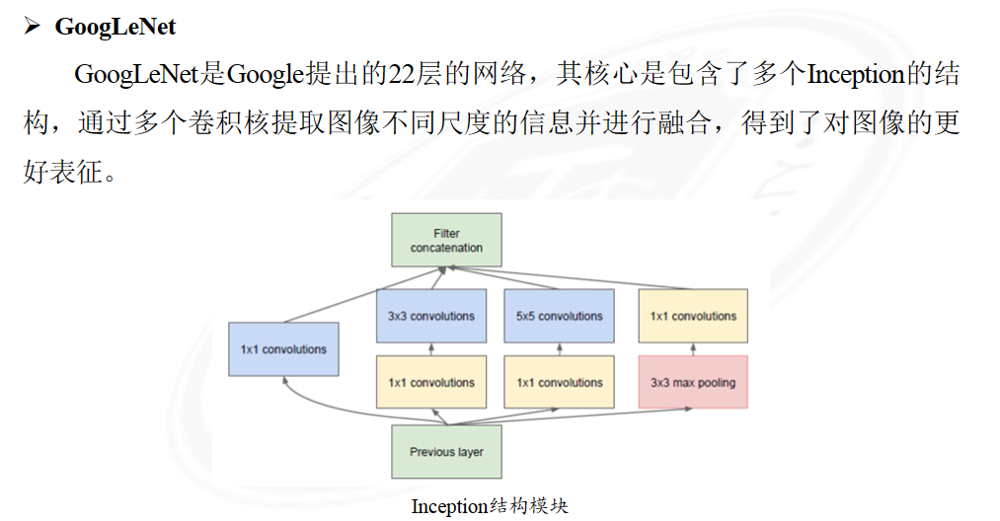
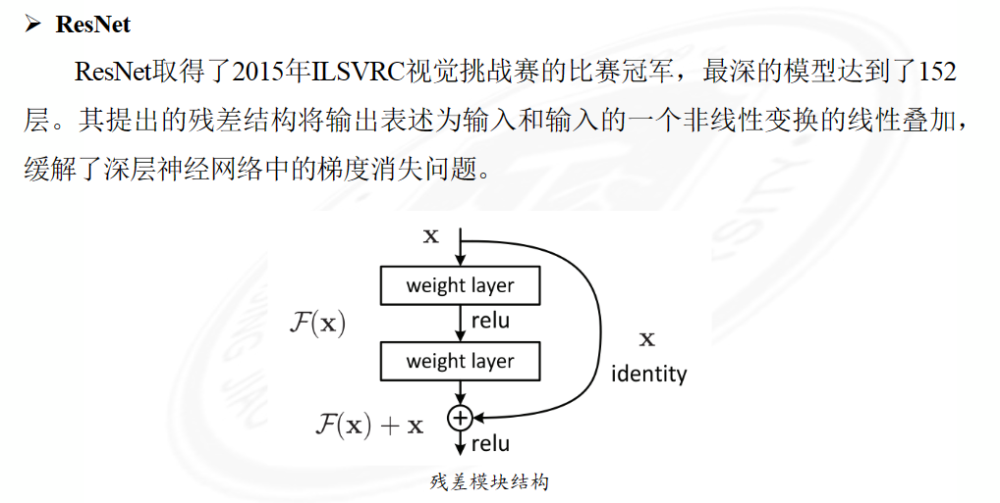
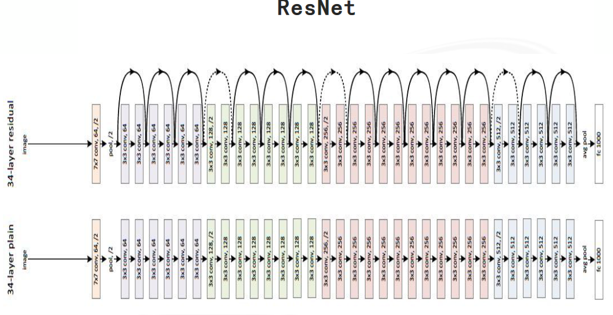
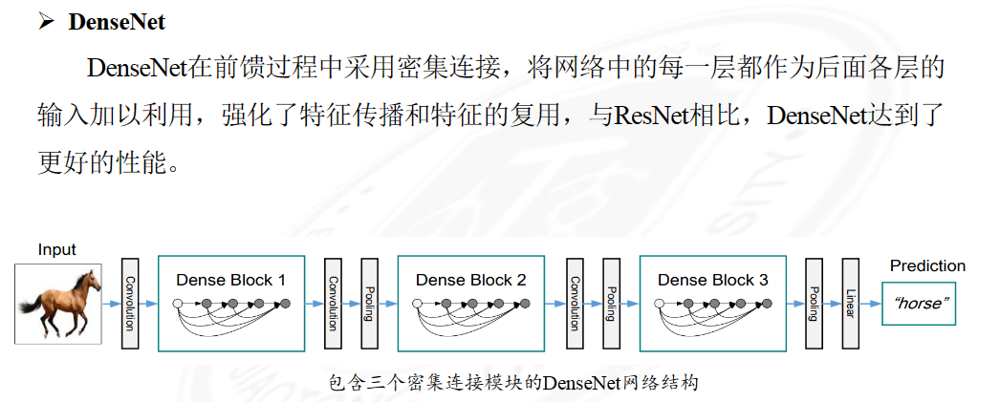
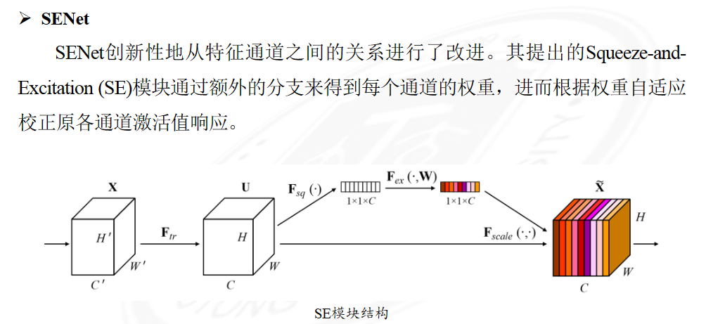
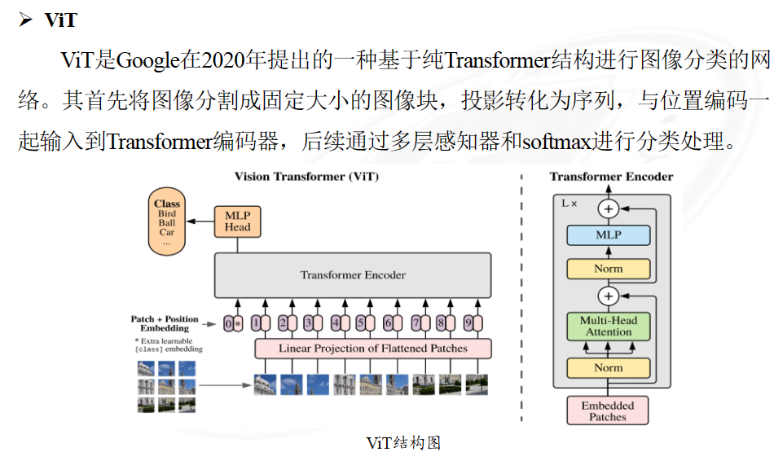

## 发展方向
- 解决同物种子类分类及实例级图像分类等问题；  
- 提升网络模型对噪声、干扰等对抗性样本的鲁棒性；  
- 模型准确度和速度平衡问题；  
- 减少对于标注样本的依赖。

