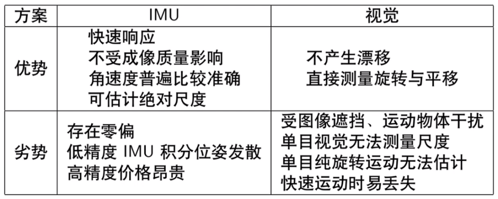
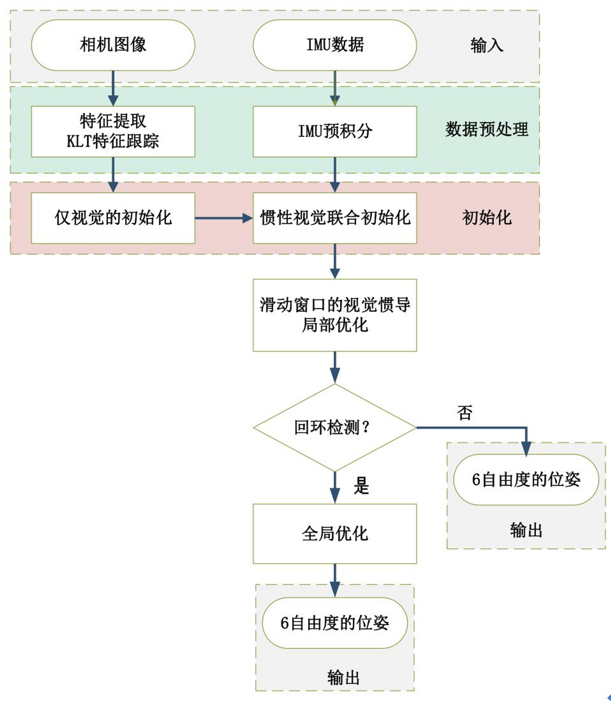
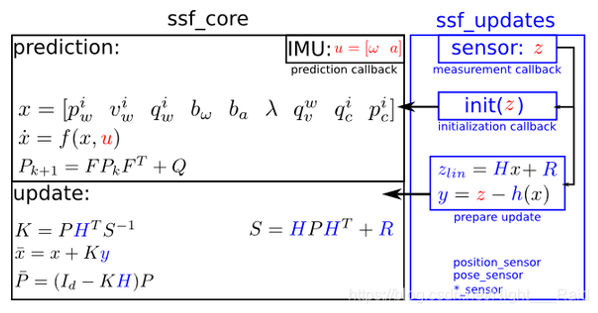
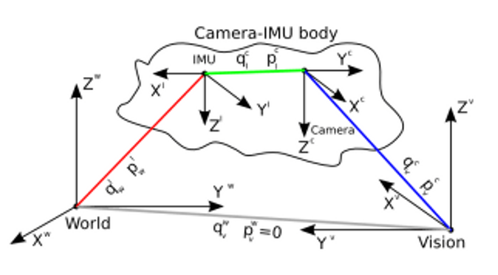
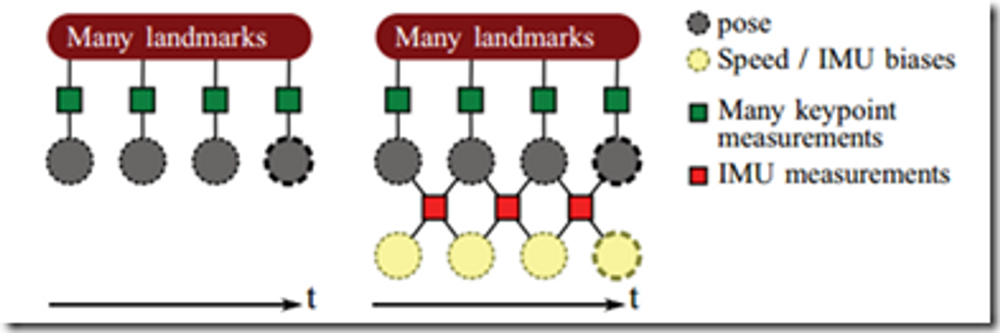
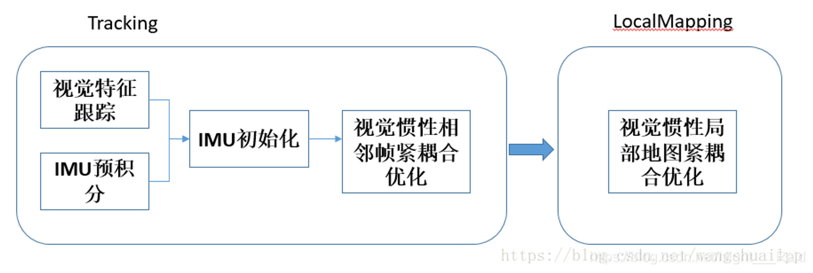
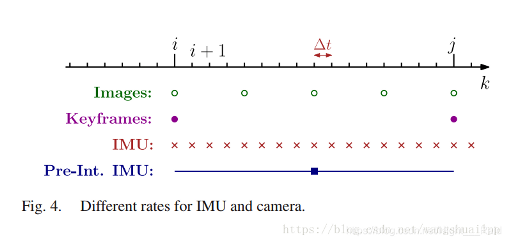
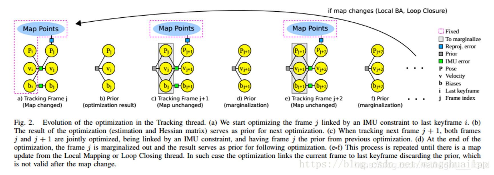
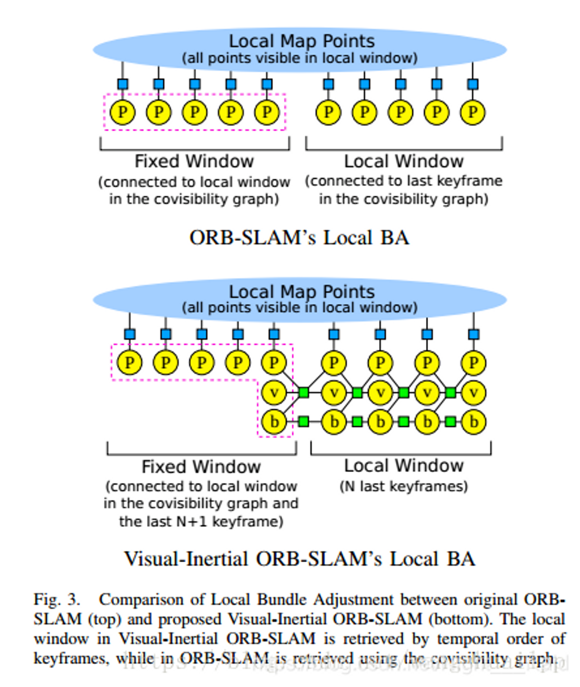

::: tips
VIO里程计相关介绍
:::

## 一、VIO视觉里程计

VIO算法和常规[SLAM](https://so.csdn.net/so/search?q=SLAM&spm=1001.2101.3001.7020)算法最大的不同在于两点：

-   VIO在硬件上需要传感器的融合，包括相机和六轴陀螺仪，相机产生图片，六轴陀螺仪产生加速度和角速度。相机相对准但相对慢，六轴陀螺仪的原始加速度如果拿来直接积分会在很短的时间漂移（zero-drift），但六轴陀螺仪的频率很高，在手机上都有200Hz。
-   VIO实现的是一种比较复杂而有效的非线性优化或者卡尔曼滤波，比如MSCKF（Multi-State-Constraint-Kalman-Filter），侧重的是快速的姿态跟踪，而不花精力来维护全局地图，也不做keyframe based SLAM里面的针对地图的全局优化（bundle adjustment）。

妥协结果：

-   视觉传感器在大多数纹理丰富的场景中效果很好，但是如果遇到玻璃，白墙等特征较少的场景，基本上无法工作；IMU长时间使用有非常大的累积误差，但是在短时间内，其相对位移数据又有很高的精度，所以当视觉传感器失效时，融合IMU数据，能够提高定位的精度。
-   无人车当中通常使用 差分GPS + IMU + 激光雷达（视觉）的定位方案。差分GPS在天气较好、遮挡较少的情况下能够获得很好的定位精度，但是在城市高楼区域、恶劣天气情况下效果下降非常多，这时候融合IMU+激光雷达（视觉）的方案刚好能够填补不足。

IMU能够测量传感器本体的角速度和加速度，被认为与相机传感器具有明显的互补性，而且十分有潜力在融合之后得到更完善的SLAM系统。

无人机的关键技术是定位，对于无人机定位来说，实时性是一个重要的条件。但是单目视觉SLAM算法存在一些自身框架无法克服的缺陷，视觉里程计常常需要在计算代价与精度之间做权衡。然而，IMU刚好可以弥补视觉SLAM的不足，融合IMU和视觉信息的 VIO算法能够很大程度地提高单目SLAM算法的性能，是一种低成本、高性能的导航方案，并且在无人机、机器人及AR/VR等领域都得到了应用。

## 二、VIO里程计的分类    
VIO的框架已经定型为两大类：
    
按照是否把图像特征信息加入状态向量来进行分类

-   松耦合（Loosely Coupled）松耦合是指**IMU和相机分别进行自身的运动估计**，然后对其位姿估计结果进行融合。
-   紧耦合（Tightly Coupled）紧耦合是指把**IMU的状态与相机的状态合**并在一起，共同构建运动方程和观测方程，然后进行状态估计。

紧耦合理论也必将分为 基于**滤波(filter-based)** 和 基于**优化(optimization-based)** 两个方向。

-   在滤波方面，传统的**EKF**以及改进的**MSCKF（Multi-State Constraint KF）**都取得了一定的成果，研究者对EKF也进行了深入的讨论（例如能观性）；
-   优化方面亦有相应的方案。

### **松耦合**

松耦合的方法采用**独立的惯性定位模块**和定位导航模块 ,

两个模块**更新频率不一致 ,** 模块之间存在一定的信息交换，在松耦合方式中**以惯性数据为核心** , 视觉测量数据修正惯性测量数据的累积误差。

松耦合方法中视觉定位方法作为一个黑盒模块 ,由于不考虑 IMU 信息的辅助 ,因此在视觉定位困难的地方不够鲁棒 , 另外该方法无法纠正视觉测量引入的漂移。

### **紧耦合**

紧耦合方式使用 IMU 完成视觉 VO 中的运动估计 ,IMU 在图像帧间的积分的误差比较小 , IMU的数据可用于预测帧间运动 ,加速完成点匹配 , 完成VO 位姿估计 .相对于松耦合 ,紧耦合的另外一个优点是 IMU 的尺度度量信息可以用于辅助视觉中的尺度的估计。

VIO视觉惯性里程计，有时也叫视觉惯性系统（VINS，visual-inertial system），是**融合相机和IMU数据**实现[SLAM](https://so.csdn.net/so/search?q=SLAM&spm=1001.2101.3001.7020)的算法，根据融合框架的不同又分为**松耦合**和**紧耦合**。

    
其中VO（visual odometry）指仅视觉的里程计，T表示位置和姿态。**松耦合**中**视觉运动估计**和**惯导运动估计**系统是两个**独立**的模块，将每个模块的**输出结果进行融合。**

**紧耦合**则是使用**两个传感器的原始数据共同估计**一组变量，**传感器噪声**也是相互影响的。紧耦合算法**比较复杂**，但充分利用了**传感器数据**，可以**实现更好的效果**，是目前研究的重点。

相机和IMU融合有很好的互补性。首先通过将**IMU 估计的位姿序列**和**相机估计的位姿序列对齐**可以估计出**相机轨迹的真实尺度**，而且IMU 可以很好地预测出**图像帧的位姿**以及**上一时刻特征点在下帧图像的位置**，提高**特征跟踪算法匹配速度**和应对**快速旋转**的算法鲁棒性，最后IMU 中加速度计提供的**重力向量**可以将**估计的位置**转为实际导航需要的**世界坐标系**中。

## 三、VIO里程计的算法流程 
整个流程图可以分解为五部分：数据预处理、初始化、局部非线性优化、回环检测和全局优化。

**各个模块的主要作用是：**

**图像和IMU数据预处理**：对于图像，提取特征点，利用KLT金字塔进行光流跟踪，为后面仅视觉初始化求解相机位姿做准备。对于IMU，将IMU数据进行预积分，得到当前时刻的位姿、速度、旋转角，同时计算在后端优化中将要用到的相邻帧间的预积分增量，及预积分的协方差矩阵和雅可比矩阵。

**初始化：**初始化中，首先进行仅视觉的初始化，解算出相机的相对位姿；然后再与IMU预积分进行对齐求解初始化参数。

**局部非线性优化：**对应流程图中滑动窗口的视觉惯导非线性优化，即将视觉约束、IMU约束放在一个大目标函数中进行优化，这里的局部优化也就是只优化当前帧及之前的n帧的窗口中的变量，局部非线性优化输出较为精确的位姿。

**回环检测：** 回环检测是将前面检测的图像关键帧保存起来，当再回到原来经过的同一个地方，通过特征点的匹配关系，判断是否已经来过这里。前面提到的关键帧就是筛选出来的能够记下但又避免冗余的相机帧（关键帧的选择标准是当前帧和上一帧之间的位移超过一定阈值或匹配的特征点数小于一定阈值）。

**全局优化：** 全局优化是在发生回环检测时，利用相机约束和IMU约束，再加上回环检测的约束，进行非线性优化。全局优化在局部优化的基础上进行，输出更为精确的位姿。

**算法核心**

局部优化会用到边缘化，仅用局部优化精度低，全局一致性差，但是速度快，IMU利用率高；仅用全局优化精度高，全局一致性好，但是速度慢，IMU利用率低；两者侧重点不同，所以将两者结合，可以优势互补。

因此小编设计实验采用局部优化和全局优化融合的方法。

局部优化是滑动窗口内相机帧的优化，全局优化是所有关键帧的优化，两者结合会产生边缘帧冲突的问题，因为局部优化会固定滑动窗口边缘帧，而全局优化发生回环检测的时候则会固定回环起点的帧。这里的**改进就是采用相对的位姿边缘化**，即边缘化以后的点是相对于它上一时刻关键帧的位姿而不是全局的位姿，这样局部优化边缘化相对位姿（关键帧），扔给全局优化整体优化。局部边缘化和全局边缘化的结合部分是关键帧。

相对边缘化可以具体解释为，相对边缘化的参考坐标系不再是世界坐标系，而是与当前帧共视且距离最近的一个关键帧的相机系（设为第k0帧）。视觉约束可以表示为：

区别于绝对边缘化的视觉约束

## 四、VIO里程计的算法实现 
****一、基于滤波器的紧耦合 Filter-based Tightly Coupled method****

1、**MSCKF：**

在传统的EKF-SLAM框架中，特征点的信息会加入到特征向量和协方差矩阵里,这种方法的缺点是特征点的信息会给一个初始深度和初始协方差，

如果不正确的话，极容易导致后面不收敛，出现inconsistent的情况。

MSCKF的目标是解决EKF-SLAM的维数爆炸问题。传统EKF-SLAM将特征点加入到状态向量中与IMU状态一起估计，当环境很大时，特征点会非常多，状态向量维数会变得非常大。MSCKF不是将特征点加入到状态向量，而是将不同时刻的相机位姿(位置和姿态四元数)加入到状态向量，特征点会被多个相机看到，从而在多个相机状态（Multi-State）之间形成几何约束（Constraint），进而利用几何约束构建观测模型对EKF进行update。由于相机位姿的个数会远小于特征点的个数，MSCKF状态向量的维度相较EKF-SLAM大大降低，历史的相机状态会不断移除，只维持固定个数的的相机位姿（Sliding Window），从而对MSCKF后端的计算量进行限定。

**EKF-SLAM:** 多个特征点同时约束一个相机位姿，进行KF更新

**MSCKF :** 一个特征点同时约束多个相机位姿(多相机观测同时优化，窗口多帧优化)，进行KF更新
    
-   传统的 EKF-based SLAM 做 IMU 融合时，一般是每个时刻的 系统状态向量(state vector) 包含当前的 位姿pose、速度velocity、以及 3D map points 坐标等（IMU 融合时一般还会加入 IMU 的 bias（飘逸: 零飘和溫飘）），然后用 IMU 做 预测predict step，再用 image frame 中观测 3D map points 的观测误差做 更新update step。
-   MSCKF 的 motivation改进 是，EKF的每次 更新(类似优化)update step 是基于 3D map points 在单帧 frame 里观测的，如果能基于其在多帧中的观测效果应该会好（有点类似于 local bundle adjustment 的思想）。所以 MSCKF 的改进如下：预测阶段predict step 跟 EKF 一样，而 更新阶段update step 推迟到某一个 3D map point 在多个 frame 中观测之后进行计算，在 update 之前每接收到一个 frame，只是将 state vector 扩充并加入当前 frame 的 pose estimate。这个思想基本类似于 local bundle adjustment（或者 sliding window smoothing），在update step时，相当于基于多次观测同时优化 pose 和 3D map point。

2、**ROVIO：**

基于稀疏图像块的EKF滤波实现的VIO

**优点**：计算量小(EKF，稀疏的图像块)，但是对应不同的设备需要调参数，参数对精度很重要。

**缺点**：没有闭环.，没有mapping thread。，经常存在误差会残留到下一时刻。

****二、基于滤波器的松耦合 Filter-based Loosely Coupled method****

松耦合的方法则简单的多，避免把图像的feature加入状态向量，而是把图像当成一个black box,计算vo处理之后才和imu数据进行融合。

1**. ssf**

    [https://github.com/Ewenwan/ethzasl_sensor_fusion](https://github.com/Ewenwan/ethzasl_sensor_fusion)
    

红色字体部分是从传感器获取的数据，用于输入到预测(prediction)和更新阶段(update).

蓝色字体是更新阶段会变化的部分。

黑色部分为约束部分，是不变的。

变量：p for pwi: 在世界坐标下的 IMU位置 IMU position in the world framev for vwi: 在世界坐标下的 IMU速度 IMU velocity in the world frameq for qwi: 在世界坐标下的 IMU姿态 IMU attitude in the world frame

b_w for bw: 陀螺仪漂移 the gyro biasesb_a for ba: 陀螺仪漂移 the accelerometer biases

L for λ: 视觉尺度因子 the visual scale factor with pmetric*λ = psensor

q_wv for q,vw: 更新阶段参考帧(相机参考帧) 和 世界参考帧 之间的姿态变化q_ci for qic: IMU and the update-sensor(相机) 姿态变化p_ci for pic: IMU and the update-sensor(相机) 位置变换

2**. msf**

[https://github.com/Ewenwan/ethzasl_msf](https://github.com/Ewenwan/ethzasl_msf)

****三、基于优化的松耦合 Optimization-based Tightly Coupled method****

松耦合的工作不多

****四、基于优化的紧耦合 Optimization-based Loosely Coupled method****

1**. OKVIS**
    
前端：多目+IMU 后端：ceres solver优化库

上图左边是纯视觉的odemorty,右边是视觉IMU融合的odemorty结构，

这个核心在于Frame通过IMU进行了联合，

但是IMU自身测量有一个随机游走的偏置，

所以每一次测量又通过这个偏置联合在了一起，

形成了右边那个结构，对于这个新的结构，

我们需要建立一个统一的损失函数进行联合优化.

相对应于MSCKF的filter-based SLAM派系，OKVIS是keyframe-based SLAM派系做visual-inertial sensor fusion的代表。从MSCKF的思想基本可以猜出，OKVIS是将image观测和imu观测显式formulate成优化问题，一起去优化求解pose和3D map point。的确如此，OKVIS的优化目标函数包括一个reprojection error term(重投影误差)和一个imu integration error term(imu积分误差)，

其中已知的观测数据是每两帧之间的feature matching(特征匹配)以及这两帧之间的所有imu采样数据的积分，注意imu采样频率一般高于视频frame rate，待求的是camera pose和3D map point，优化针对的是一个bounded window内的frames（包括最近的几个frames和几个keyframes）。

需要注意的是，在这个optimization problem中，对uncertainty(不确定性，类似方差)的建模还是蛮复杂的。首先是对imu的gyro和accelerometer的bias(漂移)都需要建模，并在积分的过程中将uncertainty(不确定性，类似方差)也积分，所以推导两帧之间的imu integration error(imu积分误差)时，需要用类似于Kalman filter中predict step(预测阶段)里的，uncertainty propagation(不确定性传播)方式去计算covariance(协方差矩阵)。

另外，imu的kinematics微分方程也是挺多数学公式，这又涉及到捷联惯性导航(strapdown inertial navigation) [https://www.cl.cam.ac.uk/techreports/UCAM-CL-TR-696.pdf](https://www.cl.cam.ac.uk/techreports/UCAM-CL-TR-696.pdf)

OKVIS使用keyframe的motivation(创新点)是，由于optimization算法速度的限制，优化不能针对太多frames一起，所以尽量把一些信息量少的frames给marginalization(滤出)掉，只留下一些keyframes之间的constraints。关于marginalization的机制也挺有趣。
    
1.  **VI-ORB（ORB-SLAM3）**
    
ORB稀疏前端、图优化(g2o)后端、带闭环检测和重定位

ORB_SLAM2的作者在2017年提出了具有地图重用功能的单目视觉惯性定位算法VI-ORB，后延续到了ORB-SLAM3。该算法的具体思路和港科大的VINS有着异曲同工之妙，整体过程可分为下面几个部分：

-   整体流程与基础知识总结

-   基于流型的IMU预积分

-   IMU初始化（视觉惯性联合初始化）

-   紧耦合优化模型

1 视觉特征跟踪和基于流型IMU预积分

(1)IMU初始化（视觉惯性联合初始化）终于来到视觉惯性初始化阶段了，这段是视觉和惯性数据融合的第一步，是一段**松耦合**过程。理论上是将准确的视觉数据（但缺少尺度）和快速的IMU数据（需要重力加速度又存在零偏误差）相结合。

-   **陀螺仪偏置标定（零偏）**这一部分比较简单，直接联立N-1个相机做旋转矩阵的最小二乘即可，然后通过高斯牛顿方法即可得到零偏bg。需要注意一点，当求出零偏后将其代入预积分公式会重新计算一遍预积分值，使预积分数值更加准确.
-   **尺度恢复和重力加速度预估**首先建立预估状态向量X=[s,gw]，其中s是尺度，gw是世界坐标系下的重力加速度也是第一个相机坐标系下的重力加速度。ORB_SLAM2中世界坐标选取的是第一个相机对应的坐标（VINS则不同），这样做会存在一个问题，因为第一个相机可能自身存在一定的旋转倾斜导致整个世界坐标看起来是歪着的，画轨迹的时候有一种倾斜的即视感，所以我觉得还是尽量固定好z方向，使轨迹没有横滚和俯仰。这里使用了三个关键帧联立视觉和IMU预积分数据构建一个AX=B的最小二乘超定方程，至少需要四个关键帧，采用奇异值分解求最小二乘问题，速度较慢但精度高。
-   **加速度计偏置标定和尺度重力加速度优化**上面计算过程没有考虑到加速度计偏置的影响，使得重力加速度和加速度计偏置难以区分，很有可能会导致系统病态性问题，文中提出了重力加速度的大小G，假设其是一个不变值，优化重力加速度的方向。

(2)紧耦合优化模型

2. **VINS-Mono**

前端基于KLT跟踪算法， 后端基于滑动窗口的优化(采用ceres库)， 基于DBoW的回环检测

