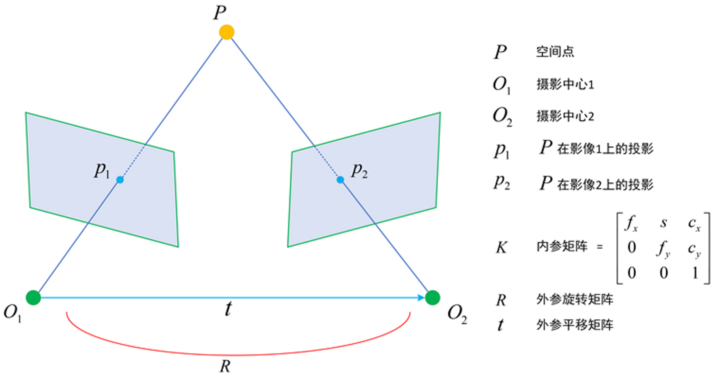
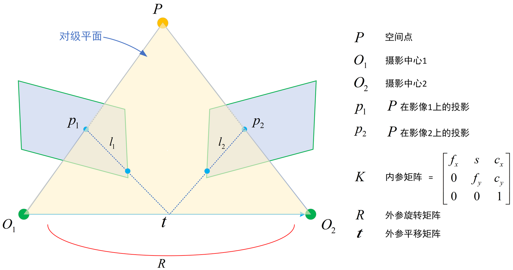
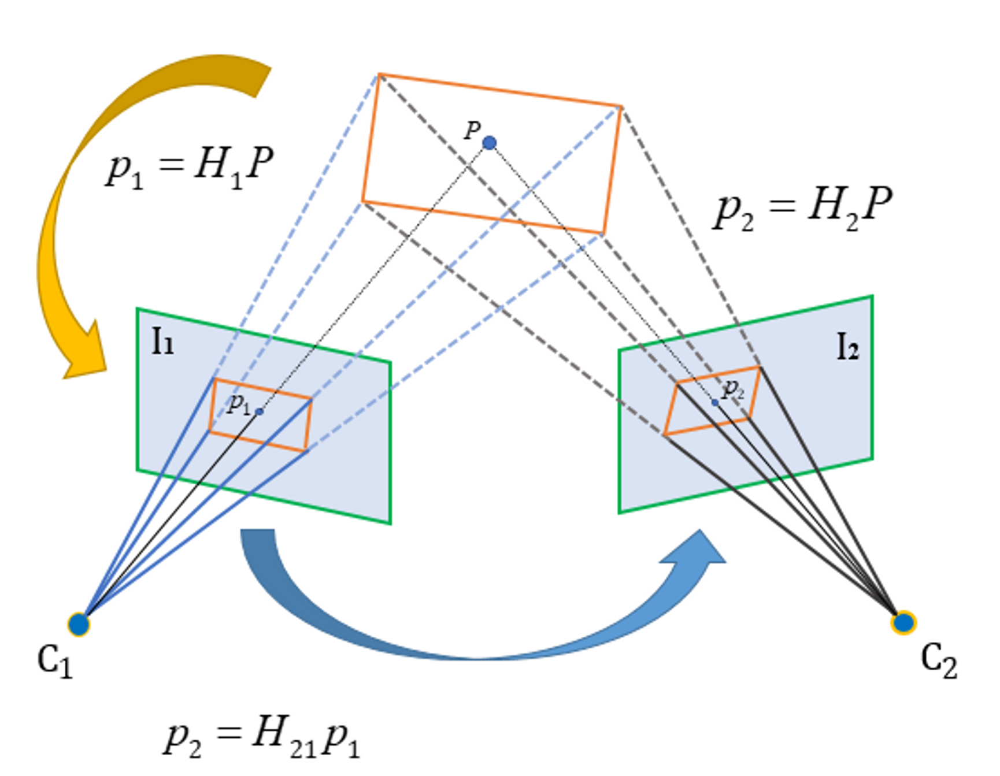
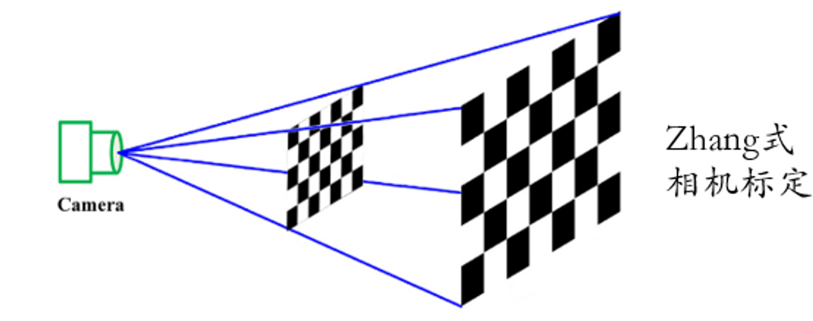
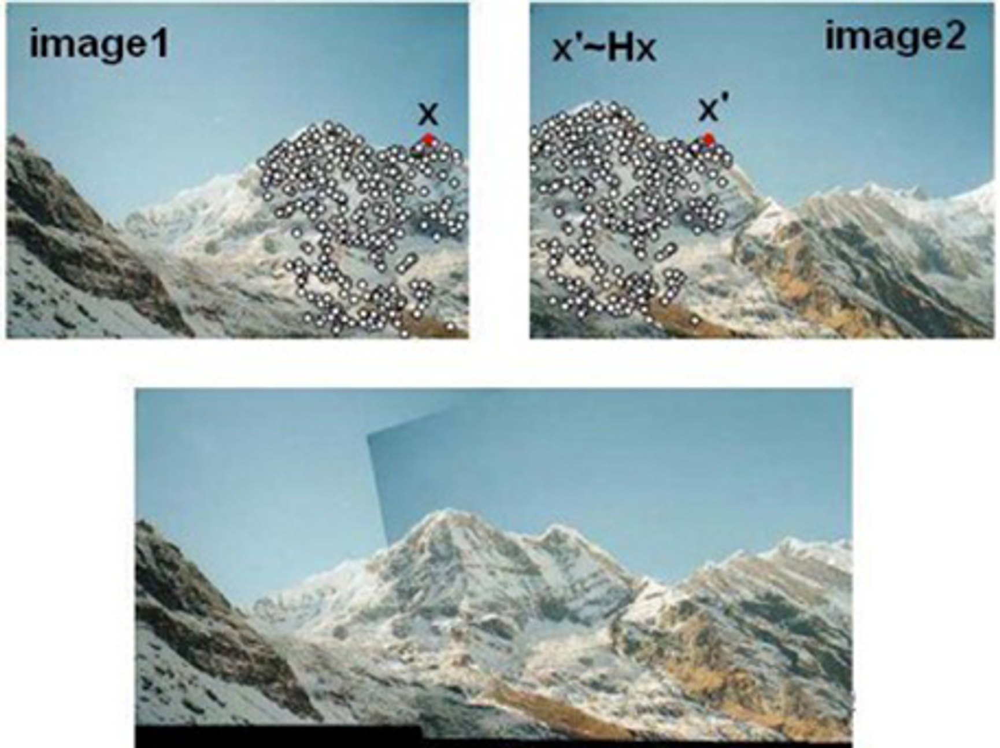
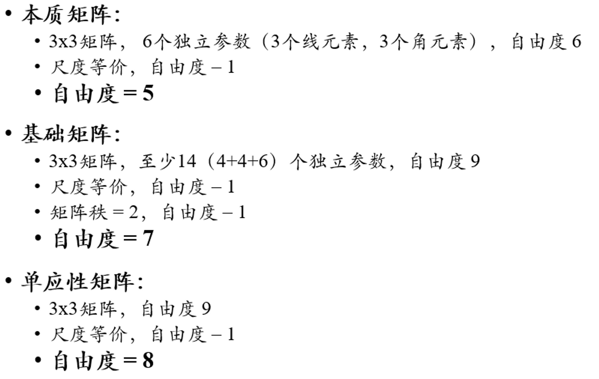
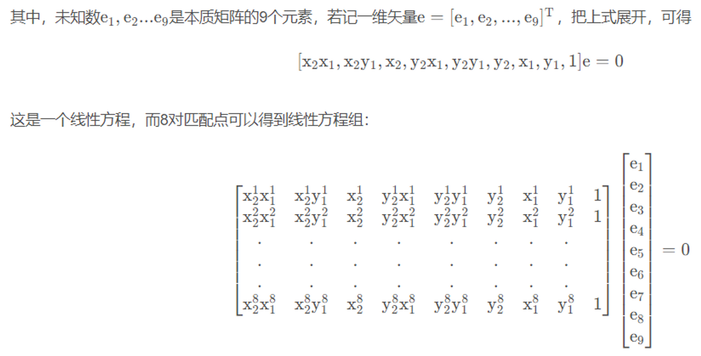
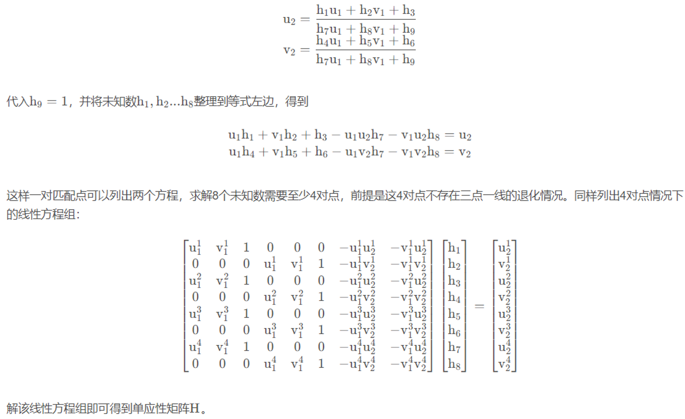

::: tip
立体视觉
:::

一个典型的双目结构图。

对于R和t，我们给出纯数学上的描述，假设空间点P在左相机相机坐标系下的坐标为$P$，在右相机相机坐标系下的坐标为$P'$，则满足：

$P'=R*P+t$

除此之外，还通常会**将双目系统的世界坐标系放在左相机的中心**，**并和左相机坐标系完全重合**，从这个角度来说，R , t R,tR,t就相当于是右相机在世界坐标系下的外参，而左相机在世界坐标系的外参则是$[I,0]$（$I$是单位矩阵）。

**本质矩阵E：Essential matrix**和**基础矩阵F：Fundamental matrix**。得到更简洁的表示形式：

$x_2^TEx_1=0,p_2^TFp_1=0$

其中$x_1,x_2$是相机坐标系下的坐标，$p_1,p_2$是图像坐标系下的坐标。

本质矩阵和基础矩阵并不是两个像素之间的相互转换关系，而是一种坐标之间的内在约束式

**单应性矩阵Homography matrix**，但有特定条件：当空间中场景是同一个平面时，它们在左右视图的投影点可通过可逆的单应性矩阵一对一相互转换，表达式为：$p_2=Hp_1,p_1=H^{-1}p_2,$

实际上，单应性矩阵不只是描述同一平面的像素点之间的关系，而是同一个平面在任意坐标系之间都可以建立单应性变换关系，比如影像坐标系与影像坐标系之间，世界坐标系和影像坐标系之间，如下图所示:

在双目立体视觉内，单应性变换是Zhang式相机标定法[1](https://blog.csdn.net/rs_lys/article/details/113854675?ops_request_misc=%257B%2522request%255Fid%2522%253A%2522166513394116800186584818%2522%252C%2522scm%2522%253A%252220140713.130102334.pc%255Fall.%2522%257D&request_id=166513394116800186584818&biz_id=0&utm_medium=distribute.pc_search_result.none-task-blog-2~all~first_rank_ecpm_v1~pc_rank_34-1-113854675-null-null.142^v51^pc_rank_34_1,201^v3^add_ask&utm_term=%E7%AB%8B%E4%BD%93%E8%A7%86%E8%A7%89%EF%BC%9A%E5%9F%BA%E6%9C%AC%E7%9F%A9%E9%98%B5%E3%80%81%E6%9C%AC%E8%B4%A8%E7%9F%A9%E9%98%B5&spm=1018.2226.3001.4187#refer-anchor-1)的理论基础，纯平的标定板平面和影像平面存在单应性变换关系，同时它们存在世界坐标系到影像坐标系之间的投影变换关系，两个关系对等即可解出相机的内外参数。

单应性变换的另一个典型应用是图像拼接，将像素点假象成一个局部小平面，并求解局部的单应性矩阵，即可建立两个视图之间像素的一一映射，从而完成拼接。

**本质矩阵求解**
本质矩阵E的自由度是5，一对点可以列1个方程，这表明最少要用5对点来求解；但是由于这5个自由度是非线性相关的，如果要用5对来求解，就涉及到非线性解算，比较麻烦，所以更常见的方法是不按照E的真实自由度，而是只考虑尺度等价性，把E当做8个自由度来求解，最少用8对点，称之为8点法。
假设一对匹配点在左右视图的像素坐标分别为$p_1=[u_1,v_1,1]^T,p_2=[u_2,v_2,1]$，左乘内参矩阵K之后的坐标为$x_1=[x_1,y_1,1]^T,x_2=[x_2,y_2,1]^T$,则根据对极约束$x_2^TEx_1=0,$有：

$[x_2 \quad y_2 \quad 1]\begin{bmatrix} e_1 & e_2&e_3 \\ e_4 & e_5&e_6 \\e_7 & e_8&e_9 \end{bmatrix}\begin{bmatrix} x_1 \\ y_1 \\1 \end{bmatrix}=0$

解该线性方程$Ae=0$得到矢量e，即可得到本质矩阵E。矢量e为系数矩阵A的零空间，由线性代数的知识可知方程的特解数为$9-rank(A),当rank(A)=8时$，存在唯一特解，方程所有解均为特解的常数倍，正对应着E尺度不变性的性质。

一般情况下，我们基于大量观测值求最小二乘解：矢量e 是方阵$A^TA$最小特征值对应的特征向量。另外，奇异值分解也是一种解法。

需要注意的是，由于噪声的存在，通过线性方程解出来的本质矩阵，大概率不满足内在性质，即奇异值不是$[\sigma,\sigma,0]$的形式，通常的做法是将奇异值强制调整成$[\sigma,\sigma,0]$的形式，若对求解得到的E进行SVD分解,得到奇异矩阵$\sum=dig([\sigma{_1},\sigma{_2},\sigma{_3}])$,不妨设$\sigma{_1},\sigma{_2}>\sigma{_3}$，则更新E为:

$E=U\begin{bmatrix} \frac{\sigma{_1}+\sigma{_2}}2{} & & \\  & \frac{\sigma{_1}+\sigma{_2}}2&\\ & &0 \end{bmatrix}V^T$

实际上就是把最小值去掉（最小值大概率是接近0的），让新的σ 取两个大值的平均值。另一种更简单做法是直接让σ=1，因为E的尺度等价性质。

### **单应性矩阵求解**

单应性矩阵的自由度是8，一对点可以列2个方程，这表明最少要用4对点来求解。假设一对匹配点在左右视图的像素坐标分别为：

$p_1=[u_1,v_1,1]^T,p_2=[u_2,v_2,1]$,则根据对极约束$p_2=Hp_1$，有：

$\begin{bmatrix}u_1\\v_1\\1\end{bmatrix}=\begin{bmatrix} e_1 & e_2&e_3 \\ e_4 & e_5&e_6 \\e_7 & e_8&e_9 \end{bmatrix}\begin{bmatrix} u_2 \\ v_2 \\1 \end{bmatrix}$

上式具有尺度不变性，即H可以乘以任意非零常数，那我们不妨让$h_9=1(即H除以h_9)$，按照齐次公式的常规处理方式，我们会让第1，2行除以第3行以去除尺度因子，可得：
