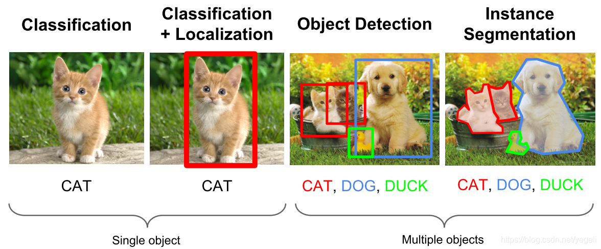
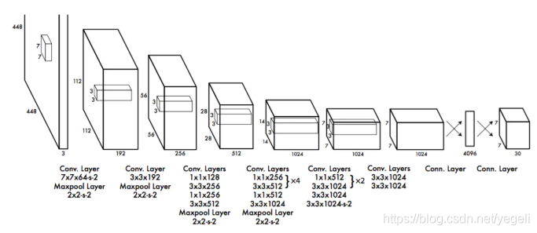

## 一、基本概念
### 1. 什么是目标检测
目标检测（Object Detection）的任务是找出图像中所有感兴趣的目标（物体），确定它们的类别和位置，是计算机视觉领域的核心问题之一。由于各类物体有不同的外观、形状和姿态，加上成像时光照、遮挡等因素的干扰，目标检测一直是计算机视觉领域最具有挑战性的问题。

计算机视觉中关于图像识别有四大类任务：

（1）分类-Classification：解决“是什么？”的问题，即给定一张图片或一段视频判断里面包含什么类别的目标。

（2）定位-Location：解决“在哪里？”的问题，即定位出这个目标的的位置。

（3）检测-Detection：解决“在哪里？是什么？”的问题，即定位出这个目标的位置并且知道目标物是什么。

（4）分割-Segmentation：分为实例的分割（Instance-level）和场景分割（Scene-level），解决“每一个像素属于哪个目标物或场景”的问题。

所以，目标检测是一个分类、回归问题的叠加。

### 2. 目标检测的核心问题
（1）分类问题：即图片（或某个区域）中的图像属于哪个类别。

（2）定位问题：目标可能出现在图像的任何位置。

（3）大小问题：目标有各种不同的大小。

（4）形状问题：目标可能有各种不同的形状。

### 3. 目标检测算法分类
基于深度学习的目标检测算法主要分为两类：Two stage和One stage。

1）Tow Stage
先进行区域生成，该区域称之为region proposal（简称RP，一个有可能包含待检物体的预选框），再通过卷积神经网络进行样本分类。

任务流程：特征提取 --> 生成RP --> 分类/定位回归。

常见tow stage目标检测算法有：R-CNN、SPP-Net、Fast R-CNN、Faster R-CNN和R-FCN等。

2）One Stage
不用RP，直接在网络中提取特征来预测物体分类和位置。

任务流程：特征提取–> 分类/定位回归。

常见的one stage目标检测算法有：OverFeat、YOLOv1、YOLOv2、YOLOv3、SSD和RetinaNet等。

### 4. 目标检测应用
1）人脸检测
智能门控
员工考勤签到
智慧超市
人脸支付
车站、机场实名认证
公共安全：逃犯抓捕、走失人员检测
2）行人检测
智能辅助驾驶
智能监控
暴恐检测（根据面相识别暴恐倾向）
移动侦测、区域入侵检测、安全帽/安全带检测
3）车辆检测
自动驾驶
违章查询、关键通道检测
广告检测（检测广告中的车辆类型，弹出链接）
4）遥感检测
大地遥感，如土地使用、公路、水渠、河流监控

农作物监控

军事检测

## 二、目标检测原理
目标检测分为两大系列——RCNN系列和YOLO系列，RCNN系列是基于区域检测的代表性算法，YOLO是基于区域提取的代表性算法，另外还有著名的SSD是基于前两个系列的改进。

### 1. 候选区域产生
很多目标检测技术都会涉及候选框（bounding boxes）的生成，物体候选框获取当前主要使用图像分割与区域生长技术。区域生长(合并)主要由于检测图像中存在的物体具有局部区域相似性(颜色、纹理等)。目标识别与图像分割技术的发展进一步推动有效提取图像中信息。

1）滑动窗口
通过滑窗法流程图可以很清晰理解其主要思路：首先对输入图像进行不同窗口大小的滑窗进行从左往右、从上到下的滑动。每次滑动时候对当前窗口执行分类器(分类器是事先训练好的)。如果当前窗口得到较高的分类概率，则认为检测到了物体。对每个不同窗口大小的滑窗都进行检测后，会得到不同窗口检测到的物体标记，这些窗口大小会存在重复较高的部分，最后采用非极大值抑制(Non-Maximum Suppression, NMS)的方法进行筛选。最终，经过NMS筛选后获得检测到的物体。
滑窗法简单易于理解，但是不同窗口大小进行图像全局搜索导致效率低下，而且设计窗口大小时候还需要考虑物体的长宽比。所以，对于实时性要求较高的分类器，不推荐使用滑窗法。


2）选择性搜索
① 什么是选择性搜索
滑窗法类似穷举进行图像子区域搜索，但是一般情况下图像中大部分子区域是没有物体的。学者们自然而然想到只对图像中最有可能包含物体的区域进行搜索以此来提高计算效率。选择搜索（selective search，简称SS）方法是当下最为熟知的图像bounding boxes提取算法，由Koen E.A于2011年提出。
选择搜索算法的主要思想：图像中物体可能存在的区域应该是有某些相似性或者连续性区域的。因此，选择搜索基于上面这一想法采用子区域合并的方法进行提取bounding boxes。首先，对输入图像进行分割算法产生许多小的子区域。其次，根据这些子区域之间相似性(相似性标准主要有颜色、纹理、大小等等)进行区域合并，不断的进行区域迭代合并。每次迭代过程中对这些合并的子区域做bounding boxes(外切矩形)，这些子区域外切矩形就是通常所说的候选框。

② 选择搜索流程
step0：生成区域集R
step1：计算区域集R里每个相邻区域的相似度S={s1, s2,…}
step2：找出相似度最高的两个区域，将其合并为新集，添加进R
step3：从S中移除所有与step2中有关的子集
step4：计算新集与所有子集的相似度
step5：跳至step2，直至S为空
③ 选择搜索优点
计算效率优于滑窗法
由于采用子区域合并策略，所以可以包含各种大小的疑似物体框
合并区域相似的指标多样性，提高了检测物体的概率
### 2. 数据表示
经过标记后的样本数据如下所示：


预测输出可以表示为:


### 3. 效果评估

使用IoU（Intersection over Union，交并比）来判断模型的好坏。所谓交并比，是指预测边框、实际边框交集和并集的比率，一般约定0.5为一个可以接收的值。


### 4. 非极大值抑制
预测结果中，可能多个预测结果间存在重叠部分，需要保留交并比最大的、去掉非最大的预测结果，这就是非极大值抑制（Non-Maximum Suppression，简写作NMS）。如下图所示，对同一个物体预测结果包含三个概率0.8/0.9/0.95，经过非极大值抑制后，仅保留概率最大的预测结果。
## 三、目标检测模型
### 1. R-CNN系列
1）R-CNN
① 定义
R-CNN(全称Regions with CNN features) ，是R-CNN系列的第一代算法，其实没有过多的使用“深度学习”思想，而是将“深度学习”和传统的“计算机视觉”的知识相结合。比如R-CNN pipeline中的第二步和第四步其实就属于传统的“计算机视觉”技术。使用selective search提取region proposals，使用SVM实现分类。


② 流程
预训练模型。选择一个预训练 （pre-trained）神经网络（如AlexNet、VGG）。
重新训练全连接层。使用需要检测的目标重新训练（re-train）最后全连接层（connected layer）。
提取 proposals并计算CNN 特征。利用选择性搜索（Selective Search）算法提取所有proposals（大约2000幅images），调整（resize/warp）它们成固定大小，以满足 CNN输入要求（因为全连接层的限制），然后将feature map 保存到本地磁盘。
训练SVM。利用feature map 训练SVM来对目标和背景进行分类（每个类一个二进制SVM）
边界框回归（Bounding boxes Regression）。训练将输出一些校正因子的线性回归分类器
③ 效果
R-CNN在VOC 2007测试集上mAP达到58.5%，打败当时所有的目标检测算法
④ 缺点
重复计算，每个region proposal，都需要经过一个AlexNet特征提取，为所有的RoI（region of interest）提取特征大约花费47秒，占用空间
selective search方法生成region proposal，对一帧图像，需要花费2秒
三个模块（提取、分类、回归）是分别训练的，并且在训练时候，对于存储空间消耗较大

2）Fast R-CNN
① 定义
Fast R-CNN是基于R-CNN和SPPnets进行的改进。SPPnets，其创新点在于只进行一次图像特征提取（而不是每个候选区域计算一次），然后根据算法，将候选区域特征图映射到整张图片特征图中。


② 流程
使用selective search生成region proposal，大约2000个左右区域候选框
(joint training)缩放图片的scale得到图片金字塔，FP得到conv5的特征金字塔
(joint training)对于每个scale的每个ROI，求取映射关系，在conv5中剪裁出对应的patch。并用一个单层的SSP layer来统一到一样的尺度（对于AlexNet是6*6）
(joint training) 继续经过两个全连接得到特征，这特征又分别共享到两个新的全连接，连接上两个优化目标。第一个优化目标是分类，使用softmax，第二个优化目标是bbox regression，使用了一个平滑的L1-loss
测试时需要加上NMS处理：利用窗口得分分别对每一类物体进行非极大值抑制提出重叠建议框，最终得到每个类别中回归修正后的得分最高的窗口
③ 改进
和RCNN相比，训练时间从84小时减少为9.5小时，测试时间从47秒减少为0.32秒。在VGG16上，Fast RCNN训练速度是RCNN的9倍，测试速度是RCNN的213倍；训练速度是SPP-net的3倍，测试速度是SPP-net的3倍
Fast RCNN在PASCAL VOC 2007上准确率相差无几，约在66~67%之间
加入RoI Pooling，采用一个神经网络对全图提取特征
在网络中加入了多任务函数边框回归，实现了端到端的训练
④ 缺点
依旧采用selective search提取region proposal（耗时2~3秒，特征提取耗时0.32秒）
无法满足实时应用，没有真正实现端到端训练测试
利用了GPU，但是region proposal方法是在CPU上实现的
3）Faster RCNN
经过R-CNN和Fast-RCNN的积淀，Ross B.Girshick在2016年提出了新的Faster RCNN，在结构上将特征抽取、region proposal提取， bbox regression，分类都整合到了一个网络中，使得综合性能有较大提高，在检测速度方面尤为明显。

① 整体流程
Conv Layers。作为一种CNN网络目标检测方法，Faster RCNN首先使用一组基础的卷积/激活/池化层提取图像的特征，形成一个特征图，用于后续的RPN层和全连接层。
Region Proposal Networks（RPN）。RPN网络用于生成候选区域，该层通过softmax判断锚点（anchors）属于前景还是背景，在利用bounding box regression（包围边框回归）获得精确的候选区域。
RoI Pooling。该层收集输入的特征图和候选区域，综合这些信息提取候选区特征图（proposal feature maps），送入后续全连接层判定目标的类别。
Classification。利用取候选区特征图计算所属类别，并再次使用边框回归算法获得边框最终的精确位置。
② Anchors
Anchors（锚点）指由一组矩阵，每个矩阵对应不同的检测尺度大小。如下矩阵：

[[ -84.  -40.  99.  55.]
 [-176.  -88. 191. 103.]
 [-360. -184. 375. 199.]
 [ -56.  -56.  71.  71.]
 [-120. -120. 135. 135.]
 [-248. -248. 263. 263.]
 [ -36.  -80.  51.  95.]
 [ -80. -168.  95. 183.]
 [-168. -344. 183. 359.]]


例如，一张800*600的原始图片，经过VGG下采样后(生成特征矩阵)16倍大小，大小变为50*38，每个点设置9个anchor，则总数为：

```
ceil(800 / 16) * ceil(600 / 16) * 9 = 50 * 38 * 9 = 17100
```
③ Bounding box regression
物体识别完成后，通过一种方式对外围框进行调整，使得和目标物体更加接近。

④ 损失函数
对一个图像的损失函数，是一个分类损失函数与回归损失函数的叠加：


⑤ 改进
在VOC2007测试集测试mAP达到73.2%，目标检测速度可达5帧/秒
提出Region Proposal Network(RPN)，取代selective search，生成待检测区域，时间从2秒缩减到了10毫秒
真正实现了一个完全的End-To-End的CNN目标检测模型
共享RPN与Fast RCNN的特征
⑥ 缺点
还是无法达到实时检测目标
获取region proposal， 再对每个proposal分类计算量还是较大
### 2. YOLO系列
1）YOLOv1（2016）
① 基本思想
YOLO（You Only Look Once ）是继RCNN，fast-RCNN和faster-RCNN之后，Ross Girshick针对DL目标检测速度问题提出的另一种框架，其核心思想是生成RoI+目标检测两阶段（two-stage）算法用一套网络的一阶段（one-stage）算法替代，直接在输出层回归bounding box的位置和所属类别。

之前的物体检测方法首先需要产生大量可能包含待检测物体的先验框, 然后用分类器判断每个先验框对应的边界框里是否包含待检测物体，以及物体所属类别的概率或者置信度，同时需要后处理修正边界框，最后基于一些准则过滤掉置信度不高和重叠度较高的边界框，进而得到检测结果。这种基于先产生候选区再检测的方法虽然有相对较高的检测准确率，但运行速度较慢。

YOLO创造性的将物体检测任务直接当作回归问题（regression problem）来处理，将候选区和检测两个阶段合二为一。只需一眼就能知道每张图像中有哪些物体以及物体的位置。下图展示了各物体检测系统的流程图。


实际上，YOLO并没有真正去掉候选区，而是采用了预定义候选区的方法，也就是将图片划分为7*7个网格，每个网格允许预测出2个边框，总共49*2个bounding box，可以理解为98个候选区域，它们很粗略地覆盖了图片的整个区域。YOLO以降低mAP为代价，大幅提升了时间效率。


每个网格单元预测这些框的2个边界框和置信度分数。这些置信度分数反映了该模型对框是否包含目标的可靠程度，以及它预测框的准确程度。置信度定义为：


如果该单元格中不存在目标，则置信度分数应为零。否则，我们希望置信度分数等于预测框与真实值之间联合部分的交集（IOU）。

每个边界框包含5个预测：x，y ，w ，h 和置信度。(x，y)坐标表示边界框相对于网格单元边界框的中心。宽度和高度是相对于整张图像预测的。最后，置信度预测表示预测框与实际边界框之间的IOU。


② 网络结构
YOLOv1网络有24个卷积层，后面是2个全连接层。我们只使用1×1降维层，后面是3×3卷积层。如下图所示：


为了快速实现快速目标检测，YOLOV1还训练了快速版本。快速YOLO使用具有较少卷积层（9层而不是24层）的神经网络，在这些层中使用较少的滤波器。除了网络规模之外，YOLO和快速YOLO的所有训练和测试参数都是相同的。网络的最终输出是7*7*30(1470)的预测张量。

③ 训练过程与细节
（1）预训练。采用前20个卷积层、平均池化层、全连接层进行了大约一周的预训练；

（2）输入。输入数据为224*224和448*448大小的图像；

（3）采用相对坐标。通过图像宽度和高度来规范边界框的宽度和高度，使它们落在0和1之间；边界框x和y坐标参数化为特定网格单元位置的偏移量，边界也在0和1之间；

（4）损失函数


④ 优点与缺点
（1）优点

YOLO检测物体速度非常快，其增强版GPU中能跑45fps（frame per second），简化版155fps
YOLO在训练和测试时都能看到一整张图的信息（而不像其它算法看到局部图片信息），因此YOLO在检测物体是能很好利用上下文信息，从而不容易在背景上预测出错误的物体信息
YOLO可以学到物体泛化特征
（2）缺点

精度低于其它state-of-the-art的物体检测系统
容易产生定位错误
对小物体检测效果不好，尤其是密集的小物体，因为一个栅格只能检测2个物体
由于损失函数的问题，定位误差是影响检测效果的主要原因，尤其是大小物体处理上还有待加强
2）YOLOv2（2016）
Ross Girshick吸收fast-RCNN和SSD算法，设计了YOLOv2（论文原名《YOLO9000: Better, Faster, Stronger 》），在精度上利用一些列训练技巧，在速度上应用了新的网络模型DarkNet19，在分类任务上采用联合训练方法，结合wordtree等方法，使YOLOv2的检测种类扩充到了上千种，作者在论文中称可以检测超过9000个目标类别，所以也称YOLO9000. YOLOv2模型可以以不同的尺寸运行，从而在速度和准确性之间提供了一个简单的折衷，在67FPS时，YOLOv2在VOC 2007上获得了76.8 mAP。在40FPS时，YOLOv2获得了78.6 mAP，比使用ResNet的Faster R-CNN和SSD等先进方法表现更出色，同时仍然运行速度显著更快。

① 改进策略
YOLOv2对YOLOv1采取了很多改进措施，以提高模型mAP，如下图所示：


（1）Batch Normalization（批量正则化）。YOLOv2中在每个卷积层后加Batch Normalization(BN)层，去掉dropout. BN层可以起到一定的正则化效果，能提升模型收敛速度，防止模型过拟合。YOLOv2通过使用BN层使得mAP提高了2%。

（2）High Resolution Classifier（高分辨率分类器）。原来的YOLO网络在预训练的时候采用的是224*224的输入（这是因为一般预训练的分类模型都是在ImageNet数据集上进行的），然后在detection的时候采用448*448的输入，这会导致从分类模型切换到检测模型的时候，模型还要适应图像分辨率的改变。而YOLOv2则将预训练分成两步：先用224*224的输入从头开始训练网络，大概160个epoch（表示将所有训练数据循环跑160次），然后再将输入调整到448*448，再训练10个epoch。注意这两步都是在ImageNet数据集上操作。最后再在检测的数据集上fine-tuning，也就是detection的时候用448*448的图像作为输入就可以顺利过渡了。作者的实验表明这样可以提高几乎4%的mAP。

（3）Convolutional With Anchor Boxes（带Anchor Boxes的卷积）。 YOLOv1利用全连接层直接对边界框进行预测，导致丢失较多空间信息，定位不准。YOLOv2去掉了YOLOv1中的全连接层，使用Anchor Boxes预测边界框，同时为了得到更高分辨率的特征图，YOLOv2还去掉了一个池化层。由于图片中的物体都倾向于出现在图片的中心位置，若特征图恰好有一个中心位置，利用这个中心位置预测中心点落入该位置的物体，对这些物体的检测会更容易。所以总希望得到的特征图的宽高都为奇数。YOLOv2通过缩减网络，使用416*416的输入，模型下采样的总步长为32，最后得到13*13的特征图，然后对13*13的特征图的每个cell预测5个anchor boxes，对每个anchor box预测边界框的位置信息、置信度和一套分类概率值。使用anchor boxes之后，YOLOv2可以预测13*13*5=845个边界框，模型的召回率由原来的81%提升到88%，mAP由原来的69.5%降低到69.2%.召回率提升了7%，准确率下降了0.3%。

（4）Dimension Clusters（维度聚类）。在Faster R-CNN和SSD中，先验框都是手动设定的，带有一定的主观性。YOLOv2采用k-means聚类算法对训练集中的边界框做了聚类分析，选用boxes之间的IOU值作为聚类指标。综合考虑模型复杂度和召回率，最终选择5个聚类中心，得到5个先验框，发现其中中扁长的框较少，而瘦高的框更多，更符合行人特征。通过对比实验，发现用聚类分析得到的先验框比手动选择的先验框有更高的平均IOU值，这使得模型更容易训练学习。


VOC和COCO的聚类边界框尺寸。我们对边界框的维度进行k-means聚类，以获得我们模型的良好先验。左图显示了我们通过对k的各种选择得到的平均IOU。我们发现k=5给出了一个很好的召回率与模型复杂度的权衡。右图显示了VOC和COCO的相对中心。这两种先验都赞成更薄更高的边界框，而COCO比VOC在尺寸上有更大的变化。
（5）New Network（新的网络）。 YOLOv2采用Darknet-19，其网络结构如下图所示，包括19个卷积层和5个max pooling层，主要采用3*3卷积和1*1卷积，这里1*1卷积可以压缩特征图通道数以降低模型计算量和参数，每个卷积层后使用BN层以加快模型收敛同时防止过拟合。最终采用global avg pool 做预测。采用YOLOv2，模型的mAP值没有显著提升，但计算量减少了。


（7）细粒度特征（Fine-Grained Features）。 YOLOv2借鉴SSD使用多尺度的特征图做检测，提出pass through层将高分辨率的特征图与低分辨率的特征图联系在一起，从而实现多尺度检测。YOLOv2提取Darknet-19最后一个max pool层的输入，得到26*26*512的特征图。经过1*1*64的卷积以降低特征图的维度，得到26*26*64的特征图，然后经过pass through层的处理变成13*13*256的特征图（抽取原特征图每个2*2的局部区域组成新的channel，即原特征图大小降低4倍，channel增加4倍），再与13*13*1024大小的特征图连接，变成13*13*1280的特征图，最后在这些特征图上做预测。使用Fine-Grained Features，YOLOv2的性能提升了1%。

（8）多尺度训练（Multi-Scale Training）。 YOLOv2中使用的Darknet-19网络结构中只有卷积层和池化层，所以其对输入图片的大小没有限制。YOLOv2采用多尺度输入的方式训练，在训练过程中每隔10个batches,重新随机选择输入图片的尺寸，由于Darknet-19下采样总步长为32，输入图片的尺寸一般选择32的倍数{320,352,…,608}（最小的选项是320×320，最大的是608×608。我们调整网络的尺寸并继续训练）。采用Multi-Scale Training, 可以适应不同大小的图片输入，当采用低分辨率的图片输入时，mAP值略有下降，但速度更快，当采用高分辨率的图片输入时，能得到较高mAP值，但速度有所下降。


YOLOv2比先前的检测方法更快，更准确。它也可以以不同的分辨率运行，以便在速度和准确性之间进行简单折衷
② 训练过程
第一阶段：现在ImageNet分类数据集上训练Darknet-19,此时模型输入为224*224，共训练160轮
第二阶段：将网络输入调整为448*448，继续在ImageNet分类数据集上训练细调模型，共10轮，此时分类模型top-1准确率为76.5%，而top-5准确度为93.3%
第三阶段：修改Darknet-19分类模型为检测模型，并在检测数据集上继续细调网络
③ 优点与缺点
（1）优点

YOLOv2使用了一个新的分类器作为特征提取部分，较多使用了3*3卷积核，在每次池化后操作后把通道数翻倍。网络使用了全局平均池化，把1*1卷积核置于3*3卷积核之间，用来压缩特征。也用了batch normalization稳定模型训练
最终得出的基础模型就是Darknet-19，包含19个卷积层，5个最大池化层，运算次数55.8亿次，top-1图片分类准确率72.9%，top-5准确率91.2%
YOLOv2比VGG16更快，精度略低于VGG16
（2）缺点

YOLOv2检测准确率不够，比SSD稍差
不擅长检测小物体
对近距离物体准确率较低
3）YOLOv3（2018）
YOLOv3总结了自己在YOLOv2的基础上做的一些尝试性改进，有的尝试取得了成功，而有的尝试并没有提升模型性能。其中有两个值得一提的亮点，一个是使用残差模型，进一步加深了网络结构；另一个是使用FPN架构实现多尺度检测。

① 改进
新网络结构：DarkNet-53；
用逻辑回归替代softmax作为分类器；
融合FPN（特征金字塔网络），实现多尺度检测。
② 多尺度预测
YOLOv3在基本特征提取器上添加几个卷积层，其中最后一个卷积层预测了一个三维张量——边界框，目标和类别预测。 在COCO实验中，为每个尺度预测3个框，所以对于4个边界框偏移量，1个目标预测和80个类别预测，张量的大小为N×N×[3 *（4 + 1 + 80）]。接下来，从前面的2个层中取得特征图，并将其上采样2倍。

YOLOv3还从网络中的较前的层中获取特征图，并使用按元素相加的方式将其与上采样特征图进行合并。这种方法使得能够从上采样的特征图中获得更有意义的语义信息，同时可以从更前的层中获取更细粒度的信息。然后，再添加几个卷积层来处理这个组合的特征图，并最终预测出一个类似的张量，虽然其尺寸是之前的两倍。

最后，再次使用相同的设计来预测最终尺寸的边界框。因此，第三个尺寸的预测将既能从所有先前的计算，又能从网络前面的层中的细粒度的特征中获益。

③ 网络结构
YOLOv3在之前Darknet-19的基础上引入了残差块，并进一步加深了网络，改进后的网络有53个卷积层，取名为Darknet-53，网络结构如下图所示（以256*256的输入为例）：


从YOLOv1到YOLOv2再到YOLO9000、YOLOv3, YOLO经历三代变革，在保持速度优势的同时，不断改进网络结构，同时汲取其它优秀的目标检测算法的各种trick，先后引入anchor box机制、引入FPN实现多尺度检测等。


不同backbone的各种网络在准确度，billions of operations，billion floating point operations per second和FPS上的比较
每个网络都使用相同的设置进行训练，并在256×256的图像上进行单精度测试。 运行时间是在Titan X上用256×256图像进行测量的。因此，Darknet-53可与最先进的分类器相媲美，但浮点运算更少，速度更快。 Darknet-53比ResNet-101更好，且速度快1.5倍。 Darknet-53与ResNet-152具有相似的性能，但速度快2倍。

Darknet-53也实现了最高的每秒浮点运算测量。 这意味着网络结构可以更好地利用GPU，使它的评测更加高效，更快。 这主要是因为ResNet的层数太多，效率不高。

④ 效果
（1）兼顾速度与准确率。在COCO数据机上，mAP指标与SSD模型相当，但速度提高了3倍；mAP指标比RetinaNet模型差些，但速度要高3.8倍。


（2）小目标检测有所提升，但中等和更大尺寸的物体上的表现相对较差。


当然，YOLOv3也有些失败的尝试，并未起到有效作用，请自行查阅原始论文。
## 三、视频关键帧处理
例如，需要从一台晚会中抹去某个违法明星的视频，如果视频每秒25帧，采用逐帧扫描，每处理一帧需要2秒，则需要的处理时间为：

```
时间 = 4 * 3600 * 25 * 2
```
共需要200个小时才能处理完成。所以就需要借助关键帧来提高处理速度，降低目标检测复杂度。

### 1. 什么是关键帧
关键帧（I-Frame）：

关键帧是包含该段视频中主要信息的帧

关键帧在压缩成AVI, MP4, MOV等格式时，该帧会完全保留

视频解码时只需要本帧数据，不需要从前一帧、后一帧获取数据

前向差别帧（P-Frame）

当前帧与前一个I-Frame或前一个P-Frame之间的差别，可以理解为与前一帧的数据偏移值
P-Frame没有完整数据画面，只有与前一帧的差别信息，解码时需要从前一帧获取数据
双向差别帧（B-Frame）

记录本帧与前一帧、后一帧的差别
解码时需要获取前一帧、后一帧的数据
压缩后的视频体积小，但编解码计算较慢
### 2. 如何提取关键帧
可以使用FFMPEG工具提取视频中的关键帧。


也可以使用FFMPEG工具进行视频截取。


## 四、目标检测数据集
1. PASCAL VOC
VOC数据集是目标检测经常用的一个数据集，自2005年起每年举办一次比赛，最开始只有4类，到2007年扩充为20个类，共有两个常用的版本：2007和2012。学术界常用5k的train/val 2007和16k的train/val 2012作为训练集，test 2007作为测试集，用10k的train/val 2007+test 2007和16k的train/val 2012作为训练集，test2012作为测试集，分别汇报结果。

2. MS COCO
COCO数据集是微软团队发布的一个可以用来图像recognition+segmentation+captioning 数据集，该数据集收集了大量包含常见物体的日常场景图片，并提供像素级的实例标注以更精确地评估检测和分割算法的效果，致力于推动场景理解的研究进展。依托这一数据集，每年举办一次比赛，现已涵盖检测、分割、关键点识别、注释等机器视觉的中心任务，是继ImageNet Challenge以来最有影响力的学术竞赛之一。

相比ImageNet，COCO更加偏好目标与其场景共同出现的图片，即non-iconic images。这样的图片能够反映视觉上的语义，更符合图像理解的任务要求。而相对的iconic images则更适合浅语义的图像分类等任务。

COCO的检测任务共含有80个类，在2014年发布的数据规模分train/val/test分别为80k/40k/40k，学术界较为通用的划分是使用train和35k的val子集作为训练集（trainval35k），使用剩余的val作为测试集（minival），同时向官方的evaluation server提交结果（test-dev）。除此之外，COCO官方也保留一部分test数据作为比赛的评测集。

3. Google Open Image
Open Image是谷歌团队发布的数据集。最新发布的Open Images V4包含190万图像、600个种类，1540万个bounding-box标注，是当前最大的带物体位置标注信息的数据集。这些边界框大部分都是由专业注释人员手动绘制的，确保了它们的准确性和一致性。另外，这些图像是非常多样化的，并且通常包含有多个对象的复杂场景（平均每个图像 8 个）。

4. ImageNet
ImageNet是一个计算机视觉系统识别项目， 是目前世界上图像识别最大的数据库。ImageNet是美国斯坦福的计算机科学家，模拟人类的识别系统建立的。能够从图片识别物体。ImageNet数据集文档详细，有专门的团队维护，使用非常方便，在计算机视觉领域研究论文中应用非常广，几乎成为了目前深度学习图像领域算法性能检验的“标准”数据集。ImageNet数据集有1400多万幅图片，涵盖2万多个类别；其中有超过百万的图片有明确的类别标注和图像中物体位置的标注。

## 五、常用图像标注工具

1. LabelImg
1）LabelImg 是一款开源的图像标注工具，标签可用于分类和目标检测，它是用 Python 编写的，并使用Qt作为其图形界面，简单好用。注释以 PASCAL VOC 格式保存为 XML 文件，这是 ImageNet 使用的格式。 此外，它还支持 COCO 数据集格式。

2）安装方法：

前置条件：安装Python3以上版本，安装pyqt5
第一步：下载安装包
第二步：使用Pycharm打开项目，运行labelImg.py文件；或直接运行labelImg.py文件

3）常见错误处理：

① 报错：ModuleNotFoundError: No module named ‘libs.resources’

处理方式：
将python下scripts添加到环境变量path中
在labelImg目录下执行命令：pyrcc5 -o resources.py resources.qrc
将生成的resources.py拷贝到labelImg/libs/下
执行labelImg.py程序
2. Labelme
labelme 是一款开源的图像/视频标注工具，标签可用于目标检测、分割和分类。灵感是来自于 MIT 开源的一款标注工具 Labelme。Labelme具有的特点是：

支持图像的标注的组件有：矩形框，多边形，圆，线，点（rectangle, polygons, circle, lines, points）
支持视频标注
GUI 自定义
支持导出 VOC 格式用于 semantic/instance segmentation
支出导出 COCO 格式用于 instance segmentation
3. Labelbox
Labelbox 是一家为机器学习应用程序创建、管理和维护数据集的服务提供商，其中包含一款部分免费的数据标签工具，包含图像分类和分割，文本，音频和视频注释的接口，其中图像视频标注具有的功能如下：

可用于标注的组件有：矩形框，多边形，线，点，画笔，超像素等（bounding box, polygons, lines, points，brush, subpixels）
标签可用于分类，分割，目标检测等
以 JSON / CSV / WKT / COCO / Pascal VOC 等格式导出数据
支持 Tiled Imagery (Maps)
支持视频标注 （快要更新）
4. RectLabel
RectLabel 是一款在线免费图像标注工具，标签可用于目标检测、分割和分类。具有的功能或特点：

可用的组件：矩形框，多边形，三次贝塞尔曲线，直线和点，画笔，超像素
可只标记整张图像而不绘制
可使用画笔和超像素
导出为YOLO，KITTI，COCO JSON和CSV格式
以PASCAL VOC XML格式读写
使用Core ML模型自动标记图像
将视频转换为图像帧
5. CVAT
CVAT 是一款开源的基于网络的交互式视频/图像标注工具，是对加州视频标注工具（Video Annotation Tool） 项目的重新设计和实现。OpenCV团队正在使用该工具来标注不同属性的数百万个对象，许多 UI 和 UX 的决策都基于专业数据标注团队的反馈。具有的功能

关键帧之间的边界框插值
自动标注（使用TensorFlow OD API 和 Intel OpenVINO IR格式的深度学习模型）
6. VIA
VGG Image Annotator（VIA）是一款简单独立的手动注释软件，适用于图像，音频和视频。 VIA 在 Web 浏览器中运行，不需要任何安装或设置。 页面可在大多数现代Web浏览器中作为离线应用程序运行。

支持标注的区域组件有：矩形，圆形，椭圆形，多边形，点和折线
## 附录：术语表

