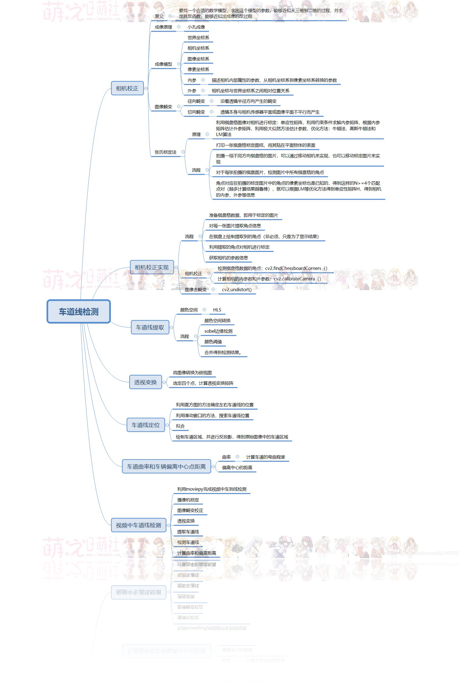

<aside> 🪁 第一步：图像灰度化 第二步：高斯平滑，消除部分噪声 第三步：采用Canny进行边缘检测 第四步：ROI边缘过滤 第五步：Hough变换直线检测，通过最小二乘拟合确定车道线方程

</aside>

[https://blog.csdn.net/stf1065716904/article/details/125716903](https://blog.csdn.net/stf1065716904/article/details/125716903)

[https://zhuanlan.zhihu.com/p/52623916?from_voters_page=true](https://zhuanlan.zhihu.com/p/52623916?from_voters_page=true)

[https://www.sohu.com/a/284617979_560056](https://www.sohu.com/a/284617979_560056)