::: tip
SLAM概述
:::

### 经典SLAM：**视觉里程计、后端优化、回环检测、建图**

### 1、三维刚体运动：主要内容就是坐标

理解左乘是基于自身坐标系，右乘是基于基坐标系

### 3、相机和图像：针孔相机模型、3D视觉

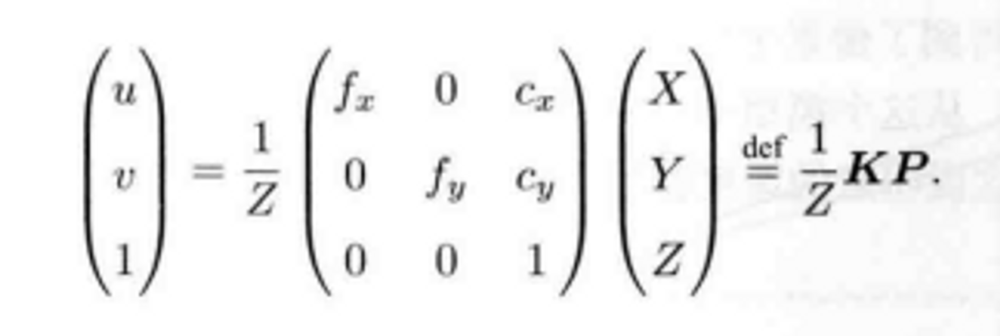

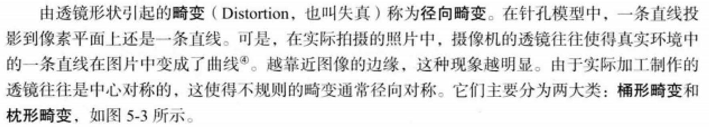

### 2、李群代数没有具体了解过

### 4、非线性优化

状态估计问题：

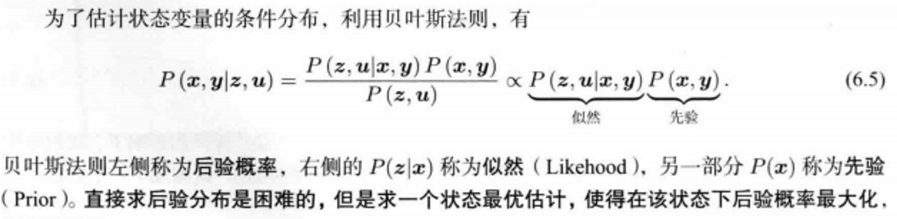

曲线拟合：使用Ceres、g2o曲线拟合

非线性最小二乘：一阶和二阶梯度算法、高斯牛顿法、列文伯格法

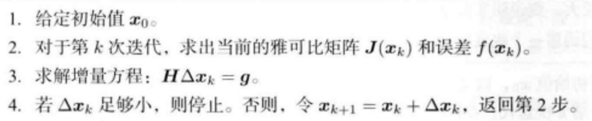

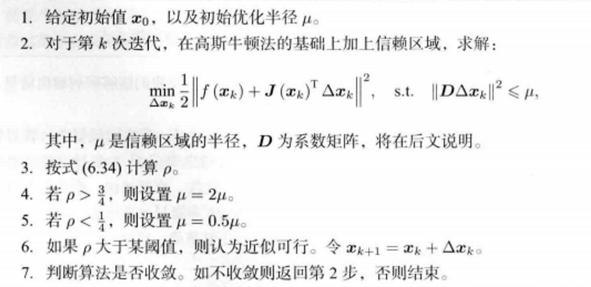

### 5、视觉里程计

### 6、多视图几何

记住几个基本概念：

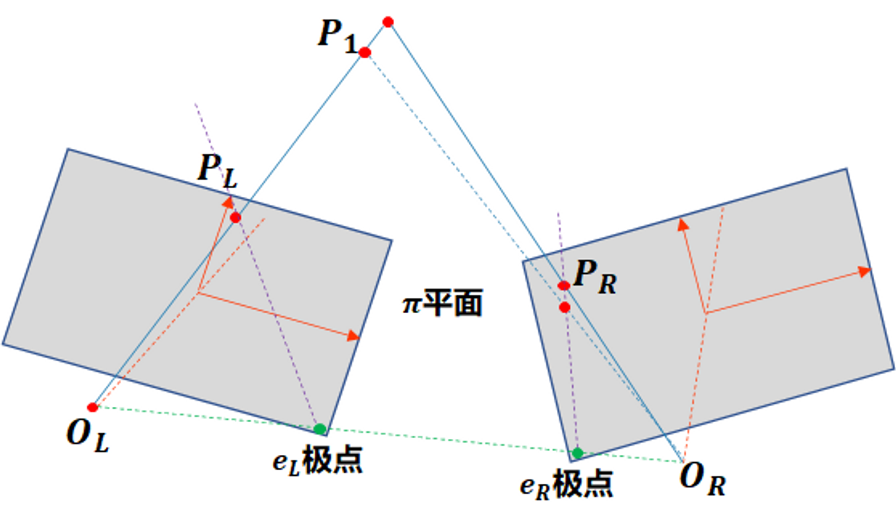

**空间一点P**在左右两个相机成像平面的对应点分别为$P_L和P_R$

**************极平面：空间点P与左右相机光心$O_L和O_R$构成的平面**

**极线：**极平面**与左右相平面构成的交线**叫做**左右极线**

极点：左右光心**与相平面的交点**叫做**左右极点**

极线约束：空间点P在左相机的投影点为$P_L$,将可能在右相机上存在无数个点与它对应，但是这些点一定都在所对应的**右极线上**

**对极约束的几何含义是$P、O_L、O_R$三点共面**

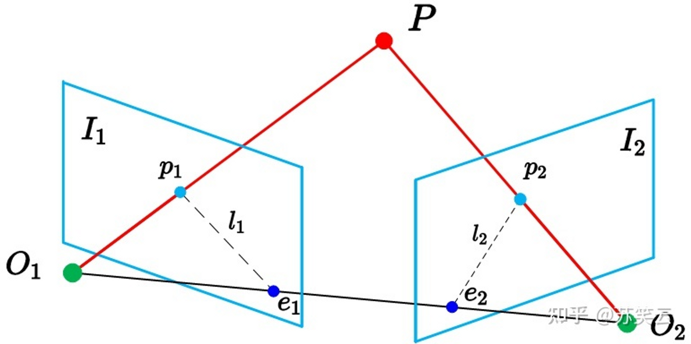

存在如下所示的**对极约束**，其中**x1,x2**是**归一化平面上p1,p2**对应的坐标点：

$x_2^TEx_1=p_2^TFp_1=0$
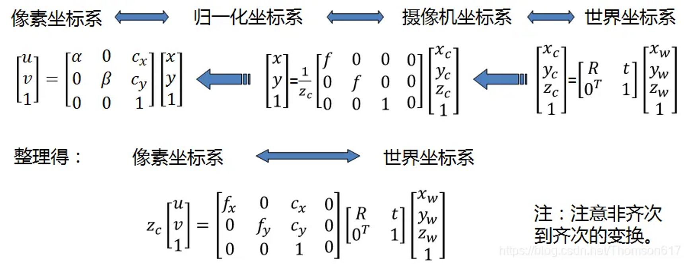

**本质矩阵：**$E$,是反映【**空间一点P的像点】**在【**不同视角摄像机】**下【**相机坐标系】中**的位置关系。

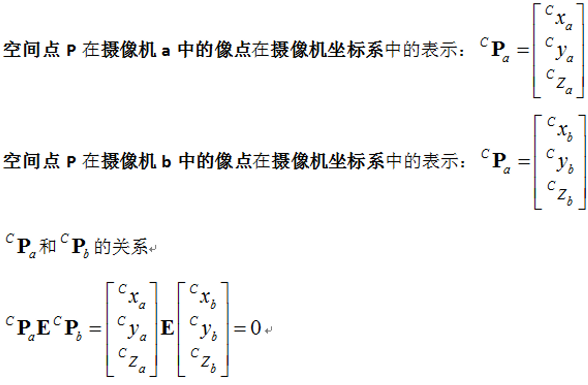

**基础矩阵：**$F$，反映【**空间一点P的像素点】**在【**不同视角摄像机】**下【**[图像坐标系](https://www.zhihu.com/search?q=%E5%9B%BE%E5%83%8F%E5%9D%90%E6%A0%87%E7%B3%BB&search_source=Entity&hybrid_search_source=Entity&hybrid_search_extra=%7B%22sourceType%22%3A%22answer%22%2C%22sourceId%22%3A105606049%7D)**】中的位置关系。

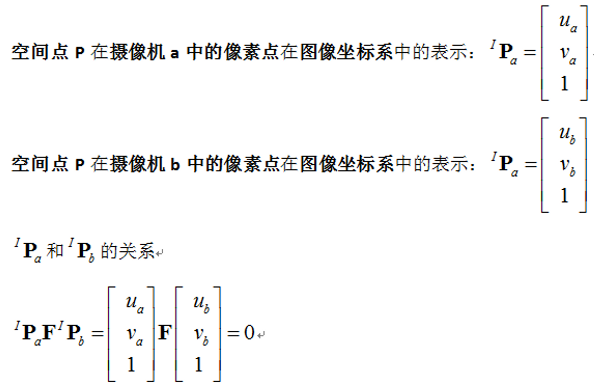

**单应性矩阵：**平面的单应性被定义为一个平面到另外一个平面的投影映射。单应性矩阵不只是描述同一平面的像素点之间的关系，而是同一个平面在任意坐标系之间都可以建立单应性变换关系，比如影像坐标系与影像坐标系之间，世界坐标系和影像坐标系之间，如下图所示。
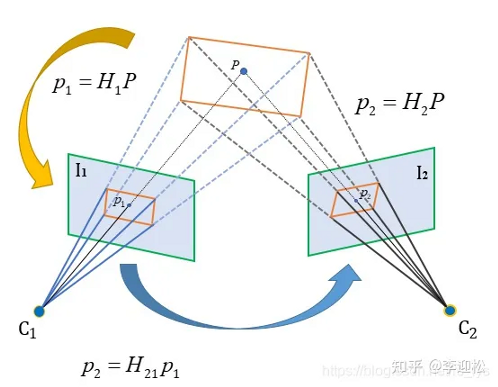