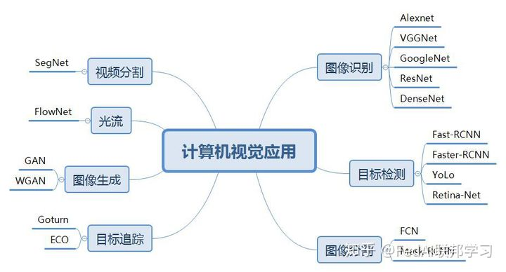

# 一、**常用的图像处理算法：**

**1，图像变换**：（空域与频域、几何变换、色度变换、尺度变换）

几何变换：图像平移、旋转、镜像、转置；

尺度变换：图像缩放、插值算法（最近邻插值、线性插值、双三次插值）；

空间域与频域间变换：由于图像阵列很大，直接在空间域中进行处理，涉及计算量很大。因此，有时候需要将空间域变换到频域进行处理。例如：傅立叶变换、沃尔什变换、离散余弦变换等间接处理技术，将空间域的处理转换为频域处理，不仅可减少计算量，而且可获得更有效的处理（如傅立叶变换可在频域中进行数字滤波处理）。

**2、图像增强：**

图像增强不考虑图像降质的原因，突出图像中所感兴趣的部分。如强化图像高频分量，可使图像中物体轮廓清晰，细节明显；如强化低频分量可减少图像中噪声影响。

灰度变换增强（线性灰度变换、分段线性灰度变换、非线性灰度变换）；

直方图增强（直方图统计、直方图均衡化）；

图像平滑/降噪（邻域平均法、加权平均法、中值滤波、非线性均值滤波、高斯滤波、双边滤波）；

图像（边缘）锐化：梯度锐化，Roberts算子、Laplace算子、Sobel算子等；

**3、纹理分析（取骨架、连通性）；**

**4、图像分割：**

图像分割是将图像中有意义的特征部分提取出来，其有意义的特征有图像中的边缘、区域等，这是进一步进行图像识别、分析和理解的基础。

（1）阈值分割（固定阈值分割、最优/OTSU阈值分割、自适应阈值分割）;

（2）基于边界分割（Canny边缘检测、轮廓提取、边界跟踪）；

（3）Hough变换（直线检测、圆检测）；

（4）基于区域分割（区域生长、区域归并与分裂、聚类分割）；

（5）色彩分割；

（6）分水岭分割；

**5、图像特征：**

（1）几何特征（位置与方向、周长、面积、长轴与短轴、距离(欧式距离、街区距离、棋盘距离)）；

（2）形状特征（几何形态分析（Blob分析）：矩形度、圆形度、不变矩、偏心率、多边形描述、曲线描述）；

（3）幅值特征（矩、投影）；

（4）直方图特征（统计特征）：均值、方差、能量、熵、L1范数、L2范数等；直方图特征方法计算简单、具有平移和旋转不变性、对颜色像素的精确空间分布不敏感等，在表面检测、缺陷识别有不少应用。

（5）颜色特征（颜色直方图、颜色矩）

（6）局部二值模式( LBP)特征：LBP对诸如光照变化等造成的图像灰度变化具有较强的鲁棒性，在表面缺陷检测、指纹识别、光学字符识别、人脸识别及车牌识别等领域有所应用。由于LBP 计算简单，也可以用于实时检测。

**6、图像/模板匹配：**

轮廓匹配、归一化积相关灰度匹配、不变矩匹配、最小均方误差匹配

**7、色彩分析：**

色度、色密度、光谱、颜色直方图、自动白平衡

**8、图像数据编码压缩和传输：**

图像编码压缩技术可减少描述图像的数据量（即比特数），以便节省图像传输、处理时间和减少所占用的存储器容量。压缩可以在不失真的前提下获得，也可以在允许的失真条件下进行。编码是压缩技术中最重要的方法，它在图像处理技术中是发展最早且比较成熟的技术。

**9、表面缺陷目标识别算法：**

传统方法：贝叶斯分类、K最近邻（KNN）、人工神经网络（ANN）、支持向量机（SVM）、K-means等；

**10、图像分类（识别）：**

图像分类（识别）属于模式识别的范畴，其主要内容是图像经过某些预处理（增强、复原、压缩）后，进行图像分割和特征提取，从而进行判决分类。

**11、图像复原：**

图像复原要求对图像降质的原因有一定的了解，一般讲应根据降质过程建立“降质模型”，再采用某种滤波方法，恢复或重建原来的图像。

# **二、现有的视觉检测软件/库**

**1、做工业视觉检测的公司有哪些？**

比较出名的有：大恒图像（亚洲Halcon最大代理商）、凌云光技术（VisionPro视觉平台：印刷、3C电子、显示屏、玻璃、线路板检测）、大族激光（振静系统：视觉激光焊接，定视觉位、缺陷检测）、康耐视、基恩士、深圳精锐视觉、深圳市视觉龙科技有限公司、广州超音速、深圳市创科自动化等等。

可二次开发的视觉系统：Labview、DVT、Halcon、OpenCV等。

**2、常用的视觉检测软件/库**

视觉开发软件工具 Halcon、VisionPro、LabView、OpenCV， 还有eVision、Mil、Sapera等。

# 三、图像预处理算法：

1.图像梯度算法Sobel、Scharr 2.角点检测算法Harris 3.边缘检测算法Canny 4.z直线检测算法Hough

# 四、图像特征处理算法：

1.SIFT（尺度不变特征变换）

2.SURF（加速稳健特征）

3.HOG（梯度直方图）

4.Histogram（直方图）

5.LBP（局部二值模式）

6.Brute-Force（蛮力特征匹配）

# 五、机器学习常用算法：

1.KNN（K近邻）

2.SVM（支持向量机）

3.K-means（K均值）

4.Haar级联分类器

5.RF（随机森林）

6.Decision Tree（决策树）

[7.LR](http://7.LR)（逻辑回归）

8.GMM（高斯混合模型）

9.SOM（自组织映射）

10.HMM（匹配矩阵）

11.CNN（卷积神经网络）

# **六、机器视觉开源代码**

[http://rogerioferis.com/VisualRecognitionAndSearch2014/Resources.html](http://rogerioferis.com/VisualRecognitionAndSearch2014/Resources.html)

**一、特征提取FeatureExtraction：**

**二、图像分割ImageSegmentation：**

**三、目标检测ObjectDetection：**

**四、显著性检测SaliencyDetection：**

**五、图像分类、聚类ImageClassification, Clustering：**

**六、抠图ImageMatting：**

**七、目标跟踪ObjectTracking：**

**八、Kinect：**

**九、3D相关：**

**十、机器学习算法：**

**十一、目标、行为识别Object,Action Recognition：**

**十三、一些实用工具：**

**十四、人手及指尖检测与识别：**

**十五、场景解释：**

**十六、光流Opticalflow：**

**十七、图像检索ImageRetrieval：**

**十八、马尔科夫随机场MarkovRandom Fields：**

**十九、运动检测Motiondetection：**

# 七**、计算机视觉应用**

[https://blog.csdn.net/guoqi1911/article/details/113118266](https://blog.csdn.net/guoqi1911/article/details/113118266)

# 八、****计算机视觉算法与应用汇总****

[https://blog.csdn.net/weixin_42010722/article/details/118979369](https://blog.csdn.net/weixin_42010722/article/details/118979369)

目标追踪：

[https://blog.csdn.net/yegeli/article/details/109861867?spm=1001.2014.3001.5506](https://blog.csdn.net/yegeli/article/details/109861867?spm=1001.2014.3001.5506)