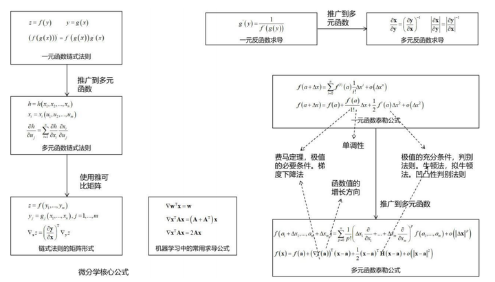
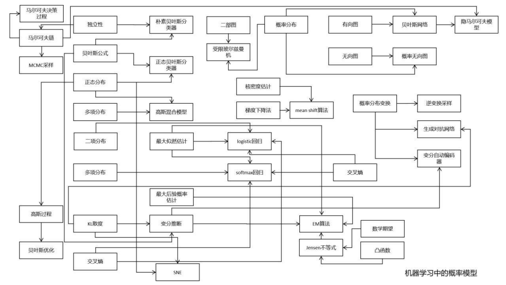
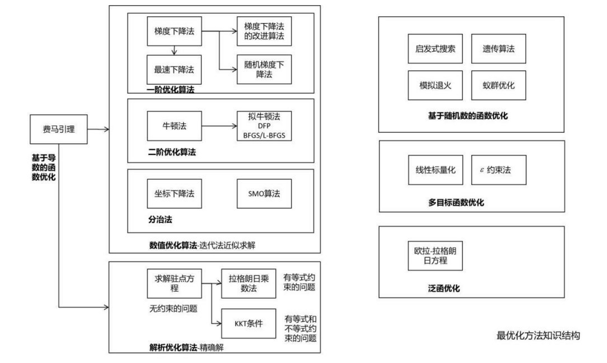
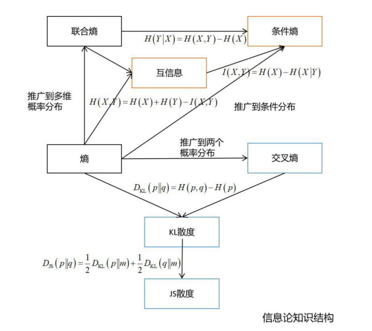
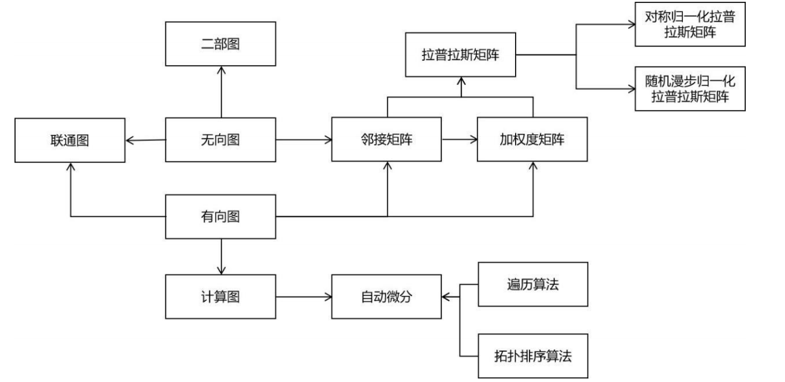

# 一、概述

在机器学习中所用到的主要有微积分、线性代数、概率论、最优化方法、信息论、随机过程、图论这几门数学课的知识。它们之间的关系如下图所示。

在这里，一元函数微积分，线性代数与矩阵论是最基础的知识，也是其他课程的先修课程。其中多元函数微积分是一元函数微积分向多元函数的推广，且使用了线性代数与矩阵论的知识。

最优化方法（连续优化问题，这里不考虑随机优化等特殊的算法）**以多元函数微积分为基础**，**梯度下降法**、**牛顿法**、**拟牛顿法等数值优化算法**的推导，以及**拉拉格朗日乘数法**等**解析优化算法**的推导与证明，均使用了**多元函数微积分**的知识。

**概率论**以微积分和线性代数为基础，导数、积分在这里被大量地使用。**信息论与随机过程都是概率论的延伸**，要学好它们，必须先掌握概率论。

图论中使用了**线性代数的知识，比如邻接矩阵**，普图理论中的拉普拉斯矩阵等。在机器学习中，它还与概率论结合，诞生了概率图模型这种模型。

| 算法 | 所用的数学知识 |
| --- | --- |
| 分类与回归 | 贝叶斯分类器: 随机变量，条件概率，贝叶斯公式，正态分布，最大似然估计 KNN算法: 距离函数 |
|决策树|熵，信息增益，Gini系数|
|KNN算法|距离函数|
| 线性判别分析 | 散布矩阵，逆矩阵，广义瑞利商，拉格朗日乘数法，特征值与特征向量，标准正交基，投影 |
| 人工神经网络 | 向量与矩阵运算，链式法则，交叉熵，欧氏距离，梯度下降法，有向图，自动微分 |
| 支持向量机 | 点到超平面的距离，凸优化，拉格朗日对偶，强对偶，Slater条件，KKT条件，Mercer条件 |
| logistic回归与softmax回归 | 条件概率，伯努利分布，多项分布，最大似然估计，凸优化，梯度下降法，牛顿法 |
| 随机森林 | 抽样，方差 |
| Boosting算法 | 数学期望，条件概率，泰勒公式，牛顿法 |
| 线性回归，岭回归，LASSO回归 | 均方误差，最小二乘法，向量范数，梯度下降法，凸优化 |
| 数据降维 | 主成分分析 |
| 核主成分分析 | Mercer条件 |
| 流形学习 | 线性组合，均方误差，无向图，拉普拉斯矩阵，归一化拉普拉斯矩阵，拉格朗日乘数法，特征值与特征向量，KL散度，t分布，测地距离 |
| 距离度量学习 | NCA |
| ITML | KL散度，带约束的优化问题 |
| LMNN | 线性变换，梯度下降法，高斯混合模型与EM算法，高斯过程回归 |
| 概率图模型 | HMM |
| CRF | 无向图，条件概率，最大似然估计，拟牛顿法 |
| 贝叶斯网络 | 有向图，条件概率，贝叶斯公式，最大似然估计 |
| 聚类 | 谱聚类 |
| Mean Shift算法 | 核密度估计，梯度下降法 |
| 深度生成模型 | GAN |
| VAE | 概率分布变换，KL散度，变分推断，梯度下降法,变分推断,MCMC采样 |
| 强化学习 | 马尔可夫决策过程 |
| DQN | 数学期望，梯度下降法 |
| 策略梯度 | 马尔可夫过程，数学期望，极限分布，梯度下降法，KL散度 |
| Actor-Critic算法 | 梯度下降法，KL散度 |

# 二、微分学

微积分由一元函数微积分、多元函数微积分两部分构成，它是整个高等数学的基石。通常情况下，机器学习需要得到一个函数（模型，或者说假设），既然是函数，那自然就离不开微积分了。微积分为我们研究函数的性质，包括单调性、凹凸性、以及极值提供了理论依据。同时它也是学习概率论、信息论、最优化方法等后续课程的基础。

在机器学习中，最应该被记住的微积分知识点是下面的两张图。第一张图是微分学：

微分学中最应该被记住的是链式法则和泰勒公式。后者是理解在机器学习中使用最多的梯度下降法、牛顿法、拟牛顿法等数值优化算法推导的基础，前者为计算各种目标函数的导数提供了依据。借助于雅克比矩阵，多元函数的链式法则有简介而优雅的表达，多元函数反函数求导公式可以与一元函数反函数求导公式达成形式上的统一。借助于梯度、Hessian矩阵以及向量内积、二次型，多元函数的泰勒公式与一元函数的泰勒公式可以达成形式上的统一。

第二张图是积分学：

积分学中最关键的是积分换元公式，借助于雅克比行列式，可以与一元函数定积分的换元公式达成形式上的统一。积分换元公式在后面的概率论（如概率分布变换，逆变换采样算法），信息论（如多维正态分布的联合熵）等课程中有广泛的应用，务必要掌握。

# 三、线性代数

接下来看线性代数。线性代数对于机器学习是至关重要的。机器学习算法的输入、输出、中间结果通常为向量、矩阵。使用线性代数可以简化问题的表达，用一个矩阵乘法，比写成多重求和要简洁明了得多。线性代数是学习后续数学课程的基础。它可以与微积分结合，研究多元函数的性质。线性代数在概率论中也被使用，比如随机向量，协方差矩阵。线性代数在图论中亦有应用-如图的邻接矩阵，拉普拉斯矩阵。在随机过程中同样有应用-如状态转移矩阵。下面的图列出了线性代数的核心知识结构：

向量与矩阵是线性代数中的基本计算对象，这门课基本上围绕着它们而展开。特征值与特征向量是机器学习中使用频率仅次于向量和矩阵的知识点，它连接其了众多的知识点，决定了矩阵的若干重要性质。

# 四、概率论

## **概率论**

概率论对于机器学习来说也是至关重要的，它是一种重要的工具。如果将机器学习算法的输入、输出看作随机变量/向量，则可以用概率论的观点对问题进行建模。使用概率论的一个好处是可以对不确定性进行建模，这对于某些问题是非常有必要的。另外，它还可以挖掘变量之间的概率依赖关系，实现因果推理。概率论为某些随机算法-如蒙特卡洛算法、遗传算法，以及随机数生成算法-包括基本随机数生成413231637(、以及采样算法提供了理论依据和指导。最后，概率论也是信息论，随机过程的先导课程。下面这张图清晰地列出了概率论的核心知识：

下面这张图是对机器学习中概率模型的总结：

从这张图可以清晰的看出频繁使用的概率论知识点，最重要的莫过于条件概率，贝叶斯公式，正态分布，最大似然估计。

# 五、****最优化方法****

最优化方法在机器学习中处于中心地位。几乎所有机器学习算法最后都归结于求解最优化问题，从而确定模型参数，或直接获得预测结果。前者的典型代表是有监督学习，通过最小化损失函数或优化其他类型的目标函数确定模型的参数；后者的典型代表是数据降维算法，通过优化某种目标函数确定降维后的结果，如主成分分析。下面这张图列出了最优化方法的核心知识：

# 六、****信息论****

信息论是概率论的延伸，在机器学习与深度学习中通常用于构造目标函数，以及对算法进行理论分析与证明。在机器学习尤其是深度学习中，信息论的知识随处可见，比如：

1.  决策树的训练过程中需要使用熵作为指标
    
2.  在深度学习中经常会使用交叉熵、KL散度、JS散度、互信息等概念
    
3.  变分推断的推导需要以KL散度为基础
    
4.  距离度量学习、流形降维等算法也需要信息论的知识
    

总体来说，在机器学习中用得最多的是熵，交叉熵，KL散度，JS散度，互信息，条件熵等。下面这张图列出了信息论的核心知识：

熵是最基本的概念，推广到多个概率分布，可以得到交叉熵，KL散度，以及JS散度。推广到多个随机变量，可以得到互信息，条件熵。

# 七、随机过程

随机过程同样是概率论的延伸。在机器学习中，随机过程被用于概率图模型、强化学习、以及贝叶斯优化等方法。不理解马尔可夫过程，你将对MCMC采样算法一筹莫展。下面这张图列出了机器学习中随机过程的核心知识：

在机器学习中所用的主要是马尔可夫过程和高斯过程。隐马尔可夫过程，马尔可夫决策过程都是它的延伸。平稳分布、细致平衡条件也是理解MCMC采样的核心基础。

# 八、****图论****

在机器学习中，概率图模型是典型的图结构。流形降维算法与谱聚类算法均使用了谱图理论。计算图是图的典型代表，图神经网络作为一种新的深度学习模型，与图论也有密切的关系。下面这张图列出了图论的整体知识结构：

这里相等难以理解的是谱图理论。谱图理论的核心是拉普拉斯矩阵，归一化拉普拉斯矩阵，理解它们需要扎实的线性代数基础。