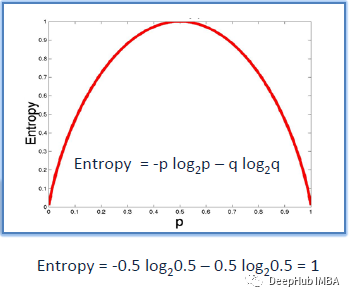
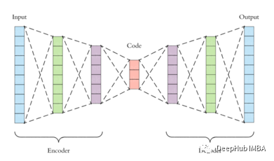

# 机器学习100个问题

## **基础知识**

**1、什么是数据科学?列出监督学习和非监督学习的区别。**

数据科学是各种工具、算法和机器学习方法的混合，其目标是从原始数据中发现隐藏的模式。这与统计学家多年来一直在做的事情相似但是有什么不同?下图解释了数据分析和数据科学的区别：


监督学习和无监督学习的区别如下:

有监督学习：输入数据是有标记的，主要用于预测。例如分类和回归等

无监督学习：输入数据是没有标记的，多用于分析。密度估计和降维等

**2、什么是选择偏差?**

选择性偏差溯源英文为Selection Bias，指的是在研究过程中因样本选择的非随机性而导致得到的结论存在偏差,也称选择性偏差为选择性效应（Selection Effect）。它是由于采集样本的方法造成的统计分析的失真。如果没有考虑到选择偏差，那么研究的一些结论可能不准确。

选择性偏差是指这样一种认知倾向：人们喜欢把事物分为典型的几个类别，然后在对事件进行概率估计时，过分强调这种典型类别的重要性，而不顾有关其他潜在可能性的证据。选择性偏差的后果势必使人们倾向于在实际上是随机的数据序列中“洞察”到某种模式，从而造成系统性的预测偏差。

**3、什么是偏差-方差权衡?**

偏差:偏差是由于机器学习算法过于简化而在模型中引入的错误。它会导致不适应。当你在那个时候训练你的模型时，模型会简化假设，使目标函数更容易理解。

低偏差机器学习算法有：决策树，k-NN和SVM，高偏差机器学习算法有：线性回归，逻辑回归

方差:方差是由于复杂的机器学习算法在模型中引入的误差，模型会从训练数据集学习噪声，在测试数据集上表现很差。它会导致高灵敏度和过拟合。

通常，当增加模型的复杂性时，会看到由于模型中较低的偏差而导致的误差的减少。然而，这种情况只会在特定的点发生。当模型变得更复杂时，最终会过度拟合型，因此你的模型将开始变为i高方差。


任何监督机器学习算法的目标都是具有低偏差和低方差，才能达到良好的预测性能。在机器学习中，偏见和方差之间的关系不可避免。增加偏差会减少方差。增加方差会减少偏差。

**4、任意语言，编写一个程序输出从1到50的数字**

打印1到50之间的数字的python代码如下-

```
for i in range(1,51):print(i)
```

**5、什么是混淆矩阵?**

混淆矩阵是一个2X2表，包含由二分类器提供的4个输出。错误率、准确率、精确度、查全（召回）率等指标都由它来衡量。混淆矩阵


用于性能评估的数据集称为测试数据集。它应该包含正确的标签和预测的标签。


如果分类器的性能是完美的，预测的标签将完全相同。


但实际上模型预测的标签通常与现实场景中部分观察到的标签相匹配。


分类器预测测试数据集的所有数据实例为正或负。这产生了四种结果

真阳性(TP) -正确的阳性预测

假阳性(FP) -不正确的阳性预测

真负(TN) -正确的负预测

假阴性(FN) -错误的阴性预测


由混淆矩阵推导出的基本度量有以下概念

错误率= (FP+FN)/(P+N)

精度= (TP + TN) / (P + N)

敏感度（**Sensitivity**真阳性率)= TP/P

特异度(**Specificity**真阴性率)= TN/N

精度(阳性预测值)= TP/(TP+FP)

F-Score(精度和查全率的调和平均值)= (1+b)(PREC.REC)/(b²PREC+REC)其中b通常为0.5,1,2。

**6、怎么理解真阳性率和假阳性率?**

真阳性率(TPR)是真阳性与真阳性和假阴性的比率。它是实际阳性结果被测试为阳性的概率。

TPR = TP / （TP + FN）

假阳性率(FPR)是假阳性与所有阳性(真阳性和假阳性)的比率。它是虚惊一场的概率，也就是说，当它实际上是负的时候，会给出一个正的结果。

FPR= FP / （TP + FP）

**7、简述马尔可夫链**

马尔可夫链是一种随机过程。在马尔可夫链中，任何状态的未来概率只取决于当前状态。


上图表示了一个马尔可夫链模型，其中每个步骤都有一个输出，只依赖于当前状态。

例如文字推荐。当我们输入一个段落时，这个模型会提示下一个单词，它只依赖于前一个单词，而不依赖于它之前的任何单词。马尔科夫链模型之前在一个类似的段落上进行训练，其中给定单词的下一个单词存储在训练数据中的所有单词上。根据这个训练数据输出，建议接下来的单词。

**8、ROC曲线是什么?**

ROC曲线是假阳性率(x轴)和真阳性率(y轴)之间的曲线。真阳性率是指真阳性率与阳性样本总数之比。假阳性率是假阳性与阴性样本总数之比。在几个阈值上绘制FPR和TPR，构建ROC曲线。ROC曲线下的面积范围为0 ~ 1。完全随机模型的ROC为0.5，用直线表示。ROC曲线偏离这条直线越多，模型越好。ROC曲线用于二元分类。下图展示了ROC曲线的一个例子。


**9、什么是降维及其好处?**

减少给定数据集的特征数量被称为降维。有许多技术用于降低维度，如-

- 特征选择
- 矩阵分解
- Manifold 学习
- Autoencoder方法
- 线性判别分析(LDA)
- 主成分分析(PCA)

降维的主要原因之一是“降维魔咒”。当特征的数量增加时，模型变得更加复杂。但如果数据点较少，模型将开始学习过拟合数据。模型不会泛化。这就是众所周知的“维度诅咒”。

降低维度的其他好处包括-

- 减少了时间和存储空间。
- 用2D或3D可视化和可视化表示数据变得更容易了。
- 空间复杂度降低。

**10、如何在线性回归模型中找到RMSE和MSE ?**

采用均方根误差(RMSE)来检验线性回归模型的性能。它评估在最佳拟合线上分布了多少数据。MSE的公式是


f_i是预测值

Y_i是输出变量的实际值。

N是数据点的个数

均方误差(MSE)表示直线与实际数据的接近程度。取直线与数据点的差值并平方。对于一个好的模型，MSE值应该很低。这意味着实际输出值和预测输出值之间的误差应该很低。

**11、如何处理不平衡的二元分类?**

在进行二分类时，如果数据集不平衡，仅使用R2评分无法正确预测模型的精度。例如，如果属于其中一个类的数据在数量上比属于另一个类的数据少得多，那么传统的精度将在较小的类中占很小的百分比。如果只有5%的示例属于较小的类，而模型将属于其他类的所有输出分类，精度仍然在95%左右。但这是错误的。为了解决这个问题，我们可以这样做

- 使用其他方法来计算模型性能，如精度/召回率，F1评分等。
- 使用以下技术对数据重新采样(减少较大类的样本大小)、过采样(使用重复、SMOTE和其他此类技术增加较小类的样本大小)。
- 使用K-fold交叉验证
- 使用集成学习，使每棵决策树考虑小类的整个样本，而只考虑大类的一个子集。

**12、箱线图和直方图的区别是什么**

直方图和箱线图都用于直观地表示某一特征值的频率。下图显示了一个直方图。


下图为箱线图现实的相同数据


直方图用于了解数据的潜在概率分布。箱线图更多地用于比较多个数据集。箱线图比直方图有更少的细节和占用更少的空间。

**13、NLP都有什么主要的工作?**

NLP代表自然语言处理。它是对计算机编程来学习大量文本数据的研究。NLP的例子包括标记化、停止词去除、词根提取、情感分析等。

**14、概率论的基本原理**

在所有可能的结果中，某一事件发生的可能性被称为其概率。事件发生的概率总是在(包括)0和1之间。


加法规则：P(A，B)= P(A) + P(B) - P(A and B)

条件概率：它是事件B发生的概率，假设事件A已经发生。

P(A and B)= P(A)P (B|A)

中心极限定理：当我们从一个大总体中抽取随机样本，然后取这些样本的均值，它们形成一个正态分布。

**15、描述不同的正则化方法，如L1和L2正则化**

有3种重要的正则化方法如下：

L2正则化-(Ridge回归)-在L2正则化中，我们将所有权重的平方和，乘以一个值lambda，加到损失函数。Ridge回归公式为-


可以看到，如果某一特定数据点和特征的权值乘以数据值变得非常大，那么原始的损失就会变得很小。但是增加值乘以权重平方和也会变大。同样如果原来的损失价值变得很大，那么增加的价值就会变小。因此它将控制最终值不变得太大或太小。

L1正则化-(Lasso回归)-在L1正则化中，我们将所有权重的绝对值加和，乘以一个值lambda，到损失函数。Lasso回归公式为-


损失函数和优化算法使参数趋近于零而不是实际为零，而lasso则消除了不太重要的特征，并将各自的权重值设置为零。

Dropout用于神经网络的正则化。全连接层更容易过拟合。Dropout丢掉了神经网络中一些概率为1-p的神经元。Dropout减少了过拟合，提高了训练速度，使模型更健壮。

**16、应该如何维护已部署的模型?**

在一个模型被部署之后，它输入的数据可能会随时间而改变。例如，在预测房价的模型中，房价可能会随着时间的推移而上涨，也可能会因为其他一些因素而波动。所以模型在新数据上的准确性可以被记录下来。一些确保准确性的常用方法包括-

- 应经常通过输入阴性试验数据对模型进行检查。如果模型给出的精度较低且测试数据为负，则说明需要更新。
- 建立自动编码器，利用异常检测技术，AE模型计算重构误差值。如果重构错误值很高，这意味着新数据没有遵循模型学习到的旧模式。
- 如果模型对新数据显示出较好的预测精度，则说明新数据遵循模型对旧数据学习到的模式或泛化。因此，可以根据新数据对模型进行重新训练。如果新数据的准确性不是很好，那么可以使用对数据特征和旧数据进行特征工程的方法对新数据重新训练模型。
- 如果准确性不好，模型可能需要从头开始训练。

**17、写出公式，计算准确率和召回率。**

Precision = True Positives / (True Positives + False Positives)

Recall = True Positives / (True Positives + False Negatives)

**18、如何在NumPy中测量两个数组之间的欧氏距离?**

2个阵列A[1,2,3，]和b[8,9,10]之间的欧氏距离可以通过分别取每个点的欧氏距离来计算。使用numpy. linalgy .norm()-


**19、误差和剩余误差的区别是什么?**

误差是指预测值与实际值之间的差值。数据科学中最常用的误差计算方法是平均绝对误差(MAE)、均方误差(MSE)和均方根误差(RMSE)。而剩余误差是一组观测值与其算术平均值之间的差。误差通常是不可观察的，而剩余误差可以在图上显示出来。误差表示观测数据与实际总体的差异。而剩余误差则表示观察数据与样本总体数据的差异。

**20、归一化和标准化的区别?**

归一化，也称为最小-最大缩放，是一种将所有数据值转换为介于0和1之间的技术。

归一化公式是-


X_max是该特性的最大值

X_min是该特征的最小值

标准化是指将我们的数据进行转换，使其具有均值为0，标准差为1的正态分布。

标准化的公式是-


因此，虽然标准化只将数据缩放到0到1的范围，但标准化确保数据遵循标准的正态分布。

**21、你对正态分布有什么理解?**

数据通常以不同的方式分布，有向左或向右的偏差，也可能全部混杂在一起。

然而，也有可能数据分布在中心值周围，没有任何向左或向右的偏差，并以钟形曲线的形式达到正态分布。


正态分布的性质如下;

单峰，左右镜像对称，钟形-最大高度(模式)在平均值，均值、众数和中位数都位于中心

**22、什么是统计学上的相关性和协方差?**

协方差和相关是两个数学概念;这两种方法在统计学中被广泛使用。相关和协方差都建立了关系，也衡量两个随机变量之间的依赖性。虽然从数学的角度来说，这两者的工作是相似的，但他们彼此不同。


相关性:相关被认为或描述为测量和估计两个变量之间的定量关系的最佳技术。相关性衡量的是两个变量的相关性有多强。

协方差:在协方差中，两个项目一起变化，它是一个衡量两个随机变量在周期变化的程度。这是一个统计术语;它解释了一对随机变量之间的系统关系，其中一个变量的变化与另一个变量的相应变化互为倒数。

**23、点估计和置信区间的区别是什么?**

点估计给我们一个特定的值作为总体参数的估计。采用矩量法和极大似然估计法导出了总体参数的点估计。

置信区间为我们提供了一个可能包含总体参数的值范围。通常首选置信区间，因为它告诉我们这个区间包含总体参数的可能性有多大。这种可能性或概率称为置信水平或置信系数，用1 - alpha表示，其中alpha是显著性水平。

**24、A/B测试的目标是什么?**

这是对一个有两个变量a和B的随机实验的假设检验。

A/B测试的目标是识别变化，以最大限度地找到改变实验动作后对结果产生的影响。

**25、P值是什么?**

当在统计学中进行假设检验时，p值可以帮助您确定结果的强度。p值是0到1之间的一个数字。它将根据值表示结果的强度。这个正在试验的主张被称为零假设。

较低的p值(≤0.05)意味着我们可以拒绝原假设。高p值(≥0.05)这意味着可以接受零假设，p值为0.05表明假设可以双向。

**26，概率计算：在任何15分钟的间隔内，有20%的概率你会看到至少一颗流星。你在一小时内看到至少一颗流星的概率是多少?**

十五分钟内看不到流星的概率是

= 1 - P(看到一颗流星)= 1-0.2 = 0.8

在一小时内看不到任何流星的概率

= (0.8) ^ 4 = 0.4096

在一小时内看到至少一颗流星的概率

= 1 - P(看不到任何流星)= 1-0.4096 = 0.5904

**27、如何用一个骰子产生1-7之间的随机数?**

任何骰子有从1到6有6个面。一次掷骰子不可能得到7个相同的结果。如果我们掷骰子两次，考虑两次的事件，我们现在有36种不同的结果。为了得到7个相等的结果我们要把36化简成能被7整除的数。因此可以只考虑35种结果，并排除其中的一种。

一个简单的场景便是排除组合(6,6)，即如果6出现两次便再次掷骰子。从(1,1)到(6,5)的所有剩余组合可以分为7个部分，每个部分5。这样七组结果都是等可能的。

**28、一对夫妇告诉你他们有两个孩子，其中至少有一个是女孩。他们有两个女孩的概率是多少?**

在两个孩子的情况下，有4种等可能的事件

BB、BG、GB、GG;

其中B =男孩，G =女孩，第一个字母表示第一个孩子。

从问题中，我们可以排除第一种BB。因此，从BG, GB, BB剩下的3种可能性中，我们必须找出两个女孩的情况的概率。

因此，P(有两个女孩给一个女孩)= 1 / 3

**29、一个罐子有1000枚硬币，其中999枚是正常的，1枚的两面都是正面。随机选择一枚硬币，投掷10次。假设你看到10个正面，那枚硬币下一次扔出来也是正面的概率是多少?**

选择硬币有两种方法。一种是选出一枚正常的硬币，另一种是选出两个正面的硬币。

选择正常硬币的概率= 999/1000 = 0.999

选择非正常硬币的概率= 1/1000 = 0.001

连续选择10个正面=选择正常硬币*得到10个正常+选择一枚非正常硬币

P (A) = 0.999 *(1/2)⁵= 0.999 * (1/1024)= 0.000976

P (b) = 0.001 * 1 = 0.001

P(a / a + b) = 0.000976 / (0.000976 + 0.001) = 0.4939

P(b / a + b) = 0.001 / 0.001976 = 0.5061

选择另一个正面的概率= P(A/A+B) * 0.5 + P(B/A+B) * 1 = 0.4939 * 0.5 + 0.5061 = 0.7531

**30、你对敏感度（Sensitivity）的统计能力有什么理解?你如何计算它?**

敏感度通常被用来验证分类器的准确性(Logistic, SVM, Random Forest等)。

敏感度是“预测的真实事件/总事件”。真实事件是指真实的事件模型也预测了它们是真实的。

计算非常简单。敏感度（**Sensitivity**真阳性率)= TP/P

**31、为什么要重采样?**

- 通过使用可访问数据的子集或从一组数据点中随机抽取替换数据来估计样本统计数据的准确性
- 执行显著性检验时，在数据点上替换标签
- 通过使用随机子集(bootstrapping, cross-validation)来验证模型

**32、过拟合和欠拟合有什么区别?**

在统计学和机器学习中，最常见的任务之一就是将模型拟合到一组训练数据中，从而能够对一般的未经训练的数据做出可靠的预测。


在过拟合中，统计模型描述的是随机误差或噪声，而不是潜在的关系。过拟合发生在一个模型过于复杂的时候，比如相对于观测数据有太多的参数。过拟合的模型预测性能较差，因为它对训练数据的微小波动反应过度。

当统计模型或机器学习算法无法捕捉数据的潜在趋势时，就会发生欠拟合。例如，当用线性模型拟合非线性数据时，就会出现欠拟合。这种模型的预测性能也很差。

**33、避免对抗过拟合和过拟合?**

为了避免过拟合和欠拟合，可以重采样数据来估计模型的准确性(k倍交叉验证)，并通过验证数据集来评估模型。

**34、什么是正则化?为什么它有用?**

正则化可以防止过拟合。一般情况下是通过在现有的权重向量上加上一个常数倍数来实现的。这个常数通常是L1(Lasso)或L2(ridge)。然后模型预测应该最小化在正则化训练集上计算的损失函数。

**35、什么是大数定律?**

这个定理，描述了进行大量相同实验的结果。这个定理构成了频率式思维的基础：样本均值，样本方差和样本标准差收敛于他们试图估计的值。

**36、什么是混淆的变量？**

在统计数据中，混淆因素是一个影响因变量和独立变量的变量。混淆变量(Confounding Variable)是指与自变量和因变量均相关的变量，该变量使自变量和因变量间产生虚假的关系(Meinert, 1986)。

例如，如果您正在研究缺乏运动会导致体重增加，

缺乏运动=自变量

体重增加=分支变量。

这里的混淆变量将是影响这两个变量的任何变量例如受试者的年龄。

**37、抽样过程中可能发生的偏差都有哪些类型？**

- Selection bias
- Under coverage bias
- Survivorship bias

**38、什么是生存偏差（Survivorship bias）?**

这是一个逻辑上的错误，即专注于支持幸存某些过程的方面，而忽略那些因为它们不突出而不起作用的方面。这可能会以各种不同的方式得出错误的结论。

**39、什么是选择偏差（Selection bias）?**

当获得的样本不能代表要分析的总体时，就会出现选择偏差。

**40、解释ROC曲线是如何工作的?**

ROC曲线是各种阈值下真实阳性率和假阳性率对比的图形表示。它经常被用作敏感性(真阳性率)和假阳性率之间权衡的标准。


**41、什么是TF/IDF?**

TF-IDF是 term frequency-inverse document frequency,的缩写，是反映一个词对集合或语料库中的文档的重要性的统计数字。在信息检索和文本挖掘中，它经常被用作加权因子。

TF-IDF值与单词在文档中出现的次数成比例增加，但会被单词在语料库中的出现频率所抵消，这有助于调整某些单词在一般情况下出现的频率更高的事实。

**42、为什么我们一般使用Softmax非线性函数作为网络最后一个操作?**

这是因为它采用了实数的向量并返回概率分布。它的定义如下。令X为实数的向量（正，负，无论如何，没有约束）。

则Softmax(x)的第i个分量为-


输出是概率分布：每个元素都是非负分布，所有分量的总和为1。

## **数据分析**

**43、数据清理如何在分析中发挥重要作用?**

数据清理可以帮助分析，因为:

- 清理来自多个源的数据有助于将其转换为数据分析师或数据科学家可以使用的格式。
- 在机器学习中，数据清洗有助于提高模型的准确性。
- 这是一个繁琐的过程，因为随着数据源数量的增加，由于数据源的数量和这些数据源生成的数据量，清理数据所需的时间呈指数增长。
- 清理数据可能要花费多达80%的时间，这使得它成为分析任务的关键部分。

**44、单变量、双变量和多变量分析。**

单变量分析是一种描述性统计分析技术，可以根据在给定的时间点所涉及的变量的数量进行区分。例如，基于地域的销售饼图只涉及一个变量，分析可以称为单变量分析。

双变量分析试图在散点图中理解两个变量在同一时间的差异。例如，分析销售和支出的数量可以被认为是双变量分析的一个例子。

多变量分析涉及两个以上变量的研究，以了解变量对反应的影响。

**45、解释星型模型**

它是具有中心表的传统数据库模式。附属表将ID映射到物理名称或描述，可以使用ID字段连接到中心事实表;这些表被称为查找表，主要用于实时应用程序，因为它们可以节省大量内存。有时星型模式涉及多个汇总层以更快地获取相应的信息。

**46、什么是整群抽样（Cluster sampling）?**

整群抽样是指整群地抽选样本单位，对被抽选的各群进行全面调查的一种抽样组织方式。例如，检验某种零件的质量时，不是逐个抽取零件，而是随机抽若干盒 (每盒装有若干个零件)，对所抽各盒零件进行全面检验。如果全及总体划分为单位数目相等的R个群，用不重复抽样方法，从R群中抽取r群进行调查。

**47、什么是系统抽样（Systematic Sampling）?**

先将总体的全部单元按照一定顺序排列，采用简单随机抽样抽取第一个样本单元(或称为随机起点)，再顺序抽取其余的样本单元，这类抽样方法被称为等距抽样(Systematic Sampling)。等距抽样又称为机械抽样、系统抽样。等距抽样往往不能给出估计量的估计方差。

**48、什么是特征向量（Eigenvectors）和特征值（Eigenvalues）?**

特征向量用于理解线性变换。在数据分析中，通常计算相关或协方差矩阵的特征向量。特征向量是特定线性变换通过翻转、压缩或拉伸作用的方向。

特征值可以被认为是在特征向量方向上的变换强度或压缩发生的因子。

**49、你能举出一些假阳性比假阴性重要的例子吗?**

假阳性是指错误地将非事件分类为事件，也就是第一类错误。假阴性是指错误地将事件归类为非事件的情况，也就是第二类错误。

在医疗领域，例如癌症检查他的癌症检测呈阳性，但他实际上没有癌症。这是一个假阳性的案例。在这个病人没有癌症的情况下对他进行化疗是非常危险的。在没有癌细胞的情况下，化疗会对他正常健康的细胞造成一定的损害，可能导致严重的疾病，甚至癌症。

**50、你能举出一些假阴性比假阳性重要的例子吗?**

假设有一个机场安检如果一个真正有威胁的客户被机场模型标记为无威胁，陪审团或法官决定释放犯罪的罪犯都是这种情况

**51、你能举出一些假阳性和假阴性同样重要的例子吗?**

在银行业，贷款是赚钱的主要来源，如果你的还款率不好，银行向你贷款面临巨大的损失风险。银行不想失去好客户，也不想获得差客户。在这种情况下假阳性和假阴性都变得非常重要。

**52、您能解释一下验证集和测试集之间的区别吗?**

验证集可以被认为是训练集的一部分，因为它用于参数选择和避免模型的过拟合。测试集用于测试或评估训练好的机器学习模型的性能。

简单地说，区别可以概括为;训练集是拟合参数，验证集是测试训练集的效果;测试集是评估模型的性能

**53、解释交叉验证**

交叉验证是一种模型验证技术，用于评估统计分析结果如何推广到独立数据集。主要用于预测目标和估计模型在实践中实现的准确性的背景。

交叉验证的目标是定义一个数据集来在训练阶段测试模型(即验证数据集)，以限制过拟合等问题，并深入了解模型将如何推广到一个独立的数据集。

## **机器学习**

**54、什么是机器学习?**

机器学习是一门多学科交叉专业，涵盖概率论知识，统计学知识，近似理论知识和复杂算法知识，使用计算机作为工具并致力于真实实时的模拟人类学习方式，并将现有内容进行知识结构划分来有效提高学习效率。

机器学习有下面几种定义：

（1）机器学习是一门人工智能的科学，该领域的主要研究对象是人工智能，特别是如何在经验学习中改善具体算法的性能。

（2）机器学习是对能通过经验自动改进的计算机算法的研究。

（3）机器学习是用数据或以往的经验，以此优化计算机程序的性能标准。

**55、什么是无监督学习?**

无监督学习是一种机器学习算法，用于从由输入数据组成的数据集中推断，并且学习时不需要对数据进行标记。

主要包括：聚类，降维，异常检测等

**56、有哪些不同的分类算法?**

下图列出了最重要的分类算法。


**57、朴素贝叶斯中的“朴素”是什么?**

朴素贝叶斯算法是基于贝叶斯定理的。贝叶斯定理描述了一个事件发生的概率，基于可能与该事件相关的条件的先验知识。

这个算法很“幼稚”，因为它所做的假设可能是正确的，也可能不是。

**58、如何建立随机森林模型?**

随机森林模型结合了许多决策树模型。所选择的决策树具有高偏差和低方差。每个决策树都取样本的子集，并进行预测。每棵决策树的结果都被记录下来，并以大多数作为答案，在分类问题中是众数，在回归问题中是均值和中位数。


**59、详细解释SVM算法**

SVM是支持向量机的缩写，它是一种监督机器学习算法，可以用于回归和分类。如果你的训练数据集中有n个特征，SVM尝试在n维空间中绘制它，每个特征的值是特定坐标的值。SVM基于所提供的核函数，利用超平面分离出不同的类。


**60、支持向量机中的支持向量是什么?**


在图中，我们看到细线标记了从分类器到最近的数据点(称为支持向量)的距离(黑色的数据点)。两条细线之间的距离叫做边距。

**61、支持向量机的核函数有哪些?**

支持向量机中一般使用四种核函数。

线性核、多项式的核、径向基核、Sigmoid 核

**62、详细解释决策树算法**

决策树是一种监督机器学习算法，主要用于回归和分类。它将数据集分解为越来越小的子集，同时逐步开发相关的决策树。最终的结果是一个具有决策节点和叶子节点的树。决策树可以同时处理分类数据和数值数据。


**63、决策树算法中的熵和信息增益是什么?**

构建决策树的核心算法有·ID3、C45等。ID3使用熵和信息增益来构造决策树。

熵：决策树是从根节点自上而下构建的，涉及到将数据划分为同构子集。ID3使用熵来检验样本的同质性。如果样本是完全均匀的，那么熵就是0如果样本是等分的，那么熵就是1。



信息增益是基于数据集在属性上分割后熵的减小。构建决策树是关于寻找返回最高信息收益的属性。


**64、什么是决策树中的剪枝?**

剪枝是机器学习和搜索算法中的一种技术，它通过移除决策树中对实例分类作用不大的部分来减少决策树的大小。当我们删除一个决策节点的子节点时，这个过程被称为剪枝或反向分裂过程。

**65、什么是逻辑回归?举一个你最近使用逻辑回归的例子。**

逻辑回归通常被称为logit模型，是一种通过预测变量的线性组合来预测二元分类的技术。

垃圾邮件检测、医疗的病症判断、金融的贷款评估等都是二元分类。

**66、什么是线性回归?**

线性回归是利用数理统计中回归分析，来确定两种或两种以上变量间相互依赖的定量关系的一种统计分析方法，运用十分广泛。其表达形式为y = w'x+e，e为误差服从均值为0的正态分布。

x被称为自变量、y被称为因变量


**67、线性模型的缺点是什么?**

- 误差线性的假设
- 它不能用于计数结果或二元结果
- 它不能解决过拟合的问题

**68、回归和分类的ML技术有什么不同?**

回归和分类机器学习技术都属于监督机器学习算法。在有监督的机器学习算法中，我们必须使用带标签的数据集来训练模型，而训练时我们必须明确地提供正确的标签，算法试图学习从输入到输出的模式。如果我们的标签是离散值，那么它将是一个分类问题，如a,B等，但如果我们的标签是连续值，那么它将是一个回归问题，如1.23,1.333等。

**69、什么是推荐系统?**

推荐系统是信息过滤系统的一个子类，它旨在预测用户对产品的偏好或评级。推荐系统广泛应用于电影、新闻、研究文章、产品、社会标签、音乐等领域。

例如IMDB、Netflix和BookMyShow的电影推荐，亚马逊、eBay和Flipkart等电子商务网站的产品推荐，YouTube视频推荐和Xbox游戏推荐。

**70、什么是协同过滤?**

大多数推荐系统都是用协同过滤的算法进行推荐


协同过滤的一个例子是，可以根据特定用户对其他电影的评分和其他人对所有电影的评分来预测该用户的评分。这一概念广泛应用于IMDB、Netflix & BookMyShow的电影推荐，亚马逊、eBay & Flipkart等电子商务网站的产品推荐，Xbox的YouTube视频推荐和游戏推荐。

**71、如何处理异常值?**

异常值可以通过使用单变量或任何其他图形分析方法来识别。如果离群值的数量很少，那么可以单独评估它们，但如果离群值数量很大，则可以用第99个百分位数或第1个百分位数替换这些值。

但需要注意的是，并非所有的极端值都是异常值。

**72、机器学习项目一般步骤是什么?**

- 理解业务问题
- 探索数据并熟悉它。
- 通过检测异常值、处理缺失值、转换变量等为建模准备数据。
- 准备好数据后，开始运行模型，分析结果并调整方法。这是一个迭代的步骤，直到获得最好的可能结果。
- 使用新数据集验证模型。
- 开始实现模型并跟踪结果，以分析模型在一段时间内的性能。

**73、如何处理缺失的值?**

在识别具有丢失值的变量后，需要识别丢失值的范围。如果有任何模式，这可能导致利益和有意义的业务见解。

如果没有确定的模式，则缺失值可以用平均值或中位数（插补）代替，否则可以简单地忽略它们。如果是一个分类变量，则可以分配默认值。如果有数据的分布，则可以为正态分布给出平均值进行填充。如果丢缺失值的很多，例如超过了80％，则可以直接删除变量而不是处理缺失值。

**74、您将如何定义聚类算法中的群集数？**

尽管不是所有的聚类算法都需要确定集群数，但此问题主要是指k均值聚类。聚类的目的是以一个类似的属性进行分组，即组中的彼此相似，但组间相互不同。

例如，下图显示了三个不同的簇。


如果您为一系列群集绘制WSS，则将获得下面显示的绘图。


该图通常称为肘部曲线。红色在图上图中圈出一个点，即 群集的数量= 6。这一点被称为弯曲点，在k-含义中被称为k。

**75、什么是集成学习?**

集成学习基本上是将一组不同的学习者(个体模型)组合在一起可以保证模型的稳定性和预测能力。

**76、简要描述常见的集成学习?**

集成学习有多种类型，下面将介绍两种更受欢迎的集成学习技术。

Bagging尝试在小样本总体上实现相似的学习者，然后取所有预测的平均值。在可以在不同的子集中使用不同的学习方法，这有助于我们减少方差误差。


Boosting是一种迭代技术，它根据最后的分类调整一次观测的权重。如果一个观测数据被错误地分类，它会试图增加这个观测数据的权重，反之亦然。Boosting降低了偏差，并建立了强大的预测模型。但是它们可能会对训练数据过度拟合。


**77、什么是随机森林?它是如何工作的?**

随机森林是一种Bagging的集成学习方法，能够执行回归和分类任务。它也用于降维，处理缺失值，异常值等。它将一组弱模型组合起来形成一个强大的模型。


在随机森林中，我们会生成多棵树，而不是一棵树。要根据属性对新数据进行分类，每个树给出一个分类。森林选择得票最多的分类(总体森林中的树)，在回归的情况下，它取不同树输出的平均值。

**78、如何创造随机森林?**

几个弱学习者结合起来就能成为一个强学习者。所涉及的步骤如下

- 使用自举法在训练样本数据上构建若干决策树
- 在每棵树上，每次考虑拆分时，都会从所有预测器中选择一个预测器的随机样本作为拆分候选
- 预测:按多数决定原则

**79、你时间序列数据集使用什么交叉验证技术?**

时间序列不是随机分布的数据—它本质上是按时间顺序排列的。

对于时间序列数据，应该基于过去的数据建模，然后查看向前的数据。

折叠1:训练[1]，测试[2]

折叠2训练[1 2]，测试[3]

折叠3:训练[1 2 3]，测试[4]

折叠4:训练[1 2 3 4]，测试[5]

**80、什么是Box-Cox变换?**

Box-Cox变换是Box和Cox在1964年提出的一种广义幂变换方法，是统计建模中常用的一种数据变换，用于连续的响应变量不满足正态分布的情况。Box-Cox变换之后，可以一定程度上减小不可观测的误差和预测变量的相关性。Box-Cox变换的主要特点是引入一个参数，通过数据本身估计该参数进而确定应采取的数据变换形式，Box-Cox变换可以明显地改善数据的正态性、对称性和方差相等性，对许多实际数据都是行之有效的 。


**81、如果你的机器有4GB内存，你想在10GB数据集上训练你的模型。你将如何着手解决这个问题?到目前为止，在你的机器学习/数据科学经验中，你是否遇到过这种问题?**

首先，你要问你想训练哪个ML模型。

对于神经网络:批量大小是可调的，所以调整到适合4GB的批大小就可以。

对于SVM可以使用部分拟合，将一个大数据集划分为小数据集，使用SVM的部分拟合方法。

## **深度学习**

**82、你理解的深度学习是什么意思?**

深度学习只不过是机器学习的一个范例，它在最近几年显示出了令人难以置信的前景。这是因为深度学习与人脑的功能有很大的相似之处。

**83、机器学习和深度学习的区别是什么?**

机器学习是计算机科学的一个领域，它赋予计算机学习的能力，而无需明确编程。机器学习可以分为以下三类。

- 有监督机器学习,
- 无监督机器学习,
- 强化学习


深度学习是机器学习的一个子领域，其算法的灵感来自于被称为人工神经网络的大脑结构和功能。

**84、最近深度学习流行的原因是什么?**

尽管深度学习已经存在多年，但这些技术的重大突破是在最近几年才出现的。这主要有两个原因:

- 通过各种来源产生的数据量的增加
- 运行这些模型所需的硬件资源的增长

gpu的速度是以前的好几倍，在相对较短的时间内构建更大、更深入的深度学习模型。

**85、解释神经网络基础知识**

数据科学中的神经网络旨在模仿人类大脑神经元，不同的神经元结合在一起执行任务。它从数据中学习概括或模式，并使用这些知识来预测新数据的输出，而无需任何人工干预。

最简单的神经网络是感知器。它包含一个神经元，执行两个操作，所有输入的线性计算和一个激活函数。


更复杂的神经网络由以下3层组成-

输入层——它接收输入

隐藏层——这是输入层和输出层之间的层。最初的隐藏层通常有助于检测低级模式，而进一步的层结合以前层的输出来发现更多的模式。

输出层——输出层是输出预测的最后一层。

下图显示了一个神经网络-


**86、什么是强化学习?**

强化学习是学习该做什么以及如何将情况映射到行动上的一种模型。学习者没有被告知采取哪种行动，而是必须发现哪种行动会产生最大的回报。强化学习是受人类学习的启发，建立在奖惩机制的基础上。


**87、什么是人工神经网络?**

人工神经网络是一套特定的算法，它彻底改变了机器学习。它们的灵感来自生物神经网络。神经网络能够适应输入的改变，从而在不需要重新设计输出标准的情况下产生最佳的可能结果。

**88、描述人工神经网络的结构?**

人工神经网络的工作原理与生物神经网络相同。它由输入组成，在激活函数的帮助下，用加权和和偏差进行处理。


**89、如何初始化网络中权重?**

这里有两种方法:我们可以将权重初始化为0，或者随机赋值。

将所有权值初始化为0:这将使您的模型类似于线性模型。所有的神经元和每一层都执行相同的操作，产生相同的输出，使深网变得无用。除了rnn/lstm的隐藏状态其他都不应该初始化为0，但是rnn/lstm在特殊情况下也可以不初始化为0

随机初始化所有权值:权值是通过非常接近0的初始化随机分配的。由于每个神经元的计算量不同，因此模型的精度更高。这是最常用的方法。

**90、什么是成本函数?**

也被称为“损失”或“错误”，成本函数是评估您的模型性能有多好的度量。用于计算反向传播过程中输出层的误差。我们通过神经网络向后传播这个错误并在不同的训练函数中使用它。

**91、什么是超参数?**

在机器学习的上下文中，超参数是在开始学习过程之前设置值的参数。而其他参数的值通过训练得出。也就是说，超参数会影响我们参数的训练，所以被称之为超参数。

超参数：

- 定义关于模型的更高层次的概念，如复杂性或学习能力。
- 不能直接从标准模型培训过程中的数据中学习，需要预先定义。
- 可以通过设置不同的值，训练不同的模型和选择更好的测试值来决定

超参数的一些示例：

- 树的数量或树的深度
- 矩阵分解中潜在因素的数量
- 学习率（多种模式）
- 深层神经网络隐藏层数
- k均值聚类中的簇数

**92、学习率设置不准确(过高或过低)会发生什么?**

当学习率太低时，模型的训练将进展得非常缓慢，因为我们只对权重进行最小的更新。在到达最小值点之前需要进行多次更新。

如果学习率设置得太高，由于权重的剧烈更新，会导致损失函数产生不希望看到的发散行为。它可能无法收敛(模型可以给出很好的输出)，甚至发散(数据太混乱，网络无法训练)。

**92、深度学习中Epoch、Batch和Iteration的区别是什么?**

Epoch——表示整个数据集的一次迭代(所有放入训练模型的内容)。

Batch -指我们不能一次将整个数据集传递到神经网络，所以我们将数据集分成几个Batch。

Iteration——如果我们有10,000张图像作为数据，而批处理大小为200。然后一个Epoch应该运行50次Iteration(10,000除以50)。

**93、CNN有哪些常见的层?**

- 卷积层——执行卷积操作的层，创建几个较小的图片窗口来查看数据。
- 激活层-它为网络带来非线性，一般使用relu
- 池化层—池化是一种降采样操作，可以降低特征映射的维度。
- 全连接层-该层识别并分类图像中的对象。


**94、池化层在CNN中是如何运作的?**

使用池化的方法来降低CNN的空间维度。它执行下采样操作来降低维数，并通过在输入矩阵上滑动一个滤波矩阵来创建一个汇集的特征映射。

**95、什么是循环神经网络(RNNs)?**

rnn是一种人工神经网络，旨在从时间序列、股票市场和政府机构等数据序列中识别模式。要理解循环，首先必须了解前馈神经网络的基础知识。

这两种网络都是以它们通过在网络节点上执行的一系列数学运算来传递信息的方式命名的。一种直接提供信息(从不接触相同的节点两次)，而另一种通过循环提供信息，所以被称为循环。


循环网络的输入不仅是他们看到的当前输入例子，还包括他们之前感知到的。

循环神经网络在t-1时刻做出的决定会影响到它在t时刻之后做出的决定。因此网络有两个输入源，现在和最近的过去，模型将他们结合起来对新数据做出反应，就像我们在生活中做的那样。

**96、LSTM网络是如何工作的?**

长-短期记忆(long-term Memory, LSTM)是一种特殊的循环神经网络，具有学习长期依赖的能力，其默认行为是长时间记忆信息。在LSTM网络中有三个步骤:

- 网络决定什么该忘记，什么该记住。
- 它有选择地更新单元格状态值。
- 网络决定输出当前状态的哪一部分。

**97、什么是多层感知机(MLP)?**

mlp有一个输入层、一个隐藏层和一个输出层。它与具有一个或多个隐藏层的单层感知器具有相同的结构。单层感知器只能对输出为二元(0,1)的线性可分离类进行分类，而多层感知器可以对非线性类进行分类。


除了输入层，其他层中的每个节点都使用非线性激活函数。这意味着输入层、传入的数据和激活函数基于所有节点和权重相加，从而产生输出。MLP使用了一种名为“反向传播”的监督学习方法。在反向传播中，神经网络利用代价函数计算误差。它从它的来源向后传播这个错误(调整权重以更准确地训练模型)。

**98、简单解释梯度下降**

要了解梯度下降，让我们先了解什么是梯度。

梯度测量的是如果输入改变一点点函数输出的变化。它只是测量所有权重的变化和误差的变化。你也可以把梯度看成是一个函数的斜率。

可以认为梯度下降是爬到山谷的底部，而不是爬上山丘。这是因为它是一种最小化给定函数（激活函数）的最小化算法。


**99、什么是梯度爆炸?**

在训练时，如果你看到指数级增长(非常大)的误差梯度，积累并导致在训练过程中对神经网络模型权重进行非常大的更新，它们被称为梯度爆炸。在极端情况下，权值可能变得非常大，以至于溢出并导致NaN值。

这会导致模型不稳定，无法从训练数据中学习。

**100、什么是梯度消失?**

当训练时，你的梯度可以变得太小;这使得训练变得困难。当梯度太小时，这个问题被称为消失梯度。这会导致长时间的训练，糟糕的表现和低准确性。

**101、什么是反向传播并解释它的工作原理。**

反向传播算法是一种用于多层神经网络的训练算法。在这种方法中，将误差从网络的一端移动到网络内的所有权值，从而可以高效地计算梯度。

它有以下步骤:

- 训练数据前向传播
- 利用输出和目标计算导数
- 反向传播用于计算wrt输出激活的误差导数
- 使用先前计算的导数来计算输出
- 更新权重

**102、反向传播有哪些变体?**

随机梯度下降:我们只使用一个单一的训练例子来计算梯度和更新参数。

批量梯度下降:我们计算整个数据集的梯度，并在每次迭代时执行更新。

小批量梯度下降:这是最流行的优化算法之一。它是随机梯度下降法的一种变体，这里使用的不是单一的训练例子，而是小批量的样本。

**103、有哪些不同的深度学习框架?**

- Pytorch
- TensorFlow
- Keras
- Caffe

**104、激活函数的作用是什么?**

利用激活函数将非线性引入神经网络，帮助其学习更复杂的函数。没有它神经网络将只能学习线性关系，即输入数据的线性组合。

**105、什么是自动编码器?**

自动编码器是一种简单的学习网络，旨在以最小的误差将输入转换为输出。这意味着我们希望输出尽可能接近输入。我们在输入和输出之间添加了几层，这些层的大小比输入层小。自编码器接收未标记的输入，然后对其进行编码以重构输入。



**106、什么是玻尔兹曼机?**

玻尔兹曼机器是一个简单的学习算法，可以让它们发现在训练数据中代表复杂规律的有趣特征。玻尔兹曼机主要用于优化给定问题的权重和数量。在具有多层特征检测器的网络中，学习算法的速度很慢。“受限玻尔兹曼机器”算法只有一层特征检测器，这使得它比其他算法更快。


**107、什么是Dropout和BN?**

Dropout是一种随机删除网络中隐藏和可见单元的技术，以防止数据过拟合(通常会删除20%的节点)。它使网络收敛所需的迭代次数翻倍。


BN是通过对每一层的输入进行归一化，使其平均输出为0，标准差为1，从而提高神经网络的性能和稳定性的技术。

**108、什么是计算图?**

张量流中的一切都是基于创建一个计算图。它有一个节点网络，每个节点都在其中工作，节点代表数学运算，边代表张量。在计算图中，节点是输入值或用于组合值的函数。当数据流过图形时，边会收到它们的权重。输入节点的出站边用该输入值加权；来自函数节点的出站节点通过使用指定函数组合入站边的权重来加权。


所有深度学习框架都依赖于创建计算图来计算梯度下降优化所需的梯度值。通常，你必须构建前向传播图，而框架将为你处理反向微分。

静态图的优点之一是它允许对图进行强大的离线优化/调度。这意味着这些通常会比动态图更快(在每个用例中差异可能并不显著，这取决于我们的图)。缺点是处理结构化或者可变大小的数据比较复杂。

动态图是调试友好的。查找代码中的问题要容易得多，因为它允许逐行执行代码，并且你可以访问所有变量。如果你想将深度学习应用于行业的任何实际目的，这绝对是一个非常重要的特性。