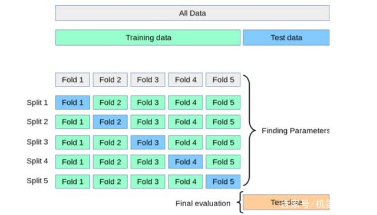

# 机器学习重点知识

## 一、防止过拟合的办法

1、正则化：L1、L2、添加BN层

2、添加Dropout策略

3、降低模型复杂度

4、交叉验证

5、用更多的数据进行训练

6、早停  7、集成学习方法bagging(如随机森林）能有效防止过拟合

8、减少特征个数(不是太推荐)注意：降维不能解决过拟合。降维只是减小了特征的维度，并没有减小特征所有的信息。

## 二、CNN参数和尺寸计算

AlexNet网络为例，以下是该网络的参数结构图。

### AlexNet网络的层结构如下：

**1.Input:**       图像的尺寸是227*227*3.

**2.Conv-1:**    第1层卷积层的核大小11*11，96个核。步长(stride)为4，边缘填充（padding）为0。

**3.MaxPool-1:**     池化层-1对Conv-1进行池化，尺寸为3*3，步长为2.

**4.Conv-2:**    核尺寸：5*5，数量：256，步长：1，填充：2

**5.MaxPool-2:**     尺寸：3*3，步长：2

**6.Conv-3:** 核尺寸：3*3，数量：384，步长：1，填充：1

**7: Conv-4:**   结构同Conv-3.

**8. Conv-5:**   核尺寸：3*3，数量：256，步长：1，填充：1

**9. MaxPool-3**: 尺寸：3*3，步长：2

**10.FC-1:**       全连接层1共有4096个神经元。

**11.FC-1:**       全连接层2共有4096个神经元。

**12.FC-3:**       全连接层3共有1000个神经元。

### **卷积层（Conv Layer）的输出张量（图像）的大小**

定义如下：

O=输出图像的尺寸。

I=输入图像的尺寸。

K=卷积层的核尺寸

N=核数量

S=移动步长

P =填充数

输出图像尺寸的计算公式如下：

输出图像的通道数等于核数量N。

示例：AlexNet中输入图像的尺寸为227*227*3.第一个卷积层有96个尺寸为11*11*3的核。步长为4，填充为0.

输出的图像为55*55*96（每个核对应1个通道）。

### **池化层（MaxPool Layer）的输出张量（图像）的大小**

定义如下：

O=输出图像的尺寸。I=输入图像的尺寸。S=移动步长PS=池化层尺寸

输出图像尺寸的计算公式如下：

不同于卷积层，池化层的输出通道数不改变。

示例：每1层卷积层后的池化层的池化层尺寸为3*3，步长为2。根据前面卷积层的输出为55*55*96。池化层的输出图像尺寸如下：

输出尺寸为27*27*96。

### **全连接层（Fully Connected Layer）的输出张量（图像）的大小**

全连接层输出向量长度等于神经元的数量。

### **通过AlexNet改变张量（图像）的尺寸的结构如下:**

在AlexNet网络中，输出的图像尺寸为227*227*3.

Conv-1,尺寸变为55*55*96,池化层后变为27*27*96。

Conv-2,尺寸变为27*27*256,池化层后变为13*13*256.

Conv-3,尺寸变为13*13*384,经过Conv-4和Conv-5变回13*13*256.

最后,MaxPool-3尺寸缩小至6*6*256.

图像通过FC-1转换为向量4096*1.通过FC-2尺寸未改变.最终,通过FC-3输出1000*1的尺寸张量.

接下来,计算每层的参数数量.

### **Conv Layer参数数量**

在CNN中,每层有两种类型的参数:weights 和biases.总参数数量为所有weights和biases的总和.

定义如下:

WC=卷积层的weights数量

BC=卷积层的biases数量

PC=所有参数的数量

K=核尺寸

N=核数量

C =输入图像通道数

卷积层中,核的深度等于输入图像的通道数.于是每个核有K*K个参数.并且有N个核.由此得出以下的公式.

示例:AlexNet网络中,第1个卷积层,输入图像的通道数(C)是3,核尺寸(K)是11*11,核数量是96. 该层的参数计算如下：

计算出Conv-2, Conv-3, Conv-4, Conv-5 的参数分别为 614656 , 885120, 1327488 和884992.卷积层的总参数就达到3,747,200.

### **MaxPool Layer参数数量**

没有与MaxPool layer相关的参数量.尺寸,步长和填充数都是超参数.

### **Fully Connected (FC) Layer参数数量**

在CNN中有两种类型的全连接层.第1种是连接到最后1个卷积层,另外1种的FC层是连接到其他的FC层.两种情况我们分开讨论.

**类型1:**连接到Conv Layer

定义如下:

Wcf= weights的数量

Bcf= biases的数量O= 前卷积层的输出图像的尺寸

N = 前卷积层的核数量

F = 全连接层的神经元数量

**示例:** AlexNet网络中第1个FC层连接至Conv Layer.该层的O为6,N为256,F为4096.

参数数目远大于所有Conv Layer的参数和.

**类型2:**连接到FC Layer

定义如下:

Wff= weights的数量

Bff= biases的数量

Pff= 总参数的数量

F= 当前FC层的神经元数量

F-1 = 前FC层的神经元数量

**示例:**AlexNet的最后1个全连接层,   F-1=4096,F=1000 .

### **AlexNet网络中张量(图像)尺寸和参数数量**

AlexNet网络中总共有5个卷积层和3个全连接层.总共有62,378,344个参数.以下是汇总表.

| Layer Name | Tensor Size | Weights | Biases | Parameters |
| --- | --- | --- | --- | --- |
| Input Image | 227x227x3 | 0 | 0 | 0 |
| Conv-1 | 55x55x96 | 34,848 | 96 | 34,944 |
| MaxPool-1 | 27x27x96 | 0 | 0 | 0 |
| Conv-2 | 27x27x256 | 614,400 | 256 | 614,656 |
| MaxPool-2 | 13x13x256 | 0 | 0 | 0 |
| Conv-3 | 13x13x384 | 884,736 | 384 | 885,120 |
| Conv-4 | 13x13x384 | 1,327,104 | 384 | 1,327,488 |
| Conv-5 | 13x13x256 | 884,736 | 256 | 884,992 |
| MaxPool-3 | 6x6x256 | 0 | 0 | 0 |
| FC-1 | 4096×1 | 37,748,736 | 4,096 | 37,752,832 |
| FC-2 | 4096×1 | 16,777,216 | 4,096 | 16,781,312 |
| FC-3 | 1000×1 | 4,096,000 | 1,000 | 4,097,000 |
| Output | 1000×1 | 0 | 0 | 0 |
| Total |  |  |  | 62,378,344 |