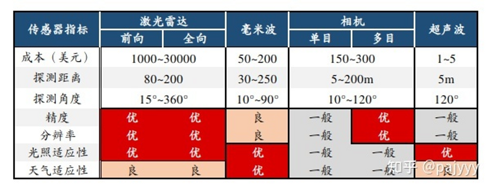
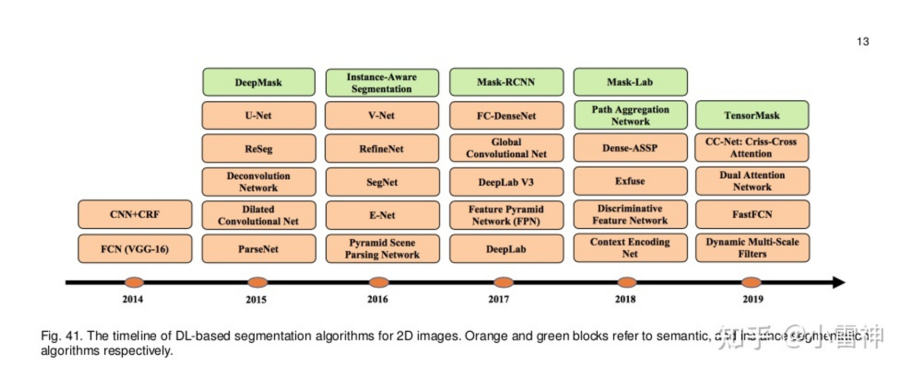

::: tips
感知算法概述
:::

<aside> 🪁 框架：感知、定位、决策、控制

-   关于传感器
    
    
    
    <aside> 🪁 1）激光雷达的测距精度、测距范围及对温度和光照的适应性都很厉害，缺点就是太贵；
    
    2）相机对环境细节信息的提取能力吊炸天，但是光照影响太大，晚上就瞎了；
    
    3）[毫米波](https://www.zhihu.com/search?q=%E6%AF%AB%E7%B1%B3%E6%B3%A2&search_source=Entity&hybrid_search_source=Entity&hybrid_search_extra=%7B%22sourceType%22%3A%22answer%22%2C%22sourceId%22%3A1851149672%7D)最大优点探测角度比较大，抗干扰性强，性能比较稳定，另外也不贵，缺点就是分辨率和精度跟不上。
    
    4）[超声波雷达](https://www.zhihu.com/search?q=%E8%B6%85%E5%A3%B0%E6%B3%A2%E9%9B%B7%E8%BE%BE&search_source=Entity&hybrid_search_source=Entity&hybrid_search_extra=%7B%22sourceType%22%3A%22answer%22%2C%22sourceId%22%3A1851149672%7D)最牛逼的地方是便宜，倒车防撞提醒用的一般是这个，一台车上装十个成本才一百块钱，精度也是最差的，不过低速倒车3m左右足够了。
    
    5）红外优点不是很明显，主要就是晚上比较好用，智驾方案里不算标配，很多传感器方案都没有这个，这里就不过多提了。
    
    </aside>
    
    车载相机：**信息提取最全**，无论哪个方案，都要用这个；
    
    激光雷达：**精度最高，价格最贵**；
    
    毫米波：性能没激光雷达好，但是**抗干扰能力最强**，价格上实现整车量产没问题；
    
    超声波：**最便宜，感知范围最窄**，但是5m以内测距问题不大，倒车防撞最经典应用。
    
-   传感器的标定
    
    -   1、相机标定：
        
        建立图像坐标系与世界坐标系的关系，张正友标定法
        
    -   2、激光雷达标定
        
        建立激光雷达和车身坐标系的位置关系，通常需要将激光雷达与惯性导航单元IMU融合标定，粗略的可以通过直接测量得到。了解到一种方法叫做****最小方差标定法，****将激光雷达标定到了车身，那么地面这个平面上所有点云的高度值一定相等，激光雷达的pitch和roll角（俯仰和横滚）会影响这个高度值，因此我们可以求出地面点云的高度方差，通过角度补偿的方式找出一个pitch和roll角使得地面上的点云的方差最小，接近为0，此时这个pitch和roll就是我们当前激光雷达相对与车身坐标系的误差角。假定我们将激光雷达标定到了车身，那么墙面这个平面上所有点云的X值（纵向距离）一定相等，激光雷达的yaw角（航向）会影响这个距离度值，因此我们可以求出墙面点云的纵向距离方差，通过角度补偿的方式找出一个yaw角使得墙面上点云的方差最小，接近为0，此时这个yaw角就是我们当前激光雷达相对与车身坐标系的误差角。
        
    -   3、多激光雷达之间标定
        
        可以通过不同激光雷达与车体之间的位置关系进行转换
        
    -   4、激光雷达与相机的标定
        
        激光雷达与相机的联合标定，可以通过提取标定物在单线激光雷达和图像上对应的特征点，完成单线激光雷达、相机坐标系、图像坐标系之间的统一。一般有两种方法：使用标定板和自标定方法，
        
    -   5、联合标定
        
        百度的阿波罗联合标定工具箱，我认为很多工具，你只需要知道它能够拿来干什么就足够了，并不一定要完全知道其中的具体原理。
        
-   计算机视觉的应用
    
    -   图像分割
        
        -   基于阈值分割
            
            通过设定不同的特征阈值，吧像素点分为具有不同灰度等级的目标区域和背景区域。
            
            -   关键在于确定阈值
                
                利用灰度直方图的峰谷法、最小误差法、基于过渡区法、利用像素点空间位置信息的变化阈值法、结合连通信息的阈值法、最大相关性原则和最大熵原则的自动阈值法。
                
        -   基于区域分割
            
            1、基于区域生长，从单个像素出发，逐步合并所需要的分割区域
            
            2、区域分裂合并，从全局出发，逐步分割所需要分割的区域
            
        -   基于边缘检测
            
            通过检测包含不同区域的边缘来解决分割方法，是最常用的方法，通常来说，不同区域之间的边缘像素灰度的变化比较剧烈。 **基本方法**：图像一阶导数极大值，二阶导数过零点信息作为基本判据。
            
            一阶算子：Robert算子，Prewitt算子，Sobel算子 二阶算子：拉普拉斯算子 优点:边缘定位准确、速度快 难点：单纯的边缘检测无法保证边缘的连续性和封闭性，二是边缘检测在高细节区存在大量的碎片边缘。
            
        -   基于深度模型
            
            
            
    -   应用
        
        1、双目视觉获得深度信息
        
        2、点云数据检测
        
        3、运动估计
        
        4、物体检测、识别、跟踪
        
        5、场景分割
        
        6、同步地图构建和自身定位
        
-   环境感知与识别
    
    -   障碍物检测
        -   1、基于图像的障碍物检测
            
            一阶算法：YOLO和SSD；二阶算法：RCNN系列
            
        -   2、基于激光雷达检测
            
        -   3、图像和激光雷达融合检测
            
    -   车道线识别

</aside>