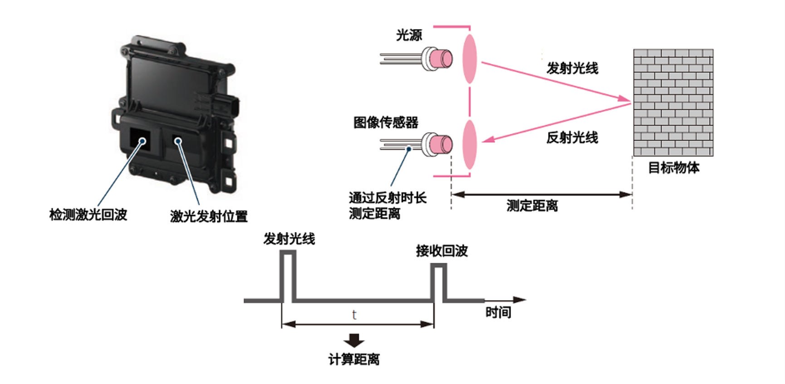
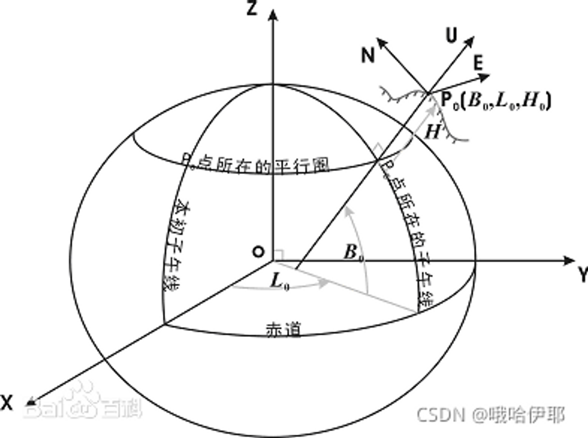

::: tip
自动驾驶概述
:::

# 1、自动驾驶主要分为感知、定位、决策、控制
    
# 2、自动驾驶常见的传感器类型
    

    
1）激光雷达的测距精度、测距范围及对温度和光照的适应性都很厉害，缺点就是太贵；
    
2）相机对环境细节信息的提取能力吊炸天，但是光照影响太大，晚上就瞎了；
    
3）[毫米波](https://www.zhihu.com/search?q=%E6%AF%AB%E7%B1%B3%E6%B3%A2&search_source=Entity&hybrid_search_source=Entity&hybrid_search_extra=%7B%22sourceType%22%3A%22answer%22%2C%22sourceId%22%3A1851149672%7D)最大优点探测角度比较大，抗干扰性强，性能比较稳定，另外也不贵，缺点就是分辨率和精度跟不上。
4）[超声波雷达](https://www.zhihu.com/search?q=%E8%B6%85%E5%A3%B0%E6%B3%A2%E9%9B%B7%E8%BE%BE&search_source=Entity&hybrid_search_source=Entity&hybrid_search_extra=%7B%22sourceType%22%3A%22answer%22%2C%22sourceId%22%3A1851149672%7D)最牛逼的地方是便宜，倒车防撞提醒用的一般是这个，一台车上装十个成本才一百块钱，精度也是最差的，不过低速倒车3m左右足够了。
5）红外优点不是很明显，主要就是晚上比较好用，智驾方案里不算标配，很多传感器方案都没有这个，这里就不过多提了。
    
车载相机：**信息提取最全**，无论哪个方案，都要用这个；
    
激光雷达：**精度最高，价格最贵**；
    
毫米波：性能没激光雷达好，但是**抗干扰能力最强**，价格上实现整车量产没问题；
    
超声波：**最便宜，感知范围最窄**，但是5m以内测距问题不大，倒车防撞最经典应用。
加速度计和陀螺仪
- 加速度计用来测量运动物体的加速度大小和方向，经过对时间一次积分得到速度，速度再经过一次积分可以得到位移；
- 陀螺仪用于测量运动体绕各个轴向的旋转角速率值，通过四元数角度结算形成导航坐标系，使加速度计的测量值投影到该坐标系中，并可给出航向和姿态角。
-磁力计用来测量磁场强度和方向，定位运动的方向，通过地磁向量的误差表征量，可以反馈到陀螺仪的姿态解算输出中，校准陀螺仪的漂移。
    
# 3、自动驾驶常见的传感器

## 3.1相机：**TOF、RGB双目、结构光**
        

 
## 3.2单目相机（Monocular）、双目相机（Stereo）、深度相机（RGB-D）
        
 🪁 以一定速率拍摄周围的环境，形成一个连续的视频流。普通相机能以**每秒钟30秒**张图片的速度采集图像，高速相机则更快一些。深度相机（RGB-D）原理较复杂，除了能够采集彩色图像之外，还能读出每个像素离相机的距离。
### 3.2.1单目相机
  **单目[SLAM](https://so.csdn.net/so/search?q=SLAM&spm=1001.2101.3001.7020)**估计的轨迹和地图，将与真实的轨迹’地图，相差一个因子，也就是所谓的尺度。由于单目SLAM无法仅凭图像确定这个真实尺寸，所以又称为尺度不确定性。 本质原因是通过单张图像无法确定深度。
  
  
  
  图像坐标系上一点坐标到像素坐标系下一坐标，需要坐标在u轴上缩放α倍，v轴上缩放β倍。
  
  总体的变换过程如下：
  
  $Z_c\begin{bmatrix} u \\ v \\ 1 \\ \end{bmatrix} =\begin{bmatrix} \alpha&0&c_x \\ 0&\beta&c_y \\0&0&1 \\ \end{bmatrix} \begin{bmatrix} f&0&0&0 \\ 0&f&0&0 \\0&0&1&0 \\ \end{bmatrix} \begin{bmatrix} R&t\\O&1\end{bmatrix}\begin{bmatrix} X_w\\Y_w\\Z_w\\1\end{bmatrix}$
  
  $Z_c\begin{bmatrix} u \\ v \\ 1 \\ \end{bmatrix} =\begin{bmatrix} f_x&0&c_x&0 \\ 0&f_y&c_y&0 \\0&0&1&0 \\ \end{bmatrix} \begin{bmatrix} R&t\\O&1\end{bmatrix}\begin{bmatrix} X_w\\Y_w\\Z_w\\1\end{bmatrix}$
  
  其中，记$\alpha{f}=f_x,\beta{f}=f_y$，其含义为**焦距f**在**图像坐标系**两轴方向上的**像素个数**，单位像素。
  
  右侧第一个矩阵为相机**内参矩阵K**（Camera Intrinsic Matrix），描述相机坐标与**像素坐标**之间的对应关系；
  
  右侧第二个矩阵为相机外参矩阵T（Camera Extrinsic Matrix），描述**世界坐标系**与**相机的位置**关系。
  
  左侧系数**Zc**称为**比例因子**，可记为s ****归一化坐标：****
  
  投影过程可认为，将世界坐标系下点坐标：$^w{p}=[X_w \quad Y_w \quad Z_w ]^T$转换到相机坐标系下点坐标系$^c{p}=[X_c \quad Y_c \quad Z_c ]^T$，随后除去一维的数值（图像的深度信息），得到归一化坐标：$R\begin{bmatrix} X_w\\Y_w\\Z_w\end{bmatrix}+t=\begin{bmatrix} X_c\\Y_c\\Z_c\end{bmatrix} \to \begin{bmatrix} \frac{X_c}{Z_c}\\\frac{Y_c}{Z_c}\\1\end{bmatrix}$
  
  归一化坐标可视作为，相机平面前方z=1处平面上的点，称为**归一化平面**，**归一化坐标左乘内参矩阵可得像素坐标**。
  
  通常认为**归一化平面同图像平面相同，也即图像平面在相机平面前方z=1处**。可知，在针孔模型中图像的深度信息被丢弃，无法得到。
  
  -   由**透镜形状**对传播产生的畸变，称为**径向畸变**（Radial Distortion），这种畸变越靠近图像边缘，越明显。此类畸变由于透镜形状的中心对称而通常径向对称。
  -   由机械安装对传播产生的畸变，称为**切向畸变**（Tangential Distortion），切向畸变产生于相机透镜组装的不精确，由于透镜制造上的缺陷使其本身同像平面不平行而产生
  
  
  
  畸变模型：
  
  理想点（Ideal Point）为通过坐标变换得到的坐标，真实点（Real Point）为理想点$(x,y)$,经过径向畸变d r drdr和切向畸变d t dtdt后真实得到图像的上的点：
  
  $\begin{cases} x_{dis}=x(1+k_1r^2+k_2r^4+k_3r^6)+2p_1xy+p_2(r^2+2x^2) \\ y_{dis}=y(1+k_1r^2+k_2r^4+k_3r^6)+p_1(r^2+2y^2)+2p_2xy \\ \end{cases}$
  
  其中，径向畸变由参数:$[k_1,k_2,k_3]$确定；切向畸变由参数$[p_1,p2]$决定；参数r满足：$r^2=x^2+y^2$。
  
  由畸变后的点通过内参矩阵可得到像素平面上的实际坐标：
  
  $\begin{cases} u=f_xx_{dis}+c_x\\ v=f_yy_{dis}+c_y\\ \end{cases}$ 而畸变较真就是反推出真实的x，y在哪里。
  
  
  
  
            
### **双目相机**  
            
**双目相机**由两个单目相机组成，但这两个相机之间的距离（称为基线）是已知的。我们通过这个基线来估计每个像素的空间位置，基线距离越大，能够测量到的就越远，双目与多目的缺点是配置与标定均较为复杂，其深度量程和精度受双目的基线与分辨率的限制，而且视觉计算非常消耗计算资源，需要使用GPU和FPGA设备加速后，才能实时输出整张图像的距离信息。因此在现有的条件下，计算量是双目的主要问题之一。

则可由相似三角形得到：$\frac{z-f}{z}=\frac{v-u_L+u_R}{b}$

从而得到深度信息：$z=f\frac{b}{d}$

其中，参数d称为**视差**（disparity），用于描述物体在两相机上形成像素的横坐标之差：$d\triangleq=u_L-u_R$

由视差可估计得到物体的深度信息，视差越大，距离越近。由于视差最小为一个像素，则双目测量具有最大值：

$\forall{d=1}\qquad{s.t.}\qquad{z_{max}=fb}$

也即双目相机的基线越大，测量范围就越大。
            
### 深度相机
            
**深度相机**又称RGB-D相机，它最大的特点是可以通过红外结构光或Time-of-Flight(ToF)原理，像激光传感器那样，通过主动像物体发射光并接收返回的光，测出物体离相机的距离。目前常用的RGB-D相机还存在测量范围窄、噪声大、视野小、易受日光干扰、无法测量透射材质等诸多问题。

RGB-D相机按原理可分为两大类：

-   红外结构光类（Structured Light）
-   飞行时间类（Time-of-Flight,ToF）

RGB-D相机通过向**探测目标发射光束**（通常为红外光）进行测距。其中**结构光相机返回结构光图案**以计算距离，而飞行时间则计算**发射与接收时间差值**计算距离。

相机成像后，生成图像。图像在计算机中以矩阵形式存储（二维数组）。

            
# 4、自动驾驶传感器
        
## 4.2 传感器分类

## 4.2毫米波雷达

## 4.3激光类雷达

**扫描式激光雷达：**被称为自动驾驶领域中必不可少的传感器。它可对车辆自身位置和目标物体之间的距离以及目标物体的形状进行分析，也可对包括行车道白线在内的道路形状等进行识别。

MEMS（Micro Electromechanical System）即微机电系统，是指尺寸在几毫米乃至更小的高科技装置，其内部结构一般在微米甚至纳米量级，是一个独立的智能系统。 MEMS微光反射镜是指采用光学MEMS技术制造的，把微光反射镜与MEMS驱动器继集成在一起的光学MEMS器件。MEMS微光反射镜的运动方式包括平动和扭转两种机械运动。 通过可旋转MEMS微光反射镜改变发射光束的方向，对特定范围进行扫描。目标物体会反射扫描光束，接收部件会识别反射光。通过发射激光和接收到反射光的时间，可以测定与目标物体间的距离以及目标物体的大小。

## 4.4超声波雷达

**超声波传感器的构成**

**工作原理：**

超声波发射器发出超声波，超声波遇到障碍物会返回，超声波传感器正是根据发射波和回波之间的时间差来测定发射点到障碍物的实际距离。

强大如超声波传感器可是很怕脏污的，应始终保持表面干净。因为当其被异物附着时，超声波喇叭的震动(残响时间*1)会发生异常。例如超声波喇叭上附着霜（冰）、雪、泥等异物时，会影响超声波喇叭的正常功能。挡板即护圈（保护零件），相当于超声波传感器嵌入车辆的缓冲器。

## 4.5相机

**摄像头传感器的分类和构成**

摄像头传感器分为单镜头摄像头和多镜头立体摄像头两种。单镜头摄像头识别的是平面影像，而多镜头立体摄像头内置2个摄像头，除了可以识别立体物体，还可以测算到目标物体的距离。

投影点坐标的位置不精确会影响检测精度。请确保镜头已得到充分的校正、调整。

**工作原理：**

像头传感器通过获取摄像头拍摄的车辆周边的实景画面，从实景画面中抽取场景特征信息、调整显像浓度，对画面进行预处理。根据预处理结果，更容易辨别对象的特征及形状、颜色等信息，从而提高检测速度。

**摄像头传感器**

## 4.5视觉检测应用
**目标物体处理流程：**

图像传感器通过图像处理识别对象物体，根据驾驶辅助ECU检测到的信息进行内容识别、判断、控制车辆。

**检测车道：**

从经过处理的图像上抽取边缘画面（亮度变化大的区域），从边缘画面中找出行车线标记（车道两侧的实线及虚线，直道显示为直线），通过行车线标记测定车道。

基于行车线信息获取车道中央位置、车辆行进方向及测算距离，从而识别、判断、控制车辆。

Hough (霍夫变换)用于检测图像中的各类曲线（如直线、圆、抛物线、椭圆等），并以一定的函数关系进行描述，应用于影像分析、模式识别等很多领域。

**检测道路标识：**

从经过处理的图像上抽取对应的候补点，寻找由各点分布构成的直线、曲线、平面等任意图形，按照特定的模板推定标识。通过标识信息进行判断并控制车辆。

**检测行人：**

物图像由于体型、姿势、衣着等因素影响较难识别。因此，从图像中区分出静止的背景和运动的人物，需要根据模型化部位（手脚等较大部位的图形）以及统计性特征（全身图像等）进行识别，符合特征的则被判定为行人。根据车辆与行人间的位置关系及测算的距离，识别、判断、控制车辆。

**多镜头立体摄像头：**

单镜头摄像头拍摄到的某一个图像，在转化成二次元画面时，由于缺少目标物体纵深数据导致无法进行立体识别。而多镜头立体摄像头融合了2个摄像头拍摄的图像从而获得视觉差，并利用视觉差使用三件测量的方式计算出纵深数据。因此，立体地识别目标物体的大小及形状

确保摄像头视野，图像传感器和镜片密封玻璃（前置摄像头）间配备镜头加热器。通过监控车外温度，镜头加热器加热除雾。当摄像头前方视野模糊时，图像传感器将停止工作。

另外，车辆在酷热等环境下停放后，图像传感器的温度会变得很高，可能会影响识别功能甚至过热停机。（温度降低后将正常工作）

## 4.6IMU

一些基本概念：

1、**6轴 :** 三轴(XYZ)加速度计 + 三轴(XYZ)陀螺仪(也叫角速度传感器) 2、**9轴 :** 6轴 + 三轴(XYZ)磁场传感器 6轴模块可以构成VRU(垂直参考单元)和IMU(惯性测量单元)，9轴模块可以构成AHRS(航姿参考系统)

3、**IMU惯性测量单元：**可以输出加速度和角速度。并不输出姿态角等其他信息。是测量物体三轴角速度和加速度的设备。一个IMU内可能会装有三轴陀螺仪和三轴加速度计，来测量物体在三维空间中的角速度和加速度。严格意义上的IMU只为用户提供三轴角速度以及三轴加速度数据。

4、**VRU**垂直参考单元**:** IMU的基础上内置姿态解算算法，可以输出姿态信息。在IMU的基础上，以重力向量作为参考，用卡尔曼或者互补滤波等算法为用户提供有重力向量参考的俯仰角、横滚角以及无参考标准的航向角。通常所说的6轴姿态模块就属于这类系统。航向角没有参考，不管模块朝向哪里，启动后航向角都为0°(或一个设定的常数)。随着模块工作时间增加，航向角会缓慢累计误差。俯仰角，横滚角由于有重力向量参考，低机动运动情况下，长时间不会有累积误差。

4、**AHRS航姿参考系统:** VRU的基础上修改算法，可以解算被测物体的全姿态，包括绝对的航向角(与地磁北极的夹角)，因为要用到**地磁传感器，所以必须是9轴模块**。另外室内由于地磁场畸变非常严重，AHRS 在室内也很难获得准确的绝对航向角。

在VRU的基础上增加了磁力计或光流传感器，用卡尔曼或者互补滤波等算法为用户提供拥有绝对参考的俯仰角、横滚角以及航向角的设备，这类系统用来为飞行器提供准确可靠的姿态与航行信息。我们通常所说的9轴姿态传感器就属于这类系统，因为航向角有地磁场的参考，所以不会漂移。但地磁场很微弱，经常受到周围带磁物体的干扰，所以如何在高机动情况下抵抗各种磁干扰成为AHRS研究的热门。

-   ****LLA、ENU、ECEF坐标系****

1.  LLA地理坐标系则通过经度(longitude)，纬度(latitude)和高度(altitude)来表示地球的位置，也叫经纬高坐标系(LLA坐标系)。
2.  ENU站心坐标系也叫做站点坐标系、东-北-天坐标系ENU，英文名称是local Cartesian coordinates coordinate system，主要是用于需了解以观察者为中心的其他物体运动规律。

(1)站心直角坐标系

定义：以站心（如GPS接收天线中心）为坐标系原点O，Z轴与椭球法线重合，向上为正（天向），y与椭球短半轴重合（北向），x轴与地球椭球的长半轴重合（东向）所构成的直角坐标系，称为当地东北天坐标系（ENU）。

(2)站心极坐标系

定义：以站心为坐标极点O，以水平面（即xoy平面）为基准面，以东向轴（即x轴）为极轴，ρ为卫星到站点的距离，az为星视方向角（azimuth angle），el为星视仰角（elevation）。

3.  ECEF

地心地固坐标系（Earth-Centered,Earth-Fixed，简称ECEF）简称地心坐标系，是一种以地心为原点的地固坐标系（也称地球坐标系），是一种笛卡儿坐标系。原点 O (0,0,0)为地球质心，z 轴与地轴平行指向北极点，x 轴指向本初子午线与赤道的交点，y 轴垂直于xOz平面(即东经90度与赤道的交点)构成右手坐标系。

-   GNSS/INS

**GPS：**全球卫星定位系统

**GNSS:** 全球卫星定位系统，GPS，北斗，格洛纳斯等系统的总称

**GNSS/INS:** 卫星/惯导组合导航系统，是一种组合导航系统，顾名思义这种系统是利用全球卫星导航系统(Global Navigation Satellite System 简称GNSS，它是GPS，北斗，GLONASS、GALILEO等系统的统称) 与惯性导航(Inertial Navigation System)各自的优势进行算法融合，为用户提供更加精准的姿态及位置信息。

6轴和9轴输出的是本身传感器的测量数据，accel、gyro 都是基于轴上的线加速度和轴角的角速度变换，都是原始的数值。而9轴相对于6轴只是增加一个磁力计测绝对方向，9轴中的imu传感器本身的测量和6轴一样。

6轴使用dmp解算时，roll、pich是ENU系下的，是绝对值，但是yaw和地理航向就没有任何关系了，6轴dmp解算后的yaw是相对于上电校准成功后的角度。9轴是地磁航向，地磁航向和ENU航向之间有个夹角，是已知的，可以补偿。

“9轴的地磁航向” 和 “ENU的航向” 之间的夹角补偿，是指我们平时说的，在当地进行磁力计校准吗？磁力计校准后，9轴的航向就是ENU系下的是吗？不是，地磁的北极和地理的北极不一致，二者有夹角。“磁力计校准” 校准是计算传感器的测量误差。

现在自动驾驶的感知、规划方案，多数都是要基于先验高精地图。

建图时，初始航向可以取自9轴、6轴、INS吗？可以。很多slam建图都没有IMU呢，航向就是初始为0和ENU都没有任何关系，不也照样到导航、规划、感知。定位是基于地图的定位，只要相对于地图的位置和姿态是准的就行

## 4.7V2X技术

在环境感知方面，除了利用车辆自身的智能，还可以借助外部环境实现信息的获取，这一类技术统称为V2X技术。

**V2X（Vehicle to Everything）技术又称为车用无线通信技术**，本质上是一种物联网技术，V代表的是车辆，X代表的是道路、人、车、设备等一切可以连接的设备。

接下来详细介绍下V2X的各个场景包括：车与车之间（Vehicle to Vehicle,V2V）、车与路之间（Vehicle to Infrastructure,V2I）、车与人之间（Vehicle toPedestrian, V2P）、车与网络之间（Vehicle toNetwork, V2N）的交互。

### **1、V2V**

V2V是最经典的场景，指的是**道路上车辆之间的通信**。典型的就是前方车辆并道，后方车辆避让。

### **2、V2I**

V2I是指**车载设备与路侧基础设施**（如红绿灯、交通摄像头、路侧单元等）进行通信，路侧基础设施也可以获取附近区域车辆的信息并发布各种实时信息。V2I通信主要应用于实时信息服务、车辆监控管理、不停车收费等。

### **3、V2P**

V2P是指弱势交通群体（包括行人、骑行者等）使用用户设备（如手机、笔记本电脑等）与车载设备进行通信。V2P通信主要应用于避免或减少交通事故、信息服务等。

### **4、V2N**

V2N是指车载设备通过接入网/核心网与云平台连接，云平台与车辆之间进行数据交互，并对获取的数据进行存储和处理，提供车辆所需要的各类应用服务。V2N通信主要应用于车辆导航、车辆远程监控、紧急救援、信息娱乐服务等。
        
-   机器人相关技术（多传感器融合、路径规划、控制）
    