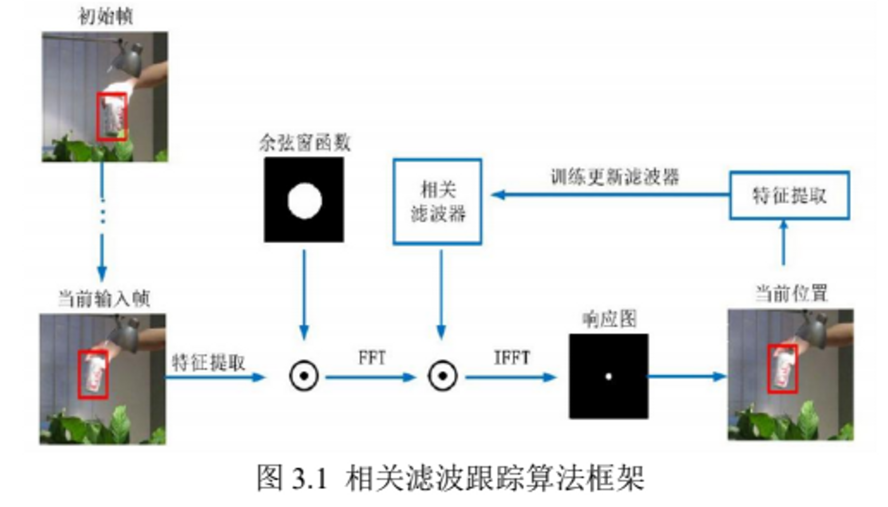

::: tip
C++个人项目经验
:::

<aside> 🪁 （1）使用c++练习一些数据结构和算法题目 （2）使用C++进行相机标定 设置标定板角点数量→读取图像→利用findChessboardCorners识别角点（*harris，_高斯滤波+非极大值抑制）→亚像素精细化→保存角点图像坐标→初始化标定板上的三维坐标→calibrateCamera函数开始标定（张正友标定法）→通过得到的内外参数对三维点进行重投影计算，计算重投影误差进行评价 （3）使用C++进行简单的工业相机多线程开发，采用激光三角法进行钢带平整度检测。 启动系统后，相机开始采集图像，将图像信息放入任务队列，这个队列负责保存相机取得的图像，而图像处理的线程负责从这个队列里取图，然后进行自适应阈值处理，二值化，然后进行中值滤波、形态学处理以及边缘检测等预处理_,,*再通过灰度质心法和圆拟合等图像处理操作，得到激光光斑的中心位置坐标和直径大小。再结合激光三角法测距模型，换算成平直度参数。 （4）利用C++开发小目标跟踪MFC程序 基于天空背景下的红外弱小目标的提取，通过对视频连续探测，输出探测飞机图像框中心坐标。采用opencv中的CSRT、MIL、KCF等多种跟踪算法 对小目标进行跟踪。具体步骤为：实例化跟踪器Tracker，选取一个ROI目标，在跟踪器上初始化这个RIO目标，然后开始跟踪目标，画出目标框，输出目标中心坐标。

这类方法一般都是在追踪过程中训练一个目标跟踪器，使用目标分类器去预测下一帧目标位置，即分类器的最大响应输出值，然后再通过输出结果的区域样本作为当前帧的训练样本，持续不断地更新目标跟踪器的参数，进而预测下一时刻的输出值。算法实现主要分为以下三部分：相关滤波器训练、目标位置检测、相关滤波器更新。 特征提取：采用**HOG方向梯度图**和**CN颜色特征**融合进行提取

</aside>

