::: tip
C++面试常见问题
:::


-   进程通信方式
    
    包括管道（有名管道和无名管道）、消息队列、共享内存、信号量和套接字。其中前四个属于同一台机器下进程间的通信，套接字则是用于网络通信。
    
-   动态分区
    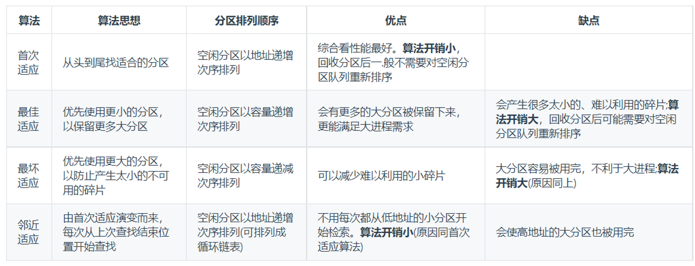
-   虚拟技术
    
    主要有两种虚拟技术：时分复用技术和空分复用技术。
    
    多进程与多线程：多个进程能在同一个处理器上并发执行使用了时分复用技术，让每个进程轮流占用处理器，每次只执行一小个时间片并快速切换。
    
    虚拟内存使用了空分复用技术，它将物理内存抽象为地址空间，每个进程都有各自的地址空间。
    
-   ****逻辑地址转换为物理地址的基本过程****
    
    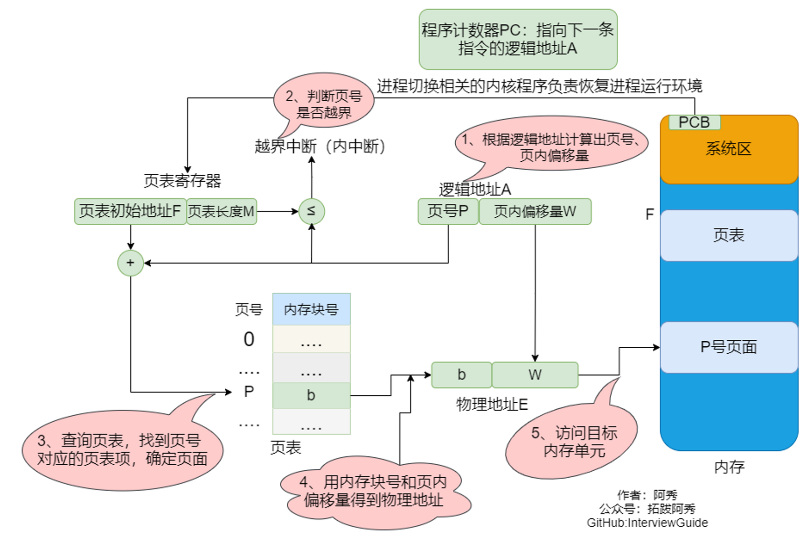
    
    例:若页面大小L为1K字节，页号2对应的内存块号b=8，将逻辑地址A=2500转换为物理地址E。 等价描述：某系统按字节寻址，逻辑地址结构中，页内偏移量占10位(说明一个页面的大小为2^10B = 1KB)，页号2对应的内存块号 b=8，将逻辑地址A=2500转换为物理地址E。
    
    > ①计算页号、页内偏移量 页号P=A/L = 2500/1024 = 2; 页内偏移量W= A%L = 2500%1024 = 452
    > 
    > ②根据题中条件可知，页号2没有越界，其存放的内存块号b=8
    > 
    > ③物理地址E=b*L+W=8 * 1024+ 425 = 8644
    > 
    > 在分页存储管理(页式管理)的系统中，只要确定了每个页面的大小，逻辑地址结构就确定了。因此，页式管理中地址是-维的。即，只要给出一个逻辑地址，系统就可以自动地算出页号、页内偏移量两个部分，并不需要显式地告诉系统这个逻辑地址中，页内偏移量占多少位。
    
    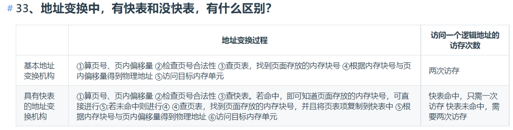
    
-   三次握手
    
    客户端向服务器发送一个包（第一次握手）然后收到服务器的应答（第二次）那客户端就知道**自己能发能收**而且**服务器能发能收。**
    
    服务器收到第一次握手后，发送第二次握手，**服务器知道客户端能发**，但是**服务器不知道客户端收到第二次握手报文**没有，就是不知道客户端能不能收。
    
    第三次就是客户端告诉服务器，说自己收到了**第二次握手**，所以服务器就知道客户端收到了第二次，就知道了**客户端能收**
    
-   四次挥手
    
    A 和 B 打电话，通话即将结束后，A 说“我没啥要说的了”，B回答“我知道了”，但是 B 可能还会有要说的话，A 不能要求 B 跟着自己的节奏结束通话，于是 B 可能又巴拉巴拉说了一通，最后 B 说“我说完了”，A 回答“知道了”，这样通话才算结束。
    
-   内存读写
    
    有了cache，CPU不再直接与内存打交道，因此CPU直接写cache，但此时就会有一个问题，那就是cache中的值更新了，但内存中的值还是旧的，这就是所谓的不一致问题。
    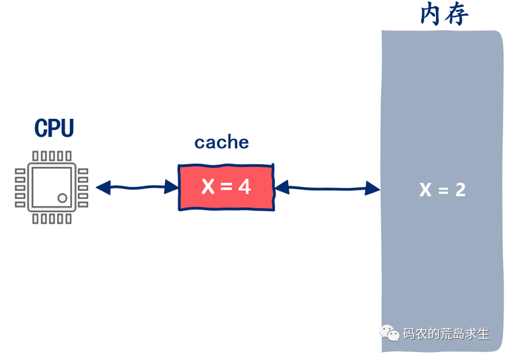
    
    最简单的方法是这样的，当我们更新cache时一并把内存也更新了，这种方法被称为 write-through。
    
    如果当CPU写cache时，cache中没有相应的内存数据该怎么呢？这就有点麻烦了，首先我们需要把该数据从内存加载到cache中，然后更新cache，再然后更新内存。
    
    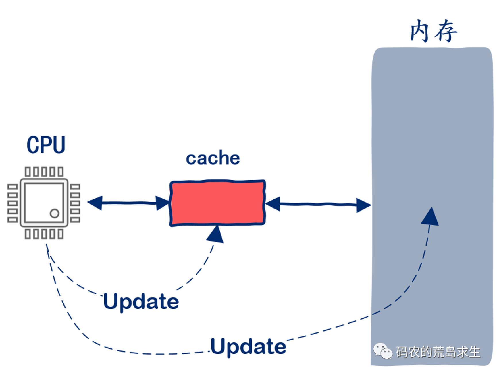
    
    在这种方案下 **写内存就不得不访问内存，速度比较慢。**
    
    不是因为写内存慢，更重要的原因是CPU在同步等待，因此很自然的，这类问题的统一解法就是把同步改为异步。
    
    异步的这种方法是这样的，当CPU写内存时，直接更新cache，然后，注意，更新完cache后CPU就可以认为写内存的操作已经完成了，尽管此时内存中保存的还是旧数据。
    
    当包含该数据的cache块被剔除时再更新到内存中，这样CPU更新cache与更新内存就解耦了，也就是说，CPU更新cache后不再等待内存更新，这就是异步，这种方案也被称之为write-back，这种方案相比write-through来说更复杂，但很显然，性能会更好。
    
    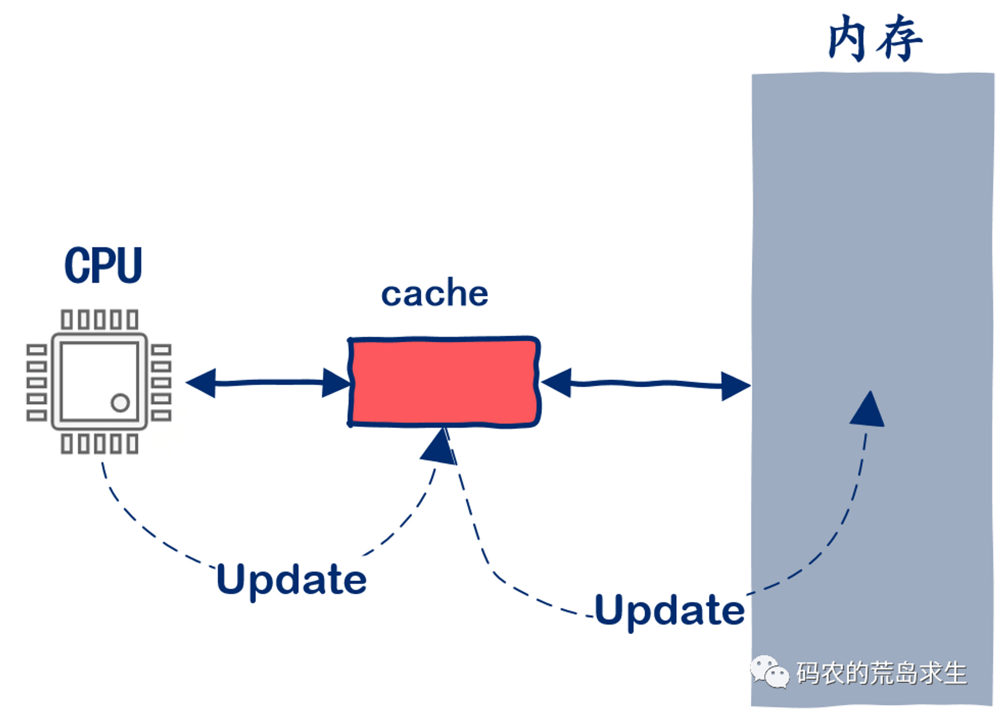
    
    CPU和内存之间会有一个层cache，但当CPU有多个核心后新的问题来了：
    
    现在假设内存中有一变量X，初始值为2。
    
    系统中有两个CPU核心C1和C2，现在C1和C2要分别读取内存中X的值，根据cache的工作原理，首次读取X不能命中cache，因此从内存中读取到X后更新相应的cache，现在C1 cache和C2 cache中都有变量X了，其值都是2。
    
    
    
    接下来C1需要对X执行+2操作，同样根据cache的工作原理，C1从cache中拿到X的值+2后更新cache，在然后更新内存，此时C1 cache和内存中的X值都变为了4。
    
    然后C2也许需要对X执行加法操作，假设需要+4，同样根据cache的工作原理，C2从cache中拿到X的值+4后更新cache，此时cache中的值变为了6（2+4），再更新内存，此时C2 cache和内存中的X值都变为了6。
    
    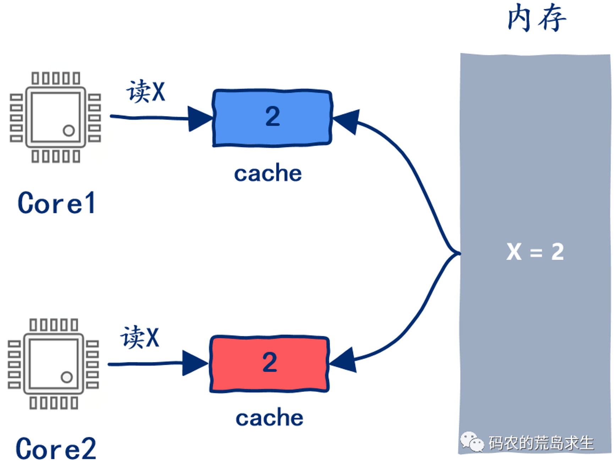
    
    一个初始值为2的变量，在分别+2和+4后正确的结果应该是2+2+4 = 8，但从上图可以看出 **内存中X的值却为6**，问题出在哪了呢？
    
    有的同学可能已经发现了，问题出在了内存中一个X变量 **在C1和C2的cache中有共计两个副本，当C1更新cache时没有同步修改C2 cache中X的值**。
    
    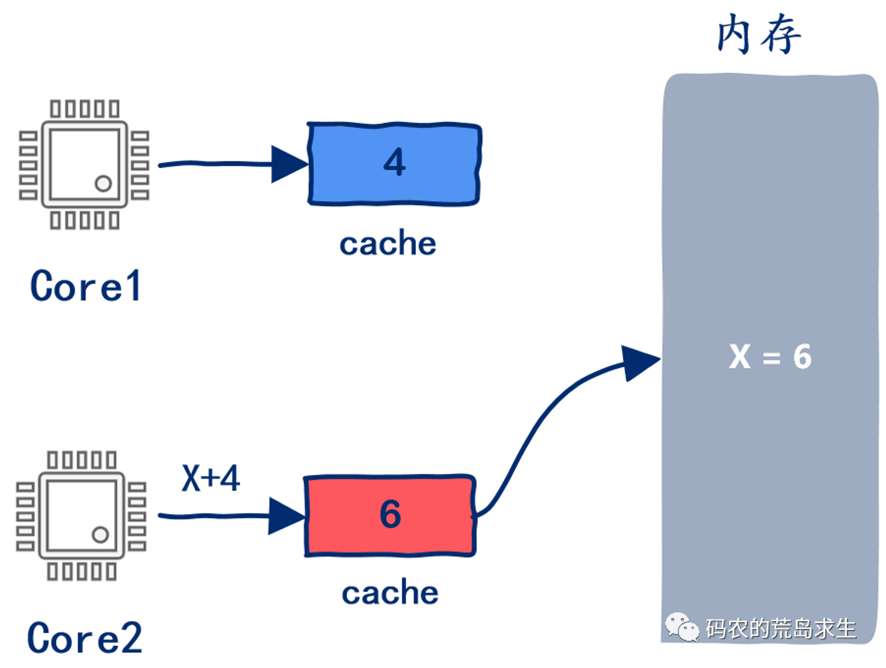
    
    显然，如果一个cache中待更新的变量同样存在于其它核心的cache，那么你需要一并将其它cache也更新好。
    
-   static关键字
    
    类外：
    
    1、 隐藏，只能在当前文件使用，不能被其他文件使用
    
    2、默认为0
    
    3、在函数内定义，始终存在，返回后不清空
    
    类内：
    
    静态成员函数和静态成员变量属于类，不属于类的实体，这样可以被多个对象所共享
    
    1、静态成员变量，类内定义，类外初始化
    
    2、静态成员变量，类外不能访问
    
    3、静态成员函数，没有this，只能访问静态变量和静态函数
    
    4、非静态成员函数可以任意访问
    
-   1、多态
    
    在基类的函数前加上**virtual**关键字，在派生类中重写该函数，运行时将会根据所指对象的实际类型来调用相应的函数，如果对象类型是派生类，就调用派生类的函数，如果对象类型是基类，就调用基类的函数。
    
-   2、内存泄漏
    
    内存泄漏(memory leak)是指由于疏忽或错误造成了程序未能释放掉不再使⽤的内存的情况。内存泄漏并⾮指内存在物理上的消失，⽽是应⽤程序分配某段内存后，由于设计错误，失去了对该段内存的控制，因⽽造成了内存的浪费。 如何避免？将内存的分配封装在类中，构造函数分配内存，析构函数释放内存；使⽤智能指针
    
-   3、线程和进程
    
    <aside> 🪁 1.进程：进程是操作系统中**资源分配**的基本单位,可以看成是程序的一次运行。 2.线程：线程是操作系统中**调度执行**的基本单位 区别和联系：
    
    1、进程是资源分配的基本单位，线程是任务调度执行的基本单位。 2、进程之间的资源是独立的，线程之间的资源则是共享的。 3、进程的创建/销毁/调度开销大，线程的创建/销毁/调度开销相对少很多。 4、进程的上下文切换速度比较慢，而线程的上下文切换速度比较快。 5、多个进程同时执行时，如果一个进程崩溃，一般不会影响其他进程，而同一进程内的多个线程之间，如果一个线程崩溃，很可能使得整个进程崩溃。 6.一个进程可以**包含多个线程**，**线程**在进程的内部。 7.每个进程都有**独立的虚拟[地址空间](https://so.csdn.net/so/search?q=%E5%9C%B0%E5%9D%80%E7%A9%BA%E9%97%B4&spm=1001.2101.3001.7020)**，也有之间独立的文件描述符表，同一**进程的多个线程**之间则共用这一份虚拟地址空间和文件描述符表。
    
    </aside>
    
-   4、TCP/UDP区别
    
    由于 TCP 是面向连接，能保证数据的可靠性交付，因此经常用于：
    
    -   `FTP` 文件传输；
    -   HTTP / HTTPS；
    
    由于 UDP 面向无连接，它可以随时发送数据，再加上UDP本身的处理既简单又高效，因此经常用于：
    
    -   包总量较少的通信，如 `DNS` 、`SNMP` 等；
        
    -   视频、音频等多媒体通信；
        
    -   广播通信；
        
    -   七个区别
        
        _1. 连接_
        
        -   TCP 是面向连接的传输层协议，传输数据前先要建立连接。
        -   UDP 是不需要连接，即刻传输数据。
        
        _2. 服务对象_
        
        -   TCP 是一对一的两点服务，即一条连接只有两个端点。
        -   UDP 支持一对一、一对多、多对多的交互通信
        
        _3. 可靠性_
        
        -   TCP 是可靠交付数据的，数据可以无差错、不丢失、不重复、按序到达。
        -   UDP 是尽最大努力交付，不保证可靠交付数据。
        
        _4. 拥塞控制、流量控制_
        
        -   TCP 有拥塞控制和流量控制机制，保证数据传输的安全性。
        -   UDP 则没有，即使网络非常拥堵了，也不会影响 UDP 的发送速率。
        
        _5. 首部开销_
        
        -   TCP 首部长度较长，会有一定的开销，首部在没有使用「选项」字段时是 `20` 个字节，如果使用了「选项」字段则会变长的。
        -   UDP 首部只有 8 个字节，并且是固定不变的，开销较小。
        
        _6. 传输方式_
        
        -   TCP 是流式传输，没有边界，但保证顺序和可靠。
        -   UDP 是一个包一个包的发送，是有边界的，但可能会丢包和乱序。
        
        _7. 分片不同_
        
        -   TCP 的数据大小如果大于 MSS 大小，则会在传输层进行分片，目标主机收到后，也同样在传输层组装 TCP 数据包，如果中途丢失了一个分片，只需要传输丢失的这个分片。
        -   UDP 的数据大小如果大于 MTU 大小，则会在 IP 层进行分片，目标主机收到后，在 IP 层组装完数据，接着再传给传输层。
-   5、三次握手四次挥手，为什么不是五次
    
    因为三次握手才能保证双方具有接收和发送的能力。更重要的是：
    
    -   三次握手才可以阻止重复历史连接的初始化（主要原因）
    -   三次握手才可以同步双方的初始序列号
    -   三次握手才可以避免资源浪费
    
    四次挥手双方发 `FIN` 包的过程，就能理解为什么需要四次了。
    
    -   关闭连接时，客户端向服务端发送 `FIN` 时，仅仅表示客户端不再发送数据了但是还能接收数据。
    -   服务器收到客户端的 `FIN` 报文时，先回一个 `ACK` 应答报文，而服务端可能还有数据需要处理和发送，等服务端不再发送数据时，才发送 `FIN` 报文给客户端来表示同意现在关闭连接。
    
    从上面过程可知，服务端通常需要等待完成数据的发送和处理，所以服务端的 `ACK` 和 `FIN` 一般都会分开发送，因此是需要四次挥手。
    
-   6、内存管理、内存分区
    
    C++中的内存分区，分别是堆、栈、自由存储区、全局/静态存储区、常量存储区和代码区。如下图所示
    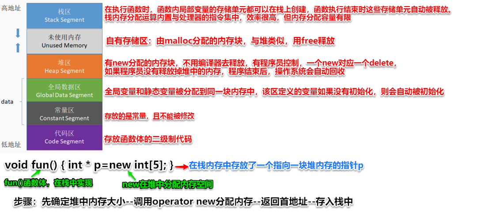
    
    **栈**：在执行函数时，函数内局部变量的存储单元都可以在栈上创建，函数执行结束时这些存储单元自动被释放。栈内存分配运算内置于处理器的指令集中，效率很高，但是分配的内存容量有限
    
    **堆**：就是那些由 `new`分配的内存块，他们的释放编译器不去管，由我们的应用程序去控制，一般一个`new`就要对应一个 `delete`。如果程序员没有释放掉，那么在程序结束后，操作系统会自动回收
    
    **自由存储区**：如果说堆是操作系统维护的一块内存，那么自由存储区就是C++中通过new和delete动态分配和释放对象的抽象概念。需要注意的是，自由存储区和堆比较像，但不等价。
    
    **全局/静态存储区**：全局变量和静态变量被分配到同一块内存中，在以前的C语言中，全局变量和静态变量又分为初始化的和未初始化的，在C++里面没有这个区分了，它们共同占用同一块内存区，在该区定义的变量若没有初始化，则会被自动初始化，例如int型变量自动初始为0
    
    **常量存储区**：这是一块比较特殊的存储区，这里面存放的是常量，不允许修改
    
    **代码区**：存放函数体的二进制代码
    
-   7、进程间通信方式、socket能不能进行本地通信
    
    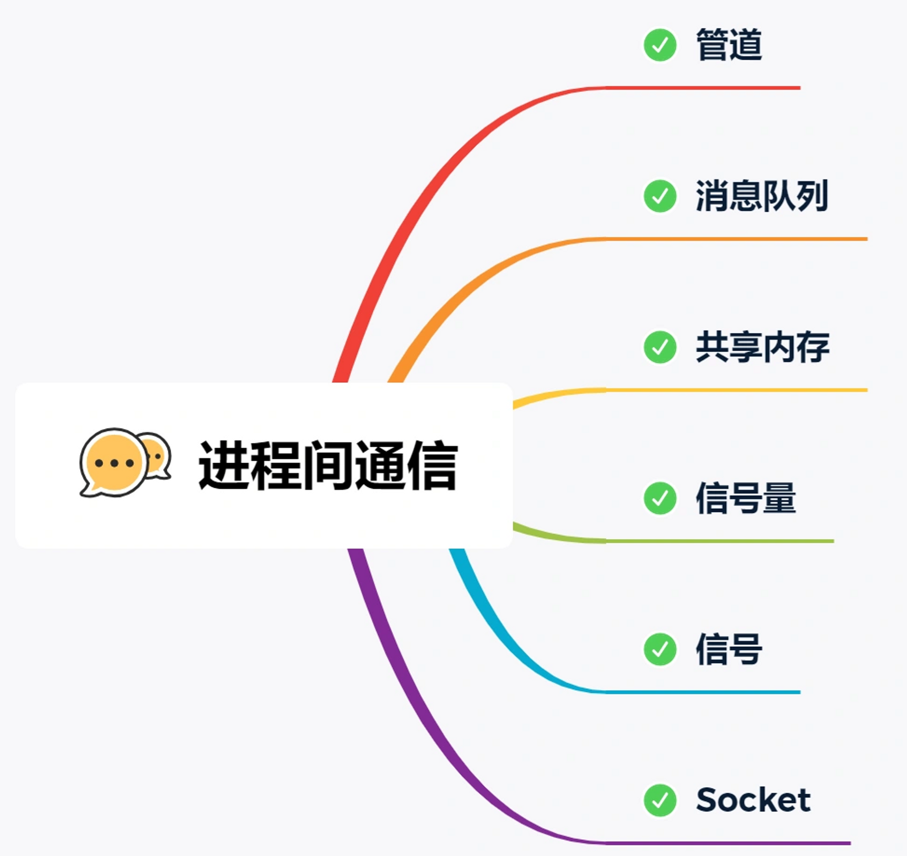
    
    前面提到的管道、消息队列、共享内存、信号量和信号都是在同一台主机上进行进程间通信，那要想**跨网络与不同主机上的进程之间通信，就需要 Socket 通信了。**
    
    实际上，Socket 通信不仅可以跨网络与不同主机的进程间通信，还可以在同主机上进程间通信。
    
-   8、list、queue、vector时间复杂度，空间复杂
    
    [](https://blog.csdn.net/like_that/article/details/98446479)[https://blog.csdn.net/like_that/article/details/98446479](https://blog.csdn.net/like_that/article/details/98446479)
    
-   9、C++常用特性
    
    -   nullptr替代 NULL
    -   引入了 auto 和 decltype 这两个关键字实现了类型推导
    -   基于范围的 for 循环for(auto& i : res){}
    -   类和结构体的中初始化列表（可以不使用=号）
-   智能指针
    
    C++STL共提供了四个智能指针: auto_ptr, unique_ptr,shared_ptr, weak_ptr 其中C++11只支持后三个，C++98支持所有四个
    
    使用普通指针，容易造成堆内存泄露（忘记释放），二次释放，程序发生异常时内存泄露等问题等，使用智能指针能更好的管理堆内存。 shared_ptr使用引用计数，每一个shared_ptr的拷贝都指向相同的内存。每使用他一次，内部的引用计数加1，每析构一次，内部的引用计数减1，减为0时，自动删除所指向的堆内存。
    
    **weak_ptr是用来解决shared_ptr相互引用时的死锁问题** ,如果说两个shared_ptr相互引用,那么这两个指针的引用计数永远不可能下降为0,资源永远不会释放；
    
-   10、C++定义空类，编译器会自动补全哪些函数
    
    ```cpp
    1)  Empty(); // 缺省构造函数//
    2)  Empty( const Empty& ); // 拷贝构造函数//
    3)  ~Empty(); // 析构函数//
    4)  Empty& operator=( const Empty& ); // 赋值运算符//
    ```
    
-   11、虚拟内存
    
    **操作系统会提供一种机制，将不同进程的虚拟地址和不同内存的物理地址映射起来。**
    
    -   我们程序所使用的内存地址叫做**虚拟内存地址**（_Virtual Memory Address_）
    -   实际存在硬件里面的空间地址叫**物理内存地址**（_Physical Memory Address_）。
-   堆和栈的区别
    
    <aside> 💡 **特点：** 堆，队列优先，先进先出 栈，先进后出
    
    **1、堆栈空间分配** 　　**栈**（操作系统）：由**操作系统自动分配释放** ，存放函数的参数值，**局部变量的值**等。其操作方式类似于数据结构中的栈。 　　**堆**（操作系统）： 一般由程序员分配释放， 若程序员不释放，程序结束时可能由OS回收，分配方式倒是类似于链表 **2、堆栈缓存方式** 　　栈使用的是**一级缓存**， 他们通常都是被调用时处于存储空间中，调用完毕立即释放。 　　堆则是存放在**二级缓存**中，生命周期由虚拟机的垃圾回收算法来决定（并不是一旦成为孤儿对象就能被回收）。所以调用这些对象的**速度要相对来得低**一些。 **3、堆栈数据结构区别**
    
    ```
          栈（数据结构）：一种先进后出的**数据结构**。
    ```
    
    堆（数据结构）：堆可以被看成是**一棵树**，如：堆排序。
    
    </aside>
    
-   虚函数、纯虚函数
    
    虚函数是为了实现动态编联产生的，目的是通过基类类型的指针指向不同对象时，自动调用相应的、和基类同名的函数 纯虚函数只是相当于一个接口名，但含有纯虚函数的类不能够实例化，纯虚函数首先是虚函数，其次它没有函数体，取而代之的是用“=0”。
    
-   C++和python的区别
	    ||python|C++|
	    |-|-|-|
	    ||脚本语言，解释执行|编译语言|
	    ||跨平台，效率较低|一般不能跨平台，因为不同|
	    |格式|缩进|括号，分号|
	    |变量|不需要事先定义，有数字、布尔值、字符串、列表、元组|需要事先定义|
	    |库|不需要事先定义，有数字、布尔值、字符串、列表、元组|比较少|
    C++和c的区别
	    ||c|C++|
	    |-|-|-|
	    ||面向过程|面向对象|
	    ||struct|增加类|
	    |||引用|
	    ||在函数开头部分|允许变量定义语句在程序中的任何地方|
	    |||字符数组|字符串|
	    |||关键字using、namespace|
    
-   指针和引用的区别
    
    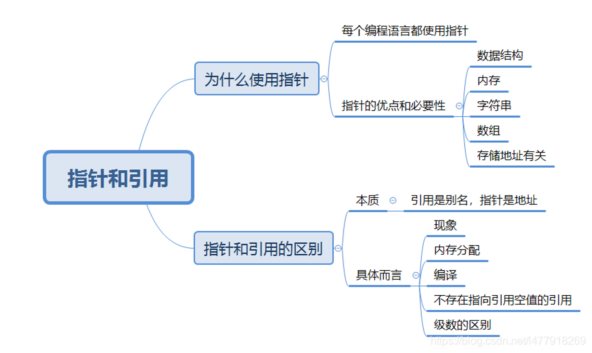
-   一、线程和进程区别
    
    1、进程是资源分配的基本单位，线程是任务调度执行的基本单位。 2、进程之间的资源是独立的，线程之间的资源则是共享的。 3、进程的创建/销毁/调度开销大，线程的创建/销毁/调度开销相对少很多。 4、进程的上下文切换速度比较慢，而线程的上下文切换速度比较快。 5、多个进程同时执行时，如果一个进程崩溃，一般不会影响其他进程，而同一进程内的多个线程之间，如果一个线程崩溃，很可能使得整个进程崩溃。
    
-   二、多态
    
    在基类的函数前加上virtual关键字，在派生类中重写该函数，运行时将会根据所指对象的实际类型来调用相应的函数，如果对象类型是派生类，就调用派生类的函数，如果对象类型是基类，就调用基类的函数。
    
-   三、内存泄漏
    
    内存泄漏(memory leak)是指由于疏忽或错误造成了程序未能释放掉不再使⽤的内存的情况。内存泄漏并⾮指内存在物理上的消失，⽽是应⽤程序分配某段内存后，由于设计错误，失去了对该段内存的控制，因⽽造成了内存的浪费。 如何避免？将内存的分配封装在类中，构造函数分配内存，析构函数释放内存；使⽤智能指针。
    
-   四、 static关键字
    
    类外： 1、隐藏，只能在当前文件使用，不能被其他文件使用 2、默认为0 3、在函数内定义，始终存在，返回后不清空 类内： 静态成员函数和静态成员变量属于类，不属于类的实体，这样可以被多个对象所共享 1、静态成员变量，类内定义，类外初始化 2、静态成员变量，类外不能访问 3、静态成员函数，没有this，只能访问静态变量和静态函数 4、非静态成员函数可以任意访问

-   1、线程进程区别：
    
    <aside> 💡 1.进程：进程是操作系统中**资源分配**的基本单位,可以看成是程序的一次运行。 2.线程：线程是操作系统中**调度执行**的基本单位。一个线程是一个“执行流”，每个线程之间都可以按照**顺序执行自己的代码**，多个线程**“同时”执行多份代码**。
    
    区别和联系： 1.一个进程可以**包含多个线程**，**线程**在进程的内部。 2.进程之间的**资源是独立**的，线程之间的**资源则是共享**的。 3.每个进程都有**独立的虚拟[地址空间](https://so.csdn.net/so/search?q=%E5%9C%B0%E5%9D%80%E7%A9%BA%E9%97%B4&spm=1001.2101.3001.7020)**，也有之间独立的文件描述符表，同一**进程的多个线程**之间则共用这一份虚拟地址空间和文件描述符表。 4.进程是**资源分配的基本单位**，线程是**操调度执行的基本单位**。 5.**多个进程同时执行时**，**如果一个进程崩溃，一般不会影响其他进程**，而**同一进程内的多个线程之间，如果一个线程崩溃**，很可能使得整个进程崩溃。
    
    6.进程的**上下文切换速度比较慢**，而**线程的上下文切换速度比较快**。
    
    7.进程的**创建/销毁/调度开销大**，**线程的创建/销毁/调度开销相对少**很多。
    
    </aside>
    
-   2、堆和栈的区别：
    
    <aside> 💡 **特点：** 堆是队列优先，先进先出 栈，先进后出
    
    **1、堆栈空间分配** 　　**栈**（操作系统）：由**操作系统自动分配释放** ，存放函数的参数值，**局部变量的值**等。其操作方式类似于数据结构中的栈。 　　**堆**（操作系统）： 一般由程序员分配释放， 若程序员不释放，程序结束时可能由OS回收，分配方式倒是类似于链表 **2、堆栈缓存方式** 　　栈使用的是**一级缓存**， 他们通常都是被调用时处于存储空间中，调用完毕立即释放。 　　堆则是存放在**二级缓存**中，生命周期由虚拟机的垃圾回收算法来决定（并不是一旦成为孤儿对象就能被回收）。所以调用这些对象的**速度要相对来得低**一些。 **3、堆栈数据结构区别**
    
    ```
          栈（数据结构）：一种先进后出的**数据结构**。
    ```
    
    堆（数据结构）：堆可以被看成是**一棵树**，如：堆排序。
    
    </aside>
    
-   3、也是堆和栈
    
    <aside> 🪁
    
    **管理方式不同：**
    
    对于栈来讲，是由编译器自动管理，无需我们手工控制； 对于堆来说，释放工作由程序员控制，容易产生memory leak。 空间大小不同：
    
    一般来讲在32位系统下，堆内存可以达到4G的空间，从这个角度来看堆内存几乎是没有什么限制的。 对于栈来讲，一般都是有一定的空间大小的。默认的栈空间大小是1M了。不过可以修改其大小。
    
    **能否产生碎片不同：**
    
    对于堆来讲，频繁的new/delete势必会造成内存空间的不连续，从而造成大量的碎片，使程序效率降低。 对于栈来讲，则不会存在这个问题，因为栈是先进后出的队列，他们是如此的一一对应，以至于永远都不可能有一个内存块从栈中间弹出，在他弹出之前，在他上面的后进的栈内容已经被弹出。
    
    **生长方向不同：**
    
    对于堆来讲，生长方向是向上的，也就是向着内存地址增加的方向； 对于栈来讲，它的生长方向是向下的，是向着内存地址减小的方向增长。
    
    **分配方式不同：**
    
    堆都是动态分配的，没有静态分配的堆。 栈有2种分配方式：静态分配和动态分配。静态分配是编译器完成的，比如局部变量的分配。动态分配由allocal 函数进行分配，但是栈的动态分配和堆是不同的，他的动态分配是由编译器进行释放，无需我们手工实现。
    
    **分配效率不同：**
    
    栈是机器系统提供的数据结构，计算机会在底层对栈提供支持：分配专门的寄存器存放栈的地址，压栈出栈都有专门的指令执行，这就决定了栈的效率比较高。 堆则是C/C++函数库提供的，它的机制是很复杂的，例如为了分配一块内存，库函数会按照一定的算法（具体的算法可以参考数据结构/操作系统）在堆内存中搜索可用的足够大小的空间，如果没有足够大小的空间（可能是由于内存碎片太多），就有可能调用系统功能去增加程序数据段的内存空间，这样就有机会分到足够大小的内存，然后进行返回。显然，堆的效率比栈要低得多。
    
    </aside>
    
-   4、声明、定义、初始化
    
    **声明**：告诉编译器该变量存在，不分配内存空间，可以多次声明
    
    ```cpp
    /*extern关键字声明，不分配存储空间，一般位于多文件中工程中，声明在.h文件*/
    extern int a;
    ```
    
    **定义**：只能定义一次，创建了一个类型对象，为类型对象分配内存空间。
    
    ```cpp
    /*定义  分配存储空间   在单个文件中没有声明和定义的区分，声明就是定义，统称为定义，多文件中将声明和定义区别*/
    int a;
    ```
    
    **初始化**：在定义变量以后，系统为变量分配的空间内存储的值是不确定的，所以需要对这个空间进行初始化，以确保程序的安全性和确定性，给变量赋默认值。
    
    ```cpp
    /*声明+定义+初始化，通常直接叫做初始化。分配存储空间*/
    int a=1;
    ```
    
    在类或者结构体中变量的声明、定义、初始化和赋值：
    
    <aside> 🪁 在类中**定义和初始化**统称为初始化（分配空间）；
    
    类或者结构体只是一个模板（Template），**编译后不占用内存空间**，书写好类模版实际上只是声明该类（包含类成员变量和函数的声明），不占用存储空间。只有在**创建对象以后才会给成员变量分配内存**，这个时候就可以赋值了。
    
    类的成员变量和普通变量一样，也有数据类型和名称，占用固定长度的内存。但是，在**定义类模版**的时候**不能对成员变量分配空间初始化或者赋值**，因为类只是一种数据类型或者说是一种模板，本身不占用内存空间，而**变量的值**则需要内存来存储。
    
    </aside>
    
    c++规定**类的静态成员变量在类中声明，类外初始化（分配空间赋值）**；**静态成员是单独存储的，并不是对象的组成部分**
    
    ```cpp
    #include <iostream>
    #include<vector>
    using namespace std;
    
    class A
    {
    public:
         static int n; //声明
         A(){
             n =2;//构造函数第二段 计算赋值
         }
        
    };
    int A::n= 1; //初始化（分配存储空间）
    int main(){
            A a;
            cout<< a.n<<endl;
            return 0;
    }
    
    //以下会报错
    #include <iostream>
    #include<vector>
    using namespace std;
    
    class A
    {
    public:
        static int n;
    		//static int n=1;//也不可以，反正静态是不能在里面进行初始化的
         A(){
             n = 2;
         }
    };
    int main(){
            A a;
            cout<< a.n<<endl;
            return 0;
    }
    ```
    
    **C++类中const静态成员变量可以直接初始化**
    
    ```cpp
    #include <iostream>
    #include<vector>
    using namespace std;
    
    class A
    {
    public:
         static const int m;
         A(){
         }
    
    };
    const int A::m= 1;
    int main(){
            A a;
            cout<< a.m<<endl;
            return 0;
    }
    
    //或者直接类中初始化写,都是可以的
    #include <iostream>
    #include<vector>
    using namespace std;
    
    class A
    {
    public:
        static const int m = 2;
         A(){
         }
        
    };
    int main(){
            A a;
            cout<< a.m<<endl;
            return 0;
    }
    ```
    
-   5、****define、const、typedef、inline的使用方法？他们之间有什么区别？****
| 符号 | const | #define | typedef | inline |
| --- | --- | --- | --- | --- |
| 定义 | 定义常量 | 定义常量、变量、编译开关等 | 定义类型的别名 | 定义函数 |
| 是否是关键字 | 是 | 否 | 否 | 否 |
| 是否是函数 | 否 | 否 | 否 | 是 |
| 带类型/不带类型 | 带类型 | 不带类型 | 带类型 | 带类型 |
| 执行时间 | 运行时 | 预处理阶段 | 编译阶段 | 运行时 |
| 阶段 | 编译、链接阶段 | 编译阶段 | 预处理阶段 | 编译阶段 |
| 类型检查 | 有类型检查 | 无类型检查 | 有类型检查 | 有类型检查 |
| 替换方式 | 无类型替换 | 文本替换 | 无类型替换 | 无类型替换 |
| 占用空间 | 占用数据段空间 | 预处理后占用代码空间 | 占用数据段空间 | 占用代码段空间 |
| 功能 | 定义常量 | 定义常量、变量、编译开关等 | 定义类型的别名，与struct的结合使用 | 定义函数 |
| 作用域 | 有自己的作用域 | 没有作用域的限制，只要是之前预定义过的宏，在以后的程序中都可以使用 | 有自己的作用域 | 有自己的作用域 |

    
-   6、****strcpy、sprintf与memcpy使用****
    
    ```cpp
    #include "../bits/stdc++.h"
    
    using namespace std;
    
    int main()
    {
        char dst[1024] = {0};
        string str="world";
        //sizeof() 可以以类型、指针、数组和函数等作为参数，
        //其值在编译时计算，用于获取操作数所占空间的字节数大小。
        // sizeof求得的结果是存储该字符串的变量占用的空间大小，
        // 因而一定会包括’\\0’.若’\\0’后还有空余的空间，也会包含到结果里面
        cout<<"sizeof(str):"<<sizeof(str)<<"获取的是字符指针大小"<<endl;
        // size()函数以及length()函数都用于计算字符串（string）长度，
        // 不能用char*作为参数。除此之外，size()函数还可以获取vector类型的长度。
        cout<<"str.size():"<<str.size()<<endl;
        cout<<"str.length():"<<str.length()<<endl;  
        // strlen()函数其参数只能为char*（字符型指针），
        // 所以在计算字符数组（char str[ ])时，一般用strlen()函数
        cout<<"strlen(dst):"<<strlen(dst)<<endl;
        
         cout<<str<<endl;
         sprintf(dst, "hello%s", str); 
        //strlen函数求得的字符串长度是从字符串第一个元素到第一个’\\0’之间元素的个数
         printf("%s size:%d\\n", dst,strlen(dst));
    
         //可以看出，sprintf()只能传入字符数组或者字符串，不能传入string 串名
         char *str2="world";
         sprintf(dst, "hello %s\\n", str2); 
        //strlen函数求得的字符串长度是从字符串第一个元素到第一个’\\0’之间元素的个数
         printf("%ssize:%d\\n", dst,strlen(dst));
    
        // char *strcpy(char *dest , const char *src);
         strcpy(dst,str2);
         cout<<dst<<endl;
    
        //  void *memcpy(void *destin , void *source , unsigned n);
        memcpy(dst,str2,strlen(str2));
        cout<<dst<<endl;
    
    }
    ```
    
-   7、auto、decltype
    
    **auto 让编译器通过初始值来进行类型推演。从而获得定义变量的类型，auto 定义的变量必须有初始值。**
    
    **择并返回操作数的数据类型。在此过程中，编译器只是分析表达式并得到它的类型，却不进行实际的计算表达式的值。**
    
    ```cpp
    //普通；类型
    int a = 1, b = 3;
    auto c = a + b;// c为int型
    
    //普通类型
    decltype(func()) sum = 5; // sum的类型是函数func()的返回值的类型int, 但是这时不会实际调用函数func()
    int a = 0;
    decltype(a) b = 4; // a的类型是int, 所以b的类型也是int
    ```
    
-   8、lambda表达式
    
    `[捕获列表] (函数参数) **mutable** 或 exception 声明 **->** 返回值类型 {函数体}`
    
    ```cpp
    auto plus = [] (int x, int x) -> int { return x + y; }
    int sum = plus(1, 2);
    
    #include "iostream"
    
     using namespace std;
        class Test{
        public:
            void hello(){
                cout << "test hello!\\n";
            };
            void lambda(){
                auto fun = [this]{ // 捕获了 this 指针
                this->hello(); 
                }; // 这里 this 调用的就是 class Test 的对象了
                fun();
            }
        };
    
     int main(){
            // 定义一个简单的lambda表达式
            auto basicLamda = [] {cout << "hello world!" << endl; };
            basicLamda();  // 调用
            // 如果需要参数，那么就要像函数那样，放在圆括号里面，如果有返回值，返回类型要放在->后面，即拖尾返回类型
            // 当然你也可以忽略返回类型，lambda会帮你自动推断出返回类型
            auto add = [](int a, int b) -> int {return a + b; };
            int result = add(4, 5);
            cout << "result = " << result << endl;
            // 自动推断出返回类型
            auto multiply = [](int a, int b) {return a * b; };
            int result1 = multiply(5, 6);
            cout << "result1 = " << result1 << endl;
            // 1、什么也不捕获，或者是故意不用 Lambda 函数外部的变量
            int  i = 1024;
            // auto f = []{cout << "i = " << i << endl; }; 报错!应该使用了lambda函数外部的变量
            auto f = [=] { cout << "i = " << i << endl; };  // 使用传值的方式使用外lambda函数外部的变量i
            f();  // 调用函数
            // 2、引用捕捉
            int i1 = 666;
            cout << "变量i1的引用: " << &i1 << endl;
            auto f1 = [&] { cout << "变量i1的引用: " << &i1 << endl; };
            f1();
            // 3、复制并引用捕获
            int i2 = 777, j2 = 888;
            cout << "i2 = " << i2 << endl;
            cout << "j2 = " << j2 << endl;
            auto f2 = [=, &i2] { cout << "i2 = " << &i2 << " ,j2 = " << &j2 << endl; };  // 默认拷贝外部所有变量，但引用变量i2
            f2();
            // 4、指定引用或复制
            int i3 = 444, j3 = 555;
            cout << "外部变量i3 = " << i3 << " i3的地址是: " << &i3 << endl;
            auto f3 = [i3] { cout << "内部变量i3 = " << i3 << " i3的地址是: " << &i3 << endl; };
            f3();
            // 5、捕获this指针
            Test t;
            t.lambda();
            return 0;
        }
    ```
    
-   9、**前向迭代器**、**双向迭代器**、**随机访问迭代器**
    
    **前向迭代器：**假设 p 是一个前向迭代器，则 p 支持 ++p，p++，*p 操作，还可以被复制或赋值，可以用 == 和 != 运算符进行比较。此外，两个正向迭代器可以互相赋值。
    
    **双向迭代器：**具有正向迭代器的全部功能，除此之外，假设 p 是一个双向迭代器，则还可以进行 --p 或者 p-- 操作（即一次向后移动一个位置）。
    
    
    
    **随机访问迭代器：随机访问迭代器具有双向迭代器的全部功能。除此之外，假设 p 是一个随机访问迭代器，也就是可以下标访问**
    
    
    
-   测试岗的要求
    
    -   [ ] 程序语言编译原理
    -   [ ] 操作系统底层原理
    -   [ ] 动态语言工作原理
    -   [ ] 性能和安全等测试
    -   [ ] 自动化系统的能力
    
    一、软件测试的定义：通过人工或自动化的方式来验证软件的实际结果与用户是否一致的过程
    
    二、软件测试流程：
    
    1）测试准备阶段：所有人一起参与需求分析
    
    2）测试计划阶段：测试经理编写测试计划，需要多长时间来完成
    
    3）测试设计阶段：寻找测试点、编写测试用例（用例评审）
    
    4）测试执行阶段：（开发提测后）冒烟测试 执行测试用例（提bug）（回归测试）
    
    5）测试完成阶段：编写测试报告 线上测试（回归测试）
    
    三、软件测试的分类
    
    1）按技术划分：
    
    
    
    黑盒测试（不用了解程序的源代码，通过使用整个软件功能来检验程序是否满意）
    
    白盒测试（是一种按照程序内部逻辑结构和编码结构设计测试数据并完成测试的测试方法）
    
    灰盒测试（一种基于程序运行时的外部表现同时又结合程序内部结构来设计测试数据的测试方法）
    
    单元测试（对一个模块、一个函数或者一个类来进行正确性来检验）
    
    集成测试（单元测试完成后，将单元测试的模块按照设计要求组装成为子系统或系统，作为整体进行测试）
    
    系统测试（集成测试后，将硬件、软件看作一个整体，对系统的功能及性能的总体测试）
    
    验收测试（系统测试后以用户测试为主，或有测试人员共同参与检验软件质量的测试方法）
    
    
    
    功能测试（根据产品操作描述和需求，测试一个产品的特性和操作行为是否满意用户的需求）
    
    
    
    性能测试（通过自动化测试工具模拟多种正常、峰值以及异常负载条件对系统的各项指标进行校验的测试方法）
    
    
    
    兼容性测试：检测设计的程序与硬件、软件之间的兼容性的测试方法
    
    
    
    冒烟测试：是验证系统的核心功能是否能够正常运行的测试方法
    
    随机测试：随机测试主要是根据测试者的经验无需测试用例对软件进行功能和性能抽查的测试方法 安全性测试：通过不同的测试方法，检验程序、网络、数据库安全性的测试方法 探索性测试：碰到问题时能随机应变，强调测试人员的主观能动性明确整体的测试计划的测试方法
    
    回归测试：是指修改了旧代码后，重新进行测试以确认修改没有引入新的错误或导致其他代码产生错误 的测试方法
    
    Alpha测试是测试人员在内部环境下的测试 Beta测试是一个或多个用户在生产环境下进行的测试
    
    
    
    四、软件开发模型
    
    1、瀑布模型
    
    
    
-   并行编程、CUDA加速、内核优先、linux操作系统-商汤