::: tip
STL Containers
:::
# STL Containers

[Containers library](https://en.cppreference.com/w/cpp/container)

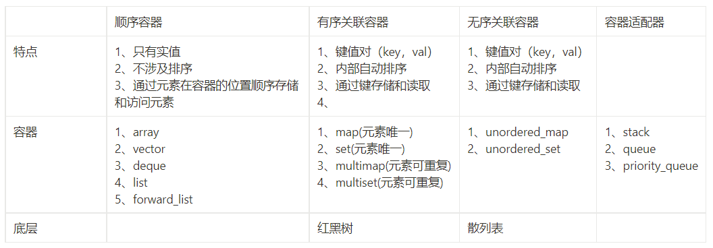

有Multi和没Multi的区别：元素是否可以重复

set类型和map类型的区别：

https://www.notion.so/STL-Containers-223a9a938dc142f9b2a710afc581d3c8?pvs=4#62accae658f94fbc9c95b63f1554be42

# **Ordered Associative Containers**


🪁 **C is the type of the comparison; A is the allocator type**


```cpp
map<K,V,C,A> //An ordered map from K to V; a sequence of (K,V) pairs
multimap<K,V,C,A> //An ordered map from K to V; duplicate keys allowed
set<K,C,A> //An ordered set of K
multiset<K,C,A> //An ordered set of K; duplicate keys allowed
```

# Unordered Associative Containers


🪁 **H is the hash function type; E is the equality test; A is the allocator type**


```cpp
unordered_map<K,V,H,E,A> //An unordered map from K to V
unordered_multimap<K,V,H,E,A> //An unordered map from K to V; duplicate keys allowed
unordered_set<K,H,E,A> //An unordered set of K
unordered_multiset<K,H,E,A> //An unordered set of K; duplicate keys allowed
```

# Container Adaptors


🪁 **C is the container type**


```cpp
priority_queue<T,C,Cmp> //Priority queue of Ts; Cmp is the priority function type
queue<T,C> //Queue of Ts with push() and pop()
stack<T,C> //Stack of Ts with push() and pop()
```

# Container Representation

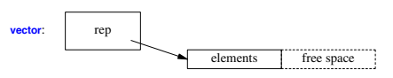

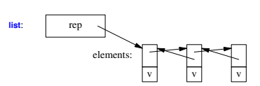

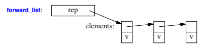

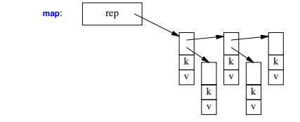

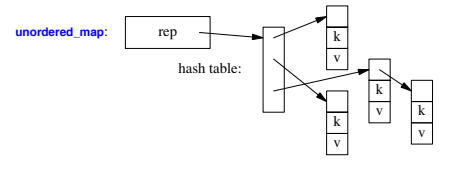

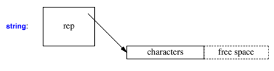

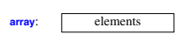

# Operations Overview

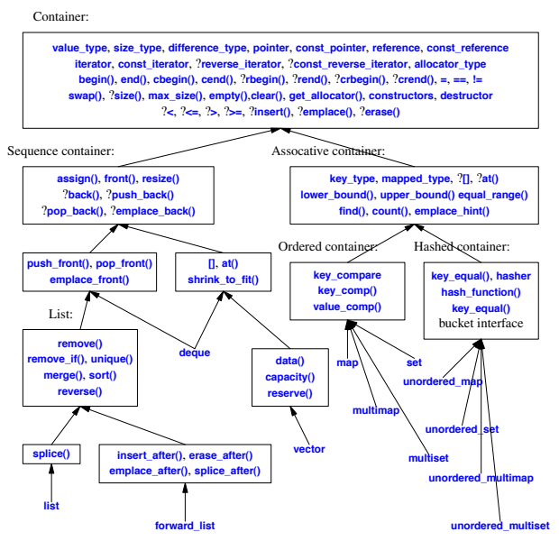

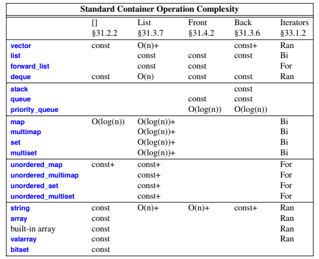

# Vector

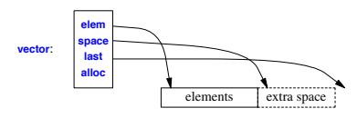

## example:

```cpp
vector<char> chars; // input "buffer" for characters
constexpr int max = 20000;
chars.reserve(max);
vector<char∗> words; // pointers to start of words
bool in_word = false;
for (char c; cin.get(c)) {
		if (isalpha(c)) {
				if (!in_word) { // found beginning of word
						in_word = true;
						chars.push_back(0); // end of previous word
						chars.push_back(c);
						words.push_back(&chars.back());
				}else
						chars.push_back(c);
		}else
				in_word = false;
}
	if (in_word)
	chars.push_back(0); // terminate last word
	if (max<chars.siz e()) { // oops: chars grew beyond capacity; the words are invalid
	// ...
	}
	chars.shrink_to_fit(); // release any sur plus capacity
```

## vector<vector\<double>>

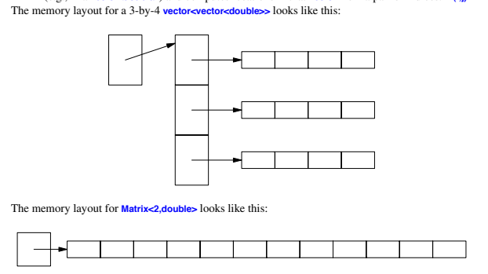

# list

## Operations for Both list< T > and forward_list< T >

```cpp
lst.push_front(x) //Add x to lst (using copy or move) before the first element
lst.pop_front() //Remove the first element from lst
lst.emplace_front(args) //Add T{args} to lst before the first element
lst.remove(v) //Remove all elements of lst with value v
lst.remove_if(f) //Remove all elements of lst for which f(x)==true
lst.unique() //Remove adjacent duplicate elements of lst
lst.unique(f) //Remove adjacent duplicate elements of lst using f for equality
lst.merge(lst2) //Merge the ordered lists lst and lst2 using < as the order;lst2 is merged into lst and emptied in the process
lst.merge(lst2,f) //Merge the ordered lists lst and lst2 using f as the order;lst2 is merged into lst and emptied in the process
lst.sort() //Sort lst using < as the order
lst.sort(f) //Sort lst using f as the order
lst.reverse() //Reverse the order of the elements of lst; noexcept

		void use()
		{
		list<int> lst {2,3,2,3,5};
		lst.remove(3); // lst is now {2,2,5}
		lst.unique(); // lst is now {2,5}
		cout << lst.size() << '\n'; // writes 2
		}

```

## Operations for list< T >

```cpp
lst.splice(p,lst2) //Insert the elements of lst2 before p; lst2 becomes empty
lst.splice(p,lst2,p2) //Insert the element pointed to by p2 in lst2 before p;the element pointed to by p2 is removed from lst2
lst.splice(p,lst2,b,e) //Insert the elements [b:e) from lst2 before p;the elements [b:e) are removed from lst2

		list<int> lst1 {1,2,3};
		list<int> lst2 {5,6,7};
		auto p = lst1.begin();
		++p; // p points to 2
		auto q = lst2.begin();
		++q; // q points to 6
		lst1.splice(p,lst2); // lst1 is now {1,5,6,7,2,3}; lst2 is now {}
		// p still points to 2 and q still points to 6

```

## Operations for forward_list< T >

```cpp
p2=lst.emplace_after(p,args) //Emplace element constructed from args after p;p2 points to the new element
p2=lst.insert_after(p,x) //Insert x after p; p2 points to the new element
p2=lst.insert_after(p,n,x) //Insert n copies of x after p;p2 points to the last new element
p2=lst.insert_after(p,b,e) //Insert [b:e) after p; p2 points to the last new element
p2=lst.insert_after(p,{elem}) //Insert {elem} after p;p2 points to the last new element; elem is an initializer_list
p2=lst.erase_after(p) //Erase the element after p;p2 points to the element after p or lst.end()
p2=lst.erase_after(b,e) //Erase [b:e); p2=e
lst.splice_after(p,lst2) //Splice in lst2 after p
lst.splice_after(p,b,e) //Splice in [b:e) after p
lst.splice_after(p,lst2,p2) //Splice in p2 after p; remove p2 from lst2
lst.splice_after(p,lst2,b,e) //Splice in [b:e) after p; remove [b:e) from lst2
```

## Ordered Associative Containers

```cpp
map m {cmp,a}; //Construct m to use comparator cmp and allocator a; explicit
map m {cmp}; //map m {cmp, A{}}; explicit
map m {}; //map m {C{}}; explicit
map m {b,e,cmp,a}; //Construct m to use comparator cmp and allocator a;initialize with the elements from [b:e)
map m {b,e,cmp}; //map m {b,e ,cmp, A{}};
map m {b,e}; //map m {b,e,C{}};
map m {m2}; //Copy and move constructors
map m {a}; //Construct default map; use allocator a; explicit
map m {m2,a}; //Copy or move construct m from m2; use allocator a
map m {{elem},cmp,a}; //Construct m to use comparator cmp and allocator a;initialize with the elements from initializer_list {elem}
map m {{elem},cmp}; //map m {{elem},cmp,A{}};
map m {{elem}}; //map m {{elem},C{}};

		map<string,pair<Coordinate ,Coordinate>> locations
		{
		{"Copenhagen",{"55:40N","12:34E"}},
		{"Rome",{"41:54N","12:30E"}},
		{"New York",{"40:40N","73:56W"}
		};

```

**Associative Container Operations**

```cpp
v=c[k] //v is a reference to the element with key k;if k is not found, {k,mapped_type{}} is inserted into c;only for map and unordered_map
v=c.at(k) //v is a reference to the element with key k;if k is not found, an out_of_range is thrown;only for map and unordered_map
```

**Associative Container Operations (continued)**

```cpp
p=c.find(k) //p points to the first element with key k or c.end()
p=c.lower_bound(k) //p points to the first element with key >=k or c.end();ordered containers only
p=c.upper_bound(k) //p points to the first element with key >k or c.end();ordered containers only
pair(p1,p2)=c.equal_range(k) //p1=c.lower_bound(k); p2=c.upper_bound(k)
pair(p,b)=c.insert(x) //x is a value_type or something that can be copiedinto a value_type (e.g., a two-element tuple);b is true if x was inserted and falseif there already was an entry with x’s key;p points to the (possibly new) element with x’s key
p2=c.insert(p,x) //x is a value_type or something that can be copiedinto a value_type (e.g., a two-element tuple);p is a hint of where to start looking for an elementwith x’s key;p2 points to the (possibly new) element with x’s key
c.insert(b,e) //c.inser t(∗p) for every p in [b:e)
c.insert({args}) //Insert each element of the initializer_list args;an element is of type pair<key_type ,mapped_type>
p=c.emplace(args) //p points to an object of c’s value_type constructedfrom args and inserted into c
p=c.emplace_hint(h,args) //p points to an object of c’s value_type constructedfrom args and inserted into c;h is an iterator into c, possibly used as a hint ofwhere to start to search for a place for the new entry
r=c.key_comp() //r is a copy of the key comparison object;ordered containers only
r=c.value_comp() //r is a copy of the value comparison object;ordered containers only
n=c.count(k) //n is the number of elements with key k
```

**If a key, k, is not found by a subscript operation, m[k], a default value is inserted. For example:**

```cpp
map<string,string> dictionary;
dictionary["sea"]="large body of water"; // inser t or assign to element
cout << dictionary["seal"]; // read value
```

**If that is not the desired behavior, we can use find() and insert() directly:**

```cpp
auto q = dictionary.find("seal"); // lookup; don’t insert
if (q==dictionary.end()) {
cout << "entry not found";
dictionary.inser t(make_pair("seal","eats fish"));
}
else
cout qï>second;
```

**The insert(make_pair()) notation is rather verbose. Instead, we could use emplace():**

```cpp
dictionary.emplace("sea cow","extinct");
```


🪁 You can print the value of all elements with the key "apple" in a multimap< string, int> like this:


```cpp

multimap<string,int> mm {{"apple",2}, { "pear",2}, {"apple",7}, {"orange",2}, {"apple",9}};
const string k {"apple"};
auto pp = mm.equal_range(k);
if (pp.first==pp.second)
cout << "no element with value '" << k << "'\n";
else {
cout << "elements with value '" << k << "':\n";
for (auto p=pp.first; p!=pp.second; ++p)
cout << pï>second << ' ';
}
//This prints 279
```

# Unordered Associative Containers


🪁 **The unordered associative containers (unordered_map, unordered_set, unordered_multimap,unordered_multiset) are hash tables**


```cpp
unordered_map<string,int> score1 {
{"andy", 7}, {"al",9}, {"bill",ï3}, {"barbara",12}
};
map<string,int> score2 {
{"andy", 7}, {"al",9}, {"bill",ï3}, {"barbara",12}
};
template<typename X, typename Y>
ostream& operator<<(ostream& os, pair<X,Y>& p)
{
return os << '{' << p.first << ',' << p.second << '}';
}
void user()
{
	cout <<"unordered: ";
	for (const auto& x : score1)
	cout << x << ", ";
	cout << "\nordered: ";
	for (const auto& x : score2)
	cout << x << ", ";
}
```

The visible difference is that iteration through a map is ordered and for an unordered_map it is not:

```cpp
unordered: {andy,7}, {al,9}, {bill,ï3}, {barbara,12},
ordered: {al,9}, {andy, 7}, {barbara,12}, {bill,ï3},
```

# stack

```cpp
void f()
{
stack<int> s;
s.push(2);
if (s.empty()) { // underflow is preventable
// don’t pop
}
else { // but not impossible
s.pop(); // fine: s.size() becomes 0
s.pop(); // undefined effect, probably bad
}
}
```

# queue

```cpp
void server(queue<Message>& q, mutex& m){
while (!q.empty()) {
		Message mess;
		{ lock_guard<mutex> lck(m); // lock while extracting message
			if (q.empty()) return; // somebody else got the message
			mess = q.front();
			q.pop();
		}
		// ser ve request
	}
}
```

# priority_queue

```cpp
	struct Message {
	int priority;
	bool operator<(const Message& x) const { return priority < x.priority; }
	// ...
	};
	void server(priority_queue<Message>& q, mutex& m)
	{
	while (!q.empty()) {
	Message mess;
	{ lock_guard<mutex> lck(m); // hold lock while extracting message
	if (q.empty()) return; // somebody else got the message
	mess = q.top();
	q.pop();
	}
	// ser ve highest prior ity request
	}
	}
```