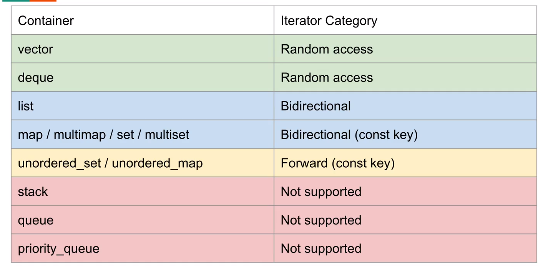
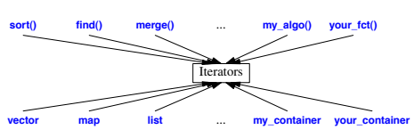
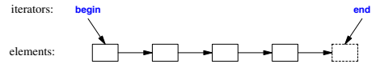
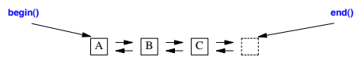
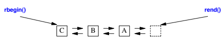

::: tip
STL Iterators
:::
# STL Iterators

# 迭代器定义

**迭代器（iterator）是一种可以遍历容器元素的数据类型。迭代器是一个变量，相当于容器和操纵容器的算法之间的中介。**C++更趋向于使用迭代器而不是数组下标操作，因为标准库为每一种标准容器（如vector、map和list等）定义了一种迭代器类型，而只有少数容器（如vector）支持数组下标操作访问容器元素。可以通过迭代器指向你想访问容器的元素地址，通过*x打印出元素值。

# 举例

```cpp
sort(vector.begin(),vector.end());
for( int i=0; i<vector.size(); i++ )
	cout<<"sort_result: "<<vector[i]<<endl;

cout<<"头部元素为："<<vector.front()<<endl;//头部元素
cout<<"尾部元素为："<<vector.back()<<endl;//尾部元素
cout<<"容器尺寸大小为："<<vector.size()<<endl;//容器尺寸大小

vector.front()=11;//修改容器头部元素值
vector.back()= 15;//修改容器尾部元素值

cout<<"修改后头部元素为："<<vector.front()<<endl;//头部元素
vector.pop_back();//删除尾部元素

cout<<"修改+删除后尾部元素为："<<vector.back()<<endl;//尾部元素
vector.push_back(16);

for( int i=0; i<vector.size(); i++ )
	cout<<"用数组输出vector["<<i<<"]："<<vector[i]<<endl;

std::vector<int>::const_iterator it;
for( it = vector.begin(); it != vector.end(); it++ )
	cout<<"用迭代器输出："<<*it<<endl;

vector.insert(vector.begin(),100);//插入开始位置
for( int i=0; i<vector.size(); i++ )
	cout<<"insert_result:"<<vector[i]<<endl;
cout<<"头部元素为："<<vector.front()<<endl;

return 0;

```

****运行结果****

```cpp
sort_result: 1
sort_result: 5
sort_result: 9
头部元素为：1
尾部元素为：9
容器尺寸大小为：3
修改后头部元素为：11
修改+删除后尾部元素为：5
用数组输出vector[0]：11
用数组输出vector[1]：5
用数组输出vector[2]：16
用迭代器输出：11
用迭代器输出：5
用迭代器输出：16
insert_result:100
insert_result:11
insert_result:5
insert_result:16
头部元素为：100
```

****不同容器的迭代器（iterator）的功能****



# 基本模型





# Reverse Iterator



