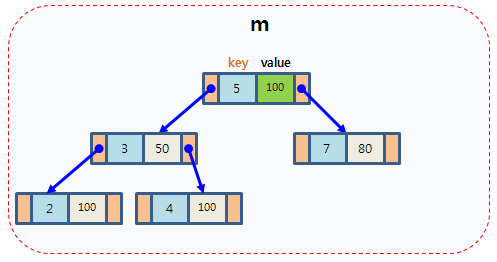
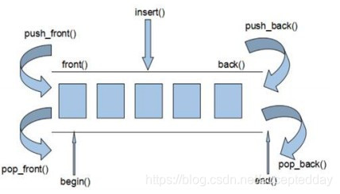
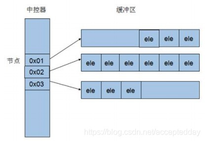
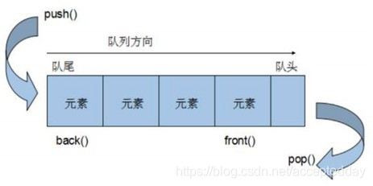
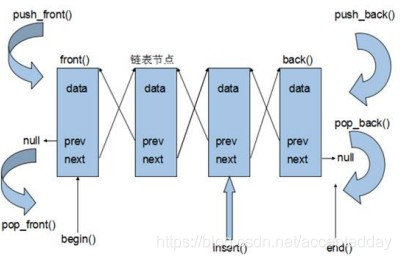

::: tips
容器应用知识
:::

# 容器应用知识

Created: September 2, 2022 1:12 PM

# 一、全能库

```cpp
#include<bits/stdc++.h>
```

理解重载运算符

[operato](https://so.csdn.net/so/search?q=operator&spm=1001.2101.3001.7020)r 是 C++ 的一个关键字，它和[运算符](https://so.csdn.net/so/search?q=%E8%BF%90%E7%AE%97%E7%AC%A6&spm=1001.2101.3001.7020)（如 =）一起使用，表示一个**运算符重载函数**
，在理解时可将 operator 和待重载的运算符整体（如 operator=）视为一个函数名。

```cpp
class A
{
private:
	int age;
public:
	A(int nAge)
	{
		this->age = nAge;
	}
	// 定义==函数，this表示==左边的变量，类
	bool operator==(const test6& ps)
	{
		if (this->age == ps.age)
		{
			return true;
		}
		return false;
	}
};

//使用
int main()
{
  A a1(10);
	A b1(10);
	//a1==b1,会调用A类中的相应函数
	if (a1 == b1) cout << "a1 is equal with b1." << endl;
  else cout << "a1 is not equal with b1." << endl;
}

```

# 二、容器的基本使用

[全局变量](http://www.so.com/s?q=%E5%85%A8%E5%B1%80%E5%8F%98%E9%87%8F&ie=utf-8&src=internal_wenda_recommend_textn)在没有赋值以前系统默认为0，而[局部变量](http://www.so.com/s?q=%E5%B1%80%E9%83%A8%E5%8F%98%E9%87%8F&ie=utf-8&src=internal_wenda_recommend_textn)在没有赋值以前的值是不确定的，所以在声明局部变量的时候一定要[初始化](http://www.so.com/s?q=%E5%88%9D%E5%A7%8B%E5%8C%96&ie=utf-8&src=internal_wenda_recommend_textn)。

## 2.1STL常用算法

### 2.1.1遍历算法

```cpp
//掌握常用的遍历算法的函数模型：
函数原型	功能	参数说明
for_each(iterator beg, iterator end, _func);	遍历算法，遍历容器元素。	beg 开始迭代器， end 结束迭代器， _func 函数或者函数对象
transform(iterator beg1, iterator end1, iterator beg2, _func);	搬运容器到另一个容器中。	beg1 源容器开始迭代器， end1 源容器结束迭代器， beg2 目标容器开始迭代器， _func 函数或者函数对象

#include <algorithm>
#include <vector>
//普通函数
void print01(int val) 
{
	cout << val << " ";
}
//函数对象
class print02 
{
 public:
	void operator()(int val) 
	{
		cout << val << " ";
	}
};

//for_each算法基本用法
void test01() {

	vector<int> v;
	for (int i = 0; i < 10; i++) 
	{
		v.push_back(i);
	}

	//遍历算法
	for_each(v.begin(), v.end(), print01);
	cout << endl;

	for_each(v.begin(), v.end(), print02());
	cout << endl;
}

//常用遍历算法  搬运 transform
class TransForm
{
public:
	int operator()(int val)
	{
		return val;
	}

};

class MyPrint
{
public:
	void operator()(int val)
	{
		cout << val << " ";
	}
};

void test01()
{
	vector<int>v;
	for (int i = 0; i < 10; i++)
	{
		v.push_back(i);
	}

	vector<int>vTarget; //目标容器

	vTarget.resize(v.size()); // 目标容器需要提前开辟空间

	transform(v.begin(), v.end(), vTarget.begin(), TransForm());

	for_each(vTarget.begin(), vTarget.end(), MyPrint());
}
```

### 2.1.2查找算法

- **函数模型**
    
    ```cpp
    函数模型	功能	参数说明
    find(iterator beg, iterator end, value);	按值查找元素，找到返回指定位置迭代器，找不到返回结束迭代器位置。	beg 开始迭代器， end 结束迭代器， value 查找的元素
    find_if(iterator beg, iterator end, _Pred);	按值查找元素，找到返回指定位置迭代器，找不到返回结束迭代器位置。	beg 开始迭代器， end 结束迭代器， value 查找的元素，_Pred 函数或者谓词（返回bool类型的仿函数）
    adjacent_find(iterator beg, iterator end);	查找相邻重复元素，返回相邻元素的第一个位置的迭代器。	beg 开始迭代器， end 结束迭代器
    bool binary_search(iterator beg, iterator end, value);	查找指定的元素，查到返回true，否则false。	beg 开始迭代器， end 结束迭代器， value 查找的元素
    count(iterator beg, iterator end, value);	统计元素个数。	beg 开始迭代器， end 结束迭代器， value 查找的元素
    count_if(iterator beg, iterator end, _Pred);	按条件统计元素个数。	beg 开始迭代器， end 结束迭代器，_Pred 函数或者谓词（返回bool类型的仿函数）
    ```
    
- **find(iterator beg, iterator end, value);**
    
    ```cpp
    #include<iostream>
    using namespace std;
    #include<vector>
    #include<algorithm>
    #include<string>
    
    //常用查找算法：find
    
    //1. 查找内置数据类型
    void test01()
    {
    	vector<int>v;
    	for (int i = 0; i < 10; i++)
    	{
    		v.push_back(i);
    	}
    
    	//查找容器中是否有5这个元素
    	vector<int>::iterator it = find(v.begin(), v.end(), 5);
    	if (it == v.end())
    	{
    		cout << "未找到等于5的元素！" << endl;
    	}
    	else
    	{
    		cout << "找到等于5的元素：" << *it << endl;
    	}
    }
    
    //2. 查找自定义数据类型（必须重载==）
    class Person
    {
    public:
    	Person(string name, int age)
    	{
    		this->m_Name = name;
    		this->m_Age = age;
    	}
    	//重载==使得底层find知道如何对比Person数据类型
    	bool operator==(const Person &p)
    	{
    		if (this->m_Name == p.m_Name&&this->m_Age == p.m_Age)
    		{
    			return true;
    		}
    		else
    		{
    			return false;
    		}
    	}
    
    	string m_Name;
    	int m_Age;
    };
    void test02()
    {
    	vector<Person>v;
    
    	//创建数据
    	Person p1("aaa", 10);
    	Person p2("bbb", 20);
    	Person p3("ccc", 30);
    	Person p4("ddd", 40);
    
    	//放到容器中
    	v.push_back(p1);
    	v.push_back(p2);
    	v.push_back(p3);
    	v.push_back(p4);
    
    	//查找容器中是否有p2这个人
    	vector<Person>::iterator it = find(v.begin(), v.end(), p2);
    	if (it == v.end())
    	{
    		cout << "未找到p2！" << endl;
    	}
    	else
    	{
    		cout << "找到p2！姓名：" << it->m_Name << "    年龄：" << it->m_Age << endl;
    	}
    }
    
    int main()
    {
    	test01();
    	test02();
    
    	system("pause");
    
    	return 0;
    }
    ```
    
- **bool binary_search(iterator beg, iterator end, value);**
    
    ```cpp
    #include<iostream>
    using namespace std;
    #include<vector>
    #include<algorithm>
    #include<string>
    
    //常用查找算法：binary_search
    
    void test01()
    {
    	vector<int>v;
    
    	for (int i = 0; i < 10; i++)
    	{
    		v.push_back(i);
    	}
    	//v.push_back(2);  //如果是无序序列，结果未知！
    
    	//查找容器中是否有9这个元素
    	bool ret = binary_search(v.begin(), v.end(),9);  //注意：binary_search使用时，容器必须是有序序列
    	if (ret)
    	{
    		cout << "找到等于9的元素！" << endl;
    	}
    	else
    	{
    		cout << "未找到等于9的元素！" << endl;
    	}
    }
    
    int main()
    {
    	test01();
    
    	system("pause");
    
    	return 0;
    }
    ```
    
- **count(iterator beg, iterator end, value);	统计元素个数。**
    
    ```cpp
    #include<iostream>
    using namespace std;
    #include<vector>
    #include<algorithm>
    #include<string>
    
    //常用查找算法：count
    
    //1. 统计内置数据类型
    
    void test01()
    {
    	vector<int>v;
    
    	v.push_back(10);
    	v.push_back(40);
    	v.push_back(30);
    	v.push_back(40);
    	v.push_back(20);
    	v.push_back(40);
    
    	int num = count(v.begin(), v.end(), 40);
    	cout << "40的元素个数为：" << num << endl;
    }
    
    //2. 统计自定义数据类型
    class Person
    {
    public:
    	Person(string name, int age)
    	{
    		this->m_Name = name;
    		this->m_Age = age;
    	}
    	bool operator==(const Person &p)
    	{
    		if (this->m_Age == p.m_Age)
    		{
    			return true;
    		}
    		else
    		{
    			return false;
    		}
    	}
    
    	string m_Name;
    	int m_Age;
    };
    
    void test02()
    {
    	vector<Person>v;
    
    	Person p1("刘备", 35);
    	Person p2("关羽", 35);
    	Person p3("张飞", 35);
    	Person p4("赵云", 30);
    	Person p5("曹操", 40);
    
    	v.push_back(p1);
    	v.push_back(p2);
    	v.push_back(p3);
    	v.push_back(p4);
    	v.push_back(p5);
    
    	Person p("诸葛亮", 35);
    
    	int num = count(v.begin(), v.end(), p);
    	
    	cout << "与诸葛亮同岁的人员个数为：" << num << endl;
    }
    
    int main()
    {
    	test01();
    	test02();
    
    	system("pause");
    
    	return 0;
    }
    ```
    

### **2.1.3排序算法**

- **函数原型**
    
    ```cpp
    函数原型	功能	参数说明
    sort(iterator beg, iterator end, _Pred);	对容器内元素进行排序。	beg 开始迭代器， end 结束迭代器， _Pred 函数或者谓词（返回bool类型的仿函数）
    random_shuffle(iterator beg, iterator end);	指定范围内的元素随机调整次序。	beg 开始迭代器， end 结束迭代器
    merge(iterator beg1, iterator end1, iterator beg2, iterator end2, iterator dest);	容器元素合并，并存储到另一容器中。	beg1 容器1开始迭代器， end1 容器1结束迭代器,beg2 容器2开始迭代器， end2 容器2结束迭代器, dest 目标容器开始迭代器
    reverse(iterator beg, iterator end);	反转指定范围的元素。	beg 开始迭代器， end 结束迭代器
    ```
    
- **sort(iterator beg, iterator end, _Pred);**
    
    ```cpp
    #include <algorithm>
    #include <vector>
    
    void myPrint(int val)
    {
    	cout << val << " ";
    }
    
    void test01() {
    	vector<int> v;
    	v.push_back(10);
    	v.push_back(30);
    	v.push_back(50);
    	v.push_back(20);
    	v.push_back(40);
    
    	//sort默认从小到大排序
    	sort(v.begin(), v.end());
    	for_each(v.begin(), v.end(), myPrint);
    	cout << endl;
    
    	//从大到小排序
    	sort(v.begin(), v.end(), greater<int>());
    	for_each(v.begin(), v.end(), myPrint);
    	cout << endl;
    }
    
    int main() {
    
    	test01();
    
    	system("pause");
    
    	return 0;
    }
    ```
    
- **reverse(iterator beg, iterator end);**
    
    ```cpp
    #include <algorithm>
    #include <vector>
    
    class myPrint
    {
    public:
    	void operator()(int val)
    	{
    		cout << val << " ";
    	}
    };
    
    void test01()
    {
    	vector<int> v;
    	v.push_back(10);
    	v.push_back(30);
    	v.push_back(50);
    	v.push_back(20);
    	v.push_back(40);
    
    	cout << "反转前： " << endl;
    	for_each(v.begin(), v.end(), myPrint());
    	cout << endl;
    
    	cout << "反转后： " << endl;
    
    	reverse(v.begin(), v.end());
    	for_each(v.begin(), v.end(), myPrint());
    	cout << endl;
    }
    
    int main() {
    
    	test01();
    
    	system("pause");
    
    	return 0;
    }
    ```
    

### 2.1.4****常用拷贝和替换算法****

- **函数模型**
    
    ```cpp
    函数模型	功能	参数说明
    copy(iterator beg, iterator end, iterator dest);	容器内指定范围的元素拷贝到另一容器中。	beg 容器开始迭代器， end 容器结束迭代器，dest 目标容器开始迭代器
    replace(iterator beg, iterator end, oldvalue, newvalue);	将区间内旧元素替换成新元素。	beg 开始迭代器， end 结束迭代器， oldvalue 旧的元素，newvalue 新的元素
    replace_if(iterator beg, iterator end, _pred, newvalue);	按条件替换元素，满足条件的替换成指定元素。	beg 开始迭代器， end 结束迭代器，_Pred 函数或者谓词（返回bool类型的仿函数），value 替换的新元素
    swap(container c1, container c2);	互换两个容器的元素。	c1 容器1，c2容器2
    ```
    
- **copy(iterator beg, iterator end, iterator dest);**
    
    ```cpp
    #include <algorithm>
    #include <vector>
    
    class myPrint
    {
    public:
    	void operator()(int val)
    	{
    		cout << val << " ";
    	}
    };
    
    void test01()
    {
    	vector<int> v1;
    	for (int i = 0; i < 10; i++) {
    		v1.push_back(i + 1);
    	}
    	vector<int> v2;
    	v2.resize(v1.size());
    	copy(v1.begin(), v1.end(), v2.begin());
    
    	for_each(v2.begin(), v2.end(), myPrint());
    	cout << endl;
    }
    
    int main() {
    
    	test01();
    
    	system("pause");
    
    	return 0;
    }
    ```
    
- **replace(iterator beg, iterator end, oldvalue, newvalue);**
    
    ```cpp
    #include <algorithm>
    #include <vector>
    
    class myPrint
    {
    public:
    	void operator()(int val)
    	{
    		cout << val << " ";
    	}
    };
    
    void test01()
    {
    	vector<int> v;
    	v.push_back(20);
    	v.push_back(30);
    	v.push_back(20);
    	v.push_back(40);
    	v.push_back(50);
    	v.push_back(10);
    	v.push_back(20);
    
    	cout << "替换前：" << endl;
    	for_each(v.begin(), v.end(), myPrint());
    	cout << endl;
    
    	//将容器中的20 替换成 2000
    	cout << "替换后：" << endl;
    	replace(v.begin(), v.end(), 20,2000);
    	for_each(v.begin(), v.end(), myPrint());
    	cout << endl;
    }
    
    int main() {
    
    	test01();
    
    	system("pause");
    
    	return 0;
    }
    ```
    
- **replace_if(iterator beg, iterator end, _pred, newvalue);**
    
    ```cpp
    #include <algorithm>
    #include <vector>
    
    class myPrint
    {
    public:
    	void operator()(int val)
    	{
    		cout << val << " ";
    	}
    };
    
    class ReplaceGreater30
    {
    public:
    	bool operator()(int val)
    	{
    		return val >= 30;
    	}
    
    };
    
    void test01()
    {
    	vector<int> v;
    	v.push_back(20);
    	v.push_back(30);
    	v.push_back(20);
    	v.push_back(40);
    	v.push_back(50);
    	v.push_back(10);
    	v.push_back(20);
    
    	cout << "替换前：" << endl;
    	for_each(v.begin(), v.end(), myPrint());
    	cout << endl;
    
    	//将容器中大于等于的30 替换成 3000
    	cout << "替换后：" << endl;
    	replace_if(v.begin(), v.end(), ReplaceGreater30(), 3000);
    	for_each(v.begin(), v.end(), myPrint());
    	cout << endl;
    }
    
    int main() {
    
    	test01();
    
    	system("pause");
    
    	return 0;
    }
    ```
    
- **swap(container c1, container c2);**
    
    ```cpp
    #include <algorithm>
    #include <vector>
    
    class myPrint
    {
    public:
    	void operator()(int val)
    	{
    		cout << val << " ";
    	}
    };
    
    void test01()
    {
    	vector<int> v1;
    	vector<int> v2;
    	for (int i = 0; i < 10; i++) {
    		v1.push_back(i);
    		v2.push_back(i+100);
    	}
    
    	cout << "交换前： " << endl;
    	for_each(v1.begin(), v1.end(), myPrint());
    	cout << endl;
    	for_each(v2.begin(), v2.end(), myPrint());
    	cout << endl;
    
    	cout << "交换后： " << endl;
    	swap(v1, v2);
    	for_each(v1.begin(), v1.end(), myPrint());
    	cout << endl;
    	for_each(v2.begin(), v2.end(), myPrint());
    	cout << endl;
    }
    
    int main() {
    
    	test01();
    
    	system("pause");
    
    	return 0;
    }
    ```
    

### 2.1.5常用算术生成算法

- **函数模型**
    
    ```cpp
    函数模型	功能	参数说明
    accumulate(iterator beg, iterator end, value);	计算容器元素累计总和。	beg 开始迭代器， end 结束迭代器， value 起始值
    fill(iterator beg, iterator end, value);	向容器中填充元素。	beg 开始迭代器， end 结束迭代器， value 填充的值
    ```
    
- **accumulate(iterator beg, iterator end, value);**
    
    ```cpp
    #include<iostream>
    using namespace std;
    #include<string>
    #include <vector>
    #include<algorithm>
    #include<numeric>//算术生成算法
    void test01()
    {
    	vector<int>v1;
    	for (int i = 0; i < 100; i++)
    	{
    		v1.push_back(i);
    	}
    	int total1 = accumulate(v1.begin(), v1.end(), 1000);
    	cout << "total1: " << total1 << endl;
    	int total2 = accumulate(v1.begin(), v1.end(), 0);
    	cout << "total2: " << total2 << endl;
    }
    int main()
    {
    	test01();
    	system("pause");
    	return 0;
    }
    ```
    
- **fill(iterator beg, iterator end, value);**
    
    ```cpp
    #include<iostream>
    using namespace std;
    #include <vector>
    #include<algorithm>
    class MyPrint
    {
    public:
    	void operator()(int val)
    	{
    		cout << val << " ";
    	}
    };
    void test01()
    {
    	vector<int>v1;
    	v1.resize(10);
    	fill(v1.begin(), v1.end(), 100);
    	for_each(v1.begin(), v1.end(), MyPrint());
    	cout << endl;
    }
    int main()
    {
    	test01();
    	system("pause");
    	return 0;
    }
    ```
    

### 2.1.6常用集合算法

- **函数模型**
    
    ```cpp
    函数模型	功能	参数说明
    set_intersection(iterator beg1, iterator end1, iterator beg2, iterator end2, iterator dest);	求两个集合的交集。	beg1 容器1开始迭代器，end1 容器1结束迭代器，beg2 容器2开始迭代器，end2 容器2结束迭代器，dest 目标容器开始迭代器
    set_union(iterator beg1, iterator end1, iterator beg2, iterator end2, iterator dest);	求两个集合的并集。	beg1 容器1开始迭代器，end1 容器1结束迭代器，beg2 容器2开始迭代器，end2 容器2结束迭代器，dest 目标容器开始迭代器
    set_difference(iterator beg1, iterator end1, iterator beg2, iterator end2, iterator dest);	求两个集合的差集。	beg1 容器1开始迭代器，end1 容器1结束迭代器，beg2 容器2开始迭代器，end2 容器2结束迭代器，dest 目标容器开始迭代器
    ```
    
- **set_intersection(iterator beg1, iterator end1, iterator beg2, iterator end2, iterator dest);**
    
    ```cpp
    #include <iostream>
    #include <vector>
    #include <numeric>
    #include <algorithm>
    using namespace std;
    
    class myPrint
    {
    public:
    	void operator()(int val)
    	{
    		cout << val << " ";
    	}
    };
    
    void test01()
    {
    	vector<int>v1;
    	vector<int>v2;
    	for (int i = 0; i < 10; i++)
    	{
    		v1.push_back(i);
    		v2.push_back(i + 5);
    	}
    	for_each(v1.begin(), v1.end(), myPrint());
    	cout << endl;
    	for_each(v2.begin(), v2.end(), myPrint());
    	cout << endl;
    	vector<int >v3;
    	v3.resize(min(v1.size(),v2.size()));
    	vector<int>::iterator itEnd = set_intersection(v1.begin(), v1.end(), v2.begin(), v2.end(), v3.begin());
    
    	for_each(v3.begin(), itEnd, myPrint());
    	cout << endl;
    }
    
    int main()
    {
    	test01();
    	return 0;
    }
    ```
    
- **set_union(iterator beg1, iterator end1, iterator beg2, iterator end2, iterator dest);**
    
    ```cpp
    #include <iostream>
    #include <vector>
    #include <numeric>
    #include <algorithm>
    using namespace std;
    
    class myPrint
    {
    public:
    	void operator()(int val)
    	{
    		cout << val << " ";
    	}
    };
    
    void test01()
    {
    	vector<int>v1;
    	vector<int>v2;
    	for (int i = 0; i < 10; i++)
    	{
    		v1.push_back(i);
    		v2.push_back(i + 5);
    	}
    	for_each(v1.begin(), v1.end(), myPrint());
    	cout << endl;
    	for_each(v2.begin(), v2.end(), myPrint());
    	cout << endl;
    	vector<int >v3;
    	v3.resize(v1.size() + v2.size());
    	vector<int>::iterator itEnd = set_union(v1.begin(), v1.end(), v2.begin(), v2.end(), v3.begin());
    
    	for_each(v3.begin(), itEnd, myPrint());
    	cout << endl;
    }
    
    int main()
    {
    	test01();
    	return 0;
    }
    ```
    
- **set_union(iterator beg1, iterator end1, iterator beg2, iterator end2, iterator dest);**
    
    ```cpp
    #include <iostream>
    #include <vector>
    #include <numeric>
    #include <algorithm>
    using namespace std;
    
    class myPrint
    {
    public:
    	void operator()(int val)
    	{
    		cout << val << " ";
    	}
    };
    
    void test01()
    {
    	vector<int>v1;
    	vector<int>v2;
    	for (int i = 0; i < 10; i++)
    	{
    		v1.push_back(i);
    		v2.push_back(i + 5);
    	}
    	for_each(v1.begin(), v1.end(), myPrint());
    	cout << endl;
    	for_each(v2.begin(), v2.end(), myPrint());
    	cout << endl;
    	vector<int >v3;
    	v3.resize(max(v1.size() , v2.size()));
    	//v1和v2的差集
    	vector<int>::iterator itEnd = set_difference(v1.begin(), v1.end(), v2.begin(), v2.end(), v3.begin());
    
    	for_each(v3.begin(), itEnd, myPrint());
    	cout << endl;
    	cout << "---------------------------------------" << endl;
    	//v2和v1的差集
    	vector<int>::iterator itEnd02 = set_difference(v2.begin(), v2.end(), v1.begin(), v1.end(), v3.begin());
    	for_each(v3.begin(), itEnd02, myPrint());
    	cout << endl;
    
    }
    
    int main()
    {
    	test01();
    	return 0;
    }
    ```
    

## 2.2数组array

```cpp
double balance[10];
double balance[5] = {1000.0, 2.0, 3.4, 7.0, 50.0};
double balance[] = {1000.0, 2.0, 3.4, 7.0, 50.0};
int a[3][4];
int a[5][2] = { {0,0}, {1,2}, {2,4}, {3,6},{4,8}};
```

## 2.3字符数组

```cpp
char site[7] = {'R', 'U', 'N', 'O', 'O', 'B', '\0'};
char site[] = "RUNOOB";
复制：strcopy(dst,src);
长度：strlen(s1);
比较：strcmp(s1,s2);
查找：strchr(s1,ch);
```

## 2.4字符串

```cpp
//与string和char * 区别：
string是C++风格的字符串，而string本质上是一个类。

//与string和char * 区别：
char * 是一个指针 ，string是一个类，类内部封装了char *，管理这个字符串，是一个char *型的容器。

string管理char*所分配的内存，不用担心复制越界和取值越界等，由类内部进行负责。

//string构造函数
函数原型	功能
string();	创建一个空的字符串。
string(const char* s);	使用字符串s初始化。
string(const string& str);	使用一个string对象初始化另一个string对象。
string(int n, char c);	使用n个字符c初始化。

//使用示例
string s1;	 //创建空字符串，调用无参构造函数
const char* str = "Hello World";
string s2(str);//把c_string转换成了string
string s3(s2); //调用拷贝构造函数
string s4(10,'a');//使用10个字符‘a’初始化

//string赋值操作
函数原型	功能
string& operator=(const char* s);	char*类型字符串赋值给当前的字符串。
string& operator=(const string &s);	把字符串s赋给当前的字符串。
string& operator=(char c);	字符赋值给当前的字符串。
string& assign(const char *s);	把字符串s赋给当前的字符串。
string& assign(const char *s, int n);	把字符串s的前n个字符赋给当前的字符串。
string& assign(const string &s);	把字符串s赋给当前字符串。
string& assign(int n, char c);	用n个字符c赋给当前字符串。

//使用示例
  string str1;
	str1 = "Hello world";

	string str2;
	str2 = str1;// 把字符串s赋给当前的字符串

	string str3;
	str3 = 'a';//字符赋值给当前的字符串

	string str4;
	str4.assign("Hello C++");// 把字符串s赋给当前的字符串

	string str5;
	str5.assign("Hello C++", 4);//把字符串s的前n个字符赋给当前的字符串

	string str6;
	str6.assign(str5);//把字符串s赋给当前字符串

	string str7;
	str7.assign(10,'w');//用n个字符c赋给当前字符串

//string字符串拼接
函数原型	功能
string& operator+=(const char* str);	重载+=操作符。
string& operator+=(const char c);	重载+=操作符。
string& operator+=(const string& str);	重载+=操作符。
string& append(const char *s);	把字符串s连接到当前字符串结尾。
string& append(const char *s, int n);	把字符串s的前n个字符连接到当前字符串结尾。
string& append(const string &s);	把字符串s连接到当前字符串结尾。
string& append(const string &s, int pos, int n);	字符串s中从pos开始的n个字符连接到字符串结尾。
//使用示例
  string str1 = "我";
	str1 += "爱学习";//重载+=操作符
	cout << str1 << endl;
	str1 += ':';//重载+=操作符
	cout << str1 << endl;

	string str2 = " Effective C++";
	str1 += str2;// 重载+=操作符
	cout << str1 << endl;

	string str3 = "I";
	str3.append(" love ");// 把字符串s连接到当前字符串结尾
	cout << str3 << endl;

	str3.append("study abcde", 5);// 把字符串s的前n个字符连接到当前字符串结尾
	cout << str3 << endl;

	str3.append(str2);//把字符串s连接到当前字符串结尾
	cout << str3 << endl;

	str3.append(str2,0,10);// 字符串s中从pos开始的n个字符连接到字符串结尾 
	cout << str3 << endl;

//string查找
函数模型	功能
int find(const string& str, int pos = 0) const;	查找str第一次出现位置,从pos开始查找。
int find(const char* s, int pos = 0) const;	查找s第一次出现位置,从pos开始查找。
int find(const char* s, int pos, int n) const;	从pos位置查找s的前n个字符第一次位置。
int find(const char c, int pos = 0) const;	查找字符c第一次出现位置。
int rfind(const string& str, int pos = npos) const;	查找str最后一次位置,从pos开始查找。
int rfind(const char* s, int pos = npos) const;	查找s最后一次出现位置,从pos开始查找。
int rfind(const char* s, int pos, int n) const;	从pos查找s的前n个字符最后一次位置。
int rfind(const char c, int pos = 0) const;	查找字符c最后一次出现位置。
//使用示例
  string str1 = "abcdefgde";
	int pos = str1.find("de");// 查找s第一次出现位置,从pos开始查找
	cout << pos << endl;
	pos = str1.rfind("de");//查找s最后一次出现位置,从pos开始查找 
	cout << pos << endl;

//string替换
函数原型	功能
string& replace(int pos, int n, const string& str);	替换从pos开始n个字符为字符串str。
string& replace(int pos, int n,const char* s);	替换从pos开始的n个字符为字符串s。
//用例
  string str1 = "abcdefg";
	str1.replace(1,3,"1111");//替换从pos开始的n个字符为字符串s 
	cout << str1 << endl;

//string字符串比较
函数模型	功能
int compare(const string &s) const;	与字符串s比较。
int compare(const char *s) const;	与字符串s比较。
//用例
  string str1 = "hello";
	string str2 = "hello";

	//与字符串s比较 
	if (str1.compare(str2) == 0)	cout << "=" << endl;
	else if (str1.compare(str2) > 0)	cout << ">" << endl;
	else cout << "<" << endl;

//string字符存取
函数模型	功能
char& operator[ ] (int n);	通过[]方式取字符。
char& at(int n);	通过at方法获取字符。
两种访问方法是有区别的:
下标操作符 [] 在使用时不检查索引的有效性，如果下标超出字符的长度范围，会示导致未定义行为。对于常量字符串，使用下标操作符时，字符串的最后字符（即 ‘\0’）是有效的。对应 string 类型对象（常量型）最后一个字符的下标是有效的，调用返回字符 ‘\0’。
函数 at() 在使用时会检查下标是否有效。如果给定的下标超出字符的长度范围，系统会抛出 out_of_range 异常。

//用例
  string str = "hello";
	for(int i=0;i<str.size();i++)
	{
		cout << str[i] << " ";// 通过[]方式取字符 
	}
	cout << endl;
	for (int i = 0; i < str.size(); i++)
	{
		cout << str.at(i) << " ";// 通过at方法获取字符 
	}
	cout << endl;
	str[0] = 'x';// 通过[]方式取字符 
	cout << str << endl;
	char c = str.at(2); //通过at方法获取字符
	cout << c << endl;

//string插入和删除
函数模型	功能
string& insert(int pos, const char* s);	插入字符串。
string& insert(int pos, const string& str);	插入字符串。
string& insert(int pos, int n, char c);	在指定位置插入n个字符c。
string& erase(int pos, int n = npos);	删除从Pos开始的n个字符。
//注：插入和删除的起始下标都是从0开始。
//用例
  string str = "hello";
	str.insert(1,"111");//插入字符串
	cout << str << endl;

	str.erase(1,3);// 删除从Pos开始的n个字符
	cout << str << endl;

	str.insert(1,5,'1');// 插入从Pos开始的n个字符
	cout << str << endl;

//string子串
函数模型	功能
string substr(int pos = 0, int n = npos) const;	返回由pos开始的n个字符组成的字符串。
//用例
  string str = "hello";
	string subStr = str.substr(1, 3);//返回由pos开始的n个字符组成的字符串 
	cout << subStr << endl;

  string email = "hello@sina.com";
	//从邮件中 获取 用户名信息
	int pos = email.find('@');
	string user = email.substr(0, pos);//返回由pos开始的n个字符组成的字符串 
	cout << user << endl;

```

## 2.5vector

**功能：**

- vector数据结构和数组非常相似，也称为单端数组。

**vector与普通数组区别：**

- 不同之处在于数组是静态空间，而vector可以动态扩展。

**动态扩展：**

- 并不是在原空间之后续接新空间，而是找更大的内存空间，然后将原数据拷贝新空间，释放原空间。


- vector容器的迭代器是支持随机访问的迭代器。
- 

```cpp
vector<int> first(10,0);//创建一个长度为10，初始值为0的vector
vector<vector<int>> second(row, vector<int>(col, 0)); //创建一个row行col列初始值为0的vector；

```

### vector构造函数

```cpp
//vector构造函数
函数模型	功能
vector v;	采用模板实现类实现，默认构造函数。
vector(v.begin(), v.end());	将v[begin(), end())区间中的元素拷贝给本身。
vector(n, elem);	构造函数将n个elem拷贝给本身。
vector(const vector &vec);	拷贝构造函数。
//vector 的构造函数
void printVec(vector <int>& v) {
	for (vector <int>::iterator it = v.begin(); it != v.end(); it++) {
		cout << *it << "   ";
	}
	cout << endl;
}
void test() {
	vector <int> v1;//无参默认构造函数
	for (int i = 0; i < 10; i++) {
		v1.push_back(i);
	}
	printVec(v1);
	//通过区间来构造
	vector <int> v2(v1.begin(), v1.end());//将v[begin(), end())区间中的元素拷贝给本身。
	printVec(v2);
	//n个elem 方式构造
	vector <int> v3(10, 100);//构造函数将n个elem拷贝给本身。
	printVec(v3);//10个100
	//拷贝构造
	vector<int> v4(v3);//拷贝构造函数。
	printVec(v4);
}
```

### vector赋值操作

```cpp
//vector赋值操作
函数原型	功能
vector& operator=(const vector &vec);	重载等号操作符。
assign(beg, end);	将[beg, end)区间中的数据拷贝赋值给本身。
assign(n, elem);	将n个elem拷贝赋值给本身。

void test01(){
	vector<int> v1;
	for (int i = 0; i < 10; i++){
		v1.push_back(i);
	}
	printVector(v1);

	vector<int>v2;
	v2 = v1;//重载等号操作符
	printVector(v2);

	vector<int>v3;
	v3.assign(v1.begin(), v1.end());// 将[beg, end)区间中的数据拷贝赋值给本身 
	printVector(v3);

	vector<int>v4;
	v4.assign(10, 100);//将n个elem拷贝赋值给本身 
	printVector(v4);
}

```

### **vector容量大小**

```cpp
//vector容量和大小
函数原型	功能
empty();	判断容器是否为空。
capacity();	容器的容量。
size();	返回容器中元素的个数。
resize(int num);	重新指定容器的长度为num，若容器变长，则以默认值0
填充新位置； 如果容器变短，则末尾超出容器长度的元素被删除。
resize(int num, elem);	重新指定容器的长度为num,若容器变长,则以elem值填充新位置。

//用例
void test01(){
	vector<int> v1; 
	for (int i = 0; i < 10; i++){
		v1.push_back(i);
	}
	printVector(v1);
 
	if (v1.empty()){
		cout << "v1为空" << endl;
	}
	else{
		cout << "v1不为空" << endl;
		cout << "v1的容量 = " << v1.capacity() << endl;
		cout << "v1的大小 = " << v1.size() << endl;
	}
 
	//resize 重新指定大小 ，若指定的更大，默认用0填充新位置，可以利用重载版本替换默认填充
	v1.resize(15, 10);
	printVector(v1);
 
	//resize 重新指定大小 ，若指定的更小，超出部分元素被删除
	v1.resize(5);
	printVector(v1);
}

```

### **vector插入和删除**

```cpp
//vector插入和删除
函数原型	功能
push_back(ele);	尾部插入元素ele。
pop_back();	删除最后一个元素。
insert(const_iterator pos, ele);	迭代器指向位置pos插入元素ele。
insert(const_iterator pos, int count,ele);	迭代器指向位置pos插入count个元素ele。
erase(const_iterator pos);	删除迭代器指向的元素。
erase(const_iterator start, const_iterator end);	删除迭代器从start到end之间的元素。
clear();	删除容器中所有元素。
//用例
void test01(){
	vector<int> v1;
	//尾插
	v1.push_back(10);//尾部插入元素ele
	v1.push_back(20);
	v1.push_back(30);
	v1.push_back(40);
	v1.push_back(50);
	printVector(v1);
	//尾删
	v1.pop_back();//删除最后一个元素
	printVector(v1);
	//插入
	v1.insert(v1.begin(), 100);//迭代器指向位置pos插入元素ele
	printVector(v1);

	v1.insert(v1.begin(), 2, 1000);//迭代器指向位置pos插入count个元素ele
	printVector(v1);

	//删除
	v1.erase(v1.begin());//删除迭代器指向的元素
	printVector(v1);

	//清空
	v1.erase(v1.begin(), v1.end());//删除迭代器从start到end之间的元素
	printVector(v1);

	
	v1.clear();//删除容器中所有元素
	printVector(v1);
}

```

### **vector数据获取**

```cpp
//vector数据存取
函数模型	功能
at(int idx);	返回索引idx所指的数据。
operator[];	返回索引idx所指的数据。
front();	返回容器中第一个数据元素。
back();	返回容器中最后一个数据元素。

void test01(){
	vector<int>v1;
	for (int i = 0; i < 10; i++){
		v1.push_back(i);
	}

	for (int i = 0; i < v1.size(); i++){
		cout << v1[i] << " ";//返回索引idx所指的数据
	}
	cout << endl;

	for (int i = 0; i < v1.size(); i++){
		cout << v1.at(i) << " ";//返回索引idx所指的数据
	}
	cout << endl;

	cout << "v1的第一个元素为： " << v1.front() << endl;//返回容器中第一个数据元素
	cout << "v1的最后一个元素为： " << v1.back() << endl;//返回容器中最后一个数据元素
}

```

### **vecotr互换容器**

```cpp
//vector互换容器
函数模型	功能
swap(vec);	将vec与本身的元素互换。
//v1.swap(v2)，实质上只是交换vector中用于指示空间的三个指针而已，也就是空间的交换实际是指针指向的交换。
//用例
void test01(){
	vector<int>v1;
	for (int i = 0; i < 10; i++){
		v1.push_back(i);
	}
	printVector(v1);

	vector<int>v2;
	for (int i = 10; i > 0; i--){
		v2.push_back(i);
	}
	printVector(v2);

	//互换容器
	cout << "互换后" << endl;
	v1.swap(v2);// 将vec与本身的元素互换
	printVector(v1);
	printVector(v2);
}

```

### **vector预留空间**

```cpp
//vector预留空间
函数原型	功能
reserve(int len);	容器预留len个元素长度，预留位置不初始化，元素不可访问。
void test01()
{
	vector<int> v;

	//预留空间
	v.reserve(100000);

	//记录开辟内存的次数
	int num = 0;
	//记录开辟空间的初始位置
	int* p = NULL;
	for (int i = 0; i < 100000; i++) {
		v.push_back(i);
		/* 若此时指针p指向的位置不是容器的初始位置
		   说明已经开辟了新的空间
		   因为p->原容器首位，后来重新开辟空间
		       p->原位置，但容器首位的地址改变了！
		 */
		if (p != &v[0]) {
			p = &v[0];
			num++;
		}
	}
	cout << "num:" << num << endl;
}
```

## 2.6 ****map/multimap 容器****

### 2.6.1 基本概念

**功能：**

map中所有元素都是pair， pair中第一个元素为key（键值），起到索引作用，第二个元素为value（实值），所有元素都会根据元素的键值自动排序。
**本质：**

map/multimap属于关联式容器，**底层结构是用二叉树实现。**
**优点：**

可以根据key值快速找到value值 。
**map和multimap区别：**

map不允许容器中有重复key值元素,**multimap允许容器中有重复key**值元素



- ****map遍历****
    
    ```cpp
    map<int,int> mp={{9,9},{8,8}};
        for(auto m:mp){
            cout<<m.first<<" "<<m.second<<endl;
        }注意两种遍历取值的区别，用迭代器取到的是地址，用auto取到的是对象
        for(map<int,int>::iterator it=mp.begin();it!=mp.end();it++){
            cout<<it->first<<" "<<it->second<<endl;
        }
    ```
    

### 2.6.2 ****map构造和赋值****

```cpp
**构造：**
函数原型	功能
map<T1, T2> mp;	map默认构造函数。
map(const map &mp);	拷贝构造函数。

**赋值：**
函数原型	功能
map& operator=(const map &mp);	重载等号操作符。
```

```cpp
#include<iostream>
#include<map>
using namespace std;
 
void printMap(map<int, int>&m) {
	for (map<int, int>::iterator it = m.begin(); it != m.end(); it++) {
		cout << "key=" << it->first << "  value=" << it->second << endl;
	}
	cout << endl;
}
 
void test01() {
	map<int, int>m;
	m.insert(pair<int, int>(1, 10));
	m.insert(pair<int, int>(2, 20));
	m.insert(pair<int, int>(3, 30));
	printMap(m);
 
	map<int, int>m2(m);
	printMap(m2);
 
	map<int, int>m3;
	m3 = m2;
	printMap(m3);
 
	cout << (m3.find(3))->second << endl;
}
 
int main() {
	test01();
 
	system("pause");
	return 0;
}
```

### 2.6.3 ****map大小和交换****

```cpp
函数原型	功能
size();	返回容器中元素的数目。
empty();	判断容器是否为空。
swap(st);	交换两个集合容器。
```

```cpp
#include<iostream>
using namespace std;
#include<map>

//map大小和交换

void printMap(map<int, int>&m)
{
	for (map<int, int>::iterator it = m.begin(); it != m.end(); it++)
	{
		cout << "key = " << (*it).first << "    value = " << it->second << endl;
	}
	cout << endl;
}

//大小
void test01()
{
	map<int, int>m1;
	m1.insert(pair<int, int>(1, 10));
	m1.insert(pair<int, int>(2, 20));
	m1.insert(pair<int, int>(3, 30));

	if (m1.empty())
	{
		cout << "m1为空！" << endl;
	}
	else
	{
		cout << "m1不为空！" << endl;
		cout << "m1的大小为：" << m1.size() << endl;
	}
}

//交换
void test02()
{
	map<int, int>m1;
	m1.insert(pair<int, int>(1, 10));
	m1.insert(pair<int, int>(2, 20));
	m1.insert(pair<int, int>(3, 30));

	map<int, int>m2;
	m2.insert(pair<int, int>(4, 100));
	m2.insert(pair<int, int>(5, 200));
	m2.insert(pair<int, int>(6, 300));

	cout << "交换前：" << endl;
	printMap(m1);
	printMap(m2);

	cout << "交换后：" << endl;
	m1.swap(m2);
	printMap(m1);
	printMap(m2);
}

int main()
{
	test01();
	test02();

	system("pause");

	return 0;
}
```

### 2.6.4 ****map插入和删除****

- 函数原型
    
    ```cpp
    函数原型	功能
    insert(elem);	在容器中插入元素。
    clear();	清除所有元素。
    erase(pos);	删除pos迭代器所指的元素，返回下一个元素的迭代器。
    erase(beg, end);	删除区间[beg,end)的所有元素 ，返回下一个元素的迭代器。
    erase(key);	删除容器中值为key的元素。
    ```
    
    在map的源码中，insert方法是这样定义的：他调用_M_t.insert_unique(_x)方法，该方法会首先遍历整个集合，**判断是否存在相同的key，如果存在则直接返回，放弃插入操作。**如果不存在才进行插入。而**[]方式是通过重载[]操作符来实现的，它直接进行插入或覆盖。**
    
- 用例
    
    ```cpp
    #include<iostream>
    using namespace std;
    #include<map>
    
    //map插入和删除
    
    void printMap(map<int, int>&m)
    {
    	for (map<int, int>::iterator it = m.begin(); it != m.end(); it++)
    	{
    		cout << "key = " << it->first << "    value = " << it->second << endl;
    	}
    	cout << endl;
    }
    
    void test01()
    {
    	map<int, int>m;
    
    	//插入
    	//第一种方式
    	m.insert(pair<int, int>(1, 10));
    
    	//第二种方式
    	m.insert(make_pair(2, 20));
    
    	//第三种方式
    	m.insert(map<int, int>::value_type(3, 30));
    
    	//第四种方式（[]不建议用于插数，用途为可以利用key访问value）
    	m[4] = 40;
    	//cout << m[4] << endl;
    
    	printMap(m);
    
    	//删除
    	m.erase(m.begin());
    	printMap(m);
    
    	m.erase(3);  //按照key删除，删掉key为3的数据
    	printMap(m);
    
    	//清空
    	//m.erase(m.begin(), m.end());
    
    	m.clear();
    	printMap(m);
    }
    
    int main()
    {
    	test01();
    
    	system("pause");
    
    	return 0;
    }
    ```
    

### 2.6.5 ****map查找和统计****

- **函数原型**
    
    ```cpp
    find(key);	查找key是否存在,若存在，返回该键的元素的迭代器；若不存在，返回set.end()。
    count(key);	统计key的元素个数。
    ```
    
- **用例**
    
    ```cpp
    #include<iostream>
    using namespace std;
    #include<map>
    
    //map统计和查找
    
    void test01()
    {
    	map<int, int>m;
    
    	m.insert(pair<int, int>(1, 10));
    	m.insert(pair<int, int>(2, 20));
    	m.insert(pair<int, int>(3, 30));
    	m.insert(pair<int, int>(3, 40));
    
    	//查找
    	map<int, int>::iterator pos = m.find(3);
    	
    	if (pos != m.end())
    	{
    		cout << "查找到元素 key = " << (*pos).first << "    value = " << (*pos).second << endl;
    	}
    	else
    	{
    		cout << "未找到元素！" << endl;
    	}
    
    	//统计
    	int num = m.count(3);  //map不允许插入重复的key元素，对于map而言，count结果要么为0，要么为1
    	cout << "num = " << num << endl;
    }
    
    int main()
    {
    	test01();
    
    	system("pause");
    
    	return 0;
    }
    ```
    

### **2.6.6 map容器排序**

map容器默认排序规则为 **按照key值进行 从小到大排序，掌握如何改变排序规则**

• 利用仿函数，可以改变排序规则。

- **map存放内置数据类型**
    
    ```cpp
    #include<iostream>
    using namespace std;
    #include<map>
    
    //map排序
    
    //仿函数
    class compareMap  
    {
    public:
    	bool operator()(int v1, int v2)
    	{
    		return v1 > v2;  //降序
    	}
    };
    
    void test01()
    {
    	map<int, int, compareMap>m;
    
    	m.insert(make_pair(2, 20));
    	m.insert(make_pair(1, 10));
    	m.insert(make_pair(5, 50));
    	m.insert(make_pair(3, 30));
    	m.insert(make_pair(4, 40));
    
    	for (map<int, int, compareMap>::iterator it = m.begin(); it != m.end(); it++)
    	{
    		cout << "key = " << it->first << "    value = " << it->second << endl;
    	}
    }
    
    int main()
    {
    	test01();
    
    	system("pause");
    
    	return 0;
    }
    ```
    
- **map存放自定义数据类型**
    
    ```cpp
    #include<iostream>
    using namespace std;
    #include<map>
    #include<string>
    
    //map排序
    
    class Person
    {
    public:
    	Person(string name, int age)
    	{
    		this->m_Name = name;
    		this->m_Age = age;
    	}
    
    	string m_Name;
    	int m_Age;
    };
    
    class compareMap
    {
    public:
    	bool operator()(const Person p1, const Person p2)
    	{
    		return p1.m_Age > p2.m_Age;  //降序
    	}
    };
    
    void test01()
    {
    	map<Person, int, compareMap>m;
    
    	//创建Person对象
    	Person p1("刘备", 24);
    	Person p2("关羽", 28);
    	Person p3("张飞", 25);
    	Person p4("赵云", 21);
    
    	m.insert(pair<Person, int>(p1, 1));
    	m.insert(make_pair(p2, 2));
    	m.insert(make_pair(p3, 3));
    	m.insert(make_pair(p4, 4));
    
    	for (map<Person, int, compareMap>::iterator it = m.begin(); it != m.end(); it++)
    	{
    		cout << "序号： " << it->second << "    姓名 " << it->first.m_Name <<"    年龄：" << it->first.m_Age << endl;
    	}
    }
    
    int main()
    {
    	test01();
    
    	system("pause");
    
    	return 0;
    }
    ```
    
- **map按值排序**
    
    ```cpp
    #include<map>
    #include<vector>
    #include<algorithm>
    #include<iostream>
    using namespace std;
    
    bool compare(pair<int, int>&a,pair<int, int>&b){
    
        return a.second>b.second;
    }
    
    int main(int argc, const char** argv) {
    
        map<int,int> mp;
        mp.insert(make_pair(2,2));
        mp.insert(make_pair(1,1));
        mp.insert(make_pair(9,9));
        mp.insert(make_pair(7,7));
        mp.insert(make_pair(3,3));
        mp.insert(make_pair(6,6));
        vector<pair<int,int>> vec(mp.begin(),mp.end());
        sort(vec.begin(),vec.end(),compare);
        for(vector<pair<int,int>>::iterator it=vec.begin();it!=vec.end();it++){
            cout<<"key:"<<it->first<<"   value:"<<it->second<<endl;
        }
        return 0;
    }
    ```
    

## 2.7****deque双端数组****

- **基本概念**
    
    **功能：**
    
    双端数组，可以对头端进行插入删除操作
    **deque与vector区别：**
    
    vector对于头部的插入删除效率低，数据量越大，效率越低
    
    deque相对而言，对头部的插入删除速度回比vector快
    
    vector访问元素时的速度会比deque快,这和两者内部实现有关
    
    
    
    **deque内部工作原理:**
    
    deque内部有个中控器，维护每段缓冲区中的内容，缓冲区中存放真实数据中控器维护的是每个缓冲区的地址，使得使用deque时像一片连续的内存空间。
    
    deque容器的迭代器也是支持随机访问的。
    
    
    
- ****构造函数****
    - **函数原型**
        
        ```cpp
        函数原型	功能
        deque deqT;	默认构造形式。
        deque(beg, end);	构造函数将[beg, end)区间中的元素拷贝给本身。
        deque(n, elem);	构造函数将n个elem拷贝给本身。
        deque(const deque &deq);	拷贝构造函数。
        ```
        
    - 示例
        
        ```cpp
        #include <deque>
        #include <iostream>
        using namespace std;
        void printDeque(const deque<int>& d)
        {
        	for (deque<int>::const_iterator it = d.begin(); it != d.end(); it++) {
        		cout << *it << " ";
        
        	}
        	cout << endl;
        }
        //deque构造
        void test01() {
        
        	deque<int> d1; //无参构造函数
        	for (int i = 0; i < 10; i++)
        	{
        		d1.push_back(i);
        	}
        	printDeque(d1);
        	deque<int> d2(d1.begin(),d1.end());//构造函数将[beg, end)区间中的元素拷贝给本身。
        	printDeque(d2);
        
        	deque<int>d3(10,100);//构造函数将n个elem拷贝给本身。
        	printDeque(d3);
        
        	deque<int>d4 = d3;//拷贝构造函数。
        	printDeque(d4);
        }
        
        int main() {
        
        	test01();
        
        	system("pause");
        
        	return 0;
        }
        ```
        
- ****赋值操作****
    - **函数原型**
        
        ```cpp
        函数原型	功能
        deque& operator=(const deque &deq);	重载等号操作符。
        assign(beg, end);	将[beg, end)区间中的数据拷贝赋值给本身。
        assign(n, elem);	将n个elem拷贝赋值给本身。
        ```
        
    - 示例
        
        ```cpp
        #include<iostream>
        #include<deque>
        using namespace std;
        
        void printDeque(const deque<int>& d)
        {
        	for (deque<int>::const_iterator it = d.begin(); it != d.end(); it++)
        	{
        		cout << *it << " ";
        	}
        	cout << endl;
        }
        void test01() {
        	deque<int>d1;
        	for(int i = 0; i < 10; i++)
        	{
        		d1.push_back(i);
        	}
        	printDeque(d1);
        	deque<int>d2;
        	d2 = d1;//重载等号操作符。
        	printDeque(d2);
        	deque<int>d3;
        	d3.assign(d1.begin(), d1.end());//将[beg, end)区间中的数据拷贝赋值给本身。
        	printDeque(d3);
        	deque<int>d4;
        	d4.assign(10, 188);//将n个elem拷贝赋值给本身。
        	printDeque(d4);
        }
        int main() {
        	test01();
        	system("pause");
        	return 0;
        }
        ```
        
- ****大小操作****
    - **函数原型**
        
        ```cpp
        函数原型	功能
        deque.empty();	判断容器是否为空。
        deque.size();	返回容器中元素的个数。
        deque.resize(num);	重新指定容器的长度为num,若容器变长，则以默认值填充新位置；如果容器变短，则末尾超出容器长度的元素被删除。
        deque.resize(num, elem);	重新指定容器的长度为num,若容器变长，则以elem值填充新位置；如果容器变短，则末尾超出容器长度的元素被删除。
        ```
        
    - 示例
        
        ```cpp
        #include<iostream>
        using namespace std;
        #include<deque>
        void printDeque(const deque<int>& d)
        {
        	for (deque<int>::const_iterator it = d.begin(); it != d.end(); it++)
        	{
        		cout << *it << " ";
        	}
        	cout << endl;
        }
        void test01() {
        	deque<int>d1;
        	for(int i = 0; i < 10; i++)
        	{
        		d1.push_back(i);
        	}
        	if (d1.empty())//判断是否为空
        	{
        		cout << "d1为空" << endl;
        	}
        	else {
        		cout << "d1不为空" << endl;
        		//d1的大小
        		cout << d1.size() << endl;
        	}
        	//重新指定大小
        	d1.resize(16, 8);//重新指定容器的长度为num,若容器变长，则以elem值填充新位置；如果容器变短，则末尾超出容器长度的元素被删除。
        	printDeque(d1);
        	d1.resize(6);//重新指定容器的长度为num,若容器变长，则以默认值填充新位置；如果容器变短，则末尾超出容器长度的元素被删除。
        	printDeque(d1);
        
        }
        int main() {
        	test01();
        	system("pause");
        	return 0;
        }
        ```
        
- ****插入和删除****
    - **函数原型**
        
        ```cpp
        **两端插入操作：**
        函数原型	功能
        push_back(elem);	在容器尾部添加一个数据。
        push_front(elem);	在容器头部插入一个数据。
        pop_back();	删除容器最后一个数据。
        pop_front();	删除容器第一个数据。
        **指定位置操作：**
        函数原型	功能
        insert(pos,elem);	在pos位置插入一个elem元素的拷贝，返回新数据的位置。
        insert(pos,n,elem);	在pos位置插入n个elem数据，无返回值。
        insert(pos,beg,end);	在pos位置插入[beg,end)区间的数据，无返回值。
        clear();	清空容器的所有数据。
        erase(beg,end);	删除[beg,end)区间的数据，返回下一个数据的位置。
        erase(pos);	删除pos位置的数据，返回下一个数据的位置。
        ```
        
    - 示例
        
        ```cpp
        #include<iostream>
        #include<deque>
        using namespace std;
        
        void printDeque(const deque<int>& d)
        {
        	for (deque<int>::const_iterator it = d.begin(); it != d.end(); it++)
        	{
        		cout << *it << " ";
        	}
        	cout << endl;
        }
        //两端操作
        void test01() {
        	deque<int>d1;
        	//尾插
        	d1.push_back(10);
        	d1.push_back(20);
        	//头插
        	d1.push_front(199);
        	d1.push_front(18);
        	//18 199 10 20
        	printDeque(d1);
        	//尾删
        	d1.pop_back();
        	//头删
        	d1.pop_front();
        	printDeque(d1);
        }
        void test02()//插入
        {
        	deque<int>d;
        	d.push_back(10);
        	d.push_back(20);
        	d.push_front(100);
        	d.push_front(200);
        	printDeque(d);
        	d.insert(d.begin(), 10000);
        	printDeque(d);
        	d.insert(d.begin(), 3, 77);//开头插入3个77
        	printDeque(d);
        	deque<int>d1;
        	d1.push_back(1);
        	d1.push_back(2);
        	d1.push_back(3);
        	d.insert(d.begin(), d1.begin(), d1.end());
        	printDeque(d);
        }
        void test03()//删除
        {
        	deque<int> d;
        	d.push_back(10);
        	d.push_back(20);
        	d.push_front(100);
        	d.push_front(200);
        	printDeque(d);
        	d.erase(d.begin());
        	printDeque(d);
        	d.erase(d.begin(), d.end());
        	d.clear();
        	printDeque(d);
        }
        int main() {
        
        	test01();
        	cout << "----------------" << endl;
        	test02();
        	cout << "-----------------" << endl;
        	test03();
        	system("pause");
        	return 0;
        }
        ```
        
- ****数据存取****
    - **函数原型**
        
        ```cpp
        函数原型	功能
        at(int idx);	返回索引idx所指的数据。
        operator[];	返回索引idx所指的数据。
        front();	返回容器中第一个数据元素。
        back();	返回容器中最后一个数据元素。
        ```
        
    - 示例
        
        ```cpp
        #include<iostream>
        using namespace std;
        #include<deque>
        void printDeque(const deque<int>& d)
        {
        	for (deque<int>::const_iterator it = d.begin(); it != d.end(); it++)
        	{
        		cout << *it << " ";
        	}
        	cout << endl;
        }
        //两端操作
        void test01() {
        
        	deque<int> d;
        	d.push_back(10);
        	d.push_back(20);
        	d.push_front(100);
        	d.push_front(200);
        	for (int i = 0; i < d.size(); i++)
        	{
        		cout << d[i] << " ";
        	}
        	cout << endl;
        	for (int i = 0; i < d.size(); i++)
        	{
        		cout << d.at(i) << " ";
        	}
        	cout << endl;
        	cout << "front：" << d.front() << endl;
        	cout << "back：" << d.back() << endl;
        }
        
        ```
        
- **排序**
    - **函数原型**
        
        ```cpp
        函数原型	功能
        sort(iterator beg, iterator end);	对beg和end区间内元素进行排序。
        ```
        
    - 示例
        
        ```cpp
        #include<iostream>
        #include<deque>
        #include<algorithm>
        using namespace std;
        void printDeque(const deque<int>& d)
        {
        	for (deque<int>::const_iterator it = d.begin(); it != d.end(); it++)
        	{
        		cout << *it << " ";
        	}
        	cout << endl;
        }
        void test01() {
        	deque<int>d;
        	d.push_back(10);
        	d.push_back(20);
        	d.push_front(188);
        	d.push_front(37);
        	//38 188 10 20
        	printDeque(d);
        	sort(d.begin(), d.end());
        	printDeque(d);
        }
        ```
        

## 2.8****stack(先进后出)****

- ****基本概念****
    
    概念：stack是一种先进后出(First In Last Out,FILO)的数据结构，它只有一个出口。
    
    
    
    栈中只有顶端的元素才可以被外界使用，因此栈不允许有[遍历](https://so.csdn.net/so/search?q=%E9%81%8D%E5%8E%86&spm=1001.2101.3001.7020)行为。
    
    栈中进入数据称为 — 入栈 push
    
    栈中弹出数据称为 — 出栈 pop
    
- **基本操作**
    
    ```cpp
    构造函数：
    函数原型	功能
    stack stk;	stack采用模板类实现， stack对象的默认构造形式。
    stack(const stack &stk);	拷贝构造函数。
    
    赋值操作：
    函数原型	功能
    stack& operator=(const stack &stk);	重载等号操作符。
    
    数据存取：
    函数原型	功能
    push(elem);	向栈顶添加元素。
    pop();	从栈顶移除第一个元素。
    top();	返回栈顶元素。
    
    大小操作：
    函数原型	功能
    empty();	判断堆栈是否为空。
    size();	返回栈的大小。
    ```
    
    - 示例
        
        ```cpp
        #include<iostream>
        #include<stack>
        using namespace std;
        
        void test1()
        {
        	stack<int> s;
        	s.push(1);
        	s.push(2);
        	s.push(3);
        	s.push(4);
        	cout<<"栈的大小： "<<s.size()<<endl; //4
        
        	while(!s.empty())
        	{
        		cout<<"栈顶元素： "<<s.top()<<endl;
        		s.pop();
        	}
        	cout<<"栈的大小： "<<s.size()<<endl;//0
        
        }
        int main()
        {
        	test1();
        	return 0;
        }
        ```
        

## 2.9****queue(先进先出)****

- **基本概念**
    
    概念：Queue是一种先进先出(First In First Out,FIFO)的数据结构，它有两个出口。
    
    
    
    队列容器允许从一端新增元素，从另一端移除元素。
    
    队列中只有队头和队尾才可以被外界使用，因此队列不允许有遍历行为。
    
    队列中进数据称为 — 入队 push
    
    队列中出数据称为 — 出队 pop
    
- ****常用操作****
    
    ```cpp
    构造函数：
    函数原型	功能
    queue que;	queue采用模板类实现，queue对象的默认构造形式。
    queue(const queue &que);	拷贝构造函数。
    
    赋值操作：
    函数原型	功能
    queue& operator=(const queue &que);	重载等号操作符。
    
    数据存取：
    函数原型	功能
    push(elem);	往队尾添加元素。
    pop();	从队头移除第一个元素。
    back();	返回最后一个元素。
    front();	返回第一个元素。
    
    大小操作：
    函数原型	功能
    empty();	判断堆栈是否为空
    size();	返回栈的大小
    ```
    
    示例：
    
    ```cpp
    #include <queue>
    #include <string>
    #include <iostream>
    using namespace std;
    class Person
    {
    public:
    	Person(string name, int age)
    	{
    		this->m_Name = name;
    		this->m_Age = age;
    	}
    
    	string m_Name;
    	int m_Age;
    };
    
    void test01() {
    
    	//创建队列
    	queue<Person> q;
    
    	//准备数据
    	Person p1("唐僧", 30);
    	Person p2("孙悟空", 1000);
    	Person p3("猪八戒", 900);
    	Person p4("沙僧", 800);
    
    	//向队列中添加元素  入队操作
    	q.push(p1);
    	q.push(p2);
    	q.push(p3);
    	q.push(p4);
    
    	//队列不提供迭代器，更不支持随机访问
    	while (!q.empty()) {
    		//输出队头元素
    		cout << "队头元素-- 姓名： " << q.front().m_Name
    		     << " 年龄： "<< q.front().m_Age << endl;
    
    		cout << "队尾元素-- 姓名： " << q.back().m_Name
    		     << " 年龄： " << q.back().m_Age << endl;
    
    		cout << endl;
    		//弹出队头元素
    		q.pop();
    	}
    
    	cout << "队列大小为：" << q.size() << endl;
    }
    
    int main() {
    
    	test01();
    
    	system("pause");
    
    	return 0;
    }
    ```
    

## 2.10****list****

- **基本概念**
    
    功能：将数据进行链式存储。
    
    链表（list）是一种物理存储单元上非连续的存储结构，数据元素的逻辑顺序是通过链表中的指针链接实现的 。
    
    链表的组成：链表由一系列结点组成 。
    
    结点的组成：一个是存储数据元素的数据域，另一个是存储下一个结点地址的指针域STL中的链表是一个双向循环链表。
    
    STL中的链表是一个双向循环链表：
    
    
    
    由于链表的存储方式并不是连续的内存空间，因此链表list中的迭代器只支持前移和后移，属于双向迭代器。
    
    list的优点：
    
    采用动态存储分配，不会造成内存浪费和溢出。
    
    链表执行插入和删除操作十分方便，修改指针即可，不需要移动大量元素。
    
    list的缺点：
    
    链表灵活，但是空间(指针域) 和 时间（遍历）额外耗费较大
    List有一个重要的性质，插入操作和删除操作都不会造成原有list迭代器的失效，这在vector是不成立的。
    
- ****构造函数****
    - 函数原型
        
        ```cpp
        函数原型	功能
        list lst;	list采用采用模板类实现,对象的默认构造形式。
        list(beg,end);	构造函数将[beg, end)区间中的元素拷贝给本身。
        list(n,elem);	构造函数将n个elem拷贝给本身。
        list(const list &lst);	拷贝构造函数。
        ```
        
    - 示例
        
        ```cpp
        #include<iostream>
        using namespace std;
        #include<list>
        
        //list容器构造函数
        
        void printList(const list<int>&L)
        {
        	for (list<int>::const_iterator it = L.begin(); it != L.end(); it++)
        	{
        		cout << *it << " ";
        	}
        	cout << endl;
        }
        
        void test01()
        {
        	//创建list容器
        	list<int>L1;  //默认构造
        
        	//添加数据
        	L1.push_back(10);
        	L1.push_back(20);
        	L1.push_back(30);
        	L1.push_back(40);
        
        	//遍历容器
        	printList(L1);
        
        	//区间构造方式
        	list<int>L2(L1.begin(), L1.end());
        	printList(L2);
        
        	//拷贝构造
        	list<int>L3(L2);
        	printList(L3);
        
        	//n个elem
        	list<int>L4(5, 1000);
        	printList(L4);
        }
        
        int main()
        {
        	test01();
        
        	system("pause");
        
        	return 0;
        }
        ```
        
    
- ****赋值和交换****
    - 函数原型
        
        ```cpp
        函数原型	功能
        assign(beg, end);	将[beg, end)区间中的数据拷贝赋值给本身。
        assign(n, elem);	将n个elem拷贝赋值给本身。
        list& operator=(const list &lst);	重载等号操作符。
        swap(lst);	将lst与本身的元素互换。
        ```
        
    - 示例
        
        ```cpp
        #include<iostream>
        #include<list>
        using namespace std;
        
        //list容器赋值和交换
        
        void printList(const list<int>&L)
        {
        	for (list<int>::const_iterator it = L.begin(); it != L.end(); it++)
        	{
        		cout << *it << " ";
        	}
        	cout << endl;
        }
        
        //赋值
        void test01()
        {
        	list<int>L1;
        	L1.push_back(10);
        	L1.push_back(20);
        	L1.push_back(30);
        	L1.push_back(40);
        	printList(L1);
        
        	list<int>L2;
        	L2 = L1;  //operator=赋值
        	printList(L2);
        
        	list<int>L3;
        	L3.assign(L2.begin(), L2.end());  //将[beg, end)区间中的数据拷贝赋值给本身
        	printList(L3);
        
        	list<int>L4;
        	L4.assign(10, 100);  //将n个elem拷贝赋值给本身
        			printList(L4);
        }
        
        //交换
        void test02()
        {
        	list<int>L1;
        	L1.push_back(10);
        	L1.push_back(20);
        	L1.push_back(30);
        	L1.push_back(40);
        
        	list<int>L2;
        	L2.assign(10, 100);
        
        	cout << "交换前：" << endl;
        	printList(L1);
        	printList(L2);
        
        	L1.swap(L2);
        	cout << "交换后：" << endl;
        	printList(L1);
        	printList(L2);
        }
        
        int main()
        {
        	test01();
        	test02();
        
        	system("pause");
        
        	return 0;
        }
        ```
        
    
- ****大小操作****
    - **函数模型**
        
        ```cpp
        函数模型	功能
        size();	返回容器中元素的个数。
        empty();	判断容器是否为空。
        resize(num);	重新指定容器的长度为num，若容器变长，则以默认值填充新位置；如果容器变短，则末尾超出容器长度的元素被删除。
        resize(num, elem);	重新指定容器的长度为num，若容器变长，则以elem值填充新位置；如果容器变短，则末尾超出容器长度的元素被删除。
        ```
        
    - 示例
        
        ```cpp
        #include<iostream>
        using namespace std;
        #include<list>
        
        //list大小操作
        
        void printList(const list<int>&L)
        {
        	for (list<int>::const_iterator it = L.begin(); it != L.end(); it++)
        	{
        		cout << *it << " ";
        	}
        	cout << endl;
        }
        
        void test01()
        {
        	list<int>L1;
        	L1.push_back(10);
        	L1.push_back(20);
        	L1.push_back(30);
        	L1.push_back(40);
        
        	printList(L1);
        
        	//判断容器是否为空
        	if (L1.empty())
        	{
        		cout << "L1为空！" << endl;
        	}
        	else
        	{
        		cout << "L1不为空！" << endl;
        		cout << "L1的元素个数为：" << L1.size() << endl;
        	}
        	//重新指定大小
        	L1.resize(10, 10000);
        	printList(L1);
        
        	L1.resize(2);
        	printList(L1);
        }
        
        int main()
        {
        	test01();
        
        	system("pause");
        
        	return 0;
        }
        ```
        
- ****插入和删除****
    - 函数模型
        
        ```cpp
        函数原型	功能
        push_back(elem);	在容器尾部加入一个元素。
        pop_back();	删除容器中最后一个元素。
        push_front(elem);	在容器开头插入一个元素。
        pop_front();	从容器开头移除第一个元素。
        insert(pos,elem);	在pos位置插elem元素的拷贝，返回新数据的位置。
        insert(pos,n,elem);	在pos位置插入n个elem数据，无返回值。
        insert(pos,beg,end);	在pos位置插入[beg,end)区间的数据，无返回值。
        clear();	移除容器的所有数据。
        erase(beg,end);	删除[beg,end)区间的数据，返回下一个数据的位置。
        erase(pos);	删除pos位置的数据，返回下一个数据的位置。
        remove(elem);	删除容器中所有与elem值匹配的元素。
        ```
        
    - 示例
        
        ```cpp
        #include<iostream>
        using namespace std;
        #include<list>
        
        //list插入和删除
        
        void printList(const list<int>&L)
        {
        	for (list<int>::const_iterator it = L.begin(); it != L.end(); it++)
        	{
        		cout << *it << " ";
        	}
        	cout << endl;
        }
        
        void test01()
        {
        	list<int>L;
        	//尾插
        	L.push_back(10);
        	L.push_back(20);
        	L.push_back(30);
        
        	//头插
        	L.push_front(100); 
        	L.push_front(200);
        	L.push_front(300);
        
        	printList(L);  //300 200 100 10 20 30
        
        	//尾删
        	L.pop_back();
        	printList(L);  //300 200 100 10 20
        
        	//头删
        	L.pop_front();
        	printList(L);  //200 100 10 20
        
        	//insert插入
        	L.insert(L.begin(),1000);
        	printList(L);  //1000 200 100 10 20
        
        	list<int>::iterator it = L.begin();
        	L.insert(++it, 20000);
        	printList(L);  //1000 20000 200 100 10 20 
        
        	//删除
        	it = L.begin();
        	L.erase(++it);
        	printList(L);  //1000 200 100 10 20
        
        	//移除
        	L.push_back(10000);
        	L.push_back(10000); 
        	L.push_back(10000);
        	printList(L);  //1000 200 100 10 20 10000 10000 10000
        	L.remove(10000);  //删除容器中所有与10000值匹配的元素
        	printList(L);  //1000 200 100 10 20
        
        	//清空
        	L.clear();
        	printList(L);  //打印一行空格
        }
        
        int main()
        {
        	test01();
        
        	system("pause");
        
        	return 0;
        }
        ```
        
    
- ****数据存取****
    - 函数模型
        
        ```cpp
        函数原型	功能
        front();	返回第一个元素。
        back();	返回最后一个元素。
        ```
        
    - 示例
        
        ```cpp
        #include<iostream>
        using namespace std;
        #include<list>
        
        //list数据存取
        void test01()
        {
        	list<int>L1;
        
        	L1.push_back(10);
        	L1.push_back(20);
        	L1.push_back(30);
        	L1.push_back(40);
        
        	//L1[0];  //错误，不可以用[]访问list容器中的元素
        	//L1.at(0);  //错误，不可以用at访问list容器中的元素
        	//上述两种方式均不能访问list容器中的元素的原因是list本质是链表，不是用连续线性空间访问存储数据，迭代器也是不支持随机访问的
        
        	cout << "第一个元素为：" << L1.front() << endl;
        	cout << "最后一个元素为：" << L1.back() << endl;
        
        	//验证迭代器不支持随机访问
        	list<int>::iterator it = L1.begin();
        
        	it++;  //支持双向
        	it--;
        	//it = it + 1;  //错误，不支持随机访问
        }
        
        int main()
        {
        	test01();
        
        	system("pause");
        
        	return 0;
        }
        ```
        
    
- ****反转和排序****
    - 函数模型
        
        ```cpp
        函数原型	功能
        reverse();	反转链表。
        sort();	链表排序。
        ```
        
    - 示例
        
        ```cpp
        #include<iostream>
        using namespace std;
        #include<list>
        
        //list反转和排序
        
        void printList(const list<int>&L)
        {
        	for (list<int>::const_iterator it = L.begin(); it != L.end(); it++)
        	{
        		cout << *it << " ";
        	}
        	cout << endl;
        }
        
        void test01()
        {
        	list<int>L1;
        
        	L1.push_back(20);
        	L1.push_back(10);
        	L1.push_back(50);
        	L1.push_back(40);
        	L1.push_back(30);
        
        	cout << "反转前：" << endl;
        	printList(L1);
        	L1.reverse();  // 反转
        	cout << "反转后：" << endl;
        	printList(L1);
        }
        
        bool myCompare(int v1, int v2)
        {
        	//降序：让第一个数大于第二个数
        	return v1 > v2;
        }
        
        void test02()
        {
        	list<int>L1;
        
        	L1.push_back(20);
        	L1.push_back(10);
        	L1.push_back(50);
        	L1.push_back(40);
        	L1.push_back(30);
        
        	cout << "排序前：" << endl;
        	printList(L1);
        
        	//sort(L1.begin(), L1.end());  //错误，所有不支持随机访问迭代器的容器，不可以用标准算法，但其内部会提供对应一些算法
        	L1.sort();  // 排序：默认排序规则是从小到大，即升序
        	cout << "排序后：" << endl;
        	printList(L1);
        
        	L1.sort(myCompare);  //降序
        	printList(L1);
        }
        
        int main()
        {
        	test01();
        	test02();
        
        	system("pause");
        
        	return 0;
        }
        ```
        
    

## 2.11 ****set/multiset****

- ****set基本概念****
    
    **功能：**
    
    所有元素都会在插入时自动被排序。
    
    **本质：**
    
    set/multiset属于关联式容器，底层结构是用二叉树实现。
    
    **set和multiset区别：**
    
    - set不允许容器中有重复的元素。
    - multiset允许容器中有重复的元素。
- ****构造和赋值****
    
    ```cpp
    构造：
    函数模型	功能
    set st;	默认构造函数。
    set(const set &st);	拷贝构造函数。
    
    赋值：
    函数原型	功能
    set& operator=(const set &st);	重载等号操作符。
    ```
    
    **示例：**
    
    ```cpp
    #include <iostream>
    #include <set>
    using namespace std;
    
    void printset(const set<int>& st)
    {
    	for(set<int>::const_iterator it = st.begin(); it != st.end(); it++)
    	{
    		cout << *it <<" ";
    	}
    	cout << endl;
    }
    
    void test01()
    {
    	set<int> s1;
    
    	//插入数据 只有insert方式
    	s1.insert(10);
    	s1.insert(40);
    	s1.insert(20);
    	s1.insert(30);
    	s1.insert(20);
    	printset(s1);
    
    }
    
    int main()
    {
    	test01();
    
    }
    ```
    
- ****大小和交换****
    - 函数模型
        
        ```cpp
        函数原型	功能
        size();	返回容器中元素的数目。
        empty();	判断容器是否为空。
        swap(st);	交换两个集合容器。
        ```
        
    - 示例
        
        ```cpp
        #include <iostream>
        #include <set>
        using namespace std;
        
        void printset(const set<int>& st)
        {
        	for(set<int>::const_iterator it = st.begin(); it != st.end(); it++)
        	{
        		cout << *it <<" ";
        	}
        	cout << endl;
        }
        void test01()
        {
        	set<int> s1;
        
        	//插入数据 只有insert方式
        	s1.insert(10);
        	s1.insert(40);
        	s1.insert(20);
        	s1.insert(30);
        	s1.insert(20);
        	printset(s1);
        	//判断容器是否为空
        	if (s1.empty())
        	{
        		cout << "s1为空";
        	}
        	else
        	{
        		cout << "s1不为空" << endl;
        		cout << "s1的大小为： " << s1.size();
        	}
        }
        void test02()
        {
        	set<int> s1;
        
        	//插入数据 只有insert方式
        	s1.insert(10);
        	s1.insert(40);
        	s1.insert(20);
        	s1.insert(30);
        
        	set<int> s2;
        	s2.insert(100);
        	s2.insert(400);
        	s2.insert(200);
        	s2.insert(300);
        
        	cout << "交换前： " << endl;
        	printset(s1);
        	printset(s2);
        
        	cout << "交换后： " << endl;
        	s1.swap(s2);
        	printset(s1);
        	printset(s2);
        }
        
        int main() {
        	test01();
        	test02();
        }
        ```
        
- ****插入和删除****
    - 函数模型
        
        ```cpp
        函数原型	功能
        insert();	在容器中插入元素。
        clear();	清除所有元素。
        erase(pos);	删除pos迭代器所指的元素，返回下一个元素的迭代器。
        erase(beg,end);	删除区间[beg，end]的所有元素，返回下一个元素的迭代器。
        erase(elem)；	删除容器值中值为elem的元素。
        ```
        
    - 示例
        
        ```cpp
        #include <iostream>
        #include <set>
        using namespace std;
        
        void printset(const set<int>& st)
        {
        	for(set<int>::const_iterator it = st.begin(); it != st.end(); it++)
        	{
        		cout << *it <<" ";
        	}
        	cout << endl;
        }
        void test01()
        {
        	set<int> s1;
        
        	//插入数据 只有insert方式
        	s1.insert(30);
        	s1.insert(40);
        	s1.insert(20);
        	s1.insert(10);
        	printset(s1);
        	//删除
        	s1.erase(s1.begin());
        	printset(s1);
        	//删除重载版本
        	s1.erase(30);
        	printset(s1);
        
        	//清空
        	//s1.erase(s1.begin(),s1.end());
        	s1.clear();
        	printset(s1);
        
        }
        
        int main() {
        	test01();
        }
        ```
        
- **查找和统计**
    - 函数模型
        
        ```cpp
        函数原型	功能
        find(key);	查找key是否存在，若存在返回该元素的迭代器；若不存在，返回set.end()；
        count(key);	统计key元素的个数
        ```
        
    - 示例
        
        ```cpp
        #include <iostream>
        #include <set>
        using namespace std;
        
        void printset(const set<int>& st)
        {
        	for(set<int>::const_iterator it = st.begin(); it != st.end(); it++)
        	{
        		cout << *it <<" ";
        	}
        	cout << endl;
        }
        void test01()
        {
        	set<int> s1;
        
        	//插入数据 只有insert方式
        	s1.insert(30);
        	s1.insert(40);
        	s1.insert(20);
        	s1.insert(10);
        	printset(s1);
        
        	//查找
        	set<int>::iterator pos = s1.find(30);
        	if (pos != s1.end())
        	{
        		cout << "找到了元素： " << *pos << endl;
        	}
        	else
        	{
        		cout << "未找到元素" << endl;
        	}
        
        	//统计
        	int num = s1.count(30);
        	//对于set容器 统计结果 要么为0，要么为1
        	cout << "num:30 个数 " << num << endl;
        
        }
        
        int main() {
        	test01();
        }
        ```
        
- ****set和multiset区别****
    
    **二者的区别：**
    
    - set不可以插入重复数据，而multiset可以
    - set插入数据的同时会返回插入结果，表示插入是否成功
    - multiset不会检测数据，因此可以插入重复数据
    
    **示例：**
    
    ```cpp
    #include <iostream>
    #include <set>
    using namespace std;
    
    void printset(const set<int>& st)
    {
    	for(set<int>::const_iterator it = st.begin(); it != st.end(); it++)
    	{
    		cout << *it <<" ";
    	}
    	cout << endl;
    }
    void test01()
    {   set<int> s;
    	pair<set<int>::iterator ,bool> ret = s.insert(10);
    
    	if (ret.second)
    	{
    		cout << "第1次插入成功" << endl;
    	}
    	else
    	{
    		cout << "第1次插入失败" << endl;
    	}
    
    	ret = s.insert(10);
    	if (ret.second)
    	{
    		cout << "第2次插入成功" << endl;
    	}
    	else
    	{
    		cout << "第2次插入失败" << endl;
    	}
    
    	multiset<int> ms;
    	ms.insert(10);
    	ms.insert(10);
    
    	for (multiset<int>::iterator it = ms.begin(); it != ms.end(); it++)
    	{
    		cout << *it << " ";
    	}
    	cout << endl;
    
    }
    
    int main() {
    	test01();
    }
    ```
    
- ****pair对组创建****
    - 函数模型
        
        ```cpp
        **成对出现的数据，利用对组可以返回两个数据的函数模型：**
        函数模型	功能
        pair<type, type> p(value1, value2);	返回两个数据。
        pair<type, type> p =make_pair(value1, value2);	返回两个数据。
        ```
        
    - 示例
        
        ```cpp
        #include <iostream>
        #include <string>
        using namespace std;
        
        void test01()
        {
        	//第一种方式
        	pair<string, int> p("TOM", 99);
        	cout << "姓名： " << p.first << "年龄： " << p.second << endl;
        
        	//第二种方式
        	pair<string, int> p2 = make_pair("Jerry", 88);
        	cout << "姓名： " << p2.first << "年龄： " << p2.second << endl;
        
        }
        
        int main() {
        	test01();
        }
        ```
        
- ****排序****
    - set容器默认排序为从小到大，掌握如何改变排序规则。
    
    **主要技术点:**
    
    - 利用仿函数，可以改变排序规则。
    - **内置数据类型**
        
        ```cpp
        
        #include <iostream>
        #include <set>
        using namespace std;
         
         
        class MyCompare
        {
        public:
            bool operator()(int v1, int v2)const
            {
                return v1 > v2;
            }
        };
         
        void test01()
        {
            set<int>s1;
            s1.insert(10);
            s1.insert(40);
            s1.insert(30);
            s1.insert(88);
         
            for (set<int>::iterator it = s1.begin(); it != s1.end(); it++)
            {
                cout << *it << " ";
            }
            cout << endl;
         
            //指定排序规则为从大到小
            set<int,MyCompare>s2;
            s2.insert(10);
            s2.insert(40);
            s2.insert(30);
            s2.insert(88);
         
            for (set<int, MyCompare>::iterator it = s2.begin(); it != s2.end(); it++)
            {
                cout << *it << " ";
            }
            cout << endl;
        }
         
         
        int main()
        {
            test01();
              
        }
        ```
        
    - **自定义数据类型**
        
        ```cpp
        #include <iostream>
        #include <set>
        using namespace std;
        
        class Person
        {
        public:
        	Person(string name, int age)
        	{
        		m_name = name;
        		m_age = age;
        	}
        	string m_name;
        	int m_age;
        };
        
        class ComparePerson
        {
        public:
        	bool operator()(const Person& p1, const Person& p2)const
        	{
        		//按照年龄 降序
        		return p1.m_age > p2.m_age;
        	}
        };
        
        void test01()
        {
        	//创建Person对象
        	Person p1("刘备", 99);
        	Person p2("关羽", 78);
        	Person p3("赵云", 88);
        	Person p4("张飞", 68);
        
        	//自定义数据类型 需先指定排序规则
        	set<Person, ComparePerson> s;
        	s.insert(p1);
        	s.insert(p2);
        	s.insert(p3);
        	s.insert(p4);
        
        	for (set<Person>::iterator it = s.begin(); it != s.end(); it++)
        	{
        		cout << "姓名：" <<(*it).m_name << " 年龄："<<(*it).m_age<<endl;
        	}
        	cout << endl;
        
        }
        
        int main()
        {
        	test01();
        }
        ```