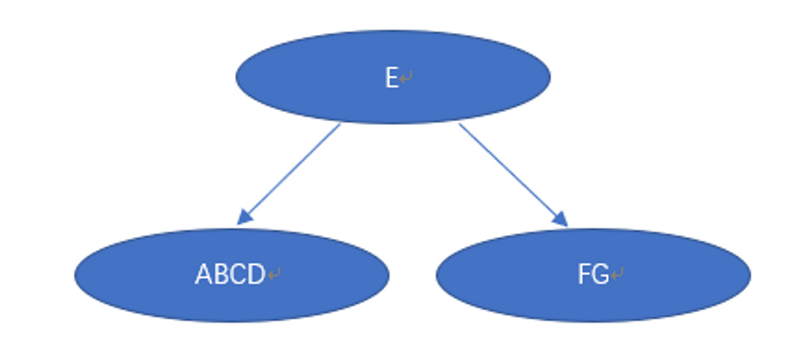
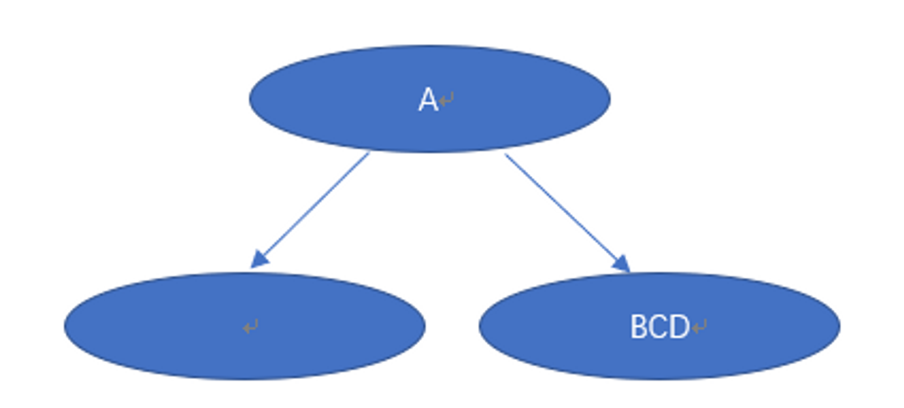
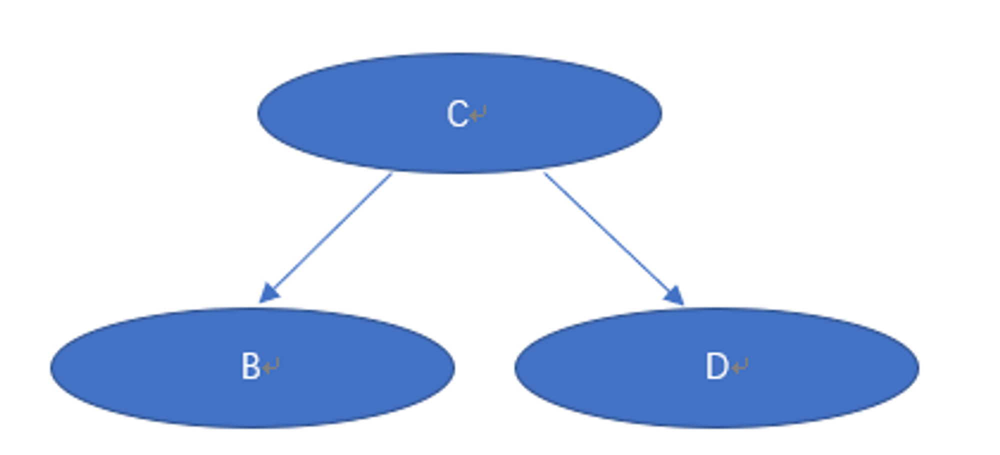
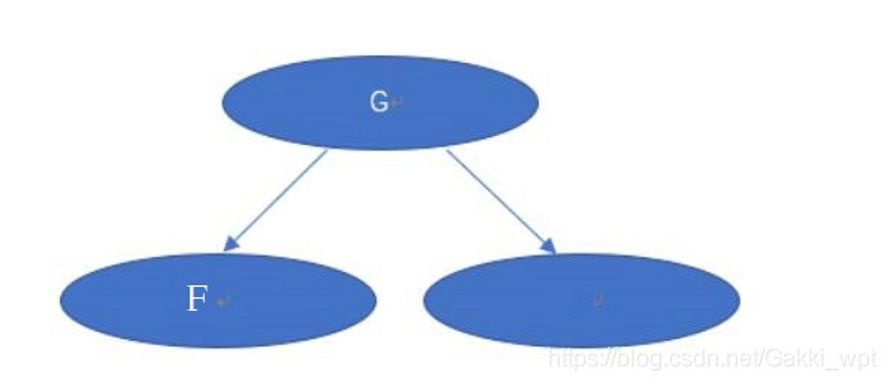
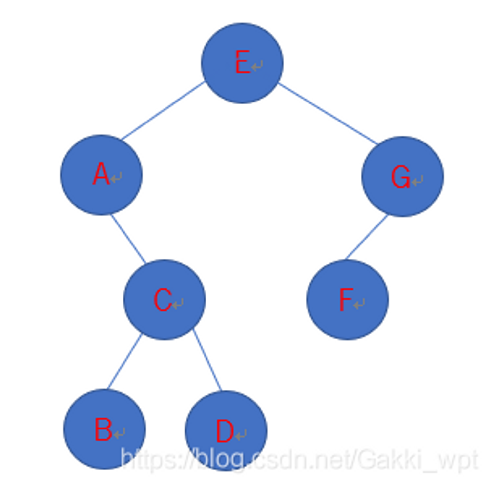

::: tips
二叉树手动构建
:::

-   二叉树手动构建
    
    已知前序遍历序列和中序遍历序列，可以唯一确定一棵二叉树。 已知后序遍历序列和中序遍历序列，可以唯一确定一棵二叉树。 但是已知前序遍历序列和后序遍历序列，是不能确定一棵二叉树的。 下面例子通过前序遍历和中序遍历确定唯一的一棵二叉树。
    
    前序遍历：EACBDGF
    
    中序遍历：ABCDEFG
    
    1、首先根据前序遍历找出根节点是E，然后根据中序遍历可以知道ABCD是E的左子树，FG是E的右子树。
    

    
    2、然后根据左子树的先序：ACBD，中序：ABCD，确定A为根结点，无左子树，右子树为BCD
    

    
    3、右子树为BCD，先序：CBD，中序：BCD，确定C为根结点，B为左子树，右子树为D
    

    4、右子树为GF，先序：GF，中序：FG，确定G为根结点，无右子树，左子树为F
    

    
    5、最终的二叉树为：
    

    
    后序遍历为：BDCAFGE
    
    后序遍历序列和中序遍历序列，可以唯一确定一棵二叉树和前中很相似，先根据后序遍历的最后一个元素确定根结点，然后通过中序遍历分为左右子树，再在子树确定根结点，以此类推。