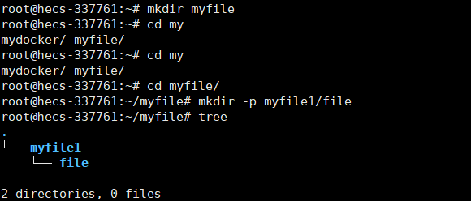

## 基本操作


1、更新apt，yum源
- [ ] ubuntu
- apt update
- apt install vim 
- [ ] centos
- yum update
- yum install vim
2、查看文件系统磁盘使用情况统计
- df -h
- 

3、查看机器所挂硬盘个数及分区情况
- fdisk -l
- 
4、显示系统名、节点名称、操作系统的发行版号、操作系统版本、运行系统的机器 ID 号
- uname -a
- 
5、显示操作系统的发行版号
- uname -r
- 
6、 显示系统中正在运行的进程的实时状态
- htop
-监控内容：  
1.CPU、内存、Swap的使用情况；  
2.任务、线程、平均负载及系统运行时间的信息。  
3.当前系统中的所有进程
- 
7、cd

8、 ls

9、pwd：显示目录路径的命令


10、树状显示tree

11、创建新目录



12、复制文件和目录

13、移动、重命名文件/目录

15、删除文件
- rm -rf


16、解压缩

17、改变文件/目录权限

18、帮助命令

19、关机重启命令


## Docker
**- 安装docker**  
sudo apt-get install docker.io  
- **docker命令免root权限执行  
- **创建docker用户组，若已有docker组会报错，没关系可忽略**  
sudo groupadd docker  
- **将当前用户加入docker组**  
sudo gpasswd -a ${USER} docker  
- **重启docker服务**  
sudo service docker restart  
- **切换当前会话到新group或重新登录重启X会话**  
newgrp docker

- **拉取容器**  
```
docker pull ubuntu:16.04  
```
- **创建容器**  
```
docker run -itd --name=test_ubuntu -p 8080:8080 -v /data4t:/work ubuntu:16.04  /bin/bash  
```
参数说明：  
-i 以交互模式运行容器  
-t 为容器重新分配一个伪输入终端  
-d 后台运行容器  
--name 设置容器名称，否则生成随机图片  
-p 指定端口  
-v 映射宿主机与容器内路径  
ubuntu:16.04 镜像名称

**- 启动容器**  
```
docker start test_ubuntu 
``` 
**- 查看运行中的容器**  
```
docker ps  
```
**- 查看所有状态的容器**  
```
docker ps -a
``` 

## vi操作
  
使用  vim 需执行如下命令自行安装：
```
sudo apt-get install vim-gtk
```

vi可以分为三种状态，分别是命令模式（Command mode）、插入模式（Insert mode）和编辑模式（Edit mode）。  


## linux下运行python


## Linux运行c++


## linux安装国内源
对于Ubuntu系统：

清华源：
```
# 备份原 sources.list 文件
sudo cp /etc/apt/sources.list /etc/apt/sources.list.bak

# 使用 sed 命令将原 sources.list 文件中的官方源替换为清华源
sudo sed -i 's/archive.ubuntu.com/mirrors.tuna.tsinghua.edu.cn/g' /etc/apt/sources.list

# 更新软件包信息
sudo apt-get update
```

阿里源：

```
# 备份原 sources.list 文件
sudo cp /etc/apt/sources.list /etc/apt/sources.list.bak

# 使用 sed 命令将原 sources.list 文件中的官方源替换为阿里源
sudo sed -i 's/archive.ubuntu.com/mirrors.aliyun.com/g' /etc/apt/sources.list

# 更新软件包信息
sudo apt-get update
```