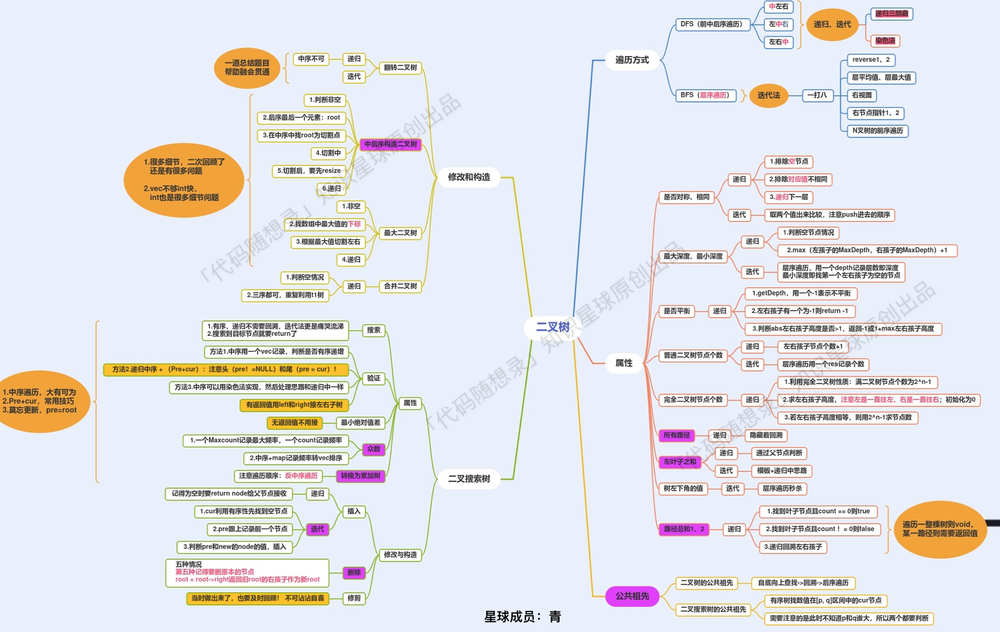

# 代码随想录算法总结(C++)版本——二叉树

Created: September 2, 2022 1:06 PM


## **二叉树的理论基础**

- **[关于二叉树，你该了解这些！ (opens new window)](https://programmercarl.com/%E4%BA%8C%E5%8F%89%E6%A0%91%E7%90%86%E8%AE%BA%E5%9F%BA%E7%A1%80.html)**：二叉树的种类、存储方式、遍历方式、定义方式

## **二叉树的遍历方式**

- 深度优先遍历
    - **[二叉树：前中后序递归法 (opens new window)](https://programmercarl.com/%E4%BA%8C%E5%8F%89%E6%A0%91%E7%9A%84%E9%80%92%E5%BD%92%E9%81%8D%E5%8E%86.html)**：递归三部曲初次亮相
    - **[二叉树：前中后序迭代法（一） (opens new window)](https://programmercarl.com/%E4%BA%8C%E5%8F%89%E6%A0%91%E7%9A%84%E8%BF%AD%E4%BB%A3%E9%81%8D%E5%8E%86.html)**：通过栈模拟递归
    - **[二叉树：前中后序迭代法（二）统一风格(opens new window)](https://programmercarl.com/%E4%BA%8C%E5%8F%89%E6%A0%91%E7%9A%84%E7%BB%9F%E4%B8%80%E8%BF%AD%E4%BB%A3%E6%B3%95.html)**
- 广度优先遍历
    - **[二叉树的层序遍历 (opens new window)](https://programmercarl.com/0102.%E4%BA%8C%E5%8F%89%E6%A0%91%E7%9A%84%E5%B1%82%E5%BA%8F%E9%81%8D%E5%8E%86.html)**：通过队列模拟

## **求二叉树的属性**

- **[二叉树：是否对称(opens new window)](https://programmercarl.com/0101.%E5%AF%B9%E7%A7%B0%E4%BA%8C%E5%8F%89%E6%A0%91.html)**
    - 递归：后序，比较的是根节点的左子树与右子树是不是相互翻转
    - 迭代：使用队列/栈将两个节点顺序放入容器中进行比较
- **[二叉树：求最大深度(opens new window)](https://programmercarl.com/0104.%E4%BA%8C%E5%8F%89%E6%A0%91%E7%9A%84%E6%9C%80%E5%A4%A7%E6%B7%B1%E5%BA%A6.html)**
    - 递归：后序，求根节点最大高度就是最大深度，通过递归函数的返回值做计算树的高度
    - 迭代：层序遍历
- **[二叉树：求最小深度(opens new window)](https://programmercarl.com/0111.%E4%BA%8C%E5%8F%89%E6%A0%91%E7%9A%84%E6%9C%80%E5%B0%8F%E6%B7%B1%E5%BA%A6.html)**
    - 递归：后序，求根节点最小高度就是最小深度，注意最小深度的定义
    - 迭代：层序遍历
- **[二叉树：求有多少个节点(opens new window)](https://programmercarl.com/0222.%E5%AE%8C%E5%85%A8%E4%BA%8C%E5%8F%89%E6%A0%91%E7%9A%84%E8%8A%82%E7%82%B9%E4%B8%AA%E6%95%B0.html)**
    - 递归：后序，通过递归函数的返回值计算节点数量
    - 迭代：层序遍历
- **[二叉树：是否平衡(opens new window)](https://programmercarl.com/0110.%E5%B9%B3%E8%A1%A1%E4%BA%8C%E5%8F%89%E6%A0%91.html)**
    - 递归：后序，注意后序求高度和前序求深度，递归过程判断高度差
    - 迭代：效率很低，不推荐
- **[二叉树：找所有路径(opens new window)](https://programmercarl.com/0257.%E4%BA%8C%E5%8F%89%E6%A0%91%E7%9A%84%E6%89%80%E6%9C%89%E8%B7%AF%E5%BE%84.html)**
    - 递归：前序，方便让父节点指向子节点，涉及回溯处理根节点到叶子的所有路径
    - 迭代：一个栈模拟递归，一个栈来存放对应的遍历路径
- **[二叉树：递归中如何隐藏着回溯(opens new window)](https://programmercarl.com/%E4%BA%8C%E5%8F%89%E6%A0%91%E4%B8%AD%E9%80%92%E5%BD%92%E5%B8%A6%E7%9D%80%E5%9B%9E%E6%BA%AF.html)**
    - 详解**[二叉树：找所有路径 (opens new window)](https://programmercarl.com/0257.%E4%BA%8C%E5%8F%89%E6%A0%91%E7%9A%84%E6%89%80%E6%9C%89%E8%B7%AF%E5%BE%84.html)**中递归如何隐藏着回溯
- **[二叉树：求左叶子之和(opens new window)](https://programmercarl.com/0404.%E5%B7%A6%E5%8F%B6%E5%AD%90%E4%B9%8B%E5%92%8C.html)**
    - 递归：后序，必须三层约束条件，才能判断是否是左叶子。
    - 迭代：直接模拟后序遍历
- **[二叉树：求左下角的值(opens new window)](https://programmercarl.com/0513.%E6%89%BE%E6%A0%91%E5%B7%A6%E4%B8%8B%E8%A7%92%E7%9A%84%E5%80%BC.html)**
    - 递归：顺序无所谓，优先左孩子搜索，同时找深度最大的叶子节点。
    - 迭代：层序遍历找最后一行最左边
- **[二叉树：求路径总和(opens new window)](https://programmercarl.com/0112.%E8%B7%AF%E5%BE%84%E6%80%BB%E5%92%8C.html)**
    - 递归：顺序无所谓，递归函数返回值为bool类型是为了搜索一条边，没有返回值是搜索整棵树。
    - 迭代：栈里元素不仅要记录节点指针，还要记录从头结点到该节点的路径数值总和

## **二叉树的修改与构造**

- **[翻转二叉树(opens new window)](https://programmercarl.com/0226.%E7%BF%BB%E8%BD%AC%E4%BA%8C%E5%8F%89%E6%A0%91.html)**
    - 递归：前序，交换左右孩子
    - 迭代：直接模拟前序遍历
- **[构造二叉树(opens new window)](https://programmercarl.com/0106.%E4%BB%8E%E4%B8%AD%E5%BA%8F%E4%B8%8E%E5%90%8E%E5%BA%8F%E9%81%8D%E5%8E%86%E5%BA%8F%E5%88%97%E6%9E%84%E9%80%A0%E4%BA%8C%E5%8F%89%E6%A0%91.html)**
    - 递归：前序，重点在于找分割点，分左右区间构造
    - 迭代：比较复杂，意义不大
- **[构造最大的二叉树(opens new window)](https://programmercarl.com/0654.%E6%9C%80%E5%A4%A7%E4%BA%8C%E5%8F%89%E6%A0%91.html)**
    - 递归：前序，分割点为数组最大值，分左右区间构造
    - 迭代：比较复杂，意义不大
- **[合并两个二叉树(opens new window)](https://programmercarl.com/0617.%E5%90%88%E5%B9%B6%E4%BA%8C%E5%8F%89%E6%A0%91.html)**
    - 递归：前序，同时操作两个树的节点，注意合并的规则
    - 迭代：使用队列，类似层序遍历

## **求二叉搜索树的属性**

- **[二叉搜索树中的搜索(opens new window)](https://programmercarl.com/0700.%E4%BA%8C%E5%8F%89%E6%90%9C%E7%B4%A2%E6%A0%91%E4%B8%AD%E7%9A%84%E6%90%9C%E7%B4%A2.html)**
    - 递归：二叉搜索树的递归是有方向的
    - 迭代：因为有方向，所以迭代法很简单
- **[是不是二叉搜索树(opens new window)](https://programmercarl.com/0098.%E9%AA%8C%E8%AF%81%E4%BA%8C%E5%8F%89%E6%90%9C%E7%B4%A2%E6%A0%91.html)**
    - 递归：中序，相当于变成了判断一个序列是不是递增的
    - 迭代：模拟中序，逻辑相同
- **[求二叉搜索树的最小绝对差(opens new window)](https://programmercarl.com/0530.%E4%BA%8C%E5%8F%89%E6%90%9C%E7%B4%A2%E6%A0%91%E7%9A%84%E6%9C%80%E5%B0%8F%E7%BB%9D%E5%AF%B9%E5%B7%AE.html)**
    - 递归：中序，双指针操作
    - 迭代：模拟中序，逻辑相同
- **[求二叉搜索树的众数(opens new window)](https://programmercarl.com/0501.%E4%BA%8C%E5%8F%89%E6%90%9C%E7%B4%A2%E6%A0%91%E4%B8%AD%E7%9A%84%E4%BC%97%E6%95%B0.html)**
    - 递归：中序，清空结果集的技巧，遍历一遍便可求众数集合
    - **[二叉搜索树转成累加树(opens new window)](https://programmercarl.com/0538.%E6%8A%8A%E4%BA%8C%E5%8F%89%E6%90%9C%E7%B4%A2%E6%A0%91%E8%BD%AC%E6%8D%A2%E4%B8%BA%E7%B4%AF%E5%8A%A0%E6%A0%91.html)**
    - 递归：中序，双指针操作累加
    - 迭代：模拟中序，逻辑相同

## **二叉树公共祖先问题**

- **[二叉树的公共祖先问题(opens new window)](https://programmercarl.com/0236.%E4%BA%8C%E5%8F%89%E6%A0%91%E7%9A%84%E6%9C%80%E8%BF%91%E5%85%AC%E5%85%B1%E7%A5%96%E5%85%88.html)**
    - 递归：后序，回溯，找到左子树出现目标值，右子树节点目标值的节点。
    - 迭代：不适合模拟回溯
- **[二叉搜索树的公共祖先问题(opens new window)](https://programmercarl.com/0235.%E4%BA%8C%E5%8F%89%E6%90%9C%E7%B4%A2%E6%A0%91%E7%9A%84%E6%9C%80%E8%BF%91%E5%85%AC%E5%85%B1%E7%A5%96%E5%85%88.html)**
    - 递归：顺序无所谓，如果节点的数值在目标区间就是最近公共祖先
    - 迭代：按序遍历

## **二叉搜索树的修改与构造**

- **[二叉搜索树中的插入操作(opens new window)](https://programmercarl.com/0701.%E4%BA%8C%E5%8F%89%E6%90%9C%E7%B4%A2%E6%A0%91%E4%B8%AD%E7%9A%84%E6%8F%92%E5%85%A5%E6%93%8D%E4%BD%9C.html)**
    - 递归：顺序无所谓，通过递归函数返回值添加节点
    - 迭代：按序遍历，需要记录插入父节点，这样才能做插入操作
- **[二叉搜索树中的删除操作(opens new window)](https://programmercarl.com/0450.%E5%88%A0%E9%99%A4%E4%BA%8C%E5%8F%89%E6%90%9C%E7%B4%A2%E6%A0%91%E4%B8%AD%E7%9A%84%E8%8A%82%E7%82%B9.html)**
    - 递归：前序，想清楚删除非叶子节点的情况
    - 迭代：有序遍历，较复杂
- **[修剪二叉搜索树(opens new window)](https://programmercarl.com/0669.%E4%BF%AE%E5%89%AA%E4%BA%8C%E5%8F%89%E6%90%9C%E7%B4%A2%E6%A0%91.html)**
    - 递归：前序，通过递归函数返回值删除节点
    - 迭代：有序遍历，较复杂
- **[构造二叉搜索树(opens new window)](https://programmercarl.com/0108.%E5%B0%86%E6%9C%89%E5%BA%8F%E6%95%B0%E7%BB%84%E8%BD%AC%E6%8D%A2%E4%B8%BA%E4%BA%8C%E5%8F%89%E6%90%9C%E7%B4%A2%E6%A0%91.html)**
    - 递归：前序，数组中间节点分割
    - 迭代：较复杂，通过三个队列来模拟

## **阶段总结**

大家以上题目都做过了，也一定要看如下阶段小结。

**每周小结都会对大家的疑问做统一解答，并且对每周的内容进行拓展和补充，所以一定要看，将细碎知识点一网打尽！**

- **[本周小结！（二叉树系列一）(opens new window)](https://programmercarl.com/%E5%91%A8%E6%80%BB%E7%BB%93/20200927%E4%BA%8C%E5%8F%89%E6%A0%91%E5%91%A8%E6%9C%AB%E6%80%BB%E7%BB%93.html)**
- **[本周小结！（二叉树系列二）(opens new window)](https://programmercarl.com/%E5%91%A8%E6%80%BB%E7%BB%93/20201003%E4%BA%8C%E5%8F%89%E6%A0%91%E5%91%A8%E6%9C%AB%E6%80%BB%E7%BB%93.html)**
- **[本周小结！（二叉树系列三）(opens new window)](https://programmercarl.com/%E5%91%A8%E6%80%BB%E7%BB%93/20201010%E4%BA%8C%E5%8F%89%E6%A0%91%E5%91%A8%E6%9C%AB%E6%80%BB%E7%BB%93.html)**
- **[本周小结！（二叉树系列四）(opens new window)](https://programmercarl.com/%E5%91%A8%E6%80%BB%E7%BB%93/20201017%E4%BA%8C%E5%8F%89%E6%A0%91%E5%91%A8%E6%9C%AB%E6%80%BB%E7%BB%93.html)**

## **最后总结**

二叉树专题汇聚为一张图：



看如下中间节点的顺序，就可以发现，中间节点的顺序就是所谓的遍历方式

- 前序遍历：中左右
- 中序遍历：左中右
- 后序遍历：左右中

大家可以对着如下图，看看自己理解的前后中序有没有问题。


## **二叉树的定义**

刚刚我们说过了二叉树有两种存储方式顺序存储，和链式存储，顺序存储就是用数组来存，这个定义没啥可说的，我们来看看链式存储的二叉树节点的定义方式。

C++代码如下：

```cpp
struct TreeNode {
    int val;
    TreeNode *left;
    TreeNode *right;
    TreeNode(int x) : val(x), left(NULL), right(NULL) {}
};
```

# ****二叉树的递归遍历****

## 前序遍历：

```cpp
class Solution {
public:
    void traversal(TreeNode* cur, vector<int>& vec) {
        if (cur == NULL) return;
        vec.push_back(cur->val);    // 中
        traversal(cur->left, vec);  // 左
        traversal(cur->right, vec); // 右
    }
    vector<int> preorderTraversal(TreeNode* root) {
        vector<int> result;
        traversal(root, result);
        return result;
    }
};

```

那么前序遍历写出来之后，中序和后序遍历就不难理解了，代码如下：

## 中序遍历：

```cpp
void traversal(TreeNode* cur, vector<int>& vec) {
    if (cur == NULL) return;
    traversal(cur->left, vec);  // 左
    vec.push_back(cur->val);    // 中
    traversal(cur->right, vec); // 右
}

```

## 后序遍历：

```cpp
void traversal(TreeNode* cur, vector<int>& vec) {
    if (cur == NULL) return;
    traversal(cur->left, vec);  // 左
    traversal(cur->right, vec); // 右
    vec.push_back(cur->val);    // 中
}
```

# ****二叉树的迭代遍历****

## **前序遍历（迭代法）**

我们先看一下前序遍历。

前序遍历是中左右，每次先处理的是中间节点，那么先将根节点放入栈中，然后将右孩子加入栈，再加入左孩子。

为什么要先加入 右孩子，再加入左孩子呢？ 因为这样出栈的时候才是中左右的顺序。

动画如下：


不难写出如下代码: （**注意代码中空节点不入栈**）

```cpp
class Solution {
public:
    vector<int> preorderTraversal(TreeNode* root) {
        stack<TreeNode*> st;
        vector<int> result;
        if (root == NULL) return result;
        st.push(root);
        while (!st.empty()) {
            TreeNode* node = st.top();                       // 中
            st.pop();
            result.push_back(node->val);
            if (node->right) st.push(node->right);           // 右（空节点不入栈）
            if (node->left) st.push(node->left);             // 左（空节点不入栈）
        }
        return result;
    }
};
```

## ****中序遍历（迭代法）****

那么**在使用迭代法写中序遍历，就需要借用指针的遍历来帮助访问节点，栈则用来处理节点上的元素。**

动画如下：


**中序遍历，可以写出如下代码：**

```cpp
class Solution {
public:
    vector<int> inorderTraversal(TreeNode* root) {
        vector<int> result;
        stack<TreeNode*> st;
        TreeNode* cur = root;
        while (cur != NULL || !st.empty()) {
            if (cur != NULL) { // 指针来访问节点，访问到最底层
                st.push(cur); // 将访问的节点放进栈
                cur = cur->left;                // 左
            } else {
                cur = st.top(); // 从栈里弹出的数据，就是要处理的数据（放进result数组里的数据）
                st.pop();
                result.push_back(cur->val);     // 中
                cur = cur->right;               // 右
            }
        }
        return result;
    }
};
```

## **后序遍历（迭代法）**

再来看后序遍历，先序遍历是中左右，后续遍历是左右中，那么我们只需要调整一下先序遍历的代码顺序，就变成中右左的遍历顺序，然后在反转result数组，输出的结果顺序就是左右中了，如下图：


**所以后序遍历只需要前序遍历的代码稍作修改就可以了，代码如下：**

```cpp
class Solution {
public:
    vector<int> postorderTraversal(TreeNode* root) {
        stack<TreeNode*> st;
        vector<int> result;
        if (root == NULL) return result;
        st.push(root);
        while (!st.empty()) {
            TreeNode* node = st.top();
            st.pop();
            result.push_back(node->val);
            if (node->left) st.push(node->left); // 相对于前序遍历，这更改一下入栈顺序 （空节点不入栈）
            if (node->right) st.push(node->right); // 空节点不入栈
        }
        reverse(result.begin(), result.end()); // 将结果反转之后就是左右中的顺序了
        return result;
    }
};
```

**因为前序遍历中访问节点（遍历节点）和处理节点（将元素放进result数组中）可以同步处理，但是中序就无法做到同步！**

# ****二叉树的统一迭代法****

## **迭代法中序遍历**

中序遍历代码如下：（详细注释）

```cpp
class Solution {
public:
    vector<int> inorderTraversal(TreeNode* root) {
        vector<int> result;
        stack<TreeNode*> st;
        if (root != NULL) st.push(root);
        while (!st.empty()) {
            TreeNode* node = st.top();
            if (node != NULL) {
                st.pop(); // 将该节点弹出，避免重复操作，下面再将右中左节点添加到栈中
                if (node->right) st.push(node->right);  // 添加右节点（空节点不入栈）

                st.push(node);                          // 添加中节点
                st.push(NULL); // 中节点访问过，但是还没有处理，加入空节点做为标记。

                if (node->left) st.push(node->left);    // 添加左节点（空节点不入栈）
            } else { // 只有遇到空节点的时候，才将下一个节点放进结果集
                st.pop();           // 将空节点弹出
                node = st.top();    // 重新取出栈中元素
                st.pop();
                result.push_back(node->val); // 加入到结果集
            }
        }
        return result;
    }
};

```

看代码有点抽象我们来看一下动画(中序遍历)：


动画中，result数组就是最终结果集。

## **迭代法前序遍历**

迭代法前序遍历代码如下： (**注意此时我们和中序遍历相比仅仅改变了两行代码的顺序**)

```cpp
class Solution {
public:
    vector<int> preorderTraversal(TreeNode* root) {
        vector<int> result;
        stack<TreeNode*> st;
        if (root != NULL) st.push(root);
        while (!st.empty()) {
            TreeNode* node = st.top();
            if (node != NULL) {
                st.pop();
                if (node->right) st.push(node->right);  // 右
                if (node->left) st.push(node->left);    // 左
                st.push(node);                          // 中
                st.push(NULL);
            } else {
                st.pop();
                node = st.top();
                st.pop();
                result.push_back(node->val);
            }
        }
        return result;
    }
};

```

## **[#](https://www.programmercarl.com/%E4%BA%8C%E5%8F%89%E6%A0%91%E7%9A%84%E7%BB%9F%E4%B8%80%E8%BF%AD%E4%BB%A3%E6%B3%95.html#%E8%BF%AD%E4%BB%A3%E6%B3%95%E5%90%8E%E5%BA%8F%E9%81%8D%E5%8E%86)迭代法后序遍历**

后续遍历代码如下： (**注意此时我们和中序遍历相比仅仅改变了两行代码的顺序**)

```cpp
class Solution {
public:
    vector<int> postorderTraversal(TreeNode* root) {
        vector<int> result;
        stack<TreeNode*> st;
        if (root != NULL) st.push(root);
        while (!st.empty()) {
            TreeNode* node = st.top();
            if (node != NULL) {
                st.pop();
                st.push(node);                          // 中
                st.push(NULL);

                if (node->right) st.push(node->right);  // 右
                if (node->left) st.push(node->left);    // 左

            } else {
                st.pop();
                node = st.top();
                st.pop();
                result.push_back(node->val);
            }
        }
        return result;
    }
};
```

# ****二叉树层序遍历****

# **102.二叉树的层序遍历**

给你一个二叉树，请你返回其按 层序遍历 得到的节点值。 （即逐层地，从左到右访问所有节点）。


使用队列实现二叉树广度优先遍历，动画如下：


这样就实现了层序从左到右遍历二叉树。

代码如下：**这份代码也可以作为二叉树层序遍历的模板，打十个就靠它了**。

C++代码：

```cpp
class Solution {
public:
    vector<vector<int>> levelOrder(TreeNode* root) {
        queue<TreeNode*> que;
        if (root != NULL) que.push(root);
        vector<vector<int>> result;
        while (!que.empty()) {
            int size = que.size();
            vector<int> vec;
            // 这里一定要使用固定大小size，不要使用que.size()，因为que.size是不断变化的
            for (int i = 0; i < size; i++) {
                TreeNode* node = que.front();
                que.pop();
                vec.push_back(node->val);
                if (node->left) que.push(node->left);
                if (node->right) que.push(node->right);
            }
            result.push_back(vec);
        }
        return result;
    }
};
```

# **226.翻转二叉树**

翻转一棵二叉树。


如果要从整个树来看，翻转还真的挺复杂，整个树以中间分割线进行翻转，如图：


## **递归法**

对于二叉树的递归法的前中后序遍历，已经在**[二叉树：前中后序递归遍历 (opens new window)](https://programmercarl.com/%E4%BA%8C%E5%8F%89%E6%A0%91%E7%9A%84%E9%80%92%E5%BD%92%E9%81%8D%E5%8E%86.html)**详细讲解了。

我们下文以前序遍历为例，通过动画来看一下翻转的过程:


基于这递归三步法，代码基本写完，C++代码如下：

```cpp
class Solution {
public:
    TreeNode* invertTree(TreeNode* root) {
        if (root == NULL) return root;
        swap(root->left, root->right);  // 中
        invertTree(root->left);         // 左
        invertTree(root->right);        // 右
        return root;
    }
};
```

## **迭代法**

### **深度优先遍历**

**[二叉树：听说递归能做的，栈也能做！ (opens new window)](https://programmercarl.com/%E4%BA%8C%E5%8F%89%E6%A0%91%E7%9A%84%E8%BF%AD%E4%BB%A3%E9%81%8D%E5%8E%86.html)**中给出了前中后序迭代方式的写法，所以本地可以很轻松的切出如下迭代法的代码：

C++代码迭代法（前序遍历）

```cpp
class Solution {
public:
    TreeNode* invertTree(TreeNode* root) {
        if (root == NULL) return root;
        stack<TreeNode*> st;
        st.push(root);
        while(!st.empty()) {
            TreeNode* node = st.top();              // 中
            st.pop();
            swap(node->left, node->right);
            if(node->right) st.push(node->right);   // 右
            if(node->left) st.push(node->left);     // 左
        }
        return root;
    }
};

```

如果这个代码看不懂的话可以在回顾一下**[二叉树：听说递归能做的，栈也能做！ (opens new window)](https://programmercarl.com/%E4%BA%8C%E5%8F%89%E6%A0%91%E7%9A%84%E8%BF%AD%E4%BB%A3%E9%81%8D%E5%8E%86.html)**。

我们在**[二叉树：前中后序迭代方式的统一写法 (opens new window)](https://programmercarl.com/%E4%BA%8C%E5%8F%89%E6%A0%91%E7%9A%84%E7%BB%9F%E4%B8%80%E8%BF%AD%E4%BB%A3%E6%B3%95.html)**中介绍了统一的写法，所以，本题也只需将文中的代码少做修改便可。

C++代码如下迭代法（前序遍历）

```cpp
class Solution {
public:
    TreeNode* invertTree(TreeNode* root) {
        stack<TreeNode*> st;
        if (root != NULL) st.push(root);
        while (!st.empty()) {
            TreeNode* node = st.top();
            if (node != NULL) {
                st.pop();
                if (node->right) st.push(node->right);  // 右
                if (node->left) st.push(node->left);    // 左
                st.push(node);                          // 中
                st.push(NULL);
            } else {
                st.pop();
                node = st.top();
                st.pop();
                swap(node->left, node->right);          // 节点处理逻辑
            }
        }
        return root;
    }
};

```

1234567891011121314151617181920212223

如果上面这个代码看不懂，回顾一下文章**[二叉树：前中后序迭代方式的统一写法 (opens new window)](https://programmercarl.com/%E4%BA%8C%E5%8F%89%E6%A0%91%E7%9A%84%E7%BB%9F%E4%B8%80%E8%BF%AD%E4%BB%A3%E6%B3%95.html)**。

### **广度优先遍历**

也就是层序遍历，层数遍历也是可以翻转这棵树的，因为层序遍历也可以把每个节点的左右孩子都翻转一遍，代码如下：

```cpp
class Solution {
public:
    TreeNode* invertTree(TreeNode* root) {
        queue<TreeNode*> que;
        if (root != NULL) que.push(root);
        while (!que.empty()) {
            int size = que.size();
            for (int i = 0; i < size; i++) {
                TreeNode* node = que.front();
                que.pop();
                swap(node->left, node->right); // 节点处理
                if (node->left) que.push(node->left);
                if (node->right) que.push(node->right);
            }
        }
        return root;
    }
};

```

123456789101112131415161718

如果对以上代码不理解，或者不清楚二叉树的层序遍历，可以看这篇**[二叉树：层序遍历登场！(opens new window](https://programmercarl.com/0102.%E4%BA%8C%E5%8F%89%E6%A0%91%E7%9A%84%E5%B1%82%E5%BA%8F%E9%81%8D%E5%8E%86.html)**

## **拓展**

**文中我指的是递归的中序遍历是不行的，因为使用递归的中序遍历，某些节点的左右孩子会翻转两次。**

如果非要使用递归中序的方式写，也可以，如下代码就可以避免节点左右孩子翻转两次的情况：

```cpp
class Solution {
public:
    TreeNode* invertTree(TreeNode* root) {
        if (root == NULL) return root;
        invertTree(root->left);         // 左
        swap(root->left, root->right);  // 中
        invertTree(root->left);         // 注意 这里依然要遍历左孩子，因为中间节点已经翻转了
        return root;
    }
};

```

代码虽然可以，但这毕竟不是真正的递归中序遍历了。

但使用迭代方式统一写法的中序是可以的。

代码如下：

```cpp
class Solution {
public:
    TreeNode* invertTree(TreeNode* root) {
        stack<TreeNode*> st;
        if (root != NULL) st.push(root);
        while (!st.empty()) {
            TreeNode* node = st.top();
            if (node != NULL) {
                st.pop();
                if (node->right) st.push(node->right);  // 右
                st.push(node);                          // 中
                st.push(NULL);
                if (node->left) st.push(node->left);    // 左

            } else {
                st.pop();
                node = st.top();
                st.pop();
                swap(node->left, node->right);          // 节点处理逻辑
            }
        }
        return root;
    }
};

```

为什么这个中序就是可以的呢，因为这是用栈来遍历，而不是靠指针来遍历，避免了递归法中翻转了两次的情况，大家可以画图理解一下，这里有点意思的

# **101. 对称二叉树**

给定一个二叉树，检查它是否是镜像对称的。


比较的是两个子树的里侧和外侧的元素是否相等。如图所示：


**因为要遍历两棵树而且要比较内侧和外侧节点，所以准确的来说是一个树的遍历顺序是左右中，一个树的遍历顺序是右左中。**

节点为空的情况有：（**注意我们比较的其实不是左孩子和右孩子，所以如下我称之为左节点右节点**）

- 左节点为空，右节点不为空，不对称，return false
- 左不为空，右为空，不对称 return false
- 左右都为空，对称，返回true

# 递归法

最后递归的C++整体代码如下：

```cpp
class Solution {
public:
    bool compare(TreeNode* left, TreeNode* right) {
        // 首先排除空节点的情况
        if (left == NULL && right != NULL) return false;
        else if (left != NULL && right == NULL) return false;
        else if (left == NULL && right == NULL) return true;
        // 排除了空节点，再排除数值不相同的情况
        else if (left->val != right->val) return false;

        // 此时就是：左右节点都不为空，且数值相同的情况
        // 此时才做递归，做下一层的判断
        bool outside = compare(left->left, right->right);   // 左子树：左、 右子树：右
        bool inside = compare(left->right, right->left);    // 左子树：右、 右子树：左
        bool isSame = outside && inside;                    // 左子树：中、 右子树：中 （逻辑处理）
        return isSame;

    }
    bool isSymmetric(TreeNode* root) {
        if (root == NULL) return true;
        return compare(root->left, root->right);
    }
};
```

当然我可以把如上代码整理如下：

```cpp
class Solution {
public:
    bool compare(TreeNode* left, TreeNode* right) {
        if (left == NULL && right != NULL) return false;
        else if (left != NULL && right == NULL) return false;
        else if (left == NULL && right == NULL) return true;
        else if (left->val != right->val) return false;
        else return compare(left->left, right->right) && compare(left->right, right->left);

    }
    bool isSymmetric(TreeNode* root) {
        if (root == NULL) return true;
        return compare(root->left, root->right);
    }
};
```

# **104.二叉树的最大深度**

给定一个二叉树，找出其最大深度。

二叉树的深度为根节点到最远叶子节点的最长路径上的节点数。

说明: 叶子节点是指没有子节点的节点。

示例： 给定二叉树 [3,9,20,null,null,15,7]，


返回它的最大深度 3 。

## ****递归法****

### 后序遍历

所以整体c++代码如下：

```cpp
class solution {
public:
    int getdepth(treenode* node) {
        if (node == NULL) return 0;
        int leftdepth = getdepth(node->left);       // 左
        int rightdepth = getdepth(node->right);     // 右
        int depth = 1 + max(leftdepth, rightdepth); // 中
        return depth;
    }
    int maxdepth(treenode* root) {
        return getdepth(root);
    }
};

```

代码精简之后c++代码如下：

```cpp
class solution {
public:
    int maxdepth(treenode* root) {
        if (root == null) return 0;
        return 1 + max(maxdepth(root->left), maxdepth(root->right));
    }
};
```

### 后序遍历

代码如下：(**充分表现出求深度回溯的过程**)

```cpp
class solution {
public:
    int result;
    void getdepth(treenode* node, int depth) {
        result = depth > result ? depth : result; // 中

        if (node->left == NULL && node->right == NULL) return ;

        if (node->left) { // 左
            depth++;    // 深度+1
            getdepth(node->left, depth);
            depth--;    // 回溯，深度-1
        }
        if (node->right) { // 右
            depth++;    // 深度+1
            getdepth(node->right, depth);
            depth--;    // 回溯，深度-1
        }
        return ;
    }
    int maxdepth(treenode* root) {
        result = 0;
        if (root == NULL) return result;
        getdepth(root, 1);
        return result;
    }
};

```

**可以看出使用了前序（中左右）的遍历顺序，这才是真正求深度的逻辑！**

注意以上代码是为了把细节体现出来，简化一下代码如下：

```cpp
class solution {
public:
    int result;
    void getdepth(treenode* node, int depth) {
        result = depth > result ? depth : result; // 中
        if (node->left == NULL && node->right == NULL) return ;
        if (node->left) { // 左
            getdepth(node->left, depth + 1);
        }
        if (node->right) { // 右
            getdepth(node->right, depth + 1);
        }
        return ;
    }
    int maxdepth(treenode* root) {
        result = 0;
        if (root == 0) return result;
        getdepth(root, 1);
        return result;
    }
};
```

## ****迭代法****

在二叉树中，一层一层的来遍历二叉树，记录一下遍历的层数就是二叉树的深度，如图所示：


所以这道题的迭代法就是一道模板题，可以使用二叉树层序遍历的模板来解决的。

如果对层序遍历还不清楚的话，可以看这篇：**[二叉树：层序遍历登场！(opens new window)](https://programmercarl.com/0102.%E4%BA%8C%E5%8F%89%E6%A0%91%E7%9A%84%E5%B1%82%E5%BA%8F%E9%81%8D%E5%8E%86.html)**

c++代码如下：

```cpp
class solution {
public:
    int maxdepth(treenode* root) {
        if (root == NULL) return 0;
        int depth = 0;
        queue<treenode*> que;
        que.push(root);
        while(!que.empty()) {
            int size = que.size();
            depth++; // 记录深度
            for (int i = 0; i < size; i++) {
                treenode* node = que.front();
                que.pop();
                if (node->left) que.push(node->left);
                if (node->right) que.push(node->right);
            }
        }
        return depth;
    }
};

```

那么我们可以顺便解决一下n叉树的最大深度问题

# **559.n叉树的最大深度**

**[力扣题目链接(opens new window)](https://leetcode-cn.com/problems/maximum-depth-of-n-ary-tree/)**

给定一个 n 叉树，找到其最大深度。

最大深度是指从根节点到最远叶子节点的最长路径上的节点总数。

例如，给定一个 3叉树 :


我们应返回其最大深度，3。

## **递归法**

c++代码：

```cpp
class solution {
public:
    int maxdepth(node* root) {
        if (root == 0) return 0;
        int depth = 0;
        for (int i = 0; i < root->children.size(); i++) {
            depth = max (depth, maxdepth(root->children[i]));
        }
        return depth + 1;
    }
};

```

1234567891011

## **迭代法**

依然是层序遍历，代码如下：

```cpp
class solution {
public:
    int maxdepth(node* root) {
        queue<node*> que;
        if (root != NULL) que.push(root);
        int depth = 0;
        while (!que.empty()) {
            int size = que.size();
            depth++; // 记录深度
            for (int i = 0; i < size; i++) {
                node* node = que.front();
                que.pop();
                for (int j = 0; j < node->children.size(); j++) {
                    if (node->children[j]) que.push(node->children[j]);
                }
            }
        }
        return depth;
    }
};
```

# **111.二叉树的最小深度**

给定一个二叉树，找出其最小深度。

最小深度是从根节点到最近叶子节点的最短路径上的节点数量。

说明: 叶子节点是指没有子节点的节点。

示例:

给定二叉树 [3,9,20,null,null,15,7],


返回它的最小深度 2

**最小深度是从根节点到最近叶子节点的最短路径上的节点数量。**，注意是**叶子节点**。

什么是叶子节点，左右孩子都为空的节点才是叶子节点！

## **递归法**

遍历的顺序为后序（左右中），可以看出：**求二叉树的最小深度和求二叉树的最大深度的差别主要在于处理左右孩子不为空的逻辑。**

整体递归代码如下：

```cpp
class Solution {
public:
    int getDepth(TreeNode* node) {
        if (node == NULL) return 0;
        int leftDepth = getDepth(node->left);           // 左
        int rightDepth = getDepth(node->right);         // 右
                                                        // 中
        // 当一个左子树为空，右不为空，这时并不是最低点
        if (node->left == NULL && node->right != NULL) {
            return 1 + rightDepth;
        }
        // 当一个右子树为空，左不为空，这时并不是最低点
        if (node->left != NULL && node->right == NULL) {
            return 1 + leftDepth;
        }
        int result = 1 + min(leftDepth, rightDepth);
        return result;
    }

    int minDepth(TreeNode* root) {
        return getDepth(root);
    }
};

```

精简之后代码如下：

```cpp
class Solution {
public:
    int minDepth(TreeNode* root) {
        if (root == NULL) return 0;
        if (root->left == NULL && root->right != NULL) {
            return 1 + minDepth(root->right);
        }
        if (root->left != NULL && root->right == NULL) {
            return 1 + minDepth(root->left);
        }
        return 1 + min(minDepth(root->left), minDepth(root->right));
    }
};
```

## **迭代法**

相对于**[104.二叉树的最大深度 (opens new window)](https://programmercarl.com/0104.%E4%BA%8C%E5%8F%89%E6%A0%91%E7%9A%84%E6%9C%80%E5%A4%A7%E6%B7%B1%E5%BA%A6.html)**，本题还可以使用层序遍历的方式来解决，思路是一样的。

如果对层序遍历还不清楚的话，可以看这篇：**[二叉树：层序遍历登场！(opens new window)](https://programmercarl.com/0102.%E4%BA%8C%E5%8F%89%E6%A0%91%E7%9A%84%E5%B1%82%E5%BA%8F%E9%81%8D%E5%8E%86.html)**

**需要注意的是，只有当左右孩子都为空的时候，才说明遍历的最低点了。如果其中一个孩子为空则不是最低点**

代码如下：（详细注释）

```cpp
class Solution {
public:

    int minDepth(TreeNode* root) {
        if (root == NULL) return 0;
        int depth = 0;
        queue<TreeNode*> que;
        que.push(root);
        while(!que.empty()) {
            int size = que.size();
            depth++; // 记录最小深度
            for (int i = 0; i < size; i++) {
                TreeNode* node = que.front();
                que.pop();
                if (node->left) que.push(node->left);
                if (node->right) que.push(node->right);
                if (!node->left && !node->right) { // 当左右孩子都为空的时候，说明是最低点的一层了，退出
                    return depth;
                }
            }
        }
        return depth;
    }
};
```

# **222.完全二叉树的节点个数**

**[力扣题目链接(opens new window)](https://leetcode-cn.com/problems/count-complete-tree-nodes/)**

给出一个完全二叉树，求出该树的节点个数。

示例 1：

- 输入：root = [1,2,3,4,5,6]
- 输出：6

示例 2：

- 输入：root = []
- 输出：0

## ****递归法****

整体C++代码如下：

```cpp
// 版本一
class Solution {
private:
    int getNodesNum(TreeNode* cur) {
        if (cur == NULL) return 0;
        int leftNum = getNodesNum(cur->left);      // 左
        int rightNum = getNodesNum(cur->right);    // 右
        int treeNum = leftNum + rightNum + 1;      // 中
        return treeNum;
    }
public:
    int countNodes(TreeNode* root) {
        return getNodesNum(root);
    }
};

```

代码精简之后C++代码如下：

```cpp
// 版本二
class Solution {
public:
    int countNodes(TreeNode* root) {
        if (root == NULL) return 0;
        return 1 + countNodes(root->left) + countNodes(root->right);
    }
};

```

- 时间复杂度：O(n)
- 空间复杂度：O(log n)，算上了递归系统栈占用的空间

### **迭代法**

如果对求二叉树层序遍历还不熟悉的话，看这篇：**[二叉树：层序遍历登场！ (opens new window)](https://programmercarl.com/0102.%E4%BA%8C%E5%8F%89%E6%A0%91%E7%9A%84%E5%B1%82%E5%BA%8F%E9%81%8D%E5%8E%86.html)**。

那么只要模板少做改动，加一个变量result，统计节点数量就可以了

```cpp
class Solution {
public:
    int countNodes(TreeNode* root) {
        queue<TreeNode*> que;
        if (root != NULL) que.push(root);
        int result = 0;
        while (!que.empty()) {
            int size = que.size();
            for (int i = 0; i < size; i++) {
                TreeNode* node = que.front();
                que.pop();
                result++;   // 记录节点数量
                if (node->left) que.push(node->left);
                if (node->right) que.push(node->right);
            }
        }
        return result;
    }
};

```

- 时间复杂度：O(n)
- 空间复杂度：O(n)

## ****完全二叉树****

完全二叉树（一）如图：


完全二叉树（二）如图：


可以看出如果整个树不是满二叉树，就递归其左右孩子，直到遇到满二叉树为止，用公式计算这个子树（满二叉树）的节点数量。

C++代码如下：

```cpp
class Solution {
public:
    int countNodes(TreeNode* root) {
        if (root == nullptr) return 0;
        TreeNode* left = root->left;
        TreeNode* right = root->right;
        int leftHeight = 0, rightHeight = 0; // 这里初始为0是有目的的，为了下面求指数方便
        while (left) {  // 求左子树深度
            left = left->left;
            leftHeight++;
        }
        while (right) { // 求右子树深度
            right = right->right;
            rightHeight++;
        }
        if (leftHeight == rightHeight) {
            return (2 << leftHeight) - 1; // 注意(2<<1) 相当于2^2，所以leftHeight初始为0
        }
        return countNodes(root->left) + countNodes(root->right) + 1;
    }
};

```

- 时间复杂度：O(log n × log n)
- 空间复杂度：O(log n)

# **110.平衡二叉树**

给定一个二叉树，判断它是否是高度平衡的二叉树。

本题中，一棵高度平衡二叉树定义为：一个二叉树每个节点 的左右两个子树的高度差的绝对值不超过1。

示例 1:

给定二叉树 [3,9,20,null,null,15,7]


返回 true 。

这里强调一波概念：

- 二叉树节点的深度：指从根节点到该节点的最长简单路径边的条数。
- 二叉树节点的高度：指从该节点到叶子节点的最长简单路径边的条数。

但leetcode中强调的深度和高度很明显是按照节点来计算的，如图：


## 递归

本题整体递归代码如下：

```cpp
class Solution {
public:
    // 返回以该节点为根节点的二叉树的高度，如果不是二叉搜索树了则返回-1
    int getHeight(TreeNode* node) {
        if (node == NULL) {
            return 0;
        }
        int leftHeight = getHeight(node->left);
        if (leftHeight == -1) return -1;
        int rightHeight = getHeight(node->right);
        if (rightHeight == -1) return -1;
        return abs(leftHeight - rightHeight) > 1 ? -1 : 1 + max(leftHeight, rightHeight);
    }
    bool isBalanced(TreeNode* root) {
        return getHeight(root) == -1 ? false : true;
    }
};
```

## 迭代

整体代码如下：

```cpp
class Solution {
private:
    int getDepth(TreeNode* cur) {
        stack<TreeNode*> st;
        if (cur != NULL) st.push(cur);
        int depth = 0; // 记录深度
        int result = 0;
        while (!st.empty()) {
            TreeNode* node = st.top();
            if (node != NULL) {
                st.pop();
                st.push(node);                          // 中
                st.push(NULL);
                depth++;
                if (node->right) st.push(node->right);  // 右
                if (node->left) st.push(node->left);    // 左

            } else {
                st.pop();
                node = st.top();
                st.pop();
                depth--;
            }
            result = result > depth ? result : depth;
        }
        return result;
    }

public:
    bool isBalanced(TreeNode* root) {
        stack<TreeNode*> st;
        if (root == NULL) return true;
        st.push(root);
        while (!st.empty()) {
            TreeNode* node = st.top();                       // 中
            st.pop();
            if (abs(getDepth(node->left) - getDepth(node->right)) > 1) {
                return false;
            }
            if (node->right) st.push(node->right);           // 右（空节点不入栈）
            if (node->left) st.push(node->left);             // 左（空节点不入栈）
        }
        return true;
    }
};

```

当然此题用迭代法，其实效率很低，因为没有很好的模拟回溯的过程，所以迭代法有很多重复的计算。

虽然理论上所有的递归都可以用迭代来实现，但是有的场景难度可能比较大。

# **[104.二叉树的最大深度 (opens new window)](https://programmercarl.com/0104.%E4%BA%8C%E5%8F%89%E6%A0%91%E7%9A%84%E6%9C%80%E5%A4%A7%E6%B7%B1%E5%BA%A6.html)**

中，如果真正求取二叉树的最大深度，代码应该写成如下：（前序遍历）

```cpp
class Solution {
public:
    int result;
    void getDepth(TreeNode* node, int depth) {
        result = depth > result ? depth : result; // 中

        if (node->left == NULL && node->right == NULL) return ;

        if (node->left) { // 左
            depth++;    // 深度+1
            getDepth(node->left, depth);
            depth--;    // 回溯，深度-1
        }
        if (node->right) { // 右
            depth++;    // 深度+1
            getDepth(node->right, depth);
            depth--;    // 回溯，深度-1
        }
        return ;
    }
    int maxDepth(TreeNode* root) {
        result = 0;
        if (root == NULL) return result;
        getDepth(root, 1);
        return result;
    }
};

```

**可以看出使用了前序（中左右）的遍历顺序，这才是真正求深度的逻辑！**

注意以上代码是为了把细节体现出来，简化一下代码如下：

```cpp
class Solution {
public:
    int result;
    void getDepth(TreeNode* node, int depth) {
        result = depth > result ? depth : result; // 中
        if (node->left == NULL && node->right == NULL) return ;
        if (node->left) { // 左
            getDepth(node->left, depth + 1);
        }
        if (node->right) { // 右
            getDepth(node->right, depth + 1);
        }
        return ;
    }
    int maxDepth(TreeNode* root) {
        result = 0;
        if (root == 0) return result;
        getDepth(root, 1);
        return result;
    }
};
```

# **257. 二叉树的所有路径**

**[力扣题目链接(opens new window)](https://leetcode-cn.com/problems/binary-tree-paths/)**

给定一个二叉树，返回所有从根节点到叶子节点的路径。

说明: 叶子节点是指没有子节点的节点。

示例:


前序遍历以及回溯的过程如图：


我们先使用递归的方式，来做前序遍历。**要知道递归和回溯就是一家的，本题也需要回溯**

本题整体代码如下：

```cpp
class Solution {
private:

    void traversal(TreeNode* cur, vector<int>& path, vector<string>& result) {
        path.push_back(cur->val);
        // 这才到了叶子节点
        if (cur->left == NULL && cur->right == NULL) {
            string sPath;
            for (int i = 0; i < path.size() - 1; i++) {
                sPath += to_string(path[i]);
                sPath += "->";
            }
            sPath += to_string(path[path.size() - 1]);
            result.push_back(sPath);
            return;
        }
        if (cur->left) {
            traversal(cur->left, path, result);
            path.pop_back(); // 回溯
        }
        if (cur->right) {
            traversal(cur->right, path, result);
            path.pop_back(); // 回溯
        }
    }

public:
    vector<string> binaryTreePaths(TreeNode* root) {
        vector<string> result;
        vector<int> path;
        if (root == NULL) return result;
        traversal(root, path, result);
        return result;
    }
};

```

如上的C++代码充分体现了回溯。

那么如上代码可以精简成如下代码：

```cpp
class Solution {
private:

    void traversal(TreeNode* cur, string path, vector<string>& result) {
        path += to_string(cur->val); // 中
        if (cur->left == NULL && cur->right == NULL) {
            result.push_back(path);
            return;
        }
        if (cur->left) traversal(cur->left, path + "->", result); // 左
        if (cur->right) traversal(cur->right, path + "->", result); // 右
    }

public:
    vector<string> binaryTreePaths(TreeNode* root) {
        vector<string> result;
        string path;
        if (root == NULL) return result;
        traversal(root, path, result);
        return result;

    }
};
```

## ****迭代法****

这里除了模拟递归需要一个栈，同时还需要一个栈来存放对应的遍历路径。

C++代码如下：

```cpp
class Solution {
public:
    vector<string> binaryTreePaths(TreeNode* root) {
        stack<TreeNode*> treeSt;// 保存树的遍历节点
        stack<string> pathSt;   // 保存遍历路径的节点
        vector<string> result;  // 保存最终路径集合
        if (root == NULL) return result;
        treeSt.push(root);
        pathSt.push(to_string(root->val));
        while (!treeSt.empty()) {
            TreeNode* node = treeSt.top(); treeSt.pop(); // 取出节点 中
            string path = pathSt.top();pathSt.pop();    // 取出该节点对应的路径
            if (node->left == NULL && node->right == NULL) { // 遇到叶子节点
                result.push_back(path);
            }
            if (node->right) { // 右
                treeSt.push(node->right);
                pathSt.push(path + "->" + to_string(node->right->val));
            }
            if (node->left) { // 左
                treeSt.push(node->left);
                pathSt.push(path + "->" + to_string(node->left->val));
            }
        }
        return result;
    }
};
```

# ****求相同的树****

求100. 相同的树 的代码，如下：

```cpp
class Solution {
public:
    bool compare(TreeNode* tree1, TreeNode* tree2) {
        if (tree1 == NULL && tree2 != NULL) return false;
        else if (tree1 != NULL && tree2 == NULL) return false;
        else if (tree1 == NULL && tree2 == NULL) return true;
        else if (tree1->val != tree2->val) return false; // 注意这里我没有使用else

        // 此时就是：左右节点都不为空，且数值相同的情况
        // 此时才做递归，做下一层的判断
        bool compareLeft = compare(tree1->left, tree2->left);       // 左子树：左、 右子树：左
        bool compareRight = compare(tree1->right, tree2->right);    // 左子树：右、 右子树：右
        bool isSame = compareLeft && compareRight;                  // 左子树：中、 右子树：中（逻辑处理）
        return isSame;

    }
    bool isSameTree(TreeNode* p, TreeNode* q) {
        return compare(p, q);
    }
};
```

# 257. 二叉树的所有路径

```cpp
class Solution {
private:

    void traversal(TreeNode* cur, vector<int>& path, vector<string>& result) {
        path.push_back(cur->val);
        // 这才到了叶子节点
        if (cur->left == NULL && cur->right == NULL) {
            string sPath;
            for (int i = 0; i < path.size() - 1; i++) {
                sPath += to_string(path[i]);
                sPath += "->";
            }
            sPath += to_string(path[path.size() - 1]);
            result.push_back(sPath);
            return;
        }
        if (cur->left) {
            traversal(cur->left, path, result);
            path.pop_back(); // 回溯
        }
        if (cur->right) {
            traversal(cur->right, path, result);
            path.pop_back(); // 回溯
        }
    }

public:
    vector<string> binaryTreePaths(TreeNode* root) {
        vector<string> result;
        vector<int> path;
        if (root == NULL) return result;
        traversal(root, path, result);
        return result;
    }
};

```

如下为精简之后的递归代码：(257. 二叉树的所有路径)

```cpp
class Solution {
private:
    void traversal(TreeNode* cur, string path, vector<string>& result) {
        path += to_string(cur->val); // 中
        if (cur->left == NULL && cur->right == NULL) {
            result.push_back(path);
            return;
        }
        if (cur->left) traversal(cur->left, path + "->", result); // 左  回溯就隐藏在这里
        if (cur->right) traversal(cur->right, path + "->", result); // 右 回溯就隐藏在这里
    }

public:
    vector<string> binaryTreePaths(TreeNode* root) {
        vector<string> result;
        string path;
        if (root == NULL) return result;
        traversal(root, path, result);
        return result;
    }
};

```

上面的代码，大家貌似感受不到回溯了，其实**回溯就隐藏在traversal(cur->left, path + "->", result);中的 path + "->"。 每次函数调用完，path依然是没有加上"->" 的，这就是回溯了。**

# **404.左叶子之和**

**[力扣题目链接(opens new window)](https://leetcode-cn.com/problems/sum-of-left-leaves/)**

计算给定二叉树的所有左叶子之和。

示例：


左叶子的明确定义：**如果左节点不为空，且左节点没有左右孩子，那么这个节点的左节点就是左叶子**

## ****递归法****

整体递归代码如下：

```cpp
class Solution {
public:
    int sumOfLeftLeaves(TreeNode* root) {
        if (root == NULL) return 0;

        int leftValue = sumOfLeftLeaves(root->left);    // 左
        int rightValue = sumOfLeftLeaves(root->right);  // 右
                                                        // 中
        int midValue = 0;
        if (root->left && !root->left->left && !root->left->right) { // 中
            midValue = root->left->val;
        }
        int sum = midValue + leftValue + rightValue;
        return sum;
    }
};
```

以上代码精简之后如下：

```cpp
class Solution {
public:
    int sumOfLeftLeaves(TreeNode* root) {
        if (root == NULL) return 0;
        int midValue = 0;
        if (root->left != NULL && root->left->left == NULL && root->left->right == NULL) {
            midValue = root->left->val;
        }
        return midValue + sumOfLeftLeaves(root->left) + sumOfLeftLeaves(root->right);
    }
};
```

# ****迭代法****

代码如下：

```cpp
class Solution {
public:
    int sumOfLeftLeaves(TreeNode* root) {
        stack<TreeNode*> st;
        if (root == NULL) return 0;
        st.push(root);
        int result = 0;
        while (!st.empty()) {
            TreeNode* node = st.top();
            st.pop();
            if (node->left != NULL && node->left->left == NULL && node->left->right == NULL) {
                result += node->left->val;
            }
            if (node->right) st.push(node->right);
            if (node->left) st.push(node->left);
        }
        return result;
    }
};
```

# **513.找树左下角的值**

**[力扣题目链接(opens new window)](https://leetcode-cn.com/problems/find-bottom-left-tree-value/)**

给定一个二叉树，在树的最后一行找到最左边的值。

示例 1:


## 递归

完整代码如下：

```cpp
class Solution {
public:
    int maxLen = INT_MIN;
    int maxleftValue;
    void traversal(TreeNode* root, int leftLen) {
        if (root->left == NULL && root->right == NULL) {
            if (leftLen > maxLen) {
                maxLen = leftLen;
                maxleftValue = root->val;
            }
            return;
        }
        if (root->left) {
            leftLen++;
            traversal(root->left, leftLen);
            leftLen--; // 回溯
        }
        if (root->right) {
            leftLen++;
            traversal(root->right, leftLen);
            leftLen--; // 回溯
        }
        return;
    }
    int findBottomLeftValue(TreeNode* root) {
        traversal(root, 0);
        return maxleftValue;
    }
};

```

当然回溯的地方可以精简，精简代码如下：

```cpp
class Solution {
public:
    int maxLen = INT_MIN;
    int maxleftValue;
    void traversal(TreeNode* root, int leftLen) {
        if (root->left == NULL && root->right == NULL) {
            if (leftLen > maxLen) {
                maxLen = leftLen;
                maxleftValue = root->val;
            }
            return;
        }
        if (root->left) {
            traversal(root->left, leftLen + 1); // 隐藏着回溯
        }
        if (root->right) {
            traversal(root->right, leftLen + 1); // 隐藏着回溯
        }
        return;
    }
    int findBottomLeftValue(TreeNode* root) {
        traversal(root, 0);
        return maxleftValue;
    }
};
```

## ****迭代法****

代码如下：

```cpp
class Solution {
public:
    int findBottomLeftValue(TreeNode* root) {
        queue<TreeNode*> que;
        if (root != NULL) que.push(root);
        int result = 0;
        while (!que.empty()) {
            int size = que.size();
            for (int i = 0; i < size; i++) {
                TreeNode* node = que.front();
                que.pop();
                if (i == 0) result = node->val; // 记录最后一行第一个元素
                if (node->left) que.push(node->left);
                if (node->right) que.push(node->right);
            }
        }
        return result;
    }
};
```

# **112. 路径总和**

**[力扣题目链接(opens new window)](https://leetcode-cn.com/problems/path-sum/)**

给定一个二叉树和一个目标和，判断该树中是否存在根节点到叶子节点的路径，这条路径上所有节点值相加等于目标和。

说明: 叶子节点是指没有子节点的节点。

示例:  给定如下二叉树，以及目标和 sum = 22，


返回 true, 因为存在目标和为 22 的根节点到叶子节点的路径 5->4->11->2

而本题我们要找一条符合条件的路径，所以递归函数需要返回值，及时返回，那么返回类型是什么呢？

如图所示：


图中可以看出，遍历的路线，并不要遍历整棵树，所以递归函数需要返回值，可以用bool类型表示。

## 递归

整体代码如下：

```cpp
class solution {
private:
    bool traversal(treenode* cur, int count) {
        if (!cur->left && !cur->right && count == 0) return true; // 遇到叶子节点，并且计数为0
        if (!cur->left && !cur->right) return false; // 遇到叶子节点直接返回

        if (cur->left) { // 左
            count -= cur->left->val; // 递归，处理节点;
            if (traversal(cur->left, count)) return true;
            count += cur->left->val; // 回溯，撤销处理结果
        }
        if (cur->right) { // 右
            count -= cur->right->val; // 递归，处理节点;
            if (traversal(cur->right, count)) return true;
            count += cur->right->val; // 回溯，撤销处理结果
        }
        return false;
    }

public:
    bool haspathsum(treenode* root, int sum) {
        if (root == null) return false;
        return traversal(root, sum - root->val);
    }
};

```

以上代码精简之后如下：

```cpp
class solution {
public:
    bool haspathsum(treenode* root, int sum) {
        if (root == null) return false;
        if (!root->left && !root->right && sum == root->val) {
            return true;
        }
        return haspathsum(root->left, sum - root->val) || haspathsum(root->right, sum - root->val);
    }
};
```

## 迭代

如下代码是使用栈模拟的前序遍历，如下：（详细注释）

```cpp
class solution {

public:
    bool haspathsum(treenode* root, int sum) {
        if (root == null) return false;
        // 此时栈里要放的是pair<节点指针，路径数值>
        stack<pair<treenode*, int>> st;
        st.push(pair<treenode*, int>(root, root->val));
        while (!st.empty()) {
            pair<treenode*, int> node = st.top();
            st.pop();
            // 如果该节点是叶子节点了，同时该节点的路径数值等于sum，那么就返回true
            if (!node.first->left && !node.first->right && sum == node.second) return true;

            // 右节点，压进去一个节点的时候，将该节点的路径数值也记录下来
            if (node.first->right) {
                st.push(pair<treenode*, int>(node.first->right, node.second + node.first->right->val));
            }

            // 左节点，压进去一个节点的时候，将该节点的路径数值也记录下来
            if (node.first->left) {
                st.push(pair<treenode*, int>(node.first->left, node.second + node.first->left->val));
            }
        }
        return false;
    }
};
```

# **113. 路径总和ii**

**[力扣题目链接(opens new window)](https://leetcode-cn.com/problems/path-sum-ii/)**

给定一个二叉树和一个目标和，找到所有从根节点到叶子节点路径总和等于给定目标和的路径。

说明: 叶子节点是指没有子节点的节点。

示例: 给定如下二叉树，以及目标和 sum = 22，


113.路径总和ii要遍历整个树，找到所有路径，**所以递归函数不要返回值！**

如图：


为了尽可能的把细节体现出来，我写出如下代码（**这份代码并不简洁，但是逻辑非常清晰**）

```cpp
class solution {
private:
    vector<vector<int>> result;
    vector<int> path;
    // 递归函数不需要返回值，因为我们要遍历整个树
    void traversal(treenode* cur, int count) {
        if (!cur->left && !cur->right && count == 0) { // 遇到了叶子节点且找到了和为sum的路径
            result.push_back(path);
            return;
        }

        if (!cur->left && !cur->right) return ; // 遇到叶子节点而没有找到合适的边，直接返回

        if (cur->left) { // 左 （空节点不遍历）
            path.push_back(cur->left->val);
            count -= cur->left->val;
            traversal(cur->left, count);    // 递归
            count += cur->left->val;        // 回溯
            path.pop_back();                // 回溯
        }
        if (cur->right) { // 右 （空节点不遍历）
            path.push_back(cur->right->val);
            count -= cur->right->val;
            traversal(cur->right, count);   // 递归
            count += cur->right->val;       // 回溯
            path.pop_back();                // 回溯
        }
        return ;
    }

public:
    vector<vector<int>> pathsum(treenode* root, int sum) {
        result.clear();
        path.clear();
        if (root == null) return result;
        path.push_back(root->val); // 把根节点放进路径
        traversal(root, sum - root->val);
        return result;
    }
};
```

# **106.从中序与后序遍历序列构造二叉树**

**[力扣题目链接(opens new window)](https://leetcode-cn.com/problems/construct-binary-tree-from-inorder-and-postorder-traversal/)**

根据一棵树的中序遍历与后序遍历构造二叉树。

注意: 你可以假设树中没有重复的元素。

例如，给出

中序遍历 inorder = [9,3,15,20,7] 后序遍历 postorder = [9,15,7,20,3] 返回如下的二叉树：


流程如图：


```cpp
class Solution {
private:
    TreeNode* traversal (vector<int>& inorder, vector<int>& postorder) {
        if (postorder.size() == 0) return NULL;

        // 后序遍历数组最后一个元素，就是当前的中间节点
        int rootValue = postorder[postorder.size() - 1];
        TreeNode* root = new TreeNode(rootValue);

        // 叶子节点
        if (postorder.size() == 1) return root;

        // 找到中序遍历的切割点
        int delimiterIndex;
        for (delimiterIndex = 0; delimiterIndex < inorder.size(); delimiterIndex++) {
            if (inorder[delimiterIndex] == rootValue) break;
        }

        // 切割中序数组
        // 左闭右开区间：[0, delimiterIndex)
        vector<int> leftInorder(inorder.begin(), inorder.begin() + delimiterIndex);
        // [delimiterIndex + 1, end)
        vector<int> rightInorder(inorder.begin() + delimiterIndex + 1, inorder.end() );

        // postorder 舍弃末尾元素
        postorder.resize(postorder.size() - 1);

        // 切割后序数组
        // 依然左闭右开，注意这里使用了左中序数组大小作为切割点
        // [0, leftInorder.size)
        vector<int> leftPostorder(postorder.begin(), postorder.begin() + leftInorder.size());
        // [leftInorder.size(), end)
        vector<int> rightPostorder(postorder.begin() + leftInorder.size(), postorder.end());

        root->left = traversal(leftInorder, leftPostorder);
        root->right = traversal(rightInorder, rightPostorder);

        return root;
    }
public:
    TreeNode* buildTree(vector<int>& inorder, vector<int>& postorder) {
        if (inorder.size() == 0 || postorder.size() == 0) return NULL;
        return traversal(inorder, postorder);
    }
};

```

加了日志的代码如下：（加了日志的代码不要在leetcode上提交，容易超时）

```cpp
class Solution {
private:
    TreeNode* traversal (vector<int>& inorder, vector<int>& postorder) {
        if (postorder.size() == 0) return NULL;

        int rootValue = postorder[postorder.size() - 1];
        TreeNode* root = new TreeNode(rootValue);

        if (postorder.size() == 1) return root;

        int delimiterIndex;
        for (delimiterIndex = 0; delimiterIndex < inorder.size(); delimiterIndex++) {
            if (inorder[delimiterIndex] == rootValue) break;
        }

        vector<int> leftInorder(inorder.begin(), inorder.begin() + delimiterIndex);
        vector<int> rightInorder(inorder.begin() + delimiterIndex + 1, inorder.end() );

        postorder.resize(postorder.size() - 1);

        vector<int> leftPostorder(postorder.begin(), postorder.begin() + leftInorder.size());
        vector<int> rightPostorder(postorder.begin() + leftInorder.size(), postorder.end());

        // 一下为日志
        cout << "----------" << endl;

        cout << "leftInorder :";
        for (int i : leftInorder) {
            cout << i << " ";
        }
        cout << endl;

        cout << "rightInorder :";
        for (int i : rightInorder) {
            cout << i << " ";
        }
        cout << endl;

        cout << "leftPostorder :";
        for (int i : leftPostorder) {
            cout << i << " ";
        }
        cout << endl;
         cout << "rightPostorder :";
        for (int i : rightPostorder) {
            cout << i << " ";
        }
        cout << endl;

        root->left = traversal(leftInorder, leftPostorder);
        root->right = traversal(rightInorder, rightPostorder);

        return root;
    }
public:
    TreeNode* buildTree(vector<int>& inorder, vector<int>& postorder) {
        if (inorder.size() == 0 || postorder.size() == 0) return NULL;
        return traversal(inorder, postorder);
    }
};
```

### **C++优化版本**

```cpp
class Solution {
private:
    // 中序区间：[inorderBegin, inorderEnd)，后序区间[postorderBegin, postorderEnd)
    TreeNode* traversal (vector<int>& inorder, int inorderBegin, int inorderEnd, vector<int>& postorder, int postorderBegin, int postorderEnd) {
        if (postorderBegin == postorderEnd) return NULL;

        int rootValue = postorder[postorderEnd - 1];
        TreeNode* root = new TreeNode(rootValue);

        if (postorderEnd - postorderBegin == 1) return root;

        int delimiterIndex;
        for (delimiterIndex = inorderBegin; delimiterIndex < inorderEnd; delimiterIndex++) {
            if (inorder[delimiterIndex] == rootValue) break;
        }
        // 切割中序数组
        // 左中序区间，左闭右开[leftInorderBegin, leftInorderEnd)
        int leftInorderBegin = inorderBegin;
        int leftInorderEnd = delimiterIndex;
        // 右中序区间，左闭右开[rightInorderBegin, rightInorderEnd)
        int rightInorderBegin = delimiterIndex + 1;
        int rightInorderEnd = inorderEnd;

        // 切割后序数组
        // 左后序区间，左闭右开[leftPostorderBegin, leftPostorderEnd)
        int leftPostorderBegin =  postorderBegin;
        int leftPostorderEnd = postorderBegin + delimiterIndex - inorderBegin; // 终止位置是 需要加上 中序区间的大小size
        // 右后序区间，左闭右开[rightPostorderBegin, rightPostorderEnd)
        int rightPostorderBegin = postorderBegin + (delimiterIndex - inorderBegin);
        int rightPostorderEnd = postorderEnd - 1; // 排除最后一个元素，已经作为节点了

        root->left = traversal(inorder, leftInorderBegin, leftInorderEnd,  postorder, leftPostorderBegin, leftPostorderEnd);
        root->right = traversal(inorder, rightInorderBegin, rightInorderEnd, postorder, rightPostorderBegin, rightPostorderEnd);

        return root;
    }
public:
    TreeNode* buildTree(vector<int>& inorder, vector<int>& postorder) {
        if (inorder.size() == 0 || postorder.size() == 0) return NULL;
        // 左闭右开的原则
        return traversal(inorder, 0, inorder.size(), postorder, 0, postorder.size());
    }
};
```

# **105.从前序与中序遍历序列构造二叉树**

**[力扣题目链接(opens new window)](https://leetcode-cn.com/problems/construct-binary-tree-from-preorder-and-inorder-traversal/)**

根据一棵树的前序遍历与中序遍历构造二叉树。

注意: 你可以假设树中没有重复的元素。

例如，给出

前序遍历 preorder = [3,9,20,15,7] 中序遍历 inorder = [9,3,15,20,7] 返回如下的二叉树：


105.从前序与中序遍历序列构造二叉树，最后版本，C++代码：

```cpp
class Solution {
private:
        TreeNode* traversal (vector<int>& inorder, int inorderBegin, int inorderEnd, vector<int>& preorder, int preorderBegin, int preorderEnd) {
        if (preorderBegin == preorderEnd) return NULL;

        int rootValue = preorder[preorderBegin]; // 注意用preorderBegin 不要用0
        TreeNode* root = new TreeNode(rootValue);

        if (preorderEnd - preorderBegin == 1) return root;

        int delimiterIndex;
        for (delimiterIndex = inorderBegin; delimiterIndex < inorderEnd; delimiterIndex++) {
            if (inorder[delimiterIndex] == rootValue) break;
        }
        // 切割中序数组
        // 中序左区间，左闭右开[leftInorderBegin, leftInorderEnd)
        int leftInorderBegin = inorderBegin;
        int leftInorderEnd = delimiterIndex;
        // 中序右区间，左闭右开[rightInorderBegin, rightInorderEnd)
        int rightInorderBegin = delimiterIndex + 1;
        int rightInorderEnd = inorderEnd;

        // 切割前序数组
        // 前序左区间，左闭右开[leftPreorderBegin, leftPreorderEnd)
        int leftPreorderBegin =  preorderBegin + 1;
        int leftPreorderEnd = preorderBegin + 1 + delimiterIndex - inorderBegin; // 终止位置是起始位置加上中序左区间的大小size
        // 前序右区间, 左闭右开[rightPreorderBegin, rightPreorderEnd)
        int rightPreorderBegin = preorderBegin + 1 + (delimiterIndex - inorderBegin);
        int rightPreorderEnd = preorderEnd;

        root->left = traversal(inorder, leftInorderBegin, leftInorderEnd,  preorder, leftPreorderBegin, leftPreorderEnd);
        root->right = traversal(inorder, rightInorderBegin, rightInorderEnd, preorder, rightPreorderBegin, rightPreorderEnd);

        return root;
    }

public:
    TreeNode* buildTree(vector<int>& preorder, vector<int>& inorder) {
        if (inorder.size() == 0 || preorder.size() == 0) return NULL;

        // 参数坚持左闭右开的原则
        return traversal(inorder, 0, inorder.size(), preorder, 0, preorder.size());
    }
};
```

前序和中序可以唯一确定一棵二叉树。

后序和中序可以唯一确定一棵二叉树

**前序和后序不能唯一确定一棵二叉树！**

# **654.最大二叉树**

**[力扣题目地址(opens new window)](https://leetcode-cn.com/problems/maximum-binary-tree/)**

给定一个不含重复元素的整数数组。一个以此数组构建的最大二叉树定义如下：

- 二叉树的根是数组中的最大元素。
- 左子树是通过数组中最大值左边部分构造出的最大二叉树。
- 右子树是通过数组中最大值右边部分构造出的最大二叉树。

通过给定的数组构建最大二叉树，并且输出这个树的根节点。

示例 ：


提示：

给定的数组的大小在 [1, 1000] 之间。

整体代码如下：（详细注释）

```cpp
class Solution {
public:
    TreeNode* constructMaximumBinaryTree(vector<int>& nums) {
        TreeNode* node = new TreeNode(0);
        if (nums.size() == 1) {
            node->val = nums[0];
            return node;
        }
        // 找到数组中最大的值和对应的下标
        int maxValue = 0;
        int maxValueIndex = 0;
        for (int i = 0; i < nums.size(); i++) {
            if (nums[i] > maxValue) {
                maxValue = nums[i];
                maxValueIndex = i;
            }
        }
        node->val = maxValue;
        // 最大值所在的下标左区间 构造左子树
        if (maxValueIndex > 0) {
            vector<int> newVec(nums.begin(), nums.begin() + maxValueIndex);
            node->left = constructMaximumBinaryTree(newVec);
        }
        // 最大值所在的下标右区间 构造右子树
        if (maxValueIndex < (nums.size() - 1)) {
            vector<int> newVec(nums.begin() + maxValueIndex + 1, nums.end());
            node->right = constructMaximumBinaryTree(newVec);
        }
        return node;
    }
};
```

优化后代码如下：

```cpp
class Solution {
private:
    // 在左闭右开区间[left, right)，构造二叉树
    TreeNode* traversal(vector<int>& nums, int left, int right) {
        if (left >= right) return nullptr;

        // 分割点下标：maxValueIndex
        int maxValueIndex = left;
        for (int i = left + 1; i < right; ++i) {
            if (nums[i] > nums[maxValueIndex]) maxValueIndex = i;
        }

        TreeNode* root = new TreeNode(nums[maxValueIndex]);

        // 左闭右开：[left, maxValueIndex)
        root->left = traversal(nums, left, maxValueIndex);

        // 左闭右开：[maxValueIndex + 1, right)
        root->right = traversal(nums, maxValueIndex + 1, right);

        return root;
    }
public:
    TreeNode* constructMaximumBinaryTree(vector<int>& nums) {
        return traversal(nums, 0, nums.size());
    }
};
```

# **617.合并二叉树**

**[力扣题目链接(opens new window)](https://leetcode-cn.com/problems/merge-two-binary-trees/)**

给定两个二叉树，想象当你将它们中的一个覆盖到另一个上时，两个二叉树的一些节点便会重叠。

你需要将他们合并为一个新的二叉树。合并的规则是如果两个节点重叠，那么将他们的值相加作为节点合并后的新值，否则不为 NULL 的节点将直接作为新二叉树的节点。

示例 1:


注意: 合并必须从两个树的根节点开始

## ****递归****

动画如下：


此时前序遍历，完整代码就写出来了，如下：

```cpp
class Solution {
public:
    TreeNode* mergeTrees(TreeNode* t1, TreeNode* t2) {
        if (t1 == NULL) return t2; // 如果t1为空，合并之后就应该是t2
        if (t2 == NULL) return t1; // 如果t2为空，合并之后就应该是t1
        // 修改了t1的数值和结构
        t1->val += t2->val;                             // 中
        t1->left = mergeTrees(t1->left, t2->left);      // 左
        t1->right = mergeTrees(t1->right, t2->right);   // 右
        return t1;
    }
};

```

那么中序遍历也是可以的，代码如下：

```cpp
class Solution {
public:
    TreeNode* mergeTrees(TreeNode* t1, TreeNode* t2) {
        if (t1 == NULL) return t2; // 如果t1为空，合并之后就应该是t2
        if (t2 == NULL) return t1; // 如果t2为空，合并之后就应该是t1
        // 修改了t1的数值和结构
        t1->left = mergeTrees(t1->left, t2->left);      // 左
        t1->val += t2->val;                             // 中
        t1->right = mergeTrees(t1->right, t2->right);   // 右
        return t1;
    }
};

```

123456789101112

后序遍历依然可以，代码如下：

```cpp
class Solution {
public:
    TreeNode* mergeTrees(TreeNode* t1, TreeNode* t2) {
        if (t1 == NULL) return t2; // 如果t1为空，合并之后就应该是t2
        if (t2 == NULL) return t1; // 如果t2为空，合并之后就应该是t1
        // 修改了t1的数值和结构
        t1->left = mergeTrees(t1->left, t2->left);      // 左
        t1->right = mergeTrees(t1->right, t2->right);   // 右
        t1->val += t2->val;                             // 中
        return t1;
    }
};

```

**但是前序遍历是最好理解的，我建议大家用前序遍历来做就OK。**

如上的方法修改了t1的结构，当然也可以不修改t1和t2的结构，重新定一个树。

不修改输入树的结构，前序遍历，代码如下：

```cpp
class Solution {
public:
    TreeNode* mergeTrees(TreeNode* t1, TreeNode* t2) {
        if (t1 == NULL) return t2;
        if (t2 == NULL) return t1;
        // 重新定义新的节点，不修改原有两个树的结构
        TreeNode* root = new TreeNode(0);
        root->val = t1->val + t2->val;
        root->left = mergeTrees(t1->left, t2->left);
        root->right = mergeTrees(t1->right, t2->right);
        return root;
    }
};
```

## 迭代

本题我们也使用队列，模拟的层序遍历，代码如下：

```cpp
class Solution {
public:
    TreeNode* mergeTrees(TreeNode* t1, TreeNode* t2) {
        if (t1 == NULL) return t2;
        if (t2 == NULL) return t1;
        queue<TreeNode*> que;
        que.push(t1);
        que.push(t2);
        while(!que.empty()) {
            TreeNode* node1 = que.front(); que.pop();
            TreeNode* node2 = que.front(); que.pop();
            // 此时两个节点一定不为空，val相加
            node1->val += node2->val;

            // 如果两棵树左节点都不为空，加入队列
            if (node1->left != NULL && node2->left != NULL) {
                que.push(node1->left);
                que.push(node2->left);
            }
            // 如果两棵树右节点都不为空，加入队列
            if (node1->right != NULL && node2->right != NULL) {
                que.push(node1->right);
                que.push(node2->right);
            }

            // 当t1的左节点 为空 t2左节点不为空，就赋值过去
            if (node1->left == NULL && node2->left != NULL) {
                node1->left = node2->left;
            }
            // 当t1的右节点 为空 t2右节点不为空，就赋值过去
            if (node1->right == NULL && node2->right != NULL) {
                node1->right = node2->right;
            }
        }
        return t1;
    }
};

```

# **700.二叉搜索树中的搜索**

**[力扣题目地址(opens new window)](https://leetcode-cn.com/problems/search-in-a-binary-search-tree/)**

给定二叉搜索树（BST）的根节点和一个值。 你需要在BST中找到节点值等于给定值的节点。 返回以该节点为根的子树。 如果节点不存在，则返回 NULL。

例如，


在上述示例中，如果要找的值是 5，但因为没有节点值为 5，我们应该返回 NULL

## 递归法

整体代码如下：

```cpp
class Solution {
public:
    TreeNode* searchBST(TreeNode* root, int val) {
        if (root == NULL || root->val == val) return root;
        if (root->val > val) return searchBST(root->left, val);
        if (root->val < val) return searchBST(root->right, val);
        return NULL;
    }
};
```

## ****迭代法****


所以迭代法代码如下：

```cpp
class Solution {
public:
    TreeNode* searchBST(TreeNode* root, int val) {
        while (root != NULL) {
            if (root->val > val) root = root->left;
            else if (root->val < val) root = root->right;
            else return root;
        }
        return NULL;
    }
};
```

# **98.验证二叉搜索树**

**[力扣题目链接(opens new window)](https://leetcode-cn.com/problems/validate-binary-search-tree/)**

给定一个二叉树，判断其是否是一个有效的二叉搜索树。

假设一个二叉搜索树具有如下特征：

- 节点的左子树只包含小于当前节点的数。
- 节点的右子树只包含大于当前节点的数。
- 所有左子树和右子树自身必须也是二叉搜索树。


## ****递归法****

```cpp
class Solution {
private:
    vector<int> vec;
    void traversal(TreeNode* root) {
        if (root == NULL) return;
        traversal(root->left);
        vec.push_back(root->val); // 将二叉搜索树转换为有序数组
        traversal(root->right);
    }
public:
    bool isValidBST(TreeNode* root) {
        vec.clear(); // 不加这句在leetcode上也可以过，但最好加上
        traversal(root);
        for (int i = 1; i < vec.size(); i++) {
            // 注意要小于等于，搜索树里不能有相同元素
            if (vec[i] <= vec[i - 1]) return false;
        }
        return true;
    }
};
```

整体代码如下：

```cpp
class Solution {
public:
    long long maxVal = LONG_MIN; // 因为后台测试数据中有int最小值
    bool isValidBST(TreeNode* root) {
        if (root == NULL) return true;

        bool left = isValidBST(root->left);
        // 中序遍历，验证遍历的元素是不是从小到大
        if (maxVal < root->val) maxVal = root->val;
        else return false;
        bool right = isValidBST(root->right);

        return left && right;
    }
};

```

以上代码是因为后台数据有int最小值测试用例，所以都把maxVal改成了longlong最小值。

如果测试数据中有 longlong的最小值，怎么办？

不可能在初始化一个更小的值了吧。 建议避免 初始化最小值，如下方法取到最左面节点的数值来比较。

代码如下：

```cpp
class Solution {
public:
    TreeNode* pre = NULL; // 用来记录前一个节点
    bool isValidBST(TreeNode* root) {
        if (root == NULL) return true;
        bool left = isValidBST(root->left);

        if (pre != NULL && pre->val >= root->val) return false;
        pre = root; // 记录前一个节点

        bool right = isValidBST(root->right);
        return left && right;
    }
};
```

## 迭代法

迭代法中序遍历稍加改动就可以了，代码如下：

```cpp
class Solution {
public:
    bool isValidBST(TreeNode* root) {
        stack<TreeNode*> st;
        TreeNode* cur = root;
        TreeNode* pre = NULL; // 记录前一个节点
        while (cur != NULL || !st.empty()) {
            if (cur != NULL) {
                st.push(cur);
                cur = cur->left;                // 左
            } else {
                cur = st.top();                 // 中
                st.pop();
                if (pre != NULL && cur->val <= pre->val)
                return false;
                pre = cur; //保存前一个访问的结点

                cur = cur->right;               // 右
            }
        }
        return true;
    }
};
```

# **530.二叉搜索树的最小绝对差**

**[力扣题目链接(opens new window)](https://leetcode-cn.com/problems/minimum-absolute-difference-in-bst/)**

给你一棵所有节点为非负值的二叉搜索树，请你计算树中任意两节点的差的绝对值的最小值。

示例：


提示：树中至少有 2 个节点。

## ****递归****

代码如下：

```cpp
class Solution {
private:
vector<int> vec;
void traversal(TreeNode* root) {
    if (root == NULL) return;
    traversal(root->left);
    vec.push_back(root->val); // 将二叉搜索树转换为有序数组
    traversal(root->right);
}
public:
    int getMinimumDifference(TreeNode* root) {
        vec.clear();
        traversal(root);
        if (vec.size() < 2) return 0;
        int result = INT_MAX;
        for (int i = 1; i < vec.size(); i++) { // 统计有序数组的最小差值
            result = min(result, vec[i] - vec[i-1]);
        }
        return result;
    }
};
```

如图：


一些同学不知道在递归中如何记录前一个节点的指针，其实实现起来是很简单的，大家只要看过一次，写过一次，就掌握了。

代码如下：

```cpp
class Solution {
private:
int result = INT_MAX;
TreeNode* pre;
void traversal(TreeNode* cur) {
    if (cur == NULL) return;
    traversal(cur->left);   // 左
    if (pre != NULL){       // 中
        result = min(result, cur->val - pre->val);
    }
    pre = cur; // 记录前一个
    traversal(cur->right);  // 右
}
public:
    int getMinimumDifference(TreeNode* root) {
        traversal(root);
        return result;
    }
};
```

## ****迭代****

下面我给出其中的一种中序遍历的迭代法，代码如下：

```cpp
class Solution {
public:
    int getMinimumDifference(TreeNode* root) {
        stack<TreeNode*> st;
        TreeNode* cur = root;
        TreeNode* pre = NULL;
        int result = INT_MAX;
        while (cur != NULL || !st.empty()) {
            if (cur != NULL) { // 指针来访问节点，访问到最底层
                st.push(cur); // 将访问的节点放进栈
                cur = cur->left;                // 左
            } else {
                cur = st.top();
                st.pop();
                if (pre != NULL) {              // 中
                    result = min(result, cur->val - pre->val);
                }
                pre = cur;
                cur = cur->right;               // 右
            }
        }
        return result;
    }
};
```

# **501.二叉搜索树中的众数**

**[力扣题目链接(opens new window)](https://leetcode-cn.com/problems/find-mode-in-binary-search-tree/solution/)**

给定一个有相同值的二叉搜索树（BST），找出 BST 中的所有众数（出现频率最高的元素）。

假定 BST 有如下定义：

- 结点左子树中所含结点的值小于等于当前结点的值
- 结点右子树中所含结点的值大于等于当前结点的值
- 左子树和右子树都是二叉搜索树

例如：

给定 BST [1,null,2,2],


返回[2].

提示：如果众数超过1个，不需考虑输出顺序

## 递归

整体C++代码如下：

```cpp
class Solution {
private:

void searchBST(TreeNode* cur, unordered_map<int, int>& map) { // 前序遍历
    if (cur == NULL) return ;
    map[cur->val]++; // 统计元素频率
    searchBST(cur->left, map);
    searchBST(cur->right, map);
    return ;
}
bool static cmp (const pair<int, int>& a, const pair<int, int>& b) {
    return a.second > b.second;
}
public:
    vector<int> findMode(TreeNode* root) {
        unordered_map<int, int> map; // key:元素，value:出现频率
        vector<int> result;
        if (root == NULL) return result;
        searchBST(root, map);
        vector<pair<int, int>> vec(map.begin(), map.end());
        sort(vec.begin(), vec.end(), cmp); // 给频率排个序
        result.push_back(vec[0].first);
        for (int i = 1; i < vec.size(); i++) {
            // 取最高的放到result数组中
            if (vec[i].second == vec[0].second) result.push_back(vec[i].first);
            else break;
        }
        return result;
    }
};

```

**所以如果本题没有说是二叉搜索树的话，那么就按照上面的思路写**

### **是二叉搜索树**

**既然是搜索树，它中序遍历就是有序的**。

如图：


关键代码都讲完了，完整代码如下：（**只需要遍历一遍二叉搜索树，就求出了众数的集合**）

```cpp
class Solution {
private:
    int maxCount; // 最大频率
    int count; // 统计频率
    TreeNode* pre;
    vector<int> result;
    void searchBST(TreeNode* cur) {
        if (cur == NULL) return ;

        searchBST(cur->left);       // 左
                                    // 中
        if (pre == NULL) { // 第一个节点
            count = 1;
        } else if (pre->val == cur->val) { // 与前一个节点数值相同
            count++;
        } else { // 与前一个节点数值不同
            count = 1;
        }
        pre = cur; // 更新上一个节点

        if (count == maxCount) { // 如果和最大值相同，放进result中
            result.push_back(cur->val);
        }

        if (count > maxCount) { // 如果计数大于最大值频率
            maxCount = count;   // 更新最大频率
            result.clear();     // 很关键的一步，不要忘记清空result，之前result里的元素都失效了
            result.push_back(cur->val);
        }

        searchBST(cur->right);      // 右
        return ;
    }

public:
    vector<int> findMode(TreeNode* root) {
        count = 0;
        maxCount = 0;
        TreeNode* pre = NULL; // 记录前一个节点
        result.clear();

        searchBST(root);
        return result;
    }
};
```

## ****迭代法****

代码如下：

```cpp
class Solution {
public:
    vector<int> findMode(TreeNode* root) {
        stack<TreeNode*> st;
        TreeNode* cur = root;
        TreeNode* pre = NULL;
        int maxCount = 0; // 最大频率
        int count = 0; // 统计频率
        vector<int> result;
        while (cur != NULL || !st.empty()) {
            if (cur != NULL) { // 指针来访问节点，访问到最底层
                st.push(cur); // 将访问的节点放进栈
                cur = cur->left;                // 左
            } else {
                cur = st.top();
                st.pop();                       // 中
                if (pre == NULL) { // 第一个节点
                    count = 1;
                } else if (pre->val == cur->val) { // 与前一个节点数值相同
                    count++;
                } else { // 与前一个节点数值不同
                    count = 1;
                }
                if (count == maxCount) { // 如果和最大值相同，放进result中
                    result.push_back(cur->val);
                }

                if (count > maxCount) { // 如果计数大于最大值频率
                    maxCount = count;   // 更新最大频率
                    result.clear();     // 很关键的一步，不要忘记清空result，之前result里的元素都失效了
                    result.push_back(cur->val);
                }
                pre = cur;
                cur = cur->right;               // 右
            }
        }
        return result;
    }
};
```

# **236. 二叉树的最近公共祖先**

**[力扣题目链接(opens new window)](https://leetcode-cn.com/problems/lowest-common-ancestor-of-a-binary-tree/)**

给定一个二叉树, 找到该树中两个指定节点的最近公共祖先。

百度百科中最近公共祖先的定义为：“对于有根树 T 的两个结点 p、q，最近公共祖先表示为一个结点 x，满足 x 是 p、q 的祖先且 x 的深度尽可能大（一个节点也可以是它自己的祖先）。”

例如，给定如下二叉树:  root = [3,5,1,6,2,0,8,null,null,7,4]


示例 1: 输入: root = [3,5,1,6,2,0,8,null,null,7,4], p = 5, q = 1 输出: 3 解释: 节点 5 和节点 1 的最近公共祖先是节点 3。

示例 2: 输入: root = [3,5,1,6,2,0,8,null,null,7,4], p = 5, q = 4 输出: 5 解释: 节点 5 和节点 4 的最近公共祖先是节点 5。因为根据定义最近公共祖先节点可以为节点本身。

说明:

- 所有节点的值都是唯一的。
- p、q 为不同节点且均存在于给定的二叉树中

## 递归

如图：


那么寻找最小公共祖先，完整流程图如下：


**从图中，大家可以看到，我们是如何回溯遍历整棵二叉树，将结果返回给头结点的！**

整体代码如下：

```
class Solution {
public:
    TreeNode* lowestCommonAncestor(TreeNode* root, TreeNode* p, TreeNode* q) {
        if (root == q || root == p || root == NULL) return root;
        TreeNode* left = lowestCommonAncestor(root->left, p, q);
        TreeNode* right = lowestCommonAncestor(root->right, p, q);
        if (left != NULL && right != NULL) return root;

        if (left == NULL && right != NULL) return right;
        else if (left != NULL && right == NULL) return left;
        else  { //  (left == NULL && right == NULL)
            return NULL;
        }

    }
};

```

稍加精简，代码如下：

```cpp
class Solution {
public:
    TreeNode* lowestCommonAncestor(TreeNode* root, TreeNode* p, TreeNode* q) {
        if (root == q || root == p || root == NULL) return root;
        TreeNode* left = lowestCommonAncestor(root->left, p, q);
        TreeNode* right = lowestCommonAncestor(root->right, p, q);
        if (left != NULL && right != NULL) return root;
        if (left == NULL) return right;
        return left;
    }
};
```

# **235. 二叉搜索树的最近公共祖先**

**[力扣题目链接(opens new window)](https://leetcode-cn.com/problems/lowest-common-ancestor-of-a-binary-search-tree/)**

给定一个二叉搜索树, 找到该树中两个指定节点的最近公共祖先。

百度百科中最近公共祖先的定义为：“对于有根树 T 的两个结点 p、q，最近公共祖先表示为一个结点 x，满足 x 是 p、q 的祖先且 x 的深度尽可能大（一个节点也可以是它自己的祖先）。”

例如，给定如下二叉搜索树:  root = [6,2,8,0,4,7,9,null,null,3,5]


示例 1:

- 输入: root = [6,2,8,0,4,7,9,null,null,3,5], p = 2, q = 8
- 输出: 6
- 解释: 节点 2 和节点 8 的最近公共祖先是 6。

示例 2:

- 输入: root = [6,2,8,0,4,7,9,null,null,3,5], p = 2, q = 4
- 输出: 2
- 解释: 节点 2 和节点 4 的最近公共祖先是 2, 因为根据定义最近公共祖先节点可以为节点本身。

说明:

- 所有节点的值都是唯一的。
- p、q 为不同节点且均存在于给定的二叉搜索树中。

## 递归

整体递归代码如下:

```cpp
class Solution {
private:
    TreeNode* traversal(TreeNode* cur, TreeNode* p, TreeNode* q) {
        if (cur == NULL) return cur;
                                                        // 中
        if (cur->val > p->val && cur->val > q->val) {   // 左
            TreeNode* left = traversal(cur->left, p, q);
            if (left != NULL) {
                return left;
            }
        }

        if (cur->val < p->val && cur->val < q->val) {   // 右
            TreeNode* right = traversal(cur->right, p, q);
            if (right != NULL) {
                return right;
            }
        }
        return cur;
    }
public:
    TreeNode* lowestCommonAncestor(TreeNode* root, TreeNode* p, TreeNode* q) {
        return traversal(root, p, q);
    }
};

```

精简后代码如下：

```cpp
class Solution {
public:
    TreeNode* lowestCommonAncestor(TreeNode* root, TreeNode* p, TreeNode* q) {
        if (root->val > p->val && root->val > q->val) {
            return lowestCommonAncestor(root->left, p, q);
        } else if (root->val < p->val && root->val < q->val) {
            return lowestCommonAncestor(root->right, p, q);
        } else return root;
    }
};
```

## 迭代法

迭代代码如下：

```cpp
class Solution {
public:
    TreeNode* lowestCommonAncestor(TreeNode* root, TreeNode* p, TreeNode* q) {
        while(root) {
            if (root->val > p->val && root->val > q->val) {
                root = root->left;
            } else if (root->val < p->val && root->val < q->val) {
                root = root->right;
            } else return root;
        }
        return NULL;
    }
};
```

# **701.二叉搜索树中的插入操作**

**[力扣题目链接(opens new window)](https://leetcode-cn.com/problems/insert-into-a-binary-search-tree/)**

给定二叉搜索树（BST）的根节点和要插入树中的值，将值插入二叉搜索树。 返回插入后二叉搜索树的根节点。 输入数据保证，新值和原始二叉搜索树中的任意节点值都不同。

注意，可能存在多种有效的插入方式，只要树在插入后仍保持为二叉搜索树即可。 你可以返回任意有效的结果。


提示：

- 给定的树上的节点数介于 0 和 10^4 之间
- 每个节点都有一个唯一整数值，取值范围从 0 到 10^8
- 10^8 <= val <= 10^8
- 新值和原始二叉搜索树中的任意节点值都不同

如下演示视频中可以看出：只要按照二叉搜索树的规则去遍历，遇到空节点就插入节点就可以了。


例如插入元素10 ，需要找到末尾节点插入便可，一样的道理来插入元素15，插入元素0，插入元素6，**需要调整二叉树的结构么？ 并不需要。**

## 递归

整体代码如下：

```cpp
class Solution {
public:
    TreeNode* insertIntoBST(TreeNode* root, int val) {
        if (root == NULL) {
            TreeNode* node = new TreeNode(val);
            return node;
        }
        if (root->val > val) root->left = insertIntoBST(root->left, val);
        if (root->val < val) root->right = insertIntoBST(root->right, val);
        return root;
    }
};
```

递归函数不用返回值也可以，找到插入的节点位置，直接让其父节点指向插入节点，结束递归，也是可以的。代码如下：

```cpp
class Solution {
private:
    TreeNode* parent;
    void traversal(TreeNode* cur, int val) {
        if (cur == NULL) {
            TreeNode* node = new TreeNode(val);
            if (val > parent->val) parent->right = node;
            else parent->left = node;
            return;
        }
        parent = cur;
        if (cur->val > val) traversal(cur->left, val);
        if (cur->val < val) traversal(cur->right, val);
        return;
    }

public:
    TreeNode* insertIntoBST(TreeNode* root, int val) {
        parent = new TreeNode(0);
        if (root == NULL) {
            root = new TreeNode(val);
        }
        traversal(root, val);
        return root;
    }
};
```

## 迭代

代码如下：

```cpp
class Solution {
public:
    TreeNode* insertIntoBST(TreeNode* root, int val) {
        if (root == NULL) {
            TreeNode* node = new TreeNode(val);
            return node;
        }
        TreeNode* cur = root;
        TreeNode* parent = root; // 这个很重要，需要记录上一个节点，否则无法赋值新节点
        while (cur != NULL) {
            parent = cur;
            if (cur->val > val) cur = cur->left;
            else cur = cur->right;
        }
        TreeNode* node = new TreeNode(val);
        if (val < parent->val) parent->left = node;// 此时是用parent节点的进行赋值
        else parent->right = node;
        return root;
    }
};
```

# **450.删除二叉搜索树中的节点**

**[力扣题目链接(opens new window)](https://leetcode-cn.com/problems/delete-node-in-a-bst/)**

给定一个二叉搜索树的根节点 root 和一个值 key，删除二叉搜索树中的 key 对应的节点，并保证二叉搜索树的性质不变。返回二叉搜索树（有可能被更新）的根节点的引用。

一般来说，删除节点可分为两个步骤：

首先找到需要删除的节点； 如果找到了，删除它。 说明： 要求算法时间复杂度为 $O(h)，h 为树的高度。

示例:


## 递归

这里就把二叉搜索树中删除节点遇到的情况都搞清楚。

有以下五种情况：

- 第一种情况：没找到删除的节点，遍历到空节点直接返回了
- 找到删除的节点
    - 第二种情况：左右孩子都为空（叶子节点），直接删除节点， 返回NULL为根节点
    - 第三种情况：删除节点的左孩子为空，右孩子不为空，删除节点，右孩子补位，返回右孩子为根节点
    - 第四种情况：删除节点的右孩子为空，左孩子不为空，删除节点，左孩子补位，返回左孩子为根节点
    - 第五种情况：左右孩子节点都不为空，则将删除节点的左子树头结点（左孩子）放到删除节点的右子树的最左面节点的左孩子上，返回删除节点右孩子为新的根节点。

第五种情况有点难以理解，看下面动画：


**整体代码如下：（注释中：情况1，2，3，4，5和上面分析严格对应）**

```cpp
class Solution {
public:
    TreeNode* deleteNode(TreeNode* root, int key) {
        if (root == nullptr) return root; // 第一种情况：没找到删除的节点，遍历到空节点直接返回了
        if (root->val == key) {
            // 第二种情况：左右孩子都为空（叶子节点），直接删除节点， 返回NULL为根节点
            if (root->left == nullptr && root->right == nullptr) {
                ///! 内存释放
                delete root;
                return nullptr;
            }
            // 第三种情况：其左孩子为空，右孩子不为空，删除节点，右孩子补位 ，返回右孩子为根节点
            else if (root->left == nullptr) {
                auto retNode = root->right;
                ///! 内存释放
                delete root;
                return retNode;
            }
            // 第四种情况：其右孩子为空，左孩子不为空，删除节点，左孩子补位，返回左孩子为根节点
            else if (root->right == nullptr) {
                auto retNode = root->left;
                ///! 内存释放
                delete root;
                return retNode;
            }
            // 第五种情况：左右孩子节点都不为空，则将删除节点的左子树放到删除节点的右子树的最左面节点的左孩子的位置
            // 并返回删除节点右孩子为新的根节点。
            else {
                TreeNode* cur = root->right; // 找右子树最左面的节点
                while(cur->left != nullptr) {
                    cur = cur->left;
                }
                cur->left = root->left; // 把要删除的节点（root）左子树放在cur的左孩子的位置
                TreeNode* tmp = root;   // 把root节点保存一下，下面来删除
                root = root->right;     // 返回旧root的右孩子作为新root
                delete tmp;             // 释放节点内存（这里不写也可以，但C++最好手动释放一下吧）
                return root;
            }
        }
        if (root->val > key) root->left = deleteNode(root->left, key);
        if (root->val < key) root->right = deleteNode(root->right, key);
        return root;
    }
};
```

## ****普通二叉树的删除方式****

代码如下：（关键部分已经注释）

```cpp
class Solution {
public:
    TreeNode* deleteNode(TreeNode* root, int key) {
        if (root == nullptr) return root;
        if (root->val == key) {
            if (root->right == nullptr) { // 这里第二次操作目标值：最终删除的作用
                return root->left;
            }
            TreeNode *cur = root->right;
            while (cur->left) {
                cur = cur->left;
            }
            swap(root->val, cur->val); // 这里第一次操作目标值：交换目标值其右子树最左面节点。
        }
        root->left = deleteNode(root->left, key);
        root->right = deleteNode(root->right, key);
        return root;
    }
};
```

## 迭代

代码如下：

```cpp
class Solution {
private:
    // 将目标节点（删除节点）的左子树放到 目标节点的右子树的最左面节点的左孩子位置上
    // 并返回目标节点右孩子为新的根节点
    // 是动画里模拟的过程
    TreeNode* deleteOneNode(TreeNode* target) {
        if (target == nullptr) return target;
        if (target->right == nullptr) return target->left;
        TreeNode* cur = target->right;
        while (cur->left) {
            cur = cur->left;
        }
        cur->left = target->left;
        return target->right;
    }
public:
    TreeNode* deleteNode(TreeNode* root, int key) {
        if (root == nullptr) return root;
        TreeNode* cur = root;
        TreeNode* pre = nullptr; // 记录cur的父节点，用来删除cur
        while (cur) {
            if (cur->val == key) break;
            pre = cur;
            if (cur->val > key) cur = cur->left;
            else cur = cur->right;
        }
        if (pre == nullptr) { // 如果搜索树只有头结点
            return deleteOneNode(cur);
        }
        // pre 要知道是删左孩子还是右孩子
        if (pre->left && pre->left->val == key) {
            pre->left = deleteOneNode(cur);
        }
        if (pre->right && pre->right->val == key) {
            pre->right = deleteOneNode(cur);
        }
        return root;
    }
};
```

# **669. 修剪二叉搜索树**

**[力扣题目链接(opens new window)](https://leetcode-cn.com/problems/trim-a-binary-search-tree/)**

给定一个二叉搜索树，同时给定最小边界L 和最大边界 R。通过修剪二叉搜索树，使得所有节点的值在[L, R]中 (R>=L) 。你可能需要改变树的根节点，所以结果应当返回修剪好的二叉搜索树的新的根节点。


## 递归

我们在重新关注一下第二个示例，如图：


最后整体代码如下：

```cpp
class Solution {
public:
    TreeNode* trimBST(TreeNode* root, int low, int high) {
        if (root == nullptr ) return nullptr;
        if (root->val < low) {
            TreeNode* right = trimBST(root->right, low, high); // 寻找符合区间[low, high]的节点
            return right;
        }
        if (root->val > high) {
            TreeNode* left = trimBST(root->left, low, high); // 寻找符合区间[low, high]的节点
            return left;
        }
        root->left = trimBST(root->left, low, high); // root->left接入符合条件的左孩子
        root->right = trimBST(root->right, low, high); // root->right接入符合条件的右孩子
        return root;
    }
};

```

1234567891011121314151617

精简之后代码如下：

```cpp
class Solution {
public:
    TreeNode* trimBST(TreeNode* root, int low, int high) {
        if (root == nullptr) return nullptr;
        if (root->val < low) return trimBST(root->right, low, high);
        if (root->val > high) return trimBST(root->left, low, high);
        root->left = trimBST(root->left, low, high);
        root->right = trimBST(root->right, low, high);
        return root;
    }
};
```

## ****迭代法****

在剪枝的时候，可以分为三步：

- 将root移动到[L, R] 范围内，注意是左闭右闭区间
- 剪枝左子树
- 剪枝右子树

代码如下：

```cpp
class Solution {
public:
    TreeNode* trimBST(TreeNode* root, int L, int R) {
        if (!root) return nullptr;

        // 处理头结点，让root移动到[L, R] 范围内，注意是左闭右闭
        while (root != nullptr && (root->val < L || root->val > R)) {
            if (root->val < L) root = root->right; // 小于L往右走
            else root = root->left; // 大于R往左走
        }
        TreeNode *cur = root;
        // 此时root已经在[L, R] 范围内，处理左孩子元素小于L的情况
        while (cur != nullptr) {
            while (cur->left && cur->left->val < L) {
                cur->left = cur->left->right;
            }
            cur = cur->left;
        }
        cur = root;

        // 此时root已经在[L, R] 范围内，处理右孩子大于R的情况
        while (cur != nullptr) {
            while (cur->right && cur->right->val > R) {
                cur->right = cur->right->left;
            }
            cur = cur->right;
        }
        return root;
    }
};
```

# **108.将有序数组转换为二叉搜索树**

**[力扣题目链接(opens new window)](https://leetcode-cn.com/problems/convert-sorted-array-to-binary-search-tree/)**

将一个按照升序排列的有序数组，转换为一棵高度平衡二叉搜索树。

本题中，一个高度平衡二叉树是指一个二叉树每个节点 的左右两个子树的高度差的绝对值不超过 1。

示例:


例如：输入：[-10,-3,0,5,9]

如下两棵树，都是这个数组的平衡二叉搜索树：**(答案不唯一)**


## 递归

- 递归整体代码如下：

```cpp
class Solution {
private:
    TreeNode* traversal(vector<int>& nums, int left, int right) {
        if (left > right) return nullptr;
        int mid = left + ((right - left) / 2);
        TreeNode* root = new TreeNode(nums[mid]);
        root->left = traversal(nums, left, mid - 1);
        root->right = traversal(nums, mid + 1, right);
        return root;
    }
public:
    TreeNode* sortedArrayToBST(vector<int>& nums) {
        TreeNode* root = traversal(nums, 0, nums.size() - 1);
        return root;
    }
};

```

**注意：在调用traversal的时候为什么传入的left和right为什么是0和nums.size() - 1，因为定义的区间为左闭右闭**

## 迭代法

模拟的就是不断分割的过程，C++代码如下：（我已经详细注释）

```cpp
class Solution {
public:
    TreeNode* sortedArrayToBST(vector<int>& nums) {
        if (nums.size() == 0) return nullptr;

        TreeNode* root = new TreeNode(0);   // 初始根节点
        queue<TreeNode*> nodeQue;           // 放遍历的节点
        queue<int> leftQue;                 // 保存左区间下标
        queue<int> rightQue;                // 保存右区间下标
        nodeQue.push(root);                 // 根节点入队列
        leftQue.push(0);                    // 0为左区间下标初始位置
        rightQue.push(nums.size() - 1);     // nums.size() - 1为右区间下标初始位置

        while (!nodeQue.empty()) {
            TreeNode* curNode = nodeQue.front();
            nodeQue.pop();
            int left = leftQue.front(); leftQue.pop();
            int right = rightQue.front(); rightQue.pop();
            int mid = left + ((right - left) / 2);

            curNode->val = nums[mid];       // 将mid对应的元素给中间节点

            if (left <= mid - 1) {          // 处理左区间
                curNode->left = new TreeNode(0);
                nodeQue.push(curNode->left);
                leftQue.push(left);
                rightQue.push(mid - 1);
            }

            if (right >= mid + 1) {         // 处理右区间
                curNode->right = new TreeNode(0);
                nodeQue.push(curNode->right);
                leftQue.push(mid + 1);
                rightQue.push(right);
            }
        }
        return root;
    }
};
```

# **538.把二叉搜索树转换为累加树**

**[力扣题目链接(opens new window)](https://leetcode-cn.com/problems/convert-bst-to-greater-tree/)**

给出二叉 搜索 树的根节点，该树的节点值各不相同，请你将其转换为累加树（Greater Sum Tree），使每个节点 node 的新值等于原树中大于或等于 node.val 的值之和。

提醒一下，二叉搜索树满足下列约束条件：

节点的左子树仅包含键 小于 节点键的节点。 节点的右子树仅包含键 大于 节点键的节点。 左右子树也必须是二叉搜索树。

示例 1：


- 输入：[4,1,6,0,2,5,7,null,null,null,3,null,null,null,8]
- 输出：[30,36,21,36,35,26,15,null,null,null,33,null,null,null,8]

示例 2：

- 输入：root = [0,null,1]
- 输出：[1,null,1]

示例 3：

- 输入：root = [1,0,2]
- 输出：[3,3,2]

示例 4：

- 输入：root = [3,2,4,1]
- 输出：[7,9,4,10]

提示：

- 树中的节点数介于 0 和 104 之间。
- 每个节点的值介于 -104 和 104 之间。
- 树中的所有值 互不相同 。
- 给定的树为二叉搜索树。

## **递归**

遍历顺序如图所示：


本题依然需要一个pre指针记录当前遍历节点cur的前一个节点，这样才方便做累加。

递归法整体代码如下：

```cpp
class Solution {
private:
    int pre; // 记录前一个节点的数值
    void traversal(TreeNode* cur) { // 右中左遍历
        if (cur == NULL) return;
        traversal(cur->right);
        cur->val += pre;
        pre = cur->val;
        traversal(cur->left);
    }
public:
    TreeNode* convertBST(TreeNode* root) {
        pre = 0;
        traversal(root);
        return root;
    }
};
```

## **迭代法**

迭代法其实就是中序模板题了，在**[二叉树：前中后序迭代法 (opens new window)](https://programmercarl.com/%E4%BA%8C%E5%8F%89%E6%A0%91%E7%9A%84%E8%BF%AD%E4%BB%A3%E9%81%8D%E5%8E%86.html)**和**[二叉树：前中后序统一方式迭代法 (opens new window)](https://programmercarl.com/%E4%BA%8C%E5%8F%89%E6%A0%91%E7%9A%84%E7%BB%9F%E4%B8%80%E8%BF%AD%E4%BB%A3%E6%B3%95.html)**可以选一种自己习惯的写法。

这里我给出其中的一种，代码如下：

```cpp
class Solution {
private:
    int pre; // 记录前一个节点的数值
    void traversal(TreeNode* root) {
        stack<TreeNode*> st;
        TreeNode* cur = root;
        while (cur != NULL || !st.empty()) {
            if (cur != NULL) {
                st.push(cur);
                cur = cur->right;   // 右
            } else {
                cur = st.top();     // 中
                st.pop();
                cur->val += pre;
                pre = cur->val;
                cur = cur->left;    // 左
            }
        }
    }
public:
    TreeNode* convertBST(TreeNode* root) {
        pre = 0;
        traversal(root);
        return root;
    }
};
```