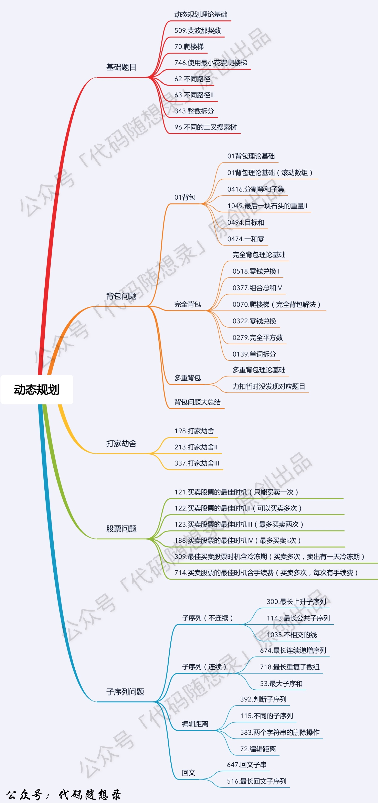

# 代码随想录算法总结(C++)版本——动态规划（一）

Created: September 2, 2022 1:06 PM

# 概述



**对于动态规划问题，我将拆解为如下五步曲，这五步都搞清楚了，才能说把动态规划真的掌握了！**

1. 确定dp数组（dp table）以及下标的含义
2. 确定递推公式
3. dp数组如何初始化
4. 确定遍历顺序
5. 举例推导dp数组

# 基础题目

## ****509. 斐波那契数****

**[力扣题目链接(opens new window)](https://leetcode-cn.com/problems/fibonacci-number/)**

斐波那契数，通常用 F(n) 表示，形成的序列称为 斐波那契数列 。该数列由 0 和 1 开始，后面的每一项数字都是前面两项数字的和。也就是： F(0) = 0，F(1) = 1 F(n) = F(n - 1) + F(n - 2)，其中 n > 1 给你n ，请计算 F(n) 。

示例 1：

- 输入：2
- 输出：1
- 解释：F(2) = F(1) + F(0) = 1 + 0 = 1
1. **确定dp数组以及下标的含义**

<aside>
🪁 dp[i]的定义为：第i个数的斐波那契数值是dp[i]

</aside>

**2.确定递推公式**

<aside>
🪁 **状态转移方程 dp[i] = dp[i - 1] + dp[i - 2];**

</aside>

**3. dp数组如何初始化**

```cpp
dp[0] = 0;
dp[1] = 1;
```

**4. 确定遍历顺序**

从递归公式dp[i] = dp[i - 1] + dp[i - 2];中可以看出，**dp[i]是依赖 dp[i - 1] 和 dp[i - 2]**，那么遍历的顺序一定是**从前到后遍历**的

**5. 举例推导dp数组**

0 1 1 2 3 5 8 13 21 34 55

**代码：**

```cpp
class Solution {
public:
    int fib(int N) {
        if (N <= 1) return N;
        vector<int> dp(N + 1);
        dp[0] = 0;
        dp[1] = 1;
        for (int i = 2; i <= N; i++) {
            dp[i] = dp[i - 1] + dp[i - 2];
        }
        return dp[N];
    }
};
```

```cpp
class Solution {
public:
    int fib(int N) {
        if (N <= 1) return N;
        int dp[2];
        dp[0] = 0;
        dp[1] = 1;
        for (int i = 2; i <= N; i++) {
            int sum = dp[0] + dp[1];
            dp[0] = dp[1];
            dp[1] = sum;
        }
        return dp[1];
    }
};
```

**递归：**

```cpp
class Solution {
public:
    int fib(int N) {
        if (N < 2) return N;
        return fib(N - 1) + fib(N - 2);
    }
};
```

## ****70. 爬楼梯****

**[力扣题目链接(opens new window)](https://leetcode-cn.com/problems/climbing-stairs/)**

假设你正在爬楼梯。需要 n 阶你才能到达楼顶。

每次你可以爬 1 或 2 个台阶。你有多少种不同的方法可以爬到楼顶呢？

注意：给定 n 是一个正整数。

示例 1：

- 输入： 2
- 输出： 2
- 解释： 有两种方法可以爬到楼顶。
    - 1 阶 + 1 阶
    - 2 阶
1. **确定dp数组以及下标的含义**

dp[i]： 爬到第i层楼梯，有dp[i]种方法

**2. 确定递推公式**

dp[i - 1]，上i-1层楼梯，有dp[i - 1]种方法，那么再一步跳一个台阶不就是dp[i]了

dp[i - 2]，上i-2层楼梯，有dp[i - 2]种方法，那么再一步跳两个台阶不就是dp[i]了

dp[i ]=dp[i - 1]+dp[i - 2];

**这里开始不好理解：比如你去北京必须从天津或者河北，那你去天津有5种办法，去河北有2种办法，那去北京肯定就是7种办法。**

**3. dp数组如何初始化**

**dp[1] = 1，dp[2] = 2**

```cpp
// 版本一
class Solution {
public:
    int climbStairs(int n) {
        if (n <= 1) return n; // 因为下面直接对dp[2]操作了，防止空指针
        vector<int> dp(n + 1);
        dp[1] = 1;
        dp[2] = 2;
        for (int i = 3; i <= n; i++) { // 注意i是从3开始的
            dp[i] = dp[i - 1] + dp[i - 2];
        }
        return dp[n];
    }
};
```

```cpp
// 版本二
class Solution {
public:
    int climbStairs(int n) {
        if (n <= 1) return n;
        int dp[3];
        dp[1] = 1;
        dp[2] = 2;
        for (int i = 3; i <= n; i++) {
            int sum = dp[1] + dp[2];
            dp[1] = dp[2];
            dp[2] = sum;
        }
        return dp[2];
    }
};
```

## ****746. 使用最小花费爬楼梯****

**[力扣题目链接(opens new window)](https://leetcode-cn.com/problems/min-cost-climbing-stairs/)**

数组的每个下标作为一个阶梯，第 i 个阶梯对应着一个非负数的体力花费值 cost[i]（下标从 0 开始）。

每当你爬上一个阶梯你都要花费对应的体力值，一旦支付了相应的体力值，你就可以选择向上爬一个阶梯或者爬两个阶梯。

请你找出达到楼层顶部的最低花费。在开始时，你可以选择从下标为 0 或 1 的元素作为初始阶梯。

示例 1：

输入：cost = [10, 15, 20] 输出：15 解释：最低花费是从 cost[1] 开始，然后走两步即可到阶梯顶，一共花费 15 。  示例 2：

输入：cost = [1, 100, 1, 1, 1, 100, 1, 1, 100, 1] 输出：6 解释：最低花费方式是从 cost[0] 开始，逐个经过那些 1 ，跳过 cost[3] ，一共花费 6 。

**1. 确定dp数组以及下标的含义**

**到达第i个台阶所花费的最少体力为dp[i]**

**2. 确定递推公式**

**可以有两个途径得到dp[i]，一个是dp[i-1] 一个是dp[i-2]**。那么究竟是选dp[i-1]还是dp[i-2]呢？一定是选最小的

**dp[i] = min(dp[i - 1], dp[i - 2]) + cost[i];//每当你爬上一个阶梯你都要花费对应的体力值**

**3. dp数组如何初始化**

```cpp
vector<int> dp(cost.size());
dp[0] = cost[0];
dp[1] = cost[1];
```

**4. 确定遍历顺序**

因为是模拟台阶，而且dp[i]又dp[i-1]dp[i-2]推出，所以是从前到后遍历cost数组

拿示例2：cost = [1, 100, 1, 1, 1, 100, 1, 1, 100, 1] ，来模拟一下dp数组的状态变化，如下：


```cpp
// 版本一
class Solution {
public:
    int minCostClimbingStairs(vector<int>& cost) {
        vector<int> dp(cost.size());
        dp[0] = cost[0];
        dp[1] = cost[1];
        for (int i = 2; i < cost.size(); i++) {
            dp[i] = min(dp[i - 1], dp[i - 2]) + cost[i];
        }
        //注意最后一步可以理解为不用花费，所以取倒数第一步，第二步的最少值
        return min(dp[cost.size() - 1], dp[cost.size() - 2]);
    }
};
```

```cpp
// 版本二
class Solution {
public:
    int minCostClimbingStairs(vector<int>& cost) {
        int dp0 = cost[0];
        int dp1 = cost[1];
        for (int i = 2; i < cost.size(); i++) {
            int dpi = min(dp0, dp1) + cost[i];
            dp0 = dp1; // 记录一下前两位
            dp1 = dpi;
        }
        return min(dp0, dp1);
    }
};
```

```cpp
class Solution {
public:
    int minCostClimbingStairs(vector<int>& cost) {
        vector<int> dp(cost.size() + 1);
        dp[0] = 0; // 默认第一步都是不花费体力的
        dp[1] = 0;
        for (int i = 2; i <= cost.size(); i++) {
            dp[i] = min(dp[i - 1] + cost[i - 1], dp[i - 2] + cost[i - 2]);
        }
        return dp[cost.size()];
    }
};
```

## ****62.不同路径****

**[力扣题目链接(opens new window)](https://leetcode-cn.com/problems/unique-paths/)**

一个机器人位于一个 m x n 网格的左上角 （起始点在下图中标记为 “Start” ）。

机器人每次只能向下或者向右移动一步。机器人试图达到网格的右下角（在下图中标记为 “Finish” ）。

问总共有多少条不同的路径？

示例 1：


- 输入：m = 3, n = 7
- 输出：28

示例 2：

- 输入：m = 2, n = 3
- 输出：3

解释： 从左上角开始，总共有 3 条路径可以到达右下角。

1. 向右 -> 向右 -> 向下
2. 向右 -> 向下 -> 向右
3. 向下 -> 向右 -> 向右

每次只能向下或者向右移动一步，那么其实**机器人走过的路径可以抽象为一棵二叉树，而叶子节点就是终点！**

如图举例：


求二叉树叶子节点的个数，代码如下：

```cpp
class Solution {
private:
    int dfs(int i, int j, int m, int n) {
        if (i > m || j > n) return 0; // 越界了
        if (i == m && j == n) return 1; // 找到一种方法，相当于找到了叶子节点
        return dfs(i + 1, j, m, n) + dfs(i, j + 1, m, n);
    }
public:
    int uniquePaths(int m, int n) {
        return dfs(1, 1, m, n);
    }
};
```

**动态规划：**

1. **确定dp数组（dp table）以及下标的含义**

dp[i][j] ：表示从（0 ，0）出发，到(i, j) 有dp[i][j]条不同的路径。

**2. 确定递推公式**

想要求dp[i][j]，只能有两个方向来推导出来，即dp[i - 1][j] 和 dp[i][j - 1]。

**3. dp数组的初始化**

首先dp[i][0]一定都是1，因为从(0, 0)的位置到(i, 0)的路径只有一条

```cpp
for (int i = 0; i < m; i++) dp[i][0] = 1;
for (int j = 0; j < n; j++) dp[0][j] = 1;
```

举例推导dp数组

如图所示：


以上动规五部曲分析完毕，C++代码如下：

```cpp
class Solution {
public:
    int uniquePaths(int m, int n) {
        vector<vector<int>> dp(m, vector<int>(n, 0));
        for (int i = 0; i < m; i++) dp[i][0] = 1;
        for (int j = 0; j < n; j++) dp[0][j] = 1;
        for (int i = 1; i < m; i++) {
            for (int j = 1; j < n; j++) {
                dp[i][j] = dp[i - 1][j] + dp[i][j - 1];
            }
        }
        return dp[m - 1][n - 1];
    }
};
```

一维，C++代码如下：

```cpp
class Solution {
public:
    int uniquePaths(int m, int n) {
        vector<int> dp(n);
        for (int i = 0; i < n; i++) dp[i] = 1;
        for (int j = 1; j < m; j++) {
            for (int i = 1; i < n; i++) {
                dp[i] += dp[i - 1];
            }
        }
        return dp[n - 1];
    }
};
```

**数学方法:**

一共m，n的话，无论怎么走，走到终点都需要 m + n - 2 步。

在这m + n - 2 步中，一定有 m - 1 步是要向下走的

那么答案，如图所示：


```cpp
//求组合的时候，要防止两个int相乘溢出！ 所以不能把算式的分子都算出来，分母都算出来再做除法。
//计算分子的时候，不断除以分母，代码如下：

class Solution {
public:
    int uniquePaths(int m, int n) {
        long long numerator = 1; // 分子
        int denominator = m - 1; // 分母
        int count = m - 1;
        int t = m + n - 2;
        while (count--) {
            numerator *= (t--);
            while (denominator != 0 && numerator % denominator == 0) {
                numerator /= denominator;
                denominator--;
            }
        }
        return numerator;
    }
};
```

## ****63. 不同路径 II****

**[力扣题目链接(opens new window)](https://leetcode-cn.com/problems/unique-paths-ii/)**

一个机器人位于一个 m x n 网格的左上角 （起始点在下图中标记为“Start” ）。

机器人每次只能向下或者向右移动一步。机器人试图达到网格的右下角（在下图中标记为“Finish”）。

现在考虑网格中有障碍物。那么从左上角到右下角将会有多少条不同的路径？

网格中的障碍物和空位置分别用 1 和 0 来表示。

示例 1：


有障碍的话，其实就是标记对应的dp为0

1. 确定dp数组（dp table）以及下标的含义

dp[i][j] ：表示从（0 ，0）出发，到(i, j) 有dp[i][j]条不同的路径。
2. 确定递推公式

dp[i][j] = dp[i - 1][j] + dp[i][j - 1]。

3. dp数组如何初始化

```cpp
vector<vector<int>> dp(m, vector<int>(n, 0));
for (int i = 0; i < m && obstacleGrid[i][0] == 0; i++) dp[i][0] = 1;
for (int j = 0; j < n && obstacleGrid[0][j] == 0; j++) dp[0][j] = 1;
```

4.确定遍历顺序

从递归公式dp[i][j] = dp[i - 1][j] + dp[i][j - 1] 中可以看出，一定是从左到右一层一层遍历

对应C++代码如下：

```cpp
class Solution {
public:
    int uniquePathsWithObstacles(vector<vector<int>>& obstacleGrid) {
        int m = obstacleGrid.size();
        int n = obstacleGrid[0].size();
        vector<vector<int>> dp(m, vector<int>(n, 0));
        for (int i = 0; i < m && obstacleGrid[i][0] == 0; i++) dp[i][0] = 1;
        for (int j = 0; j < n && obstacleGrid[0][j] == 0; j++) dp[0][j] = 1;
        for (int i = 1; i < m; i++) {
            for (int j = 1; j < n; j++) {
                if (obstacleGrid[i][j] == 1) continue;
                dp[i][j] = dp[i - 1][j] + dp[i][j - 1];
            }
        }
        return dp[m - 1][n - 1];
    }
};
```

空间优化版本：

```cpp
class Solution {
public:
    int uniquePathsWithObstacles(vector<vector<int>>& obstacleGrid) {
        if (obstacleGrid[0][0] == 1)
            return 0;
        vector<int> dp(obstacleGrid[0].size());
        for (int j = 0; j < dp.size(); ++j)
            if (obstacleGrid[0][j] == 1)
                dp[j] = 0;
            else if (j == 0)
                dp[j] = 1;
            else
                dp[j] = dp[j-1];

        for (int i = 1; i < obstacleGrid.size(); ++i)
            for (int j = 0; j < dp.size(); ++j){
                if (obstacleGrid[i][j] == 1)
                    dp[j] = 0;
                else if (j != 0)
                    dp[j] = dp[j] + dp[j-1];
            }
        return dp.back();
    }
};
```

## ****343. 整数拆分****

**[力扣题目链接(opens new window)](https://leetcode-cn.com/problems/integer-break/)**

给定一个正整数 n，将其拆分为至少两个正整数的和，并使这些整数的乘积最大化。 返回你可以获得的最大乘积。

示例 1:

- 输入: 2
- 输出: 1
- 解释: 2 = 1 + 1, 1 × 1 = 1。

示例 2:

- 输入: 10
- 输出: 36
- 解释: 10 = 3 + 3 + 4, 3 × 3 × 4 = 36。
- 说明: 你可以假设 n 不小于 2 且不大于 58。

**1. 确定dp数组（dp table）以及下标的含义**

dp[i]：分拆数字i，可以得到的最大乘积为dp[i]。

**2. 确定递推公式**

dp[i] = max(dp[i], max((i - j) * j, dp[i - j] * j));

**3. dp的初始化**

dp[2] = 1

**4. 确定遍历顺序**

遍历i一定是从前向后遍历，先有dp[i - j]再有dp[i]。

**5.举例推导**

当n为10 的时候，dp数组里的数值，如下：


C++代码如下：

```cpp
class Solution {
public:
    int integerBreak(int n) {
        vector<int> dp(n + 1);
        dp[2] = 1;
        for (int i = 3; i <= n ; i++) {
            for (int j = 1; j < i - 1; j++) {
                dp[i] = max(dp[i], max((i - j) * j, dp[i - j] * j));
            }
        }
        return dp[n];
    }
};
```

```cpp
class Solution {
public:
    int integerBreak(int n) {
        if (n <= 3) return 1 * (n - 1);
        vector<int> dp(n + 1, 0);
        dp[1] = 1;
        dp[2] = 2;
        dp[3] = 3;
        for (int i = 4; i <= n ; i++) {
            for (int j = 1; j < i - 1; j++) {
                dp[i] = max(dp[i], dp[i - j] * dp[j]);
            }
        }
        return dp[n];
    }
};
```

**贪心算法：**

```cpp
class Solution {
public:
    int integerBreak(int n) {
        if (n == 2) return 1;
        if (n == 3) return 2;
        if (n == 4) return 4;
        int result = 1;
        while (n > 4) {
            result *= 3;
            n -= 3;
        }
        result *= n;
        return result;
    }
};
```

## ****96.不同的二叉搜索树****

**[力扣题目链接(opens new window)](https://leetcode-cn.com/problems/unique-binary-search-trees/)**

给定一个整数 n，求以 1 ... n 为节点组成的二叉搜索树有多少种？

示例:


元素1为头结点搜索树的数量 = 右子树有2个元素的搜索树数量 * 左子树有0个元素的搜索树数量

元素2为头结点搜索树的数量 = 右子树有1个元素的搜索树数量 * 左子树有1个元素的搜索树数量

元素3为头结点搜索树的数量 = 右子树有0个元素的搜索树数量 * 左子树有2个元素的搜索树数量

有2个元素的搜索树数量就是dp[2]。

有1个元素的搜索树数量就是dp[1]。

有0个元素的搜索树数量就是dp[0]。

所以dp[3] = dp[2] * dp[0] + dp[1] * dp[1] + dp[0] * dp[2]

如图所示：


1. 确定dp数组（dp table）以及下标的含义

**dp[i] ： 1到i为节点组成的二叉搜索树的个数为dp[i]**。

1.  **确定递推公式**

dp[i] += dp[以j为头结点左子树节点数量] * dp[以j为头结点右子树节点数量]

dp[i] += dp[j - 1] * dp[i - j]; ，j-1 为j为头结点左子树节点数量，i-j 为以j为头结点右子树节点数量

**3. dp数组如何初始化**

dp[0] = 1

**4. 确定遍历顺序**

dp[i] += dp[j - 1] * dp[i - j]可以看出，节点数为i的状态是依靠 i之前节点数的状态。

那么遍历i里面每一个数作为头结点的状态，用j来遍历。

C++代码如下：

```cpp
class Solution {
public:
    int numTrees(int n) {
        vector<int> dp(n + 1);
        dp[0] = 1;
        for (int i = 1; i <= n; i++) {
            for (int j = 1; j <= i; j++) {
                dp[i] += dp[j - 1] * dp[i - j];
            }
        }
        return dp[n];
    }
};
```

#