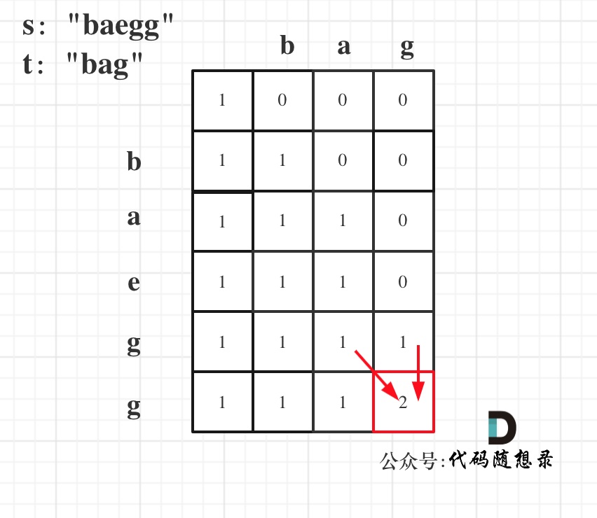

# 代码随想录算法总结(C++)版本——动态规划（三）

Created: September 2, 2022 1:06 PM

# 打家劫舍问题

## 打家劫舍

**[力扣题目链接(opens new window)](https://leetcode-cn.com/problems/house-robber/)**

你是一个专业的小偷，计划偷窃沿街的房屋。每间房内都藏有一定的现金，影响你偷窃的唯一制约因素就是相邻的房屋装有相互连通的防盗系统，如果两间相邻的房屋在同一晚上被小偷闯入，系统会自动报警。

给定一个代表每个房屋存放金额的非负整数数组，计算你 不触动警报装置的情况下 ，一夜之内能够偷窃到的最高金额。

示例 1： 输入：[1,2,3,1] 输出：4 解释：偷窃 1 号房屋 (金额 = 1) ，然后偷窃 3 号房屋 (金额 = 3)。   偷窃到的最高金额 = 1 + 3 = 4 。

1. 确定dp数组（dp table）以及下标的含义

**dp[i]：考虑下标i（包括i）以内的房屋，最多可以偷窃的金额为dp[i]**。

2. 确定递推公式

如果偷第i房间，那么dp[i] = dp[i - 2] + nums[i]

如果不偷第i房间，那么dp[i] = dp[i - 1]，即考虑i-1房

dp[i] = max(dp[i - 2] + nums[i], dp[i - 1]);

3. dp数组如何初始化

dp[0] 一定是 nums[0]，dp[1]就是nums[0]和nums[1]的最大值即：dp[1] = max(nums[0], nums[1]);

4. 确定遍历顺序

从前到后遍历

1. 举例推导dp数组

以示例二，输入[2,7,9,3,1]为例。


C++代码如下：

```cpp
class Solution {
public:
    int rob(vector<int>& nums) {
        if (nums.size() == 0) return 0;
        if (nums.size() == 1) return nums[0];
        vector<int> dp(nums.size());
        dp[0] = nums[0];
        dp[1] = max(nums[0], nums[1]);
        for (int i = 2; i < nums.size(); i++) {
            dp[i] = max(dp[i - 2] + nums[i], dp[i - 1]);
        }
        return dp[nums.size() - 1];
    }
};
```

## ****213.打家劫舍II****

**[力扣题目链接(opens new window)](https://leetcode-cn.com/problems/house-robber-ii/)**

你是一个专业的小偷，计划偷窃沿街的房屋，每间房内都藏有一定的现金。这个地方所有的房屋都 围成一圈 ，这意味着第一个房屋和最后一个房屋是紧挨着的。同时，相邻的房屋装有相互连通的防盗系统，如果两间相邻的房屋在同一晚上被小偷闯入，系统会自动报警 。

给定一个代表每个房屋存放金额的非负整数数组，计算你 在不触动警报装置的情况下 ，能够偷窃到的最高金额。

示例 1：

输入：nums = [2,3,2] 输出：3 解释：你不能先偷窃 1 号房屋（金额 = 2），然后偷窃 3 号房屋（金额 = 2）, 因为他们是相邻的。

示例 2： 输入：nums = [1,2,3,1] 输出：4 解释：你可以先偷窃 1 号房屋（金额 = 1），然后偷窃 3 号房屋（金额 = 3）。偷窃到的最高金额 = 1 + 3 = 4 。

对于一个数组，成环的话主要有如下三种情况：

- 情况一：考虑不包含首尾元素


- 情况二：考虑包含首元素，不包含尾元素


- 情况三：考虑包含尾元素，不包含首元素


**情况二 和 情况三 都包含了情况一了，所以只考虑情况二和情况三就可以了。**

```cpp
// 注意注释中的情况二情况三，以及把198.打家劫舍的代码抽离出来了
class Solution {
public:
    int rob(vector<int>& nums) {
        if (nums.size() == 0) return 0;
        if (nums.size() == 1) return nums[0];
        int result1 = robRange(nums, 0, nums.size() - 2); // 情况二
        int result2 = robRange(nums, 1, nums.size() - 1); // 情况三
        return max(result1, result2);
    }
    // 198.打家劫舍的逻辑
    int robRange(vector<int>& nums, int start, int end) {
        if (end == start) return nums[start];
        vector<int> dp(nums.size());
        dp[start] = nums[start];
        dp[start + 1] = max(nums[start], nums[start + 1]);
        for (int i = start + 2; i <= end; i++) {
            dp[i] = max(dp[i - 2] + nums[i], dp[i - 1]);
        }
        return dp[end];
    }
};
```

## ****337.打家劫舍 III****

**[力扣题目链接(opens new window)](https://leetcode-cn.com/problems/house-robber-iii/)**

在上次打劫完一条街道之后和一圈房屋后，小偷又发现了一个新的可行窃的地区。这个地区只有一个入口，我们称之为“根”。 除了“根”之外，每栋房子有且只有一个“父“房子与之相连。一番侦察之后，聪明的小偷意识到“这个地方的所有房屋的排列类似于一棵二叉树”。 如果两个直接相连的房子在同一天晚上被打劫，房屋将自动报警。

计算在不触动警报的情况下，小偷一晚能够盗取的最高金额。


**递归**

```cpp
class Solution {
public:
    int rob(TreeNode* root) {
        if (root == NULL) return 0;
        if (root->left == NULL && root->right == NULL) return root->val;
        // 偷父节点
        int val1 = root->val;
        if (root->left) val1 += rob(root->left->left) + rob(root->left->right); // 跳过root->left，相当于不考虑左孩子了
        if (root->right) val1 += rob(root->right->left) + rob(root->right->right); // 跳过root->right，相当于不考虑右孩子了
        // 不偷父节点
        int val2 = rob(root->left) + rob(root->right); // 考虑root的左右孩子
        return max(val1, val2);
    }
};
```

**记忆化递推**

```cpp
class Solution {
public:
    unordered_map<TreeNode* , int> umap; // 记录计算过的结果
    int rob(TreeNode* root) {
        if (root == NULL) return 0;
        if (root->left == NULL && root->right == NULL) return root->val;
        if (umap[root]) return umap[root]; // 如果umap里已经有记录则直接返回
        // 偷父节点
        int val1 = root->val;
        if (root->left) val1 += rob(root->left->left) + rob(root->left->right); // 跳过root->left
        if (root->right) val1 += rob(root->right->left) + rob(root->right->right); // 跳过root->right
        // 不偷父节点
        int val2 = rob(root->left) + rob(root->right); // 考虑root的左右孩子
        umap[root] = max(val1, val2); // umap记录一下结果
        return max(val1, val2);
    }
};
```

**动态规划：**

1. 确定递归函数的参数和返回值

要求一个节点 偷与不偷的两个状态所得到的金钱，那么返回值就是一个长度为2的数组

2. 确定终止条件

如果遇到空节点的话，很明显，无论偷还是不偷都是0，所以就返回

3. 确定遍历顺序

首先明确的是使用后序遍历。 因为通过**递归函数的返回值**来做下一步计算。

通过递归左节点，得到左节点偷与不偷的金钱。

通过递归右节点，得到右节点偷与不偷的金钱。

4. 确定单层递归的逻辑

left[0]代表不偷当前节点，left[1]代表偷当前节点

（1）偷当前节点，那么左右孩子就不能偷，val1 = cur->val + left[0] + right[0];

（2）不偷当前节点，那么左右孩子就可以偷，至于到底偷不偷一定是选一个最大的，所以：val2 = max(left[0], left[1]) + max(right[0], right[1]);

5.举例推导dp数组

以示例1为例，dp数组状态如下：（**注意用后序遍历的方式推导**）


**最后头结点就是 取下标0 和 下标1的最大值就是偷得的最大金钱**。

递归三部曲与动规五部曲分析完毕，C++代码如下：

```cpp
class Solution {
public:
    int rob(TreeNode* root) {
        vector<int> result = robTree(root);
        return max(result[0], result[1]);
    }
    // 长度为2的数组，0：不偷，1：偷
    vector<int> robTree(TreeNode* cur) {
        if (cur == NULL) return vector<int>{0, 0};
        vector<int> left = robTree(cur->left);
        vector<int> right = robTree(cur->right);
        // 偷cur
        int val1 = cur->val + left[0] + right[0];
        // 不偷cur
        int val2 = max(left[0], left[1]) + max(right[0], right[1]);
        return {val2, val1};
    }
};
```

# 股票问题

限制了交易笔数

## ****121. 买卖股票的最佳时机(一笔交易)****

**[力扣题目链接(opens new window)](https://leetcode-cn.com/problems/best-time-to-buy-and-sell-stock/)**

给定一个数组 prices ，它的第 i 个元素 prices[i] 表示一支给定股票第 i 天的价格。

你只能选择 某一天 买入这只股票，并选择在 未来的某一个不同的日子 卖出该股票。设计一个算法来计算你所能获取的最大利润。

返回你可以从这笔交易中获取的最大利润。如果你不能获取任何利润，返回 0 。

示例 1：输入：[7,1,5,3,6,4]输出：5解释：在第 2 天（股票价格 = 1）的时候买入，在第 5 天（股票价格 = 6）的时候卖出，最大利润 = 6-1 = 5 。注意利润不能是 7-1 = 6, 因为卖出价格需要大于买入价格；同时，你不能在买入前卖出股票。

**暴力:**

```cpp
class Solution {
public:
    int maxProfit(vector<int>& prices) {
        int result = 0;
        for (int i = 0; i < prices.size(); i++) {
            for (int j = i + 1; j < prices.size(); j++){
                result = max(result, prices[j] - prices[i]);
            }
        }
        return result;
    }
};
```

**贪心：**

```cpp
class Solution {
public:
    int maxProfit(vector<int>& prices) {
        int low = INT_MAX;
        int result = 0;
        for (int i = 0; i < prices.size(); i++) {
            low = min(low, prices[i]);  // 取最左最小价格
            result = max(result, prices[i] - low); // 直接取最大区间利润
        }
        return result;
    }
};
```

**动态规划：**

1. 确定dp数组（dp table）以及下标的含义

dp[i][0] 表示第i天**持有股票**所得最多现金

dp[i][1] 表示第i天**不持有**股票所得最多现金

2. 确定递推公式

**第i天持有股票即dp[i][0]， 那么可以由两个状态推出来：**

• 第i-1天就持有股票，那么就保持现状，所得现金就是昨天持有股票的所得现金 即：dp[i - 1][0]

• 第i天买入股票，所得现金就是买入今天的股票后所得现金即：-prices[i]

dp[i][0] = max(dp[i - 1][0], -prices[i]);

**如果第i天不持有股票即dp[i][1]， 也可以由两个状态推出来**

- 第i-1天就不持有股票，那么就保持现状，所得现金就是昨天不持有股票的所得现金 即：dp[i - 1][1]
- 第i天卖出股票，所得现金就是按照今天股票佳价格卖出后所得现金即：prices[i] + dp[i - 1][0]

dp[i][1] = max(dp[i - 1][1], prices[i] + dp[i - 1][0]);

**3. dp数组如何初始化**

基础都是要从dp[0][0]和dp[0][1]推导出来，

dp[0][0] = -prices[0];dp[0][1] = 0;

4. 确定遍历顺序

从前向后遍历

5.举例推导dp数组

以示例1，输入：[7,1,5,3,6,4]为例，dp数组状态如下：


C++代码如下：

```cpp
// 版本一
class Solution {
public:
    int maxProfit(vector<int>& prices) {
        int len = prices.size();
        if (len == 0) return 0;
        vector<vector<int>> dp(len, vector<int>(2));
        dp[0][0] -= prices[0];
        dp[0][1] = 0;
        for (int i = 1; i < len; i++) {
            dp[i][0] = max(dp[i - 1][0], -prices[i]);
            dp[i][1] = max(dp[i - 1][1], prices[i] + dp[i - 1][0]);
        }
        return dp[len - 1][1];
    }
};
```

可以使用滚动数组来节省空间，代码如下：

```cpp
// 版本二
class Solution {
public:
    int maxProfit(vector<int>& prices) {
        int len = prices.size();
        vector<vector<int>> dp(2, vector<int>(2)); // 注意这里只开辟了一个2 * 2大小的二维数组
        dp[0][0] -= prices[0];
        dp[0][1] = 0;
        for (int i = 1; i < len; i++) {
            dp[i % 2][0] = max(dp[(i - 1) % 2][0], -prices[i]);
            dp[i % 2][1] = max(dp[(i - 1) % 2][1], prices[i] + dp[(i - 1) % 2][0]);
        }
        return dp[(len - 1) % 2][1];
    }
};
```

## ****122.买卖股票的最佳时机II（多笔交易）****

**[力扣题目链接(opens new window)](https://leetcode-cn.com/problems/best-time-to-buy-and-sell-stock-ii/)**

给定一个数组，它的第 i 个元素是一支给定股票第 i 天的价格。

设计一个算法来计算你所能获取的最大利润。你可以尽可能地完成更多的交易（多次买卖一支股票）。

注意：你不能同时参与多笔交易（你必须在再次购买前出售掉之前的股票）。

示例 1:输入: [7,1,5,3,6,4]输出: 7解释: 在第 2 天（股票价格 = 1）的时候买入，在第 3 天（股票价格 = 5）的时候卖出, 这笔交易所能获得利润 = 5-1 = 4。随后，在第 4 天（股票价格 = 3）的时候买入，在第 5 天（股票价格 = 6）的时候卖出, 这笔交易所能获得利润 = 6-3 = 3 。

- **dp[i][0] 表示第i天持有股票所得现金。**
- **dp[i][1] 表示第i天不持有股票所得最多现金**

与之前不同的**就是推导dp[i][0]的时候，第i天买入股票的情况：**

又原来的 **- prices[i]**变成了**dp[i - 1][1]- prices[i]**

由于之前只能购买一次，所以只要没持有，那么过去就肯定没有盈亏

现在可以购买多次，那么买了之后，要加上过去的盈亏。

```cpp
class Solution {
public:
    int maxProfit(vector<int>& prices) {
        int len = prices.size();
        vector<vector<int>> dp(len, vector<int>(2, 0));
        dp[0][0] -= prices[0];
        dp[0][1] = 0;
        for (int i = 1; i < len; i++) {
            dp[i][0] = max(dp[i - 1][0], dp[i - 1][1] - prices[i]); // 注意这里是和121. 买卖股票的最佳时机唯一不同的地方。
            dp[i][1] = max(dp[i - 1][1], dp[i - 1][0] + prices[i]);
        }
        return dp[len - 1][1];
    }
};
```

```cpp
// 版本二
class Solution {
public:
    int maxProfit(vector<int>& prices) {
        int len = prices.size();
        vector<vector<int>> dp(2, vector<int>(2)); // 注意这里只开辟了一个2 * 2大小的二维数组
        dp[0][0] -= prices[0];
        dp[0][1] = 0;
        for (int i = 1; i < len; i++) {
            dp[i % 2][0] = max(dp[(i - 1) % 2][0], dp[(i - 1) % 2][1] - prices[i]);
            dp[i % 2][1] = max(dp[(i - 1) % 2][1], prices[i] + dp[(i - 1) % 2][0]);
        }
        return dp[(len - 1) % 2][1];
    }
};
```

## ****123.买卖股票的最佳时机III（两笔交易）****

**[力扣题目链接(opens new window)](https://leetcode-cn.com/problems/best-time-to-buy-and-sell-stock-iii/)**

给定一个数组，它的第 i 个元素是一支给定的股票在第 i 天的价格。

设计一个算法来计算你所能获取的最大利润。你最多可以完成 两笔 交易。

注意：你不能同时参与多笔交易（你必须在再次购买前出售掉之前的股票）。

示例 1: 输入：prices = [3,3,5,0,0,3,1,4] 输出：6 解释：在第 4 天（股票价格 = 0）的时候买入，在第 6 天（股票价格 = 3）的时候卖出，这笔交易所能获得利润 = 3-0 = 3 。随后，在第 7 天（股票价格 = 1）的时候买入，在第 8 天 （股票价格 = 4）的时候卖出，这笔交易所能获得利润 = 4-1 = 3。

1. **确定dp数组以及下标的含义**

一天一共就有五个状态，

1. 没有操作
2. 第一次买入
3. 第一次卖出
4. 第二次买入
5. 第二次卖出

2. 确定递推公式

dp[i][1]状态，有两个具体操作：

- 操作一：第i天买入股票了，那么dp[i][1] = dp[i-1][0] - prices[i]
- 操作二：第i天没有操作，而是沿用前一天买入的状态，即：dp[i][1] = dp[i - 1][1]
    
    **dp[i][1] = max(dp[i-1][0] - prices[i], dp[i - 1][1]);**
    

dp[i][2]也有两个操作：

- 操作一：第i天卖出股票了，那么dp[i][2] = dp[i - 1][1] + prices[i]
- 操作二：第i天没有操作，沿用前一天卖出股票的状态，即：dp[i][2] = dp[i - 1][2]
    
    **dp[i][2] = max(dp[i - 1][1] + prices[i], dp[i - 1][2])**
    

同理可推出剩下状态部分：

dp[i][3] = max(dp[i - 1][3], dp[i - 1][2] - prices[i]);

dp[i][4] = max(dp[i - 1][4], dp[i - 1][3] + prices[i]);

**3. dp数组如何初始化**

第0天没有操作:          **dp[0][0] = 0;**

第0天做第一次买入:  **dp[0][1] = -prices[0];**

第0天做第一次卖出:  **dp[0][2] = 0;**

第0天做第二次买入:  **dp[0][3] = -prices[0];**

第0天做第二次卖出:  **dp[0][4] = 0;**

**4. 确定遍历顺序**

从前向后遍历，因为dp[i]，依靠dp[i - 1]的数值。

1. 举例推导dp数组

以输入[1,2,3,4,5]为例


```cpp
// 版本一
class Solution {
public:
    int maxProfit(vector<int>& prices) {
        if (prices.size() == 0) return 0;
        vector<vector<int>> dp(prices.size(), vector<int>(5, 0));
        dp[0][1] = -prices[0];
        dp[0][3] = -prices[0];
        for (int i = 1; i < prices.size(); i++) {
            dp[i][0] = dp[i - 1][0];
            dp[i][1] = max(dp[i - 1][1], dp[i - 1][0] - prices[i]);
            dp[i][2] = max(dp[i - 1][2], dp[i - 1][1] + prices[i]);
            dp[i][3] = max(dp[i - 1][3], dp[i - 1][2] - prices[i]);
            dp[i][4] = max(dp[i - 1][4], dp[i - 1][3] + prices[i]);
        }
        return dp[prices.size() - 1][4];
    }
};
```

```cpp
// 版本二
class Solution {
public:
    int maxProfit(vector<int>& prices) {
        if (prices.size() == 0) return 0;
        vector<int> dp(5, 0);
        dp[1] = -prices[0];
        dp[3] = -prices[0];
        for (int i = 1; i < prices.size(); i++) {
            dp[1] = max(dp[1], dp[0] - prices[i]);
            dp[2] = max(dp[2], dp[1] + prices[i]);
            dp[3] = max(dp[3], dp[2] - prices[i]);
            dp[4] = max(dp[4], dp[3] + prices[i]);
        }
        return dp[4];
    }
};
```

## ****188.买卖股票的最佳时机IV（k笔交易）****

**[力扣题目链接(opens new window)](https://leetcode-cn.com/problems/best-time-to-buy-and-sell-stock-iv/)**

给定一个整数数组 prices ，它的第 i 个元素 prices[i] 是一支给定的股票在第 i 天的价格。

设计一个算法来计算你所能获取的最大利润。你最多可以完成 k 笔交易。

注意：你不能同时参与多笔交易（你必须在再次购买前出售掉之前的股票）。

示例 1： 输入：k = 2, prices = [2,4,1] 输出：2 解释：在第 1 天 (股票价格 = 2) 的时候买入，在第 2 天 (股票价格 = 4) 的时候卖出，这笔交易所能获得利润 = 4-2 = 2。

1. 确定dp数组以及下标的含义

二维数组 dp[i][j] ：第i天的状态为j，所剩下的最大现金是dp[i][j]；

j的状态表示为：**偶数就是卖出，奇数就是买入**

- 0 表示不操作
- 1 第一次买入
- 2 第一次卖出
- 3 第二次买入
- 4 第二次卖出
- .....
- 

2. 确定递推公式

dp[i][1]状态，有两个具体操作：

- 操作一：第i天买入股票了，那么dp[i][1] = dp[i - 1][0] - prices[i]
- 操作二：第i天没有操作，而是沿用前一天买入的状态，即：dp[i][1] = dp[i - 1][1]

同理dp[i][2]也有两个操作：

- 操作一：第i天卖出股票了，那么dp[i][2] = dp[i - 1][1] + prices[i]
- 操作二：第i天没有操作，沿用前一天卖出股票的状态，即：dp[i][2] = dp[i - 1][2]

3. dp数组如何初始化

第0天没有操作，这个最容易想到，就是0，即：dp[0][0] = 0;

第0天做第一次买入的操作，dp[0][1] = -prices[0];

第0天做第一次卖出的操作，dp[0][2] = 0;

以此类推，卖出就是0，买入就-prices[0];

4. 确定遍历顺序

一定是从前向后遍历，因为dp[i]，依靠dp[i - 1]的数值。

[1,2,3,4,5]，k=2为例。


最后一次卖出，一定是利润最大的，dp[prices.size() - 1][2 * k]即红色部分就是最后求解:

这是因为每一个状态都会包含上一个状态的最大值。

C++代码如下：

```cpp
class Solution {
public:
    int maxProfit(int k, vector<int>& prices) {

        if (prices.size() == 0) return 0;
        vector<vector<int>> dp(prices.size(), vector<int>(2 * k + 1, 0));
        for (int j = 1; j < 2 * k; j += 2) {
            dp[0][j] = -prices[0];
        }
        for (int i = 1;i < prices.size(); i++) {
            for (int j = 0; j < 2 * k - 1; j += 2) {
                dp[i][j + 1] = max(dp[i - 1][j + 1], dp[i - 1][j] - prices[i]);
                dp[i][j + 2] = max(dp[i - 1][j + 2], dp[i - 1][j + 1] + prices[i]);
            }
        }
        return dp[prices.size() - 1][2 * k];
    }
};
```

```cpp
class Solution {
public:
    int maxProfit(int k, vector<int>& prices) {
        if(prices.size()==0) return 0;
        
        //i天，j次数，k持股状态
        //[0]:不持有，[1]:持有
        vector<vector<vector<int>>> dp(prices.size(),vector<vector<int>>(k+1,vector<int>(2,0)));
        //初始化第一天
        for(int i=1;i<k+1;i++){
            dp[0][i][1]=-prices[0];
        }
        for(int i=1;i<prices.size();i++){
            for(int j=1;j<k+1;j++){               
                dp[i][j][0]=max(dp[i-1][j][0],dp[i-1][j][1]+prices[i]);//前一天就不持有，那么保持前一天的状态，或者前一天持有，今天卖出
                dp[i][j][1]=max(dp[i-1][j][1],dp[i-1][j-1][0]-prices[i]);//前一天就持有，今天继续持有，前一天不持有，并且完成了k-1次的操作，今天买入
            }
        }
        return dp[prices.size()-1][k][0];
    }
};
```

## ****309.最佳买卖股票时机含冷冻期****

**[力扣题目链接(opens new window)](https://leetcode-cn.com/problems/best-time-to-buy-and-sell-stock-with-cooldown/)**

给定一个整数数组，其中第 i 个元素代表了第 i 天的股票价格 。

设计一个算法计算出最大利润。在满足以下约束条件下，你可以尽可能地完成更多的交易（多次买卖一支股票）:

- 你不能同时参与多笔交易（你必须在再次购买前出售掉之前的股票）。
- 卖出股票后，你无法在第二天买入股票 (即冷冻期为 1 天)。

示例: 输入: [1,2,3,0,2] 输出: 3 解释: 对应的交易状态为: [买入, 卖出, 冷冻期, 买入, 卖出]

1. **确定dp数组以及下标的含义**

dp[i][j]，第i天状态为j，所剩的最多现金为dp[i][j]。

具体可以区分出如下四个状态：

- 状态一：买入股票状态（今天买入股票，或者是之前就买入了股票然后没有操作）
- 卖出股票状态，这里就有两种卖出股票状态
    - 状态二：两天前就卖出了股票，度过了冷冻期，一直没操作，今天保持卖出股票状态
    - 状态三：今天卖出了股票
- 状态四：今天为冷冻期状态，但冷冻期状态不可持续，只有一天！

j的状态为：

- 0：状态一
- 1：状态二
- 2：状态三
- 3：状态四

**2. 确定递推公式**

买入股票状态（状态一）即：dp[i][0]，有两个具体操作：

- 操作一：前一天就是持有股票状态（状态一），dp[i][0] = dp[i - 1][0]
- 操作二：今天买入了，有两种情况
    - 前一天是冷冻期（状态四），dp[i - 1][3] - prices[i]
    - 前一天是保持卖出股票状态（状态二），dp[i - 1][1] - prices[i]

**所以操作二取最大值，即**

**dp[i][0] = max(dp[i - 1][0], max(dp[i - 1][3], dp[i - 1][1]) - prices[i]);**

保持卖出股票状态（状态二）即：dp[i][1]，有两个具体操作：

- 操作一：前一天就是状态二
- 操作二：前一天是冷冻期（状态四）
    
    **dp[i][1] = max(dp[i - 1][1], dp[i - 1][3]);**
    

今天就卖出股票状态（状态三），即：dp[i][2] ，只有一个操作：

- 操作一：昨天一定是买入股票状态（状态一），今天卖出

即：dp[i][2] = dp[i - 1][0] + prices[i];

达到冷冻期状态（状态四），即：dp[i][3]，只有一个操作：

- 操作一：昨天卖出了股票（状态三）

dp[i][3] = dp[i - 1][2];

3. dp数组如何初始化

这里主要讨论一下第0天如何初始化。

如果是持有股票状态（状态一）那么：dp[0][0] = -prices[0]，买入股票所剩现金为负数。

保持卖出股票状态（状态二），第0天没有卖出dp[0][1]初始化为0就行，

今天卖出了股票（状态三），同样dp[0][2]初始化为0，因为最少收益就是0，绝不会是负数。

同理dp[0][3]也初始为0。

**4. 确定遍历顺序**

dp[i] 依赖于 dp[i-1]，所以是从前向后遍历。

5. 举例推导dp数组

以 [1,2,3,0,2] 为例，dp数组如下：


```cpp
class Solution {
public:
    int maxProfit(vector<int>& prices) {
        if(prices.size()==0) return 0;
        vector<vector<int>> dp(prices.size(),vector<int>(4,0));
        dp[0][0]=-prices[0];//持有股票
        dp[0][1]=0;//昨天前就卖出了
        dp[0][2]=0;//今天卖出
        dp[0][3]=0;//冷冻期(昨天卖出)

        for(int i=1;i<prices.size();i++){
            /*持有股票
            1.昨天就持有
            2.昨天是冷冻期，今天买入
            3.昨天前就卖出了，今天也可以买入
            */
            dp[i][0]=max(dp[i-1][0],max(dp[i-1][3],dp[i-1][1])-prices[i]);
            /*
            1.昨天前就卖出了，今天继续保持
            2.昨天是冷冻状态，今天就变成； 状态二
            */
            dp[i][1]=max(dp[i-1][1],dp[i-1][3]);
              /*
            1.昨天是持有股票的，今天可以卖出
            */
            dp[i][2]=dp[i-1][0]+prices[i];
              /*
            1.昨天刚迈出，今天就是冷冻期。
            */
            dp[i][3]=dp[i-1][2];
        }
        //今天可能处于，冷冻期，刚卖出，或者昨天天就卖出了的状态
        return max(dp[prices.size()-1][1],max(dp[prices.size()-1][2],dp[prices.size()-1][3]));
    }
};
```

## ****714.买卖股票的最佳时机含手续费(无限次交易)****

**[力扣题目链接(opens new window)](https://leetcode-cn.com/problems/best-time-to-buy-and-sell-stock-with-transaction-fee/)**

给定一个整数数组 prices，其中第 i 个元素代表了第 i 天的股票价格 ；非负整数 fee 代表了交易股票的手续费用。

你可以无限次地完成交易，但是你每笔交易都需要付手续费。如果你已经购买了一个股票，在卖出它之前你就不能再继续购买股票了。

返回获得利润的最大值。

注意：这里的一笔交易指买入持有并卖出股票的整个过程，每笔交易你只需要为支付一次手续费。

示例 1: 输入: prices = [1, 3, 2, 8, 4, 9], fee = 2 输出: 8

解释: 能够达到的最大利润: 在此处买入 prices[0] = 1 在此处卖出 prices[3] = 8 在此处买入 prices[4] = 4 在此处卖出 prices[5] = 9 总利润: ((8 - 1) - 2) + ((9 - 4) - 2) = 8.

```cpp
class Solution {
public:
    int maxProfit(vector<int>& prices, int fee) {
        int n = prices.size();
        vector<vector<int>> dp(n, vector<int>(2, 0));
        dp[0][0] -= prices[0]; // 持股票
        for (int i = 1; i < n; i++) {
            dp[i][0] = max(dp[i - 1][0], dp[i - 1][1] - prices[i]);
            dp[i][1] = max(dp[i - 1][1], dp[i - 1][0] + prices[i] - fee);
        }
        return max(dp[n - 1][0], dp[n - 1][1]);
    }
};
```

# 子序列问题

## ****300.最长递增子序列****

**[力扣题目链接(opens new window)](https://leetcode-cn.com/problems/longest-increasing-subsequence/)**

给你一个整数数组 nums ，找到其中最长严格递增子序列的长度。

子序列是由数组派生而来的序列，删除（或不删除）数组中的元素而不改变其余元素的顺序。例如，[3,6,2,7] 是数组 [0,3,1,6,2,2,7] 的子序列。

示例 1： 输入：nums = [10,9,2,5,3,7,101,18] 输出：4 解释：最长递增子序列是 [2,3,7,101]，因此长度为 4 。

1. dp[i]的定义

**dp[i]表示i之前包括i的以nums[i]结尾最长上升子序列的长度**

1. 状态转移方程

位置i的最长升序子序列等于j从0到i-1各个位置的最长升序子序列 + 1 的最大值。

1. dp[i]的初始化

每一个i，对应的dp[i]（即最长上升子序列）起始大小至少都是1.

1. 确定遍历顺序

dp[i] 是有0到i-1各个位置的最长升序子序列 推导而来，那么遍历i一定是从前向后遍历。

1. 举例推导dp数组

[0,1,0,3,2]，dp数组的变化如下：


C++代码如下：

```cpp
class Solution {
public:
    int lengthOfLIS(vector<int>& nums) {
        if (nums.size() <= 1) return nums.size();
        vector<int> dp(nums.size(), 1);
        int result = 0;
        for (int i = 1; i < nums.size(); i++) {
            for (int j = 0; j < i; j++) {
                if (nums[i] > nums[j]) dp[i] = max(dp[i], dp[j] + 1);
            }
            if (dp[i] > result) result = dp[i]; // 取长的子序列
        }
        return result;
    }
};
```

## ****674. 最长连续递增序列****

**[力扣题目链接(opens new window)](https://leetcode-cn.com/problems/longest-continuous-increasing-subsequence/)**

给定一个未经排序的整数数组，找到最长且 连续递增的子序列，并返回该序列的长度。

连续递增的子序列 可以由两个下标 l 和 r（l < r）确定，如果对于每个 l <= i < r，都有 nums[i] < nums[i + 1] ，那么子序列 [nums[l], nums[l + 1], ..., nums[r - 1], nums[r]] 就是连续递增子序列。

示例 1： 输入：nums = [1,3,5,4,7] 输出：3 解释：最长连续递增序列是 [1,3,5], 长度为3。 尽管 [1,3,5,7] 也是升序的子序列, 但它不是连续的，因为 5 和 7 在原数组里被 4 隔开。

1. 确定dp数组（dp table）以及下标的含义

**dp[i]：以下标i为结尾的数组的连续递增的子序列长度为dp[i]**。

2. 确定递推公式

dp[i + 1] = dp[i] + 1;

注意：因为连续递增子序列，所以就必要比较nums[i + 1]与nums[i]，而不用去比较nums[j]与nums[i]。因为一旦nums[i]>nums[i + 1],这就不是递增序列了。

1. dp数组如何初始化

以下标i为结尾的数组的连续递增的子序列长度最少也应该是1，即就是nums[i]这一个元素。

1. 确定遍历顺序

从递推公式上可以看出， dp[i + 1]依赖dp[i]，所以一定是从前向后遍历。

1. 举例推导dp数组

已输入nums = [1,3,5,4,7]为例，dp数组状态如下：


C++代码如下：

```cpp
class Solution {
public:
    int findLengthOfLCIS(vector<int>& nums) {
        if (nums.size() == 0) return 0;
        int result = 1;
        vector<int> dp(nums.size() ,1);
        for (int i = 0; i < nums.size() - 1; i++) {
            if (nums[i + 1] > nums[i]) { // 连续记录
                dp[i + 1] = dp[i] + 1;
            }
            if (dp[i + 1] > result) result = dp[i + 1];
        }
        return result;
    }
};
```

## ****718. 最长重复子数组****

**[力扣题目链接(opens new window)](https://leetcode-cn.com/problems/maximum-length-of-repeated-subarray/)**

给两个整数数组 A 和 B ，返回两个数组中公共的、长度最长的子数组的长度。

示例：

输入： A: [1,2,3,2,1] B: [3,2,1,4,7] 输出：3 解释： 长度最长的公共子数组是 [3, 2, 1] 。

1. **确定dp数组（dp table）以及下标的含义**

dp[i][j] ：以下标i - 1为结尾的A，和以下标j - 1为结尾的B，最长重复子数组长度为dp[i][j]。

**2. 确定递推公式**

当A[i - 1] 和B[j - 1]相等的时候，dp[i][j] = dp[i - 1][j - 1] + 1;

**3. dp数组如何初始化**

dp[i][0] 和dp[0][j]初始化为0

4. 确定遍历顺序

外层for循环遍历A，内层for循环遍历B,或者反过来都一样，因为与AB顺序无关。

5.举例推导dp数组

拿示例1中，A: [1,2,3,2,1]，B: [3,2,1,4,7]为例，画一个dp数组的状态变化，如下：


C++代码如下：

```cpp
class Solution {
public:
    int findLength(vector<int>& nums1, vector<int>& nums2) {
        vector<vector<int>> dp(nums1.size()+1,vector<int>(nums2.size()+1,0));
        int result=0;     
        //dp[0][0]没有物理意义，一个有效的起点
        for(int i=1;i<=nums1.size();i++){
            for(int j=1;j<=nums2.size();j++){
                //如果当前这个对应位置相等，那么连续子序列，在前一个位置的基础上+1；
                if(nums1[i-1]==nums2[j-1]){
                    //这保证了连续
                    //dp[i][j]的意思是，以nums1[i-1]和nums2[j-1]结尾的最长连续子序列
                    dp[i][j]=dp[i-1][j-1]+1;
                }
                if(dp[i][j]>result) result=dp[i][j];
            }
        }
        return result;
    }
};
```

## ****1143.最长公共子序列****

**[力扣题目链接(opens new window)](https://leetcode-cn.com/problems/longest-common-subsequence/)**

给定两个字符串 text1 和 text2，返回这两个字符串的最长公共子序列的长度。

一个字符串的 子序列 是指这样一个新的字符串：它是由原字符串在不改变字符的相对顺序的情况下删除某些字符（也可以不删除任何字符）后组成的新字符串。

例如，"ace" 是 "abcde" 的子序列，但 "aec" 不是 "abcde" 的子序列。两个字符串的「公共子序列」是这两个字符串所共同拥有的子序列。

若这两个字符串没有公共子序列，则返回 0。

示例 1:

输入：text1 = "abcde", text2 = "ace"输出：3解释：最长公共子序列是 "ace"，它的长度为 3。

**这里不要求是连续的了，但要有相对顺序**

1. 确定dp数组（dp table）以及下标的含义

dp[i][j]：长度为[0, i - 1]的字符串text1与长度为[0, j - 1]的字符串text2的最长公共子序列为dp[i][j]

2. 确定递推公式

如果text1[i - 1] 与 text2[j - 1]相同，那么找到了一个公共元素，所以dp[i][j] = dp[i - 1][j - 1] + 1;

如果text1[i - 1] 与 text2[j - 1]不相同，那就看看text1[0, i - 2]与text2[0, j - 1]的最长公共子序列 和 text1[0, i - 1]与text2[0, j - 2]的最长公共子序列，取最大的。

即：dp[i][j] = max(dp[i - 1][j], dp[i][j - 1]);

3. dp数组如何初始化

dp[i][0] = 0;dp[0][j]也是0。

4.确定遍历顺序

从递推公式，可以看出，有三个方向可以推出dp[i][j]，如图：


1. 举例推导dp数组

以输入：text1 = "abcde", text2 = "ace" 为例，dp状态如图：


C++代码如下：

```cpp
class Solution {
public:
    int longestCommonSubsequence(string text1, string text2) {
        vector<vector<int>> dp(text1.size()+1,vector<int>(text2.size()+1,0));
        for(int i=1;i<=text1.size();i++){
            for(int j=1;j<=text2.size();j++){
                if(text1[i-1]==text2[j-1]){
                    dp[i][j]=dp[i-1][j-1]+1;
                }    
                else{
                    //如果不相同，那么看前面那个字符，那个公共序列比较长
                    dp[i][j]=max(dp[i-1][j],dp[i][j-1]);
                }
            }
        }
        return dp[text1.size()][text2.size()];
    }
};
```

## ****1035.不相交的线****

**[力扣题目链接(opens new window)](https://leetcode-cn.com/problems/uncrossed-lines/)**

我们在两条独立的水平线上按给定的顺序写下 A 和 B 中的整数。

现在，我们可以绘制一些连接两个数字 A[i] 和 B[j] 的直线，只要 A[i] == B[j]，且我们绘制的直线不与任何其他连线（非水平线）相交。

以这种方法绘制线条，并返回我们可以绘制的最大连线数。


拿示例一A = [1,4,2], B = [1,2,4]为例，相交情况如图：


其实也就是说A和B的最长公共子序列是[1,4]，长度为2。 这个公共子序列指的是相对顺序不变（即数字4在字符串A中数字1的后面，那么数字4也应该在字符串B数字1的后面）

这么分析完之后，大家可以发现：**本题说是求绘制的最大连线数，其实就是求两个字符串的最长公共子序列的长度！**

## ****53. 最大子序和****

**[力扣题目链接(opens new window)](https://leetcode-cn.com/problems/maximum-subarray/)**

给定一个整数数组 nums ，找到一个具有最大和的连续子数组（子数组最少包含一个元素），返回其最大和。

示例: 输入: [-2,1,-3,4,-1,2,1,-5,4] 输出: 6 解释: 连续子数组 [4,-1,2,1] 的和最大，为 6。

1. 确定dp数组（dp table）以及下标的含义

**dp[i]：包括下标i之前的最大连续子序列和为dp[i]**。

2. 确定递推公式

dp[i]只有两个方向可以推出来：

- dp[i - 1] + nums[i]，即：nums[i]加入当前连续子序列和
- nums[i]，即：从头开始计算当前连续子序列和

3. dp数组如何初始化

dp[0] = nums[0]。

1. 确定遍历顺序

递推公式中dp[i]依赖于dp[i - 1]的状态，需要从前向后遍历。

5.举例推导dp数组

以示例一为例，输入：nums = [-2,1,-3,4,-1,2,1,-5,4]，对应的dp状态如下：


完整代码如下：

```cpp
class Solution {
public:
    int maxSubArray(vector<int>& nums) {
        if (nums.size() == 0) return 0;
        vector<int> dp(nums.size());
        dp[0] = nums[0];
        int result = dp[0];
        for (int i = 1; i < nums.size(); i++) {
            dp[i] = max(dp[i - 1] + nums[i], nums[i]); // 状态转移公式
            if (dp[i] > result) result = dp[i]; // result 保存dp[i]的最大值
        }
        return result;
    }
};
```

## ****392.判断子序列****

**[力扣题目链接(opens new window)](https://leetcode-cn.com/problems/is-subsequence/)**

给定字符串 s 和 t ，判断 s 是否为 t 的子序列。

字符串的一个子序列是原始字符串删除一些（也可以不删除）字符而不改变剩余字符相对位置形成的新字符串。（例如，"ace"是"abcde"的一个子序列，而"aec"不是）。

示例 1： 输入：s = "abc", t = "ahbgdc" 输出：true

示例 2： 输入：s = "axc", t = "ahbgdc" 输出：false

1. 确定dp数组（dp table）以及下标的含义

**dp[i][j] 表示以下标i-1为结尾的字符串s，和以下标j-1为结尾的字符串t，相同子序列的长度为dp[i][j]**。

1. 确定递推公式

在确定递推公式的时候，首先要考虑如下两种操作，整理如下：

- if (s[i - 1] == t[j - 1])
    - t中找到了一个字符在s中也出现了。**dp[i][j] = dp[i - 1][j - 1] + 1;**
- if (s[i - 1] != t[j - 1])
    - 相当于t要删除元素，继续匹配，dp[i][j] = dp[i][j - 1];

3. dp数组如何初始化

如图：


1. 确定遍历顺序

同理从递推公式可以看出dp[i][j]都是依赖于dp[i - 1][j - 1] 和 dp[i][j - 1]，那么遍历顺序也应该是从上到下，从左到右

如图所示：


1. 举例推导dp数组

以示例一为例，输入：s = "abc", t = "ahbgdc"，dp状态转移图如下：


C++代码如下：

```cpp
class Solution {
public:
    bool isSubsequence(string s, string t) {
        vector<vector<int>> dp(s.size() + 1, vector<int>(t.size() + 1, 0));
        for (int i = 1; i <= s.size(); i++) {
            for (int j = 1; j <= t.size(); j++) {
                if (s[i - 1] == t[j - 1]) dp[i][j] = dp[i - 1][j - 1] + 1;
                else dp[i][j] = dp[i][j - 1];
            }
        }
        if (dp[s.size()][t.size()] == s.size()) return true;
        return false;
    }
};
```

## ****115.不同的子序列****

**[力扣题目链接(opens new window)](https://leetcode-cn.com/problems/distinct-subsequences/)**

给定一个字符串 s 和一个字符串 t ，计算在 s 的子序列中 t 出现的个数。

字符串的一个 子序列 是指，通过删除一些（也可以不删除）字符且不干扰剩余字符相对位置所组成的新字符串。（例如，"ACE" 是 "ABCDE" 的一个子序列，而 "AEC" 不是）

题目数据保证答案符合 32 位带符号整数范围。


1. **确定dp数组（dp table）以及下标的含义**

**dp[i][j]：以i-1为结尾的s子序列中出现以j-1为结尾的t的个数为dp[i][j]。**

1. **确定递推公式**

这一类问题，基本是要分析两种情况

- s[i - 1] 与 t[j - 1]相等
- s[i - 1] 与 t[j - 1] 不相等

当s[i - 1] 与 t[j - 1]相等时，dp[i][j]可以有两部分组成。

一部分是用s[i - 1]来匹配，那么个数为dp[i - 1][j - 1]。

一部分是不用s[i - 1]来匹配，个数为dp[i - 1][j]。

s[i - 1] 与 t[j - 1]不相等时，dp[i][j]只有一部分组成，不用s[i - 1]来匹配，即：dp[i - 1][j]

所以递推公式为：dp[i][j] = dp[i - 1][j];

**3.dp数组如何初始化**

dp[i][0] 表示：以i-1为结尾的s可以随便删除元素，出现空字符串的个数。

dp[i][0]一定都是1，因为也就是把以i-1为结尾的s，删除所有元素，出现空字符串的个数就是1。

dp[0][j]一定都是0，s如论如何也变成不了t。

dp[0][0]应该是1，空字符串s，可以删除0个元素，变成空字符串t。

**4.确定遍历顺序**

遍历的时候一定是从上到下，从左到右

5.举例推导dp数组

以s："baegg"，t："bag"为例，推导dp数组状态如下：



代码如下：

```cpp
class Solution {
public:
    int numDistinct(string s, string t) {
        vector<vector<uint64_t>> dp(s.size()+1,vector<uint64_t>(t.size()+1));
        for(int i=0;i<s.size();i++) dp[i][0]=1;//表示匹配空字符串只有一种方案
        for(int i=1;i<t.size();i++) dp[0][i]=0;//用空字符串无法匹配非空字符串
        //dp[0][0]=1;//空字符串和空字符串有一种方案
        //dp[i][j]：以i-1为结尾的s子序列中出现以j-1为结尾的t的个数为dp[i][j]。
        for(int i=1;i<=s.size();i++){
            for(int j=1;j<=t.size();j++){
                if(s[i-1]==t[j-1]){
                    //s:abagg   t=bag 
                    //用s[i - 1]来匹配
                    //不用s[i - 1]来匹配，个数为dp[i - 1][j]
                    dp[i][j]=dp[i-1][j-1]+dp[i-1][j];
                }else{
                    dp[i][j]=dp[i-1][j];
                }
            }
        }
        return dp[s.size()][t.size()];
    }
};
```

## ****583. 两个字符串的删除操作****

给定两个单词 word1 和 word2，找到使得 word1 和 word2 相同所需的最小步数，每步可以删除任意一个字符串中的一个字符。

示例：

输入: "sea", "eat"输出: 2 解释: 第一步将"sea"变为"ea"，第二步将"eat"变为"ea"

1. 确定dp数组（dp table）以及下标的含义

dp[i][j]：以i-1为结尾的字符串word1，和以j-1位结尾的字符串word2，想要达到相等，所需要删除元素的最少次数。

1. 确定递推公式
- 当word1[i - 1] 与 word2[j - 1]相同的时候
    
    dp[i][j] = dp[i - 1][j - 1];
    
- 当word1[i - 1] 与 word2[j - 1]不相同的时候,有三种情况：
    
    情况一：删word1[i - 1]，最少操作次数为dp[i - 1][j] + 1
    
    情况二：删word2[j - 1]，最少操作次数为dp[i][j - 1] + 1
    
    情况三：同时删word1[i - 1]和word2[j - 1]，操作的最少次数为dp[i - 1][j - 1] + 2
    
    递推公式：dp[i][j] = min({dp[i - 1][j - 1] + 2, dp[i - 1][j] + 1, dp[i][j - 1] + 1});
    

3.dp数组如何初始化

dp[i][0]：word2为空字符串，以i-1为结尾的字符串word1要删除多少个元素，才能和word2相同呢，很明显dp[i][0] = i,dp[0][j]的话同理。

4. 确定遍历顺序

一定是从上到下，从左到右，这样保证dp[i][j]可以根据之前计算出来的数值进行计算。

1. 举例推导dp数组

以word1:"sea"，word2:"eat"为例，推导dp数组状态图如下：


代码如下：

```cpp
class Solution {
public:
    int minDistance(string word1, string word2) {
        vector<vector<int>> dp(word1.size() + 1, vector<int>(word2.size() + 1));
        for(int i=0;i<=word1.size();i++) dp[i][0]=i;//删成空字符串才能使得相同
        for(int i=0;i<=word2.size();i++) dp[0][i]=i;
        //以i-1为结尾的字符串word1，和以j-1位结尾的字符串word2，想要达到相等，所需要删除元素的最少次数。
        for(int i=1;i<=word1.size();i++){
            for(int j=1;j<=word2.size();j++){
                if(word1[i-1]==word2[j-1]){
                    dp[i][j]=dp[i-1][j-1];//相同，说明不需要删除
                }else{
                    //1.把i-1和j-1都删了
                    //2.把i-1删了
                    //3.把j-1删了
                    dp[i][j]=min({dp[i-1][j-1]+2,dp[i-1][j]+1,dp[i][j-1]+1});
                }
            }
        }

        return dp[word1.size()][word2.size()];
    }
};
```

只要求出两个字符串的最长公共子序列长度即可，那么除了最长公共子序列之外的字符都是必须删除的，最后用两个字符串的总长度减去两个最长公共子序列的长度就是删除的最少步数。

代码如下：

```cpp
class Solution {
public:
    int minDistance(string word1, string word2) {
        vector<vector<int>> dp(word1.size()+1, vector<int>(word2.size()+1, 0));
        for (int i=1; i<=word1.size(); i++){
            for (int j=1; j<=word2.size(); j++){
                if (word1[i-1] == word2[j-1]) dp[i][j] = dp[i-1][j-1] + 1;
                else dp[i][j] = max(dp[i-1][j], dp[i][j-1]);
            }
        }
        return word1.size()+word2.size()-dp[word1.size()][word2.size()]*2;
    }
};
```

## ****72. 编辑距离****

**[力扣题目链接(opens new window)](https://leetcode-cn.com/problems/edit-distance/)**

给你两个单词 word1 和 word2，请你计算出将 word1 转换成 word2 所使用的最少操作数 。

你可以对一个单词进行如下三种操作：

- 插入一个字符
- 删除一个字符
- 替换一个字符

示例 1： 输入：word1 = "horse", word2 = "ros" 输出：3 解释： horse -> rorse (将 'h' 替换为 'r') rorse -> rose (删除 'r') rose -> ros (删除 'e')

****1. 确定dp数组（dp table）以及下标的含义****

d**p[i][j] 表示以下标i-1为结尾的字符串word1，和以下标j-1为结尾的字符串word2，最近编辑距离为dp[i][j]。**

****2. 确定递推公式****

```cpp
if (word1[i - 1] == word2[j - 1])
    dp[i][j] = dp[i - 1][j - 1];//不操作
if (word1[i - 1] != word2[j - 1])
    增
    删
    换
```

- 操作一：word1删除一个元素，那么就是以下标i - 2为结尾的word1 与 j-1为结尾的word2的最近编辑距离 再加上一个操作。

即 `dp[i][j] = dp[i - 1][j] + 1;`

- 操作二：word2删除一个元素，那么就是以下标i - 1为结尾的word1 与 j-2为结尾的word2的最近编辑距离 再加上一个操作。

即 `dp[i][j] = dp[i][j - 1] + 1;`

操作三：替换元素，`word1`替换`word1[i - 1]`，使其与`word2[j - 1]`相同，此时不用增加元素，那么以下标`i-2`为结尾的`word1` 与 `j-2`为结尾的`word2`的最近编辑距离 加上一个替换元素的操作。

即 `dp[i][j] = dp[i - 1][j - 1] + 1;`

综上，当 `if (word1[i - 1] != word2[j - 1])` 时取最小的，即：`dp[i][j] = min({dp[i - 1][j - 1], dp[i - 1][j], dp[i][j - 1]}) + 1;`

****3. dp数组如何初始化****

dp[i][0] = i;dp[0][j] = j;

****4. 确定遍历顺序****

dp矩阵中一定是从左到右从上到下去遍历。

如图：


****5. 举例推导dp数组****

输入：`word1 = "horse", word2 = "ros"`为例，dp矩阵状态图如下：


C++代码如下：

```cpp
class Solution {
public:
    int minDistance(string word1, string word2) {
        vector<vector<int>> dp(word1.size() + 1, vector<int>(word2.size() + 1, 0));
        for (int i = 0; i <= word1.size(); i++) dp[i][0] = i;
        for (int j = 0; j <= word2.size(); j++) dp[0][j] = j;
        for (int i = 1; i <= word1.size(); i++) {
            for (int j = 1; j <= word2.size(); j++) {
                if (word1[i - 1] == word2[j - 1]) {
                    dp[i][j] = dp[i - 1][j - 1];
                }
                else {
                    dp[i][j] = min({dp[i - 1][j - 1], dp[i - 1][j], dp[i][j - 1]}) + 1;
                }
            }
        }
        return dp[word1.size()][word2.size()];
    }
};
```

## ****647. 回文子串****

**[力扣题目链接(opens new window)](https://leetcode-cn.com/problems/palindromic-substrings/)**

给定一个字符串，你的任务是计算这个字符串中有多少个回文子串。

具有不同开始位置或结束位置的子串，即使是由相同的字符组成，也会被视作不同的子串。

示例 1：

输入："abc" 输出：3 解释：三个回文子串: "a", "b", "c"

示例 2：

输入："aaa" 输出：6 解释：6个回文子串: "a", "a", "a", "aa", "aa", "aaa"

1. 确定dp数组（dp table）以及下标的含义

布尔类型的dp[i][j]：表示区间范围[i,j] （注意是左闭右闭）的子串是否是回文子串，如果是dp[i][j]为true，否则为false。

2. 确定递推公式

当s[i]与s[j]不相等，那没啥好说的了，dp[i][j]一定是false。

当s[i]与s[j]相等时，这就复杂一些了，有如下三种情况

- 情况一：下标i 与 j相同，同一个字符例如a，当然是回文子串
- 情况二：下标i 与 j相差为1，例如aa，也是回文子串
- 情况三：下标：i 与 j相差大于1的时候，例如cabac，此时s[i]与s[j]已经相同了，我们看i到j区间是不是回文子串就看aba是不是回文就可以了，那么aba的区间就是 i+1 与 j-1区间，这个区间是不是回文就看dp[i + 1][j - 1]是否为true。

3. dp数组如何初始化

dp[i][j]初始化为false。

4. 确定遍历顺序

情况三是根据dp[i + 1][j - 1]是否为true，在对dp[i][j]进行赋值true的。

dp[i + 1][j - 1] 在 dp[i][j]的左下角，如图：


**一定要从下到上，从左到右遍历，这样保证dp[i + 1][j - 1]都是经过计算的**

1. 举例推导dp数组

举例，输入："aaa"，dp[i][j]状态如下：


**注意因为dp[i][j]的定义，所以j一定是大于等于i的，那么在填充dp[i][j]的时候一定是只填充右上半部分**。

以上分析完毕，C++代码如下：

```cpp
class Solution {
public:
    int countSubstrings(string s) {
        vector<vector<bool>> dp(s.size(),vector<bool>(s.size(),false));
        int result=0;
        for(int i=s.size()-1;i>=0;i--){
            for(int j=i;j<s.size();j++){
                if(s[i]!=s[j]){
                    //一定是false
                }
                else{
                    if(j-i<=1){//中间没有元素或者只有一个元素，两边又相等
                        result++;
                        dp[i][j]=true;
                        //看中间的是不是回文串
                    }else if(dp[i+1][j-1]){
                        result++;
                        dp[i][j]=true;
                    }
                }
            }
        }
        return result;
    }
};
```

以上代码是为了凸显情况一二三，当然是可以简洁一下的，如下：

```cpp
class Solution {
public:
    int countSubstrings(string s) {
        vector<vector<bool>> dp(s.size(), vector<bool>(s.size(), false));
        int result = 0;
        for (int i = s.size() - 1; i >= 0; i--) {
            for (int j = i; j < s.size(); j++) {
                if (s[i] == s[j] && (j - i <= 1 || dp[i + 1][j - 1])) {
                    result++;
                    dp[i][j] = true;
                }
            }
        }
        return result;
    }
};
```

## ****516.最长回文子序列****

**[力扣题目链接(opens new window)](https://leetcode-cn.com/problems/longest-palindromic-subsequence/)**

给定一个字符串 s ，找到其中最长的回文子序列，并返回该序列的长度。可以假设 s 的最大长度为 1000 。

示例 1: 输入: "bbbab" 输出: 4 一个可能的最长回文子序列为 "bbbb"。

示例 2: 输入:"cbbd" 输出: 2 一个可能的最长回文子序列为 "bb"。

1. 确定dp数组（dp table）以及下标的含义

**dp[i][j]：字符串s在[i, j]范围内最长的回文子序列的长度为dp[i][j]**。

1. 确定递推公式

在判断回文子串的题目中，关键逻辑就是看s[i]与s[j]是否相同。

如果s[i]与s[j]相同，那么dp[i][j] = dp[i + 1][j - 1] + 2;

如图：


（如果这里看不懂，回忆一下dp[i][j]的定义）

如果s[i]与s[j]不相同，说明s[i]和s[j]的同时加入 并不能增加[i,j]区

那么分别加入s[i]、s[j]看看哪一个可以组成最长的回文子序列。

加入s[j]的回文子序列长度为dp[i + 1][j]。

加入s[i]的回文子序列长度为dp[i][j - 1]。

那么dp[i][j]一定是取最大的，即：dp[i][j] = max(dp[i + 1][j], dp[i][j - 1]);


1. dp数组如何初始化

当i与j相同，那么dp[i][j]一定是等于1的，即：一个字符的回文子序列长度就是1。

1. 确定遍历顺序

从递推公式dp[i][j] = dp[i + 1][j - 1] + 2 和 dp[i][j] = max(dp[i + 1][j], dp[i][j - 1]) 可以看出，dp[i][j]是依赖于dp[i + 1][j - 1] 和 dp[i + 1][j]，

**所以遍历i的时候一定要从下到上遍历，这样才能保证，下一行的数据是经过计算的。**

1. 举例推导dp数组

输入s:"cbbd" 为例，dp数组状态如图：


C++代码如下：

```cpp
class Solution {
public:
    int longestPalindromeSubseq(string s) {
        vector<vector<int>> dp(s.size(),vector<int>(s.size(),0));
        for(int i=0;i<s.size();i++) dp[i][i]=1;
        //字符串s在[i, j]范围内最长的回文子序列的长度为dp[i][j]。
        
        //从下到上遍历
        for(int i=s.size()-1;i>=0;i--){
            //因为i=j时候，一定是1，所以从i+1开始
            for(int j=i+1;j<s.size();j++){
                //cout<<"s[i]:"<<s[i];
                //cout<<"---s[j]:"<<s[j]<<endl;
                //s = "bbbab"
                //s[i]=a
                //s[j]=b
                if(s[i]==s[j]){
                    dp[i][j]=dp[i+1][j-1]+2;     
                }else{
                    dp[i][j]=max(dp[i+1][j],dp[i][j-1]);
                }
            }
        }
        return dp[0][s.size()-1];
    }
};
```