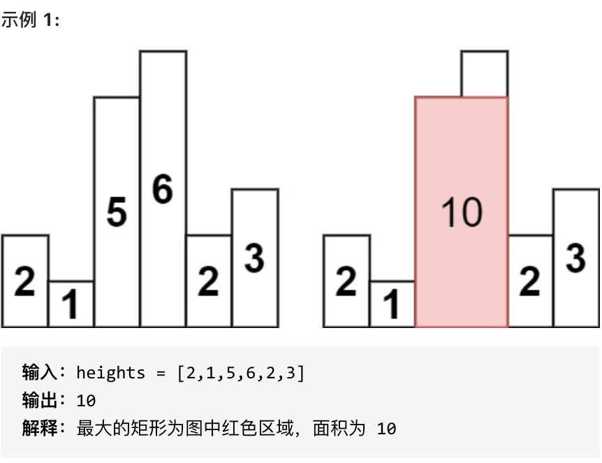

# 代码随想录算法总结(C++)版本——单调栈

Created: September 2, 2022 1:06 PM

# **739. 每日温度**

**[力扣题目链接(opens new window)](https://leetcode-cn.com/problems/daily-temperatures/)**

请根据每日 气温 列表，重新生成一个列表。对应位置的输出为：要想观测到更高的气温，至少需要等待的天数。如果气温在这之后都不会升高，请在该位置用 0 来代替。

例如，给定一个列表 temperatures = [73, 74, 75, 71, 69, 72, 76, 73]，你的输出应该是 [1, 1, 4, 2, 1, 1, 0, 0]。

提示：气温 列表长度的范围是 [1, 30000]。每个气温的值的均为华氏度，都是在 [30, 100] 范围内的整数。

- 情况一：当前遍历的元素T[i]小于栈顶元素T[st.top()]的情况
- 情况二：当前遍历的元素T[i]等于栈顶元素T[st.top()]的情况
- 情况三：当前遍历的元素T[i]大于栈顶元素T[st.top()]的情况

C++代码如下：

```cpp
class Solution {
public:
    vector<int> dailyTemperatures(vector<int>& temperatures) {
        stack<int> st;
        vector<int> result(temperatures.size(),0);
        st.push(0);//第一个元素的入栈
        /*
        情况一：当前遍历的元素T[i]小于栈顶元素T[st.top()]的情况
        情况二：当前遍历的元素T[i]等于栈顶元素T[st.top()]的情况
        情况三：当前遍历的元素T[i]大于栈顶元素T[st.top()]的情况
        */
        //st是一个递增栈
        //从栈头到栈底的顺序,栈顶元素小于等于下面的元素
        for(int i=1;i<temperatures.size();i++){
            if(temperatures[i]<temperatures[st.top()]){//当前元素小于栈顶元素，
            st.push(i);//所以，小的入栈
            }else if(temperatures[i]==temperatures[st.top()]){
            st.push(i);//所以，相等也入栈的入栈
            }else{//如果大于，那说明，那么上一个元素只需要隔一天就可以找到比他高的 ,i保持不变，看前面还有几个比它小的
            //从而确定多少天后，会有更高的温度
                    while(!st.empty()&&temperatures[i]>temperatures[st.top()]){
                        result[st.top()]=i-st.top();
                        st.pop();
                    }
                    //直到i比前面的数大于等于
                    st.push(i);
            }
        }
        return result;
    }
};
```

# ****496.下一个更大元素 I****

**[力扣题目链接(opens new window)](https://leetcode-cn.com/problems/next-greater-element-i/)**

给你两个 没有重复元素 的数组 nums1 和 nums2 ，其中nums1 是 nums2 的子集。

请你找出 nums1 中每个元素在 nums2 中的下一个比其大的值。

nums1 中数字 x 的下一个更大元素是指 x 在 nums2 中对应位置的右边的第一个比 x 大的元素。如果不存在，对应位置输出 -1 。

示例 1:

输入: nums1 = [4,1,2], nums2 = [1,3,4,2].输出: [-1,3,-1]

接下来就要分析如下三种情况，一定要分析清楚。

1. 情况一：当前遍历的元素T[i]小于栈顶元素T[st.top()]的情况

此时满足递增栈（栈头到栈底的顺序），所以直接入栈。

1. 情况二：当前遍历的元素T[i]等于栈顶元素T[st.top()]的情况

如果相等的话，依然直接入栈，因为我们要求的是右边第一个比自己大的元素，而不是大于等于！

1. 情况三：当前遍历的元素T[i]大于栈顶元素T[st.top()]的情况

此时如果入栈就不满足递增栈了，这也是找到右边第一个比自己大的元素的时候。

判断栈顶元素是否在nums1里出现过，（注意栈里的元素是nums2的元素），如果出现过，开始记录结果。

```cpp
class Solution {
public:
    vector<int> nextGreaterElement(vector<int>& nums1, vector<int>& nums2) {
        stack<int> st;
        vector<int> result(nums1.size(),-1);
        
        unordered_map<int,int> umap;//key：元素值，value：下标
        for(int i=0;i<nums1.size();i++){
            umap[nums1[i]]=i;
            /*
            2:0
            4:1
            */
        }
        st.push(0);//建立一个递增栈，最小的放最下面，先把第一个放进去
        for(int i=1;i<nums2.size();i++){
            if(nums2[i]<=nums2[st.top()]){//小于等于，都入栈
                st.push(i);
            }else{
                while(!st.empty()&&nums2[i]>nums2[st.top()]){
                    //找到了比上一个元素大的元素
                    if(umap.count(nums2[st.top()])>0){//map是否有st.top()这个元素
                        int index=umap[nums2[st.top()]];//找到这个值在nums1的下标
                        result[index]=nums2[i];
                    }
                    st.pop();
                }
                st.push(i);
            }
        }
        return result;
    }
};
```

# ****503.下一个更大元素II****

**[力扣题目链接(opens new window)](https://leetcode-cn.com/problems/next-greater-element-ii/)**

给定一个循环数组（最后一个元素的下一个元素是数组的第一个元素），输出每个元素的下一个更大元素。数字 x 的下一个更大的元素是按数组遍历顺序，这个数字之后的第一个比它更大的数，这意味着你应该循环地搜索它的下一个更大的数。如果不存在，则输出 -1。

示例 1:

- 输入: [1,2,1]
- 输出: [2,-1,2]
- 解释: 第一个 1 的下一个更大的数是 2；数字 2 找不到下一个更大的数；第二个 1 的下一个最大的数需要循环搜索，结果也是 2。

```cpp
// 版本一
class Solution {
public:
    vector<int> nextGreaterElements(vector<int>& nums) {
        // 拼接一个新的nums
        vector<int> nums1(nums.begin(), nums.end());
        nums.insert(nums.end(), nums1.begin(), nums1.end());
        // 用新的nums大小来初始化result
        vector<int> result(nums.size(), -1);
        if (nums.size() == 0) return result;

        // 开始单调栈
        stack<int> st;
        for (int i = 0; i < nums.size(); i++) {
            while (!st.empty() && nums[i] > nums[st.top()]) {//nums[i]比栈顶元素大，
                result[st.top()] = nums[i];//那么比栈顶大的就是nums[i]
                st.pop();
            }
            st.push(i);
        }
        // 最后再把结果集即result数组resize到原数组大小
        result.resize(nums.size() / 2);
        return result;
    }
};
```

**走两遍**

```cpp
// 版本二
class Solution {
public:
    vector<int> nextGreaterElements(vector<int>& nums) {
        vector<int> result(nums.size(), -1);
        if (nums.size() == 0) return result;
        stack<int> st;
        for (int i = 0; i < nums.size() * 2; i++) {
            // 模拟遍历两边nums，注意一下都是用i % nums.size()来操作
            while (!st.empty() && nums[i % nums.size()] > nums[st.top()]) {
                result[st.top()] = nums[i % nums.size()];
                st.pop();
            }
            st.push(i % nums.size());
        }
        return result;
    }
};
```

# ****42. 接雨水****

**[力扣题目链接(opens new window)](https://leetcode-cn.com/problems/trapping-rain-water/)**

给定 n 个非负整数表示每个宽度为 1 的柱子的高度图，计算按此排列的柱子，下雨之后能接多少雨水。

示例 1：


- 输入：height = [0,1,0,2,1,0,1,3,2,1,2,1]
- 输出：6
- 解释：上面是由数组 [0,1,0,2,1,0,1,3,2,1,2,1] 表示的高度图，在这种情况下，可以接 6 个单位的雨水（蓝色部分表示雨水）。

**双指针：**

```cpp
class Solution {
public:
    int trap(vector<int>& height) {
        int sum = 0;
        for (int i = 0; i < height.size(); i++) {
            // 第一个柱子和最后一个柱子不接雨水
            if (i == 0 || i == height.size() - 1) continue;

            int rHeight = height[i]; // 记录右边柱子的最高高度
            int lHeight = height[i]; // 记录左边柱子的最高高度
            for (int r = i + 1; r < height.size(); r++) {
                if (height[r] > rHeight) rHeight = height[r];
            }
            for (int l = i - 1; l >= 0; l--) {
                if (height[l] > lHeight) lHeight = height[l];
            }
            int h = min(lHeight, rHeight) - height[i];
            if (h > 0) sum += h;
        }
        return sum;
    }
};
```

****动态规划解法:****

```cpp
class Solution {
public:
    int trap(vector<int>& height) {
        if (height.size() <= 2) return 0;
        vector<int> maxLeft(height.size(), 0);
        vector<int> maxRight(height.size(), 0);
        int size = maxRight.size();

        // 记录每个柱子左边柱子最大高度
        maxLeft[0] = height[0];
        for (int i = 1; i < size; i++) {
            maxLeft[i] = max(height[i], maxLeft[i - 1]);
        }
        // 记录每个柱子右边柱子最大高度
        maxRight[size - 1] = height[size - 1];
        for (int i = size - 2; i >= 0; i--) {
            maxRight[i] = max(height[i], maxRight[i + 1]);
        }
        // 求和
        int sum = 0;
        for (int i = 0; i < size; i++) {
            int count = min(maxLeft[i], maxRight[i]) - height[i];
            if (count > 0) sum += count;
        }
        return sum;
    }
};
```

****单调栈解法:****

```cpp
class Solution {
public:
    int trap(vector<int>& height) {
        if (height.size() <= 2) return 0; // 可以不加
        stack<int> st; // 存着下标，计算的时候用下标对应的柱子高度
        st.push(0);
        int sum = 0;
        for (int i = 1; i < height.size(); i++) {
            if (height[i] < height[st.top()]) {     // 情况一
                st.push(i);
            } if (height[i] == height[st.top()]) {  // 情况二
                st.pop(); // 其实这一句可以不加，效果是一样的，但处理相同的情况的思路却变了。
                st.push(i);
            } else {                                // 情况三
                while (!st.empty() && height[i] > height[st.top()]) { // 注意这里是while
                    int mid = st.top();
                    st.pop();
                    if (!st.empty()) {
                        int h = min(height[st.top()], height[i]) - height[mid];
                        int w = i - st.top() - 1; // 注意减一，只求中间宽度
                        sum += h * w;
                    }
                }
                st.push(i);
            }
        }
        return sum;
    }
};
```

# ****84.柱状图中最大的矩形****

**[力扣题目链接(opens new window)](https://leetcode-cn.com/problems/largest-rectangle-in-histogram/)**

给定 n 个非负整数，用来表示柱状图中各个柱子的高度。每个柱子彼此相邻，且宽度为 1 。

求在该柱状图中，能够勾勒出来的矩形的最大面积。



**双指针法：超时**

```cpp
class Solution {
public:
    int largestRectangleArea(vector<int>& heights) {
        int sum = 0;
        for (int i = 0; i < heights.size(); i++) {
            int left = i;
            int right = i;
            for (; left >= 0; left--) {
                if (heights[left] < heights[i]) break;
            }
            for (; right < heights.size(); right++) {
                if (heights[right] < heights[i]) break;
            }
            int w = right - left - 1;
            int h = heights[i];
            sum = max(sum, w * h);
        }
        return sum;
    }
};
```

****动态规划:****

```cpp
class Solution {
public:
    int largestRectangleArea(vector<int>& heights) {
        vector<int> minLeftIndex(heights.size());
        vector<int> minRightIndex(heights.size());
        int size = heights.size();

        // 记录每个柱子 左边第一个小于该柱子的下标
        minLeftIndex[0] = -1; // 注意这里初始化，防止下面while死循环
        for (int i = 1; i < size; i++) {
            int t = i - 1;
            // 这里不是用if，而是不断向左寻找的过程
            while (t >= 0 && heights[t] >= heights[i]) t = minLeftIndex[t];
            minLeftIndex[i] = t;
        }
        // 记录每个柱子 右边第一个小于该柱子的下标
        minRightIndex[size - 1] = size; // 注意这里初始化，防止下面while死循环
        for (int i = size - 2; i >= 0; i--) {
            int t = i + 1;
            // 这里不是用if，而是不断向右寻找的过程
            while (t < size && heights[t] >= heights[i]) t = minRightIndex[t];
            minRightIndex[i] = t;
        }
        // 求和
        int result = 0;
        for (int i = 0; i < size; i++) {
            int sum = heights[i] * (minRightIndex[i] - minLeftIndex[i] - 1);
            result = max(sum, result);
        }
        return result;
    }
};
```

**单调栈:**

```cpp
// 版本一
class Solution {
public:
    int largestRectangleArea(vector<int>& heights) {
        stack<int> st;
        heights.insert(heights.begin(), 0); // 数组头部加入元素0
        heights.push_back(0); // 数组尾部加入元素0
        st.push(0);
        int result = 0;
        // 第一个元素已经入栈，从下标1开始
        for (int i = 1; i < heights.size(); i++) {
            // 注意heights[i] 是和heights[st.top()] 比较 ，st.top()是下标
            if (heights[i] > heights[st.top()]) {
                st.push(i);
            } else if (heights[i] == heights[st.top()]) {
                st.pop(); // 这个可以加，可以不加，效果一样，思路不同
                st.push(i);
            } else {
                while (heights[i] < heights[st.top()]) { // 注意是while
                    int mid = st.top();
                    st.pop();
                    int left = st.top();
                    int right = i;
                    int w = right - left - 1;
                    int h = heights[mid];
                    result = max(result, w * h);
                }
                st.push(i);
            }
        }
        return result;
    }
};

```

代码精简之后：

```cpp
// 版本二
class Solution {
public:
    int largestRectangleArea(vector<int>& heights) {
        stack<int> st;
        heights.insert(heights.begin(), 0); // 数组头部加入元素0
        heights.push_back(0); // 数组尾部加入元素0
        st.push(0);
        int result = 0;
        for (int i = 1; i < heights.size(); i++) {
            while (heights[i] < heights[st.top()]) {
                int mid = st.top();
                st.pop();
                int w = i - st.top() - 1;
                int h = heights[mid];
                result = max(result, w * h);
            }
            st.push(i);
        }
        return result;
    }
};
```