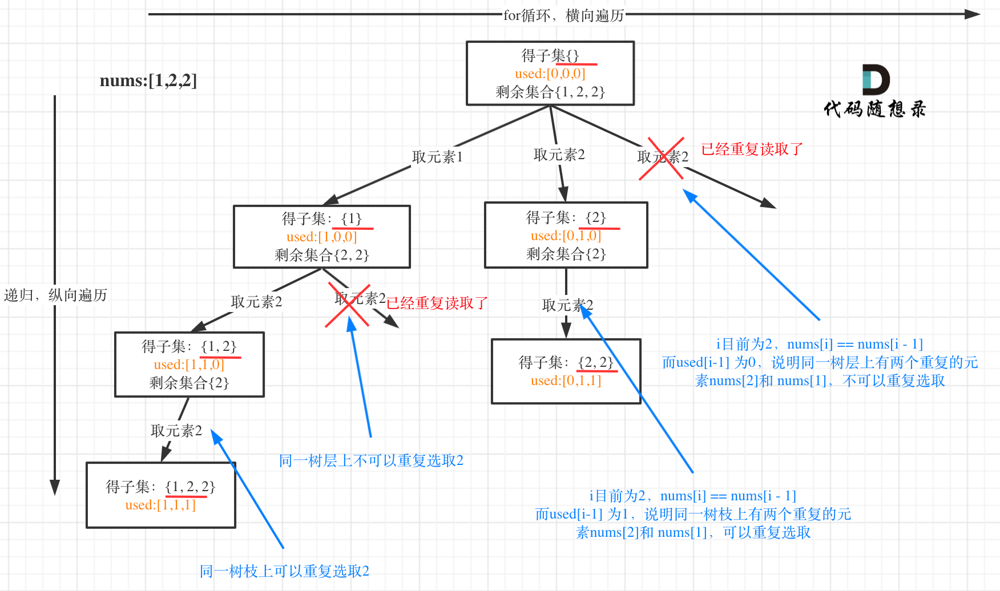

# 代码随想录算法总结(C++)版本——回溯

Created: September 2, 2022 1:06 PM

# 模板


回溯法一般是在集合中递归搜索，集合的大小构成了树的宽度，递归的深度构成的树的深度。

## 回溯算法模板框架如下：

```cpp
void backtracking(参数) {
    if (终止条件) {
        存放结果;
        return;
    }

    for (选择：本层集合中元素（树中节点孩子的数量就是集合的大小）) {
        处理节点;
        backtracking(路径，选择列表); // 递归
        回溯，撤销处理结果
    }
}
```

**for循环可以理解是横向遍历，backtracking（递归）就是纵向遍历,**这样就把这棵树全遍历完了，一般来说，搜索叶子节点就是找的其中一个结果了。

## 回溯三部曲

1. 确定递归函数的返回值和参数类型
2. 回溯的中止条件
3. 单层搜索过程

# 回溯算法解决的问题

## 1、组合

> **N个数里面按一定规则找出k个数的集合**
> 

---

### ****第77题. 组合****

**[力扣题目链接(opens new window)](https://leetcode-cn.com/problems/combinations/)**

给定两个整数 n 和 k，返回 1 ... n 中所有可能的 k 个数的组合。

示例:输入: n = 4, k = 2输出:[[2,4],[3,4],[2,3],[1,2],[1,3],[1,4],]

那么我把组合问题抽象为如下树形结构：


代码

```cpp
class Solution {
public:
    vector<vector<int>> result;
    vector<int> path;
    void backtracking(int n,int k,int startIndex){
        if(path.size()==k){
            result.push_back(path);
            return;
        }
        for(int i=startIndex;i<=n;i++){
            path.push_back(i);//加入该层节点
            backtracking(n,k,i+1);//进入下一层，递归
            path.pop_back();//回溯，删除递归里面的节点
        }
    }
    vector<vector<int>> combine(int n, int k) {
        result.clear();
        path.clear();
        backtracking(n,k,1);    
        return result;
    }
};
```

****剪枝优化****

**如果for循环选择的起始位置之后的元素个数 已经不足 我们需要的元素个数了，那么就没有必要搜索了**，如图所示：


优化后整体代码如下：

1. 已经选择的元素个数：path.size();
2. 还需要的元素个数为: k - path.size();
3. 在集合n中至多要从该起始位置 : n - (k - path.size()) + 1

```cpp
class Solution {
private:
    vector<vector<int>> result;
    vector<int> path;
    void backtracking(int n, int k, int startIndex) {
        if (path.size() == k) {
            result.push_back(path);
            return;
        }
        for (int i = startIndex; i <= n - (k - path.size()) + 1; i++) { // 优化的地方
            path.push_back(i); // 处理节点
            backtracking(n, k, i + 1);
            path.pop_back(); // 回溯，撤销处理的节点
        }
    }
public:

    vector<vector<int>> combine(int n, int k) {
        backtracking(n, k, 1);
        return result;
    }
};
```

### **216.组合总和III**

**[力扣题目链接(opens new window)](https://leetcode-cn.com/problems/combination-sum-iii/)**

找出所有相加之和为 n 的 k 个数的组合。组合中只允许含有 1 - 9 的正整数，并且每种组合中不存在重复的数字。

说明：

- 所有数字都是正整数。
- 解集不能包含重复的组合。

示例 1: 输入: k = 3, n = 7 输出: [[1,2,4]]

示例 2: 输入: k = 3, n = 9 输出: [[1,2,6], [1,3,5], [2,3,4]]

选取过程如图：


代码：

```cpp
class Solution {
public:
    vector<vector<int>> result;
    vector<int> path;

    void backtracking(int k,int n,int sum,int startIndex){
        if(path.size()==k){
            //如果已经够了k个数，判断这k个数是不是等于n
            if(sum==n) result.push_back(path);
            return;
        }
        for(int i=startIndex;i<=9;i++){
            sum+=i;//对path里面的值求和
            path.push_back(i);
            backtracking(k,n,sum,i+1);
            sum-=i;//回溯
            path.pop_back();//回溯
        }
    }
    vector<vector<int>> combinationSum3(int k, int n) {
        result.clear();
        path.clear();
        backtracking(k,n,0,1);
        return result;
    }
};
```

****剪枝操作****


已选元素总和如果已经大于n（图中数值为4）了，那么往后遍历就没有意义了，直接剪掉。

```cpp
class Solution {
private:
    vector<vector<int>> result; // 存放结果集
    vector<int> path; // 符合条件的结果
    void backtracking(int targetSum, int k, int sum, int startIndex) {
        if (sum > targetSum) { // 剪枝操作
            return; // 如果path.size() == k 但sum != targetSum 直接返回
        }
        if (path.size() == k) {
            if (sum == targetSum) result.push_back(path);
            return;
        }
        for (int i = startIndex; i <= 9 - (k - path.size()) + 1; i++) { // 剪枝
            sum += i; // 处理
            path.push_back(i); // 处理
            backtracking(targetSum, k, sum, i + 1); // 注意i+1调整startIndex
            sum -= i; // 回溯
            path.pop_back(); // 回溯
        }
    }

public:
    vector<vector<int>> combinationSum3(int k, int n) {
        result.clear(); // 可以不加
        path.clear();   // 可以不加
        backtracking(n, k, 0, 1);
        return result;
    }
};
```

### ****17.电话号码的字母组合****

**[力扣题目链接(opens new window)](https://leetcode-cn.com/problems/letter-combinations-of-a-phone-number/)**

给定一个仅包含数字 2-9 的字符串，返回所有它能表示的字母组合。

给出数字到字母的映射如下（与电话按键相同）。注意 1 不对应任何字母。


示例: 输入："23" 输出：["ad", "ae", "af", "bd", "be", "bf", "cd", "ce", "cf"].

说明：尽管上面的答案是按字典序排列的，但是你可以任意选择答案输出的顺序。

****回溯法来解决n个for循环的问题****

例如：输入："23"，抽象为树形结构，如图所示：


```cpp
class Solution {
private:
    const string letterMap[10]={
        "",
        "",
        "abc", // 2
        "def", // 3
        "ghi", // 4
        "jkl", // 5
        "mno", // 6
        "pqrs", // 7
        "tuv", // 8
        "wxyz", // 9
    };
public:
    vector<string> result;
    string str;
    void backtracking(const string &digits,int index){
        if(index==digits.size()){
            result.push_back(str);
            return ;
        }
        //将index指向的数字转化为int类型，因为它是string类型的，代表的是ascii码

        int digit=digits[index]-'0';
        string letters=letterMap[digit];//再把数字和字母对应上

        for(int i=0;i<letters.size();i++){
            str.push_back(letters[i]);//把字母放进去
            backtracking(digits,index+1);
            str.pop_back();//把letters[i]再弹出来
        }
    }
    vector<string> letterCombinations(string digits) {
        str.clear();
        result.clear();
        //因为没有判断0的情况，所以要加上。不然会出错
        if(digits.size()==0) return result;
        backtracking(digits,0);
        return result;
    }
};
```

### ****39. 组合总和****

**[力扣题目链接(opens new window)](https://leetcode-cn.com/problems/combination-sum/)**

给定一个无重复元素的数组 candidates 和一个目标数 target ，找出 candidates 中所有可以使数字和为 target 的组合。

candidates 中的数字可以无限制重复被选取。

说明：

- 所有数字（包括 target）都是正整数。
- 解集不能包含重复的组合。

示例 1： 输入：candidates = [2,3,6,7], target = 7, 所求解集为： [ [7], [2,2,3] ]

示例 2： 输入：candidates = [2,3,5], target = 8, 所求解集为： [   [2,2,2,2],   [2,3,3],   [3,5] ]

本题搜索的过程抽象成树形结构如下：


```cpp
class Solution {
public:
    vector<vector<int>> result;
    vector<int> arr;
    void backtracking(vector<int>& candidates, int target,int sum,int startIndex){
        
        if(sum>target) return ;
        if(sum==target){
            result.push_back(arr);
            return;
        }
        for(int i=startIndex;i<candidates.size();i++){
            sum+=candidates[i];//加进去
            arr.push_back(candidates[i]);
            backtracking(candidates,target,sum,i);
            sum-=candidates[i];//减回来
            arr.pop_back();
        }

    }
    vector<vector<int>> combinationSum(vector<int>& candidates, int target) {
        result.clear();
        arr.clear();
        backtracking(candidates,target,0,0);
        return result;
    }
};
```

****剪枝优化****

```cpp
class Solution {
private:
    vector<vector<int>> result;
    vector<int> path;
    void backtracking(vector<int>& candidates, int target, int sum, int startIndex) {
        if (sum == target) {
            result.push_back(path);
            return;
        }

        // 如果 sum + candidates[i] > target 就终止遍历
        for (int i = startIndex; i < candidates.size() && sum + candidates[i] <= target; i++) {
            sum += candidates[i];
            path.push_back(candidates[i]);
            backtracking(candidates, target, sum, i);
            sum -= candidates[i];
            path.pop_back();

        }
    }
public:
    vector<vector<int>> combinationSum(vector<int>& candidates, int target) {
        result.clear();
        path.clear();
        sort(candidates.begin(), candidates.end()); // 需要排序
        backtracking(candidates, target, 0, 0);
        return result;
    }
};
```

### ****40.组合总和II****

**[力扣题目链接(opens new window)](https://leetcode-cn.com/problems/combination-sum-ii/)**

给定一个数组 candidates 和一个目标数 target ，找出 candidates 中所有可以使数字和为 target 的组合。

candidates 中的每个数字在每个组合中只能使用一次。

说明： 所有数字（包括目标数）都是正整数。 解集不能包含重复的组合。

示例 1: 输入: candidates = [10,1,2,7,6,1,5], target = 8, 所求解集为: [ [1, 7], [1, 2, 5], [2, 6], [1, 1, 6] ]

示例 2: 输入: candidates = [2,5,2,1,2], target = 5, 所求解集为: [   [1,2,2],   [5] ]

如图：


```cpp
class Solution {
private:
    vector<vector<int>> result;
    vector<int> path;
    void backtracking(vector<int>& candidates, int target, int sum, int startIndex, vector<bool>& used) {
        if (sum == target) {
            result.push_back(path);
            return;
        }
        for (int i = startIndex; i < candidates.size() && sum + candidates[i] <= target; i++) {
            // used[i - 1] == true，说明同一树枝candidates[i - 1]使用过
            // used[i - 1] == false，说明同一树层candidates[i - 1]使用过
            // 要对同一树层使用过的元素进行跳过
            if (i > 0 && candidates[i] == candidates[i - 1] && used[i - 1] == false) {
                continue;
            }
            sum += candidates[i];
            path.push_back(candidates[i]);
            used[i] = true;
            backtracking(candidates, target, sum, i + 1, used); // 和39.组合总和的区别1，这里是i+1，每个数字在每个组合中只能使用一次
            used[i] = false;
            sum -= candidates[i];
            path.pop_back();
        }
    }

public:
    vector<vector<int>> combinationSum2(vector<int>& candidates, int target) {
        vector<bool> used(candidates.size(), false);
        path.clear();
        result.clear();
        // 首先把给candidates排序，让其相同的元素都挨在一起。
        sort(candidates.begin(), candidates.end());
        backtracking(candidates, target, 0, 0, used);
        return result;
    }
};

```

**用startIndex来去重**

```cpp
class Solution {
private:
    vector<vector<int>> result;
    vector<int> path;
    void backtracking(vector<int>& candidates, int target, int sum, int startIndex) {
        if (sum == target) {
            result.push_back(path);
            return;
        }
        for (int i = startIndex; i < candidates.size() && sum + candidates[i] <= target; i++) {
            // 要对同一树层使用过的元素进行跳过
            if (i > startIndex && candidates[i] == candidates[i - 1]) {
                continue;
            }
            sum += candidates[i];
            path.push_back(candidates[i]);
            backtracking(candidates, target, sum, i + 1); // 和39.组合总和的区别1，这里是i+1，每个数字在每个组合中只能使用一次
            sum -= candidates[i];
            path.pop_back();
        }
    }

public:
    vector<vector<int>> combinationSum2(vector<int>& candidates, int target) {
        path.clear();
        result.clear();
        // 首先把给candidates排序，让其相同的元素都挨在一起。
        sort(candidates.begin(), candidates.end());
        backtracking(candidates, target, 0, 0);
        return result;
    }
};

```

使用set去重的版本如下：

```cpp
class Solution {
private:
    vector<vector<int>> result;
    vector<int> path;
    void backtracking(vector<int>& candidates, int target, int sum, int startIndex) {
        if (sum == target) {
            result.push_back(path);
            return;
        }
        unordered_set<int> uset; // 控制某一节点下的同一层元素不能重复
        for (int i = startIndex; i < candidates.size() && sum + candidates[i] <= target; i++) {
            if (uset.find(candidates[i]) != uset.end()) {
                continue;
            }
            uset.insert(candidates[i]); // 记录元素
            sum += candidates[i];
            path.push_back(candidates[i]);
            backtracking(candidates, target, sum, i + 1);
            sum -= candidates[i];
            path.pop_back();
        }
    }

public:
    vector<vector<int>> combinationSum2(vector<int>& candidates, int target) {
        path.clear();
        result.clear();
        sort(candidates.begin(), candidates.end());
        backtracking(candidates, target, 0, 0);
        return result;
    }
};
```

## 2、分割

> **一个字符串按一定规则有几种切割方式**
> 

---

### **131.分割回文串**

**[力扣题目链接(opens new window)](https://leetcode-cn.com/problems/palindrome-partitioning/)**

给定一个字符串 s，将 s 分割成一些子串，使每个子串都是回文串。

返回 s 所有可能的分割方案。

示例: 输入: "aab" 输出: [ ["aa","b"], ["a","a","b"] ]

切割问题，也可以抽象为一棵树形结构，如图：


```cpp
class Solution {
private:
    vector<vector<string>> result;
    vector<string> path; // 放已经回文的子串
    void backtracking (const string& s, int startIndex) {
        // 如果起始位置已经大于s的大小，说明已经找到了一组分割方案了
        if (startIndex >= s.size()) {
            result.push_back(path);
            return;
        }
        for (int i = startIndex; i < s.size(); i++) {
            if (isPalindrome(s, startIndex, i)) {   // 是回文子串
                // 获取[startIndex,i]在s中的子串
                string str = s.substr(startIndex, i - startIndex + 1);
                path.push_back(str);
            } else {                                // 不是回文，跳过
                continue;
            }
            backtracking(s, i + 1); // 寻找i+1为起始位置的子串
            path.pop_back(); // 回溯过程，弹出本次已经填在的子串
        }
    }
    bool isPalindrome(const string& s, int start, int end) {
        for (int i = start, j = end; i < j; i++, j--) {
            if (s[i] != s[j]) {
                return false;
            }
        }
        return true;
    }
public:
    vector<vector<string>> partition(string s) {
        result.clear();
        path.clear();
        backtracking(s, 0);
        return result;
    }
};
```

### ****93.复原IP地址****

**[力扣题目链接(opens new window)](https://leetcode-cn.com/problems/restore-ip-addresses/)**

给定一个只包含数字的字符串，复原它并返回所有可能的 IP 地址格式。

有效的 IP 地址 正好由四个整数（每个整数位于 0 到 255 之间组成，且不能含有前导 0），整数之间用 '.' 分隔。

例如："0.1.2.201" 和 "192.168.1.1" 是 有效的 IP 地址，但是 "0.011.255.245"、"192.168.1.312" 和 "192.168@1.1" 是 无效的 IP 地址。

示例 1：

- 输入：s = "25525511135"
- 输出：["255.255.11.135","255.255.111.35"]

示例 2：

- 输入：s = "0000"
- 输出：["0.0.0.0"]

示例 4：

- 输入：s = "010010"
- 输出：["0.10.0.10","0.100.1.0"]

示例 5：

- 输入：s = "101023"
- 输出：["1.0.10.23","1.0.102.3","10.1.0.23","10.10.2.3","101.0.2.3"]

切割问题可以抽象为树型结构，如图：


回溯算法C++代码：

```cpp
class Solution {
private:
    vector<string> result;// 记录结果
    // startIndex: 搜索的起始位置，pointNum:添加逗点的数量
    void backtracking(string& s, int startIndex, int pointNum) {
        if (pointNum == 3) { // 逗点数量为3时，分隔结束
            // 判断第四段子字符串是否合法，如果合法就放进result中
            if (isValid(s, startIndex, s.size() - 1)) {
                result.push_back(s);
            }
            return;
        }
        for (int i = startIndex; i < s.size(); i++) {
            if (isValid(s, startIndex, i)) { // 判断 [startIndex,i] 这个区间的子串是否合法
                s.insert(s.begin() + i + 1 , '.');  // 在i的后面插入一个逗点
                pointNum++;
                backtracking(s, i + 2, pointNum);   // 插入逗点之后下一个子串的起始位置为i+2
                pointNum--;                         // 回溯
                s.erase(s.begin() + i + 1);         // 回溯删掉逗点
            } else break; // 不合法，直接结束本层循环
        }
    }
    // 判断字符串s在左闭又闭区间[start, end]所组成的数字是否合法
    bool isValid(const string& s, int start, int end) {
        if (start > end) {
            return false;
        }
        if (s[start] == '0' && start != end) { // 0开头的数字不合法
                return false;
        }
        int num = 0;
        for (int i = start; i <= end; i++) {
            if (s[i] > '9' || s[i] < '0') { // 遇到非数字字符不合法
                return false;
            }
            num = num * 10 + (s[i] - '0');
            if (num > 255) { // 如果大于255了不合法
                return false;
            }
        }
        return true;
    }
public:
    vector<string> restoreIpAddresses(string s) {
        result.clear();
        if (s.size() > 12) return result; // 算是剪枝了
        backtracking(s, 0, 0);
        return result;
    }
};
```

<aside>
🪁 **那么组合问题和分割问题都是收集树的叶子节点，而子集问题是找树的所有节点！**

</aside>

## 3、子集

> **一个N个数的集合里有多少符合条件的子集**
> 

### **78.子集**

**[力扣题目链接(opens new window)](https://leetcode-cn.com/problems/subsets/)**

给定一组不含重复元素的整数数组 nums，返回该数组所有可能的子集（幂集）。

说明：解集不能包含重复的子集。

示例: 输入: nums = [1,2,3] 输出: [ [3],   [1],   [2],   [1,2,3],   [1,3],   [2,3],   [1,2],   [] ]

示例中nums = [1,2,3]为例把求子集抽象为树型结构，如下：


从图中红线部分，可以看出**遍历这个树的时候，把所有节点都记录下来，就是要求的子集集合.**

写出如下回溯算法C++代码：

```cpp
class Solution {
private:
    vector<vector<int>> result;
    vector<int> path;
    void backtracking(vector<int>& nums, int startIndex) {
        result.push_back(path); // 收集子集，要放在终止添加的上面，否则会漏掉自己
        if (startIndex >= nums.size()) { // 终止条件可以不加
            return;
        }
        for (int i = startIndex; i < nums.size(); i++) {
            path.push_back(nums[i]);
            backtracking(nums, i + 1);
            path.pop_back();
        }
    }
public:
    vector<vector<int>> subsets(vector<int>& nums) {
        result.clear();
        path.clear();
        backtracking(nums, 0);
        return result;
    }
};
```

### ****90.子集II****

**[力扣题目链接(opens new window)](https://leetcode-cn.com/problems/subsets-ii/)**

给定一个可能包含重复元素的整数数组 nums，返回该数组所有可能的子集（幂集）。

说明：解集不能包含重复的子集。

示例:

- 输入: [1,2,2]
- 输出: [ [2], [1], [1,2,2], [2,2], [1,2], []]

用示例中的[1, 2, 2] 来举例，如图所示： （**注意去重需要先对集合排序**）



C++代码如下：

```cpp
class Solution {
private:
    vector<vector<int>> result;
    vector<int> path;
    void backtracking(vector<int>& nums, int startIndex, vector<bool>& used) {
        result.push_back(path);
        for (int i = startIndex; i < nums.size(); i++) {
            // used[i - 1] == true，说明同一树枝candidates[i - 1]使用过
            // used[i - 1] == false，说明同一树层candidates[i - 1]使用过
            // 而我们要对同一树层使用过的元素进行跳过
            if (i > 0 && nums[i] == nums[i - 1] && used[i - 1] == false) {
                continue;
            }
            path.push_back(nums[i]);
            used[i] = true;
            backtracking(nums, i + 1, used);
            used[i] = false;
            path.pop_back();
        }
    }

public:
    vector<vector<int>> subsetsWithDup(vector<int>& nums) {
        result.clear();
        path.clear();
        vector<bool> used(nums.size(), false);
        sort(nums.begin(), nums.end()); // 去重需要排序
        backtracking(nums, 0, used);
        return result;
    }
};
```

使用set去重的版本。

```cpp
class Solution {
private:
    vector<vector<int>> result;
    vector<int> path;
    void backtracking(vector<int>& nums, int startIndex) {
        result.push_back(path);
        unordered_set<int> uset;
        for (int i = startIndex; i < nums.size(); i++) {
            if (uset.find(nums[i]) != uset.end()) {
                continue;
            }
            uset.insert(nums[i]);
            path.push_back(nums[i]);
            backtracking(nums, i + 1);
            path.pop_back();
        }
    }

public:
    vector<vector<int>> subsetsWithDup(vector<int>& nums) {
        result.clear();
        path.clear();
        sort(nums.begin(), nums.end()); // 去重需要排序
        backtracking(nums, 0);
        return result;
    }
};
```

## 4、排序

> **N个数按一定规则全排列，有几种排列方式**
> 

---

### ****491.递增子序列****

**[力扣题目链接(opens new window)](https://leetcode-cn.com/problems/increasing-subsequences/)**

给定一个整型数组, 你的任务是找到所有该数组的递增子序列，递增子序列的长度至少是2。

示例:

- 输入: [4, 6, 7, 7]
- 输出: [[4, 6], [4, 7], [4, 6, 7], [4, 6, 7, 7], [6, 7], [6, 7, 7], [7,7], [4,7,7]]

我用[4, 7, 6, 7]这个数组来举例，抽象为树形结构如图：


整体C++代码如下：

```cpp
// 版本一
class Solution {
private:
    vector<vector<int>> result;
    vector<int> path;
    void backtracking(vector<int>& nums, int startIndex) {
        if (path.size() > 1) {
            result.push_back(path);
            // 注意这里不要加return，要取树上的节点
        }
        unordered_set<int> uset; // 使用set对本层元素进行去重
        for (int i = startIndex; i < nums.size(); i++) {
            if ((!path.empty() && nums[i] < path.back())
                    || uset.find(nums[i]) != uset.end()) {
                    continue;
            }
            uset.insert(nums[i]); // 记录这个元素在本层用过了，本层后面不能再用了
            path.push_back(nums[i]);
            backtracking(nums, i + 1);
            path.pop_back();
        }
    }
public:
    vector<vector<int>> findSubsequences(vector<int>& nums) {
        result.clear();
        path.clear();
        backtracking(nums, 0);
        return result;
    }
};
```

****优化版本****

```cpp
// 版本二
class Solution {
private:
    vector<vector<int>> result;
    vector<int> path;
    void backtracking(vector<int>& nums, int startIndex) {
        if (path.size() > 1) {
            result.push_back(path);
        }
        int used[201] = {0}; // 这里使用数组来进行去重操作，题目说数值范围[-100, 100]
        for (int i = startIndex; i < nums.size(); i++) {
            if ((!path.empty() && nums[i] < path.back())
                    || used[nums[i] + 100] == 1) {
                    continue;
            }
            used[nums[i] + 100] = 1; // 记录这个元素在本层用过了，本层后面不能再用了
            path.push_back(nums[i]);
            backtracking(nums, i + 1);
            path.pop_back();
        }
    }
public:
    vector<vector<int>> findSubsequences(vector<int>& nums) {
        result.clear();
        path.clear();
        backtracking(nums, 0);
        return result;
    }
};
```

### 46.全排列

**[力扣题目链接(opens new window)](https://leetcode-cn.com/problems/permutations/)**

给定一个 没有重复 数字的序列，返回其所有可能的全排列。

示例:

- 输入: [1,2,3]
- 输出: [ [1,2,3], [1,3,2], [2,1,3], [2,3,1], [3,1,2], [3,2,1] ]

[1,2,3]为例，抽象成树形结构如下：


**首先排列是有序的，也就是说 [1,2] 和 [2,1] 是两个集合，这和之前分析的子集以及组合所不同的地方**
**而used数组，其实就是记录此时path里都有哪些元素使用了，一个排列里一个元素只能使用一次**

整体C++代码如下：

```cpp
class Solution {
public:
    vector<vector<int>> result;
    vector<int> path;
    void backtracking (vector<int>& nums, vector<bool>& used) {
        // 此时说明找到了一组
        if (path.size() == nums.size()) {
            result.push_back(path);
            return;
        }
        for (int i = 0; i < nums.size(); i++) {
            if (used[i] == true) continue; // path里已经收录的元素，直接跳过
            used[i] = true;
            path.push_back(nums[i]);
            backtracking(nums, used);
            path.pop_back();
            used[i] = false;
        }
    }
    vector<vector<int>> permute(vector<int>& nums) {
        result.clear();
        path.clear();
        vector<bool> used(nums.size(), false);
        backtracking(nums, used);
        return result;
    }
};
```

### ****47.全排列 II****

**[力扣题目链接(opens new window)](https://leetcode-cn.com/problems/permutations-ii/)**

给定一个可包含重复数字的序列 nums ，按任意顺序 返回所有不重复的全排列。

示例 1：

- 输入：nums = [1,1,2]
- 输出： [[1,1,2], [1,2,1], [2,1,1]]

**还要强调的是去重一定要对元素进行排序，这样我们才方便通过相邻的节点来判断是否重复使用了**

我以示例中的 [1,1,2]为例 （为了方便举例，已经排序）抽象为一棵树，去重过程如图：


图中我们对同一树层，前一位（也就是nums[i-1]）如果使用过，那么就进行去重。

**一般来说：组合问题和排列问题是在树形结构的叶子节点上收集结果，而子集问题就是取树上所有节点的结果**。

图中我们对同一树层，前一位（也就是nums[i-1]）如果使用过，那么就进行去重。

**一般来说：组合问题和排列问题是在树形结构的叶子节点上收集结果，而子集问题就是取树上所有节点的结果**。

```cpp
class Solution {
private:
    vector<vector<int>> result;
    vector<int> path;
    void backtracking (vector<int>& nums, vector<bool>& used) {
        // 此时说明找到了一组
        if (path.size() == nums.size()) {
            result.push_back(path);
            return;
        }
        for (int i = 0; i < nums.size(); i++) {
            // used[i - 1] == true，说明同一树枝nums[i - 1]使用过
            // used[i - 1] == false，说明同一树层nums[i - 1]使用过
            // 如果同一树层nums[i - 1]使用过则直接跳过
            if (i > 0 && nums[i] == nums[i - 1] && used[i - 1] == false) {
                continue;
            }
            if (used[i] == false) {
                used[i] = true;
                path.push_back(nums[i]);
                backtracking(nums, used);
                path.pop_back();
                used[i] = false;
            }
        }
    }
public:
    vector<vector<int>> permuteUnique(vector<int>& nums) {
        result.clear();
        path.clear();
        sort(nums.begin(), nums.end()); // 排序
        vector<bool> used(nums.size(), false);
        backtracking(nums, used);
        return result;
    }
};
```

使用set去重的版本如下：

```cpp
class Solution {
private:
    vector<vector<int>> result;
    vector<int> path;
    void backtracking (vector<int>& nums, vector<bool>& used) {
        if (path.size() == nums.size()) {
            result.push_back(path);
            return;
        }
        unordered_set<int> uset; // 控制某一节点下的同一层元素不能重复
        for (int i = 0; i < nums.size(); i++) {
            if (uset.find(nums[i]) != uset.end()) {
                continue;
            }
            if (used[i] == false) {
                uset.insert(nums[i]); // 记录元素
                used[i] = true;
                path.push_back(nums[i]);
                backtracking(nums, used);
                path.pop_back();
                used[i] = false;
            }
        }
    }
public:
    vector<vector<int>> permuteUnique(vector<int>& nums) {
        result.clear();
        path.clear();
        sort(nums.begin(), nums.end()); // 排序
        vector<bool> used(nums.size(), false);
        backtracking(nums, used);
        return result;
    }
};
```

**对于排列问题，树层上去重和树枝上去重，都是可以的，但是树层上去重效率更高！**

树层上去重(used[i - 1] == false)，的树形结构如下：


树枝上去重（used[i - 1] == true）的树型结构如下：


## 5、棋盘

> **N皇后，解数独等等**
> 

### ****第51题. N皇后****

n 皇后问题 研究的是如何将 n 个皇后放置在 n×n 的棋盘上，并且使皇后彼此之间不能相互攻击。

给你一个整数 n ，返回所有不同的 n 皇后问题 的解决方案。

每一种解法包含一个不同的 n 皇后问题 的棋子放置方案，该方案中 'Q' 和 '.' 分别代表了皇后和空位。

示例 1：


- 输入：n = 4
- 输出：[[".Q..","...Q","Q...","..Q."],["..Q.","Q...","...Q",".Q.."]]
- 解释：如上图所示，4 皇后问题存在两个不同的解法。

示例 2：

- 输入：n = 1
- 输出：[["Q"]]

皇后们的约束条件：

1. 不能同行
2. 不能同列
3. 不能同斜线

用一个 3 * 3 的棋盘，将搜索过程抽象为一棵树，如图：


如下C++代码：

```cpp
class Solution {
private:
vector<vector<string>> result;
// n 为输入的棋盘大小
// row 是当前递归到棋盘的第几行了
void backtracking(int n, int row, vector<string>& chessboard) {
    if (row == n) {
        result.push_back(chessboard);
        return;
    }
    for (int col = 0; col < n; col++) {
        if (isValid(row, col, chessboard, n)) { // 验证合法就可以放
            chessboard[row][col] = 'Q'; // 放置皇后
            backtracking(n, row + 1, chessboard);
            chessboard[row][col] = '.'; // 回溯，撤销皇后
        }
    }
}
bool isValid(int row, int col, vector<string>& chessboard, int n) {
    // 检查列
    for (int i = 0; i < row; i++) { // 这是一个剪枝
        if (chessboard[i][col] == 'Q') {
            return false;
        }
    }
    // 检查 45度角是否有皇后
    for (int i = row - 1, j = col - 1; i >=0 && j >= 0; i--, j--) {
        if (chessboard[i][j] == 'Q') {
            return false;
        }
    }
    // 检查 135度角是否有皇后
    for(int i = row - 1, j = col + 1; i >= 0 && j < n; i--, j++) {
        if (chessboard[i][j] == 'Q') {
            return false;
        }
    }
    return true;
}
public:
    vector<vector<string>> solveNQueens(int n) {
        result.clear();
        std::vector<std::string> chessboard(n, std::string(n, '.'));
        backtracking(n, 0, chessboard);
        return result;
    }
};
```

### ****37. 解数独****

**[力扣题目链接(opens new window)](https://leetcode-cn.com/problems/sudoku-solver/)**

编写一个程序，通过填充空格来解决数独问题。

一个数独的解法需遵循如下规则： 数字 1-9 在每一行只能出现一次。 数字 1-9 在每一列只能出现一次。 数字 1-9 在每一个以粗实线分隔的 3x3 宫内只能出现一次。 空白格用 '.' 表示。


一个数独。


答案被标成红色。

提示：

- 给定的数独序列只包含数字 1-9 和字符 '.' 。
- 你可以假设给定的数独只有唯一解。
- 给定数独永远是 9x9 形式的。

整体C++代码如下：

```cpp
class Solution {
private:
bool backtracking(vector<vector<char>>& board) {
    for (int i = 0; i < board.size(); i++) {        // 遍历行
        for (int j = 0; j < board[0].size(); j++) { // 遍历列
            if (board[i][j] != '.') continue;
            for (char k = '1'; k <= '9'; k++) {     // (i, j) 这个位置放k是否合适
                if (isValid(i, j, k, board)) {
                    board[i][j] = k;                // 放置k
                    if (backtracking(board)) return true; // 如果找到合适一组立刻返回
                    board[i][j] = '.';              // 回溯，撤销k
                }
            }
            return false;                           // 9个数都试完了，都不行，那么就返回false
        }
    }
    return true; // 遍历完没有返回false，说明找到了合适棋盘位置了
}
bool isValid(int row, int col, char val, vector<vector<char>>& board) {
    for (int i = 0; i < 9; i++) { // 判断行里是否重复
        if (board[row][i] == val) {
            return false;
        }
    }
    for (int j = 0; j < 9; j++) { // 判断列里是否重复
        if (board[j][col] == val) {
            return false;
        }
    }
    int startRow = (row / 3) * 3;
    int startCol = (col / 3) * 3;
    for (int i = startRow; i < startRow + 3; i++) { // 判断9方格里是否重复
        for (int j = startCol; j < startCol + 3; j++) {
            if (board[i][j] == val ) {
                return false;
            }
        }
    }
    return true;
}
public:
    void solveSudoku(vector<vector<char>>& board) {
        backtracking(board);
    }
};
```

## 6、其它

---

### ****332.重新安排行程****

给定一个机票的字符串二维数组 [from, to]，子数组中的两个成员分别表示飞机出发和降落的机场地点，对该行程进行重新规划排序。所有这些机票都属于一个从 JFK（肯尼迪国际机场）出发的先生，所以该行程必须从 JFK 开始。

提示：

- 如果存在多种有效的行程，请你按字符自然排序返回最小的行程组合。例如，行程 ["JFK", "LGA"] 与 ["JFK", "LGB"] 相比就更小，排序更靠前
- 所有的机场都用三个大写字母表示（机场代码）。
- 假定所有机票至少存在一种合理的行程。
- 所有的机票必须都用一次 且 只能用一次。

示例 1：

- 输入：[["MUC", "LHR"], ["JFK", "MUC"], ["SFO", "SJC"], ["LHR", "SFO"]]
- 输出：["JFK", "MUC", "LHR", "SFO", "SJC"]

示例 2：

- 输入：[["JFK","SFO"],["JFK","ATL"],["SFO","ATL"],["ATL","JFK"],["ATL","SFO"]]
- 输出：["JFK","ATL","JFK","SFO","ATL","SFO"]
- 解释：另一种有效的行程是 ["JFK","SFO","ATL","JFK","ATL","SFO"]。但是它自然排序更大更靠后。

以输入：[["JFK", "KUL"], ["JFK", "NRT"], ["NRT", "JFK"]为例，抽象为树形结构如下：


完整C++代码如下：

```cpp
class Solution {
private:
// unordered_map<出发机场, map<到达机场, 航班次数>> targets
unordered_map<string, map<string, int>> targets;
bool backtracking(int ticketNum, vector<string>& result) {
    if (result.size() == ticketNum + 1) {
        return true;
    }
    for (pair<const string, int>& target : targets[result[result.size() - 1]]) {
        if (target.second > 0 ) { // 记录到达机场是否飞过了
            result.push_back(target.first);
            target.second--;
            if (backtracking(ticketNum, result)) return true;
            result.pop_back();
            target.second++;
        }
    }
    return false;
}
public:
    vector<string> findItinerary(vector<vector<string>>& tickets) {
        targets.clear();
        vector<string> result;
        for (const vector<string>& vec : tickets) {
            targets[vec[0]][vec[1]]++; // 记录映射关系
        }
        result.push_back("JFK"); // 起始机场
        backtracking(tickets.size(), result);
        return result;
    }
};
```