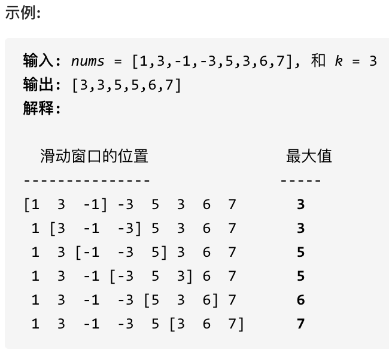

# 代码随想录算法总结(C++)版本——栈和队列

Created: September 2, 2022 1:06 PM

# ****232.用栈实现队列****

使用栈实现队列的下列操作：

push(x) -- 将一个元素放入队列的尾部。pop() -- 从队列首部移除元素。peek() -- 返回队列首部的元素。empty() -- 返回队列是否为空。

示例:

```
MyQueue queue = new MyQueue();
queue.push(1);
queue.push(2);
queue.peek();  // 返回 1
queue.pop();   // 返回 1
queue.empty(); // 返回 false
```

说明:

- 你只能使用标准的栈操作 -- 也就是只有 push to top, peek/pop from top, size, 和 is empty 操作是合法的。
- 你所使用的语言也许不支持栈。你可以使用 list 或者 deque（双端队列）来模拟一个栈，只要是标准的栈操作即可。
- 假设所有操作都是有效的 （例如，一个空的队列不会调用 pop 或者 peek 操作）。

C++代码如下：

```cpp
class MyQueue {
public:
    stack<int> stIn;
    stack<int> stOut;
    /** Initialize your data structure here. */
    MyQueue() {

    }
    /** Push element x to the back of queue. */
    void push(int x) {
        stIn.push(x);
    }

    /** Removes the element from in front of queue and returns that element. */
    int pop() {
        // 只有当stOut为空的时候，再从stIn里导入数据（导入stIn全部数据）
        if (stOut.empty()) {
            // 从stIn导入数据直到stIn为空
            while(!stIn.empty()) {
                stOut.push(stIn.top());
                stIn.pop();
            }
        }
        int result = stOut.top();
        stOut.pop();
        return result;
    }

    /** Get the front element. */
    int peek() {
        int res = this->pop(); // 直接使用已有的pop函数
        stOut.push(res); // 因为pop函数弹出了元素res，所以再添加回去
        return res;
    }

    /** Returns whether the queue is empty. */
    bool empty() {
        return stIn.empty() && stOut.empty();
    }
};
```

# **225. 用队列实现栈**

**[力扣题目链接(opens new window)](https://leetcode-cn.com/problems/implement-stack-using-queues/)**

使用队列实现栈的下列操作：

- push(x) -- 元素 x 入栈
- pop() -- 移除栈顶元素
- top() -- 获取栈顶元素
- empty() -- 返回栈是否为空

注意:

- 你只能使用队列的基本操作-- 也就是 push to back, peek/pop from front, size, 和 is empty 这些操作是合法的。
- 你所使用的语言也许不支持队列。 你可以使用 list 或者 deque（双端队列）来模拟一个队列 , 只要是标准的队列操作即可。
- 你可以假设所有操作都是有效的（例如, 对一个空的栈不会调用 pop 或者 top 操作）。

模拟的队列执行语句如下：

```cpp
queue.push(1);
queue.push(2);
queue.pop();   // 注意弹出的操作
queue.push(3);
queue.push(4);
queue.pop();  // 注意弹出的操作
queue.pop();
queue.pop();
queue.empty();

```


详细如代码注释所示：

```cpp
class MyStack {
public:
    queue<int> que1;
    queue<int> que2; // 辅助队列，用来备份
    /** Initialize your data structure here. */
    MyStack() {

    }

    /** Push element x onto stack. */
    void push(int x) {
        que1.push(x);
    }

    /** Removes the element on top of the stack and returns that element. */
    int pop() {
        int size = que1.size();
        size--;
        while (size--) { // 将que1 导入que2，但要留下最后一个元素
            que2.push(que1.front());
            que1.pop();
        }

        int result = que1.front(); // 留下的最后一个元素就是要返回的值
        que1.pop();
        que1 = que2;            // 再将que2赋值给que1
        while (!que2.empty()) { // 清空que2
            que2.pop();
        }
        return result;
    }

    /** Get the top element. */
    int top() {
        return que1.back();
    }

    /** Returns whether the stack is empty. */
    bool empty() {
        return que1.empty();
    }
};

```

## **优化**

其实这道题目就是用一个队列就够了。

**一个队列在模拟栈弹出元素的时候只要将队列头部的元素（除了最后一个元素外） 重新添加到队列尾部，此时在去弹出元素就是栈的顺序了。**

C++优化代码

```cpp
class MyStack {
public:
    queue<int> que;
    /** Initialize your data structure here. */
    MyStack() {

    }
    /** Push element x onto stack. */
    void push(int x) {
        que.push(x);
    }
    /** Removes the element on top of the stack and returns that element. */
    int pop() {
        int size = que.size();
        size--;
        while (size--) { // 将队列头部的元素（除了最后一个元素外） 重新添加到队列尾部
            que.push(que.front());
            que.pop();
        }
        int result = que.front(); // 此时弹出的元素顺序就是栈的顺序了
        que.pop();
        return result;
    }

    /** Get the top element. */
    int top() {
        return que.back();
    }

    /** Returns whether the stack is empty. */
    bool empty() {
        return que.empty();
    }
};
```

# **20. 有效的括号**

给定一个只包括 '('，')'，'{'，'}'，'['，']' 的字符串，判断字符串是否有效。

有效字符串需满足：

- 左括号必须用相同类型的右括号闭合。
- 左括号必须以正确的顺序闭合。
- 注意空字符串可被认为是有效字符串。

示例 1:

- 输入: "()"
- 输出: true

示例 2:

- 输入: "()[]{}"
- 输出: true

示例 3:

- 输入: "(]"
- 输出: false

先来分析一下 这里有三种不匹配的情况，

1. 第一种情况，字符串里左方向的括号多余了 ，所以不匹配。


1. 第二种情况，括号没有多余，但是 括号的类型没有匹配上。


1. 第三种情况，字符串里右方向的括号多余了，所以不匹配。


我们的代码只要覆盖了这三种不匹配的情况，就不会出问题，可以看出 动手之前分析好题目的重要性。

动画如下：


实现C++代码如下：

```cpp
class Solution {
public:
    bool isValid(string s) {
        stack<int> st;
        for (int i = 0; i < s.size(); i++) {
            if (s[i] == '(') st.push(')');
            else if (s[i] == '{') st.push('}');
            else if (s[i] == '[') st.push(']');
            // 第三种情况：遍历字符串匹配的过程中，栈已经为空了，没有匹配的字符了，说明右括号没有找到对应的左括号 return false
            // 第二种情况：遍历字符串匹配的过程中，发现栈里没有我们要匹配的字符。所以return false
            else if (st.empty() || st.top() != s[i]) return false;
            else st.pop(); // st.top() 与 s[i]相等，栈弹出元素
        }
        // 第一种情况：此时我们已经遍历完了字符串，但是栈不为空，说明有相应的左括号没有右括号来匹配，所以return false，否则就return true
        return st.empty();
    }
};
```

# **1047. 删除字符串中的所有相邻重复项**

给出由小写字母组成的字符串 S，重复项删除操作会选择两个相邻且相同的字母，并删除它们。

在 S 上反复执行重复项删除操作，直到无法继续删除。

在完成所有重复项删除操作后返回最终的字符串。答案保证唯一。

示例：

- 输入："abbaca"
- 输出："ca"
- 解释：例如，在 "abbaca" 中，我们可以删除 "bb" 由于两字母相邻且相同，这是此时唯一可以执行删除操作的重复项。之后我们得到字符串 "aaca"，其中又只有 "aa" 可以执行重复项删除操作，所以最后的字符串为 "ca"。

提示：

- 1 <= S.length <= 20000
- S 仅由小写英文字母组成。

如动画所示：


从栈中弹出剩余元素，此时是字符串ac，因为从栈里弹出的元素是倒序的，所以在对字符串进行反转一下，就得到了最终的结果。

C++代码 :

```cpp
class Solution {
public:
    string removeDuplicates(string S) {
        stack<char> st;
        for (char s : S) {
            if (st.empty() || s != st.top()) {
                st.push(s);
            } else {
                st.pop(); // s 与 st.top()相等的情况
            }
        }
        string result = "";
        while (!st.empty()) { // 将栈中元素放到result字符串汇总
            result += st.top();
            st.pop();
        }
        reverse (result.begin(), result.end()); // 此时字符串需要反转一下
        return result;

    }
};

```

123456789101112131415161718192021

当然可以拿字符串直接作为栈，这样省去了栈还要转为字符串的操作。

代码如下：

```cpp
class Solution {
public:
    string removeDuplicates(string S) {
        string result;
        for(char s : S) {
            if(result.empty() || result.back() != s) {
                result.push_back(s);
            }
            else {
                result.pop_back();
            }
        }
        return result;
    }
};
```

# **150. 逆波兰表达式求值**

**[力扣题目链接(opens new window)](https://leetcode-cn.com/problems/evaluate-reverse-polish-notation/)**

根据 逆波兰表示法，求表达式的值。

有效的运算符包括 + ,  - ,  * ,  / 。每个运算对象可以是整数，也可以是另一个逆波兰表达式。

说明：

整数除法只保留整数部分。 给定逆波兰表达式总是有效的。换句话说，表达式总会得出有效数值且不存在除数为 0 的情况。

示例 1：

- 输入: ["2", "1", "+", "3", " * "]
- 输出: 9
- 解释: 该算式转化为常见的中缀算术表达式为：((2 + 1) * 3) = 9

示例 2：

- 输入: ["10", "6", "9", "3", "+", "-11", " * ", "/", " * ", "17", "+", "5", "+"]
- 输出: 22
- 解释:该算式转化为常见的中缀算术表达式为：
    
    ```cpp
    ((10 * (6 / ((9 + 3) * -11))) + 17) + 5       
    = ((10 * (6 / (12 * -11))) + 17) + 5       
    = ((10 * (6 / -132)) + 17) + 5     
    = ((10 * 0) + 17) + 5     
    = (0 + 17) + 5    
    = 17 + 5    
    = 22
    ```
    
    在进一步看，本题中每一个子表达式要得出一个结果，然后拿这个结果再进行运算，那么**这岂不就是一个相邻字符串消除的过程，和[1047.删除字符串中的所有相邻重复项 (opens new window)](https://programmercarl.com/1047.%E5%88%A0%E9%99%A4%E5%AD%97%E7%AC%A6%E4%B8%B2%E4%B8%AD%E7%9A%84%E6%89%80%E6%9C%89%E7%9B%B8%E9%82%BB%E9%87%8D%E5%A4%8D%E9%A1%B9.html)中的对对碰游戏是不是就非常像了。**
    
    如动画所示：
    
    
    
    相信看完动画大家应该知道，这和**[1047. 删除字符串中的所有相邻重复项 (opens new window)](https://programmercarl.com/1047.%E5%88%A0%E9%99%A4%E5%AD%97%E7%AC%A6%E4%B8%B2%E4%B8%AD%E7%9A%84%E6%89%80%E6%9C%89%E7%9B%B8%E9%82%BB%E9%87%8D%E5%A4%8D%E9%A1%B9.html)**是差不错的，只不过本题不要相邻元素做消除了，而是做运算！
    
    C++代码如下：
    
    ```cpp
    class Solution {
    public:
        int evalRPN(vector<string>& tokens) {
            stack<int> st;
            for (int i = 0; i < tokens.size(); i++) {
                if (tokens[i] == "+" || tokens[i] == "-" || tokens[i] == "*" || tokens[i] == "/") {
                    int num1 = st.top();
                    st.pop();
                    int num2 = st.top();
                    st.pop();
                    if (tokens[i] == "+") st.push(num2 + num1);
                    if (tokens[i] == "-") st.push(num2 - num1);
                    if (tokens[i] == "*") st.push(num2 * num1);
                    if (tokens[i] == "/") st.push(num2 / num1);
                } else {
                    st.push(stoi(tokens[i]));
                }
            }
            int result = st.top();
            st.pop(); // 把栈里最后一个元素弹出（其实不弹出也没事）
            return result;
        }
    };
    ```
    
    # ****239. 滑动窗口最大值****
    
    给定一个数组 nums，有一个大小为 k 的滑动窗口从数组的最左侧移动到数组的最右侧。你只可以看到在滑动窗口内的 k 个数字。滑动窗口每次只向右移动一位。
    
    返回滑动窗口中的最大值。
    



来看一下单调队列如何维护队列里的元素。

动画如下：


设计单调队列的时候，pop，和push操作要保持如下规则：

1. pop(value)：如果窗口移除的元素value等于单调队列的出口元素，那么队列弹出元素，否则不用任何操作
2. push(value)：如果push的元素value大于入口元素的数值，那么就将队列入口的元素弹出，直到push元素的数值小于等于队列入口元素的数值为止

保持如上规则，每次窗口移动的时候，只要问que.front()就可以返回当前窗口的最大值。

为了更直观的感受到单调队列的工作过程，以题目示例为例，输入: nums = [1,3,-1,-3,5,3,6,7], 和 k = 3，动画如下：


C++代码如下：

```cpp
class Solution {
private:
    class MyQueue { //单调队列（从大到小）
    public:
        deque<int> que; // 使用deque来实现单调队列
        // 每次弹出的时候，比较当前要弹出的数值是否等于队列出口元素的数值，如果相等则弹出。
        // 同时pop之前判断队列当前是否为空。
        void pop(int value) {
            if (!que.empty() && value == que.front()) {
                que.pop_front();
            }
        }
        // 如果push的数值大于入口元素的数值，那么就将队列后端的数值弹出，直到push的数值小于等于队列入口元素的数值为止。
        // 这样就保持了队列里的数值是单调从大到小的了。
        void push(int value) {
            while (!que.empty() && value > que.back()) {
                que.pop_back();
            }
            que.push_back(value);

        }
        // 查询当前队列里的最大值 直接返回队列前端也就是front就可以了。
        int front() {
            return que.front();
        }
    };
public:
    vector<int> maxSlidingWindow(vector<int>& nums, int k) {
        MyQueue que;
        vector<int> result;
        for (int i = 0; i < k; i++) { // 先将前k的元素放进队列
            que.push(nums[i]);
        }
        result.push_back(que.front()); // result 记录前k的元素的最大值
        for (int i = k; i < nums.size(); i++) {
            que.pop(nums[i - k]); // 滑动窗口移除最前面元素
            que.push(nums[i]); // 滑动窗口前加入最后面的元素
            result.push_back(que.front()); // 记录对应的最大值
        }
        return result;
    }
};
```

# ****347.前 K 个高频元素****

给定一个非空的整数数组，返回其中出现频率前 k 高的元素。

示例 1:

- 输入: nums = [1,1,1,2,2,3], k = 2
- 输出: [1,2]

示例 2:

- 输入: nums = [1], k = 1
- 输出: [1]

提示：

- 你可以假设给定的 k 总是合理的，且 1 ≤ k ≤ 数组中不相同的元素的个数。
- 你的算法的时间复杂度必须优于 $O(n \log n)$ , n 是数组的大小。
- 题目数据保证答案唯一，换句话说，数组中前 k 个高频元素的集合是唯一的。
- 你可以按任意顺序返回答案。

这道题目主要涉及到如下三块内容：

1. 要统计元素出现频率
2. 对频率排序
3. 找出前K个高频元素

寻找前k个最大元素流程如图所示：（图中的频率只有三个，所以正好构成一个大小为3的小顶堆，如果频率更多一些，则用这个小顶堆进行扫描）


我们来看一下C++代码：

```cpp
// 时间复杂度：O(nlogk)
// 空间复杂度：O(n)
class Solution {
public:
    // 小顶堆
    class mycomparison {
    public:
        bool operator()(const pair<int, int>& lhs, const pair<int, int>& rhs) {
            return lhs.second > rhs.second;
        }
    };
    vector<int> topKFrequent(vector<int>& nums, int k) {
        // 要统计元素出现频率
        unordered_map<int, int> map; // map<nums[i],对应出现的次数>
        for (int i = 0; i < nums.size(); i++) {
            map[nums[i]]++;
        }

        // 对频率排序
        // 定义一个小顶堆，大小为k
        priority_queue<pair<int, int>, vector<pair<int, int>>, mycomparison> pri_que;

        // 用固定大小为k的小顶堆，扫面所有频率的数值
        for (unordered_map<int, int>::iterator it = map.begin(); it != map.end(); it++) {
            pri_que.push(*it);
            if (pri_que.size() > k) { // 如果堆的大小大于了K，则队列弹出，保证堆的大小一直为k
                pri_que.pop();
            }
        }

        // 找出前K个高频元素，因为小顶堆先弹出的是最小的，所以倒序来输出到数组
        vector<int> result(k);
        for (int i = k - 1; i >= 0; i--) {
            result[i] = pri_que.top().first;
            pri_que.pop();
        }
        return result;

    }
};
```