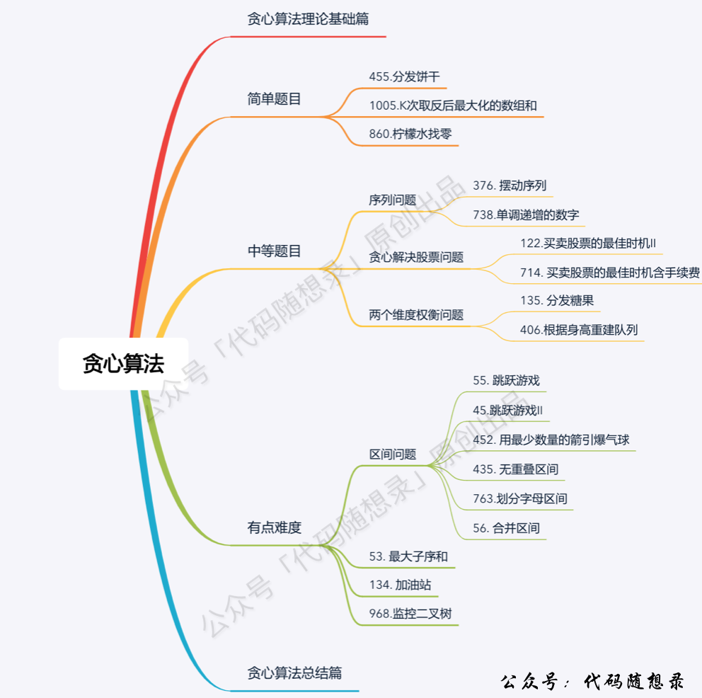
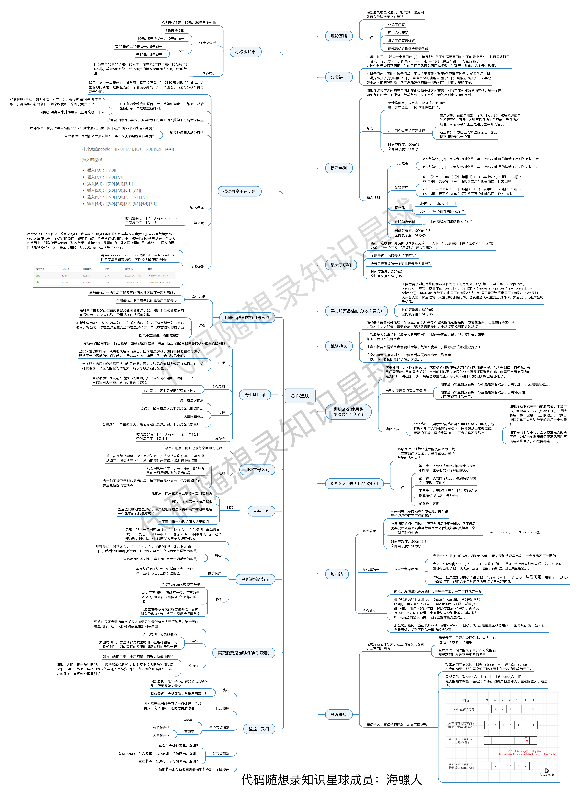
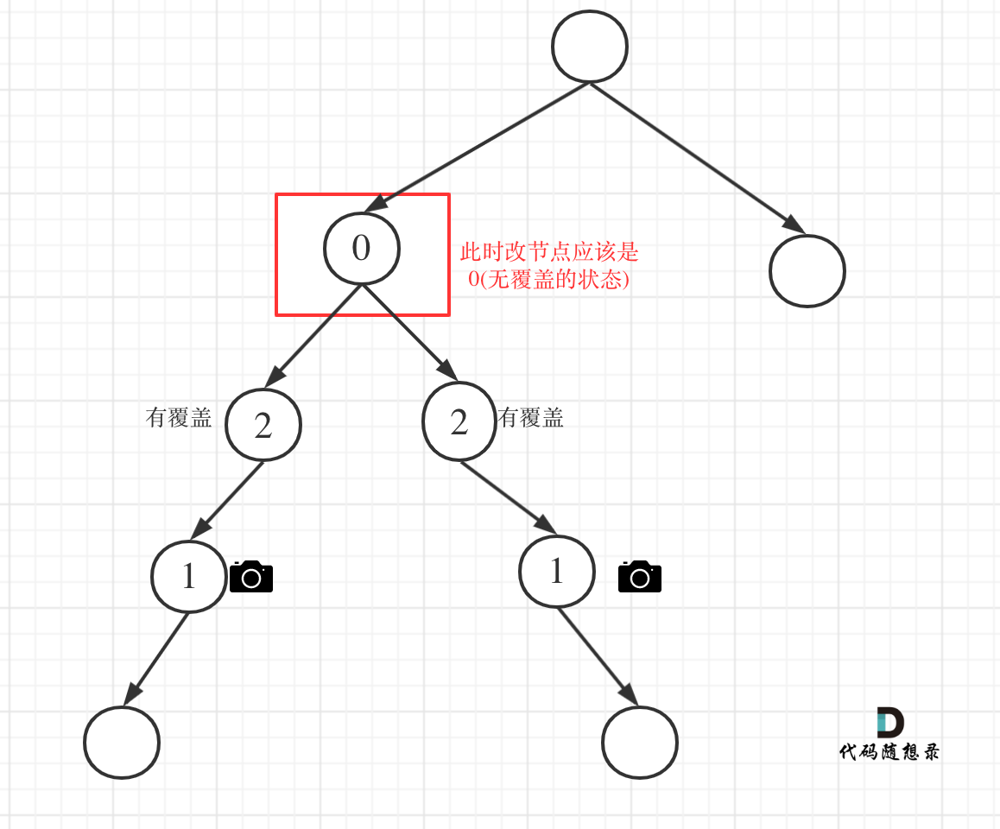

# 代码随想录算法总结(C++)版本——贪心

Created: September 2, 2022 1:06 PM

# 贪心算法概述

贪心算法一般分为如下四步：

- 将问题分解为若干个子问题
- 找出适合的贪心策略
- 求解每一个子问题的最优解
- 将局部最优解堆叠成全局最优解





# 简单

## 455.分发饼干

**[力扣题目链接](https://leetcode-cn.com/problems/assign-cookies/)**

假设你是一位很棒的家长，想要给你的孩子们一些小饼干。但是，每个孩子最多只能给一块饼干。

对每个孩子 i，都有一个胃口值 g[i]，这是能让孩子们满足胃口的饼干的最小尺寸；并且每块饼干 j，都有一个尺寸 s[j] 。如果 s[j] >= g[i]，我们可以将这个饼干 j 分配给孩子 i ，这个孩子会得到满足。你的目标是尽可能满足越多数量的孩子，并输出这个最大数值。

示例 1:

- 输入: g = [1,2,3], s = [1,1]
- 输出: 1 解释:你有三个孩子和两块小饼干，3个孩子的胃口值分别是：1,2,3。虽然你有两块小饼干，由于他们的尺寸都是1，你只能让胃口值是1的孩子满足。所以你应该输出1。

示例 2:

- 输入: g = [1,2], s = [1,2,3]
- 输出: 2
- 解释:你有两个孩子和三块小饼干，2个孩子的胃口值分别是1,2。你拥有的饼干数量和尺寸都足以让所有孩子满足。所以你应该输出2.

可以尝试使用贪心策略，先将饼干数组和小孩数组排序。

然后从后向前遍历小孩数组，用大饼干优先满足胃口大的，并统计满足小孩数量。

如图：


C++代码整体如下：

```cpp
// 时间复杂度：O(nlogn)
// 空间复杂度：O(1)
class Solution {
public:
    int findContentChildren(vector<int>& g, vector<int>& s) {
        sort(g.begin(), g.end());
        sort(s.begin(), s.end());
        int index = s.size() - 1; // 饼干数组的下标
        int result = 0;
        for (int i = g.size() - 1; i >= 0; i--) {
            if (index >= 0 && s[index] >= g[i]) {
                result++;
                index--;
            }
        }
        return result;
    }
};
```

**也可以换一个思路，小饼干先喂饱小胃口**

代码如下：

```cpp
class Solution {
public:
    int findContentChildren(vector<int>& g, vector<int>& s) {
        sort(g.begin(),g.end());
        sort(s.begin(),s.end());
        int index = 0;
        for(int i = 0;i < s.size();++i){
            if(index < g.size() && g[index] <= s[i]){
                index++;
            }
        }
        return index;
    }
};
```

## ****1005.K次取反后最大化的数组和****

**[力扣题目链接(opens new window)](https://leetcode-cn.com/problems/maximize-sum-of-array-after-k-negations/)**

给定一个整数数组 A，我们只能用以下方法修改该数组：我们选择某个索引 i 并将 A[i] 替换为 -A[i]，然后总共重复这个过程 K 次。（我们可以多次选择同一个索引 i。）

以这种方式修改数组后，返回数组可能的最大和。

示例 1：

- 输入：A = [4,2,3], K = 1
- 输出：5
- 解释：选择索引 (1,) ，然后 A 变为 [4,-2,3]。

示例 2：

- 输入：A = [3,-1,0,2], K = 3
- 输出：6
- 解释：选择索引 (1, 2, 2) ，然后 A 变为 [3,1,0,2]。

本题的解题步骤为：

- 第一步：将数组按照绝对值大小从大到小排序，**注意要按照绝对值的大小**
- 第二步：从前向后遍历，遇到负数将其变为正数，同时K--
- 第三步：如果K还大于0，那么反复转变数值最小的元素，将K用完
- 第四步：求和

对应C++代码如下：

```cpp
class Solution {
static bool cmp(int a, int b) {
    return abs(a) > abs(b);
}
public:
    int largestSumAfterKNegations(vector<int>& A, int K) {
        sort(A.begin(), A.end(), cmp);       // 第一步
        for (int i = 0; i < A.size(); i++) { // 第二步
            if (A[i] < 0 && K > 0) {
                A[i] *= -1;
                K--;
            }
        }
        if (K % 2 == 1) A[A.size() - 1] *= -1; // 第三步
        int result = 0;
        for (int a : A) result += a;        // 第四步
        return result;
    }
};
```

## ****860.柠檬水找零****

**[力扣题目链接(opens new window)](https://leetcode-cn.com/problems/lemonade-change/)**

在柠檬水摊上，每一杯柠檬水的售价为 5 美元。

顾客排队购买你的产品，（按账单 bills 支付的顺序）一次购买一杯。

每位顾客只买一杯柠檬水，然后向你付 5 美元、10 美元或 20 美元。你必须给每个顾客正确找零，也就是说净交易是每位顾客向你支付 5 美元。

注意，一开始你手头没有任何零钱。

如果你能给每位顾客正确找零，返回 true ，否则返回 false 。

示例 1：

- 输入：[5,5,5,10,20]
- 输出：true
- 解释：
    - 前 3 位顾客那里，我们按顺序收取 3 张 5 美元的钞票。
    - 第 4 位顾客那里，我们收取一张 10 美元的钞票，并返还 5 美元。
    - 第 5 位顾客那里，我们找还一张 10 美元的钞票和一张 5 美元的钞票。
    - 由于所有客户都得到了正确的找零，所以我们输出 true。

示例 4：

- 输入：[5,5,10,10,20]
- 输出：false
- 解释：
    - 前 2 位顾客那里，我们按顺序收取 2 张 5 美元的钞票。
    - 对于接下来的 2 位顾客，我们收取一张 10 美元的钞票，然后返还 5 美元。
    - 对于最后一位顾客，我们无法退回 15 美元，因为我们现在只有两张 10 美元的钞票。
    - 由于不是每位顾客都得到了正确的找零，所以答案是 false。
    
    提示：
    
    - 0 <= bills.length <= 10000
    - bills[i] 不是 5 就是 10 或是 20
    
    C++代码如下：
    
    ```cpp
    class Solution {
    public:
        bool lemonadeChange(vector<int>& bills) {
            int five = 0, ten = 0, twenty = 0;
            for (int bill : bills) {
                // 情况一
                if (bill == 5) five++;
                // 情况二
                if (bill == 10) {
                    if (five <= 0) return false;
                    ten++;
                    five--;
                }
                // 情况三
                if (bill == 20) {
                    // 优先消耗10美元，因为5美元的找零用处更大，能多留着就多留着
                    if (five > 0 && ten > 0) {
                        five--;
                        ten--;
                        twenty++; // 其实这行代码可以删了，因为记录20已经没有意义了，不会用20来找零
                    } else if (five >= 3) {
                        five -= 3;
                        twenty++; // 同理，这行代码也可以删了
                    } else return false;
                }
            }
            return true;
        }
    };
    ```
    

# 中等

## 序列问题

### ****376. 摆动序列****

**[力扣题目链接(opens new window)](https://leetcode-cn.com/problems/wiggle-subsequence/)**

如果连续数字之间的差严格地在正数和负数之间交替，则数字序列称为摆动序列。第一个差（如果存在的话）可能是正数或负数。少于两个元素的序列也是摆动序列。

例如， [1,7,4,9,2,5] 是一个摆动序列，因为差值 (6,-3,5,-7,3) 是正负交替出现的。相反, [1,4,7,2,5] 和 [1,7,4,5,5] 不是摆动序列，第一个序列是因为它的前两个差值都是正数，第二个序列是因为它的最后一个差值为零。

给定一个整数序列，返回作为摆动序列的最长子序列的长度。 通过从原始序列中删除一些（也可以不删除）元素来获得子序列，剩下的元素保持其原始顺序。

示例 1:

- 输入: [1,7,4,9,2,5]
- 输出: 6
- 解释: 整个序列均为摆动序列。

示例 2:

- 输入: [1,17,5,10,13,15,10,5,16,8]
- 输出: 7
- 解释: 这个序列包含几个长度为 7 摆动序列，其中一个可为[1,17,10,13,10,16,8]。

针对序列[2,5]，可以假设为[2,2,5]，这样它就有坡度了即preDiff = 0，如图：


C++代码如下（和上图是对应的逻辑）：

```cpp
class Solution {
public:
    int wiggleMaxLength(vector<int>& nums) {
        if (nums.size() <= 1) return nums.size();
        int curDiff = 0; // 当前一对差值
        int preDiff = 0; // 前一对差值
        int result = 1;  // 记录峰值个数，序列默认序列最右边有一个峰值
        for (int i = 0; i < nums.size() - 1; i++) {
            curDiff = nums[i + 1] - nums[i];
            // 出现峰值
            if ((curDiff > 0 && preDiff <= 0) || (preDiff >= 0 && curDiff < 0)) {
                result++;
                preDiff = curDiff;
            }
        }
        return result;
    }
};
```

**动态规划**

```cpp
class Solution {
public:
    int dp[1005][2];
    int wiggleMaxLength(vector<int>& nums) {
        memset(dp, 0, sizeof dp);
        dp[0][0] = dp[0][1] = 1;

        for (int i = 1; i < nums.size(); ++i)
        {
            dp[i][0] = dp[i][1] = 1;

            for (int j = 0; j < i; ++j)
            {
                if (nums[j] > nums[i]) dp[i][1] = max(dp[i][1], dp[j][0] + 1);
            }

            for (int j = 0; j < i; ++j)
            {
                if (nums[j] < nums[i]) dp[i][0] = max(dp[i][0], dp[j][1] + 1);
            }
        }
        return max(dp[nums.size() - 1][0], dp[nums.size() - 1][1]);
    }
};
```

### ****53. 最大子序和****

给定一个整数数组 nums ，找到一个具有最大和的连续子数组（子数组最少包含一个元素），返回其最大和。

示例: 输入: [-2,1,-3,4,-1,2,1,-5,4] 输出: 6 解释: 连续子数组 [4,-1,2,1] 的和最大，为 6。

**暴力法：**

```cpp
class Solution {
public:
    int maxSubArray(vector<int>& nums) {
        int result = INT32_MIN;
        int count = 0;
        for (int i = 0; i < nums.size(); i++) { // 设置起始位置
            count = 0;
            for (int j = i; j < nums.size(); j++) { // 每次从起始位置i开始遍历寻找最大值
                count += nums[j];
                result = count > result ? count : result;
            }
        }
        return result;
    }
};
```

**贪心法**

如动画所示：


C++代码（关键地方已经注释）

```cpp
class Solution {
public:
    int maxSubArray(vector<int>& nums) {
        int result = INT32_MIN;
        int count = 0;
        for (int i = 0; i < nums.size(); i++) {
            count += nums[i];
            if (count > result) { // 取区间累计的最大值（相当于不断确定最大子序终止位置）
                result = count;
            }
            if (count <= 0) count = 0; // 相当于重置最大子序起始位置，因为遇到负数一定是拉低总和
        }
        return result;
    }
};
```

**动态规划**

```cpp
class Solution {
public:
    int maxSubArray(vector<int>& nums) {
        if (nums.size() == 0) return 0;
        vector<int> dp(nums.size(), 0); // dp[i]表示包括i之前的最大连续子序列和
        dp[0] = nums[0];
        int result = dp[0];
        for (int i = 1; i < nums.size(); i++) {
            dp[i] = max(dp[i - 1] + nums[i], nums[i]); // 状态转移公式
            if (dp[i] > result) result = dp[i]; // result 保存dp[i]的最大值
        }
        return result;
    }
};
```

### ****738.单调递增的数字****

**[力扣题目链接(opens new window)](https://leetcode-cn.com/problems/monotone-increasing-digits/)**

给定一个非负整数 N，找出小于或等于 N 的最大的整数，同时这个整数需要满足其各个位数上的数字是单调递增。

（当且仅当每个相邻位数上的数字 x 和 y 满足 x <= y 时，我们称这个整数是单调递增的。）

示例 1:

- 输入: N = 10
- 输出: 9

示例 3:

- 输入: N = 332
- 输出: 299

****暴力解法:****

```cpp
class Solution {
private:
    bool checkNum(int num) {
        int max = 10;
        while (num) {
            int t = num % 10;
            if (max >= t) max = t;
            else return false;
            num = num / 10;
        }
        return true;
    }
public:
    int monotoneIncreasingDigits(int N) {
        for (int i = N; i > 0; i--) {
            if (checkNum(i)) return i;
        }
        return 0;
    }
};
```

****贪心算法：****

C++代码如下：

```cpp
class Solution {
public:
    int monotoneIncreasingDigits(int N) {
        string strNum = to_string(N);
        // flag用来标记赋值9从哪里开始
        // 设置为这个默认值，为了防止第二个for循环在flag没有被赋值的情况下执行
        int flag = strNum.size();
        for (int i = strNum.size() - 1; i > 0; i--) {
            if (strNum[i - 1] > strNum[i] ) {
                flag = i;
                strNum[i - 1]--;
            }
        }
        for (int i = flag; i < strNum.size(); i++) {
            strNum[i] = '9';
        }
        return stoi(strNum);
    }
};
```

## 股票问题

### ****122.买卖股票的最佳时机II****

**[力扣题目链接(opens new window)](https://leetcode-cn.com/problems/best-time-to-buy-and-sell-stock-ii/)**

给定一个数组，它的第 i 个元素是一支给定股票第 i 天的价格。

设计一个算法来计算你所能获取的最大利润。你可以尽可能地完成更多的交易（多次买卖一支股票）。

注意：你不能同时参与多笔交易（你必须在再次购买前出售掉之前的股票）。

示例 1:

- 输入: [7,1,5,3,6,4]
- 输出: 7
- 解释: 在第 2 天（股票价格 = 1）的时候买入，在第 3 天（股票价格 = 5）的时候卖出, 这笔交易所能获得利润 = 5-1 = 4。随后，在第 4 天（股票价格 = 3）的时候买入，在第 5 天（股票价格 = 6）的时候卖出, 这笔交易所能获得利润 = 6-3 = 3 。

示例 2:

- 输入: [1,2,3,4,5]
- 输出: 4
- 解释: 在第 1 天（股票价格 = 1）的时候买入，在第 5 天 （股票价格 = 5）的时候卖出, 这笔交易所能获得利润 = 5-1 = 4 。注意你不能在第 1 天和第 2 天接连购买股票，之后再将它们卖出。因为这样属于同时参与了多笔交易，你必须在再次购买前出售掉之前的股票。

本题首先要清楚两点：

- 只有一只股票！
- 当前只有买股票或者卖股票的操作

**局部最优：收集每天的正利润，全局最优：求得最大利润**

对应C++代码如下：

```cpp
class Solution {
public:
    int maxProfit(vector<int>& prices) {
        int result = 0;
        for (int i = 1; i < prices.size(); i++) {
            result += max(prices[i] - prices[i - 1], 0);
        }
        return result;
    }
};
```

**动态规划**

```cpp
class Solution {
public:
    int maxProfit(vector<int>& prices) {
        // dp[i][1]第i天持有的最多现金
        // dp[i][0]第i天持有股票后的最多现金
        int n = prices.size();
        vector<vector<int>> dp(n, vector<int>(2, 0));
        dp[0][0] -= prices[0]; // 持股票
        for (int i = 1; i < n; i++) {
            // 第i天持股票所剩最多现金 = max(第i-1天持股票所剩现金, 第i-1天持现金-买第i天的股票)
            dp[i][0] = max(dp[i - 1][0], dp[i - 1][1] - prices[i]);
            // 第i天持有最多现金 = max(第i-1天持有的最多现金，第i-1天持有股票的最多现金+第i天卖出股票)
            dp[i][1] = max(dp[i - 1][1], dp[i - 1][0] + prices[i]);
        }
        return max(dp[n - 1][0], dp[n - 1][1]);
    }
};
```

### ****714. 买卖股票的最佳时机含手续费****

给定一个整数数组 prices，其中第 i 个元素代表了第 i 天的股票价格 ；非负整数 fee 代表了交易股票的手续费用。

你可以无限次地完成交易，但是你每笔交易都需要付手续费。如果你已经购买了一个股票，在卖出它之前你就不能再继续购买股票了。

返回获得利润的最大值。

注意：这里的一笔交易指买入持有并卖出股票的整个过程，每笔交易你只需要为支付一次手续费。

示例 1: 输入: prices = [1, 3, 2, 8, 4, 9], fee = 2 输出: 8

解释: 能够达到的最大利润: 在此处买入 prices[0] = 1 在此处卖出 prices[3] = 8 在此处买入 prices[4] = 4 在此处卖出 prices[5] = 9 总利润: ((8 - 1) - 2) + ((9 - 4) - 2) = 8.

贪心算法C++代码如下：

```cpp
class Solution {
public:
    int maxProfit(vector<int>& prices, int fee) {
        int result=0;
        int minPrice=prices[0];//最低价格
        for(int i=1;i<prices.size();i++){

            if(prices[i]<minPrice) minPrice=prices[i];//记录最小价格

            if(prices[i]>=minPrice&&
            prices[i]<=minPrice+fee) continue;//虽然高于最小价格，但是加上手续费后不盈利。所以不买

            if(prices[i]>minPrice+fee){
                result+=prices[i]-minPrice-fee;//记录一次利润
                //1 3 2 8 9 9,
                //这一句话保证的是如果接下来还是涨的，那么昨天就不买了，今天才卖
                //prices[i+1]-(prices[i]-fee)-fee=prices[i+1]-prices[i]，
                //也就是在加上今天的差额，如果没有减的话，又多了一次手续费
                minPrice=prices[i]-fee;
            }    
        }
        return result;
    }        
};
```

****动态规划****

C++代码如下：

```cpp
class Solution {
public:
    int maxProfit(vector<int>& prices, int fee) {
        // dp[i][1]第i天持有的最多现金
        // dp[i][0]第i天持有股票所剩的最多现金
        int n = prices.size();
        vector<vector<int>> dp(n, vector<int>(2, 0));
        dp[0][0] -= prices[0]; // 持股票
        for (int i = 1; i < n; i++) {
            dp[i][0] = max(dp[i - 1][0], dp[i - 1][1] - prices[i]);
            dp[i][1] = max(dp[i - 1][1], dp[i - 1][0] + prices[i] - fee);
        }
        return max(dp[n - 1][0], dp[n - 1][1]);
    }
};
```

## 两个维度权衡问题

### 135分发糖果

**[力扣题目链接(opens new window)](https://leetcode-cn.com/problems/candy/)**

老师想给孩子们分发糖果，有 N 个孩子站成了一条直线，老师会根据每个孩子的表现，预先给他们评分。

你需要按照以下要求，帮助老师给这些孩子分发糖果：

- 每个孩子至少分配到 1 个糖果。
- 相邻的孩子中，评分高的孩子必须获得更多的糖果。

那么这样下来，老师至少需要准备多少颗糖果呢？

示例 1:

- 输入: [1,0,2]
- 输出: 5
- 解释: 你可以分别给这三个孩子分发 2、1、2 颗糖果。

采用了两次贪心的策略：

- 一次是从左到右遍历，只比较右边孩子评分比左边大的情况。
- 一次是从右到左遍历，只比较左边孩子评分比右边大的情况。

整体代码如下：

```cpp
class Solution {
public:
    int candy(vector<int>& ratings) {
        vector<int> candyVec(ratings.size(), 1);
        // 从前向后
        for (int i = 1; i < ratings.size(); i++) {
            if (ratings[i] > ratings[i - 1]) candyVec[i] = candyVec[i - 1] + 1;
        }
        // 从后向前
        for (int i = ratings.size() - 2; i >= 0; i--) {
            if (ratings[i] > ratings[i + 1] ) {
                candyVec[i] = max(candyVec[i], candyVec[i + 1] + 1);
            }
        }
        // 统计结果
        int result = 0;
        for (int i = 0; i < candyVec.size(); i++) result += candyVec[i];
        return result;
    }
};
```

### ****406.根据身高重建队列****

**[力扣题目链接(opens new window)](https://leetcode-cn.com/problems/queue-reconstruction-by-height/)**

假设有打乱顺序的一群人站成一个队列，数组 people 表示队列中一些人的属性（不一定按顺序）。每个 people[i] = [hi, ki] 表示第 i 个人的身高为 hi ，前面 正好 有 ki 个身高大于或等于 hi 的人。

请你重新构造并返回输入数组 people 所表示的队列。返回的队列应该格式化为数组 queue ，其中 queue[j] = [hj, kj] 是队列中第 j 个人的属性（queue[0] 是排在队列前面的人）。

示例 1：

- 输入：people = [[7,0],[4,4],[7,1],[5,0],[6,1],[5,2]]
- 输出：[[5,0],[7,0],[5,2],[6,1],[4,4],[7,1]]
- 解释：
    - 编号为 0 的人身高为 5 ，没有身高更高或者相同的人排在他前面。
    - 编号为 1 的人身高为 7 ，没有身高更高或者相同的人排在他前面。
    - 编号为 2 的人身高为 5 ，有 2 个身高更高或者相同的人排在他前面，即编号为 0 和 1 的人。
    - 编号为 3 的人身高为 6 ，有 1 个身高更高或者相同的人排在他前面，即编号为 1 的人。
    - 编号为 4 的人身高为 4 ，有 4 个身高更高或者相同的人排在他前面，即编号为 0、1、2、3 的人。
    - 编号为 5 的人身高为 7 ，有 1 个身高更高或者相同的人排在他前面，即编号为 1 的人。
    - 因此 [[5,0],[7,0],[5,2],[6,1],[4,4],[7,1]] 是重新构造后的队列。
    
    **此时我们可以确定一个维度了，就是身高，前面的节点一定都比本节点高！**
    
    那么只需要按照k为下标重新插入队列就可以了，为什么呢？
    
    以图中{5,2} 为例：
    
    
    
    **局部最优：优先按身高高的people的k来插入。插入操作过后的people满足队列属性**
    
    **全局最优：最后都做完插入操作，整个队列满足题目队列属性**
    
    C++代码如下：
    
    ```cpp
    // 版本一
    class Solution {
    public:
        static bool cmp(const vector<int>& a, const vector<int>& b) {
            if (a[0] == b[0]) return a[1] < b[1];
            return a[0] > b[0];
        }
        vector<vector<int>> reconstructQueue(vector<vector<int>>& people) {
            sort (people.begin(), people.end(), cmp);
            vector<vector<int>> que;
            for (int i = 0; i < people.size(); i++) {
                int position = people[i][1];
                que.insert(que.begin() + position, people[i]);
            }
            return que;
        }
    };
    ```
    
    改成链表之后，C++代码如下：
    
    ```cpp
    // 版本二
    class Solution {
    public:
        // 身高从大到小排（身高相同k小的站前面）
        static bool cmp(const vector<int>& a, const vector<int>& b) {
            if (a[0] == b[0]) return a[1] < b[1];
            return a[0] > b[0];
        }
        vector<vector<int>> reconstructQueue(vector<vector<int>>& people) {
            sort (people.begin(), people.end(), cmp);
            list<vector<int>> que; // list底层是链表实现，插入效率比vector高的多
            for (int i = 0; i < people.size(); i++) {
                int position = people[i][1]; // 插入到下标为position的位置
                std::list<vector<int>>::iterator it = que.begin();
                while (position--) { // 寻找在插入位置
                    it++;
                }
                que.insert(it, people[i]);
            }
            return vector<vector<int>>(que.begin(), que.end());
        }
    };
    ```
    

# 难题

## 区间问题

### ****55. 跳跃游戏****

**[力扣题目链接(opens new window)](https://leetcode-cn.com/problems/jump-game/)**

给定一个非负整数数组，你最初位于数组的第一个位置。

数组中的每个元素代表你在该位置可以跳跃的最大长度。

判断你是否能够到达最后一个位置。

示例 1:

- 输入: [2,3,1,1,4]
- 输出: true
- 解释: 我们可以先跳 1 步，从位置 0 到达 位置 1, 然后再从位置 1 跳 3 步到达最后一个位置。

示例 2:

- 输入: [3,2,1,0,4]
- 输出: false
- 解释: 无论怎样，你总会到达索引为 3 的位置。但该位置的最大跳跃长度是 0 ， 所以你永远不可能到达最后一个位置。

**贪心算法局部最优解：每次取最大跳跃步数（取最大覆盖范围），整体最优解：最后得到整体最大覆盖范围，看是否能到终点**。

局部最优推出全局最优，找不出反例，试试贪心！

如图：


C++代码如下：

```cpp
class Solution {
public:
    bool canJump(vector<int>& nums) {
        int cover = 0;
        if (nums.size() == 1) return true; // 只有一个元素，就是能达到
        for (int i = 0; i <= cover; i++) { // 注意这里是小于等于cover
            cover = max(i + nums[i], cover);
            if (cover >= nums.size() - 1) return true; // 说明可以覆盖到终点了
        }
        return false;
    }
};
```

### ****45.跳跃游戏II****

**[力扣题目链接(opens new window)](https://leetcode-cn.com/problems/jump-game-ii/)**

给定一个非负整数数组，你最初位于数组的第一个位置。

数组中的每个元素代表你在该位置可以跳跃的最大长度。

你的目标是使用最少的跳跃次数到达数组的最后一个位置。

示例:

- 输入: [2,3,1,1,4]
- 输出: 2
- 解释: 跳到最后一个位置的最小跳跃数是 2。从下标为 0 跳到下标为 1 的位置，跳 1 步，然后跳 3 步到达数组的最后一个位置。

说明: 假设你总是可以到达数组的最后一个位置。

如图：


**图中覆盖范围的意义在于，只要红色的区域，最多两步一定可以到！（不用管具体怎么跳，反正一定可以跳到）**

这里还是有个特殊情况需要考虑，当移动下标达到了当前覆盖的最远距离下标时

- 如果当前覆盖最远距离下标不是是集合终点，步数就加一，还需要继续走。
- 如果当前覆盖最远距离下标就是是集合终点，步数不用加一，因为不能再往后走了。

**法一：**

C++代码如下：（详细注释）

```cpp
// 版本一
class Solution {
public:
    int jump(vector<int>& nums) {
        if (nums.size() == 1) return 0;
        int curDistance = 0;    // 当前覆盖最远距离下标
        int ans = 0;            // 记录走的最大步数
        int nextDistance = 0;   // 下一步覆盖最远距离下标
        for (int i = 0; i < nums.size(); i++) {
            nextDistance = max(nums[i] + i, nextDistance);  // 更新下一步覆盖最远距离下标
            if (i == curDistance) {                         // 遇到当前覆盖最远距离下标
                if (curDistance != nums.size() - 1) {       // 如果当前覆盖最远距离下标不是终点
                    ans++;                                  // 需要走下一步
                    curDistance = nextDistance;             // 更新当前覆盖最远距离下标（相当于加油了）
                    if (nextDistance >= nums.size() - 1) break; // 下一步的覆盖范围已经可以达到终点，结束循环
                } else break;                               // 当前覆盖最远距离下标是集合终点，不用做ans++操作了，直接结束
            }
        }
        return ans;
    }
};
```

### ****452. 用最少数量的箭引爆气球****

**[力扣题目链接(opens new window)](https://leetcode-cn.com/problems/minimum-number-of-arrows-to-burst-balloons/)**

在二维空间中有许多球形的气球。对于每个气球，提供的输入是水平方向上，气球直径的开始和结束坐标。由于它是水平的，所以纵坐标并不重要，因此只要知道开始和结束的横坐标就足够了。开始坐标总是小于结束坐标。

一支弓箭可以沿着 x 轴从不同点完全垂直地射出。在坐标 x 处射出一支箭，若有一个气球的直径的开始和结束坐标为 xstart，xend， 且满足  xstart ≤ x ≤ xend，则该气球会被引爆。可以射出的弓箭的数量没有限制。 弓箭一旦被射出之后，可以无限地前进。我们想找到使得所有气球全部被引爆，所需的弓箭的最小数量。

给你一个数组 points ，其中 points [i] = [xstart,xend] ，返回引爆所有气球所必须射出的最小弓箭数。

示例 1：

- 输入：points = [[10,16],[2,8],[1,6],[7,12]]
- 输出：2
- 解释：对于该样例，x = 6 可以射爆 [2,8],[1,6] 两个气球，以及 x = 11 射爆另外两个气球

以题目示例： [[10,16],[2,8],[1,6],[7,12]]为例，如图：（方便起见，已经排序）


C++代码如下：

```cpp
class Solution {
private:
    static bool cmp(const vector<int>& a, const vector<int>& b) {
        return a[0] < b[0];
    }
public:
    int findMinArrowShots(vector<vector<int>>& points) {
        if (points.size() == 0) return 0;
        sort(points.begin(), points.end(), cmp);

        int result = 1; // points 不为空至少需要一支箭
        for (int i = 1; i < points.size(); i++) {
            if (points[i][0] > points[i - 1][1]) {  // 气球i和气球i-1不挨着，注意这里不是>=
                result++; // 需要一支箭
            }
            else {  // 气球i和气球i-1挨着
                points[i][1] = min(points[i - 1][1], points[i][1]); // 更新重叠气球最小右边界
            }
        }
        return result;
    }
};
```

### 435.无重叠区间

**[力扣题目链接(opens new window)](https://leetcode-cn.com/problems/non-overlapping-intervals/)**

给定一个区间的集合，找到需要移除区间的最小数量，使剩余区间互不重叠。

注意: 可以认为区间的终点总是大于它的起点。 区间 [1,2] 和 [2,3] 的边界相互“接触”，但没有相互重叠。

示例 1:

- 输入: [ [1,2], [2,3], [3,4], [1,3] ]
- 输出: 1
- 解释: 移除 [1,3] 后，剩下的区间没有重叠。

**我来按照右边界排序，从左向右记录非交叉区间的个数。最后用区间总数减去非交叉区间的个数就是需要移除的区间个数了。**

C++代码如下：

```cpp
class Solution {
public:
    // 按照区间右边界排序
    static bool cmp (const vector<int>& a, const vector<int>& b) {
        return a[1] < b[1];
    }
    int eraseOverlapIntervals(vector<vector<int>>& intervals) {
        if (intervals.size() == 0) return 0;
        sort(intervals.begin(), intervals.end(), cmp);
        int count = 1; // 记录非交叉区间的个数
        int end = intervals[0][1]; // 记录区间分割点
        for (int i = 1; i < intervals.size(); i++) {
            if (end <= intervals[i][0]) {
                end = intervals[i][1];
                count++;
            }
        }
        return intervals.size() - count;
    }
};
```

### ****763.划分字母区间****

**[力扣题目链接(opens new window)](https://leetcode-cn.com/problems/partition-labels/)**

字符串 S 由小写字母组成。我们要把这个字符串划分为尽可能多的片段，同一字母最多出现在一个片段中。返回一个表示每个字符串片段的长度的列表。

示例：

- 输入：S = "ababcbacadefegdehijhklij"
- 输出：[9,7,8] 解释： 划分结果为 "ababcbaca", "defegde", "hijhklij"。 每个字母最多出现在一个片段中。 像 "ababcbacadefegde", "hijhklij" 的划分是错误的，因为划分的片段数较少。

可以分为如下两步：

- 统计每一个字符最后出现的位置
- 从头遍历字符，并更新字符的最远出现下标，如果找到字符最远出现位置下标和当前下标相等了，则找到了分割点

如图：


如下：

```cpp
class Solution {
public:
    vector<int> partitionLabels(string S) {
        int hash[27] = {0}; // i为字符，hash[i]为字符出现的最后位置
        for (int i = 0; i < S.size(); i++) { // 统计每一个字符最后出现的位置
            hash[S[i] - 'a'] = i;
        }
        vector<int> result;
        int left = 0;
        int right = 0;
        for (int i = 0; i < S.size(); i++) {
            right = max(right, hash[S[i] - 'a']); // 找到字符出现的最远边界
            if (i == right) {
                result.push_back(right - left + 1);
                left = i + 1;
            }
        }
        return result;
    }
};
```

### ****56. 合并区间****

**[力扣题目链接(opens new window)](https://leetcode-cn.com/problems/merge-intervals/)**

给出一个区间的集合，请合并所有重叠的区间。

示例 1:

- 输入: intervals = [[1,3],[2,6],[8,10],[15,18]]
- 输出: [[1,6],[8,10],[15,18]]
- 解释: 区间 [1,3] 和 [2,6] 重叠, 将它们合并为 [1,6].

**C++代码如下：**

```cpp
class Solution {
public:
    vector<vector<int>> merge(vector<vector<int>>& intervals) {
        vector<vector<int>> result;
        if (intervals.size() == 0) return result;
        // 排序的参数使用了lamda表达式
        sort(intervals.begin(), intervals.end(), [](const vector<int>& a, const vector<int>& b){return a[0] < b[0];});

        result.push_back(intervals[0]);
        for (int i = 1; i < intervals.size(); i++) {
            if (result.back()[1] >= intervals[i][0]) { // 合并区间
                result.back()[1] = max(result.back()[1], intervals[i][1]);
            } else {
                result.push_back(intervals[i]);
            }
        }
        return result;
    }
};
```

## ****134. 加油站****

**[力扣题目链接(opens new window)](https://leetcode-cn.com/problems/gas-station/)**

在一条环路上有 N 个加油站，其中第 i 个加油站有汽油 gas[i] 升。

你有一辆油箱容量无限的的汽车，从第 i 个加油站开往第 i+1 个加油站需要消耗汽油 cost[i] 升。你从其中的一个加油站出发，开始时油箱为空。

如果你可以绕环路行驶一周，则返回出发时加油站的编号，否则返回 -1。

示例 1: 输入:

- gas = [1,2,3,4,5]
- cost = [3,4,5,1,2]

输出: 3 解释:

- 从 3 号加油站(索引为 3 处)出发，可获得 4 升汽油。此时油箱有 = 0 + 4 = 4 升汽油
- 开往 4 号加油站，此时油箱有 4 - 1 + 5 = 8 升汽油
- 开往 0 号加油站，此时油箱有 8 - 2 + 1 = 7 升汽油
- 开往 1 号加油站，此时油箱有 7 - 3 + 2 = 6 升汽油
- 开往 2 号加油站，此时油箱有 6 - 4 + 3 = 5 升汽油
- 开往 3 号加油站，你需要消耗 5 升汽油，正好足够你返回到 3 号加油站。
- 因此，3 可为起始索引。

**for循环适合模拟从头到尾的遍历，而while循环适合模拟环形遍历，要善于使用while！**

C++代码如下：

```cpp
class Solution {
public:
    int canCompleteCircuit(vector<int>& gas, vector<int>& cost) {
        for (int i = 0; i < cost.size(); i++) {
            int rest = gas[i] - cost[i]; // 记录剩余油量
            int index = (i + 1) % cost.size();
            while (rest > 0 && index != i) { // 模拟以i为起点行驶一圈
                rest += gas[index] - cost[index];
                index = (index + 1) % cost.size();
            }
            // 如果以i为起点跑一圈，剩余油量>=0，返回该起始位置
            if (rest >= 0 && index == i) return i;
        }
        return -1;
    }
};
```

**贪心法：**

直接从全局进行贪心选择，情况如下：

- 情况一：如果gas的总和小于cost总和，那么无论从哪里出发，一定是跑不了一圈的
- 情况二：rest[i] = gas[i]-cost[i]为一天剩下的油，i从0开始计算累加到最后一站，如果累加没有出现负数，说明从0出发，油就没有断过，那么0就是起点。
- 情况三：如果累加的最小值是负数，汽车就要从非0节点出发，从后向前，看哪个节点能这个负数填平，能把这个负数填平的节点就是出发节点。

C++代码如下：

```cpp
class Solution {
public:
    int canCompleteCircuit(vector<int>& gas, vector<int>& cost) {
        int curSum = 0;
        int min = INT_MAX; // 从起点出发，油箱里的油量最小值
        for (int i = 0; i < gas.size(); i++) {
            int rest = gas[i] - cost[i];
            curSum += rest;
            if (curSum < min) {
                min = curSum;
            }
        }
        if (curSum < 0) return -1;  // 情况1
        if (min >= 0) return 0;     // 情况2
                                    // 情况3
        for (int i = gas.size() - 1; i >= 0; i--) {
            int rest = gas[i] - cost[i];
            min += rest;
            if (min >= 0) {
                return i;
            }
        }
        return -1;
    }
};
```

**贪心法：**

首先如果总油量减去总消耗大于等于零那么一定可以跑完一圈，说明 各个站点的加油站 剩油量rest[i]相加一定是大于等于零的。

每个加油站的剩余量rest[i]为gas[i] - cost[i]。

i从0开始累加rest[i]，和记为curSum，一旦curSum小于零，说明[0, i]区间都不能作为起始位置，起始位置从i+1算起，再从0计算curSum。

如图：


**那么局部最优：当前累加rest[j]的和curSum一旦小于0，起始位置至少要是j+1，因为从j开始一定不行。全局最优：找到可以跑一圈的起始位置**。

C++代码如下：

```cpp
class Solution {
public:
    int canCompleteCircuit(vector<int>& gas, vector<int>& cost) {
        int curSum = 0;
        int totalSum = 0;
        int start = 0;
        for (int i = 0; i < gas.size(); i++) {
            curSum += gas[i] - cost[i];
            totalSum += gas[i] - cost[i];
            if (curSum < 0) {   // 当前累加rest[i]和 curSum一旦小于0
                start = i + 1;  // 起始位置更新为i+1
                curSum = 0;     // curSum从0开始
            }
        }
        if (totalSum < 0) return -1; // 说明怎么走都不可能跑一圈了
        return start;
    }
};
```

如图：


### ****968.监控二叉树****

**[力扣题目链接(opens new window)](https://leetcode-cn.com/problems/binary-tree-cameras/)**

给定一个二叉树，我们在树的节点上安装摄像头。

节点上的每个摄影头都可以监视其父对象、自身及其直接子对象。

计算监控树的所有节点所需的最小摄像头数量。

示例 1：


- 输入：[0,0,null,0,0]
- 输出：1
- 解释：如图所示，一台摄像头足以监控所有节点。

此时这道题目还有两个难点：

1. 二叉树的遍历
2. 如何隔两个节点放一个摄像头

• 情况1：左右节点都有覆盖

• 情况2：左右节点至少有一个无覆盖的情况

• 情况3：左右节点至少有一个有摄像头

• 情况4：头结点没有覆盖



- 0：该节点无覆盖
- 1：本节点有摄像头
- 2：本节点有覆盖

C++代码如下：

```cpp
// 版本一
class Solution {
private:
    int result;
    int traversal(TreeNode* cur) {

        // 空节点，该节点有覆盖
        if (cur == NULL) return 2;

        int left = traversal(cur->left);    // 左
        int right = traversal(cur->right);  // 右

        // 情况1
        // 左右节点都有覆盖
        if (left == 2 && right == 2) return 0;

        // 情况2:左右节点至少有一个无覆盖的情况
        // left == 0 && right == 0 左右节点无覆盖
        // left == 1 && right == 0 左节点有摄像头，右节点无覆盖
        // left == 0 && right == 1 左节点有无覆盖，右节点摄像头
        // left == 0 && right == 2 左节点无覆盖，右节点覆盖
        // left == 2 && right == 0 左节点覆盖，右节点无覆盖
        if (left == 0 || right == 0) {
            result++;
            return 1;
        }

        // 情况3:左右节点至少有一个有摄像头
        // left == 1 && right == 2 左节点有摄像头，右节点有覆盖
        // left == 2 && right == 1 左节点有覆盖，右节点有摄像头
        // left == 1 && right == 1 左右节点都有摄像头
        // 其他情况前段代码均已覆盖
        if (left == 1 || right == 1) return 2;

        // 以上代码我没有使用else，主要是为了把各个分支条件展现出来，这样代码有助于读者理解
        // 这个 return -1 逻辑不会走到这里。
        return -1;
    }

public:
    int minCameraCover(TreeNode* root) {
        result = 0;
        // 情况4
        if (traversal(root) == 0) { // root 无覆盖
            result++;
        }
        return result;
    }
};
```