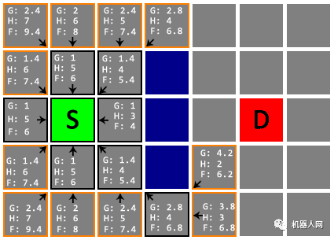

# 图知识

Created: October 9, 2022 3:29 PM

- ****一、图的基本知识****
    
    图就就是下面这种由节点和连接每对节点的边所构成的图形。
    
    
    
    1、如果给边加**上一个值表示权重**，这种图就是**加权图**，没有权重的图就是非加权图，没有权重的边只能表示两个节点的连接状态，而有权重的边就可以表示节点之间的“连接程度”。
    
    2、如果给边加上**表示方向的箭头**，即表示节点之间的传递方向，这种图就是**有向图**，而边上没有箭头的图就是无向图。
    
    3、如果图中**任意两个节点都能找到路径**可以将它们进行连接，则称该图为**连通图**，上面这个图就是连通图，反之则为非连通图。
    
    下面两个图分别为加权图和有向图：
    
    
    
    非连通图如下所示：
    
    
    
    **图的搜索算法**：图的搜索指的就是**从图的某一节点开始**，**通过边到达不同的节点**，最终找到**目标节点的过程**。根据搜索的顺序不同，图的搜索算法可分为**“广度优先搜索”**和**“深度优先搜索”**两种。
    
    **图的最短路径问题**：最短路径问题就是要在两个节点的所有路径中，找到一条所经过的边的权重总和最小的路径。相关算法有**“贝尔曼-福特算法”**，**“狄克斯特拉算法”**和**“A* 算法”**三种。
    
- ****二、广度优先搜索****
    
    广度优先搜索和深度优先搜索一样，都是**对图进行搜索的算法**，都是**从起点开始顺着边搜索**，此时并不知道图的整体结构，**直到找到指定节点(即终点)**。在此过程中每**走到一个节点**，就会判断一次它是否为终点。
    
    **广度优先搜索**会根据**离起点的距离**，按照从**近到远的顺序对各节点进行搜索**。
    而**深度优先搜索**会沿着一条路径**不断往下搜索**直到不能再继续为止，然后再折返，开始搜索下一条路径。
    
    下图中红色表示当前所在的节点**（节点A）**，终点设为节点G，将与节点A直连的三个节点B, C, D放入存放候补节点的队列中（**与节点A直连的三个节点放入时可以没有顺序**，这里的放入顺序为B, C, D），用绿色表示。
    
    
    
    此时队列中有B, C, D三个节点，我们来看看广度优先搜索是如何对各节点进行搜索的。
    
    
    
    1、上面左图：此时从队列中选出一个节点，优先选择最早放入队列的那个节点，这里选择最**左边的节点B**。将**已经搜索过的节点变为橙色（节点A）**，搜索到节点B时，将与节点B直连的两个**节点E和F**放入队列中，此时队列为 [C, D, E, F]。
    
    2、上面中图：对节点B搜索完毕，节点B不是要找的终点，再搜索节点C，将与节点C直连的节点H放入队列中，此时队列为 [D, E, F, H]。
    
    3、然后对节点D进行同样的操作，此时队列为 [E, F, H, I, J]。
    
    4、上面右图：对与节点A直连的节点搜索完毕，再对与节点B直连的节点进行搜索（因为剩下的点中它们最先放入队列），这里选择节点E，将与节点E直连的节点K放入队列中，此时队列为 [F, H, I, J, K]。
    
    然后一直按照这个规则进行搜索，直到到达目标节点G为止，搜索结束。
    
    
    
    广度优先搜索为**从起点开始**，由**近及远进行广泛的搜索**。因此，**目标节点离起点越近**，搜索结束得就越快。
    
- ****三、深度优先搜索****
    
    在深度优先搜索中，保存候补节点是**栈**，栈的性质就是**先进后出**，即最先进入该栈的候补节点就最后进行搜索。
    
    还是将起点设为节点A，终点设为节点G，还是先将与节点A直连的三个节点B, C, D放入存放候补节点的栈中（这里的放入顺序为D, C, B）。到这里和广度优先搜索似乎没什么区别。
    
    因为节点B是最后放入，则先从节点B开始搜索，将与节点B直连的两个节点E和F放入栈中，此时栈为 [D, C, F, E]。
    
    
    
    接下来就可以看出深度优先搜索和广度优先搜索存在的区别了。
    
    
    
    1、上面左图：然后再对节点E进行搜索，将与节点E直连的节点K放入栈中，此时栈为 [D, C, F, K]。
    
    2、此时节点K在栈的最后，所以先对节点K进行搜索，节点K不是终点，而且节点K没有其他直连的节点，所以此时栈为 [D, C, F]。
    
    3、上面中图：然后再对节点F进行搜索，节点F也不是终点，而且节点F也没有其他直连的节点，所以此时栈为 [D, C]。
    
    3、上面右图：接下来就对节点C进行搜索，将与节点C直连的节点H放入栈中，此时栈为 [D, H]。
    
    然后一直按照这个规则进行搜索，直到到达目标节点G为止，搜索结束。
    
    
    
    > **深度优先搜索**会沿着一**条路径不断往下**，**搜索直到不能再继续为止**，到了路径的尽头，再折返，再对另一条路径进行搜索。
    > 
- **四、总结**
    
    在操作步骤上却只有一点不同，那就是**选择哪一个候补节点作为下一个节点的基准不同。**
    
    广度优先搜索选择的是**最早成为候补的节点**，因为**节点离起点越近就越早成为候补**，所以会从离起点近的地方开始按顺序搜索；
    
    深度优先搜索选择的则是**最新成为候补的节点**，所以**会一路往下**，沿着新发现的路径不断深入搜索。
    
    通过**深度优先搜索**可以**判断图是否是连通图**。具体实现为：在图中**任意选择一个节点**，从该节点**开始进行深度优先搜索**，如果在这个搜索过程中所有的**节点都被搜索到**，则该图为连通；反之，若存在没有被搜索到的节点，则说明该图是非连通的。
    
    在广度优先搜索的执行过程中，搜索范围从起点开始逐渐向外延伸，所以**不但可以判断两个节点之间是否有路径**，还可以**找出这两个节点的最短路径**，即可以解决最短路径问题。
    
    广度优先搜索可以用于找到**两个节点的最短路径问题**，这里的最短路径其实是针对于**非加权图**，寻找段数最少的路径。但是对于加权图，**段数最少的路径并不代表路径中的权重总和也最小**。
    
    对于加权图，计算最短路径可以如下三个算法：
    
    1. 贝尔曼-福特算法（(Bellman-Ford）
    2. 狄克斯特拉算法（Dijkstra）
    3. A* 算法（A-Star）
- **A* 算法（A-Star）**
    
    A*（A-star）算法是一种**静态网路中求解最短路径最有效**的直接搜索算法。
    
    
    
    为了便于理解，本文将以正方形网格地图为例进行讲解。如图，蓝色格子是障碍物，灰色格子是可通过区域，绿色格子是起点（S），红色格子是终点（D）。我们要做的是找到一条从起点到终点的最佳路线。
    
    
    
    为了顺利地解决问题，我们先要设定一些约束条件：
    
    1. 从一个格子可以朝周围 8 个方向移动。其中朝上、下、左、右移动的成本为 1，朝左上、右上、左下、右下移动的成本为 1.4（√2 近似值）；
    
    
    
    2. 不能朝障碍物所在格子移动（显然啦！）；
    
    
    
    3. 如果右边和上边两个格子都是障碍物，则不能朝右上方的格子移动（如图：不能朝右上和右下两个格子移动，太窄挤不过去呀～）。
    
    
    
    首先，我们把起点 S 加入一个待检查节点的列表（Open List）。接下来，找出 S 周围所有可移动的格子（邻居），算出从 **S 移动到该格子的总成本（记为 G）**，并将 S 设为其父节点。
    
    
    
    好，这样我们已经完成了对 S 的检查。把上一步找到的**邻居都加入 Open List**。从 Open List 中移除 S，并将其加入另一个**已检查节点的列表（Closed List）**。如图，橙色边框代表待检查节点，黑色边框代表已检查节点。
    
    
    
    Open List 一下有了 8 个待检查节点，先检查哪一个呢？每一个待检查节点都有一个 **G 值**，代表从**起点 S 移动到这个节点的成本**。我们再计算出**每一个待检查节点**与**终点 D 之间的曼哈顿距离**（只通过朝上、下、左、右四个方向的移动，抵达终点 D 的最短距离。例如，在平面上，坐标(x1, y1)的i点与坐标(x2, y2)的j点的曼哈顿距离为d(i,j)=|x1-x2|+|y1-y2|），作为从**该节点移动到终点 D 的估算成本（记为 H）**。注意！这里计算曼哈顿距离时要**忽略所有障碍物**。最后把 G 和 H 相加（记为 F）。
    
    
    
    现在，从 **Open List** 中选出 F 值最小的节点（上图中应该是 S 右边 F 值为 4 的格子），对它执行前面的检查。不过这一次搜索邻居时需要注意以下几点：
    
    1. 如果邻居已经在 **Closed List** 中，直接忽略；
    2.  如果邻居不在 Open List 中，计算 G、H、F，设置父节点，并将其加入 Open List；
    3. 这一点非常重要！**如果邻居已经在 Open List** 中（即该邻居已有父节点），计算从**当前节点移动**到**该邻居**是否能使其**得到更小的 G 值**。如果能，则把该邻居的父节点重设为当前节点，并更新其 G 和 F 值。
    
    完成检查后，把当前节点从 Open List 中移除，放入 Closed List。
    
    
    
    继续处理其他待检查节点。
    
    
    
    
    
    
    
    注意！在下面这一次检查中，S 下方两格的节点（星标）更新了 G 值和父节点。
    
    
    
    
    
    
    
    在下面这一步中，我们注意到终点 D 已经进入了 Open List，并且是其中 F 值最小的。
    
    
    
    我们从 Open List 取出的 F 值最小的节点后，发现它的 H 值为 0，这意味着我们已经找到了终点 D，搜索到此就可以告一段落。
    
    
    
    从终点 D 开始，依次向父节点移动，直到回到起点 S，途经即最佳路线，总长 5.6。
    
    
    
    补充几点：
    
    1. 最佳路线可能有多条，比如本文的示例，下图也是一条总长为 5.6 的路线。这取决于当 Open List 存在多个 F 值最小的节点时，先选取哪一个进行搜索；
    
    
    
    1. 曼哈顿距离只是估算 H 值最简单的一种方法，常用的方法还有欧几里德距离、切比雪夫距离等。估算方法的优劣是影响算法效率的重要因素；
    2. Open List 的数据结构也是算法实现的改良点。通常为了从中取出 F 值最小的节点，我们需要遍历整个 Open List，对其排序。因此，维护一个好的 Open List 结构，减少遍历，也能够提高算法的效率；
    3. 实际应用中，为提高效率，还可以进行双向搜索。**从起点和终点分别发起搜索，一方搜索到另一方的已检查节点时，即找到最佳路线。**地图较复杂时，双向搜索可以显著减少寻路过程中检查的节点数量。
    4. 除了正方形网格地图，A* 算法也能处理其他正多边形镶嵌和复杂甚至不规则多边形镶嵌的地图。其区别在于对邻居的处理和计算；
    5. **A* 算法并不保证得到的路线是平滑的。**为了解决这个问题，我们可以对转向进行惩罚。即当移动方向发生变化时，增加额外的 G 值，以此提高转向的成本，从而得到更平滑（转向少、转角小）的最佳路线；
    6. A* 算法的在游戏中的实际应用可能会复杂得多。比如不同种族或技能的单位在同一地形上的移动成本各有差异，同一单位在草地、泥地、砂石、沼泽等各种地形上移动的成本也不尽相同（对应不同的 G 值增量），甚至允许以较高的成本翻越障碍（翻墙、过河等）；
    7. 在机器人路径规划中，你可能还需要处理与障碍物和其他移动物体的碰撞。
- **狄克斯特拉算法（Dijkstra）**
    
    Dijkstra算法算是**贪心思想**实现的，首先把**起点**到**所有点**的**距离**存下来找个最短的，然后松弛一次再找出最短的，所谓的松弛操作就是，**遍历一遍看通过刚刚找到的距离最短的点**作为中转站会不会更近，如果**更近了就更新距离**，这样把所有的点找遍之后就存下了**起点到其他所有点的最短距离。**
    
    **单源**什么意思？
    
    - 从一个顶点出发，**Dijkstra算法**只能求**一个顶点**到**其他点**的**最短距离**而不能任意两点。
    
    `bfs`求的最短路径有什么区别？
    
    - `bfs`求的与其说是**路径**，不如说是**次数**。因为bfs他是按照队列**一次一次进行加入相邻的点**，而**两点之间没有权值**或者**权值相等**(代价相同)。处理的更多是**偏向迷宫类**的这种都是只能走邻居(不排除特例)。
    
    对于一个Dijkstra算法而言，前提是它的前提条件和环境：
    
    - 一个**连通图**，**若干节点**，节点可能有数值，但是`**路径**`一定有`**权值**`。并且路径**不能为负**。否则Dijkstra就不适用。
    
    **Dijkstra的核心思想是贪心算法的思想:**
    
    贪心算法（又称贪婪算法）是指，在对问题求解时，总是做出在当前看来是最好的选择。也就是说，不从整体最优上加以考虑，他所做出的是在某种意义上的局部最优解。
    
    贪心算法不是对所有问题都能得到整体最优解，关键是贪心策略的选择，选择的贪心策略必须具备无后效性，即某个状态以前的过程不会影响以后的状态，只与当前状态有关。
    
    对于贪心问题大部分都需要**排序**,还可能会遇到类排序。并且一个物体可能有多个属性，不同问题需要按照不同属性进行排序，操作。
    
    那么我们的`Dijkstra`是如何贪心的呢？
    
    **Dijkstra算法的前提**：
    
    1. 首先，Dijkstra处理的是**带正权值**的`有权图`，那么，就需要一个**二维数组**（如果空间大用list数组）存储各个点到达(`边`)的权值大小。**(邻接矩阵或者邻接表存储)**
    2. 其次，还需要一个**boolean数组**判断那些点**已经确定最短长度**，那些点没有确定。**int数组**记录距离(**在算法执行过程可能被多次更新**)。
    3. 需要**优先队列**加入**已经确定点的周围点**。每次抛出确定最短路径的那个并且确定最短，直到所有点路径确定最短为止。
    
    **算法流程：**
    
    1、一般从选定点开始抛入优先队列。（路径一般为0），`boolean数组`标记0的位置(最短为0) , 然后0`周围连通的点`抛入优先队列中（可能是node类），并把各个点的距离记录到对应数组内(**如果小于就更新，大于就不动，初始第一次是无穷肯定会更新**)，第一次就结束了！
    
    2、从队列中抛出`距离最近`的那个点`B`（**第一次就是0周围邻居**）。这个点距离一定是最近的（所有权值都是正的，点的距离只能越来越长。）标记这个点为`true`，**并且将这个点的邻居加入队列**(下一次确定的最短点在前面未确定和这个点邻居中产生),并更新通过`B`点计算各个位置的长度，如果小于则更新！
    
    
    
    重复二的操作，直到所有点都确定。
    
    