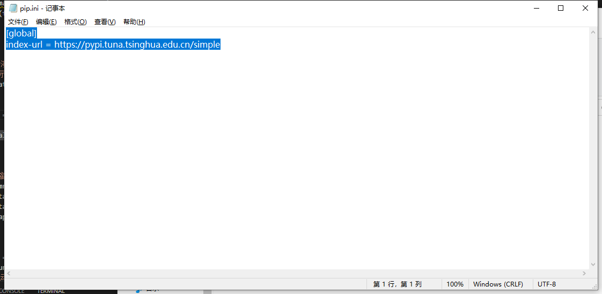

## 更改Vscode镜像源
第一步：创建如下路劲和文件：pip需要自己创建，pip.ini也需要自己创建。

第二步：添加镜像源：

```cpp
[global]
index-url = [<https://pypi.tuna.tsinghua.edu.cn/simple>](<https://pypi.tuna.tsinghua.edu.cn/simple>)
```


第三步：完毕


## 出错“CondaHTTPError: HTTP 000 CONNECTION FAILED for url ”
“CondaHTTPError: HTTP 000 CONNECTION FAILED for url ”以下是我的解决步骤。

1、以管理员身份打开命令行，执行“conda config --remove-key channels”命令，恢复Anaconda的源为默认 首先我认为是我的镜像有问题，所以想把镜像恢复为默认。

conda config --add channels [](https://mirrors.tuna.tsinghua.edu.cn/anaconda/pkgs/free/win-64)[https://mirrors.tuna.tsinghua.edu.cn/anaconda/pkgs/free/win-64](https://mirrors.tuna.tsinghua.edu.cn/anaconda/pkgs/free/win-64) conda config --add channels [](https://mirrors.tuna.tsinghua.edu.cn/anaconda/pkgs/main/win-64)[https://mirrors.tuna.tsinghua.edu.cn/anaconda/pkgs/main/win-64](https://mirrors.tuna.tsinghua.edu.cn/anaconda/pkgs/main/win-64)

这里要记住，网上的镜像后面没有win-64，但在网上的镜像地址里是有版本号的（这是一个大坑），在重新导入镜像后，需要进入.condarc，将-default默认的给删除。

2、找不到.condarc文件（此文件在C:\Users\admin目录下）的小伙伴可以尝试conda config --add channels r，重新创建一下文件，如果还是找不到，可以使用everything进行搜索，小编就是搜索出来的（咱也不知道为啥文件就是找不到）

3、如果上述方法还是不行，将https改为http。


## 安装anaconda
```cpp
wget https://mirrors.tuna.tsinghua.edu.cn/anaconda/archive/Anaconda3-2021.11-Linux-x86_64.sh
bash Anaconda3-2021.11-Linux-x86_64.sh
gedit ~/.bashrc
export PATH="/home/tobe/anaconda3/bin:$PATH"
source ~/.bashrc
conda --version
```

使用conda创建环境

```cpp
conda create -n zzy_bevf python=3.8
source activate
conda deactivate
conda activate zzy_bevf

pip install torch==1.10.0+cu113 torchvision==0.11.0+cu113 -f https://download.pytorch.org/whl/torch_stable.html
```
## Anaconda安装与Pycharm环境搭建
Anaconda 是一款集成的Python环境，安装它后就默认安装了 Python、Ipython 和众多的包和模块。  
1. Anaconda 安装：  
（1）下载 Anaconda  
终端上直接通过命令行下载Anaconda。  
cd ~ #进入家目录，然后执行下面的下载命令将其下载到家目录。  
wget https://mirrors.tuna.tsinghua.edu.cn/anaconda/archive/Anaconda3-5.1.0-Linux-x86_64.sh
  
2）安装 Anaconda  
在家目录下，执行该脚本文件进行安装：  
bash Anaconda3-5.1.0-Linux-x86_64.sh  
执行该命令安装，会出现阅读说明，按「Enter」键一步步阅读，当出现提示 “yes or no” 时，可以统一 yes。当  
提示是否同意安装 Vscode 时 ，根据个人需要 yes/no 均可，为了轻量化选择 no 。然后回车键安装结束，命令行  
输入ls查看到家目录有 anaconda3，表明安装成功，结果如下图所示：  


（3）配置环境变量  
在终端上执行如下命令配置环境变量：  
echo 'export PATH="~/anaconda3/bin:$PATH"' >> ~/.bashrc 
- 该命令通过echo打印出一行文本，其中包含了要添加到PATH中的内容，即"export PATH="~/anaconda3/bin:$PATH""。然后，通过>>操作符将该文本追加到当前用户的.bashrc文件中。.bashrc文件是在bash shell启动时自动执行的脚本文件，其中包含了一些用于配置bash shell环境的命令和变量定义。因此，一旦执行了这个命令，下次启动bash shell时就会自动将Anaconda的路径添加到PATH中，从而可以方便地使用Anaconda中的命令和工具。
source ~/.bashrc #更新环境配置立即生效


