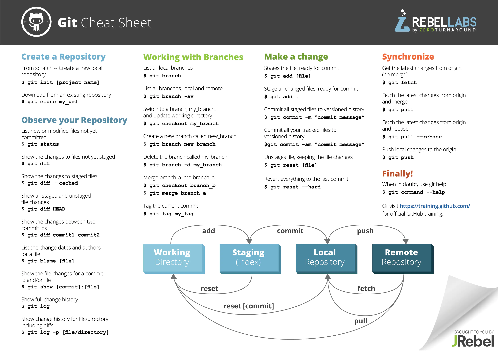

# GIT


# **0. 前言**

[https://p6-tt.byteimg.com/origin/pgc-image/5949c013686e4d2c9ed529197676d08c?from=pc](https://p6-tt.byteimg.com/origin/pgc-image/5949c013686e4d2c9ed529197676d08c?from=pc)

# **1. 常用命令**

# **1.1. git 配置**

```rust
# 显示 config 的配置 加--list
# 优先级：local > global > systemgit config --list --local # local 的范围是某个仓库git config --list --global # global 的范围是登录的用户git config --list --system # system 的范围是系统所有登录的用户# 配置用户 name 和 emailgit config --global user.name 'your_name '
git config --global user.email 'your_email@domain.com'
# 清除配置信息git config --unset --global user.name
```

# **1.2. 仓库初始化**

```kotlin
# 将执行该命令时所在的目录初始化为一个 git 仓库（如：进入某目录后执行该命令会将该目录初始化为一个 git 仓库）
git init
# 会在当前路径下创建和项目名称同名的文件夹，并将其初始化为 git 仓库git init your_project
```

# **1.3. git add**

```
git add readme.md # 将 readme.md 文件添加到暂存区
git add . # 将当前工作目录的所有文件添加到暂存区
git add -u # 把修改之后的文件（这些文件已经被管理起来了）一次性提交到暂存区
```

# **1.4. git status**

```
git status # 查看工作目录和暂存区的状态
```

# **1.5. git commit**

```
git commit -m 'Add readme.md' # -m 指定 commit 的信息
git commit # 这时候会跳出一个文本输入界面，让你输入更多的 commit 信息
```

# **1.6. git mv**

```
git mv readme readme.md # 将 git 管理的文件进行重命名
```

# **1.7. git rm**

```
git rm filename # 从 git 管理的文件删除某个已管理的文件，同时把修改的情况添加到暂存区
```

# **1.8. git log**

```cpp
git log # 只查看当前分支(Head所指的分支)的log情况
git log --oneline # 简洁的显示版本更新信息
git log -n2  # n2 代表查看最近两次commit历史
git log -2   # 2 代表查看最近两次commit历史
git log -n2 --oneline # 简洁的显示最近两次的版本更新信息
git log branch_name # 后面跟上分支名表示查看该分支的log日志
git log -all # 列出所有分支的log
git log --all --graph # 以图形化的方式查看
git log --oneline --all # 以简洁的方式查看所有分支的log
git log --oneline --all -n4# 以简洁的方式查看所有分支的log
git help log # 以web的方式查看log的帮助文档，等同于
git help --web log # 和上面那条效果一样
```

# **2. 分支相关**

```
git branch -v # 查看本地分支的详细情况
git branch -a # 查看所有分支，包括远端分支，但没有过于详细的信息
git branch -av # 查看所有分支情况
git branch branch_name hash_value # 创建一个新的分支，基于 hash_value 的这个 commit 创建一个新的分支，hash_value 可以省略，那么默认是基于当前分支的最后一个 commit 创建。
git branch -d branch_name
git branch -D branch_name  # 这个分支已经有了一些 commit
git checkout branch_name # 切换分支
git checkout master
git checkout -b branch_name git_id # 创建一个新的分支并切换过去，git_id可以是hash_value，也可以是某个分支的名字（分支的名字其实就指向了某个 commit）
git checkout -b temp 9ef147d
git checkout -b temp2 master
git checkout hash_value  # 分离头指针
```

# **3. 比较**

```
git diff hash_value1 hash_value2 # hash_value1 对应的 comimit 和 hash_value2 对应的 commit 进行比较
git diff hash_value1 hash_value2 -- file_name1 file_name2 # 在上述基础之上，只比较 file_name1、file_name2 这两个文件
git diff branch_name1 branch_name2 # 对两个分支进行比较，也可以跟 -- 只看某些文件
git diff HEAD HEAD^  # HEAD 指向的 commit 与该 commit 的父亲 commit 进行比较
git diff HEAD HEAD^^ # HEAD 指向的 commit 与该 commit 的父亲的父亲 commit 进行比较
git diff HEAD HEAD~  # HEAD 指向的 commit 与该 commit 的父亲 commit 进行比较
git diff HEAD HEAD~1 # 同上
git diff HEAD HEAD~2 # HEAD 指向的 commit 与该 commit 的父亲的父亲 commit 进行比较
git diff --cached  # 暂存区和 HEAD 做比较，也可以跟 -- 只看某些文件
git diff      # 工作目录和暂存区中所有文件进行比较，也可以跟 -- 只看某些文件
```

# **4. 版本历史更改**

```
git commit --amend # 最近一次 commit 的 message 修改
git rebase -i hash_value # 交互文件中选择 reword，老旧 commit 的 message 修改。hash_value，是需要的 commit 的父亲 commit 的 hash_value
git rabase -i hash_value # 交互文件中选择 squash，多个连续 commit 合并成一个，hash_value 同上
git rebase -i hash_value # 交互文件中选择 squash，把间隔的 commit 移到一块，即可合并成一个，hash_value
git rebase origin/master # 把当前分支基于 origin/master 做 rebase 操作，也就相当于把当前分支的东西加到 origin/master 中
```

# **5. 回滚操作**

```sql
git reset HEAD        # 暂存区恢复成和 HEAD 一样
git reset HEAD -- file_name1 file_name2 # 暂存区部分文件变得跟 HEAD 一样
git checkout -- file_name # 工作目录指定文件恢复为和暂存区一样
git checkout -- *|. ## 工作目录全部文件恢复为和暂存区一样
git reset --hard hash_value # 把 HEAD、暂存区、工作目录都回滚到 hash_value 所代表的 commit 中。
git reset --hard  # 把暂存区里面的修改去掉，也就是让暂存区、工作目录默认恢复到 HEAD 的位置
```

# **6. 工作目录、暂存区状态保存**

```
git stash # 把相应的修改内容给存下来，之后 git status 查看的话又变为什么都没改变的了
git stash list # 查看存下来的内容
git stash apply # 存下来的内容又恢复了，但是存下来的内容还在 stash 中
git stash pop   # 存下来的内容恢复了，但是存下来的内容也没了
```

# **7. 合并**

```sql
git merge branch_name1 branch_name2
git merge hash_value1 hash_value2
git merge --squash # 以 squash 方式进行 merge
```

# **8. Git 对象操作**

```
git cat-file -t|p|s hash_value # 显示版本库对象的内容，类型及大小信息
git cat-file -t hash_value  # 查看版本库对象的类型
git cat-file -p hash_value  # 查看版本库对象的内容
git cat-file -s hash_value  # 查看版本库对象的大小
```

# **9. Git 远端操作**

```xml
git remote add <远端名> <远端仓库地址> # 这边远端名的意思是远端仓库的别名，push、pull 都将用到远端名
git remote -v  # 查看远端仓库连接情况git remote set-url <远端名> 你新的远程仓库地址 # 修改远端仓库地址
git remote rm <远端名>      # 删除远端仓库
git clone <远端仓库地址> # 把远端仓库 clone 下来
git clone --bare  <远端仓库地址> # bare 是指不带工作目录，也就相当于只 clone .git 目录
git push <远端名> <本地分支名>
git push -u <远端名> <本地分支名> # -u 表示将本地分支的内容推到远端分支，并且将本地分支和远端分支关联起来
git push -u origin master # 表示把本地 master 分支的内容推到远端分支 origin/master，并且将本地分支 master 和远端分支 origin/master 关联起来git push # 这条命令也可以使用，默认是将当前本地所在分支推到相关联的远端分支git fetch <远端名> <本地分支名>
git fetch origin master # 将远端分支 origin/master fetch 到本地git pull <远端名> <本地分支名> # 将远端分支 fetch 到本地，并且将远端分支和本地所处分支进行合并
git pull --rebase # 以 rebase 方式进行合并，也就是将本地分支 rebase 到远端分支
```
