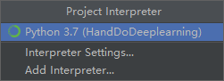
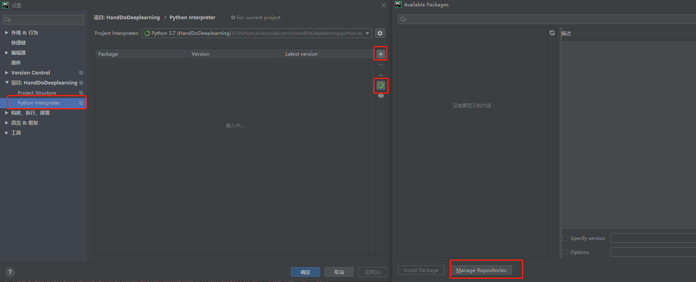
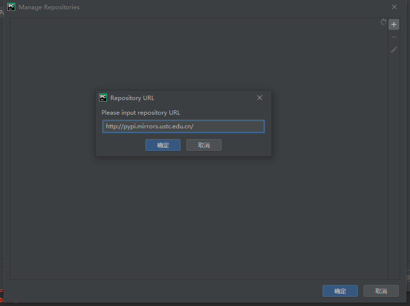
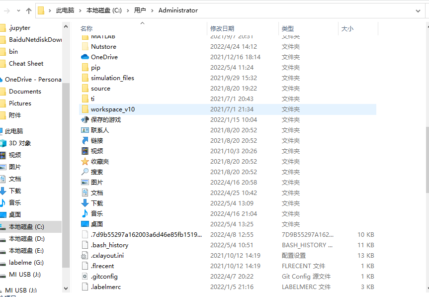
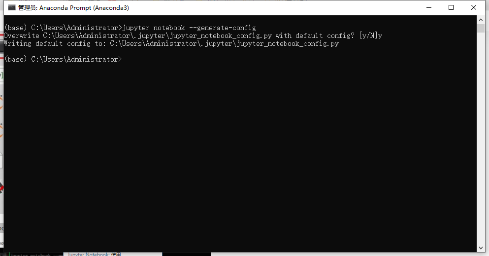
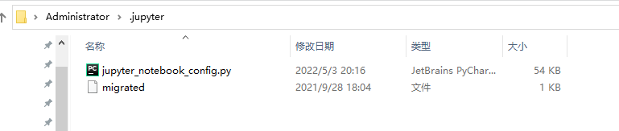
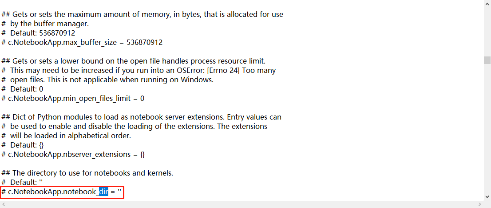
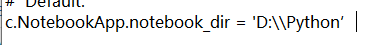
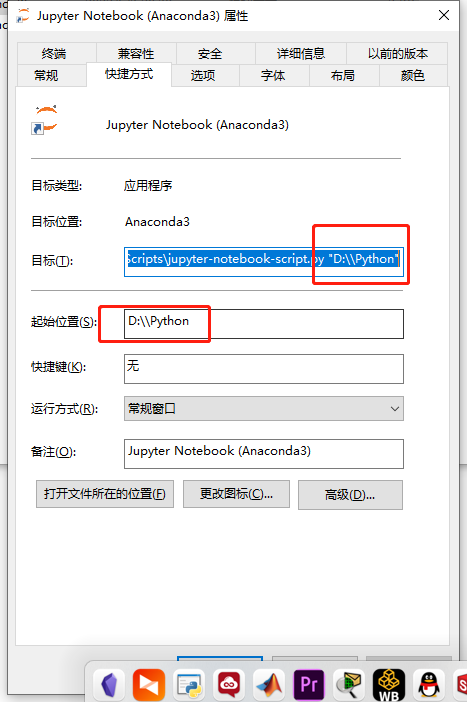

::: tip
激活和安装
:::

# 激活


---
# 更改Pycharm镜像源
## pip镜像源地址

```cpp
源地址：<https://pypi.python.org/simple>](<https://pypi.python.org/simple>)

清华：<https://pypi.tuna.tsinghua.edu.cn/simple>](<https://pypi.tuna.tsinghua.edu.cn/simple>)

阿里云：<http://mirrors.aliyun.com/pypi/simple/>](<http://mirrors.aliyun.com/pypi/simple/>)

中国科技大学 <https://pypi.mirrors.ustc.edu.cn/simple/>](<https://pypi.mirrors.ustc.edu.cn/simple/>)

华中理工大学：<http://pypi.hustunique.com/>](<http://pypi.hustunique.com/>)

山东理工大学：<http://pypi.sdutlinux.org/>](<http://pypi.sdutlinux.org/>)

豆瓣：<http://pypi.douban.com/simple/>](<http://pypi.douban.com/simple/>)
```

## conda镜像源

```cpp
<http://mirrors.tuna.tsinghua.edu.cn/anaconda/pkgs/free/>
<http://mirrors.tuna.tsinghua.edu.cn/anaconda/cloud/conda-forge/>
<http://mirrors.tuna.tsinghua.edu.cn/anaconda/cloud/msys2/>
<http://mirrors.tuna.tsinghua.edu.cn/anaconda/cloud/bioconda/>
<http://mirrors.tuna.tsinghua.edu.cn/anaconda/pkgs/main/>

<http://mirrors.aliyun.com/pypi/simple/>
<https://pypi.tuna.tsinghua.edu.cn/simple/>
<http://pypi.douban.com/>
<http://pypi.mirrors.ustc.edu.cn/>
```

## 利用镜像源安装的命令举例：

`pip install numpy -i <https://pypi.tuna.tsinghua.edu.cn/simple`>

## 修改pycharm镜像源步骤

第一步：


第二步：


第三步：



# Pycharm无法创建编译器
转到`C:\\Users\\User_name`并搜索文件`.condarc`。从此位置删除它。

完毕！
# 如何修改Jupyter默认路径

## 方法一

1. 打开Anaconda Prompt
2. 输入：jupyter notebook --generate-config
3. 找到目标地址
    
    
    
4. 找到文件，用记事本打开
    
    
    
5. 修改默认路劲
    
    
    
6. 修改为：c.NotebookApp.notebook_dir = 'D:\\Python’
    
    
    
7. 注意，两个地方都要修改。
    
    
    

## 方法二

1. 打开Anaconda Promt
2. cd D:\python
3. jupyter notebook