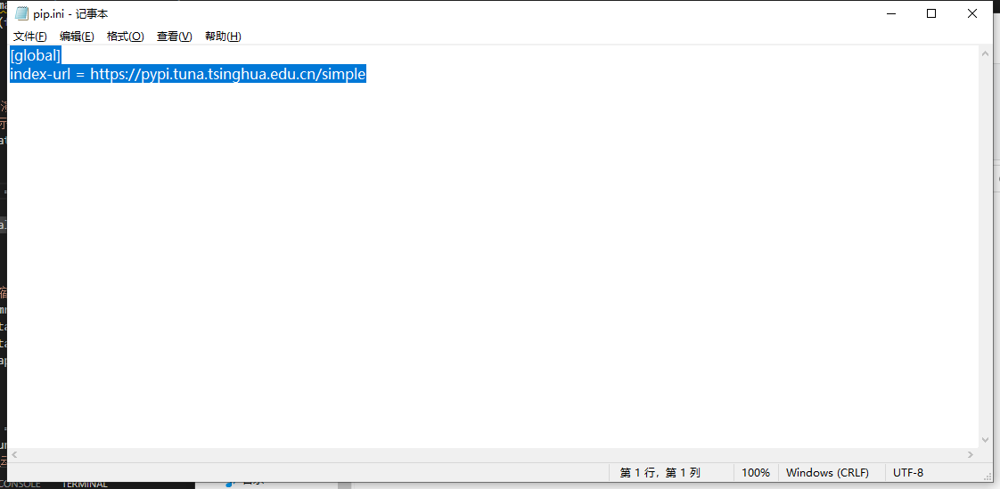
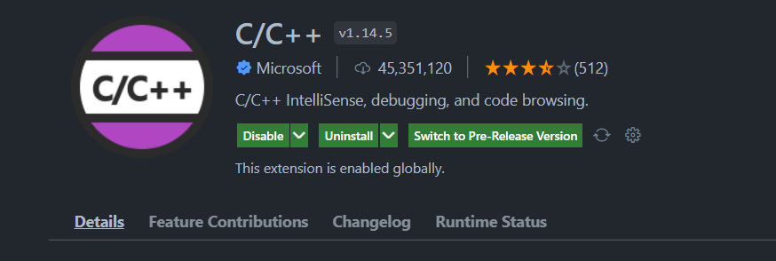

::: tips
Vscode常见问题

:::


# 更改Vscode镜像源
第一步：创建如下路劲和文件：pip需要自己创建，pip.ini也需要自己创建。

第二步：添加镜像源：

```cpp
[global]
index-url = [<https://pypi.tuna.tsinghua.edu.cn/simple>](<https://pypi.tuna.tsinghua.edu.cn/simple>)
```


第三步：完毕


# Vscode 配置c++环境
第一步：下载GCC

[https://jmeubank.github.io/tdm-gcc/articles/2021-05/10.3.0-release](https://jmeubank.github.io/tdm-gcc/articles/2021-05/10.3.0-release)

第二部：安装插件

