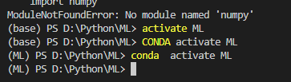

# 在vscode中激活conda虚拟环境报错或者打不开虚拟环境的问题：

CommandNotFoundError: Your shell has not been properly configured to use 'conda activate'.
If using 'conda activate' from a batch script, change your
invocation to 'CALL conda.bat activate'.
在网上找了好多方法都没成功，也不知道到底是什么问题。最后找到了这个解决方法，解决了我的问题。

解决方法：
1、在VScode terminal powershell 中执行conda init后重启vscode，此时会有标红的错误信息出现，不用管，直接忽略错误信息进行下一步。

conda init

2、打开电脑Windows的开始界面，然后直接搜索关键字powershell ，打开第一个Windows PowerShell：

以管理员身份运行打开，如下图，输入以下命令：

set-ExecutionPolicy RemoteSigned

3、重新打开Vscode

# 弄清楚Vscode编译器设置

首先，vscode可以设置interpreter，这里设置的解释器主要是用来点击运行的时候使用的。

第二个，在Terminal下也可以设置一个虚拟环境，

这里设置的环境是通过命令编译时候所使用的编译器，可以不同。总之就是，按钮运行用的，就是左下角设置的，命令行运行代码的就是（）里面的。

在激活环境的时候，在python terminal、powerShell下必须使用

conda activate ML

而在cmd下,两种都可以

# ****解决VSCODE中python程序的相对路径问题****

在设置中搜索terminal

找到python项，勾选下面的选项

完成！

# 插件

## AREPL automatically evaluates python code in real-time as you type.

## Kite

[https://www.kite.com/get-kite/](https://www.kite.com/get-kite/)

Kite is an **AI-powered** programming assistant that helps you **write code faster inside Visual Studio Code**. Kite helps you write code faster by saving you keystrokes and showing you the right information at the right time.

**Kite works for all major programming languages:** Python, Java, Go, PHP, C/C#/C++, Javascript, HTML/CSS, Typescript, React, Ruby, Scala, Kotlin, Bash, Vue and React.

## ****autoDocstring****

## Pytest

## ****Python Test Explorer for Visual Studio Code****

