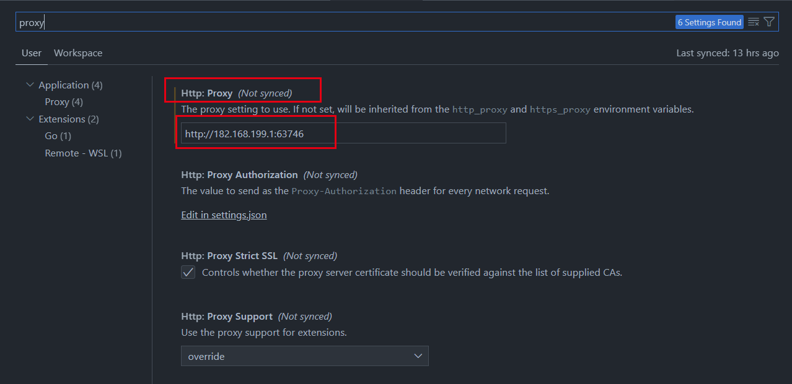
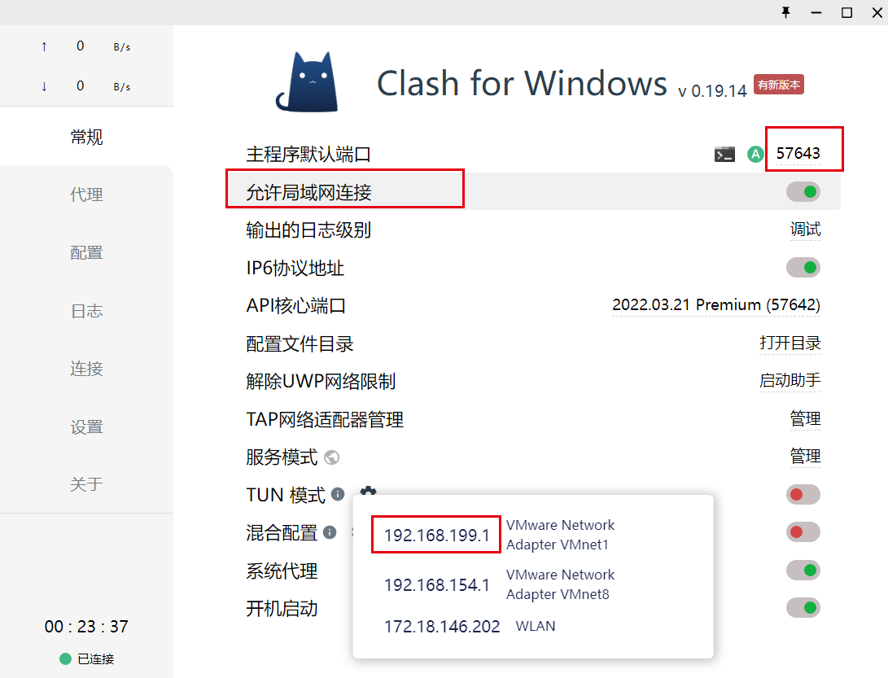

**问题描述**
- git push 时，连接失败

**需求**
vscode使用代理，进行push

**步骤**
- requiements:
- [ ] 有clash
- [ ] 有vscode

- step
- [ ] 打开vscode左下角的小齿轮，找到setting
- [ ] 
- [ ] 打开clash的常规界面
- [ ] 把clash 的地址和端口填在上面
- [ ] 完毕！
