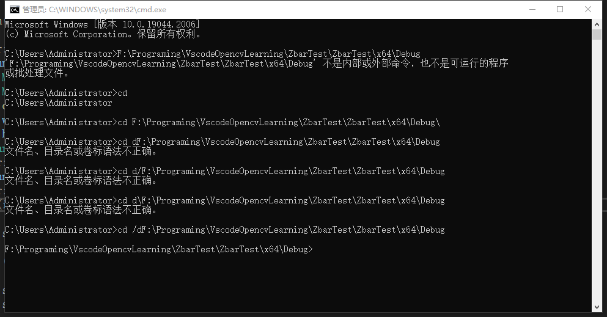
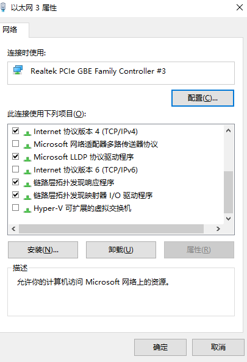
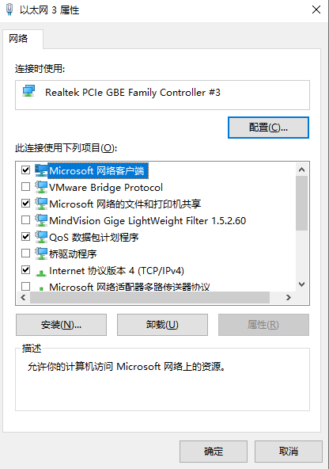

::: tip
计算机常见问题

:::


## cd无效
    

    
## 环境变量
    一般在环境变量里添加bin路径
    
## include
    
    ```cpp
    用include 引用头文件时，双引号和尖括号的区别：
    
    1.双引号：引用非标准库的头文件，编译器首先在程序源文件所在目录查找，如果未找到，则去系统默认目录查找，通常用于引用用户自定义的头文件。
    
    2.尖扩号：只在系统默认目录（在Linux系统中通常为/usr/include目录）或者尖括号内的路径查找，通常用于引用标准库中自带的头文件。
    
    综上，标准库自带的头文件既可以用双引号也可以用尖括号，不过习惯使用尖括号，用户自定义的头文件只能用双引号。
    ```
## 网络未连接
🪁 出现问题：****以太网适配器的驱动程序可能出现问题****
解决办法：只勾选以下的内容，点确定

