::: tip
面试问题
:::

### 经纬恒润

1、自我介绍

2、你熟悉的哪些感知类传感器？

3、简单介绍一下你的项目？

4、处理过哪些数据类型？

5、期望的薪资是多少？

6、你觉得你在项目中的角色是怎样的？

7、你认可军方否定用激光的理由吗？

8、你熟悉智能驾驶的汽车框架吗？

9、你为什么报的是测试岗

10、毫米波雷达是数据格式是怎样的？

11、介绍一下NXP智能小车？

12、做过这么多事，你认为最有成就的一件事是什么？

13、你最熟悉的编程语言、软件是什么？

14、实际的桨叶运动，会不会对你现在的测量产生影响？

15、你是如何评定你测量方法的精度的。

16、你边缘处理采用的是什么方法？

17、你用的毫米波雷达是二次开发还是直接拿来用。

18、你的数据是传感器输出直接用吗？

### 海康威视

-   1、你的相机采用的接口是什么？
    
	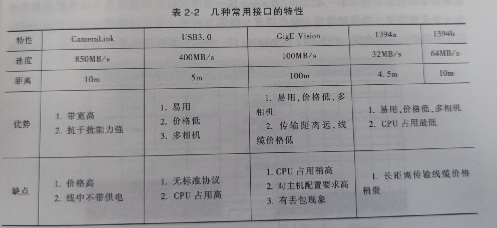
    
-   2、c\c++\python的区别、特点？
    
    1、语言类型不同：c++属于静态；Python属于动态。
    
    2、运行效率不同：c++的运行效率要比Python快。
    
    3、学习难度不同：c++更加复杂；Python更容易上手。
    
    4、编程执行方式不同：c++需要经过编译才能运行；Python不需要经过编译。
    
    5、函数库的使用方法不同：c++引用头文件需要告知预处理器这个文件的内容；Python可以使用函数直接引用。
    
    c++有部分语法与c语言相似以及相同。它擅长面向对象编程，也可以基于过程进行编程，由它编出的程序的稳定性非常高，但是通常都不支持跨平台使用。
    
-   3、比赛经历中最难一件事？有哪些技术难点，出现问题怎么解决的？
    
-   4、你的工作中，如何进行图像处理，从输入到输出？
    
    第一步：读取图像，利用事先标定好的内参，以及dist畸变矩阵对图像进行畸变校正
    
    第二步：获取`aruco` 字典
    
    第三步：使用aruco.detectMarkers()函数可以检测到marker，返回ID和标志板的4个角点坐标。
    
    第四步：估计每个标记的姿态并返回旋转矩阵和平移矩阵
    
-   5、代码量怎么样？
    
-   6、三句话总结一下项目特点、你做的工作？
    
-   7、你做的主要是软件、算法编程，包不包括其它的？
    
-   8、你的测试平台的怎么验证你测量的有效性的？
    
-   9、人脸识别用的哪些库？
    
-   10、你是怎么对毫米波雷达精度进行改进的？
    
-   11、你现在的精度达到了要求吗？
    
-   12、你软件开发是用的window还是linux？
    

### 陈珂博世一面

-   如果团队里有一个人有自己的想法，别人不同意会怎么吧？
    
    首先，我认为这应该是一个非常普遍的情况。从我的个人经历来说吧。我和导师的意见经常不一致，但是我都会通过公式与原理分析先去分析问题点，通过制作形象的PPT来解释我的意见。在研究电磁测距方案的时候，因为我们是多个方案同时进行的，需要尽快确定一个最可行的方案。当时遇到的第一个问题就是最先进的毫米波雷达测距分辨率都太低了，无法满足我们的要求，导师就觉得应该改用其他方案，但是我后面就仔细去研究它的原理，分析影响分辨率的因素，以及我们项目的目标，指出分辨率难以提高不意味着精度无法提高，后来就开始研究精度问题，不断否定又不断提出新的方法。螺旋式优化上升。 还有就是关于共轴旋翼的运动控制问题，我们老师资历也比较老，之前还去参观过航展，认为自己比较了解结构。但是我在会上介绍的和他的不太一致，他开始就固执认为他是对的。我首先是认同老师的，会后我询问了各位在座的同学，他们的看法，发现他们是认同我的。我就搜集了更多相关资料，希望用更形象的方式去让老师尽快接受，后来我们老师在会上承认了自己认识的欠缺，也表扬了我这种精神。经常会发生类似的事情，我们老师就很喜欢我，一直想留我读博，但是我一心想早点给家里承担责任，多次拒绝。
    
-   我机械专业看上去与软件不相关，跟其他自动化或者计算机专业学生相比，优势在哪？
    
    我的专业涉及光、机、电、算等多个学科的知识，这就使得具有学科融合的综合能力，而实际的产品肯定是各学科的综合体现，当我们在解决问题的时候，思路肯定会更加开阔，不仅仅会单纯从某一个技术出发，而且了解各个部分之间的流程和关系，这让我们有时候容易想到更简单的解决办法。
    
-   本科和研究生阶段都学过哪些嵌入式相关课程
    
-   介绍一个你觉得做的深入的项目，这个项目的大致框架是怎样的，自己做了哪些工作，软件中有哪些任务
    
-   网上相关的资料比较多，这个项目的难度在哪里？
    
-   其他同学有一个想法，其它人都赞同，只有自己不赞同，是坚持还是放弃?
    
-   一个软件开发的好还是不好，如何去评价？
    
-   关于C++的项目经验？
    
-   以后的职业规划如何？
    

### 海康二面

1、简单做一下自我介绍，被打断，稍后再谈项目问题

-   2、我看你在简历上有图文展示，主要是为了表达什么含义？
    
    主要是未来展示个人项目经历比较丰富，各个学科有有所涉及，当我们在解决问题的时候，思路可能会更加开阔，不仅仅会单纯从某一个技术出发，而且了解各个部分之间的流程和关系，这让我们有时候容易想到更简单的解决办法。
    

3、请问你作为电磁负责人，是不是主要做一些硬件相关的工作

4、你说你是一个执拗的人，那你和你导师有什么矛盾的时候，你是怎么解决的？

5、你可以说一说你们项目的主要难题是什么吗？你在项目中主要做了哪些贡献?

6、我看你写的工作时间，是每天都是这个时间吗？

7、你们为什么不一开始就把项目的难点、方案定下来，这样推进不是更容易吗？

8、你的动力来自于哪里？

9、你对工作考虑的主要有哪些方面，家里的意见怎么样？

10、第一考虑的工作地点是什么？

11、你对薪资有什么要求？

12、你刚刚说看身边的同学的薪资，是你已经拿到了其它offer吗？

13、你未来的目标是怎样的？

14、为什么五月就突然有灵感了，之前在做一些什么工作呢？

15、你对海康有什么了解？

16、你说你喜欢帮助别人，你是怎么帮助别人的?

### 荣耀一面

1、请从教育经历、获奖经历、实习经历、项目经历等方面进行自我介绍

2、我看你做的这些都是硬件相关的，请问你可以说一说你的哪些工作与嵌入式相关？

3、请问你了解内存泄漏吗？

4、网络知识，TCP和UDP区别

5、你有对笔试的结果进行复盘吗？

6、你说的opencv之类的都是对库直接调用，那你知道它其中的原理吗？

7、说一下高斯滤波是怎样的？

8、你觉得1x1卷积核存在吗？有什么作用？

### 中兴一面

1、我看你简历上写的是算法在软件前面，是更想去算法岗吗？

2、你有涉及信道估计吗？你认为信号在传输过程中，中间的信道是一致的吗？

3、方便具体说一下你的算法是怎样实现的吗？

4、你对数字信号处理比较了解对吗？

5、你期望的城市是在北京对吗？

6、你这边测量怎么确定它是交汇时刻的测量？

7、我看你说带两位本科生做毕设，你是如何给他们分配任务的？

8、你认为项目中遇到的最大困难是什么？你是怎么解决的？

9、我看你简历上有个实习经历，主要是干啥的？

10、你说自己是工作狂，你能接受的工作强度有多大？

### 滴滴面试

1、黑盒测试和白盒测试的区别？

2、Python数据类型

3、list和元组的区别

4、测试的作用是什么？

5、你平时是怎么学习的？

6、数组去重

7、

-   美的面试
    
    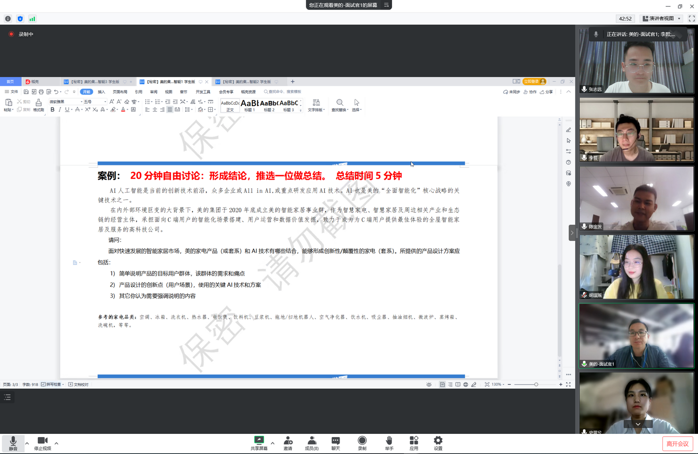
    
-   深信服
    
    1、sizeof()用过吗？
    
    2、TCP和UDP区别？
    
    3、堆和栈的区别？
    
    4、TCP连接过程？
    
    5、线程和进程的区别？
    
    6、如何查看进程？
    
    7、你知道typedef吗？
    
    8、手撕代码：反转链表？ 9、手撕代码：判断两个二叉树是不是同一个？
    
    10、用宏定义函数和普通函数定义有啥区别？
    
    -   11、你知道static关键字的作用吗？
        
        1). 在函数体，一个被声明为静态的变量在这一函数被调用过程中维持其值不变。
        
        2). 在模块内（但在函数体外），一个被声明为静态的变量可以被模块内所用函数访问，但不能被模块外其它函数访问。它是一个本地的
        
        [全局变量](https://so.csdn.net/so/search?q=%E5%85%A8%E5%B1%80%E5%8F%98%E9%87%8F&spm=1001.2101.3001.7020)。
        
        3). 在模块内，一个被声明为静态的函数只可被这一模块内的其它函数调用。那就是，这个函数被限制在声明它的模块的本地范围内使用。
        
-   易思维
    
    -   [ ] 激光三角法测量
    -   [ ] 霍夫变换
    -   [ ] 内参、外参矩阵
    -   [ ] 如何让函数不能修改成员变量
    -   [ ] 如何修改const
    -   [ ] 用过哪些STL
    -   [ ] 什么时候迭代器会失效
    -   [ ] 遇到的最大困难
    -   [ ] 用什么语言比较多
    -   [ ] 非线性优化

### 职业规划

我想，在刚进入公司的初期，我会努力尽快熟悉岗位要求，充分利用公司给予的平台，根据需要多学一些技术，多和前辈交流，把职责范围内的事情做好。

当自己具有一定的经验后，将眼光投向全行业，可能会提出一些创新的方案，为公司创造一定的价值。

再进一步，自己可能就成为团队的负责人，我将自己所学所积累的经验分享出去，考虑怎么让技术发挥更大的效益。

### 反问的一些问题？

1、想了解一下咱们这个岗位具体是做一些什么工作？

2、应届生进去会有什么样的培训吗？

3、有没有岗位轮动，比如某一个 方向遇到了瓶颈？

4、职业发展体系是怎样的？ 5、什么时候会有面试结果呢？

6、咱们之后会有几轮面试呢？

## 相关岗位要求

-   ****融合定位算法工程师-深圳佑驾创新科技有限公司****
    
    [请稍后](https://www.zhipin.com/job_detail/690af6fa6940a1121Xdy0tu6F1dY.html?lid=2lnQwiiN6iH.search.4&securityId=ALu1ZWzvI9PHW-K1hHqill3CYpYrjRPqz1E-bExuazWQZQCOk17kDeBxcPZg_fZRhrjRjLU_rzkNMCKC-QAkNOl2VVb16TiHnDS0_DBr__rp08DJlTT94glfdFLrDf_JqAZMiDzcOzqyioEaSTLQ9cL6qtZk1xKrZRG-P761kIuy9A~~)
    
    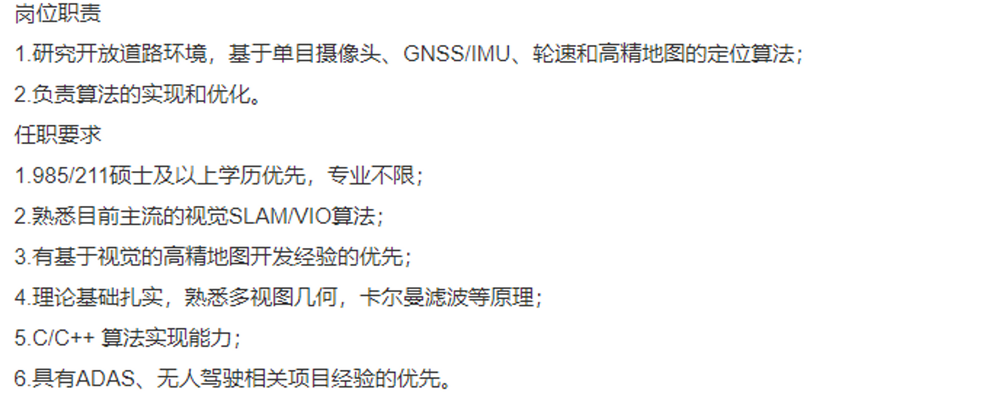
    
-   ****感知算法工程师-影石Insta360****
    
    [请稍后](https://www.zhipin.com/job_detail/9e630167d5a1eff01XB-2dy7GVFX.html?lid=2ltG7DFYsZf.search.24&securityId=ckNIB4ME8PHGB-V1CmZJpHUfCFznZb0FT7LlvTmA8gchyIXsgBa9NrQTM0mY8nJWQ0AShHRk6UJLsBWg3o16PMsOYJ00XNxg9VmffECPtxhV8FQh1feU-hN9SQsltl_yDWjGnpUYFFR0god7CU5k4pCvE8NquIHFvtMiHYAyqc0-5Epp)
    
    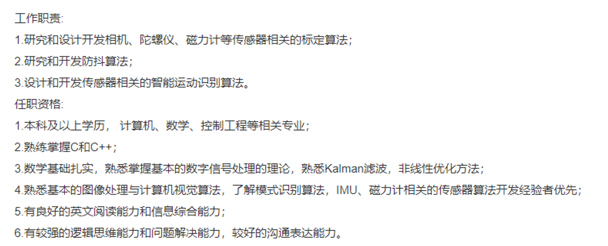
    
-   **算法工程师-亿道电子**
    
    [请稍后](https://www.zhipin.com/job_detail/5f9c26a45a98b8fc1XBy2d25EVJS.html?lid=2ltG7DFYsZf.search.29&securityId=sCKg3nm6pavy4-V18WBXJfUZZard2dIIr34iiRBFqXg-TliZJj3KsI-wnqIjAaVyThH7aCrBxFFev8FBPJUWmwKG6owx2wWd1tv91ID61dN1asiJ6p4e6bX4j8QRGwZuoLFLxd-BlB7l5jFoA2mWMQNqqa7VCfHLmAwqfeEQf1Yvfic~)
    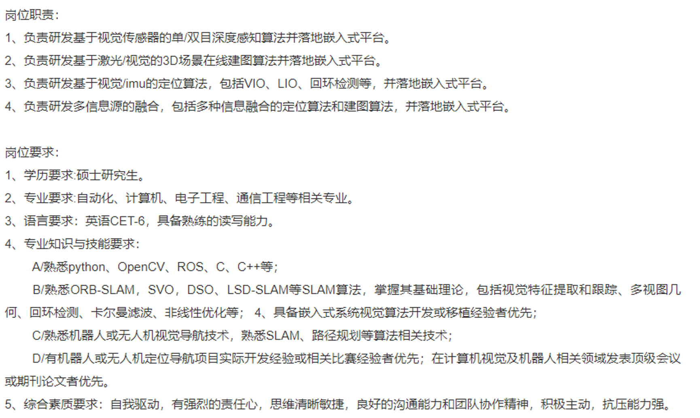
    
-   ****初级算法工程师-英特灵****
    
    [请稍后](https://www.zhipin.com/job_detail/7fcd8ee99204a9141XB92dS9F1ZZ.html?lid=2lFfvv1HuPI.search.5&securityId=Psypq6bi6M4gT-h1RB5C42FwqTDDLsRz84q4FiINr3duNI8zSJn9lMr1t81mh8_bR_onhFv5GUpVi_usoVaxRo4viv5B40QGu1CcifmgI-IhkXDqyqonyKbIk5tZtHvK0rI__94o9cQTdCexFBlLJgnaLlma0T5SFrNNRLbnYIeb0dE~)
    
    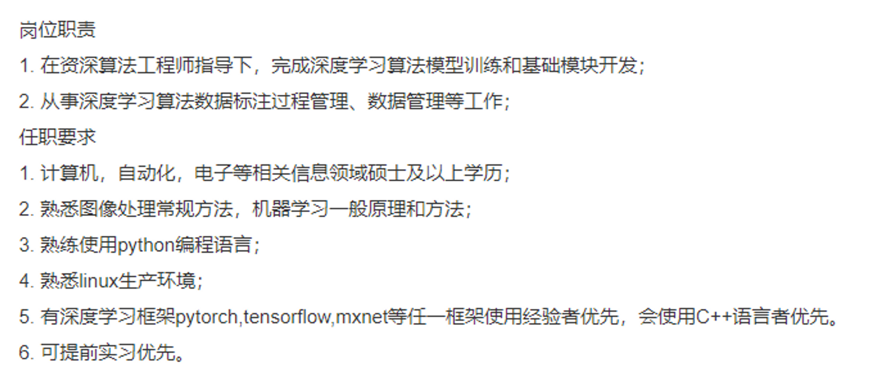
-   ****感知算法工程师-深圳佑驾创新科技****
    
    [请稍后](https://www.zhipin.com/job_detail/dfdd0dd64844a08d1XB529y0GFFZ.html?lid=2lFfvv1HuPI.search.7&securityId=FLGXmbbZzz170-r1ANnVe92hTMPsNgiWMsBy1TURI2FRmrGwTOnWJYwLU5AwO7kL5san-5SV45GAV7xgyrZqdJq25M6AX2MM7VLDzOxnprcdUcgsdtIRx-KOHw1RUhK4_sUu9b3izg~~)
    
    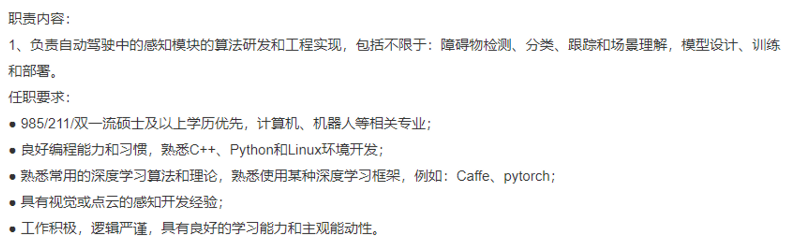
    
-   ****应届算法工程师-深圳市芯璨科技****
    
    [请稍后](https://www.zhipin.com/job_detail/06728b167728c97c1XB839W1EFNU.html?lid=2lFfvv1HuPI.search.16&securityId=Ic6RD9wXY7Mnx-b1GoKC-Gbe_c02p37RCYk7MytYuBx5cIUafk4r8DGTreOnmOBi0-tdM8RD1imCfsKlCZl0Tcf1HGhkVKoSg96siZell_9NRGsxCO7ow7R3E6WNOthE_OXoG5q5J_k~)
    
    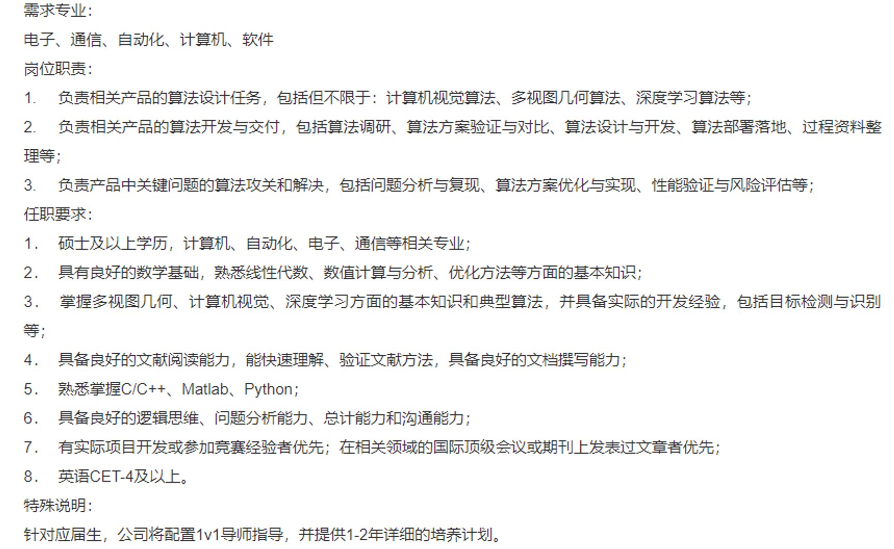
    
-   ****校招-图形图像算法工程师-深圳元象信息科技****
    
    [请稍后](https://www.zhipin.com/job_detail/40def03ea4dd739b1Xd_3dq6FFJX.html?lid=2lFfvv1HuPI.search.21&securityId=sRR3HNeVZ1mAP-q1NgyITLJhu4755Kki71EvxwEKAtykk_6Ldp6BARBksiKH-5xrIteCgZzMn-2ejpSeSh2lXOEZvo4dmykp1QDiTHuNGJpkMN-T3wO22skCQOTKRq-AsQzzOAZbZhRq)
    
    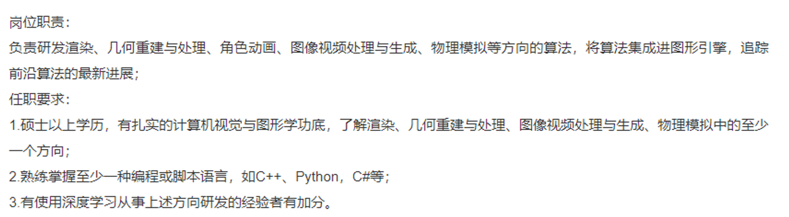
    
-   ****视觉算法工程师-华凯仕达****
    
    [请稍后](https://www.zhipin.com/job_detail/b2e3a14571e043391XB62d20GVNR.html?lid=2rb9JRy4ztH.search.6&securityId=nNUqRHNPmzIwT-Z1q9z-Rn_42BlkSJeWLlYOXLThGI-U1LXreDFIfDB2S8KnoBf6EDbHf3X-C1l2-PbsguckhLM-Z7HBGffQUW7LfvGux-q2TCyZ_t07Knw3KPQM0VbHfJ_kU6adC8Y~)
    
   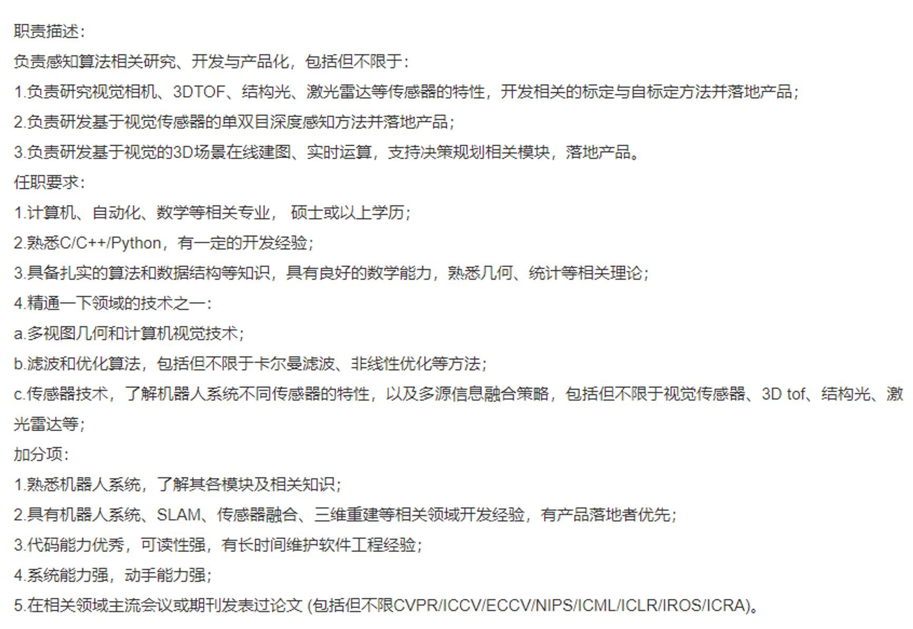
    
-   ****图像算法-优湃****
    
    [请稍后](https://www.zhipin.com/job_detail/ef2288afe607b6211XB82dS7FFFR.html?lid=2rb9JRy4ztH.search.8&securityId=EUBEBL0DblyfM-w1g0XFgZSEwdzsz29IlyY_74aStUdvrfdFW4J2h4sUOKc7HDmyjr1WXDp8MqIxh6E_QnO3F9HhTj2pYJkAw5tbYWZ7aHn8v_WvIj2VkGK33fqqv1hfTI1yzZIMqgq1YalxTyN0mDwdpTm9aOu3PB6hRz4b24bfE38~)
    
    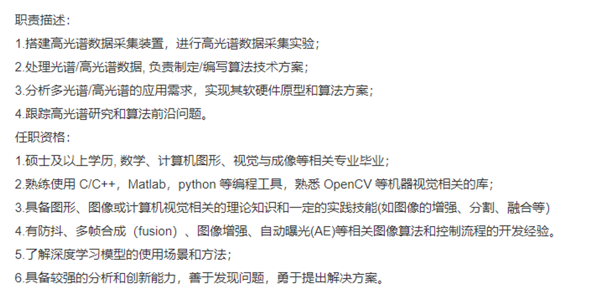
    
-   ****机器人感知算法工程师-深圳市目心智能科技****
    
    [请稍后](https://www.zhipin.com/job_detail/5aadaf3b4361a14b1XBy3dW1EVFW.html?lid=2rb9JRy4ztH.search.10&securityId=PCdunuvnhj-uW-h1njXSLsFHQtklg7hRV6ibslNL4CrG8n2p1VBPdtIQGQbRu25BmMSkkuEe7ydJOPAQISwfCV_gV7hYYhzdLtixUo8HZfJCYl0S47s8PWNGCmisSO9usx0gWZYdMgo~)
    
    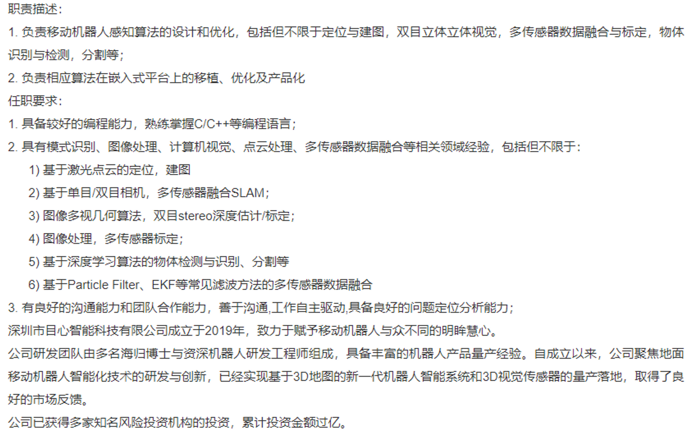
    
-   **机器视觉算法工程师-柏楚电子**
    
    [柏楚电子网申系统--](http://fscut.zhiye.com/xiangqing?jobId=620537739)
    
    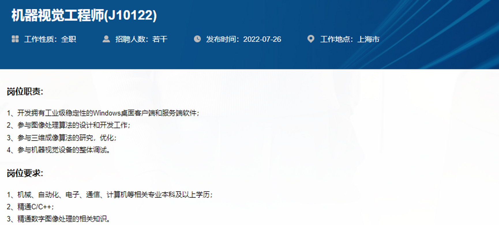
    
-   **传感器工程师-字节**
    
    [传感器工程师-AI Lab - 加入字节跳动](https://jobs.bytedance.com/campus/position/7129714617911413028/detail?spread=62PP8M5)
    
    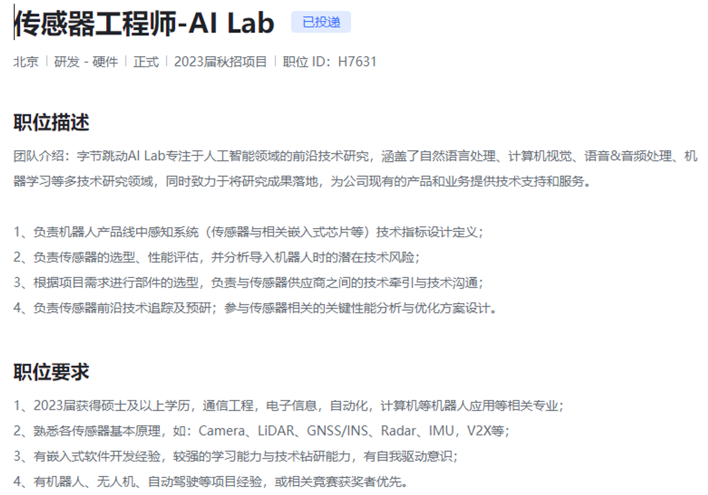
    
-   **计算机视觉算法研发工程师-百度**
    
    [百度校园招聘](https://talent.baidu.com/jobs/detail/GRADUATE/fdf1c1e2-e0b6-4557-879a-17eacffb8897)
    
    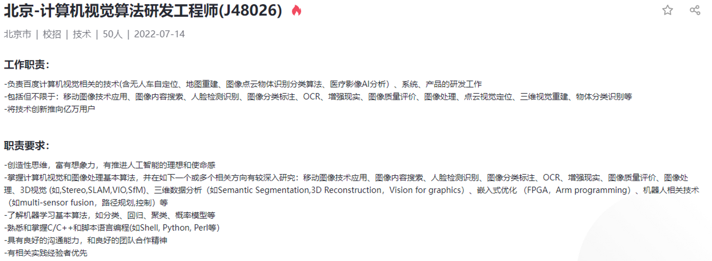
    
-   **算法工程师-计算机视觉-蚂蚁**
    
    [算法工程师-计算机视觉](https://talent.antgroup.com/campus-position?positionId=1102001507)
    
    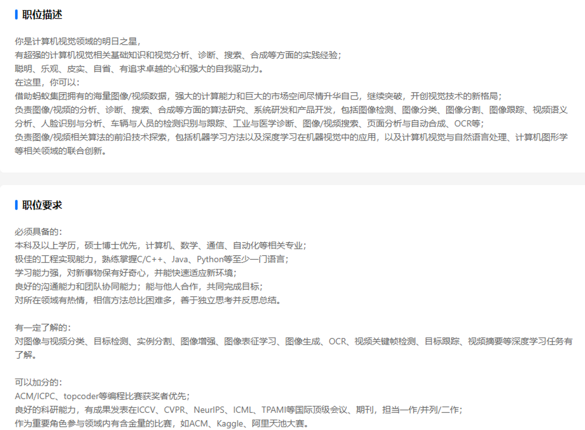
    
-   **显示评测工程师-OPPO**
    
    [校园招聘](https://careers.oppo.com/campus/post/detail?id=511&privacyVal)
    
    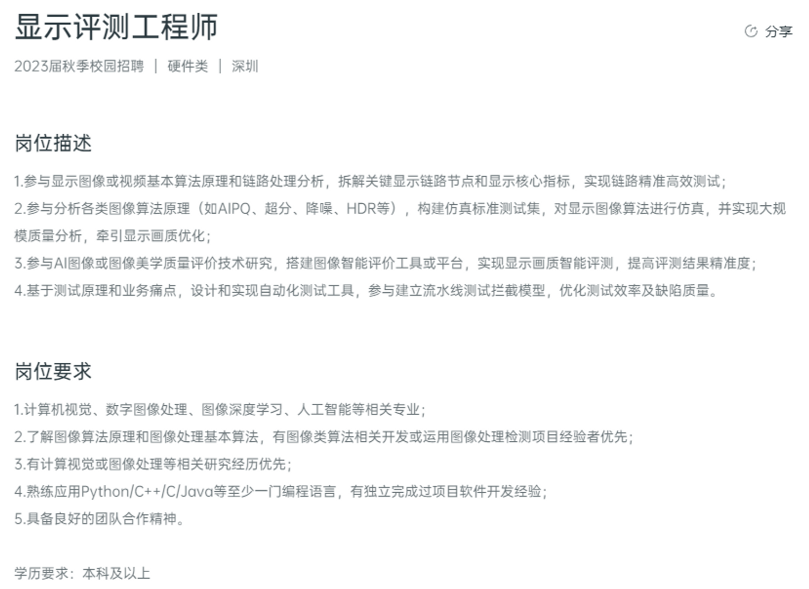
    
-   **硬件测试开发工程师-OPPO**
    
    [校园招聘](https://careers.oppo.com/campus/post/detail?id=487&privacyVal)
    
    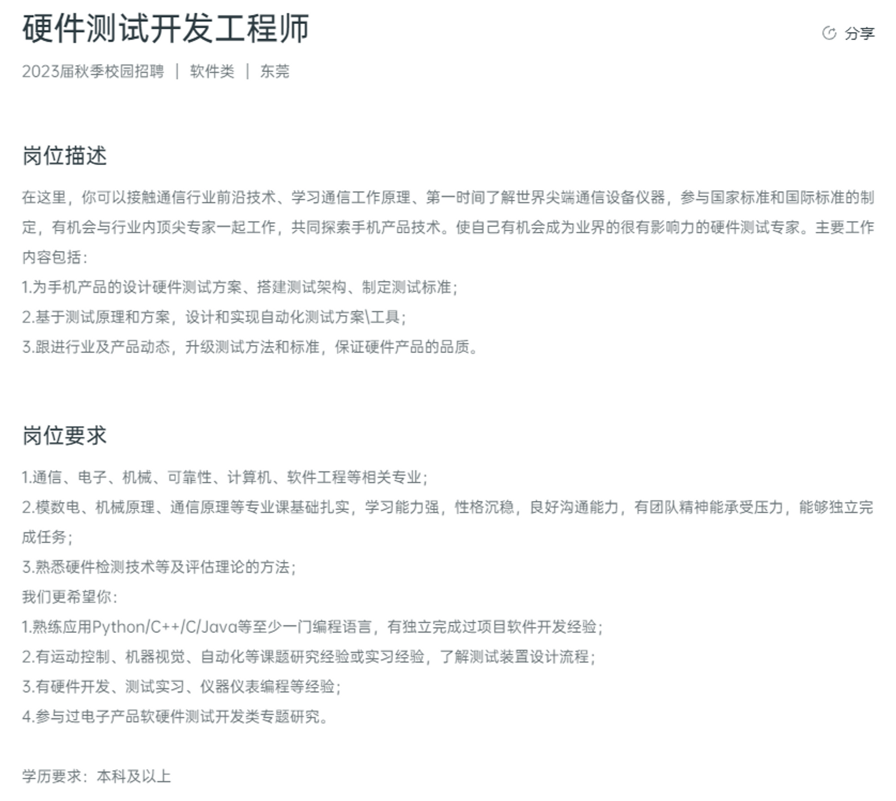
    
-   **导航算法工程师-美的**
    
    [美的集团-校园招聘官网-Midea校招/实习生招聘](https://careers.midea.com/schoolOut/post/details?projectRuleId=cf176940-20cc-4651-a0d7-b64b8c452399&positionId=8a928eae826e11800182a64eca7b02c4&recruitCategoryId=3549922d7a24440b91048263b08f60b0)
    
    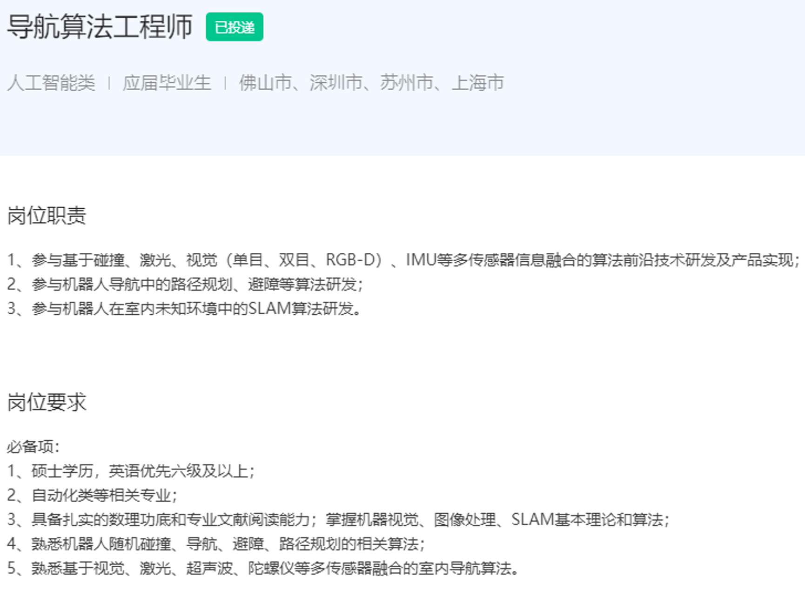
    
-   **智能制造与精密制造研发工程师-华为**
    
    [d](https://career.huawei.com/reccampportal/portal5/campus-recruitment-detail.html?jobId=235707)
    
    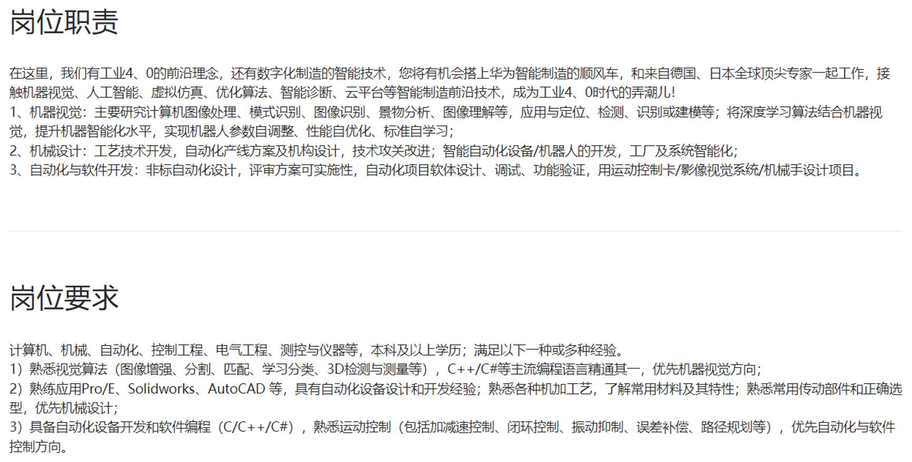
    
-   ****感知算法开发工程师-商汤****
    
    
    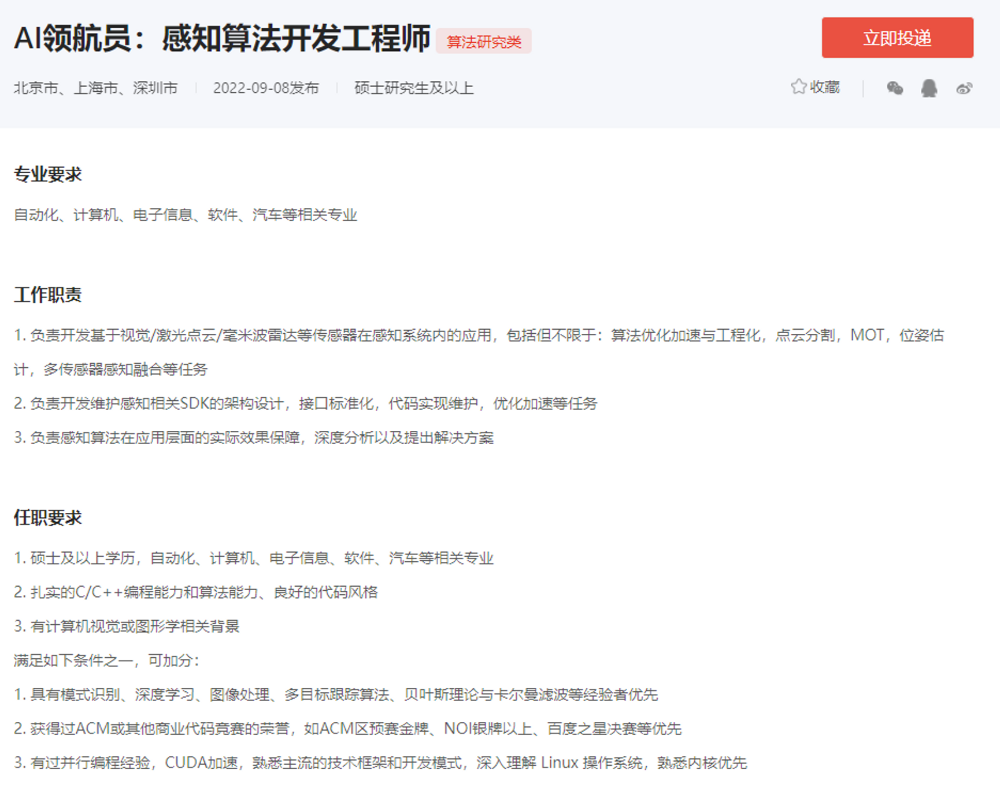
    
-   **多传感器融合算法研发工程师-AutoBrain**
    
    工作职责:
    
    -   负责camera、radar、lidar等传感器障碍物感知结果的关联和跟踪
    -   负责多传感器感知结果的融合
    -   负责障碍物状态估计，进行卡尔曼滤波、扩展卡尔曼滤波、粒子滤波等算法开发
    -   负责多目标跟踪算法开发
    -   与自动驾驶汽车其他各模块的工程师协同完成系统集成和调试工作
    
    职责要求:
    
    -   自动化，电子工程，计算机等相关专业全日制硕士及以上学历
    -   熟悉多目标跟踪，传感器融合以及时序预测技术
    -   深入理解卡尔曼滤波、粒子滤波、贝叶斯理论、概率论、最优化等相关理论
    -   熟练掌握C/C++、python等语言，具有良好的编程习惯，熟悉Linux，ROS等
    -   有机器学习，机器人，人工智能等领域顶会论文者优先