::: tip
前端开发与设计
:::

# 前端开发与设计

## HTML5 & CSS

### CSS Cheatsheet

这张Cheat Sheet 包含了CSS中常见的选择器、盒模型、背景、色彩、字体等语法，以及使用说明。

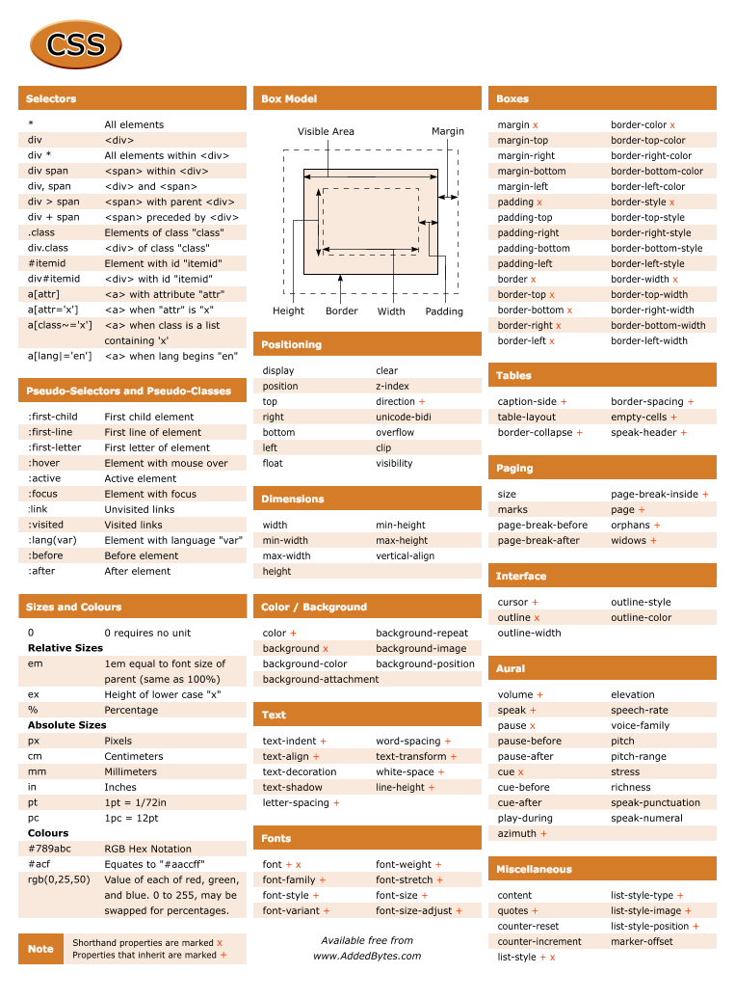

---

### HTML5 Cheet Sheet [TAGS]

HTML5引入了很多新的tag，下面这个Cheet Sheet将那些HTML 5中新增的标签独立成一个小节，让我们能够很快掌握如何使用它们。

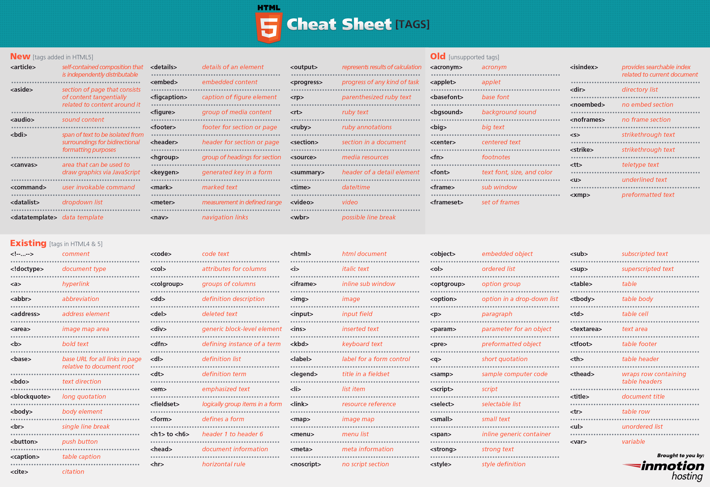

---

### HTML5 Cheet Sheet

由Antonio Lupetti设计的一张HTML5 Cheet Sheet，对HTML 5标签进行了概括，而且设计得很新颖。

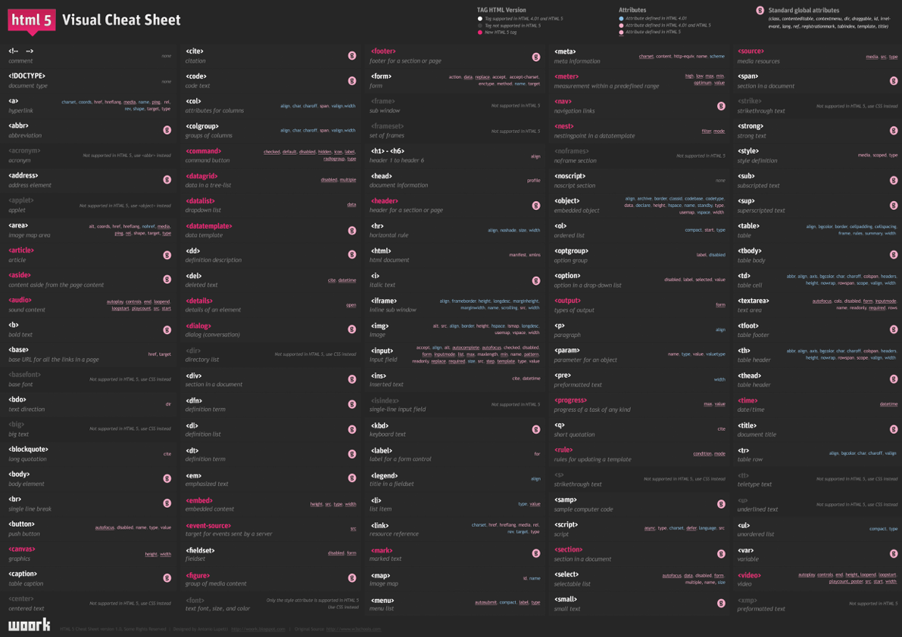

---

### HTML元素索引

[HTML Elements Index](https://link.jianshu.com/?t=http://meiert.com/en/indices/html-elements/)包含了所有HTML元素，并按照字母顺序进行索引。

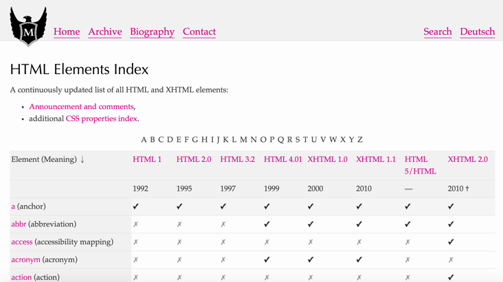

---

## JavaScript & JQuery

### JavaScript Cheet Sheet

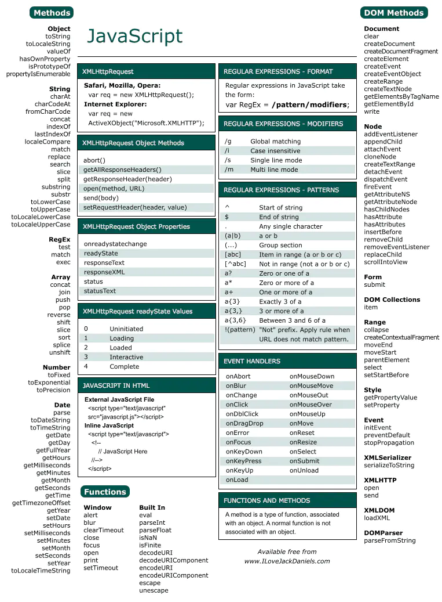

---

### jQuery API 快速参考网站

[jQuery Quick API Reference](https://link.jianshu.com/?t=http://oscarotero.com/jquery/)这个网站包含了所有JQuery中的API，点击某一个API后会直接链接到官方说明文档。另外你还能根据JQuery的不同版本来进行查询，非常方便。

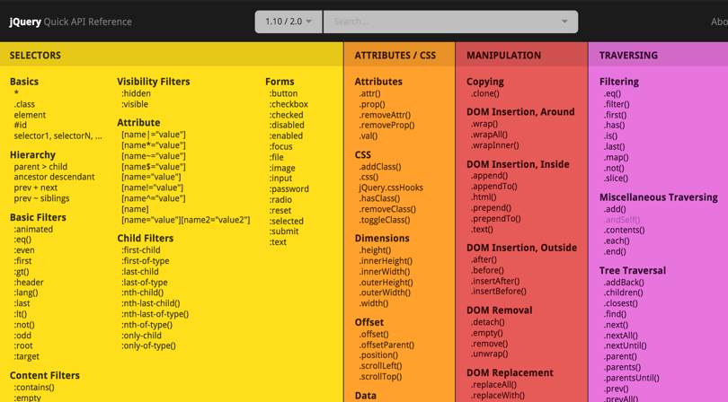

---

## 流行前端库

### Bootstrap 3 - Cheat Sheet

Bootstrap 可能是目前最流行的CSS框架了，下面是Bootstrap 3的一张Cheat Sheet，包含了对Grid系统以及不同Device下适配的说明。

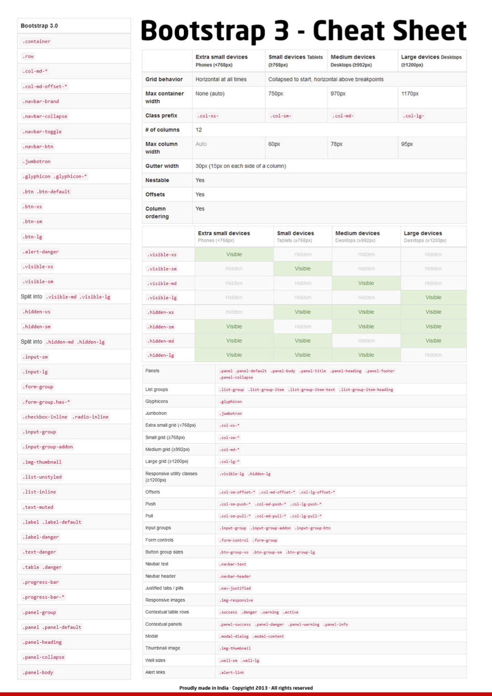

---

### Font Awesome图标参考

每次使用Font Awesome时总需要打开网站然后去查找所需要的图标，对于英文单词不是很熟悉的人来说，找一个图标往往要上下翻看好几遍，而且随着图标库的扩大搜索图标成了一件让人头疼的事。有了这张[Font Awesome图标参考](https://link.jianshu.com/?t=http://fortawesome.github.io/Font-Awesome/cheatsheet/)，你只需要将它打印出来，放在桌边，需要时便能很快找到你想要的图标了。

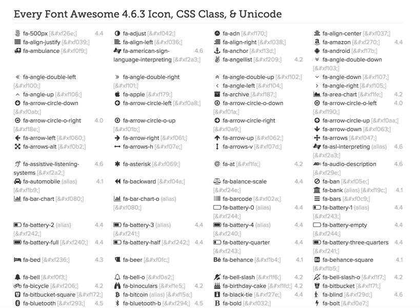

---

### Bootstrap 3 Glyphicons Cheatsheet

[Bootstrap 3 Glyphicons Cheatsheet](https://link.jianshu.com/?t=http://glyphicons.bootstrapcheatsheets.com/)是另一套非常常用的图标集，特别是在使用Bootstrap时，经常会用到它。

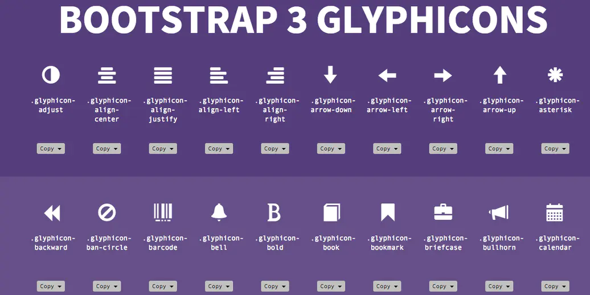

---

## 设计工具

### Sketch Shortcuts Cheatsheet

Skech已经成为我最常使用过的一个UI设计工具，大到做一个完整的UI方案，小到加工一张图片，我都会使用Sketch来完成。下面是Sketch中常用的快捷键。。

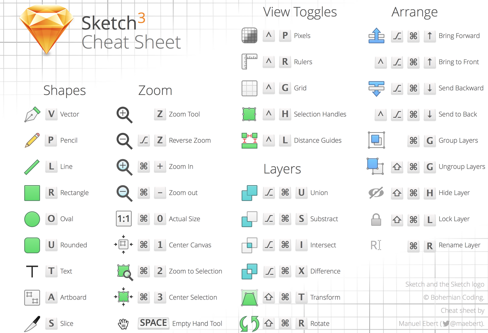

---

---

## 开发工具

### Sublime Text 3 (OSX) Cheat Sheet

[PDF版本](https://link.jianshu.com/?t=https://www.cheatography.com/tdeyle/cheat-sheets/sublime-text-3/#.Vupt2IgbnCQ.pinterest)（PDF版本请参考底部提供的资源连接）。

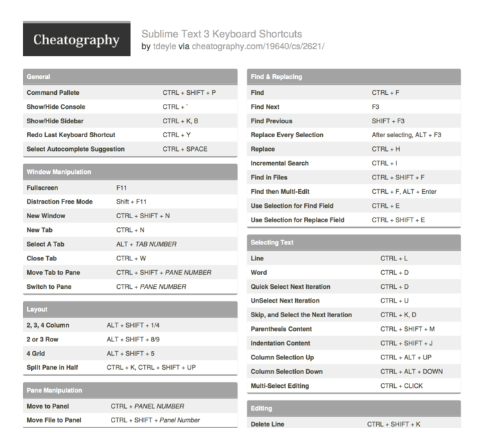

---

### Atom Editor Cheat Sheet

Atom是 Github 专门为程序员推出的一个跨平台文本编辑器。具有简洁和直观的图形用户界面，并有很多有趣的特点：支持CSS，HTML，JavaScript等网页编程

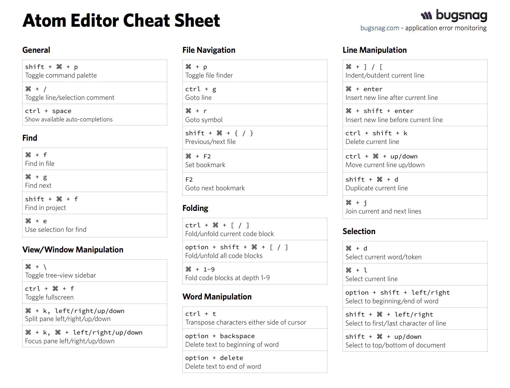

---

## Markdown

### Markdown Cheatsheet

Markdown因为其简洁高效的特性，而成为很多开发或设计文档的写作标准。下面这张Cheat Sheet包含了Markdown中常见的语法标准。

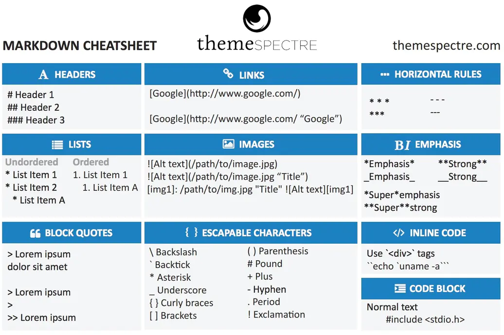

---

## 浏览器中的开发者工具

### Chrome Devtools Cheatsheet

Chrome自带了非常强大的开发者工具，通过[快捷键](https://link.jianshu.com/?t=http://anti-code.com/devtools-cheatsheet/)去控制它能让你的程序调试速度飞起来。

[https://www.notion.so](https://www.notion.so)

---

### Firebug Cheatsheet

Firefox上强大的网站调试插件，[Firebug Cheatsheet](https://link.jianshu.com/?t=http://duvet-dayz.com/firebug-cheatsheet/)中包含了所有快捷键。

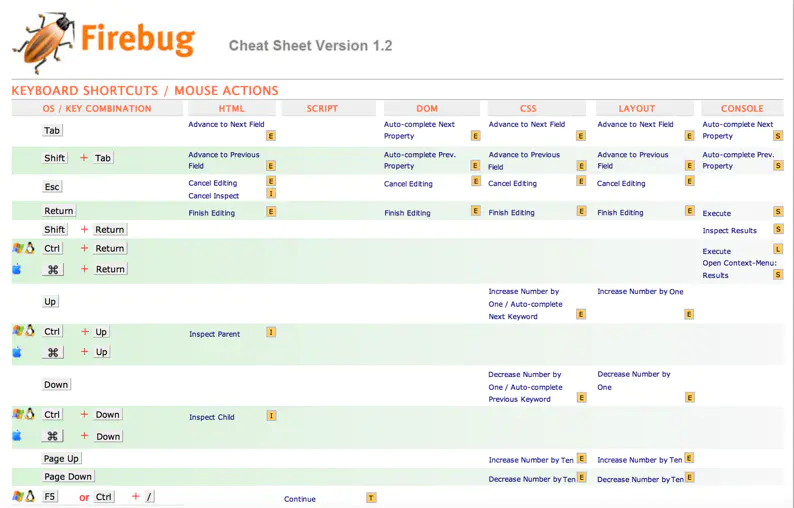

---

## 操作系统

### Command Line Cheat Sheet

这张Cheat Sheet包含了最常用的Linux命令行，及使用示例。

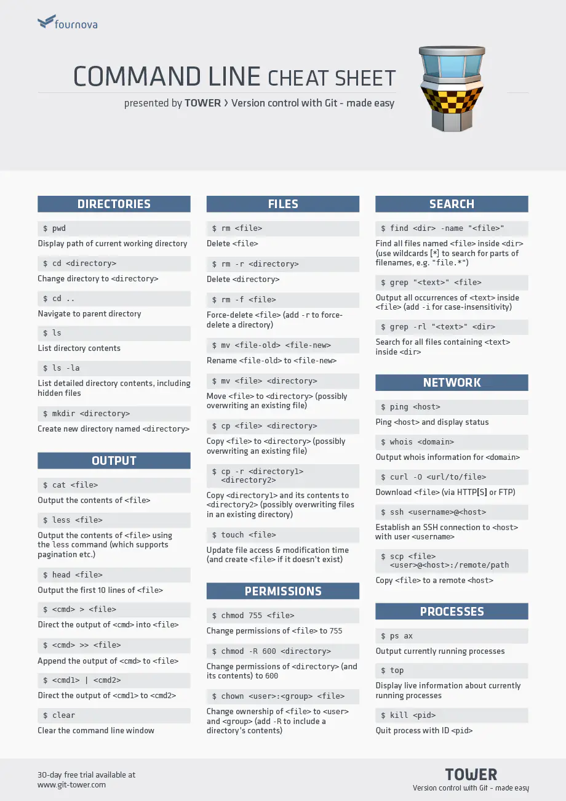

---

## Git & GitHub

### Git Cheat Sheet

Git已经取代SVN成为目前最流行的版本控制及分布协作工具。但用好Git并不容易，你需要掌握许多Git命令，下面这张Cheat Sheet能够帮你快速找到所需要的命令。

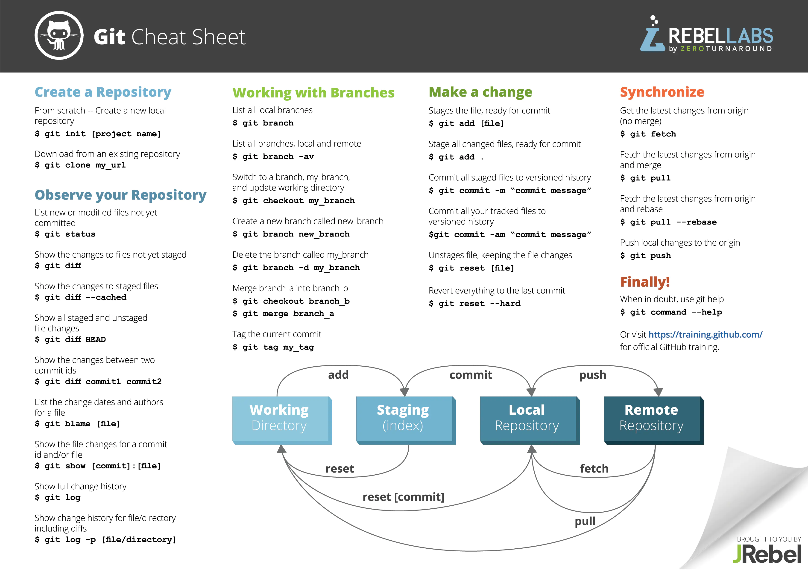

---

### 总结：

以上只是那些实用的Cheat Sheet中很小的一部分 ，我也建议你平时注意收集并使用那些Cheat Sheet，它们能极大提升你的开发或设计效率。(由于部分Cheat Sheet为pdf版本，我已将它们分享到了[技匠社](https://link.jianshu.com/?t=http://jijiangshe.com/resource/130)，需要的同学可访问获取)