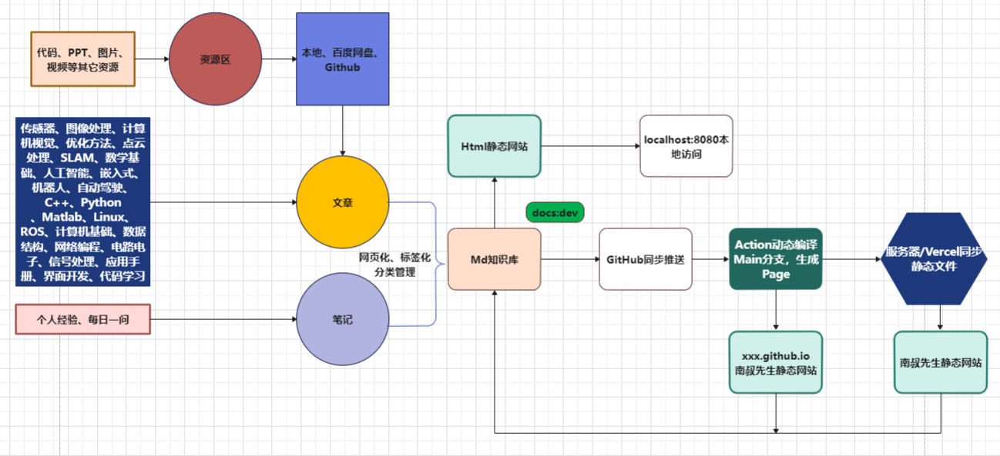

> 开源工具、技术融合自我提升笔记

<!-- TABLE OF CONTENTS 有序为<ol>，无序为<ul> -->
<details>
  <summary>Table of Contents</summary>
  <ul>
    <li><a href="#-初衷">✨ 初衷</a></li>
    <li><a href="#-笔记结构">🧱 笔记结构</a></li>
    <li><a href="#-内容管理工具">🍥 内容管理工具</a></li>
    <li><a href="#-目录介绍">🔣 目录介绍</a></li>
    <li><a href="#-特性">:📚 目录介绍</a></li>
    <li><a href="#-安装说明">:📌 安装说明</a></li>
  </ul>
</details>

<a href="https://discord.gg/PZTQfJ4GjX">
   
</a>
<a href="mailto:learndata@newzone.top">
   
</a>

## ✨ 初衷

曾经，我把知识记录在 Notion、Obsidian、飞书等知识管理软件上，导致笔记散落各处，使用起来很麻烦，也难以对外分享。

更重要的是，**笔记里的知识并不属于你，只有经过消化、应用，才会成为自己的

因此，我基于 VuePress 和 vuepress-theme-hope 建立了 LearnData，将所有笔记与文章重新整合，聚合到同一页面形成知识库，方便自己使用和分享。



## 🧱 笔记结构

- 置顶：每日一问，网站导航；
- 工作笔记：记录工作中所涉及的问题、解决方案、经验和思考。
- 传感器：介绍包括相机、雷达等传感器的基本原理、算法等等
- 图像处理：介绍图像处理包含的基本原理和算法
- 计算机视觉：介绍计算机视觉所涉及的内容和原理
- 优化方法:介绍常用的优化方法，包括梯度下降、牛顿法、共轭梯度法等；
- 点云处理:介绍点云数据的基本概念和处理方法，包括点云滤波、点云配准、点云分割等；
- SLAM:介绍SLAM技术的基本原理和算法，包括视觉SLAM、激光SLAM、多传感器融合SLAM等；
- 数学基础:介绍数学基础知识，包括线性代数、微积分、概率统计等；
- 人工智能:介绍人工智能的基本概念和应用，包括机器学习、深度学习、自然语言处理、知识图谱等；
- 嵌入式:介绍人工智能的基本概念和应用，包括机器学习、深度学习、自然语言处理、知识图谱等；
- 机器人:介绍机器人的基本原理和应用，包括机器人控制、机器人感知、机器人路径规划等；
- 自动驾驶:介绍自动驾驶技术的基本原理和应用，包括传感器融合、路径规划、车辆控制等；
- C++：介绍C++语言的基本语法和应用，包括面向对象编程、泛型编程、多线程编程等；
- Python：介绍Python语言的基本语法和应用，包括数据分析、机器学习、深度学习等；
- Matlab:介绍Matlab软件的基本使用和应用，包括数学计算、数据可视化、信号处理等；
- Linux：介绍Linux操作系统的基本原理和应用，包括Linux命令行、Shell编程、系统管理等；
- 计算机基础:介绍计算机基础知识，包括计算机组成原理、操作系统、计算机网络等；
- 数据结构:介绍常用的数据结构，包括栈、队列、链表、树、图等；
- 网络编程:介绍网络编程的基本原理和应用，包括Socket编程、HTTP协议、TCP/IP协议等；
- 机械工程:介绍机械工程的基本原理和应用，包括机械设计、机械制造、机械加工等；
- 电路电子:介绍电路电子的基本原理和应用，包括电路设计、电子元器件、电路仿真等；
- 信号处理:介绍信号处理的基本原理和应用，包括数字信号处理、模拟信号处理、图像处理等；
- 软件应用:常用应用、Chrome 扩展和相关教程；
- 代码：常用代码的学习和使用笔记；
- 页面开发：页面插件和框架生成工具；
- 网站部署：网站相关的工具和知识收集；
- 阅读:推荐一些优秀的技术书籍和论文，包括计算机视觉、人工智能、机器学习、深度学习等；
- 系统问题：Windows 系统优化和相关问题；
- 个人经验：分享一些个人经验和技巧，包括学习方法、工作技能、生活习惯等；
- 博客区：聚合所有博客文章，聚合所有博客文章，以分类、标签、时间轴等方式进行组合，方便读者查阅。
## 📃内容管理工具
| 工具 | 功能简介 | 官网链接 | 教程 | 优点 | 缺点 |
| --- | --- | --- | --- | --- | --- |
| Notion | 一站式的协作、知识管理和任务跟踪工具 | https://www.notion.so/ | [Notion官方指南](https://www.notion.so/Notion-Guide-d54e330aee2747e39f8d8aa7b9cde173) | 强大的模板和自定义功能，支持多种文档类型 | 免费版功能受限，有时会出现同步延迟 |
| Obsidian | 本地存储的个人知识库，支持双向链接 | https://obsidian.md/ | [Obsidian Help](https://help.obsidian.md/) | 数据本地存储，支持Markdown，插件丰富 | 不支持在线协作，界面稍显复杂 |
| Zettlr | Markdown编辑器，支持学术写作和笔记管理 | https://www.zettlr.com/ | [Zettlr文档](https://docs.zettlr.com/) | 支持学术引用，与Pandoc集成 | 不支持云同步，界面较为简陋 |
| Typora | 实时预览的Markdown编辑器 | https://www.typora.net/ | [Typora官方文档](https://support.typora.io/) | 界面简洁，实时预览，导出格式丰富 | 不支持云同步和协作，功能相对简单 |
| 印象笔记 (Evernote) | 跨平台的笔记管理软件 | https://www.yinxiang.com/ | [印象笔记帮助与学习](https://help.yinxiang.com) | 同步速度快，支持多种文档类型，OCR技术 | 免费版功能受限，部分用户反映搜索不准确 |
| Wolai | 云端的协作笔记工具，支持块引用和双向链接 | https://www.wolai.com/ | [Wolai帮助文档](https://help.wolai.com/) | 界面友好，支持块级引用和双向链接 | 服务器在中国，可能受到网络波动影响 |
| FlowUS | 一款以流程图为核心的团队协作工具 | https://www.flowus.cn/product | [FlowUS帮助中心](https://www.flowus.cn/help) | 专注于流程图和思维导图，实时协作 | 缺乏全面的文本编辑功能，适用场景较为局限 |

## 目录说明

以下是升级目录的说明：

```bash
LearnData
|── .github                     # 比对升级（一般覆盖）
├── docs
│   |── .vuepress               # 比对升级
│   │   ├── config.ts           # 大升级时需比对升级
│   │   ├── theme.ts            # 大升级时需比对升级
│   │   ├── sidebar.ts          # 侧边栏，一般不变
│   │   ├── navbar.ts           # 导航栏，一般不变
│   │   ├── templateBuild.html  # 网页模板，一般不变
│   │   └── public              # 自定义文档，一般不变
│   |── reading                 # 读书笔记，一般不变
│   ├── blog.md                 # 博客页面，一般不变
│   └── others                  # 笔记/博客，无需更改
└── others                      # 使用新版 LearnData 覆盖
```

## Features

- [x] 专题化，将长文分为几篇手册型文章，方便使用。
- [x] 增加「阅读笔记」，该区块将用 docsify 管理，与 LearnData 文章区分离。
- [x] 增加文章互动区块，让读者能通过 emoji 简便与作者沟通。
- [x] 看板娘：远程支持 api，也可使用本地文件。
- [x] 样式调整：黑色主题调整深紫色；调整 TOC 规则。
- [x] typo 修正：v1.0.3 之前的版本升级需将「docs\.vuepress\sidebar.ts」中的「collapsable」全部替换为「collapsible」。

## 安装说明
- clone后，需要输入：npm run install -D vuepress
- 可能会缺失包，按照报错依次更新即可
- 文档、图片标题不要出现空格，否则可能编译不通过
- 采用相对目录时，一定不要忘记前面的小点点，不然渲染的时候找不到图片
- 更新到github，采用如下命令
```
git add -A
git commit -m "update"
git push
```

<AutoCatalog />


# 👋 你好，我是 [Your_Name](https://your-personal-link.com)! 🚀


## 🌍 关于我

- 🎓 我是在 **[Your_University](https://university-link.com)** 学习 **计算机科学** 的学生。
- 🔭 我目前正在从事 **机器人** 和 **自动驾驶** 项目。
- 🌱 我正在学习 **深度学习**、**Web 开发** 和 **优化算法**。
- 💬 欢迎与我讨论 **信号处理**、**感知**、**嵌入式开发** 和 **控制**。
- 📫 如何联系我：**[Your_Email](mailto:your-email@example.com)**。
- 😄 爱好：**摄影**、**音乐**、**阅读** 和 **旅行**。

## 🛠 技能


## 🚘 自动驾驶技能

- 📷 传感器：**相机**、**FMCW 毫米波雷达**、**激光雷达**、**IMU** 和 **里程计**。
- 🛣️ 定位和建图：**SLAM（Cartographer、ORB-SLAM、VINS-Mono）**、**姿态估计** 和 **传感器融合**。
- 🗺️ 路径规划：**A\*、PRM、RRT** 和 **采样算法**。
- 🚗 控制：**运动学**、**动力学** 和 **模型预测控制（MPC）**。

## 🤖 机器人技能

- 🔧 机器人系统：**机器人建模和仿真**、**机器人运动学和动力学** 和 **机器人控制**。
- 👀 感知：**图像处理**、**计算机视觉** 和 **点云处理**。
- 🌐 导航：**路径规划**、**定位** 和 **映射**。
- 🏭 应用：**工业自动化**、**服务机器人** 和 **医疗机器人**。
