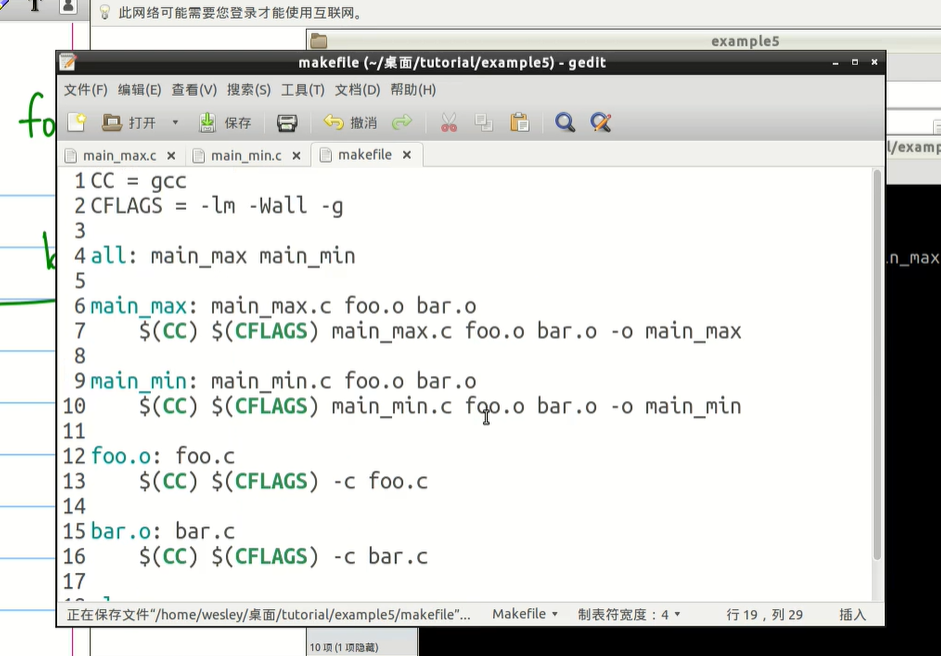

make、makefile、CMake和CMakeLists.txt是构建软件的工具和脚本。它们的高频用法如下：

-   make：是一个用于自动化编译程序的工具。Make工具通过读取Makefile文件来确定如何编译和链接程序。Makefile文件中包含了编译和链接的规则，以及依赖关系和命令行指令。Make工具可以根据Makefile文件自动化地执行编译和链接程序的过程。
    
-   makefile：是一个文本文件，其中包含了Make工具所需的规则和指令，以告诉Make工具如何编译和链接程序。Makefile文件通常包括目标、依赖关系和命令行指令。
    
-   CMake：是一个跨平台的构建系统生成器，它可以生成各种不同平台的构建系统，如Unix Makefile、Visual Studio工程、Xcode工程等。CMake使用CMakeLists.txt文件来描述项目的构建过程，并生成适用于所选平台的构建系统。
    
-   CMakeLists.txt：是一个CMake的配置文件，它描述了项目的各个组成部分及其依赖关系，并为每个组成部分指定如何编译和链接。CMakeLists.txt文件由CMake工具读取并生成适用于目标平台的构建系统。
    

这些工具之间的联系和区别如下：

-   make和makefile是一组工具和脚本，用于自动化编译和链接程序。Make工具通过读取Makefile文件来确定编译和链接的规则和依赖关系。
    
-   CMake和CMakeLists.txt是另一组工具和脚本，用于自动生成适用于目标平台的构建系统。CMake工具通过读取CMakeLists.txt文件来确定项目的构建过程和依赖关系，并生成适用于目标平台的构建系统。
    
-   make和makefile通常用于Unix和类Unix系统，而CMake和CMakeLists.txt则是跨平台的构建系统生成器。
    
-   makefile和CMakeLists.txt具有相似的结构，都包含了目标、依赖关系和命令行指令。但是，CMakeLists.txt文件具有更高的可读性和可维护性，因为它使用了现代的CMake语言来描述项目的构建过程。
# make和makefile
`make` 是一个用于自动化编译和构建程序的工具，它通过读取 `Makefile` 文件来执行一系列的任务。`Makefile` 是一个文本文件，其中包含了构建和编译程序所需的规则和依赖。

**make常用命令：**

-   make [target]: 生成目标文件
-   make clean: 清除所有生成的目标文件和中间文件
-   make install: 安装程序
-   make uninstall: 卸载程序
-   make help: 显示帮助信息
-   make -n [target]: 打印执行生成目标的命令，但不实际执行
-   make -j [N]: 同时运行N个任务进行编译
-   make -C [directory]: 在指定目录下执行make命令
-   make -f [makefile]: 使用指定的makefile文件进行编译

**Makefile 语法和格式：**

1.  规则（Rule）：规则是 Makefile 的核心部分，它描述了如何从源文件生成目标文件。规则的基本结构如下：
    
    ````
    target: prerequisites
        recipe
    ```
    
    其中，`target` 是一个文件名，表示目标文件；`prerequisites` 是一个文件名列表，表示目标文件所依赖的文件；`recipe` 是一系列命令，用于生成目标文件。
    
    ````
    
2.  变量（Variable）：变量用于存储值，可以在 Makefile 中重复使用。变量的定义格式如下：
```
VARIABLE_NAME = value
```
在 Makefile 中使用变量，可以通过 `$(VARIABLE_NAME)` 或 `${VARIABLE_NAME}` 的形式引用。

3.  注释：以 `#` 开头的行是注释。
    
4.  自动变量：Makefile 中有一些预定义的自动变量，如 `$@`（表示目标文件名）和 `$^`（表示所有的依赖文件列表）等。
    
5.  条件判断和循环：Makefile 支持 `ifeq`、`else`、`endif` 等条件判断语句，也支持 `foreach` 循环。    

**Makefile 示例：**

```
CC = gcc
CFLAGS = -Wall -g

all: main

main: main.o utils.o
    $(CC) $(CFLAGS) -o main main.o utils.o

main.o: main.c utils.h
    $(CC) $(CFLAGS) -c main.c

utils.o: utils.c utils.h
    $(CC) $(CFLAGS) -c utils.c

clean:
    rm -f *.o main
```
示例2：



**学习资源：**

1.  GNU Make 手册：[https://www.gnu.org/software/make/manual/make.html](https://www.gnu.org/software/make/manual/make.html)
2. [[教程]Makefile的写法_哔哩哔哩_bilibili](https://www.bilibili.com/video/BV1Mx411m7fm/?spm_id_from=333.788.recommend_more_video.-1&vd_source=573d3533e2a2018c9ca15d8fbdb178ad)

# CMake和CMakeLists.txt

## cmake
1.  cmake [path-to-source]: 生成构建系统，路径为源代码路径。
2.  cmake --build [path-to-binary]: 构建可执行文件，路径为二进制文件路径。
3.  cmake --build [path-to-binary] --target [target-name]: 生成指定目标的可执行文件。
4.  cmake --install [path-to-binary] --prefix [prefix-path]: 将可执行文件安装到指定路径下。
5.  cmake --build [path-to-binary] --clean-first: 清除上次生成的中间文件和目标文件，然后重新生成。
6.  cmake --build [path-to-binary] --config [config-name]: 指定编译配置，如Debug、Release、MinSizeRel和RelWithDebInfo。
7.  cmake --build [path-to-binary] -- -j [N]: 指定并发编译线程数量。
8.  cmake --build [path-to-binary] --target clean: 清除所有生成的目标文件和中间文件。
9.  cmake --version: 显示CMake版本信息。

## CMakefile.txt
CMakeLists.txt是CMake的配置文件，用于描述项目的构建过程和依赖关系，并为每个组成部分指定如何编译和链接。以下是CMakeLists.txt常用的配置：

1.  cmake_minimum_required(VERSION version_number): 指定需要的CMake版本。
2.  project(project_name): 指定项目名称。
3.  add_executable(executable_name source_files): 添加可执行文件，source_files为源文件列表。
4.  add_library(library_name source_files): 添加库文件，source_files为源文件列表。
5.  target_link_libraries(target_name library_name): 为目标文件添加链接库。
6.  include_directories(directory): 添加头文件路径。
7.  link_directories(directory): 添加库文件路径。
8.  add_definitions(-Dmacro): 添加宏定义。
9.  set(CMAKE_CXX_FLAGS "${CMAKE_CXX_FLAGS} -std=c++11"): 设置编译选项，如编译标准。
10.  add_subdirectory(directory): 添加子目录，使得CMake可以递归编译子目录中的代码。