### 一、交叉编译概念
在设备A下开发编译的程序，放到设备B上运行

### 二、开发步骤

查看系统版本
cat /proc/version!

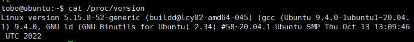


#### 2.1 下载docker镜像和sdk
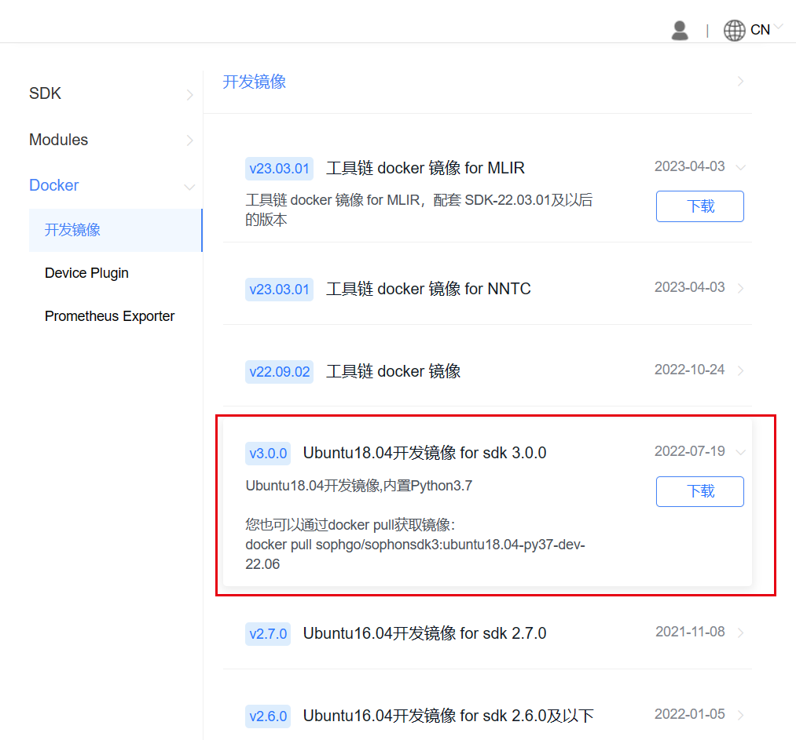

复制下载链接和并用wget下载
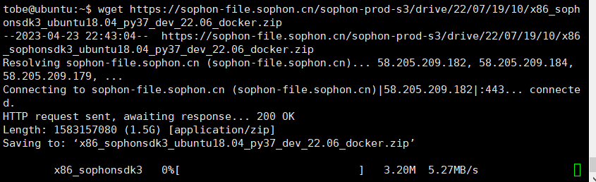

查看本机docker版本
docker version
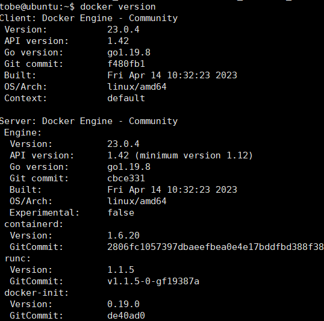
如果没有找到docker，则需要重新安装一下
具体安装如下：
```c++
# 安装docker
 sudo apt-get install docker.io
 # docker命令免root权限执行
 # 创建docker用户组，若已有docker组会报错，没关系可忽略
 sudo groupadd docker
 # 将当前用户加入docker组
 sudo gpasswd -a ${USER} docker
 # 重启docker服务
 sudo service docker restart
# 切换当前会话到新group或重新登录重启X会话
 newgrp docker​
```

#### 2.2 更新
sudo apt update
#### 2.3安装解压缩工具unzip,并解压sdk
sudo install unzip

unzip x8...


#### 2.4 加载docker镜像
ls
cd x86_sophonsdk3_ubuntu18.04_py37_dev_22.06_docker/
docker load -i x86_sophonsdk3_ubuntu18.04_py37_dev_22.06.docker

退回到sdk目录
cd ..
cd sophonsdk_v3.0.0_20220716/

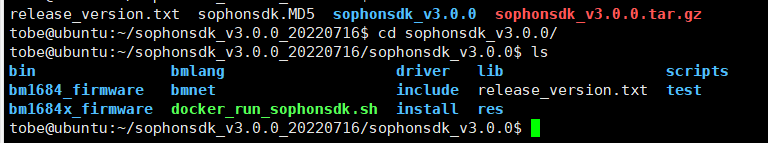

运行./docker_run_sophonsdk.sh

运行完成之后就进入了docker容器中，可以看到这边的目录就是挂载的sdk目录，通过目录映射实现的
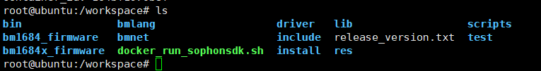
#### 2.5 配置环境
继续安装依赖库
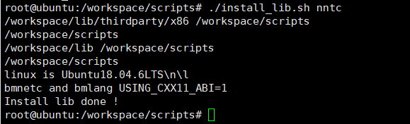

继续配置环境变量
source envsetup_cmodel.sh

然后安装python对应版本的shell包
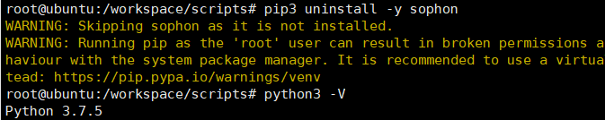
pip3 install ../lib/sail/python3/pcie/py37/sophon-3.0.0-py3-none-any.whl --user
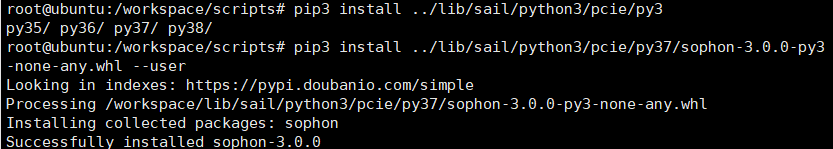
交叉编译环境搭建完成

#### 2.6 编写程序
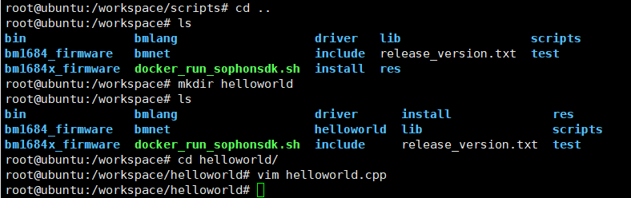
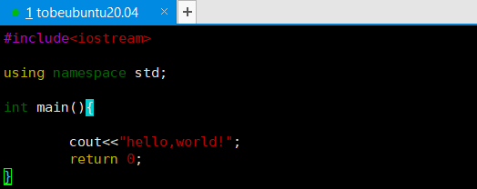
然后编写Makefile.arm文件
vim Makefile.arm
```bash
CXX = aarch64-linux-gnu-g++
  
CXXFLAGS := -g -O2 -Wall -std=c++11 $(INC_DIR)
LOCAL_MEM_ADDRWIDTH         ?= 19

CXXFLAGS += -DCONFIG_LOCAL_MEM_ADDRWIDTH=$(LOCAL_MEM_ADDRWIDTH)

all: helloworld.arm

helloworld.arm: helloworld.cpp
        $(CXX) $^ $(CXXFLAGS) $(LDLIBS) $(LDFLAGS) -o $@
clean:
        rm -f helloworld.arm
```

编译：
make -f Makefile.arm
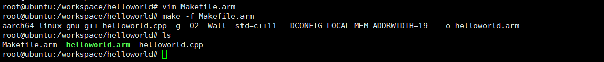

可以看到生成了一个helloworld.arm文件，这个文件就可以在SE环境下执行，可以把这个可执行文件拷贝到目标主机，假设目标主机的动态ip为：116.204.4.93，主机名为root，那么拷贝命令如下：
scp helloworld.arm admin@116.204.4.93:/home
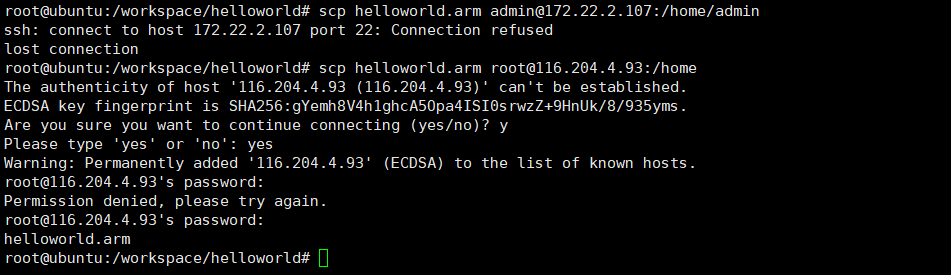

在目标主机上运行：
./helloworld.arm就可以打印“hello，world！”


