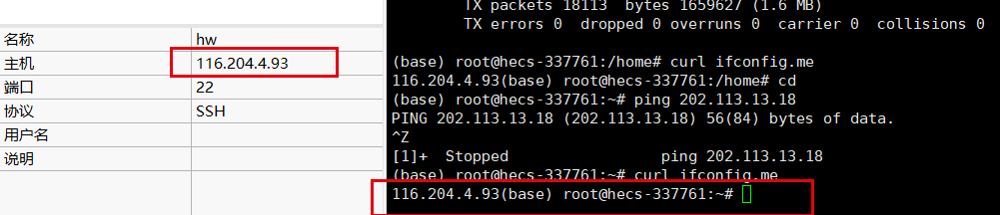
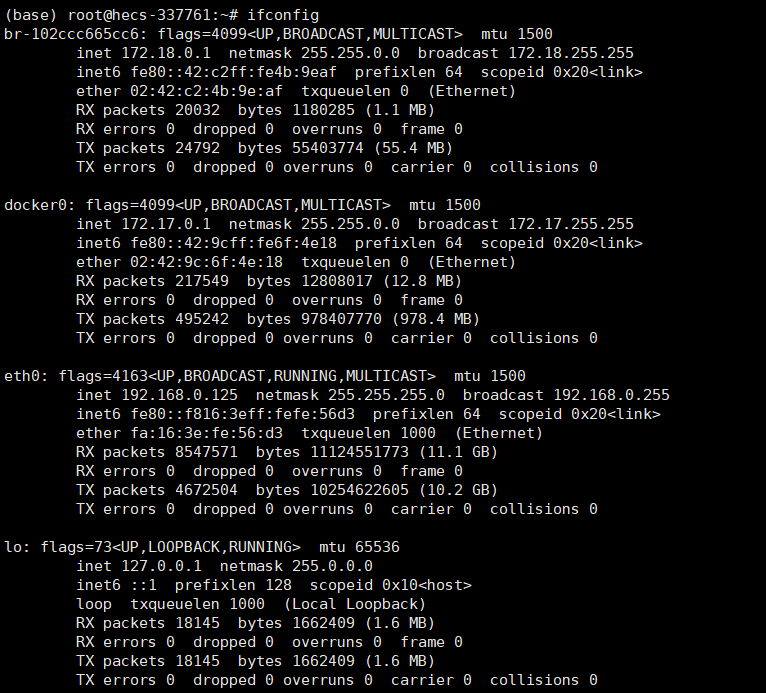
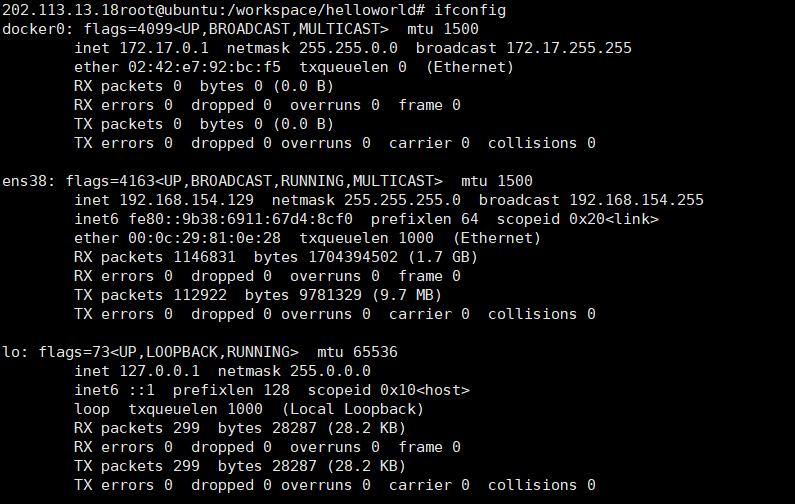

#### 查看当前服务器公网ip：
curl ipconfig.me

#### ifconfig参数解析

这是一个在 Linux 系统上执行的 `ifconfig` 命令的输出结果，用于显示系统上的网络接口信息。

在该输出结果中，可以看到以下几个网络接口：
- `br-102ccc665cc6`：这是一个 Docker 网桥，它允许 Docker 容器相互通信。它的 IP 地址为 `172.18.0.1`，子网掩码为 `255.255.0.0`。
- `docker0`：这也是一个 Docker 网桥，它允许 Docker 容器与主机进行通信。它的 IP 地址为 `172.17.0.1`，子网掩码为 `255.255.0.0`。
- `eth0`：这是主机上的物理网络接口，它的 IP 地址为 `192.168.0.125`，子网掩码为 `255.255.255.0`。
- `lo`：这是一个本地回环接口，用于在本地主机上进行网络通信。它的 IP 地址为 `127.0.0.1`，子网掩码为 `255.0.0.0`。

其中，IP 地址是用于唯一标识网络设备的地址，子网掩码用于指示哪些部分是网络地址，哪些部分是主机地址。在这个输出结果中，还可以看到每个网络接口的数据包收发统计信息。

在该输出结果中，可以看到以下几个网络接口：

-   `docker0`：这是一个 Docker 网桥，它允许 Docker 容器与主机进行通信。它的 IP 地址为 `172.17.0.1`，子网掩码为 `255.255.0.0`。
-   `ens38`：这是主机上的物理网络接口，它的 IP 地址为 `192.168.154.129`，子网掩码为 `255.255.255.0`。
-   `lo`：这是一个本地回环接口，用于在本地主机上进行网络通信。它的 IP 地址为 `127.0.0.1`，子网掩码为 `255.0.0.0`。

#### ifconfig的地址和公网IP
`ifconfig` 命令显示的 IP 地址通常是指本地主机在局域网中的 IP 地址，而公网 IP 地址则是指该主机在互联网中的唯一标识。这两种 IP 地址的区别在以下几个方面：

1.  范围：局域网 IP 地址是在局域网内部使用的 IP 地址，通常由路由器或交换机分配。公网 IP 地址是在互联网上使用的 IP 地址，由互联网服务提供商（ISP）分配。
    
2.  唯一性：局域网 IP 地址在局域网内是唯一的，但在其他局域网中可能会存在相同的 IP 地址。公网 IP 地址是全球唯一的，每个互联网用户在互联网上都有一个唯一的公网 IP 地址。
    
3.  访问范围：局域网 IP 地址只能在局域网内部直接访问，如果要访问局域网外的主机，需要通过路由器进行转发。公网 IP 地址可以在全球范围内直接访问，只要目标主机开放了相应的端口并具有相应的网络权限。
    

需要注意的是，一些网络环境可能会使用 NAT（网络地址转换）技术，将局域网内的 IP 地址转换为公网 IP 地址，这样可以使局域网内的主机访问互联网。在这种情况下，局域网内的主机可能无法直接获取自己的公网 IP 地址，而需要通过其他方式进行查找。

如果你在云服务器上使用 `ifconfig` 命令获取的 IP 地址是 `192.168.0.125`，那么这个 IP 地址是云服务器的内部 IP 地址，而不是公网 IP 地址 `116.204.4.93`。这是因为云服务提供商通常会为云服务器分配一个内部 IP 地址，用于在云服务提供商的网络中进行通信，而公网 IP 地址是用于在 Internet 上进行通信的。

内部 IP 地址通常是由云服务提供商分配的私有 IP 地址，它们用于在云服务提供商的网络中连接各种资源，例如虚拟机、负载均衡器等。与此相比，公网 IP 地址是互联网上可用的唯一的 IP 地址，它用于在 Internet 上进行通信。

因此，`192.168.0.125` 和 `116.204.4.93` 是两个不同的 IP 地址，它们之间没有直接的关系。如果你想访问云服务器，应该使用公网 IP 地址 `116.204.4.93`。

