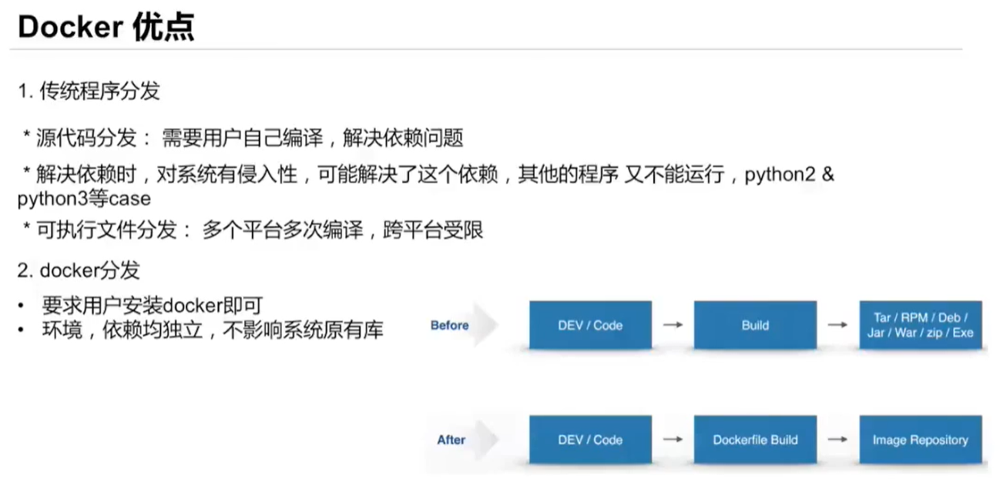
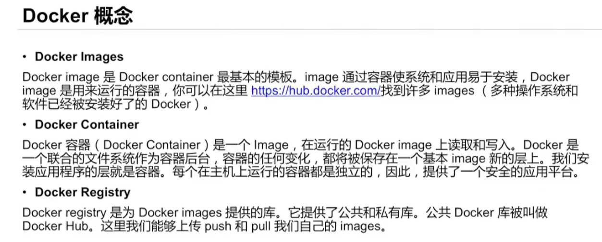
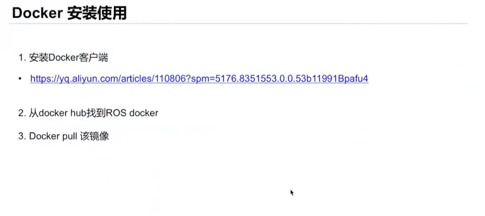
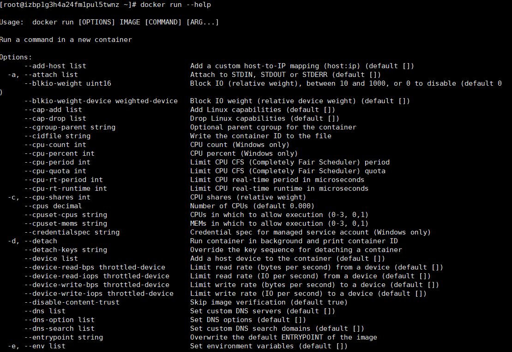
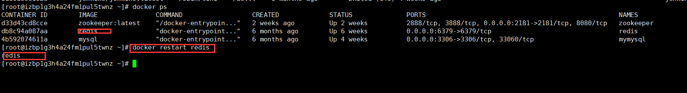
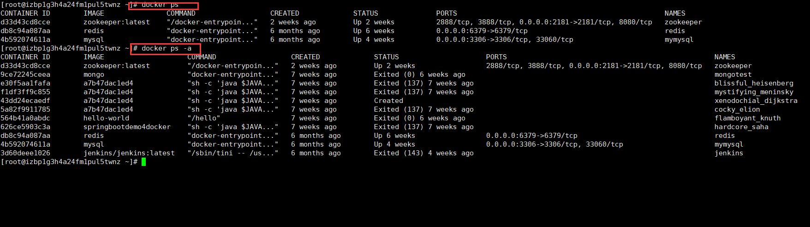
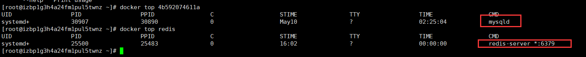
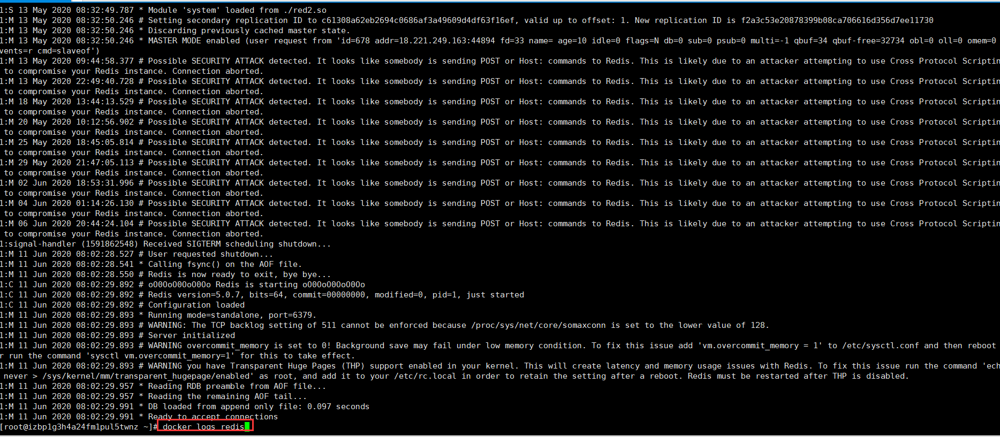
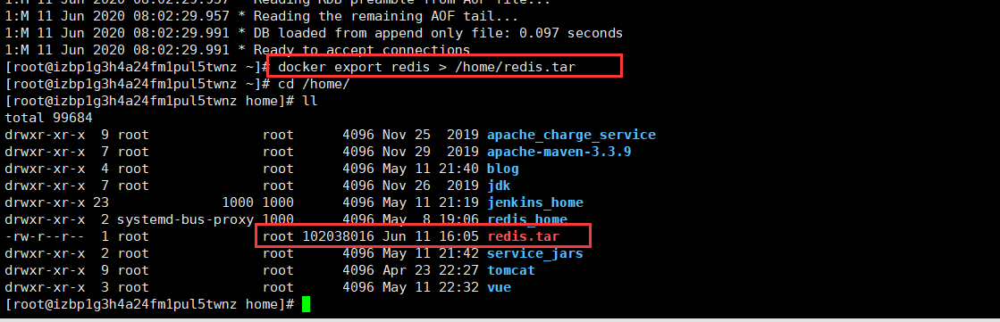
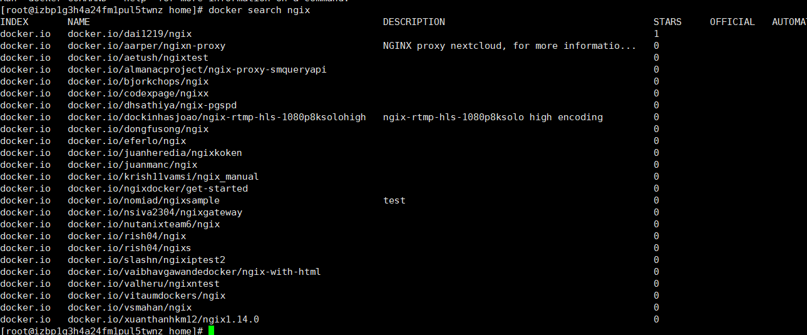

# 使用教程
[Docker 镜像使用-菜鸟笔记 (coonote.com)](https://www.coonote.com/docker/docker-image-usage.html)




[Explore Docker's Container Image Repository | Docker Hub](https://hub.docker.com/search?q=)

# Docker基本概念




|             概念              |                             说明                             |
| :---------------------------: | :----------------------------------------------------------: |
|    **Docker 镜像(Images)**    | Docker 镜像是用于创建 Docker 容器的模板，比如 Ubuntu 系统。**可以当作C++的类，具备独立的功能** |
|  **Docker 容器(Container)**   | 容器是独立运行的一个或一组应用，是镜像运行时的实体。**可以当作C++的对象，由类生成的实体** |
|   **Docker 客户端(Client)**   | Docker 客户端通过命令行或者其他工具使用 Docker SDK (https://docs.docker.com/develop/sdk/) 与 Docker 的[守护进程](https://www.coonote.com/cplusplus-note/linux-daemons.html)通信。**它就是Docker的用户界面** |
|     **Docker 主机(Host)**     | 一个物理或者虚拟的机器用于执行 Docker 守护进程和容器。 **安装docker的机器，也就是我们正在使用的主机** |
| **Docker daemon（守护进程）** | Docker daemon是一个运行在宿主机（ DOCKER-HOST）的后台进程。可通过 Docker客户端与之通信。 |
|        Docker Registry        | Docker 仓库用来保存镜像，可以理解为代码控制中的代码仓库。 Docker Hub(https://hub.docker.com) 提供了庞大的镜像集合供使用。 一个 Docker Registry 中可以包含多个仓库（Repository）；每个仓库可以包含多个标签（Tag）；每个标签对应一个镜像。 通常，一个仓库会包含同一个软件不同版本的镜像，而标签就常用于对应该软件的各个版本。我们可以通过 <仓库名>:<标签> 的格式来指定具体是这个软件哪个版本的镜像。如果不给出标签，将以 latest 作为默认标签。 |

# 安装docker



```bash
# 安装 Docker
sudo apt install docker.io
# 启动 Docker 服务
sudo systemctl start docker

# 开机自动启动 Docker
sudo systemctl enable docker

# 创建 Docker 用户组
sudo groupadd docker

# 将当前用户加入 Docker 用户组
sudo usermod -aG docker $USER

# 切换到 Docker 用户组
newgrp docker
```

# Docker常用命令

```bash
Docker环境信息   info、version
容器生命周期管理  create、exec、kill、pause、restart、rm、run、start、stop、unpause
镜像仓库命令      login、logout、pull、push、search
镜像管理          build、images、import、load、rmi、save、tag、commit
容器运维操作      attach、export、inspect、port、ps、rename、stats、top、wait、cp、diff、update
容器资源管理      volume、network
系统信息日志      events、history、logs
1.events打印容器的实时系统事件
2.history 打印出指定镜像的历史版本信息
3.logs打印容器中进程的运行日志
```

## 容器操作

### 启动容器

启动容器有两种方式，一种是基于镜像新建一个容器并启动，另外一个是将在终止状态的容器重新启动。

> docker run --help
> Usage: docker run [OPTIONS] IMAGE [COMMAND] [ARG…]

```bash
# 运行一个容器，打印Hello world后退出
docker run alpine /bin/echo 'Hello world'
# 创建一个交互容器 退出当前命令，容器也随之退出
docker run -it alpine
# 创建一个后台运行容器
docker run  -d --name demo1 alpine  sleep 10m
```

run命令常用参数:

```bash
-t  参数让Docker分配一个伪终端并绑定到容器的标准输入上
-i  参数则让容器的标准输入保持打开。
-c 参数用于给运行的容器分配cpu的shares值
-m 参数用于限制为容器的内存信息，以 B、K、M、G 为单位
-v 参数用于挂载一个volume，可以用多个-v参数同时挂载多个volume
-p 参数用于将容器的端口暴露给宿主机端口 格式：host_port:container_port 或者
host_ip:host_port:container_port
--name 容器名称
--net 容器使用的网络
```

docker可以使用 docker run --help 可以查看详细参数，docker中所有子命令都可以采用类似方式了解详情。



### 启动停止容器

```bash
docker stop demo1
docker start demo1
docker restart demo1
```



### 查看容器

```bash
# 查看正在运行的容器
docker ps
# 查看所有容 包括停止的容器
docker ps -a
# 查看容器详细信息
docker inspect demo1
```



### 容器进程

```bash
#top支持 ps 命令参数，格式：docker top [OPTIONS] CONTAINER [ps OPTIONS]
#列出redis容器中运行进程
docker top redis
#查看所有运行容器的进程信息
for i in  `docker ps |grep Up|awk '{print $1}'`;do echo \ &&docker top $i; done
```



### 容器日志

```bash
#查看redis容器日志，默认参数
docker logs redis
#查看redis容器日志，参数：-f  跟踪日志输出；-t   显示时间戳；--tail  仅列出最新N条容器日志；
docker logs -f -t --tail=20 redis
#查看容器redis从2020年06月01日后的最新10条日志。
docker logs --since="2020-06-01" --tail=10 redis
```



### 进入容器

```bash
docker exec -it demo1 /bin/sh
```

### 删除容器

```bash
#　删除一个已经停止运行的容器
docker rm demo1
# 强制删除正在运行的容器
docker rm -f dome1
```

### 停止容器

```bash
#停止一个运行中的容器
docker stop redis
#杀掉一个运行中的容器
docker kill redis
```

### 导入、导出容器

```bash
# 将容器导出为镜像
docker export demo1 > demo1.tar
# 导入镜像
docker import demo1.tar xxx/demo
```



## 镜像操作

获取镜像: docker pull [选项] [Docker Registry 地址[:端口号]/]仓库名[:标签]

```bash
# 拉取镜像
docker pull ngix
# 删除镜像
docker rmi ngix
# 在远程仓库搜索镜像
docker search ngix
# 列出本地images
docker images
# 基于当前redis容器创建一个新的镜像；参数：-a 提交的镜像作者；-c 使用Dockerfile指令来创建镜像；-m :提交时的说明文字；-p :在commit时，将容器暂停
docker commit -a="DeepInThought" -m="my redis" [redis容器ID]  myredis:v1.1
```


