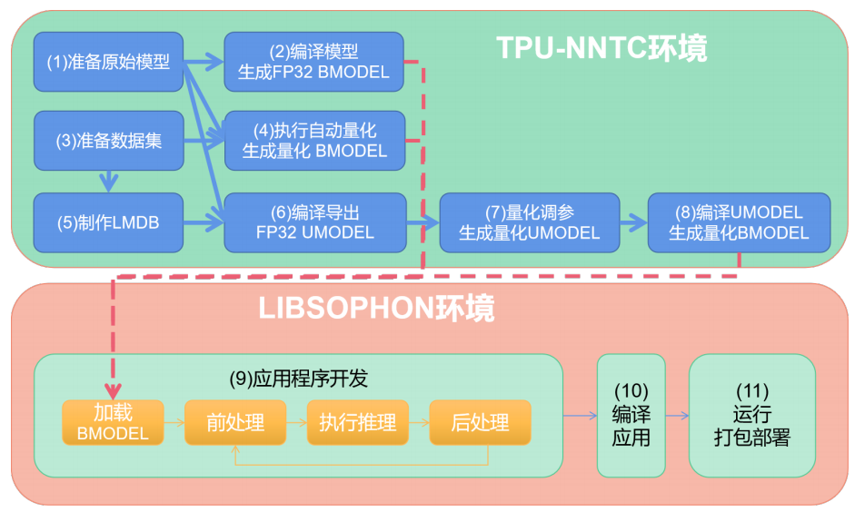

## 基本概念

nntc是一个神经网络编译器，可以将神经网络模型转换为特定硬件平台上可执行的代码。

你需要熟悉nntc支持的模型格式（如ONNX、TensorFlow、PyTorch等），以及如何将模型转换为特定硬件的指令集。

## 应用移植的流程

- 模型编译量化-nntc工具

- 应用开发部署-libsophone

  

**基本流程：**

其它模型---->生成BMODEL----->加载BMODEL---->前处理----->推理------后处理------>编译应用----->打包

### 模型的编译量化

**一、FP32 BMDEL生成**，也就是将原始模型直接转化为与原始模型精度一致的可以运行在TPU上的模型

**二、量化 BMODEL 生成**，根据需求修改模型：

如果 FP32 不能满足性能需求，需要对模型进行量化, 量化后模型精度会有一定损失，但能充
分发挥芯片算力。

**第一步：**准备量化用的输入数据集，比如包含输入图片的文件夹

**第二步：**量化：

​			**（1）自动量化：**利用原始模型和数据集直接生成量化BMODEL，即（1）（3）---->（4）

​				**优点：**步骤简单、参数自动搜索

​				缺点：时间比较长、性能不一定是最优的。

​			**（2）分步量化**：对应于步骤 (5)(6)(7)(8)。其中重点是步骤 (7) 量化调参，需要一定的技巧和经验。

**注意两个MODEL：**

（1）BMODEL 是用于设备加载运行的。所有类型的模型转换成 BMODEL 才能在设备上运行。

（2）UMODEL 是用于量化的中间模型。可由原始模型导出 FP32 的 UMODEL，经过量化后会生成 INT8 的 UMODEL，最终也会转换成 BMODEL 到设备上运行。

## 例子resnet18

### 第一步：准备原始模型

链接：[SOPHGO](http://219.142.246.77:65000/sharing/NVUS3acJ7)

- **下载到本地 resnet18_classify.tar.gz，并解压：**
  ```tar zxvf resnet18_classify.tar.gz```

resnet18_classify 目录中包含以下文件：
· model/resnet18.onnx resnet18 原始模型
· images/ 测试图片集
· ILSVRC2012/ 量化用数据集
· scripts/ 本示例中脚本文件
· src/ 应用源码目录
· CMakeLists.txt 构建脚本

### 第二步：初始化tpn-nntc环境

```bash
# 将当前用户加入 docker 组
sudo usermod -aG docker $USER
newgrp docker

mkdir tpu-nntc
# 将压缩包解压到tpu-nntc
tar zxvf tpu-nntc_vx.y.z-<hash>-<date>.tar.gz --strip-components=1 -C tpu-nntc

# 进入docker，如果当前系统没有对应镜像，会自动从docker hub上下载
cd tpu-nntc
docker run -v $PWD/..:/workspace -p 8001:8001 -it sophgo/tpuc_dev:latest
# 此时已经进入docker，并在/workspace目录下
# 下面初始化软件环境
cd /workspace/tpu-nntc
source scripts/envsetup.sh

# 环境初始化完成后，进入 resnet18_classify 目录
cd /workspace/resnet18_classify
# 为了方便清理，建议创建一个空的工作目录
mkdir -p workdir && cd workdir
```

### 第三步：编译FP32BMODEL

转换的是 onnx 模型，所以需要 bmneto 前端(意思就说onnex 模型转换到bm模型)

```
# 此时在resnet18_classify/workdir目录中
python3 -m bmneto --model ../model/resnet18.onnx \
--input_names "input" \
--shapes "[[1,3,224,224]]" \
--target BM1684X \
--outdir bmodel/fp32
```

可以输入查看下 fp32 bmodel 的信息：

```
tpu_model --info bmodel/fp32/compilation.bmodel
```

### 自动量化生成 INT8 BMODEL

**自动量化工具**会**自动**处理**图片数据集** 将其转为 **lmdb 数据集**，并使用不同量化策略量化多次，自动生成 bmodel。

```bash
# 量化采用 ILSVRC2012 的部分图片
# 注意cali_image_preprocess参数，要和模型原始应用的预处理一致
# 否则会出现模型量化精度高，但在应用上精度低的情况
python3 -m ufw.cali.cali_model \
--net_name "resnet18" \
--model ../model/resnet18.onnx \
--cali_image_path ../ILSVRC2012/ \
--cali_image_preprocess '
resize_h=224,resize_w=224;
mean_value=123.675:116.28:103.53;
scale=0.0171:0.0175:0.0174;
bgr2rgb=True' \
--input_names 'input' \
--input_shapes '[1,3,224,224]' \
--target BM1684X \
--outdir auto_cali_out
cp -r auto_cali_out/resnet18_batch1 bmodel/auto-int8
```

查看下 bmodel 的信息：

```bash
tpu_model --info bmodel/auto-int8/compilation.bmodel
```

查看量化精度情况(可选)

```bash
#在本机的 8001 端口 (启动 docker 时显示的端口) 可以打开网页，如果是本机直接打开http://localhost:8001 ，如果是远程服务器请将 localhost 替换成服务器 IP
python3 -m ufw.tools.app --port 8001
```

**注意：**这里可视化工具是在量化数据集中随机找一张图进行一次推理，并把数据显示出来。每
次显示时会不一样，但比较接近。

如果最终精度或在业务上验证精度不满足要求，可以考虑增加迭代次数或其他参数。

回到开发环境，Ctrl+C 结束精度显示服务。