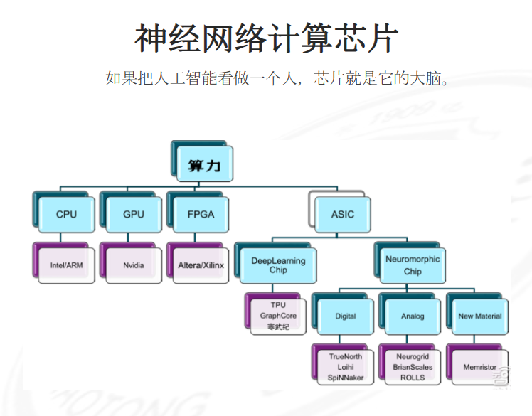

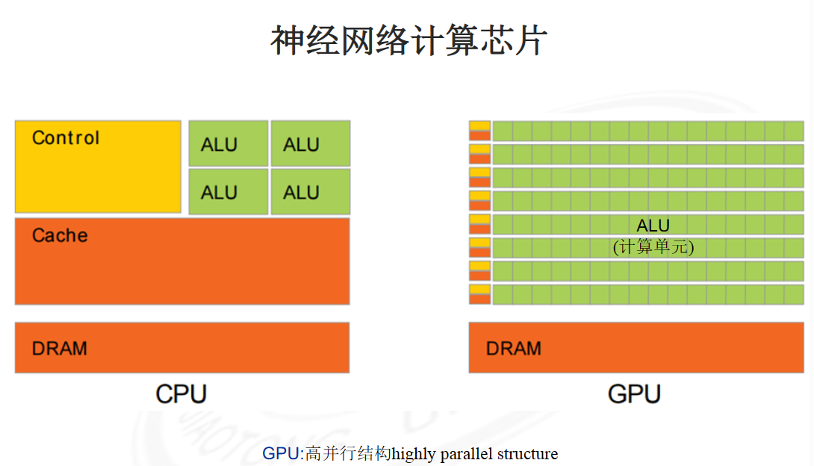
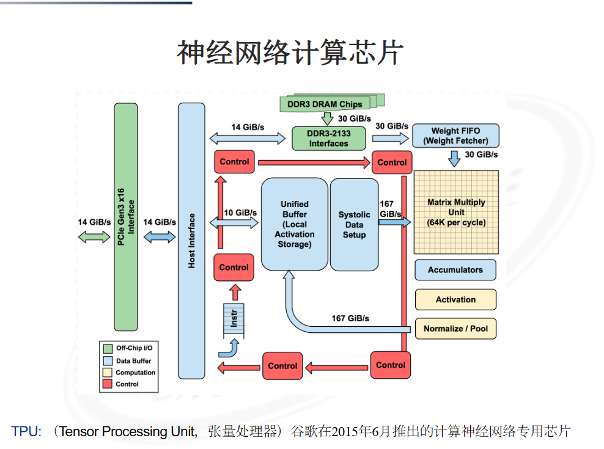
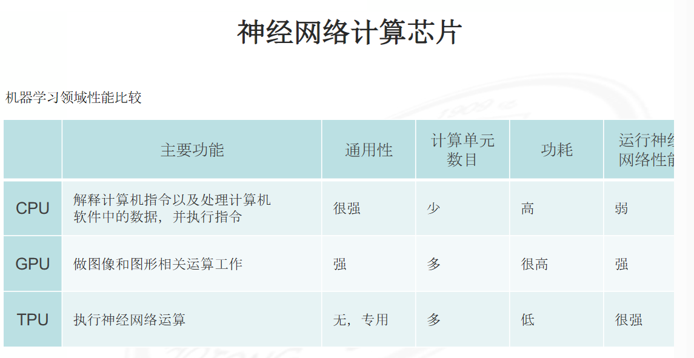

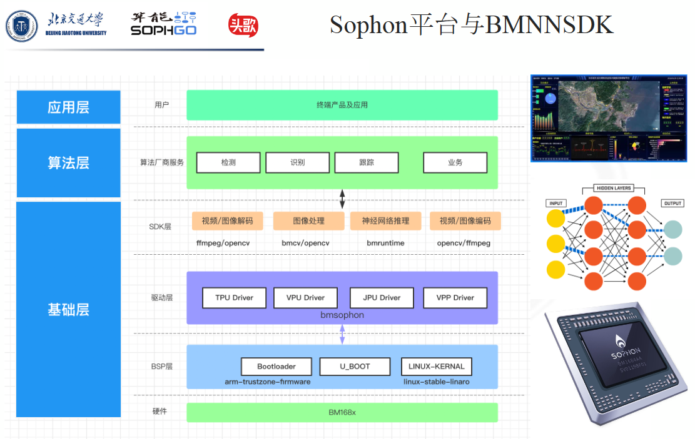

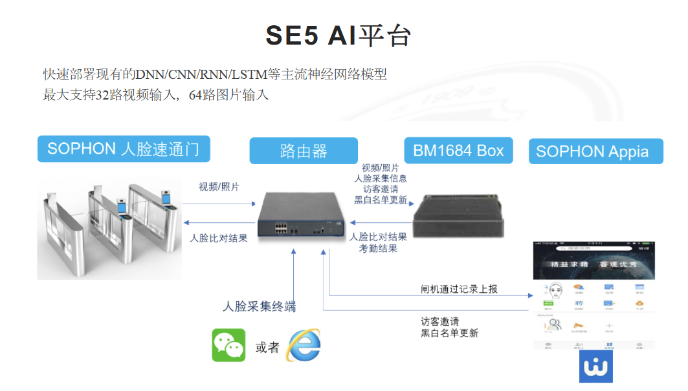
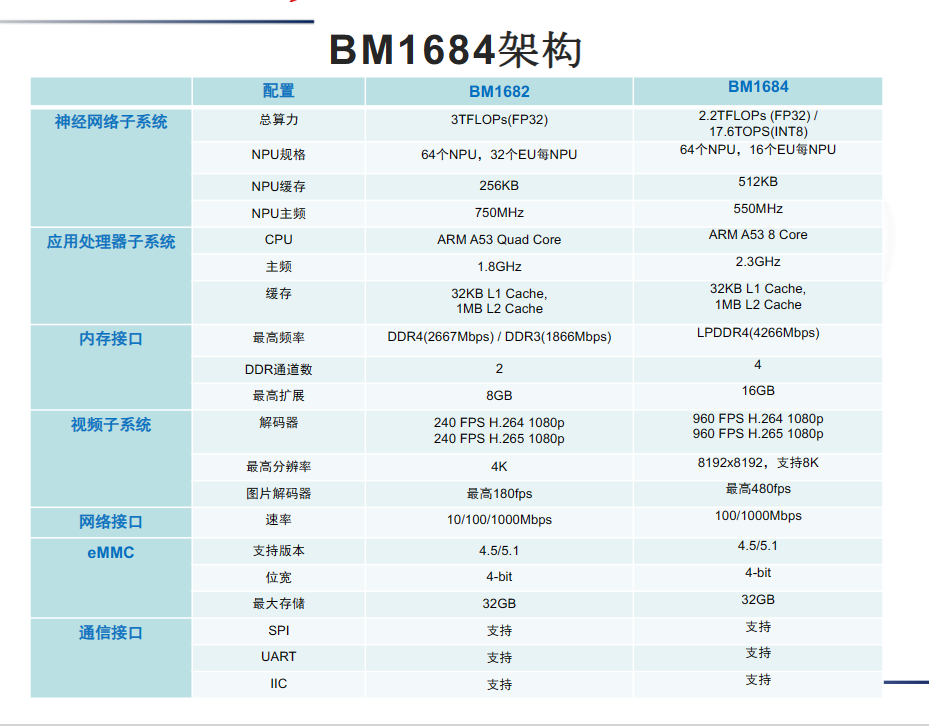

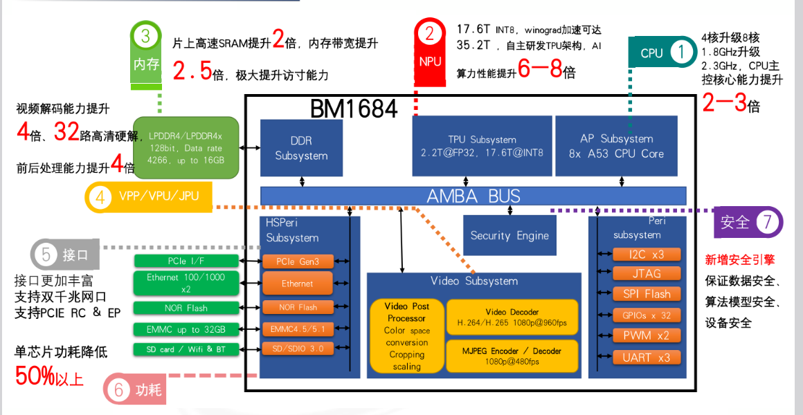

1.  **DDR（Double Data Rate）**：DDR是一种计算机内存技术，它可以在每个时钟周期内传输两次数据，因此可以实现比传统SDRAM更高的带宽和性能。DDR内存通常被用于桌面计算机、服务器和其他需要高性能内存的设备上。
    
2.  **LPDDR（Low Power Double Data Rate）**：LPDDR是一种低功耗的DDR内存，它与传统DDR相比具有更低的功耗和更高的带宽效率。由于其低功耗和高性能，LPDDR内存通常被用于移动设备，例如智能手机、平板电脑和笔记本电脑等。
    
3.  **PCIe（Peripheral Component Interconnect Express）**：PCIe是一种高速串行总线接口标准，用于连接计算机内部的各种设备，例如显卡、网卡、存储控制器等。PCIe接口具有高速、可扩展和热插拔等优点，因此在现代计算机中广泛使用。
    
4.  **Ethernet**：以太网是一种局域网技术，用于在计算机和其他设备之间进行数据通信。它是一种基于分组交换的数据传输协议，可以实现高速、可靠和灵活的数据通信。以太网通常被用于连接计算机、服务器、网络打印机、路由器和交换机等设备。
    
5.  **eMMC**（Embedded Multi-Media Card）：eMMC是一种嵌入式多媒体卡，它是一种基于闪存存储技术的存储卡，常用于嵌入式系统和移动设备中，例如智能手机、平板电脑和车载娱乐系统等。eMMC具有小巧、高速、低功耗和可靠等特点，可以提供可靠的存储解决方案。

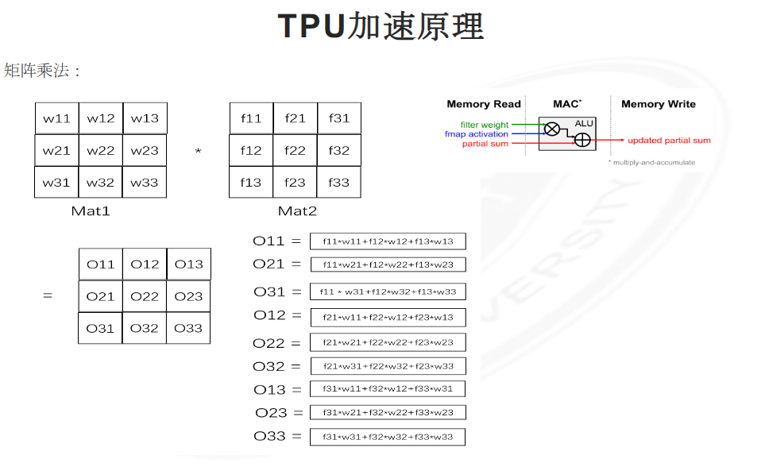
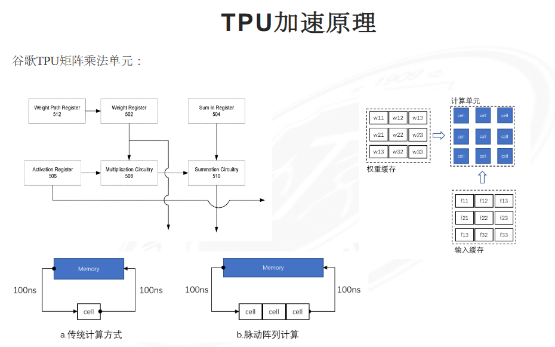

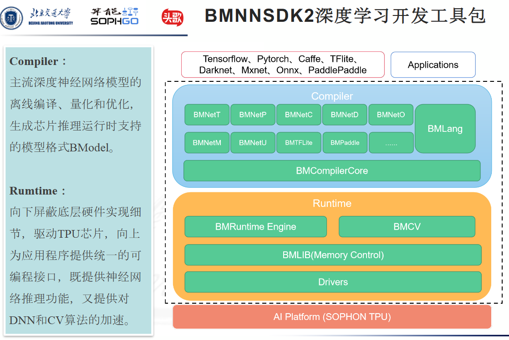
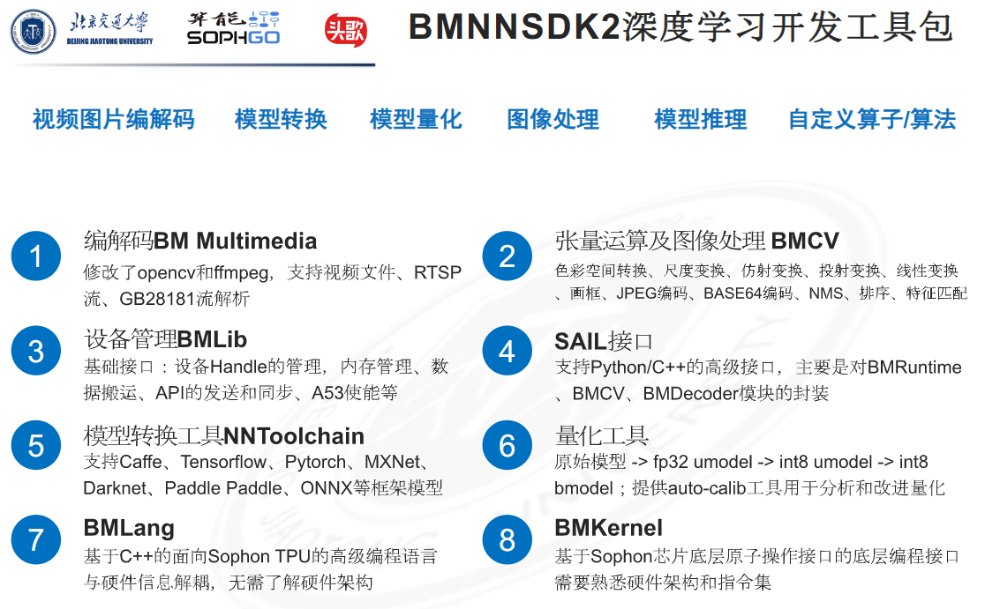
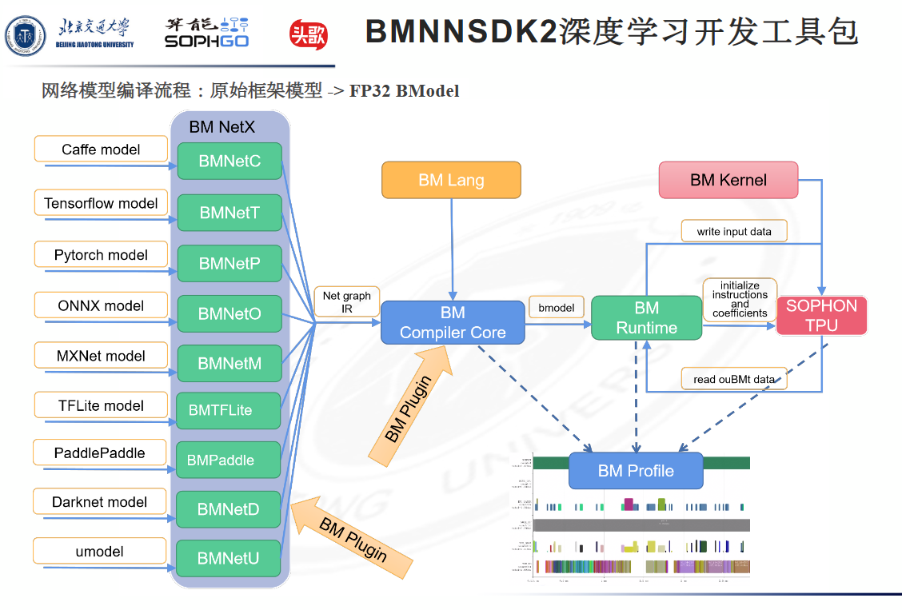

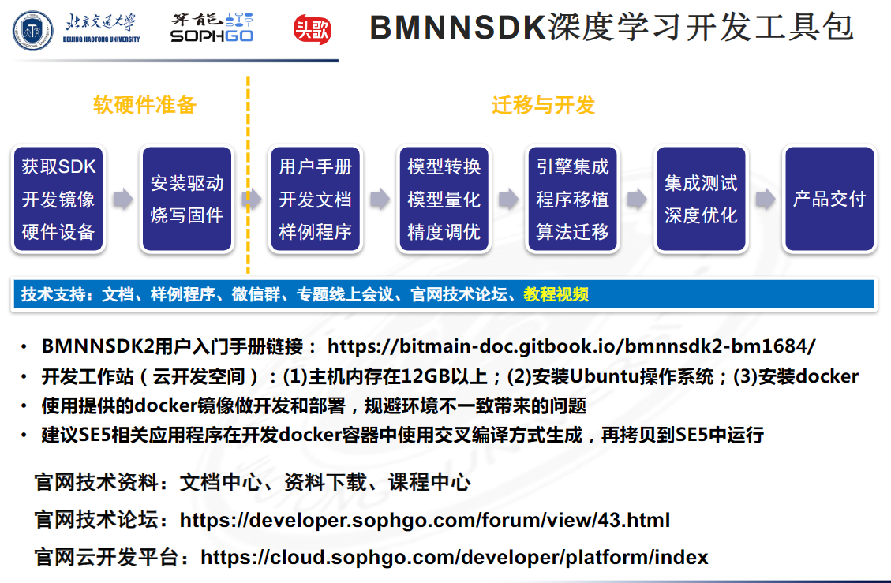